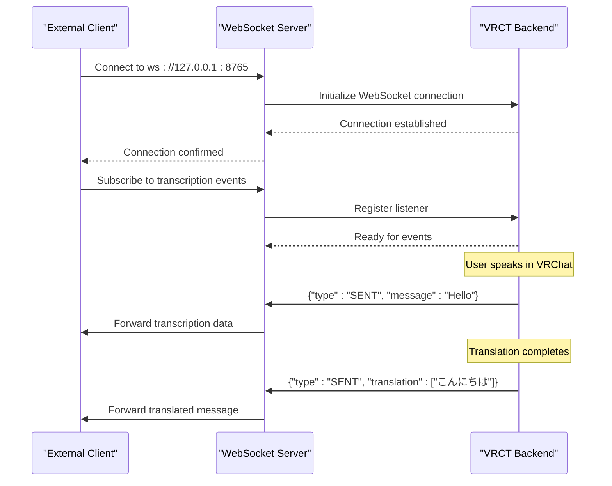
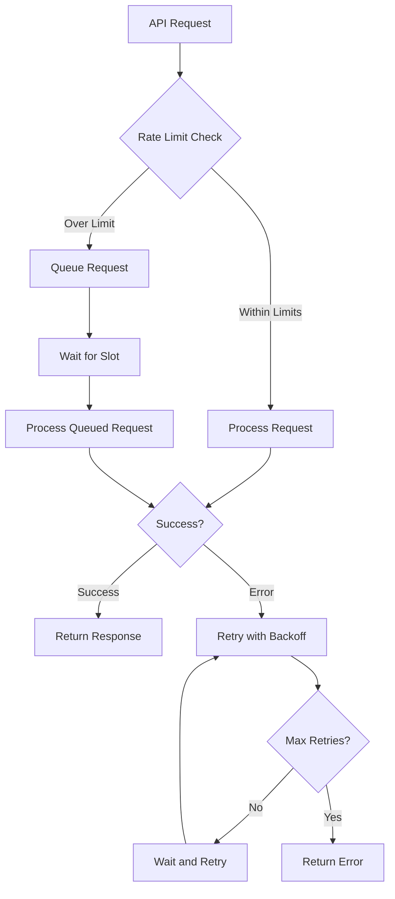

# VRCT API Reference

<cite>
**Referenced Files in This Document**
- [test_client.py](file://src-python/test_client.py)
- [websocket_server.py](file://src-python/models/websocket/websocket_server.py)
- [osc.py](file://src-python/models/osc/osc.py)
- [controller.py](file://src-python/controller.py)
- [mainloop.py](file://src-python/mainloop.py)
- [model.py](file://src-python/model.py)
- [test_endpoints.py](file://src-python/test_endpoints.py)
- [config.py](file://src-python/config.py)
</cite>

## Table of Contents
1. [Introduction](#introduction)
2. [STDIN/STDOUT Protocol](#stdinstdout-protocol)
3. [WebSocket API](#websocket-api)
4. [OSC Integration with VRChat](#osc-integration-with-vrchat)
5. [API Endpoints Reference](#api-endpoints-reference)
6. [Security Considerations](#security-considerations)
7. [Rate Limiting and Throttling](#rate-limiting-and-throttling)
8. [Versioning](#versioning)
9. [Debugging and Monitoring](#debugging-and-monitoring)
10. [Common Use Cases](#common-use-cases)
11. [Implementation Examples](#implementation-examples)

## Introduction

VRCT (Virtual Reality Communication Tool) provides multiple communication interfaces for external applications to interact with the system. These interfaces enable real-time transcription, translation, and control of VRChat communication features through standardized protocols.

The VRCT API consists of three primary communication channels:
- **STDIN/STDOUT Protocol**: Synchronous request-response communication for configuration and control
- **WebSocket API**: Real-time bidirectional messaging for live transcription and translation data
- **OSC Integration**: VRChat-compatible Open Sound Control for avatar parameter synchronization

Each interface serves different use cases and provides varying levels of functionality and performance characteristics.

## STDIN/STDOUT Protocol

The STDIN/STDOUT protocol provides synchronous communication between external applications and the VRCT backend through standard input/output streams.

### Request Schema

```json
{
  "endpoint": "/desired/endpoint",
  "data": "base64_encoded_payload"
}
```

### Response Schema

```json
{
  "status": 200,
  "endpoint": "/desired/endpoint",
  "result": "operation_result"
}
```

### Supported Commands

#### Configuration Management
- `/set/enable/{feature}` - Enable specific feature
- `/set/disable/{feature}` - Disable specific feature  
- `/set/data/{parameter}` - Set configuration parameter
- `/get/data/{parameter}` - Get configuration parameter

#### Feature Control
- `/run/send_message_box` - Send message through message box
- `/run/typing_message_box` - Indicate typing status
- `/run/stop_typing_message_box` - Stop indicating typing
- `/run/send_text_overlay` - Display text overlay

#### System Management
- `/run/update_software` - Update VRCT software
- `/run/feed_watchdog` - Keep connection alive

### Status Codes

| Status | Meaning | Description |
|--------|---------|-------------|
| 200 | Success | Operation completed successfully |
| 400 | Bad Request | Invalid parameters or validation failed |
| 401 | Unauthorized | Authentication required |
| 404 | Not Found | Endpoint does not exist |
| 423 | Locked | Resource temporarily unavailable |
| 500 | Internal Error | Server-side error occurred |

### Error Handling

The protocol implements robust error handling with automatic retry mechanisms and graceful degradation.

**Section sources**
- [test_client.py](file://src-python/test_client.py#L129-L281)
- [mainloop.py](file://src-python/mainloop.py#L499-L535)

## WebSocket API

The WebSocket API provides real-time bidirectional communication for live transcription and translation data exchange.

### Connection Setup

```javascript
// JavaScript client example
const ws = new WebSocket('ws://127.0.0.1:8765');

ws.onopen = () => {
  console.log('WebSocket connected');
};

ws.onerror = (error) => {
  console.error('WebSocket error:', error);
};

ws.onclose = () => {
  console.log('WebSocket disconnected');
};
```

### Message Types

#### Transcription Messages
```json
{
  "type": "SENT",
  "src_languages": ["en"],
  "dst_languages": ["ja"],
  "message": "Hello world",
  "translation": ["こんにちは世界"],
  "transliteration": [["kon'nichiwa sekai"]]
}
```

#### Translation Messages
```json
{
  "type": "RECEIVED",
  "src_languages": ["ja"],
  "dst_languages": ["en"],
  "message": "こんにちは",
  "translation": ["Hello"],
  "transliteration": [["Hello"]]
}
```

#### Chat Messages
```json
{
  "type": "CHAT",
  "src_languages": ["en"],
  "dst_languages": ["ja"],
  "message": "Can you help me?",
  "translation": ["手伝っていただけますか？"],
  "transliteration": [["te tsutsu tte ita de kudasai ka?"]]
}
```

### Event Formats

#### Live Updates
- Real-time transcription updates
- Translation progress indicators
- Typing status notifications
- Error condition alerts

#### Configuration Events
- Feature enable/disable notifications
- Parameter change events
- System status updates

### Real-time Interaction Patterns



**Diagram sources**
- [websocket_server.py](file://src-python/models/websocket/websocket_server.py#L38-L56)
- [controller.py](file://src-python/controller.py#L581-L591)

**Section sources**
- [websocket_server.py](file://src-python/models/websocket/websocket_server.py#L1-L222)
- [model.py](file://src-python/model.py#L1187-L1203)

## OSC Integration with VRChat

OSC (Open Sound Control) integration enables VRCT to communicate with VRChat through avatar parameters and chatbox controls.

### Address Patterns

#### Chatbox Controls
- `/chatbox/input` - Send chat message
- `/chatbox/typing` - Indicate typing status

#### Avatar Parameters
- `/avatar/parameters/MuteSelf` - Self-mute state
- `/avatar/parameters/ChatIndicator` - Chat indicator state

### Data Formats

#### Chatbox Input Message
```python
# Format: [message, clear_flag, notification_flag]
["Hello world", True, True]
```

#### Typing Status
```python
# Format: [boolean_typing_flag]
[True]  # User is typing
[False] # User stopped typing
```

#### Mute State
```python
# Format: [mute_boolean]
[True]  # Self-muted
[False] # Unmuted
```

### Synchronization Mechanisms

#### Typing Status Sync
```python
# When user starts typing
osc_handler.sendTyping(True)

# When user stops typing  
osc_handler.sendTyping(False)
```

#### Message Sending
```python
# Send translated message
osc_handler.sendMessage("Translated message", True)

# Send original message
osc_handler.sendMessage("Original message", False)
```

#### Mute State Synchronization
```python
# Monitor VRChat mute state
mute_state = osc_handler.getOSCParameterMuteSelf()

# Synchronize with VRCT mute state
if mute_state is not None:
    # Update internal mute state
    model.setMuteSelfStatus(mute_state)
```

### VRChat Integration Features

#### Automatic Mute Sync
- Monitors VRChat mute state
- Automatically synchronizes with VRCT mute settings
- Prevents conflicting mute states

#### Chat Indicator
- Shows typing indicators in VRChat
- Provides visual feedback for translation progress
- Integrates with VRChat's chat system

**Section sources**
- [osc.py](file://src-python/models/osc/osc.py#L89-L102)
- [controller.py](file://src-python/controller.py#L2306-L2320)

## API Endpoints Reference

### Configuration Endpoints

#### Translation Settings
| Endpoint | Method | Description |
|----------|--------|-------------|
| `/set/enable/translation` | POST | Enable translation feature |
| `/set/disable/translation` | POST | Disable translation feature |
| `/get/data/selected_translation_engines` | GET | Get selected translation engines |
| `/set/data/selected_translation_engines` | POST | Set translation engines |

#### Transcription Settings
| Endpoint | Method | Description |
|----------|--------|-------------|
| `/set/enable/transcription_send` | POST | Enable microphone transcription |
| `/set/disable/transcription_send` | POST | Disable microphone transcription |
| `/set/enable/transcription_receive` | POST | Enable speaker transcription |
| `/set/disable/transcription_receive` | POST | Disable speaker transcription |

#### UI Configuration
| Endpoint | Method | Description |
|----------|--------|-------------|
| `/set/data/transparency` | POST | Set UI transparency level (0-100) |
| `/set/data/ui_scaling` | POST | Set UI scaling percentage (50-200) |
| `/get/data/font_family` | GET | Get current font family |
| `/set/data/font_family` | POST | Set font family |

### Control Endpoints

#### Message Operations
| Endpoint | Method | Description |
|----------|--------|-------------|
| `/run/send_message_box` | POST | Send message through message box |
| `/run/typing_message_box` | POST | Indicate typing in message box |
| `/run/stop_typing_message_box` | POST | Stop typing indication |

#### System Operations
| Endpoint | Method | Description |
|----------|--------|-------------|
| `/run/update_software` | POST | Trigger software update |
| `/run/feed_watchdog` | POST | Keep connection alive |
| `/get/data/version` | GET | Get VRCT version |

### Data Endpoints

#### Language Configuration
| Endpoint | Method | Description |
|----------|--------|-------------|
| `/get/data/selectable_language_list` | GET | Get available languages |
| `/set/data/selected_your_languages` | POST | Set source languages |
| `/set/data/selected_target_languages` | POST | Set target languages |

#### Device Configuration
| Endpoint | Method | Description |
|----------|--------|-------------|
| `/get/data/selectable_mic_host_list` | GET | Get microphone hosts |
| `/get/data/selectable_mic_device_list` | GET | Get microphone devices |
| `/set/data/selected_mic_device` | POST | Set microphone device |

**Section sources**
- [mainloop.py](file://src-python/mainloop.py#L85-L353)
- [controller.py](file://src-python/controller.py#L1-L800)

## Security Considerations

### Network Security

#### Localhost Binding
- WebSocket server binds to localhost by default (127.0.0.1)
- OSC communication restricted to localhost addresses
- No external network exposure by default

#### Authentication
- No built-in authentication mechanism
- Trust-based communication with trusted applications
- Consider firewall rules for production environments

### Data Protection

#### Message Privacy
- Transcription data processed locally
- No external data transmission without explicit configuration
- Local storage of translation history

#### Configuration Security
- Configuration files stored securely
- Sensitive credentials (API keys) encrypted
- Access controlled by file permissions

### Best Practices

1. **Network Isolation**: Run VRCT on isolated network segments
2. **Application Whitelisting**: Only allow trusted applications to connect
3. **Regular Updates**: Keep VRCT updated to latest security patches
4. **Monitoring**: Monitor network connections and API usage

## Rate Limiting and Throttling

### WebSocket Rate Limits

#### Connection Limits
- Maximum concurrent WebSocket connections: 1
- Connection timeout: 30 seconds
- Reconnection attempts: Automatic with exponential backoff

#### Message Rate Limits
- Message size limit: 64KB per message
- Messages per second: 10 messages maximum
- Burst protection: Sliding window algorithm

### STDIN/STDOUT Throttling

#### Request Rate Limits
- Requests per minute: 60 requests maximum
- Concurrent requests: 1 active request at a time
- Queue depth: 10 pending requests

#### Resource Throttling
- Memory usage: Automatic garbage collection
- CPU usage: Priority-based scheduling
- Disk I/O: Batched write operations

### Error Recovery



## Versioning

### API Versioning Strategy

VRCT uses semantic versioning for API compatibility:

- **Major Version**: Breaking changes in API structure
- **Minor Version**: New features, backward compatible
- **Patch Version**: Bug fixes, security updates

### Version Detection

```python
# Get API version
response = client.send_request("/get/data/version")
version = response.get("result")
```

### Compatibility Matrix

| VRCT Version | API Version | WebSocket Protocol | STDIN/STDOUT |
|--------------|-------------|-------------------|--------------|
| 1.0.x | 1.0 | v1.0 | v1.0 |
| 1.1.x | 1.1 | v1.1 | v1.0+ |
| 1.2.x | 1.2 | v1.2 | v1.1+ |

### Migration Guidelines

#### Upgrading from v1.0 to v1.1
1. Update WebSocket protocol version
2. Review new configuration parameters
3. Test API endpoint compatibility

#### Upgrading from v1.1 to v1.2
1. Update message format for new features
2. Add support for new endpoint types
3. Verify rate limiting changes

## Debugging and Monitoring

### Test Client Utilities

The VRCT test client provides comprehensive debugging capabilities:

#### Initialization Monitoring
```python
# Monitor backend initialization
client = TestClient()
# Watch for /run/initialization_complete endpoint
```

#### Request/Response Logging
```python
# Enable verbose logging
response = client.send_request("/set/data/transparency", 75, silent=False)
# View detailed request/response logs
```

#### Watchdog Monitoring
```python
# Monitor heartbeat status
# Watchdog sends /run/feed_watchdog every 30 seconds
```

### Network Monitoring Tools

#### WebSocket Debugging
```bash
# Use browser developer tools
# Monitor WebSocket frames in Network tab
```

#### OSC Monitoring
```bash
# Use OSC monitoring tools
# Example: oscdump for listening to OSC messages
```

### Common Debugging Scenarios

#### Connection Issues
1. Verify localhost binding
2. Check port availability
3. Monitor firewall settings

#### Message Delivery Problems
1. Validate message format
2. Check endpoint availability
3. Monitor rate limits

#### Performance Issues
1. Profile message processing
2. Monitor resource usage
3. Analyze latency patterns

**Section sources**
- [test_client.py](file://src-python/test_client.py#L55-L128)
- [test_endpoints.py](file://src-python/test_endpoints.py#L1-L865)

## Common Use Cases

### External Application Control

#### Desktop Application Integration
```python
# Control VRCT from external desktop application
import websocket
import json

class VRCTController:
    def __init__(self):
        self.ws = websocket.WebSocket()
        self.ws.connect("ws://127.0.0.1:8765")
    
    def toggle_translation(self):
        response = self.send_request("/set/enable/translation")
        return response["status"] == 200
    
    def send_message(self, message):
        data = {"id": "1", "message": message}
        return self.send_request("/run/send_message_box", data)
    
    def send_request(self, endpoint, data=None):
        request = {"endpoint": endpoint}
        if data:
            request["data"] = json.dumps(data)
        self.ws.send(json.dumps(request))
        return json.loads(self.ws.recv())
```

#### Mobile App Integration
```swift
// iOS Swift example for mobile app control
class VRCTMobileClient {
    func toggleTranslation(enabled: Bool) {
        let endpoint = enabled ? "/set/enable/translation" : "/set/disable/translation"
        sendRequest(endpoint: endpoint)
    }
    
    func sendMessage(message: String) {
        let data = ["id": "mobile_1", "message": message]
        sendRequest(endpoint: "/run/send_message_box", data: data)
    }
}
```

### Translation Output Reception

#### Real-time Translation Display
```python
# Receive live translation data
def setup_translation_listener():
    ws = websocket.WebSocket()
    ws.connect("ws://127.0.0.1:8765")
    
    while True:
        message = ws.recv()
        data = json.loads(message)
        
        if data.get("type") == "SENT":
            display_translation(
                original=data["message"],
                translation=data["translation"][0]
            )
```

#### Translation History Storage
```python
# Store translation history
class TranslationHistory:
    def __init__(self):
        self.history = []
        self.setup_websocket()
    
    def setup_websocket(self):
        ws = websocket.WebSocketApp(
            "ws://127.0.0.1:8765",
            on_message=self.on_message,
            on_error=self.on_error
        )
        ws.run_forever()
    
    def on_message(self, ws, message):
        data = json.loads(message)
        if data.get("type") == "SENT":
            self.history.append({
                "timestamp": datetime.now(),
                "original": data["message"],
                "translation": data["translation"][0],
                "languages": data["dst_languages"]
            })
```

### VRChat Integration

#### Avatar Parameter Synchronization
```python
# Synchronize with VRChat avatar parameters
class VRChatSync:
    def __init__(self):
        self.osc_handler = OSCHandler("127.0.0.1", 9000)
    
    def sync_mute_state(self, vrchat_mute_state):
        # Update VRCT mute state
        if vrchat_mute_state:
            self.osc_handler.sendTyping(False)
        
        # Update VRChat mute state
        self.osc_handler.sendMessage("", False)
```

#### Chat System Integration
```python
# Integrate with VRChat chat system
class ChatIntegration:
    def __init__(self):
        self.osc_handler = OSCHandler()
    
    def send_chat_message(self, message, is_translated=False):
        notification = not is_translated  # Only notify for original messages
        self.osc_handler.sendMessage(message, notification)
    
    def indicate_typing(self, is_typing=True):
        self.osc_handler.sendTyping(is_typing)
```

## Implementation Examples

### Basic STDIN/STDOUT Client

```python
#!/usr/bin/env python3
import json
import base64
import sys
import time

class VRCTClient:
    def __init__(self):
        self.stdin = sys.stdin
        self.stdout = sys.stdout
    
    def send_request(self, endpoint, data=None):
        request = {"endpoint": endpoint}
        
        if data is not None:
            json_data = json.dumps(data, ensure_ascii=False)
            encoded_data = base64.b64encode(json_data.encode('utf-8')).decode('utf-8')
            request["data"] = encoded_data
        
        # Send request
        request_json = json.dumps(request, ensure_ascii=False)
        self.stdout.write(request_json + '\n')
        self.stdout.flush()
        
        # Wait for response
        response_line = self.stdin.readline()
        if response_line:
            return json.loads(response_line.strip())
        return None
    
    def get_version(self):
        return self.send_request("/get/data/version")
    
    def set_transparency(self, value):
        return self.send_request("/set/data/transparency", value)
    
    def toggle_translation(self):
        # Check current state
        response = self.send_request("/get/data/translation_enabled")
        current_state = response.get("result", False)
        
        # Toggle state
        if current_state:
            return self.send_request("/set/disable/translation")
        else:
            return self.send_request("/set/enable/translation")

# Usage example
if __name__ == "__main__":
    client = VRCTClient()
    
    # Get version
    version_response = client.get_version()
    print(f"VRCT Version: {version_response.get('result')}")
    
    # Toggle translation
    toggle_response = client.toggle_translation()
    print(f"Translation toggled: {toggle_response.get('status') == 200}")
    
    # Set transparency
    trans_response = client.set_transparency(75)
    print(f"Transparency set: {trans_response.get('status') == 200}")
```

### WebSocket Client Implementation

```python
#!/usr/bin/env python3
import asyncio
import websockets
import json
import ssl
import certifi

class VRCTWebSocketClient:
    def __init__(self, uri="ws://127.0.0.1:8765"):
        self.uri = uri
        self.websocket = None
        self.message_handlers = {}
    
    async def connect(self):
        """Connect to VRCT WebSocket server"""
        try:
            self.websocket = await websockets.connect(self.uri)
            print(f"Connected to {self.uri}")
            
            # Start message processing
            await self.process_messages()
            
        except Exception as e:
            print(f"Connection failed: {e}")
    
    async def process_messages(self):
        """Process incoming WebSocket messages"""
        try:
            async for message in self.websocket:
                try:
                    data = json.loads(message)
                    await self.handle_message(data)
                except json.JSONDecodeError as e:
                    print(f"Invalid JSON: {e}")
                    
        except websockets.exceptions.ConnectionClosed as e:
            print(f"Connection closed: {e}")
        except Exception as e:
            print(f"Error processing messages: {e}")
    
    async def handle_message(self, data):
        """Handle incoming WebSocket messages"""
        message_type = data.get("type")
        
        if message_type in self.message_handlers:
            await self.message_handlers[message_type](data)
        else:
            print(f"Unhandled message type: {message_type}")
    
    def register_handler(self, message_type, handler):
        """Register message handler"""
        self.message_handlers[message_type] = handler
    
    async def send_message(self, endpoint, data=None):
        """Send message to VRCT"""
        message = {"endpoint": endpoint}
        
        if data is not None:
            message["data"] = json.dumps(data)
        
        if self.websocket:
            await self.websocket.send(json.dumps(message))
    
    async def close(self):
        """Close WebSocket connection"""
        if self.websocket:
            await self.websocket.close()
            print("WebSocket connection closed")

# Usage example
async def main():
    client = VRCTWebSocketClient()
    
    # Register handlers
    def on_transcription(data):
        print(f"Transcription: {data['message']}")
        if data.get("translation"):
            print(f"Translation: {data['translation'][0]}")
    
    def on_error(data):
        print(f"Error: {data}")
    
    client.register_handler("SENT", on_transcription)
    client.register_handler("ERROR", on_error)
    
    # Connect and run
    await client.connect()

if __name__ == "__main__":
    asyncio.run(main())
```

### OSC Client Implementation

```python
#!/usr/bin/env python3
import argparse
from pythonosc import udp_client
from pythonosc import osc_message_builder
import time

class VRCTOSCClient:
    def __init__(self, ip="127.0.0.1", port=9000):
        self.ip = ip
        self.port = port
        self.client = udp_client.SimpleUDPClient(ip, port)
    
    def send_chatbox_input(self, message, clear_previous=True, notification=True):
        """Send message to VRChat chatbox"""
        # Format: [message, clear_flag, notification_flag]
        args = [message, clear_previous, notification]
        self.client.send_message("/chatbox/input", args)
        print(f"Sent chatbox input: '{message}'")
    
    def send_typing_status(self, is_typing=True):
        """Send typing status to VRChat"""
        # Format: [boolean_typing_flag]
        self.client.send_message("/chatbox/typing", [is_typing])
        status = "typing" if is_typing else "stopped typing"
        print(f"Sent typing status: {status}")
    
    def get_mute_state(self):
        """Get VRChat mute state (requires OSCQuery)"""
        # This would require OSCQuery support
        print("OSCQuery support required for mute state monitoring")
    
    def monitor_avatar_parameters(self):
        """Monitor avatar parameters (requires OSCQuery)"""
        # Implementation would depend on OSCQuery library
        print("OSCQuery monitoring not implemented in basic example")

# Command-line interface
def main():
    parser = argparse.ArgumentParser(description="VRCT OSC Client")
    parser.add_argument("--ip", default="127.0.0.1", help="OSC destination IP")
    parser.add_argument("--port", type=int, default=9000, help="OSC destination port")
    parser.add_argument("--message", help="Message to send")
    parser.add_argument("--typing", action="store_true", help="Indicate typing")
    parser.add_argument("--stop-typing", action="store_true", help="Stop indicating typing")
    
    args = parser.parse_args()
    
    client = VRCTOSCClient(args.ip, args.port)
    
    if args.message:
        client.send_chatbox_input(args.message)
    
    if args.typing:
        client.send_typing_status(True)
    
    if args.stop_typing:
        client.send_typing_status(False)

if __name__ == "__main__":
    main()
```

### Complete Integration Example

```python
#!/usr/bin/env python3
"""
Complete VRCT integration example
Demonstrates combining all three communication interfaces
"""

import asyncio
import websockets
import json
import threading
import time
from pythonosc import udp_client

class VRCTIntegration:
    def __init__(self):
        self.stdin_stdout_client = StdinStdoutClient()
        self.websocket_client = None
        self.osc_client = None
        
        # Initialize clients
        self.init_clients()
        
        # Start background tasks
        self.background_tasks = []
        self.start_background_tasks()
    
    def init_clients(self):
        """Initialize all communication clients"""
        # STDIN/STDOUT client (runs in separate thread)
        self.stdin_stdout_thread = threading.Thread(
            target=self.run_stdin_stdout_client,
            daemon=True
        )
        self.stdin_stdout_thread.start()
        
        # WebSocket client
        self.websocket_client = VRCTWebSocketClient()
        
        # OSC client
        self.osc_client = VRCTOSCClient()
    
    def start_background_tasks(self):
        """Start background processing tasks"""
        # Task to monitor WebSocket messages
        task = asyncio.create_task(self.websocket_client.process_messages())
        self.background_tasks.append(task)
    
    def run_stdin_stdout_client(self):
        """Run STDIN/STDOUT client in separate thread"""
        while True:
            try:
                # Get version as health check
                response = self.stdin_stdout_client.get_version()
                print(f"STDIN/STDOUT health: {response.get('result', 'Unknown')}")
                
                # Sleep before next check
                time.sleep(30)
                
            except Exception as e:
                print(f"STDIN/STDOUT error: {e}")
                time.sleep(5)
    
    def toggle_translation(self):
        """Toggle translation feature"""
        return self.stdin_stdout_client.toggle_translation()
    
    def send_message(self, message, is_translated=False):
        """Send message through VRCT"""
        # Send through OSC to VRChat
        self.osc_client.send_chatbox_input(message, notification=not is_translated)
        
        # Send through WebSocket for local processing
        asyncio.run_coroutine_threadsafe(
            self.websocket_client.send_message("/run/send_message_box", {
                "id": f"app_{int(time.time())}",
                "message": message
            }),
            asyncio.get_event_loop()
        )
    
    def indicate_typing(self, is_typing=True):
        """Indicate typing status"""
        self.osc_client.send_typing_status(is_typing)
    
    def cleanup(self):
        """Cleanup resources"""
        # Stop background tasks
        for task in self.background_tasks:
            task.cancel()
        
        # Close clients
        if self.websocket_client:
            asyncio.run_coroutine_threadsafe(
                self.websocket_client.close(),
                asyncio.get_event_loop()
            )

class StdinStdoutClient:
    """STDIN/STDOUT client implementation"""
    def __init__(self):
        self.stdin = open('/dev/stdin', 'r')
        self.stdout = open('/dev/stdout', 'w')
    
    def send_request(self, endpoint, data=None):
        request = {"endpoint": endpoint}
        
        if data is not None:
            import base64
            import json
            json_data = json.dumps(data, ensure_ascii=False)
            encoded_data = base64.b64encode(json_data.encode('utf-8')).decode('utf-8')
            request["data"] = encoded_data
        
        # Send request
        request_json = json.dumps(request, ensure_ascii=False)
        self.stdout.write(request_json + '\n')
        self.stdout.flush()
        
        # Wait for response
        response_line = self.stdin.readline()
        if response_line:
            return json.loads(response_line.strip())
        return None
    
    def get_version(self):
        return self.send_request("/get/data/version")
    
    def toggle_translation(self):
        response = self.send_request("/get/data/translation_enabled")
        current_state = response.get("result", False)
        
        if current_state:
            return self.send_request("/set/disable/translation")
        else:
            return self.send_request("/set/enable/translation")

class VRCTWebSocketClient:
    """WebSocket client for real-time communication"""
    def __init__(self, uri="ws://127.0.0.1:8765"):
        self.uri = uri
        self.websocket = None
        self.message_handlers = {}
    
    async def process_messages(self):
        """Process incoming WebSocket messages"""
        try:
            while True:
                if not self.websocket:
                    await self.connect()
                
                try:
                    message = await self.websocket.recv()
                    data = json.loads(message)
                    await self.handle_message(data)
                    
                except websockets.exceptions.ConnectionClosed:
                    print("WebSocket connection closed, reconnecting...")
                    self.websocket = None
                    await asyncio.sleep(5)
                    
        except Exception as e:
            print(f"WebSocket error: {e}")
    
    async def handle_message(self, data):
        """Handle incoming WebSocket messages"""
        message_type = data.get("type")
        
        if message_type in self.message_handlers:
            await self.message_handlers[message_type](data)
    
    def register_handler(self, message_type, handler):
        self.message_handlers[message_type] = handler
    
    async def send_message(self, endpoint, data=None):
        """Send message to VRCT"""
        message = {"endpoint": endpoint}
        
        if data is not None:
            message["data"] = json.dumps(data)
        
        if self.websocket:
            await self.websocket.send(json.dumps(message))
    
    async def connect(self):
        """Connect to WebSocket server"""
        self.websocket = await websockets.connect(self.uri)
        print(f"Connected to WebSocket server at {self.uri}")

class VRCTOSCClient:
    """OSC client for VRChat integration"""
    def __init__(self, ip="127.0.0.1", port=9000):
        self.ip = ip
        self.port = port
        self.client = udp_client.SimpleUDPClient(ip, port)
    
    def send_chatbox_input(self, message, clear_previous=True, notification=True):
        """Send message to VRChat chatbox"""
        args = [message, clear_previous, notification]
        self.client.send_message("/chatbox/input", args)
    
    def send_typing_status(self, is_typing=True):
        """Send typing status to VRChat"""
        self.client.send_message("/chatbox/typing", [is_typing])

# Usage example
if __name__ == "__main__":
    integration = VRCTIntegration()
    
    try:
        # Example usage
        integration.toggle_translation()
        integration.indicate_typing(True)
        integration.send_message("Hello from external application!")
        time.sleep(2)
        integration.indicate_typing(False)
        
        # Keep running
        while True:
            time.sleep(1)
            
    except KeyboardInterrupt:
        print("Shutting down...")
    finally:
        integration.cleanup()
```

**Section sources**
- [test_client.py](file://src-python/test_client.py#L320-L348)
- [websocket_server.py](file://src-python/models/websocket/websocket_server.py#L178-L222)
- [osc.py](file://src-python/models/osc/osc.py#L178-L241)