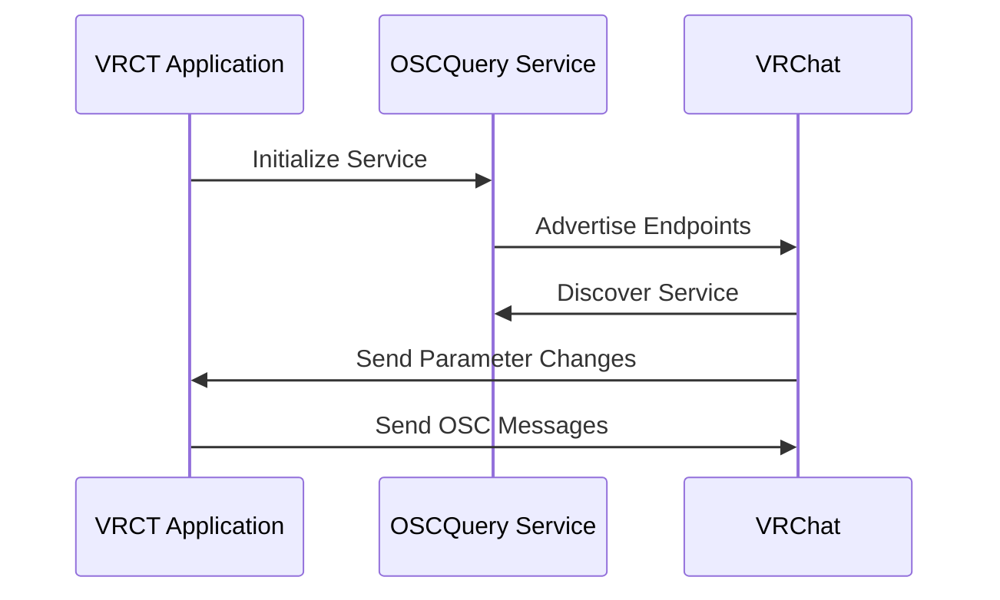
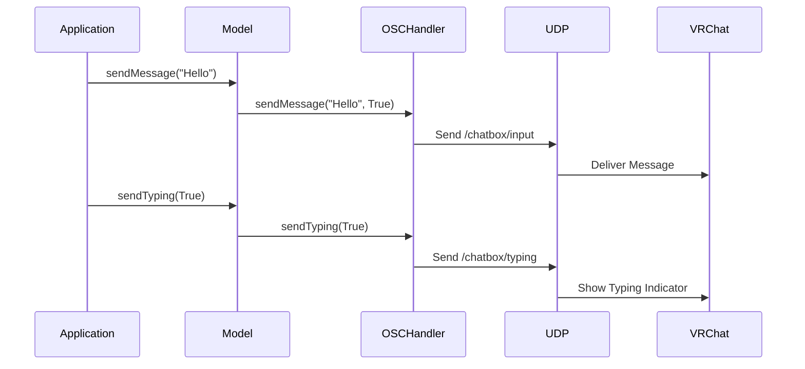
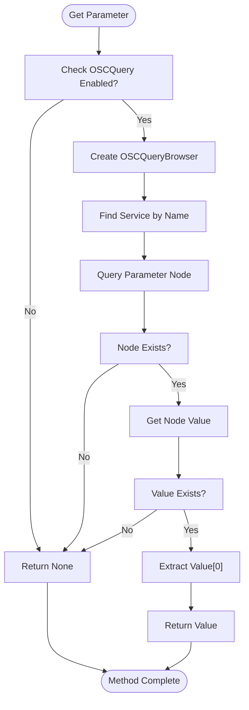
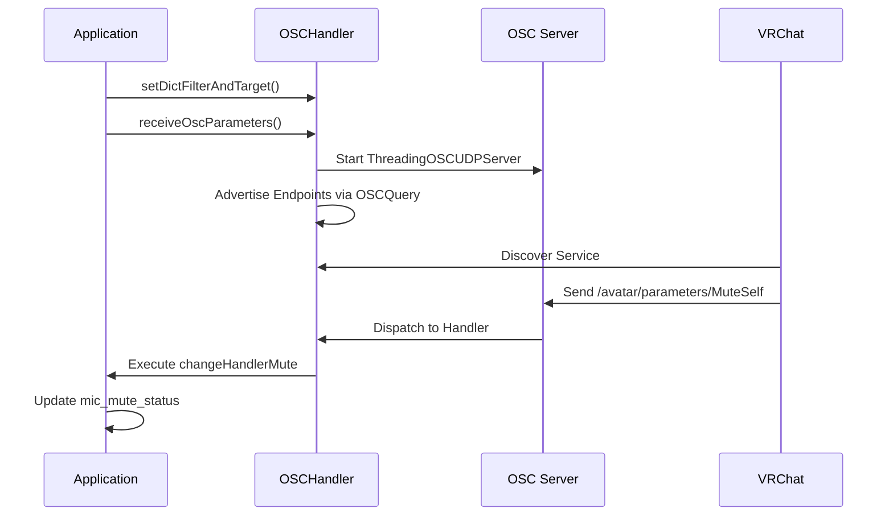
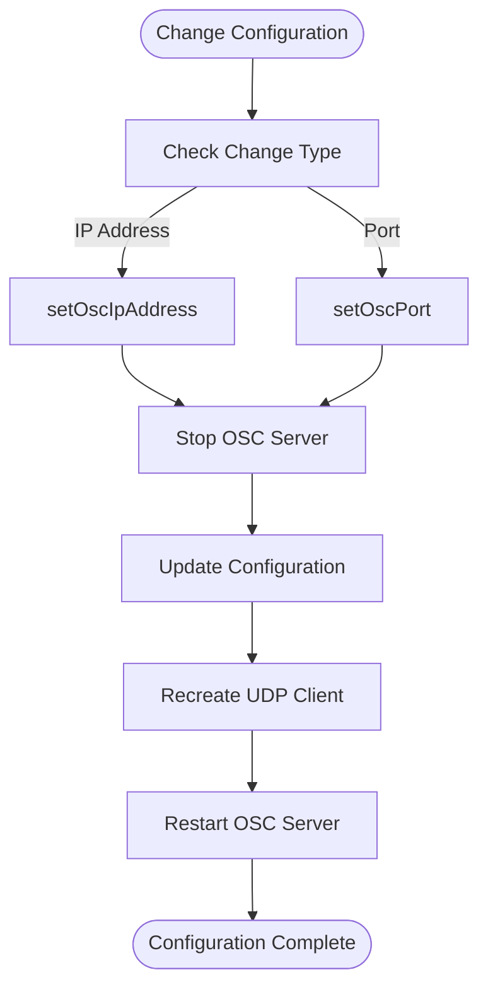

# OSC Integration

<cite>
**Referenced Files in This Document**   
- [osc.py](file://src-python/models/osc/osc.py)
- [model.py](file://src-python/model.py)
- [controller.py](file://src-python/controller.py)
- [config.py](file://src-python/config.py)
- [osc.md](file://src-python/docs/details/osc.md)
- [AdvancedSettings.jsx](file://src-ui/views/app/config_page/setting_section/setting_box/advanced_settings/AdvancedSettings.jsx)
- [useHandleOscQuery.js](file://src-ui/logics/common/useHandleOscQuery.js)
</cite>

## Table of Contents
1. [Introduction](#introduction)
2. [Standard OSC Endpoints](#standard-osc-endpoints)
3. [OSCQuery Implementation](#oscquery-implementation)
4. [Message Sending Methods](#message-sending-methods)
5. [Parameter Retrieval Methods](#parameter-retrieval-methods)
6. [Setting Up OSC Handlers](#setting-up-osc-handlers)
7. [Configuration and Reinitialization](#configuration-and-reinitialization)
8. [Error Handling and Troubleshooting](#error-handling-and-troubleshooting)
9. [Firewall Configuration](#firewall-configuration)

## Introduction

The VRCT application provides comprehensive OSC (Open Sound Control) integration with VRChat, enabling bidirectional communication between the two applications. This documentation details the OSC endpoints, data formats, transport protocols, and implementation details for sending messages, monitoring typing indicators, and tracking microphone mute status. The integration supports both standard OSC communication and advanced OSCQuery functionality for service discovery and parameter monitoring.

**Section sources**
- [osc.py](file://src-python/models/osc/osc.py#L1-L241)
- [osc.md](file://src-python/docs/details/osc.md#L1-L469)

## Standard OSC Endpoints

VRCT implements three primary OSC endpoints for communication with VRChat:

### /chatbox/input
This endpoint sends text messages to the VRChat chatbox. The data format is a string containing the message content. When sending a message, the OSC message includes three parameters:
- Message text (string)
- Clear flag (boolean, always True)
- Notification flag (boolean, controlled by NOTIFICATION_VRC_SFX configuration)

The endpoint is defined in the OSCHandler class as:
```python
self.osc_parameter_chatbox_input: str = "/chatbox/input"
```

### /chatbox/typing
This endpoint controls the typing indicator in VRChat. The data format is a boolean value where:
- True: Shows the typing indicator
- False: Hides the typing indicator

The endpoint is defined in the OSCHandler class as:
```python
self.osc_parameter_chatbox_typing: str = "/chatbox/typing"
```

### /avatar/parameters/MuteSelf
This endpoint monitors the microphone mute status in VRChat. The data format is a boolean value representing the current mute state:
- True: Microphone is muted
- False: Microphone is unmuted

The endpoint is defined in the OSCHandler class as:
```python
self.osc_parameter_muteself: str = "/avatar/parameters/MuteSelf"
```

All OSC communication uses UDP transport protocol on port 9000 by default. The UDP client is initialized in the OSCHandler constructor:
```python
self.udp_client = udp_client.SimpleUDPClient(self.osc_ip_address, self.osc_port)
```

**Section sources**
- [osc.py](file://src-python/models/osc/osc.py#L54-L57)
- [osc.py](file://src-python/models/osc/osc.py#L90-L102)

## OSCQuery Implementation

OSCQuery provides enhanced functionality for local connections, enabling service discovery and bidirectional communication.

### Automatic Enablement
OSCQuery is automatically enabled when connecting to localhost (127.0.0.1) or localhost domain name. This is implemented in the OSCHandler constructor:
```python
self.is_osc_query_enabled: bool = ip_address in ["127.0.0.1", "localhost"]
```

When connecting to remote IP addresses, OSCQuery is automatically disabled for security and compatibility reasons.

### Service Discovery
The OSCQuery implementation allows VRCT to advertise its services and endpoints to VRChat. The service is initialized with:
- Service name: "VRCT"
- HTTP port: Dynamically assigned
- OSC server port: Dynamically assigned

The service advertisement is handled by the receiveOscParameters method, which creates an OSCQueryService instance and advertises the configured endpoints.

### Bidirectional Communication
OSCQuery enables VRCT to receive parameter changes from VRChat. The implementation supports:
- Real-time parameter monitoring
- Event-driven handling of parameter changes
- Dynamic endpoint registration

The bidirectional communication is established by creating a local OSC server that listens for incoming messages from VRChat.



**Diagram sources**
- [osc.py](file://src-python/models/osc/osc.py#L154-L185)
- [osc.py](file://src-python/models/osc/osc.py#L48-L64)

**Section sources**
- [osc.py](file://src-python/models/osc/osc.py#L50-L51)
- [osc.py](file://src-python/models/osc/osc.py#L160-L185)

## Message Sending Methods

VRCT provides two primary methods for sending messages to VRChat through the OSC interface.

### sendMessage
The sendMessage method sends text to the VRChat chatbox. It accepts two parameters:
- message (str): The text message to send
- notification (bool): Whether to play notification sounds and effects

The method implementation:
```python
def sendMessage(self, message: str = "", notification: bool = True) -> None
```

When called, it sends an OSC message to the /chatbox/input endpoint with the message content and notification flag. The method only sends messages when the message string is non-empty.

### sendTyping
The sendTyping method controls the typing indicator in VRChat. It accepts one parameter:
- flag (bool): True to show typing indicator, False to hide it

The method implementation:
```python
def sendTyping(self, flag: bool = False) -> None
```

This method sends a boolean value to the /chatbox/typing endpoint, which displays or hides the typing indicator in VRChat accordingly.

Both methods are wrapped in the model class for application-wide use:
```python
def oscSendMessage(self, message:str)
def oscStartSendTyping(self)
def oscStopSendTyping(self)
```



**Diagram sources**
- [osc.py](file://src-python/models/osc/osc.py#L88-L94)
- [osc.py](file://src-python/models/osc/osc.py#L93-L102)
- [model.py](file://src-python/model.py#L482-L484)

**Section sources**
- [osc.py](file://src-python/models/osc/osc.py#L88-L102)
- [model.py](file://src-python/model.py#L474-L484)

## Parameter Retrieval Methods

VRCT provides methods to retrieve parameter values from VRChat using OSCQuery.

### getOSCParameterMuteSelf
This method retrieves the current microphone mute status from VRChat. It returns:
- True: If the microphone is muted
- False: If the microphone is unmuted
- None: If the parameter cannot be retrieved

The method implementation:
```python
def getOSCParameterMuteSelf(self) -> Optional[bool]
```

This is a convenience method that specifically targets the MuteSelf parameter.

### getOSCParameterValue
This method retrieves the value of any OSC parameter by address. It accepts one parameter:
- address (str): The OSC address of the parameter to retrieve

The method implementation:
```python
def getOSCParameterValue(self, address: str) -> Any
```

This method uses OSCQuery to query the specified parameter from VRChat. It returns the parameter value or None if the query fails.

Both methods are conditional on OSCQuery being enabled. If OSCQuery is disabled (when not connected to localhost), these methods return None.

The parameter retrieval process includes:
1. Checking if OSCQuery is enabled
2. Creating or reusing an OSCQueryBrowser instance
3. Finding the target service by name
4. Querying the specific parameter node
5. Extracting and returning the parameter value



**Diagram sources**
- [osc.py](file://src-python/models/osc/osc.py#L103-L144)
- [osc.py](file://src-python/models/osc/osc.py#L146-L148)

**Section sources**
- [osc.py](file://src-python/models/osc/osc.py#L103-L148)

## Setting Up OSC Handlers

To receive parameter changes from VRChat, OSC handlers must be configured and the OSC server started.

### Handler Configuration
The process involves:
1. Defining handler functions for specific parameters
2. Creating a dictionary mapping OSC addresses to handler functions
3. Setting the handler dictionary in the OSCHandler
4. Starting the OSC server

Example implementation:
```python
def changeHandlerMute(address, osc_arguments):
    if config.ENABLE_TRANSCRIPTION_SEND is True:
        self.mic_mute_status = osc_arguments[0]
        self.changeMicTranscriptStatus()

dict_filter_and_target = {
    self.osc_handler.osc_parameter_muteself: changeHandlerMute,
}
self.osc_handler.setDictFilterAndTarget(dict_filter_and_target)
```

### Starting the OSC Server
The OSC server is started using the receiveOscParameters method:
```python
self.osc_handler.receiveOscParameters()
```

This method:
1. Checks if OSCQuery is enabled
2. Allocates open UDP and TCP ports
3. Creates an OSC dispatcher
4. Maps the configured handlers to their addresses
5. Starts the OSC server on a separate thread
6. Advertises the endpoints via OSCQuery

### Complete Example
```python
def startReceiveOSC(self):
    def changeHandlerMute(address, osc_arguments):
        if config.ENABLE_TRANSCRIPTION_SEND is True:
            self.mic_mute_status = osc_arguments[0]
            self.changeMicTranscriptStatus()
    
    dict_filter_and_target = {
        self.osc_handler.osc_parameter_muteself: changeHandlerMute,
    }
    self.osc_handler.setDictFilterAndTarget(dict_filter_and_target)
    self.osc_handler.receiveOscParameters()
```

The handler will receive updates whenever the MuteSelf parameter changes in VRChat, allowing the application to synchronize its state with VRChat.



**Diagram sources**
- [osc.py](file://src-python/models/osc/osc.py#L150-L153)
- [osc.py](file://src-python/models/osc/osc.py#L154-L185)
- [model.py](file://src-python/model.py#L490-L505)

**Section sources**
- [osc.py](file://src-python/models/osc/osc.py#L150-L185)
- [model.py](file://src-python/model.py#L490-L505)

## Configuration and Reinitialization

The OSC integration supports dynamic configuration changes with automatic service reinitialization.

### IP Address Changes
When changing the OSC target IP address, the service is automatically reinitialized:
```python
def setOscIpAddress(self, ip_address: str) -> None
```

The method:
1. Updates the is_osc_query_enabled flag based on the new IP
2. Stops the current OSC server
3. Updates the OSC IP address
4. Recreates the UDP client
5. Restarts the OSC server with receiveOscParameters

This ensures that OSCQuery is automatically enabled or disabled based on whether the connection is local.

### Port Changes
When changing the OSC port, similar reinitialization occurs:
```python
def setOscPort(self, port: int) -> None
```

The method:
1. Stops the current OSC server
2. Updates the OSC port
3. Recreates the UDP client
4. Restarts the OSC server

### Configuration Flow


The reinitialization process ensures that all components are properly configured for the new settings, including enabling or disabling OSCQuery functionality based on the connection type.

**Section sources**
- [osc.py](file://src-python/models/osc/osc.py#L72-L87)
- [model.py](file://src-python/model.py#L465-L472)
- [controller.py](file://src-python/controller.py#L1509-L1522)

## Error Handling and Troubleshooting

The OSC integration includes comprehensive error handling and troubleshooting capabilities.

### Missing Dependencies
The implementation gracefully handles missing OSCQuery dependencies:
```python
try:
    from tinyoscquery.queryservice import OSCQueryService
    from tinyoscquery.query import OSCQueryBrowser, OSCQueryClient
    from tinyoscquery.utility import get_open_udp_port, get_open_tcp_port
    from tinyoscquery.shared.node import OSCAccess
except Exception:
    OSCQueryService = None
    OSCQueryBrowser = None
    OSCQueryClient = None
    def get_open_udp_port() -> int: return 0
    def get_open_tcp_port() -> int: return 0
    OSCAccess = None
```

When these dependencies are missing, OSCQuery functionality is disabled, but basic OSC messaging remains available.

### Error Logging
Comprehensive error logging is implemented throughout the OSC handlers:
```python
try:
    # OSC operations
except Exception:
    errorLogging()
```

Errors are logged with full traceback information, aiding in troubleshooting.

### Connection Issues
Common connection issues include:
- Incorrect IP address configuration
- Port conflicts
- Firewall blocking
- Network connectivity issues

The application provides feedback through:
- Status indicators in the UI
- Error notifications
- Log messages

When IP address changes fail, the application reverts to the previous configuration and notifies the user.

### Troubleshooting Tips
1. Verify the OSC IP address matches VRChat's OSC settings
2. Ensure the port number (default 9000) is not blocked
3. Check that VRChat's OSC functionality is enabled
4. For localhost connections, ensure OSCQuery dependencies are installed
5. Verify network connectivity between VRCT and VRChat
6. Check firewall settings to ensure UDP traffic is allowed

The UI provides real-time feedback on OSCQuery status, with warnings when functionality is disabled due to non-localhost connections.

**Section sources**
- [osc.py](file://src-python/models/osc/osc.py#L15-L31)
- [osc.py](file://src-python/models/osc/osc.py#L132-L144)
- [controller.py](file://src-python/controller.py#L1522-L1530)
- [useHandleOscQuery.js](file://src-ui/logics/common/useHandleOscQuery.js#L1-L38)

## Firewall Configuration

Proper firewall configuration is essential for OSC communication between VRCT and VRChat.

### Required Settings
The firewall must allow:
- UDP traffic on port 9000 (or configured port)
- Both inbound and outbound connections
- Traffic between VRCT and VRChat processes

### Windows Firewall
For Windows users:
1. Open Windows Defender Firewall with Advanced Security
2. Create new inbound and outbound rules
3. Select "Port" rule type
4. Choose UDP protocol
5. Specify port 9000 (or custom port)
6. Allow the connection
7. Apply to all network types (Domain, Private, Public)
8. Name the rule "VRCT-VRChat OSC"

### Router Configuration
If connecting across networks:
- Ensure UDP port 9000 is forwarded to the VRChat machine
- Configure any network firewalls to allow the traffic
- Consider using static IP addresses for reliability

### Testing Connectivity
To verify firewall configuration:
1. Use network diagnostic tools to test UDP connectivity
2. Check VRChat's OSC settings page for connection status
3. Monitor VRCT logs for OSC error messages
4. Test with simple message sending

The application automatically handles localhost connections differently, enabling OSCQuery functionality only when appropriate, which reduces the firewall configuration requirements for local use cases.

**Section sources**
- [osc.py](file://src-python/models/osc/osc.py#L48-L53)
- [AdvancedSettings.jsx](file://src-ui/views/app/config_page/setting_section/setting_box/advanced_settings/AdvancedSettings.jsx#L37-L90)