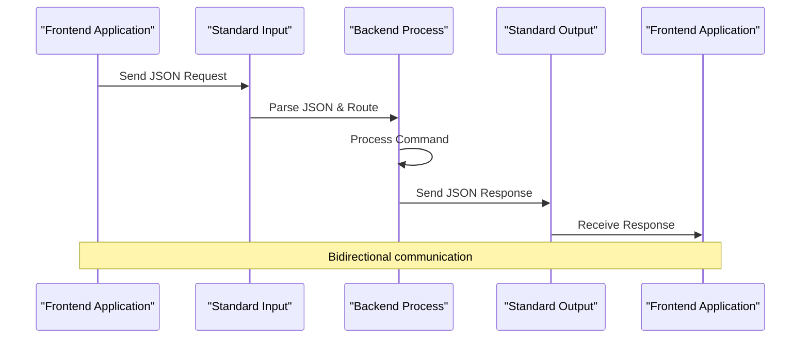
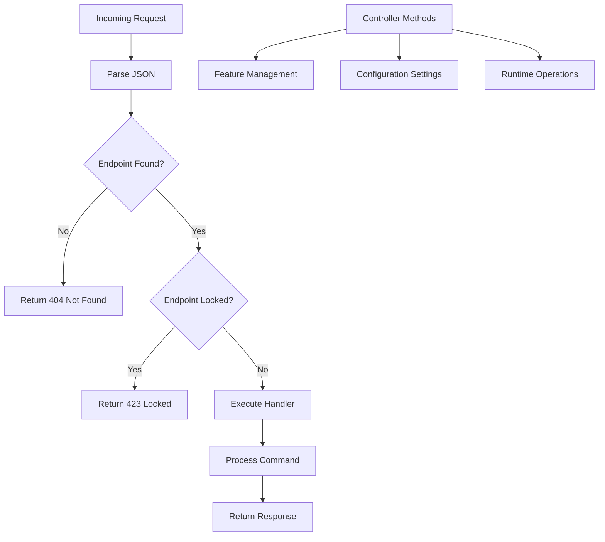
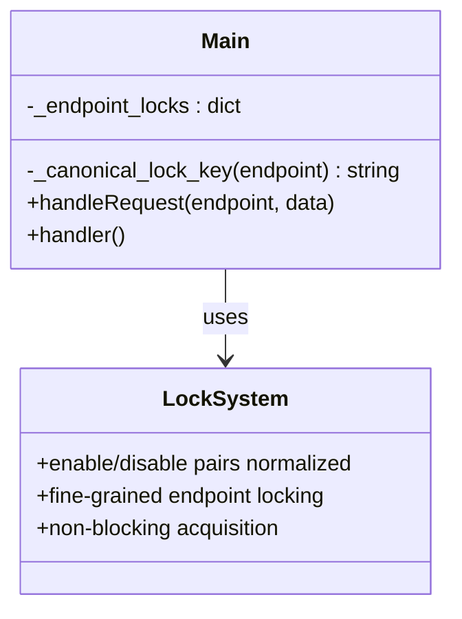
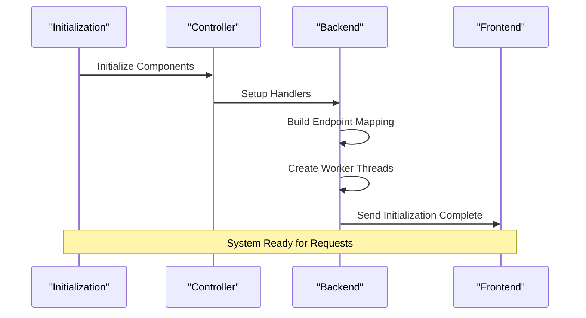
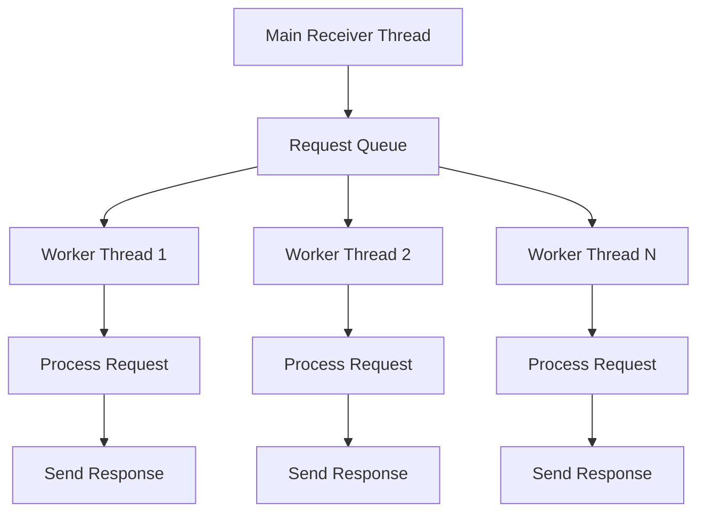
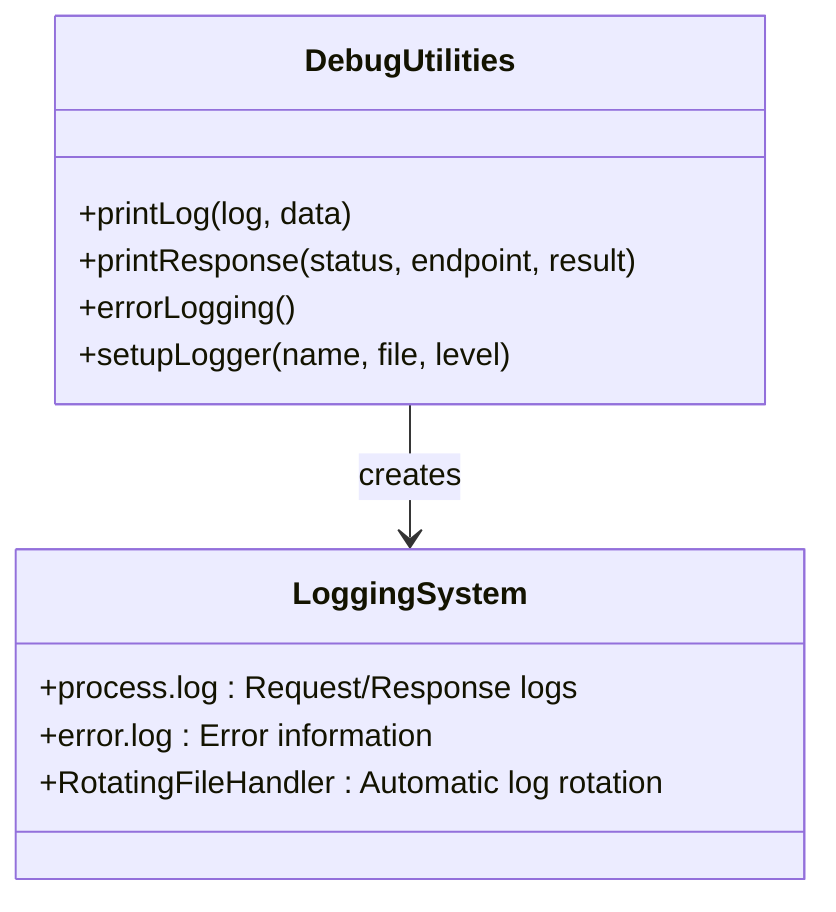

# STDIN/STDOUT Protocol API Documentation

<cite>
**Referenced Files in This Document**
- [mainloop.py](file://src-python/mainloop.py)
- [controller.py](file://src-python/controller.py)
- [utils.py](file://src-python/utils.py)
- [test_client.py](file://src-python/test_client.py)
- [test_endpoints.py](file://src-python/test_endpoints.py)
- [model.py](file://src-python/model.py)
</cite>

## Table of Contents
1. [Introduction](#introduction)
2. [Protocol Overview](#protocol-overview)
3. [Request Format](#request-format)
4. [Response Format](#response-format)
5. [Command Routing System](#command-routing-system)
6. [Thread Safety and Locking](#thread-safety-and-locking)
7. [Initialization Sequence](#initialization-sequence)
8. [Error Handling](#error-handling)
9. [Worker Thread Model](#worker-thread-model)
10. [Common Commands](#common-commands)
11. [Status Codes](#status-codes)
12. [Base64 Encoding Mechanism](#base64-encoding-mechanism)
13. [Debugging Utilities](#debugging-utilities)
14. [Implementation Examples](#implementation-examples)

## Introduction

VRCT's STDIN/STDOUT JSON-based communication protocol enables bidirectional communication between the frontend and backend components. This protocol facilitates configuration management, real-time data exchange, and control operations through a standardized JSON-based interface over standard input/output streams.

The protocol operates on a request-response model where the frontend sends JSON-formatted requests to the backend, and the backend responds with structured JSON responses containing status codes, endpoints, and result data.

## Protocol Overview

The protocol follows a simple yet robust architecture:



**Diagram sources**
- [mainloop.py](file://src-python/mainloop.py#L439-L464)
- [utils.py](file://src-python/utils.py#L242-L275)

## Request Format

Requests are sent to the backend as JSON objects through standard input with the following structure:

```json
{
    "endpoint": "/desired/command",
    "data": {
        "parameter1": "value1",
        "parameter2": "value2"
    }
}
```

### Request Fields

| Field | Type | Required | Description |
|-------|------|----------|-------------|
| `endpoint` | string | Yes | The command endpoint to execute |
| `data` | object/array/string/number/boolean/null | No | Additional data for the command |

### Endpoint Structure

Endpoints follow a hierarchical naming convention:
- `/set/enable/{feature}` - Enable a feature
- `/set/disable/{feature}` - Disable a feature  
- `/get/data/{setting}` - Retrieve configuration data
- `/set/data/{setting}` - Set configuration data
- `/run/{operation}` - Execute runtime operation

**Section sources**
- [mainloop.py](file://src-python/mainloop.py#L85-L401)

## Response Format

Responses are returned as JSON objects through standard output with the following structure:

```json
{
    "status": 200,
    "endpoint": "/desired/command",
    "result": {
        "success": true,
        "data": "response_value"
    }
}
```

### Response Fields

| Field | Type | Description |
|-------|------|-------------|
| `status` | integer | HTTP-like status code indicating operation result |
| `endpoint` | string | The original endpoint that was executed |
| `result` | any | The result of the command execution |

**Section sources**
- [utils.py](file://src-python/utils.py#L242-L275)

## Command Routing System

The command routing system in `mainloop.py` maps endpoints to controller methods using a sophisticated mapping mechanism:



**Diagram sources**
- [mainloop.py](file://src-python/mainloop.py#L471-L493)

### Mapping Structure

The routing system uses two primary mappings:

1. **Primary Mapping (`mapping`)**: Contains all available endpoints with their handlers
2. **Run Mapping (`run_mapping`)**: Contains special runtime notification endpoints

Each mapping entry includes:
- `status`: Boolean indicating if the endpoint is available
- `variable`: Reference to the controller method to execute

**Section sources**
- [mainloop.py](file://src-python/mainloop.py#L85-L401)

## Thread Safety and Locking

The protocol implements fine-grained locking mechanisms to ensure thread safety during concurrent request processing:



**Diagram sources**
- [mainloop.py](file://src-python/mainloop.py#L417-L437)

### Lock Normalization

The system normalizes endpoint names to group related operations:

- `/set/enable/translation` → `/lock/set/translation`
- `/set/disable/translation` → `/lock/set/translation`
- Other endpoints remain unchanged

This ensures that enabling and disabling the same feature are treated as conflicting operations.

**Section sources**
- [mainloop.py](file://src-python/mainloop.py#L417-L437)

## Initialization Sequence

The initialization process follows a specific order to ensure proper system startup:



**Diagram sources**
- [mainloop.py](file://src-python/mainloop.py#L577-L587)

### Startup Process

1. **Controller Initialization**: Sets up internal state and handlers
2. **Mapping Creation**: Builds endpoint-to-handler mappings
3. **Worker Thread Creation**: Starts multiple processing threads
4. **Status Activation**: Enables all endpoints for processing
5. **Startup Completion**: Signals readiness to frontend

**Section sources**
- [mainloop.py](file://src-python/mainloop.py#L577-L587)

## Error Handling

The protocol implements comprehensive error handling with specific status codes:

### Error Types

| Status Code | Description | Cause |
|-------------|-------------|-------|
| 404 | Not Found | Invalid or unknown endpoint |
| 423 | Locked | Endpoint currently unavailable |
| 500 | Internal Error | Unexpected server error |
| 504 | Timeout | Request processing timeout |

### Error Response Format

```json
{
    "status": 404,
    "endpoint": "/invalid/endpoint",
    "result": "Invalid endpoint"
}
```

**Section sources**
- [mainloop.py](file://src-python/mainloop.py#L476-L491)
- [utils.py](file://src-python/utils.py#L242-L275)

## Worker Thread Model

The backend employs a multi-threaded worker model for concurrent request processing:



**Diagram sources**
- [mainloop.py](file://src-python/mainloop.py#L406-L407)
- [mainloop.py](file://src-python/mainloop.py#L546-L551)

### Thread Configuration

- **Default Workers**: 3 concurrent processing threads
- **Queue Management**: FIFO request queue with timeout handling
- **Lock Coordination**: Fine-grained endpoint locking prevents conflicts
- **Graceful Shutdown**: Proper thread termination with timeout

**Section sources**
- [mainloop.py](file://src-python/mainloop.py#L406-L407)
- [mainloop.py](file://src-python/mainloop.py#L546-L551)

## Common Commands

### Feature Control Commands

```json
// Enable translation feature
{
    "endpoint": "/set/enable/translation",
    "data": null
}

// Disable transcription receive
{
    "endpoint": "/set/disable/transcription_receive",
    "data": null
}
```

### Configuration Commands

```json
// Get current transparency setting
{
    "endpoint": "/get/data/transparency",
    "data": null
}

// Set UI scaling to 125%
{
    "endpoint": "/set/data/ui_scaling",
    "data": 125
}
```

### Runtime Operation Commands

```json
// Send message box content
{
    "endpoint": "/run/send_message_box",
    "data": {
        "id": "000001",
        "message": "Hello World!"
    }
}

// Update software
{
    "endpoint": "/run/update_software",
    "data": null
}
```

**Section sources**
- [mainloop.py](file://src-python/mainloop.py#L85-L401)

## Status Codes

### Success Codes

| Code | Meaning | Usage |
|------|---------|-------|
| 200 | OK | Successful operation |
| 348 | Log Entry | Debug/logging information |

### Error Codes

| Code | Meaning | Usage |
|------|---------|-------|
| 400 | Bad Request | Invalid request format |
| 401 | Unauthorized | Authentication required |
| 404 | Not Found | Unknown endpoint |
| 423 | Locked | Endpoint temporarily unavailable |
| 500 | Internal Error | Server-side error |
| 504 | Timeout | Request processing timeout |

**Section sources**
- [utils.py](file://src-python/utils.py#L242-L275)

## Base64 Encoding Mechanism

For complex data transmission, the protocol uses Base64 encoding to safely transmit arbitrary data:


**Diagram sources**
- [utils.py](file://src-python/utils.py#L173-L182)
- [test_client.py](file://src-python/test_client.py#L152-L155)

### Implementation Details

The encoding process handles:
- **Data Serialization**: Converting Python objects to JSON strings
- **Character Encoding**: UTF-8 conversion for binary safety
- **URL-safe Encoding**: Base64 variant suitable for JSON transport
- **Error Recovery**: Graceful fallback for malformed data

**Section sources**
- [utils.py](file://src-python/utils.py#L173-L182)
- [test_client.py](file://src-python/test_client.py#L152-L155)

## Debugging Utilities

The protocol includes comprehensive debugging and logging capabilities:

### Logging Functions



**Diagram sources**
- [utils.py](file://src-python/utils.py#L227-L291)

### Debug Features

- **Request Logging**: All incoming requests are logged with timestamps
- **Response Tracking**: All outgoing responses are recorded
- **Error Capture**: Full exception traces are captured and logged
- **Structured Output**: JSON-formatted logs for easy parsing

**Section sources**
- [utils.py](file://src-python/utils.py#L227-L291)

## Implementation Examples

### Basic Request/Response Cycle

```javascript
// Frontend simulation
const request = {
    endpoint: "/get/data/version",
    data: null
};

// Send request
console.log(JSON.stringify(request));

// Receive response
const response = {
    status: 200,
    endpoint: "/get/data/version",
    result: "1.2.3"
};
```

### Error Handling Example

```javascript
// Request with invalid endpoint
const badRequest = {
    endpoint: "/invalid/command",
    data: null
};

// Response with error
const badResponse = {
    status: 404,
    endpoint: "/invalid/command",
    result: "Invalid endpoint"
};
```

### Data Transmission Example

```javascript
// Complex data requiring encoding
const complexData = {
    messages: [
        { id: "msg1", text: "Hello World!", timestamp: Date.now() },
        { id: "msg2", text: "こんにちは世界！", timestamp: Date.now() }
    ],
    metadata: {
        userId: "user123",
        sessionId: "session456",
        encrypted: false
    }
};

// Encoded request
const encodedRequest = {
    endpoint: "/run/send_message_box",
    data: "eyJtZXNzYWdlcyI6W3siaWQiOiJtc2cxIiwidGV4dCI6IkhlbGxvIFdvcmxkIiwidGltZXN0YW1wIjoxNjIzMjEwMDAwMDB9XSwibWV0YWRhdGEiOnsidXNlcklkIjoidXNlcjEyMyIsInNlc3Npb25JZCI6InNlc3Npb240NTYiLCJlbmNyeXB0ZWQiOmZhbHNlfX0="
};
```

**Section sources**
- [test_client.py](file://src-python/test_client.py#L129-L281)
- [utils.py](file://src-python/utils.py#L173-L182)