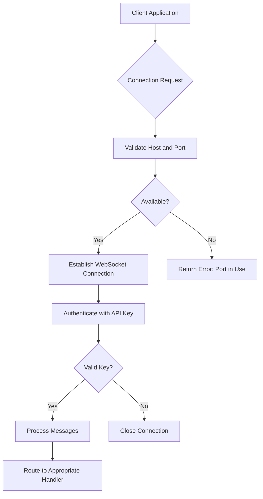
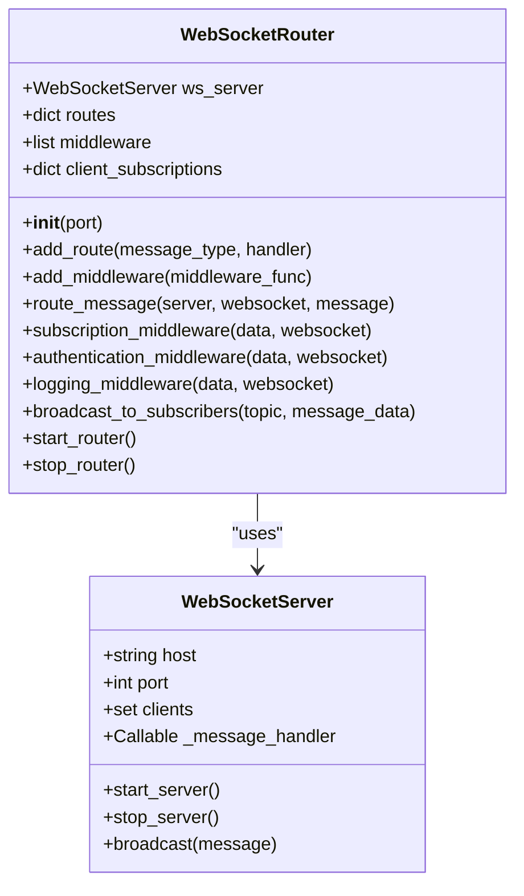
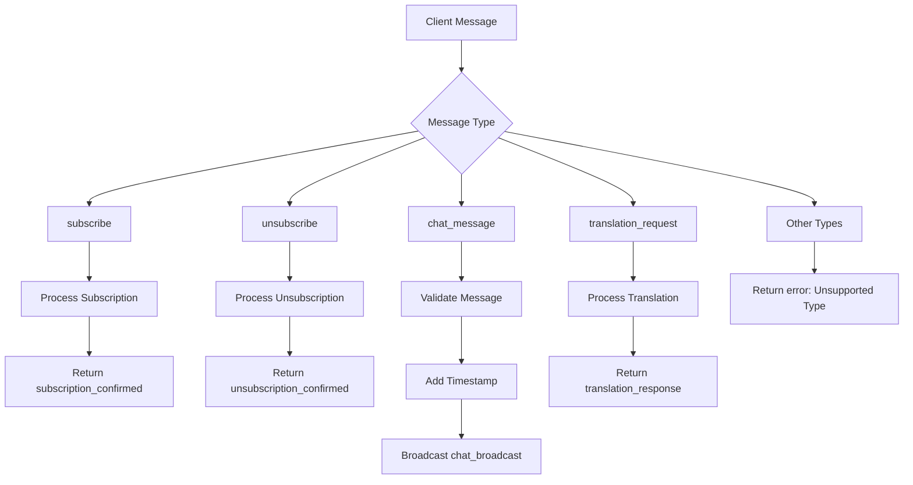
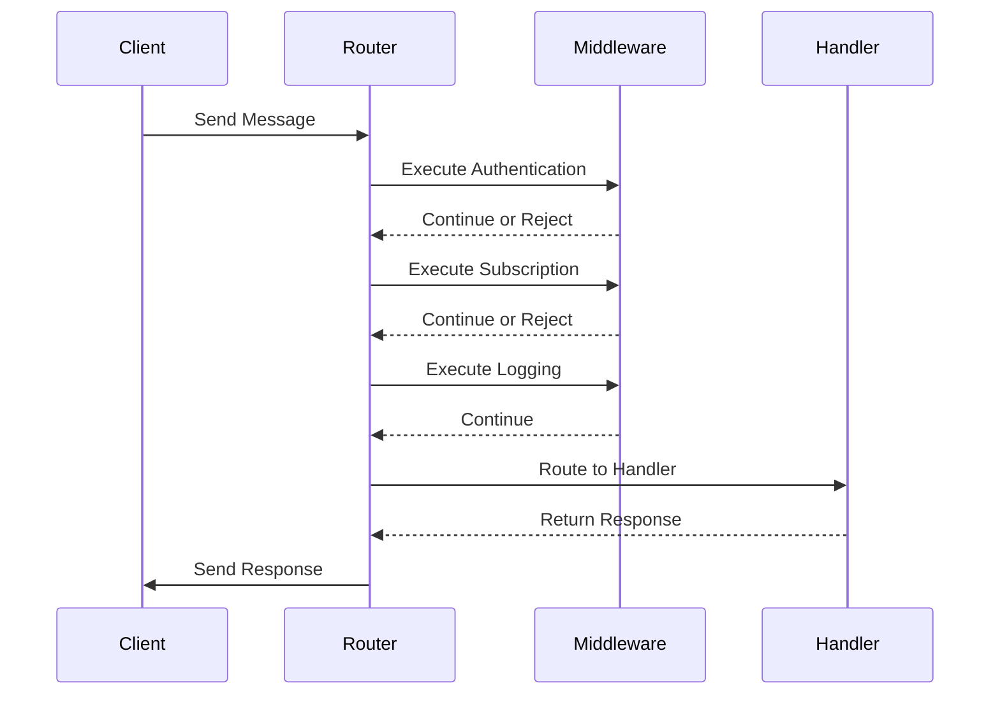

# WebSocket API

<cite>
**Referenced Files in This Document**   
- [websocket_server.py](file://src-python/models/websocket/websocket_server.py)
- [websocket_server.md](file://src-python/docs/details/websocket_server.md)
- [controller.py](file://src-python/controller.py)
- [model.py](file://src-python/model.py)
- [config.py](file://src-python/config.py)
- [test_endpoints.py](file://src-python/test_endpoints.py)
</cite>

## Table of Contents
1. [Introduction](#introduction)
2. [Connection Details](#connection-details)
3. [Message Format](#message-format)
4. [WebSocket Router Architecture](#websocket-router-architecture)
5. [Message Types and Schemas](#message-types-and-schemas)
6. [Subscription System](#subscription-system)
7. [Middleware Components](#middleware-components)
8. [Broadcast Mechanism](#broadcast-mechanism)
9. [Security Considerations](#security-considerations)
10. [Error Handling](#error-handling)
11. [Client Implementation Examples](#client-implementation-examples)
12. [Debugging and Monitoring](#debugging-and-monitoring)
13. [Configuration Management](#configuration-management)

## Introduction
The VRCT WebSocket server provides a real-time communication interface for external applications to interact with the VRCT (Virtual Reality Chat Translator) system. This API enables bidirectional communication for chat messages, translation requests, and system notifications through a standardized WebSocket connection. The server implements a robust routing system with middleware support for authentication, subscription management, and logging, allowing clients to subscribe to specific topics and receive real-time updates.

The WebSocket server is designed to facilitate seamless integration with external applications, enabling features such as real-time chat translation, message broadcasting, and system status monitoring. It serves as a critical component in the VRCT ecosystem, bridging the gap between the core translation engine and external clients that require real-time data exchange.

**Section sources**
- [websocket_server.md](file://src-python/docs/details/websocket_server.md#L534-L728)
- [controller.py](file://src-python/controller.py#L2777-L2865)

## Connection Details
The VRCT WebSocket server operates on the default endpoint `ws://127.0.0.1:8767`, providing a standardized connection point for client applications. The server host and port are configurable through the application settings, allowing users to modify these values based on their network requirements. The default host address `127.0.0.1` restricts connections to localhost for security purposes, while the port `8767` is specifically allocated for the WebSocket service.

Clients can retrieve the current WebSocket configuration through API endpoints that expose the host and port information. The server validates the availability of the specified host and port before establishing the connection, ensuring that the chosen network resources are not already in use. When modifying the WebSocket settings, the system performs validation checks to confirm that the new host is a valid IP address and that the port is available and within the acceptable range (1024-65535).

The WebSocket server can be programmatically controlled through enable/disable endpoints, allowing external applications to start or stop the service as needed. When changing the server configuration while the server is running, the system automatically handles the restart process: stopping the current server instance, applying the new configuration, and starting the server with updated settings.

**Diagram sources**
- [websocket_server.py](file://src-python/models/websocket/websocket_server.py#L1-L57)
- [controller.py](file://src-python/controller.py#L2777-L2838)

**Section sources**
- [controller.py](file://src-python/controller.py#L2777-L2838)
- [config.py](file://src-python/config.py)
- [test_endpoints.py](file://src-python/test_endpoints.py#L426-L434)

## Message Format
All communication with the VRCT WebSocket server follows a standardized JSON format with three primary fields: 'type', 'data', and optional 'api_key'. The 'type' field specifies the message category and determines how the server routes and processes the message. The 'data' field contains the payload specific to the message type, which varies depending on the operation being performed. The optional 'api_key' field is used for authentication when the authentication middleware is enabled, allowing the server to verify the client's authorization to perform certain operations.

The JSON structure ensures consistent message parsing and processing across different client implementations. Each message must be a valid JSON object, and the server performs strict validation upon receipt. The 'type' field is required for all messages and must match one of the supported message types documented in the API specification. The 'data' field structure varies by message type but generally contains key-value pairs relevant to the specific operation. For example, a chat message would include 'username' and 'message' fields within the data payload, while a translation request would contain a 'text' field.

The server responds to client messages using the same JSON format, ensuring a consistent communication pattern. Response messages include additional fields as needed, such as 'timestamp' for time-sensitive operations or 'status' indicators for request outcomes. Error responses follow a standardized format with 'type' set to 'error' and a descriptive 'message' field explaining the issue encountered during processing.

**Section sources**
- [websocket_server.md](file://src-python/docs/details/websocket_server.md#L556-L558)
- [controller.py](file://src-python/controller.py#L584-L591)

## WebSocket Router Architecture
The WebSocket routing system is implemented through the WebSocketRouter class, which serves as the central message processing hub for the VRCT application. This class manages the WebSocket server instance, routes incoming messages to appropriate handlers, and processes messages through a configurable middleware pipeline. The router architecture follows a modular design pattern, allowing for flexible extension and customization of message handling behavior.

The WebSocketRouter class initializes with a specified host and port (defaulting to 127.0.0.1:8767) and establishes a connection with the underlying WebSocketServer instance. It maintains a registry of message type handlers through a routes dictionary, where each supported message type is mapped to its corresponding processing function. The router also manages a middleware pipeline, which processes messages sequentially before they reach the final handler, enabling cross-cutting concerns like authentication, logging, and subscription management.

Message processing follows a well-defined sequence: JSON parsing, middleware execution, route matching, and handler invocation. The router first attempts to parse the incoming message as JSON, catching any parsing errors and returning appropriate error responses. If parsing succeeds, the message passes through each registered middleware function in sequence. Middleware functions can modify the message data, terminate processing by returning null, or allow the message to continue to the next stage. After middleware processing, the router matches the message type to a registered handler and invokes the corresponding function with the message data, WebSocket connection, and server reference.

**Diagram sources**
- [websocket_server.md](file://src-python/docs/details/websocket_server.md#L535-L543)
- [websocket_server.py](file://src-python/models/websocket/websocket_server.py#L7-L30)

**Section sources**
- [websocket_server.md](file://src-python/docs/details/websocket_server.md#L535-L543)
- [websocket_server.py](file://src-python/models/websocket/websocket_server.py#L7-L30)

## Message Types and Schemas
The VRCT WebSocket server supports several message types for different communication purposes, each with a specific request and response schema. The primary message types include 'subscribe', 'unsubscribe', 'chat_message', and 'translation_request', each serving a distinct function within the real-time communication system.

The 'subscribe' message type allows clients to register for specific topics and receive broadcast messages related to those topics. The request schema includes a 'topics' array containing the topic names the client wishes to subscribe to. Upon successful subscription, the server responds with a 'subscription_confirmed' message containing the confirmed topics. The 'unsubscribe' message type enables clients to terminate their subscription to topics, with the server responding with an 'unsubscription_confirmed' message upon successful processing.

The 'chat_message' type facilitates real-time chat functionality, with clients sending messages that are then broadcast to all subscribers. The request schema includes 'username' and 'message' fields, with an optional 'timestamp'. The server responds with a 'chat_broadcast' message containing the original message data along with a server-generated timestamp. The 'translation_request' type allows clients to submit text for translation, with the request containing a 'text' field and the response including both the original text and the translated result in a 'translation_response' message.

**Diagram sources**
- [websocket_server.md](file://src-python/docs/details/websocket_server.md#L676-L702)
- [controller.py](file://src-python/controller.py#L584-L591)

**Section sources**
- [websocket_server.md](file://src-python/docs/details/websocket_server.md#L595-L702)
- [controller.py](file://src-python/controller.py#L584-L591)

## Subscription System
The subscription system in the VRCT WebSocket server enables clients to selectively receive messages based on topics of interest, implementing a publish-subscribe pattern for efficient message distribution. Clients register their interest in specific topics by sending a 'subscribe' message with a list of desired topics, and the server maintains a mapping of client connections to their subscribed topics. This allows the server to efficiently route broadcast messages only to clients that have expressed interest in particular topics, reducing network overhead and improving performance.

The subscription state is maintained in the client_subscriptions dictionary within the WebSocketRouter class, where each client is identified by a unique ID derived from their WebSocket connection object. When a client sends a 'subscribe' message, the server updates this dictionary with the client's ID and their requested topics, then confirms the subscription with a 'subscription_confirmed' response. The 'unsubscribe' message removes the client's subscription record entirely, effectively stopping all topic-based message delivery to that client.

Topic-based broadcasting is implemented through the broadcast_to_subscribers method, which iterates through all subscribed clients and delivers messages only to those whose subscription list includes the target topic. This filtering occurs server-side, ensuring that clients receive only the messages relevant to their interests. The system supports multiple topics per client, allowing for flexible subscription patterns where a single client can monitor several different information streams simultaneously.

**Section sources**
- [websocket_server.md](file://src-python/docs/details/websocket_server.md#L595-L624)
- [websocket_server.md](file://src-python/docs/details/websocket_server.md#L650-L665)

## Middleware Components
The VRCT WebSocket server implements a middleware pipeline that processes messages sequentially before they reach their final handlers, providing a flexible mechanism for cross-cutting concerns. The middleware system consists of three primary components: authentication, subscription management, and logging, each implemented as separate functions that can be independently enabled or disabled based on the server configuration.

The authentication middleware validates client credentials by checking the 'api_key' field in incoming messages against a predefined valid key. If the provided API key does not match the expected value, the middleware terminates message processing and returns an authentication error response. This security measure ensures that only authorized clients can interact with the WebSocket server, protecting against unauthorized access to the real-time communication system.

The subscription middleware handles client subscription and unsubscription requests, managing the client_subscriptions dictionary that tracks which clients are interested in which topics. When a client sends a 'subscribe' message, this middleware registers the client's interest in the specified topics and confirms the subscription. For 'unsubscribe' messages, it removes the client's subscription record. The logging middleware records message processing events, capturing the client IP address and message type for monitoring and debugging purposes, with timestamps to track the flow of communication through the system.

**Diagram sources**
- [websocket_server.md](file://src-python/docs/details/websocket_server.md#L595-L648)
- [websocket_server.md](file://src-python/docs/details/websocket_server.md#L560-L564)

**Section sources**
- [websocket_server.md](file://src-python/docs/details/websocket_server.md#L595-L648)
- [websocket_server.md](file://src-python/docs/details/websocket_server.md#L560-L564)

## Broadcast Mechanism
The broadcast mechanism in the VRCT WebSocket server enables the distribution of messages to multiple clients simultaneously, implementing a publish-subscribe pattern for efficient real-time communication. The system provides two primary broadcasting methods: topic-based broadcasting to subscribers and general broadcasting to all connected clients. The topic-based broadcasting is implemented through the broadcast_to_subscribers method, which delivers messages only to clients that have subscribed to a specific topic, while general broadcasting sends messages to all connected clients regardless of their subscription status.

The broadcast_to_subscribers method iterates through the client_subscriptions dictionary, checking each client's subscription list for the target topic. When a match is found, the system locates the corresponding WebSocket connection using the client ID and sends the message. This filtering process ensures that clients receive only the messages relevant to their interests, reducing network traffic and improving system efficiency. The method includes error handling to manage cases where message delivery fails, logging errors without interrupting the broadcast to other clients.

For system-wide announcements or messages that should reach all clients, the WebSocketServer class provides a broadcast method that sends a message to all connected clients in the clients set. This mechanism is used for global notifications, server status updates, and other information that requires universal distribution. Both broadcasting methods are designed to be non-blocking, ensuring that the server can continue processing new messages while delivering broadcasts to connected clients.

**Section sources**
- [websocket_server.md](file://src-python/docs/details/websocket_server.md#L650-L665)
- [websocket_server.py](file://src-python/models/websocket/websocket_server.py#L44-L56)

## Security Considerations
The VRCT WebSocket server implements several security measures to protect against unauthorized access and ensure the integrity of the real-time communication system. The primary security feature is API key authentication, which verifies client credentials before processing sensitive operations. When enabled, the authentication middleware checks the 'api_key' field in incoming messages against a predefined valid key, rejecting requests with invalid or missing keys. This prevents unauthorized clients from accessing the WebSocket interface and potentially disrupting the translation service.

Additional security considerations include input validation and error handling to prevent common vulnerabilities. The server performs strict JSON parsing validation, catching malformed messages and returning appropriate error responses without exposing sensitive system information. The system also validates WebSocket host and port configurations, ensuring that only valid IP addresses and available ports are accepted when modifying server settings. This prevents configuration errors that could make the service inaccessible or create security vulnerabilities.

The default configuration binds the WebSocket server to localhost (127.0.0.1), restricting external access to the service. This design decision enhances security by ensuring that only applications running on the same machine can connect to the WebSocket server, reducing the attack surface. For users who require external access, the host configuration can be modified, but this should be done with careful consideration of the associated security implications and appropriate network protections.

**Section sources**
- [websocket_server.md](file://src-python/docs/details/websocket_server.md#L626-L638)
- [controller.py](file://src-python/controller.py#L2782-L2809)

## Error Handling
The VRCT WebSocket server implements comprehensive error handling to ensure robust operation and provide meaningful feedback to clients. The system handles various error conditions through a structured approach that includes JSON parsing errors, authentication failures, unsupported message types, and connection issues. Each error type is handled with appropriate responses that inform clients of the specific issue while maintaining system stability.

JSON parsing errors are caught using try-catch blocks around the json.loads() function, with detailed error messages returned to clients when malformed JSON is received. Authentication errors occur when clients provide invalid or missing API keys, resulting in authentication_error responses that indicate the credential issue without revealing sensitive information about the validation process. For unsupported message types, the server returns error responses specifying the unrecognized message type, helping clients debug their message formatting.

Connection-related errors are handled at both the server and client levels, with the WebSocketServer class managing client connection and disconnection events. When a client disconnects unexpectedly, the server removes the client from the active connections set and continues operating normally. The broadcast mechanism includes error handling for individual message delivery failures, allowing the system to continue sending messages to other clients even if delivery to one client fails. All errors are logged with timestamps and relevant context to aid in troubleshooting and system monitoring.

**Section sources**
- [websocket_server.md](file://src-python/docs/details/websocket_server.md#L582-L593)
- [websocket_server.py](file://src-python/models/websocket/websocket_server.py#L47-L53)

## Client Implementation Examples
Client applications can connect to the VRCT WebSocket server using standard WebSocket libraries available in various programming languages. The connection process involves establishing a WebSocket connection to the server endpoint (ws://127.0.0.1:8767 by default), then sending properly formatted JSON messages to interact with the system. Clients should implement error handling for connection failures, message parsing errors, and authentication issues to ensure robust operation.

A basic client implementation would follow these steps: establish the WebSocket connection, send a subscription message to register for desired topics, and implement a message handler to process incoming messages. For example, a client interested in chat messages and translation updates would send a subscribe message with topics like 'chat' and 'translation'. The client should also handle the server's response messages, such as subscription_confirmations and unsubscription_confirmations, to maintain accurate state information.

When sending messages to the server, clients must format their requests according to the specified JSON schema, including the required 'type' and 'data' fields, and the optional 'api_key' if authentication is enabled. For instance, to send a chat message, the client would construct a JSON object with type 'chat_message' and data containing the username and message content. The client should also handle the server's responses, which may include success confirmations, error messages, or broadcast data from other sources.

**Section sources**
- [websocket_server.md](file://src-python/docs/details/websocket_server.md#L705-L715)
- [controller.py](file://src-python/controller.py#L584-L591)

## Debugging and Monitoring
The VRCT WebSocket server provides several tools and features to assist with debugging and monitoring system behavior. The built-in logging middleware records message processing events, capturing client IP addresses and message types with timestamps, providing visibility into the flow of communication through the system. These logs can be used to troubleshoot connectivity issues, verify message delivery, and monitor system usage patterns.

Network monitoring tools can be employed to inspect WebSocket traffic, allowing developers to verify message formatting, track connection states, and identify potential issues with message delivery. The server's error responses provide detailed information about specific problems, such as JSON parsing errors or authentication failures, helping clients diagnose and correct issues with their implementation. The system also includes configuration endpoints that allow clients to retrieve current WebSocket settings, verify server status, and test connectivity.

For advanced debugging, developers can enable detailed logging and use network analysis tools to capture and analyze WebSocket frames. The server's modular architecture allows for selective enabling of middleware components, making it possible to isolate specific functionality during testing. The subscription system's confirmation messages provide feedback on client registration status, helping to verify that clients are properly connected and receiving the expected messages.

**Section sources**
- [websocket_server.md](file://src-python/docs/details/websocket_server.md#L641-L648)
- [controller.py](file://src-python/controller.py#L2777-L2865)

## Configuration Management
The VRCT WebSocket server configuration is managed through a combination of default settings and runtime configuration endpoints. The server host and port are defined in the application configuration, with defaults set to 127.0.0.1 and 8767 respectively. These values can be retrieved and modified through dedicated API endpoints, allowing clients to programmatically access and update the WebSocket settings.

Configuration changes are validated before application to ensure system stability and security. When modifying the WebSocket host, the system verifies that the provided address is a valid IP address. Port changes are validated to ensure the new port is available and within the acceptable range. If the server is currently running, configuration changes trigger an automatic restart sequence: stopping the server, applying the new settings, and restarting the service with the updated configuration.

The WebSocket server can be enabled or disabled through control endpoints, allowing external applications to manage the service lifecycle. When enabling the server, the system checks the availability of the configured host and port before starting the service. This configuration management system provides flexibility for integration with external applications while maintaining the integrity and reliability of the WebSocket communication channel.

**Section sources**
- [controller.py](file://src-python/controller.py#L2777-L2865)
- [config.py](file://src-python/config.py)
- [test_endpoints.py](file://src-python/test_endpoints.py#L426-L434)