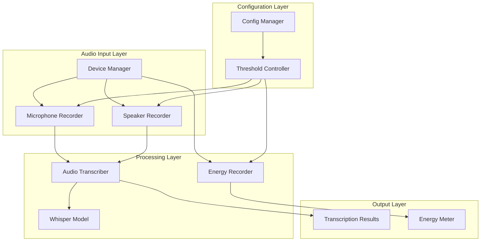
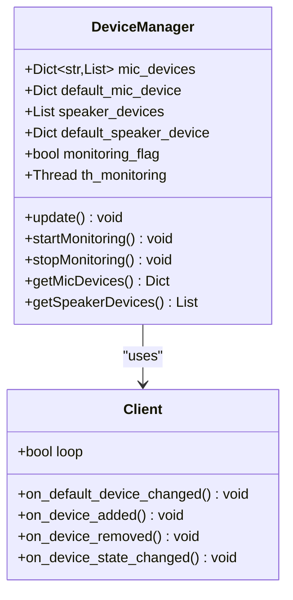
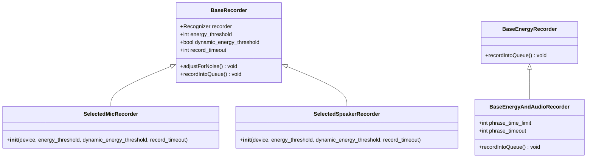
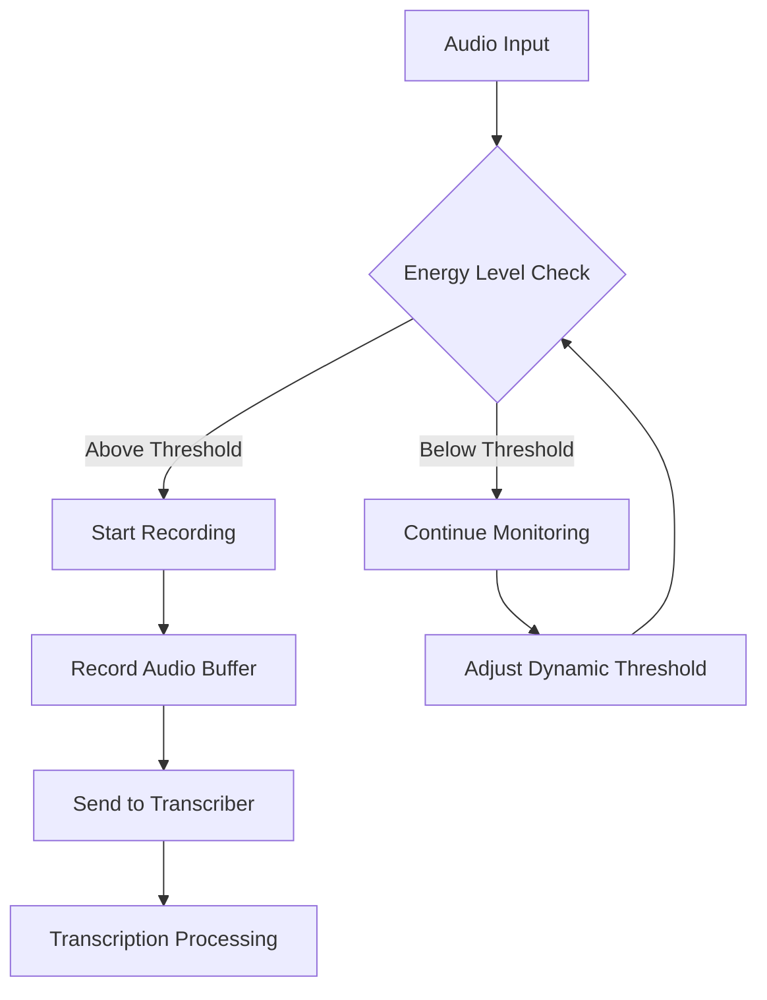
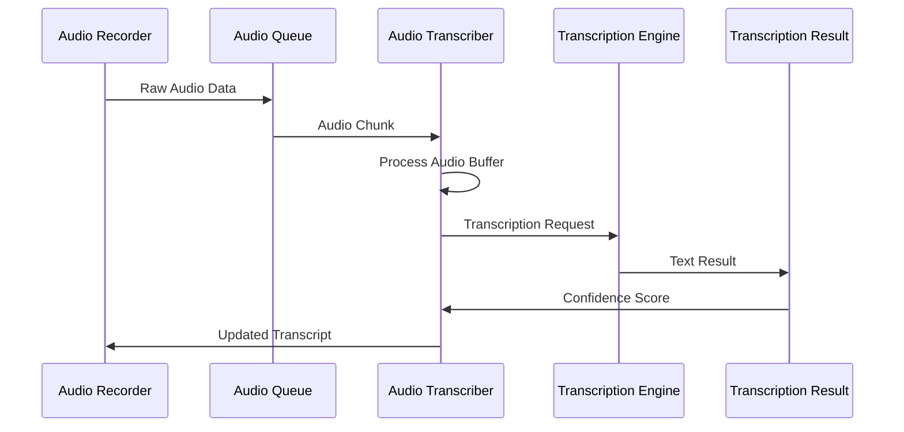
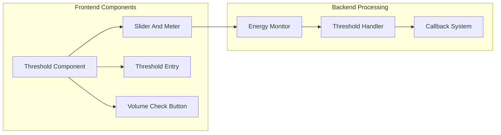
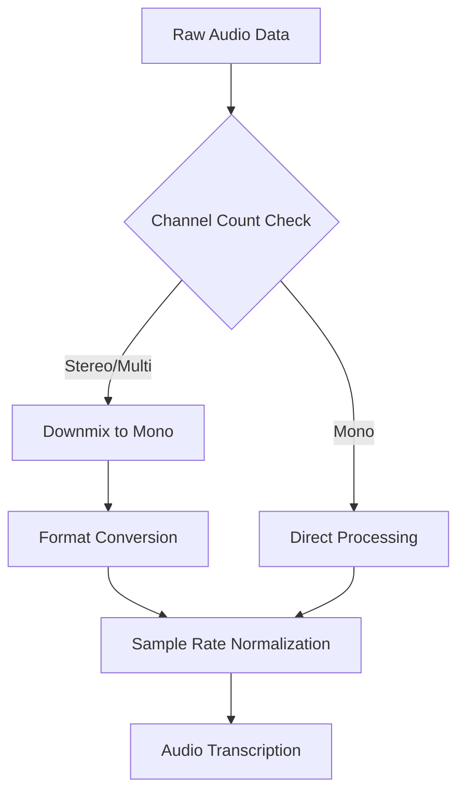
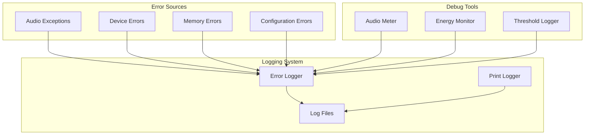

# Audio Processing Subsystem

<cite>
**Referenced Files in This Document**
- [transcription_recorder.py](file://src-python/models/transcription/transcription_recorder.py)
- [transcription_transcriber.py](file://src-python/models/transcription/transcription_transcriber.py)
- [device_manager.py](file://src-python/device_manager.py)
- [transcription_whisper.py](file://src-python/models/transcription/transcription_whisper.py)
- [model.py](file://src-python/model.py)
- [controller.py](file://src-python/controller.py)
- [utils.py](file://src-python/utils.py)
- [ThresholdComponent.jsx](file://src-ui/views/app/config_page/setting_section/setting_box/_components/threshold_component/ThresholdComponent.jsx)
- [SliderAndMeter.jsx](file://src-ui/views/app/config_page/setting_section/setting_box/_components/threshold_component/slider_and_meter/SliderAndMeter.jsx)
</cite>

## Table of Contents
1. [Introduction](#introduction)
2. [System Architecture](#system-architecture)
3. [Device Management](#device-management)
4. [Audio Capture Components](#audio-capture-components)
5. [Voice Activity Detection](#voice-activity-detection)
6. [Audio Processing Pipeline](#audio-processing-pipeline)
7. [Configuration and Threshold Management](#configuration-and-threshold-management)
8. [Buffer Management and Sample Rate Handling](#buffer-management-and-sample-rate-handling)
9. [Error Handling and Debugging](#error-handling-and-debugging)
10. [Common Issues and Solutions](#common-issues-and-solutions)
11. [Performance Optimization](#performance-optimization)
12. [Troubleshooting Guide](#troubleshooting-guide)

## Introduction

The VRCT Audio Processing subsystem provides comprehensive real-time audio capture, processing, and transcription capabilities. Built around PyAudioWPatch for cross-platform audio support, the system handles both microphone and speaker audio input through sophisticated voice activity detection (VAD) and energy-based triggering mechanisms.

The subsystem consists of several interconnected components that work together to provide seamless audio-to-text conversion with minimal latency and optimal quality. It supports both online Google Speech Recognition and offline Whisper model transcription engines, with automatic fallback mechanisms and comprehensive error handling.

## System Architecture

The audio processing system follows a modular architecture with clear separation of concerns:



**Diagram sources**
- [device_manager.py](file://src-python/device_manager.py#L57-L529)
- [transcription_recorder.py](file://src-python/models/transcription/transcription_recorder.py#L14-L264)
- [transcription_transcriber.py](file://src-python/models/transcription/transcription_transcriber.py#L31-L220)

**Section sources**
- [device_manager.py](file://src-python/device_manager.py#L57-L122)
- [transcription_recorder.py](file://src-python/models/transcription/transcription_recorder.py#L14-L37)

## Device Management

The DeviceManager serves as the central hub for audio device enumeration, monitoring, and lifecycle management. It provides automatic reinitialization capabilities when hardware changes occur.

### Device Enumeration and Monitoring

The DeviceManager maintains separate device lists for microphones and speakers, organized by audio host APIs:



**Diagram sources**
- [device_manager.py](file://src-python/device_manager.py#L57-L122)
- [device_manager.py](file://src-python/device_manager.py#L26-L52)

### Automatic Reinitialization

The system monitors for hardware changes through a dual-mode approach:

1. **COM-based Monitoring (Windows)**: Uses Windows Audio Session API for real-time notifications
2. **Polling Mode**: Periodic device enumeration as fallback mechanism

The monitoring thread runs continuously, checking for device changes every 2 seconds with up to 10 retry attempts.

**Section sources**
- [device_manager.py](file://src-python/device_manager.py#L266-L306)
- [device_manager.py](file://src-python/device_manager.py#L290-L306)

## Audio Capture Components

The transcription_recorder.py module provides specialized recorder classes for different audio sources with configurable energy thresholds and voice activity detection.

### Recorder Types and Capabilities



**Diagram sources**
- [transcription_recorder.py](file://src-python/models/transcription/transcription_recorder.py#L14-L37)
- [transcription_recorder.py](file://src-python/models/transcription/transcription_recorder.py#L38-L83)
- [transcription_recorder.py](file://src-python/models/transcription/transcription_recorder.py#L84-L107)

### Device Selection and Fallback

Each recorder type implements robust device selection with automatic fallback mechanisms:

- **Primary Selection**: Uses specified device index and sample rate
- **Fallback Strategy**: Attempts system default device on primary failure
- **Validation**: Ensures device compatibility and availability

**Section sources**
- [transcription_recorder.py](file://src-python/models/transcription/transcription_recorder.py#L38-L83)
- [transcription_recorder.py](file://src-python/models/transcription/transcription_recorder.py#L228-L264)

## Voice Activity Detection

The system employs energy-based voice activity detection with configurable thresholds and dynamic adjustment capabilities.

### Energy-Based Detection



**Diagram sources**
- [transcription_recorder.py](file://src-python/models/transcription/transcription_recorder.py#L84-L107)
- [transcription_recorder.py](file://src-python/models/transcription/transcription_recorder.py#L149-L190)

### Threshold Configuration

The system supports both manual and automatic threshold adjustment:

- **Manual Threshold**: Fixed energy level for consistent detection
- **Dynamic Threshold**: Adaptive adjustment based on ambient noise
- **Automatic Threshold**: Real-time ambient noise calibration

**Section sources**
- [transcription_recorder.py](file://src-python/models/transcription/transcription_recorder.py#L84-L107)
- [transcription_recorder.py](file://src-python/models/transcription/transcription_recorder.py#L149-L190)

## Audio Processing Pipeline

The transcription_transcriber.py module orchestrates the complete audio-to-text processing pipeline with support for multiple transcription engines.

### Processing Workflow



**Diagram sources**
- [transcription_transcriber.py](file://src-python/models/transcription/transcription_transcriber.py#L80-L161)
- [model.py](file://src-python/model.py#L616-L698)

### Audio Buffer Management

The transcriber manages audio buffers with sophisticated phrase detection and timeout handling:

- **Phrase Timeout**: Maximum duration for continuous speech
- **Max Phrases**: Limit on stored transcription history
- **Buffer Overflow Protection**: Automatic cleanup of old phrases
- **Sample Rate Normalization**: Consistent audio format processing

**Section sources**
- [transcription_transcriber.py](file://src-python/models/transcription/transcription_transcriber.py#L162-L220)
- [model.py](file://src-python/model.py#L616-L698)

## Configuration and Threshold Management

The system provides comprehensive configuration management through both backend Python components and frontend React interfaces.

### Threshold Visualization System



**Diagram sources**
- [ThresholdComponent.jsx](file://src-ui/views/app/config_page/setting_section/setting_box/_components/threshold_component/ThresholdComponent.jsx#L1-L42)
- [SliderAndMeter.jsx](file://src-ui/views/app/config_page/setting_section/setting_box/_components/threshold_component/slider_and_meter/SliderAndMeter.jsx#L1-L76)

### Configuration Parameters

The system supports extensive configuration options:

| Parameter | Range | Description |
|-----------|-------|-------------|
| MIC_THRESHOLD | 0-2000 | Microphone energy threshold |
| SPEAKER_THRESHOLD | 0-4000 | Speaker energy threshold |
| MIC_AUTOMATIC_THRESHOLD | Boolean | Enable dynamic threshold |
| SPEAKER_AUTOMATIC_THRESHOLD | Boolean | Enable dynamic speaker threshold |
| MIC_RECORD_TIMEOUT | 1-30 | Maximum recording duration |
| SPEAKER_RECORD_TIMEOUT | 1-30 | Maximum speaker recording duration |
| MIC_PHRASE_TIMEOUT | 1-10 | Phrase continuation timeout |
| SPEAKER_PHRASE_TIMEOUT | 1-10 | Speaker phrase timeout |

**Section sources**
- [SliderAndMeter.jsx](file://src-ui/views/app/config_page/setting_section/setting_box/_components/threshold_component/slider_and_meter/SliderAndMeter.jsx#L23-L76)
- [ThresholdComponent.jsx](file://src-ui/views/app/config_page/setting_section/setting_box/_components/threshold_component/ThresholdComponent.jsx#L24-L42)

## Buffer Management and Sample Rate Handling

The system implements sophisticated buffer management to handle various audio formats and prevent memory overflow.

### Sample Rate Processing



**Diagram sources**
- [transcription_transcriber.py](file://src-python/models/transcription/transcription_transcriber.py#L179-L192)

### Memory Management Strategies

- **Circular Buffer**: Prevents unbounded memory growth
- **Automatic Cleanup**: Removes old phrases beyond configured limits
- **Queue Size Limits**: Controls memory usage in processing queues
- **Garbage Collection**: Explicit cleanup of unused objects

**Section sources**
- [transcription_transcriber.py](file://src-python/models/transcription/transcription_transcriber.py#L179-L192)
- [model.py](file://src-python/model.py#L680-L685)

## Error Handling and Debugging

The system implements comprehensive error handling with detailed logging and debugging capabilities.

### Error Logging System



**Diagram sources**
- [utils.py](file://src-python/utils.py#L192-L200)
- [controller.py](file://src-python/controller.py#L26-L37)

### Debugging Features

- **Energy Meter Visualization**: Real-time audio level monitoring
- **Threshold Adjustment Logging**: Track threshold changes and adjustments
- **Device Status Monitoring**: Continuous device health checks
- **Performance Metrics**: Latency and processing time tracking

**Section sources**
- [controller.py](file://src-python/controller.py#L154-L186)
- [utils.py](file://src-python/utils.py#L192-L200)

## Common Issues and Solutions

### Audio Device Not Found

**Symptoms**: "NoDevice" returned for selected audio device
**Causes**: 
- Device disconnected or removed
- Driver issues
- Exclusive mode conflicts

**Solutions**:
1. Verify device connection and drivers
2. Restart audio service
3. Check exclusive mode settings
4. Use device manager fallback

### Clipping and Distortion

**Symptoms**: Audio quality degradation, distorted output
**Causes**:
- Input level too high
- Sample rate mismatches
- Buffer overflow

**Solutions**:
1. Reduce input gain
2. Verify sample rate compatibility
3. Increase buffer sizes
4. Check for audio driver conflicts

### Latency Issues

**Symptoms**: Delayed transcription response
**Causes**:
- Large buffer sizes
- Processing bottlenecks
- Network delays (for cloud transcription)

**Solutions**:
1. Optimize buffer configurations
2. Use local Whisper models
3. Adjust timeout parameters
4. Monitor system resources

### Exclusive Mode Conflicts

**Symptoms**: Cannot access audio device
**Causes**:
- Another application using the device
- Windows exclusive mode restrictions
- Driver conflicts

**Solutions**:
1. Close conflicting applications
2. Restart Windows audio service
3. Use WASAPI for exclusive access
4. Try different audio drivers

**Section sources**
- [device_manager.py](file://src-python/device_manager.py#L140-L238)
- [transcription_recorder.py](file://src-python/models/transcription/transcription_recorder.py#L38-L83)

## Performance Optimization

### Real-Time Processing Optimization

The system implements several optimization strategies for low-latency audio processing:

- **Background Threading**: Separate threads for recording and processing
- **Efficient Queuing**: Minimal overhead queue implementations
- **Memory Pooling**: Reuse of audio buffers and objects
- **Selective Processing**: Only process audio above energy threshold

### Resource Management

- **GPU Memory Optimization**: Intelligent VRAM allocation for Whisper models
- **CPU Threading**: Balanced thread utilization across cores
- **Network Efficiency**: Optimized API calls for cloud transcription
- **Storage Optimization**: Efficient model caching and loading

**Section sources**
- [transcription_whisper.py](file://src-python/models/transcription/transcription_whisper.py#L112-L145)
- [model.py](file://src-python/model.py#L616-L698)

## Troubleshooting Guide

### Diagnostic Steps

1. **Verify Device Availability**
   - Check device_manager logs
   - Test with system audio tools
   - Verify driver installation

2. **Monitor Audio Levels**
   - Use energy meter visualization
   - Check threshold configurations
   - Validate input levels

3. **Review Error Logs**
   - Examine process.log for audio errors
   - Check system event logs
   - Monitor resource usage

### Common Diagnostic Commands

```bash
# Check audio device status
python -c "import pyaudio; p = pyaudio.PyAudio(); print(p.get_device_count())"

# Test audio recording
python -c "import speech_recognition as sr; r = sr.Recognizer(); with sr.Microphone() as source: print(r.energy_threshold)"
```

### Performance Tuning Guidelines

- **Latency Reduction**: Minimize buffer sizes, use local models
- **Accuracy Improvement**: Optimize thresholds, use higher-quality models
- **Stability Enhancement**: Implement proper error handling, monitor resources

**Section sources**
- [utils.py](file://src-python/utils.py#L184-L191)
- [controller.py](file://src-python/controller.py#L154-L186)