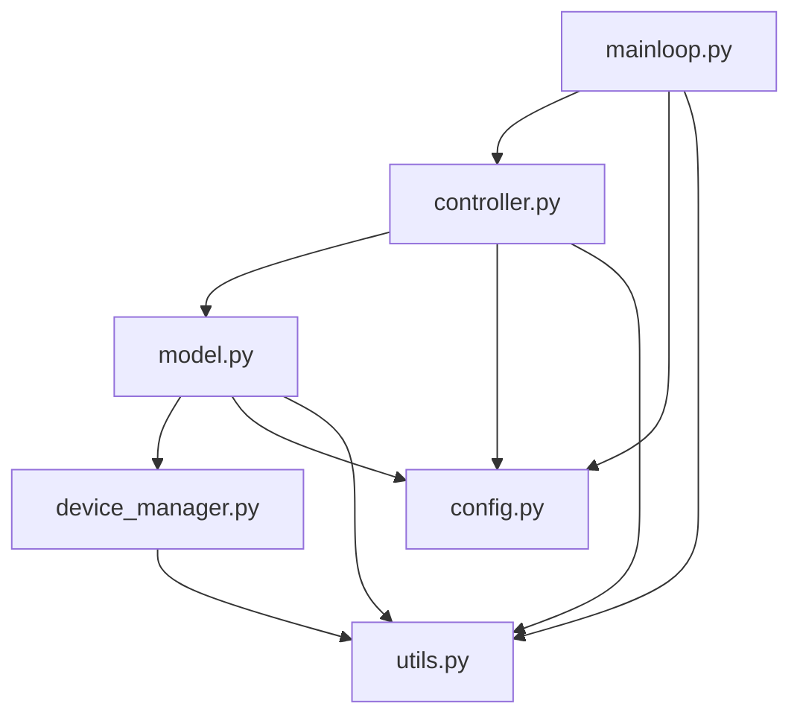
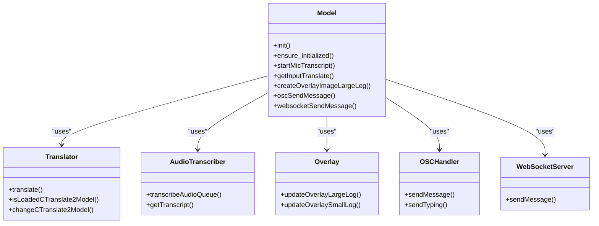
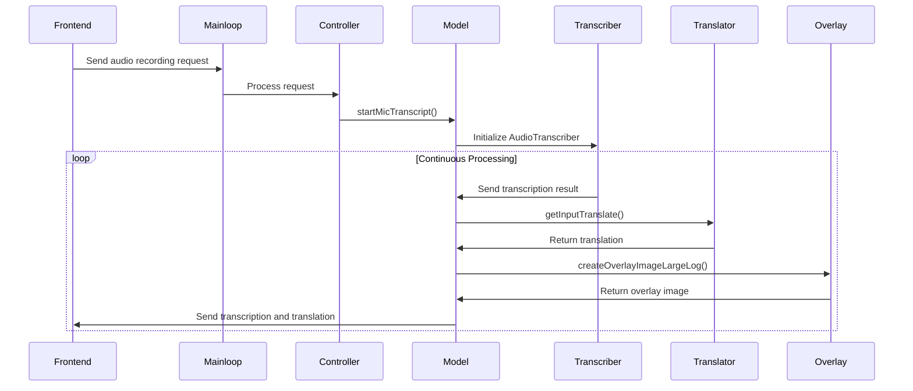

# Backend Services

<cite>
**Referenced Files in This Document**   
- [model.py](file://src-python/model.py)
- [controller.py](file://src-python/controller.py)
- [mainloop.py](file://src-python/mainloop.py)
- [device_manager.py](file://src-python/device_manager.py)
- [config.py](file://src-python/config.py)
- [test_client.py](file://src-python/test_client.py)
</cite>

## Table of Contents
1. [Introduction](#introduction)
2. [Core Module Roles](#core-module-roles)
3. [Service Initialization and Dependencies](#service-initialization-and-dependencies)
4. [Service Orchestration through Model Singleton](#service-orchestration-through-model-singleton)
5. [Service Interaction Examples](#service-interaction-examples)
6. [Error Handling and Recovery](#error-handling-and-recovery)
7. [Performance Considerations](#performance-considerations)
8. [Debugging Backend Services](#debugging-backend-services)
9. [Conclusion](#conclusion)

## Introduction
The VRCT backend services are built on a Python-based architecture designed for real-time transcription, translation, and audio processing. This document provides a comprehensive analysis of the core server components, focusing on their roles, interactions, and operational characteristics. The system is structured around four primary modules: model.py for AI model lifecycle management, controller.py for business logic and API endpoint routing, mainloop.py for request processing and threading, and device_manager.py for audio device enumeration and monitoring. These components work together to provide a robust platform for voice communication translation in virtual environments.

## Core Module Roles

### model.py: AI Model Lifecycle Management
The model.py module serves as the central orchestrator for AI model lifecycle management. It implements a singleton pattern through the Model class, ensuring a single instance manages all AI models and services. This module is responsible for initializing and coordinating transcription, translation, and overlay services. Key responsibilities include:
- Managing the lifecycle of AI models (loading, unloading, configuration)
- Coordinating inter-service communication between transcription and translation components
- Handling overlay image generation and display
- Managing OSC (Open Sound Control) communication with VR environments
- Providing a unified interface for WebSocket server operations
- Implementing watchdog functionality for system stability monitoring

The Model class uses lazy initialization through the ensure_initialized() method, which prevents heavy resource loading during import time and allows on-demand initialization when services are first accessed.

**Section sources**
- [model.py](file://src-python/model.py#L81-L142)

### controller.py: Business Logic and API Endpoint Routing
The controller.py module implements the Controller class, which serves as the intermediary between the frontend and backend services. It handles business logic and routes API endpoint requests to appropriate service methods. The Controller class:
- Maps incoming API requests to corresponding model methods
- Processes and validates request data
- Formats responses for frontend consumption
- Manages state changes across different application components
- Implements callback mechanisms for asynchronous operations

The controller uses a mapping system that associates endpoint strings with corresponding handler functions, allowing for flexible and maintainable API routing.

**Section sources**
- [controller.py](file://src-python/controller.py#L11-L28)

### mainloop.py: Request Processing and Threading
The mainloop.py module implements the main application loop that processes incoming requests and manages threading. It contains the Main class which:
- Receives JSON-formatted requests from stdin
- Processes requests through a queue-based system
- Manages multiple worker threads for concurrent request handling
- Implements endpoint locking to prevent race conditions
- Handles graceful shutdown procedures

The request processing system uses a producer-consumer pattern with a Queue to decouple request reception from processing, ensuring responsive performance even under heavy load.

**Section sources**
- [mainloop.py](file://src-python/mainloop.py#L408-L588)

### device_manager.py: Audio Device Enumeration and Monitoring
The device_manager.py module provides comprehensive audio device management capabilities. The DeviceManager class:
- Enumerates available microphone and speaker devices
- Monitors device changes in real-time using Windows-specific APIs when available
- Maintains current device selection state
- Provides callbacks for device change notifications
- Implements fallback mechanisms for systems without advanced audio APIs

The module uses a singleton pattern and supports both polling and event-driven monitoring approaches, adapting to the capabilities of the host system.

**Section sources**
- [device_manager.py](file://src-python/device_manager.py#L57-L139)

## Service Initialization and Dependencies

**Diagram sources** 
- [mainloop.py](file://src-python/mainloop.py#L8)
- [controller.py](file://src-python/controller.py#L8)
- [model.py](file://src-python/model.py#L18)
- [device_manager.py](file://src-python/device_manager.py#L13)
- [config.py](file://src-python/config.py#L13)
- [utils.py](file://src-python/utils.py#L24)

The service initialization sequence begins with mainloop.py, which imports and initializes the Controller instance. During controller initialization, the Model singleton is instantiated and initialized, which in turn establishes dependencies on device_manager, config, and various utility functions. The initialization process follows a lazy loading pattern, where heavy resources like AI models are only loaded when first accessed through the ensure_initialized() method.

Inter-service dependencies are managed through direct imports and method calls, with the Model singleton serving as the central coordination point. Configuration values from config.py are accessed as needed by various components, while utility functions from utils.py provide shared functionality across the codebase.

## Service Orchestration through Model Singleton

**Diagram sources** 
- [model.py](file://src-python/model.py#L81-L142)
- [models/translation/translation_translator.py](file://src-python/models/translation/translation_translator.py#L39-L200)
- [models/transcription/transcription_transcriber.py](file://src-python/models/transcription/transcription_transcriber.py#L31-L220)
- [models/overlay/overlay.py](file://src-python/models/overlay/overlay.py)
- [models/osc/osc.py](file://src-python/models/osc/osc.py)
- [models/websocket/websocket_server.py](file://src-python/models/websocket/websocket_server.py)

The Model singleton orchestrates transcription, translation, and overlay services through a centralized architecture. When transcription is initiated, the Model class creates and manages AudioTranscriber instances for both microphone and speaker input. Transcribed text is then passed to the Translator service for language translation, with the Model coordinating the selection of appropriate translation engines and handling fallback mechanisms.

Overlay services are managed through the Overlay class, which generates visual representations of transcribed and translated text for display in VR environments. The Model singleton coordinates the timing and content of overlay updates, ensuring synchronization between audio processing and visual feedback.

## Service Interaction Examples

**Diagram sources** 
- [controller.py](file://src-python/controller.py#L254-L415)
- [model.py](file://src-python/model.py#L616-L754)
- [models/translation/translation_translator.py](file://src-python/models/translation/translation_translator.py#L200-L394)

A typical service interaction begins when audio recording triggers transcription. The process flows as follows:
1. The frontend sends a request to start microphone transcription
2. The mainloop receives and queues the request
3. The controller routes the request to the Model's startMicTranscript method
4. The Model initializes an AudioTranscriber instance and begins recording
5. As audio segments are processed, transcriptions are generated
6. Transcribed text is passed to the Translator service for translation
7. Translations are formatted and sent to the Overlay service for display
8. Results are transmitted back to the frontend via WebSocket or OSC

Another common interaction involves speaker audio transcription, which follows a similar pattern but processes audio from speaker output rather than microphone input, enabling translation of received voice communications.

## Error Handling and Recovery

The backend services implement comprehensive error handling and recovery mechanisms across all components. Key strategies include:

- **Graceful Degradation**: When AI models fail to load or encounter errors, services degrade gracefully rather than crashing. For example, if cloud-based translation fails, the system can fall back to local CTranslate2 models.
- **Exception Wrapping**: Critical sections are wrapped in try-except blocks to prevent unhandled exceptions from terminating threads or processes.
- **Resource Cleanup**: The system implements proper resource cleanup in finally blocks and shutdown handlers to prevent memory leaks.
- **VRAM Management**: Specialized error detection for VRAM out-of-memory conditions allows the system to disable translation features and continue basic operation.
- **Network Resilience**: Network connectivity is continuously monitored, with automatic reconnection attempts for WebSocket and API connections.

The threadFnc class in model.py provides a robust threading wrapper that protects against user exceptions terminating threads, ensuring service continuity even when individual operations fail.

**Section sources**
- [model.py](file://src-python/model.py#L37-L79)
- [controller.py](file://src-python/controller.py#L296-L317)
- [utils.py](file://src-python/utils.py#L173-L182)

## Performance Considerations

The system is designed with real-time processing and resource management as primary concerns. Key performance considerations include:

- **Threading Model**: The mainloop uses multiple worker threads to handle concurrent requests, preventing blocking operations from affecting overall responsiveness.
- **Lazy Initialization**: Heavy resources like AI models are only loaded when first needed, reducing startup time and memory usage when features are not in use.
- **Memory Management**: The system implements explicit garbage collection calls and resource cleanup to manage memory usage, particularly important for GPU-based models.
- **Efficient Data Flow**: Audio data is processed in chunks and passed through queues, minimizing memory overhead and enabling streaming processing.
- **Compute Optimization**: The system automatically selects optimal compute types based on available hardware, balancing performance and compatibility.

Resource management of AI models is handled through the Model singleton, which coordinates loading and unloading of models based on current requirements, preventing unnecessary GPU memory consumption.

**Section sources**
- [mainloop.py](file://src-python/mainloop.py#L406-L407)
- [model.py](file://src-python/model.py#L93-L142)
- [utils.py](file://src-python/utils.py#L92-L132)

## Debugging Backend Services

The backend provides several mechanisms for debugging and troubleshooting:

- **Logging System**: Comprehensive logging is implemented through the setupLogger function, with logs written to timestamped files in the logs directory.
- **Test Client**: The test_client.py script provides a complete testing framework that simulates frontend interactions and validates backend responses.
- **Real-time Monitoring**: The system outputs detailed status information to stdout, allowing real-time monitoring of service operations.
- **Configuration Validation**: The config.py module includes validation functions that ensure configuration integrity and provide fallback values for invalid settings.
- **Error Reporting**: Detailed error information is captured and reported through standardized response formats, facilitating issue diagnosis.

The test_client.py script is particularly valuable for debugging, as it can automatically test all endpoints and validate expected behaviors, making it an essential tool for both development and troubleshooting.

**Section sources**
- [test_client.py](file://src-python/test_client.py#L31-L800)
- [utils.py](file://src-python/utils.py#L192-L200)
- [model.py](file://src-python/model.py#L284-L294)

## Conclusion
The VRCT backend services demonstrate a well-architected Python-based system for real-time voice translation in virtual environments. The modular design with clear separation of concerns allows for maintainable and extensible code, while the singleton pattern and centralized coordination through the Model class ensure consistent state management across services. The system effectively balances real-time performance requirements with robust error handling and resource management, making it suitable for demanding VR communication scenarios. The comprehensive debugging tools and testing framework further enhance the system's reliability and maintainability.