# Model Management

<cite>
**Referenced Files in This Document**
- [model.py](file://src-python/model.py)
- [config.py](file://src-python/config.py)
- [transcription_whisper.py](file://src-python/models/transcription/transcription_whisper.py)
- [translation_translator.py](file://src-python/models/translation/translation_translator.py)
- [translation_utils.py](file://src-python/models/translation/translation_utils.py)
- [device_manager.py](file://src-python/device_manager.py)
- [utils.py](file://src-python/utils.py)
</cite>

## Table of Contents
1. [Introduction](#introduction)
2. [System Architecture](#system-architecture)
3. [Model Class Singleton](#model-class-singleton)
4. [Lazy Loading Strategy](#lazy-loading-strategy)
5. [Transcription Model Management](#transcription-model-management)
6. [Translation Model Management](#translation-model-management)
7. [Compute Device Selection](#compute-device-selection)
8. [Configuration Integration](#configuration-integration)
9. [Resource Management](#resource-management)
10. [Error Handling and Recovery](#error-handling-and-recovery)
11. [Performance Optimization](#performance-optimization)
12. [Troubleshooting Guide](#troubleshooting-guide)
13. [Best Practices](#best-practices)

## Introduction

The VRCT Model Management subsystem serves as the central orchestrator for AI model lifecycle management, handling transcription and translation models through a sophisticated singleton architecture. Built around the Model class, this system provides intelligent model loading, caching, and unloading capabilities based on configuration settings and resource constraints.

The system supports multiple model backends including faster-whisper for transcription and various translation engines (CTranslate2, DeepL, OpenAI, Gemini, etc.). It implements a lazy-loading strategy to optimize startup performance while maintaining responsive model availability, along with automatic compute device selection and resource management.

## System Architecture

The Model Management system follows a layered architecture with clear separation of concerns:

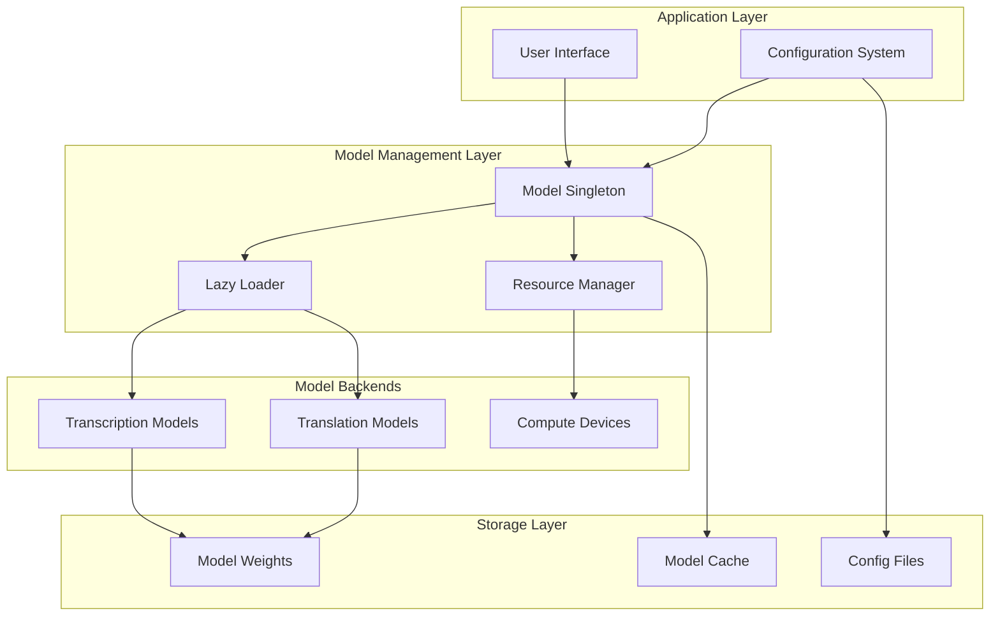

**Diagram sources**
- [model.py](file://src-python/model.py#L81-L103)
- [config.py](file://src-python/config.py#L531-L558)

**Section sources**
- [model.py](file://src-python/model.py#L81-L103)
- [config.py](file://src-python/config.py#L531-L558)

## Model Class Singleton

The Model class implements a thread-safe singleton pattern that serves as the central hub for all AI model operations. This design ensures consistent model state management across the application while enabling lazy initialization to optimize startup performance.

### Singleton Implementation

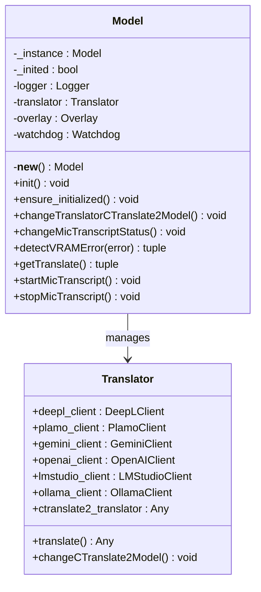

**Diagram sources**
- [model.py](file://src-python/model.py#L81-L103)
- [translation_translator.py](file://src-python/models/translation/translation_translator.py#L39-L60)

### Initialization Strategy

The Model class employs a two-phase initialization approach:

1. **Construction Phase**: Creates the singleton instance without heavy imports
2. **Initialization Phase**: Performs resource-intensive setup when first accessed

This approach prevents import-time bottlenecks while ensuring all models are available when needed.

**Section sources**
- [model.py](file://src-python/model.py#L81-L103)
- [model.py](file://src-python/model.py#L143-L153)

## Lazy Loading Strategy

The system implements intelligent lazy loading to balance startup performance with model availability. Models are loaded only when explicitly requested or when their functionality is first accessed.

### Lazy Loading Mechanisms

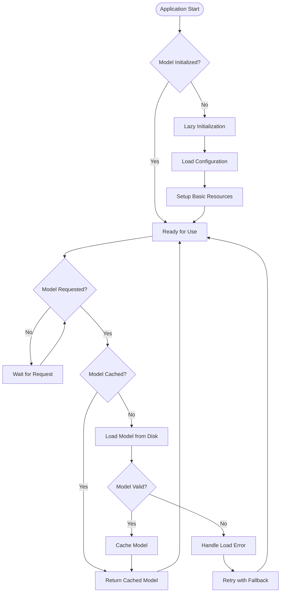

**Diagram sources**
- [model.py](file://src-python/model.py#L143-L153)
- [model.py](file://src-python/model.py#L616-L702)

### Model Loading Triggers

The system triggers model loading through several mechanisms:

- **Explicit API Calls**: Direct requests to model functions
- **Configuration Changes**: Updates to model settings
- **Device Availability**: Detection of compute device changes
- **Memory Pressure**: Automatic cleanup under resource constraints

**Section sources**
- [model.py](file://src-python/model.py#L143-L153)
- [model.py](file://src-python/model.py#L616-L702)

## Transcription Model Management

Transcription models are managed through the faster-whisper framework, specifically utilizing the CTranslate2 backend for optimal performance. The system supports multiple model sizes and configurations.

### Whisper Model Architecture

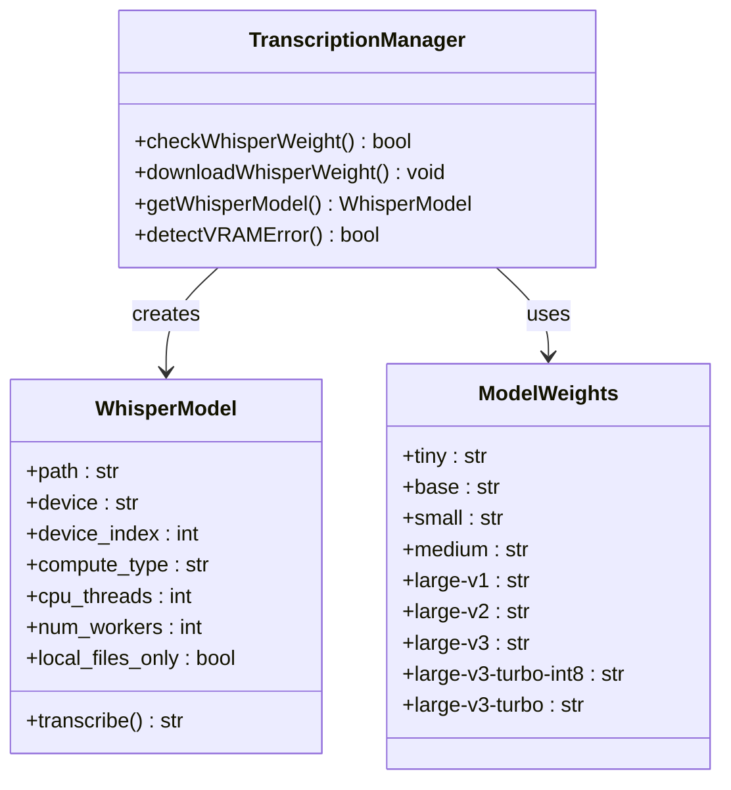

**Diagram sources**
- [transcription_whisper.py](file://src-python/models/transcription/transcription_whisper.py#L23-L33)
- [transcription_whisper.py](file://src-python/models/transcription/transcription_whisper.py#L112-L145)

### Model Loading Process

The transcription model loading process involves several steps:

1. **Availability Check**: Verify local model files exist and are valid
2. **Download**: Fetch missing model files from Hugging Face Hub
3. **Validation**: Test model loading with minimal configuration
4. **Optimization**: Apply compute type and device optimizations

**Section sources**
- [transcription_whisper.py](file://src-python/models/transcription/transcription_whisper.py#L67-L87)
- [transcription_whisper.py](file://src-python/models/transcription/transcription_whisper.py#L88-L111)
- [transcription_whisper.py](file://src-python/models/transcription/transcription_whisper.py#L112-L145)

## Translation Model Management

Translation models support multiple backends including local CTranslate2 models and cloud-based translation services. The system provides seamless switching between different translation engines.

### Translation Backend Architecture

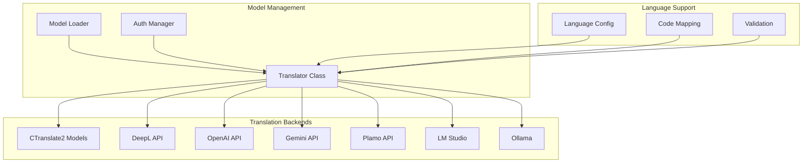

**Diagram sources**
- [translation_translator.py](file://src-python/models/translation/translation_translator.py#L39-L60)
- [translation_translator.py](file://src-python/models/translation/translation_translator.py#L240-L269)

### CTranslate2 Model Management

CTranslate2 models are managed through a specialized system that handles both model weights and associated tokenizers:

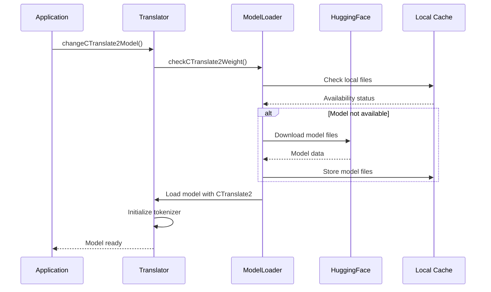

**Diagram sources**
- [translation_translator.py](file://src-python/models/translation/translation_translator.py#L240-L269)
- [translation_utils.py](file://src-python/models/translation/translation_utils.py#L50-L60)

**Section sources**
- [translation_translator.py](file://src-python/models/translation/translation_translator.py#L240-L269)
- [translation_utils.py](file://src-python/models/translation/translation_utils.py#L50-L91)

## Compute Device Selection

The system implements intelligent compute device selection based on hardware capabilities and model requirements. This ensures optimal performance while respecting resource constraints.

### Device Selection Algorithm

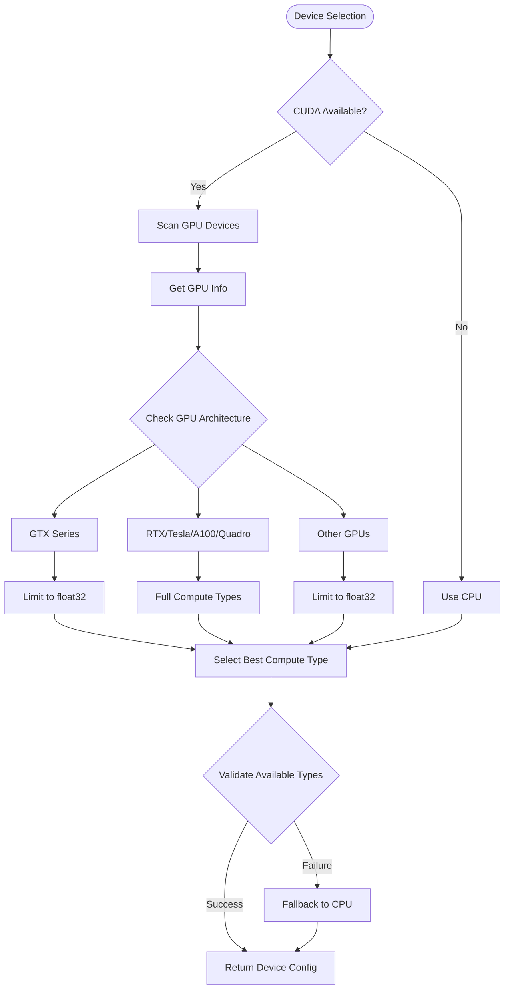

**Diagram sources**
- [utils.py](file://src-python/utils.py#L108-L132)
- [utils.py](file://src-python/utils.py#L134-L171)

### Compute Type Optimization

The system selects optimal compute types based on GPU architecture:

| GPU Family | Supported Types | Priority Order |
|------------|----------------|----------------|
| GTX Series | `float32` only | Lowest priority |
| RTX Series | `int8_bfloat16`, `int8_float16`, `int8`, `bfloat16`, `float16`, `int8_float32`, `float32` | Highest priority |
| Tesla/A100/Quadro | Full range | Highest priority |
| Other GPUs | `float32` only | Lowest priority |

**Section sources**
- [utils.py](file://src-python/utils.py#L108-L132)
- [utils.py](file://src-python/utils.py#L134-L171)

## Configuration Integration

The Model Management system integrates deeply with the configuration system to provide dynamic model management based on user preferences and system capabilities.

### Configuration Schema

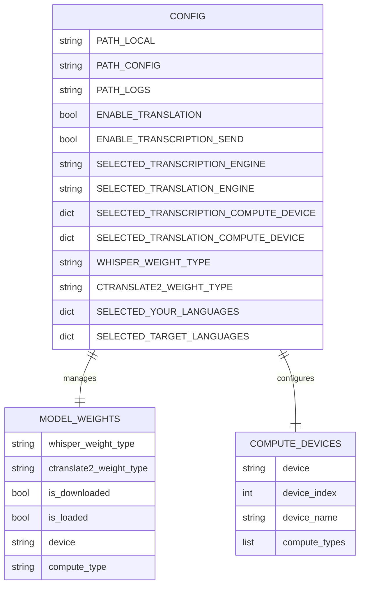

**Diagram sources**
- [config.py](file://src-python/config.py#L531-L558)
- [config.py](file://src-python/config.py#L737-L800)

### Dynamic Configuration Updates

The system responds to configuration changes through event-driven updates:

1. **Model Weight Changes**: Trigger model reloading with new parameters
2. **Device Selection**: Update compute device settings across all models
3. **Language Settings**: Adjust model availability based on supported languages
4. **Performance Tuning**: Modify compute types based on user preferences

**Section sources**
- [config.py](file://src-python/config.py#L531-L558)
- [model.py](file://src-python/model.py#L154-L183)

## Resource Management

The system implements comprehensive resource management to handle memory efficiently and prevent resource leaks.

### Memory Management Strategy

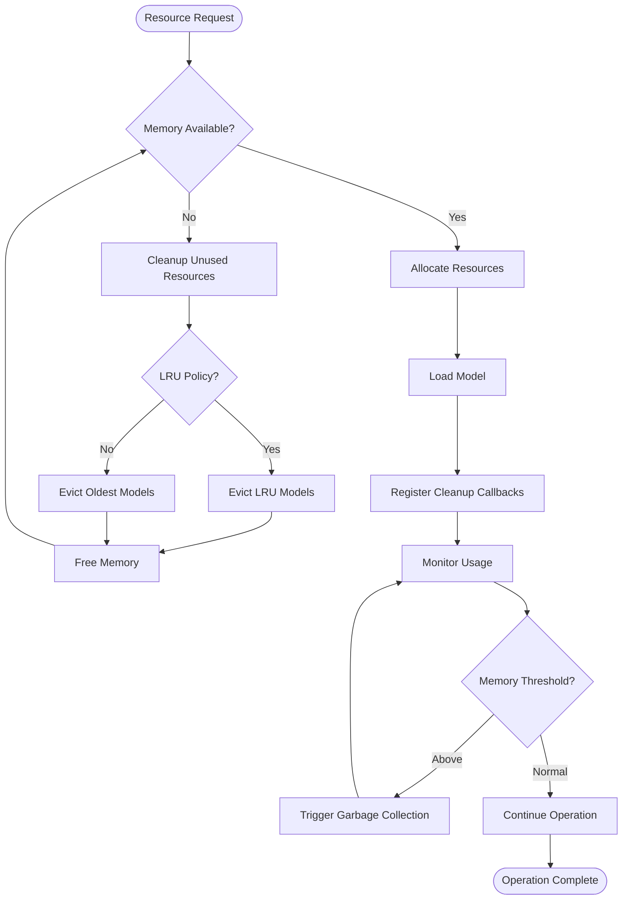

**Diagram sources**
- [model.py](file://src-python/model.py#L616-L702)
- [model.py](file://src-python/model.py#L731-L739)

### Resource Cleanup Mechanisms

The system implements multiple cleanup strategies:

- **Automatic Cleanup**: Periodic garbage collection of unused models
- **Manual Cleanup**: Explicit model unloading on configuration changes
- **Memory Pressure**: Proactive cleanup when memory usage exceeds thresholds
- **Device Changes**: Cleanup when compute devices become unavailable

**Section sources**
- [model.py](file://src-python/model.py#L616-L702)
- [model.py](file://src-python/model.py#L731-L739)

## Error Handling and Recovery

The system implements robust error handling with multiple recovery mechanisms to ensure reliability.

### Error Classification and Recovery

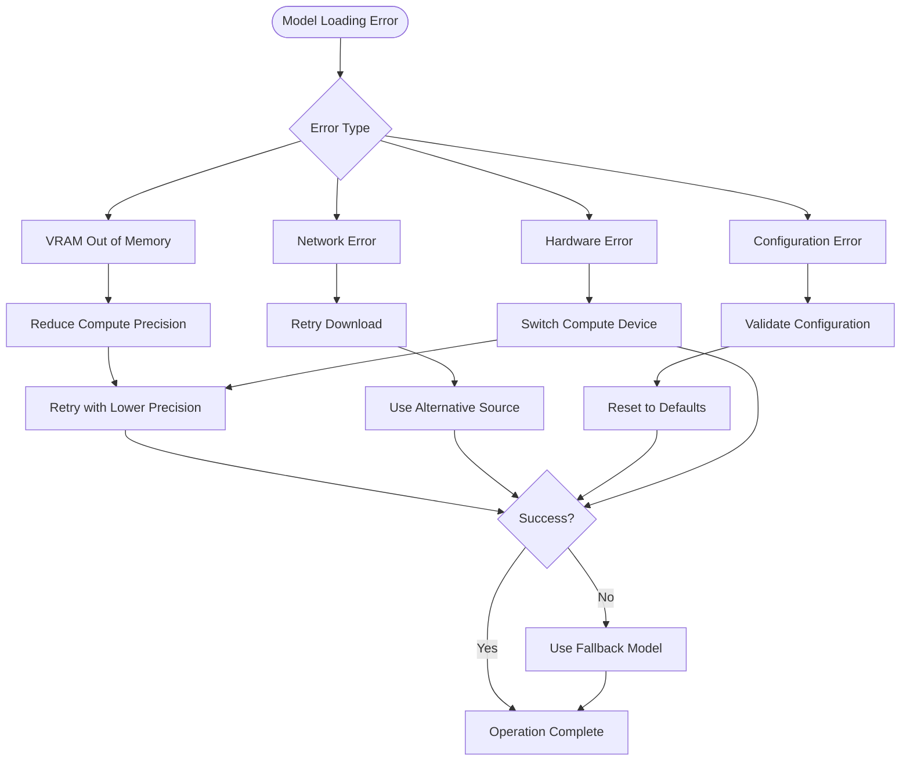

**Diagram sources**
- [model.py](file://src-python/model.py#L731-L739)
- [transcription_whisper.py](file://src-python/models/transcription/transcription_whisper.py#L139-L145)

### Error Recovery Strategies

The system employs multiple recovery strategies:

1. **Fallback Models**: Automatic fallback to smaller, less resource-intensive models
2. **Compute Type Adjustment**: Dynamic adjustment of compute precision
3. **Device Switching**: Automatic switching between CPU and GPU
4. **Network Retry**: Exponential backoff for network-dependent operations
5. **Graceful Degradation**: Partial functionality when full model loading fails

**Section sources**
- [model.py](file://src-python/model.py#L731-L739)
- [transcription_whisper.py](file://src-python/models/transcription/transcription_whisper.py#L139-L145)

## Performance Optimization

The system implements various performance optimization techniques to minimize latency and maximize throughput.

### Model Warm-up Strategies

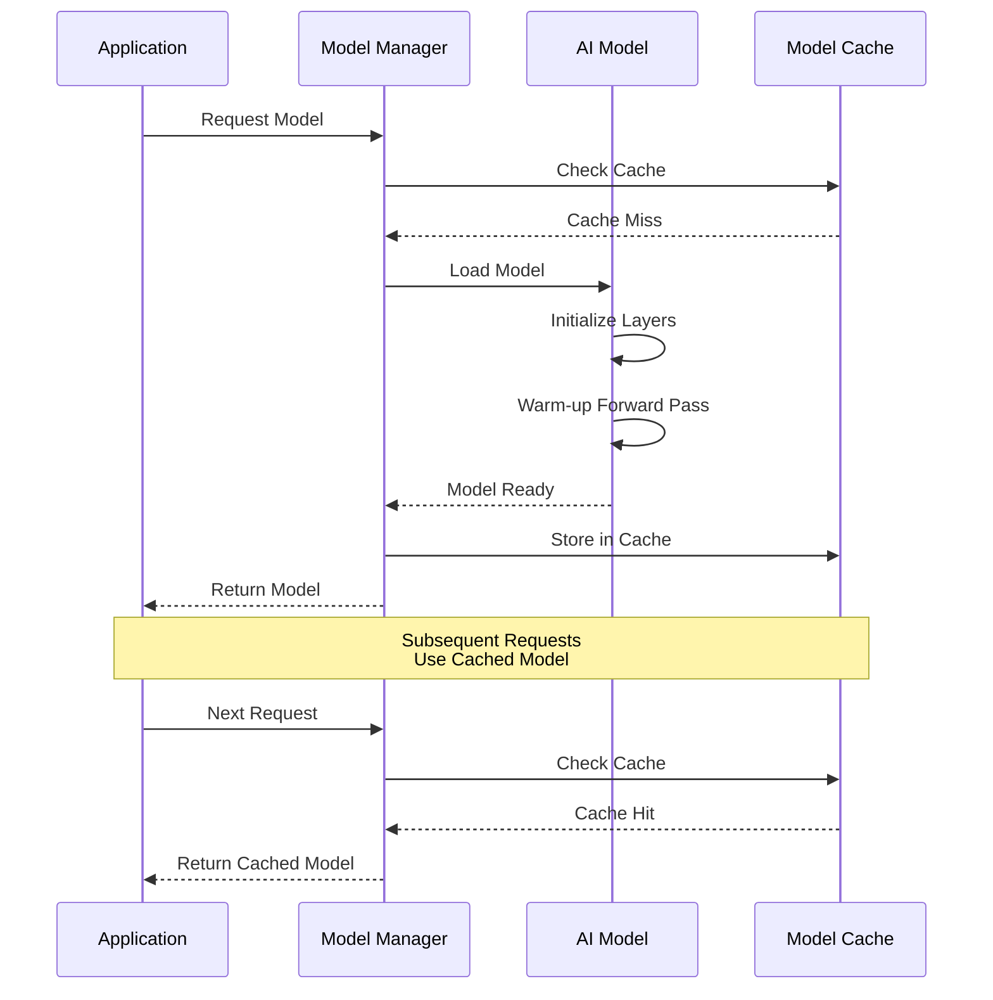

**Diagram sources**
- [model.py](file://src-python/model.py#L616-L702)
- [translation_translator.py](file://src-python/models/translation/translation_translator.py#L240-L269)

### Batching and Concurrency

The system optimizes performance through intelligent batching and concurrency:

- **Request Batching**: Groups multiple translation requests for efficient processing
- **Concurrent Loading**: Loads multiple models in parallel when possible
- **Pipeline Processing**: Overlaps model loading with inference preparation
- **Async Operations**: Non-blocking operations for network and disk I/O

### Performance Monitoring

The system tracks key performance metrics:

| Metric | Description | Target Value |
|--------|-------------|--------------|
| Model Load Time | Time to load model into memory | < 5 seconds |
| Inference Latency | Time for single inference | < 100ms |
| Memory Usage | Peak memory consumption | < 80% of available |
| GPU Utilization | Average GPU utilization | > 70% |
| Cache Hit Rate | Percentage of cache hits | > 80% |

**Section sources**
- [model.py](file://src-python/model.py#L616-L702)
- [translation_translator.py](file://src-python/models/translation/translation_translator.py#L240-L269)

## Troubleshooting Guide

Common issues and their solutions in the Model Management system.

### Model Loading Failures

**Issue**: Models fail to load with CUDA out of memory errors

**Symptoms**:
- `RuntimeError: CUDA out of memory`
- `ValueError: VRAM_OUT_OF_MEMORY`
- Slow model loading times

**Solutions**:
1. Reduce compute precision (`int8` → `float32`)
2. Switch to CPU computation
3. Use smaller model variants
4. Close other GPU-intensive applications

**Issue**: Network timeouts during model downloads

**Symptoms**:
- Download progress stalls
- Timeout exceptions
- Incomplete model files

**Solutions**:
1. Retry download with exponential backoff
2. Use alternative download mirrors
3. Download models manually
4. Configure proxy settings

### Configuration Issues

**Issue**: Incorrect compute device selection

**Symptoms**:
- Models load on wrong device
- Performance degradation
- Device conflicts

**Solutions**:
1. Verify device availability in configuration
2. Clear cached device settings
3. Restart application to re-detect devices
4. Manually specify device in configuration

**Issue**: Language support mismatches

**Symptoms**:
- Translation failures
- Unsupported language combinations
- Model loading errors

**Solutions**:
1. Update language configuration
2. Verify model availability for target languages
3. Install missing language packs
4. Check model compatibility matrix

**Section sources**
- [model.py](file://src-python/model.py#L731-L739)
- [transcription_whisper.py](file://src-python/models/transcription/transcription_whisper.py#L139-L145)

## Best Practices

### Model Management Guidelines

1. **Lazy Loading**: Always use lazy loading for production deployments
2. **Resource Monitoring**: Monitor memory usage and implement cleanup policies
3. **Fallback Strategies**: Implement multiple fallback options for critical models
4. **Configuration Validation**: Validate configuration changes before applying
5. **Error Logging**: Comprehensive error logging for debugging and monitoring

### Performance Optimization

1. **Model Selection**: Choose appropriate model sizes for your use case
2. **Compute Optimization**: Match compute types to hardware capabilities
3. **Caching Strategy**: Implement intelligent caching for frequently used models
4. **Batch Processing**: Group requests to improve throughput
5. **Resource Pooling**: Share resources across multiple model instances

### Deployment Considerations

1. **Environment Setup**: Ensure proper CUDA and PyTorch installation
2. **Disk Space**: Allocate sufficient space for model weights
3. **Network Access**: Configure firewall and proxy settings for downloads
4. **Monitoring**: Implement health checks and performance monitoring
5. **Backup Strategy**: Maintain backups of critical model configurations