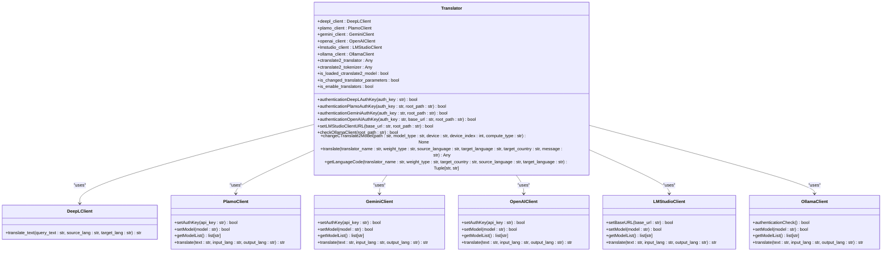
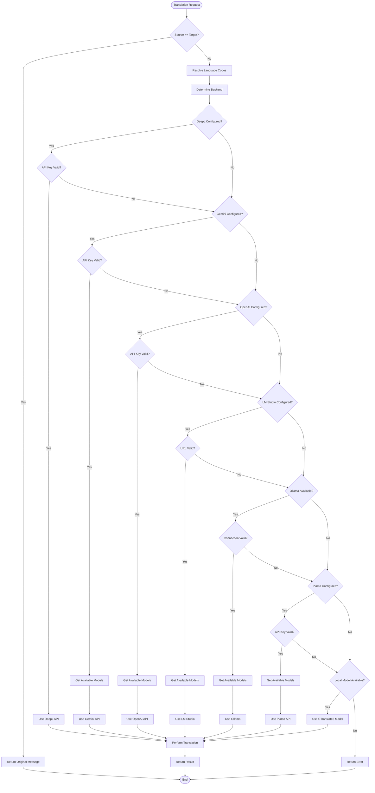
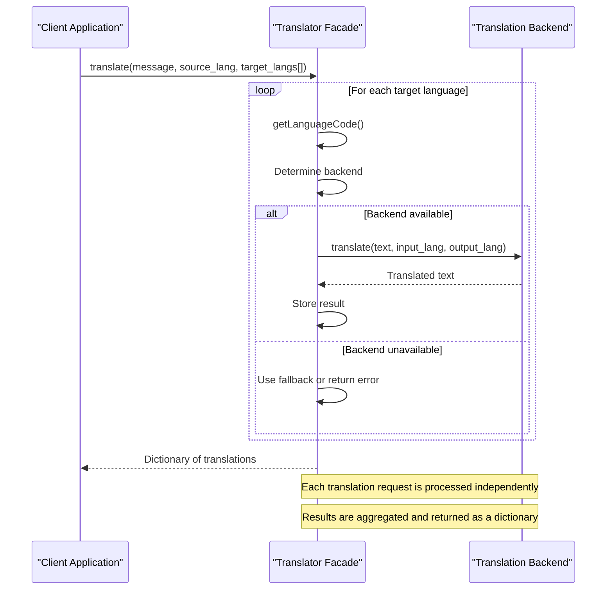
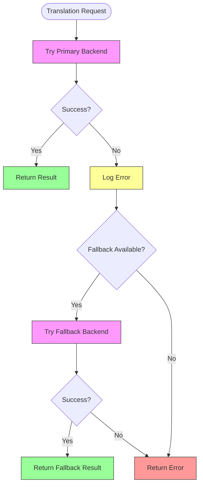
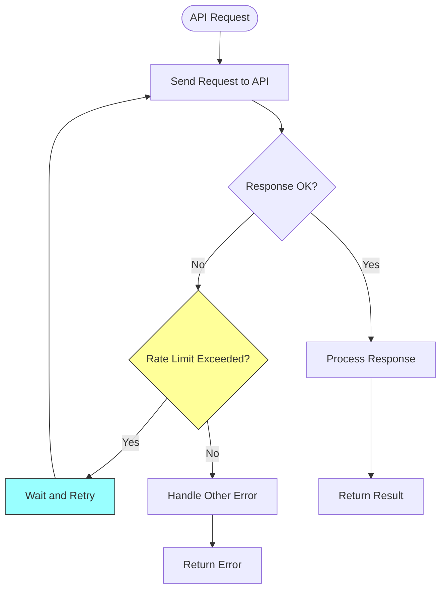

# Translation System

<cite>
**Referenced Files in This Document**   
- [translation_translator.py](file://src-python/models/translation/translation_translator.py)
- [languages.yml](file://src-python/models/translation/languages/languages.yml)
- [translation_utils.py](file://src-python/models/translation/translation_utils.py)
- [translation_languages.py](file://src-python/models/translation/translation_languages.py)
- [translation_gemini.py](file://src-python/models/translation/translation_gemini.py)
- [translation_openai.py](file://src-python/models/translation/translation_openai.py)
- [translation_ollama.py](file://src-python/models/translation/translation_ollama.py)
- [translation_lmstudio.py](file://src-python/models/translation/translation_lmstudio.py)
- [translation_plamo.py](file://src-python/models/translation/translation_plamo.py)
- [config.py](file://src-python/config.py)
</cite>

## Table of Contents
1. [Introduction](#introduction)
2. [Translator Facade Architecture](#translator-facade-architecture)
3. [Backend Routing Logic](#backend-routing-logic)
4. [Language Pair Management](#language-pair-management)
5. [Prompt Engineering Strategies](#prompt-engineering-strategies)
6. [Batch Translation Processing](#batch-translation-processing)
7. [Error Handling and Fallback Mechanisms](#error-handling-and-fallback-mechanisms)
8. [Configuration and Custom Endpoints](#configuration-and-custom-endpoints)
9. [Rate Limiting Considerations](#rate-limiting-considerations)
10. [Troubleshooting Guide](#troubleshooting-guide)

## Introduction

The Translation System provides a unified interface for multiple translation backends, enabling seamless integration of various AI models and services. The system is designed with a facade pattern that abstracts the complexity of different translation APIs and local models, providing a consistent interface for translation operations. This documentation details the architecture, implementation, and configuration of the translation system, focusing on the Translator facade that manages multiple backend services including Gemini, OpenAI, Ollama, LM Studio, and local CTranslate2 models.

**Section sources**
- [translation_translator.py](file://src-python/models/translation/translation_translator.py#L39-L455)

## Translator Facade Architecture

The Translator class serves as a facade that unifies multiple translation backends through a consistent interface. It manages connections to various translation services and provides methods for authentication, model selection, and translation operations.



**Diagram sources**
- [translation_translator.py](file://src-python/models/translation/translation_translator.py#L39-L455)

**Section sources**
- [translation_translator.py](file://src-python/models/translation/translation_translator.py#L39-L455)

## Backend Routing Logic

The routing logic in the Translation System determines which backend to use based on configuration settings, API key availability, and language support. The system evaluates multiple factors to select the appropriate translation service for each request.



**Diagram sources**
- [translation_translator.py](file://src-python/models/translation/translation_translator.py#L331-L441)
- [translation_gemini.py](file://src-python/models/translation/translation_gemini.py#L94-L116)
- [translation_openai.py](file://src-python/models/translation/translation_openai.py#L107-L128)
- [translation_ollama.py](file://src-python/models/translation/translation_ollama.py#L81-L102)
- [translation_lmstudio.py](file://src-python/models/translation/translation_lmstudio.py#L87-L108)
- [translation_plamo.py](file://src-python/models/translation/translation_plamo.py#L82-L103)

**Section sources**
- [translation_translator.py](file://src-python/models/translation/translation_translator.py#L331-L441)

## Language Pair Management

The system manages language pairs through the languages.yml configuration file, which defines the supported languages and their corresponding codes for each translation backend. This centralized configuration enables consistent language handling across all translation services.

```mermaid
erDiagram
BACKEND {
string name PK
string source_languages
string target_languages
}
MODEL {
string model_id PK
string backend FK
string source_languages
string target_languages
}
LANGUAGE {
string display_name PK
string code
}
BACKEND ||--o{ MODEL : "has"
BACKEND ||--o{ LANGUAGE : "supports"
MODEL ||--o{ LANGUAGE : "supports"
BACKEND {
DeepL
DeepL_API
Google
Bing
Papago
CTranslate2
Plamo_API
Gemini_API
OpenAI_API
LMStudio
Ollama
}
MODEL {
m2m100_418M-ct2-int8
m2m100_1.2B-ct2-int8
nllb-200-distilled-1.3B-ct2-int8
nllb-200-3.3B-ct2-int8
}
```

**Diagram sources**
- [languages.yml](file://src-python/models/translation/languages/languages.yml)
- [translation_languages.py](file://src-python/models/translation/translation_languages.py#L80-L136)

**Section sources**
- [languages.yml](file://src-python/models/translation/languages/languages.yml)
- [translation_languages.py](file://src-python/models/translation/translation_languages.py#L80-L136)

## Prompt Engineering Strategies

The system employs YAML-based prompt templates for each translation backend, ensuring consistent instruction formatting and response parsing. These templates are loaded dynamically and support variable substitution for language-specific parameters.

```mermaid
classDiagram
class PromptTemplate {
+system_prompt : str
+supported_languages : list[str]
+input_lang : str
+output_lang : str
}
class PromptLoader {
+loadPromptConfig(root_path : str, prompt_filename : str) dict
}
PromptTemplate <|-- GeminiTemplate
PromptTemplate <|-- OpenAITemplate
PromptTemplate <|-- OllamaTemplate
PromptTemplate <|-- LMStudioTemplate
PromptTemplate <|-- PlamoTemplate
GeminiTemplate : "You are a helpful translation assistant.\nSupported languages : \n{supported_languages}\n\nTranslate the user provided text from {input_lang} to {output_lang}.\nReturn ONLY the translated text. Do not add quotes or extra commentary."
OpenAITemplate : "You are a helpful translation assistant.\nSupported languages : \n{supported_languages}\n\nTranslate the user provided text from {input_lang} to {output_lang}.\nReturn ONLY the translated text. Do not add quotes or extra commentary."
OllamaTemplate : "You are a helpful translation assistant.\nSupported languages : \n{supported_languages}\n\nTranslate the user provided text from {input_lang} to {output_lang}.\nReturn ONLY the translated text. Do not add quotes or extra commentary."
LMStudioTemplate : "You are a helpful translation assistant.\nSupported languages : \n{supported_languages}\n\nTranslate the user provided text from {input_lang} to {output_lang}.\nReturn ONLY the translated text. Do not add quotes or extra commentary."
PlamoTemplate : "You are a translation assistant that uses the `plamo-translate` tool.\nTranslate the following text.Supported languages include : \n{supported_languages}\n\nTranslate the following text from {input_lang} to {output_lang}.\noutput only the translated text without any additional commentary."
PromptLoader --> PromptTemplate : "loads"
```

**Diagram sources**
- [prompt/translation_gemini.yml](file://src-python/models/translation/prompt/translation_gemini.yml)
- [prompt/translation_openai.yml](file://src-python/models/translation/prompt/translation_openai.yml)
- [prompt/translation_ollama.yml](file://src-python/models/translation/prompt/translation_ollama.yml)
- [prompt/translation_lmstudio.yml](file://src-python/models/translation/prompt/translation_lmstudio.yml)
- [prompt/translation_plamo.yml](file://src-python/models/translation/prompt/translation_plamo.yml)
- [translation_utils.py](file://src-python/models/translation/translation_utils.py#L104-L117)

**Section sources**
- [prompt/translation_gemini.yml](file://src-python/models/translation/prompt/translation_gemini.yml)
- [prompt/translation_openai.yml](file://src-python/models/translation/prompt/translation_openai.yml)
- [prompt/translation_ollama.yml](file://src-python/models/translation/prompt/translation_ollama.yml)
- [prompt/translation_lmstudio.yml](file://src-python/models/translation/prompt/translation_lmstudio.yml)
- [prompt/translation_plamo.yml](file://src-python/models/translation/prompt/translation_plamo.yml)
- [translation_utils.py](file://src-python/models/translation/translation_utils.py#L104-L117)

## Batch Translation Processing

The system supports batch translation for multiple target languages through a centralized translation method that handles routing and processing for each language pair. This enables efficient translation of content to multiple languages simultaneously.



**Diagram sources**
- [translation_translator.py](file://src-python/models/translation/translation_translator.py#L331-L441)
- [config.py](file://src-python/config.py#L723-L725)

**Section sources**
- [translation_translator.py](file://src-python/models/translation/translation_translator.py#L331-L441)

## Error Handling and Fallback Mechanisms

The system implements comprehensive error handling and fallback mechanisms to ensure translation availability even when primary services fail. This includes graceful degradation, retry logic, and alternative backend selection.



**Diagram sources**
- [translation_translator.py](file://src-python/models/translation/translation_translator.py#L338-L440)
- [translation_gemini.py](file://src-python/models/translation/translation_gemini.py#L94-L116)
- [translation_openai.py](file://src-python/models/translation/translation_openai.py#L107-L128)

**Section sources**
- [translation_translator.py](file://src-python/models/translation/translation_translator.py#L338-L440)

## Configuration and Custom Endpoints

The system supports extensive configuration options, including custom endpoints for cloud APIs, model parameters, and response parsing. These configurations are managed through the config.py file and can be modified through the application interface.

```mermaid
classDiagram
class Config {
+AUTH_KEYS : dict
+LMSTUDIO_URL : str
+SELECTED_TRANSLATION_ENGINES : dict
+SELECTED_TRANSLATION_COMPUTE_DEVICE : dict
+SELECTED_TRANSLATION_COMPUTE_TYPE : str
+SELECTED_PLAMO_MODEL : str
+SELECTED_GEMINI_MODEL : str
+SELECTED_OPENAI_MODEL : str
+SELECTED_LMSTUDIO_MODEL : str
+SELECTED_OLLAMA_MODEL : str
+CTRANSLATE2_WEIGHT_TYPE : str
}
class ManagedProperty {
+name : str
+type_ : type
+allowed : list
+immediate_save : bool
+serialize : bool
+readonly : bool
}
class ValidatedProperty {
+name : str
+validator : function
+immediate_save : bool
+serialize : bool
}
Config --> ManagedProperty : "uses"
Config --> ValidatedProperty : "uses"
ManagedProperty --> Config : "defines properties"
ValidatedProperty --> Config : "defines properties"
note right of Config
Configuration properties are defined using
ManagedProperty and ValidatedProperty descriptors
to ensure type safety and validation
end note
```

**Diagram sources**
- [config.py](file://src-python/config.py#L672-L735)
- [translation_translator.py](file://src-python/models/translation/translation_translator.py#L144-L155)
- [translation_ollama.py](file://src-python/models/translation/translation_ollama.py#L48)

**Section sources**
- [config.py](file://src-python/config.py#L672-L735)

## Rate Limiting Considerations

The system accounts for rate limiting in cloud APIs by implementing connection management and error handling for rate limit exceeded responses. While explicit rate limiting logic is not implemented, the system gracefully handles rate limit errors through its error handling mechanisms.



**Diagram sources**
- [translation_gemini.py](file://src-python/models/translation/translation_gemini.py#L22-L27)
- [translation_openai.py](file://src-python/models/translation/translation_openai.py#L18-L23)
- [translation_ollama.py](file://src-python/models/translation/translation_ollama.py#L17-L24)

**Section sources**
- [translation_gemini.py](file://src-python/models/translation/translation_gemini.py#L22-L27)

## Troubleshooting Guide

This section provides guidance for common issues encountered when using the translation system, including authentication errors, timeout issues, and malformed responses.

### Authentication Errors

Authentication errors typically occur when API keys are invalid, expired, or improperly configured. To resolve authentication issues:

1. Verify that the API key is correctly entered in the configuration
2. Check that the API key has the necessary permissions for translation services
3. Ensure that the API key has not expired
4. Confirm that the service is available in your region

**Section sources**
- [translation_gemini.py](file://src-python/models/translation/translation_gemini.py#L72-L76)
- [translation_openai.py](file://src-python/models/translation/translation_openai.py#L83-L87)
- [translation_plamo.py](file://src-python/models/translation/translation_plamo.py#L58-L62)

### Timeout Issues

Timeout issues may occur due to network connectivity problems or slow response times from translation services. To address timeout issues:

1. Check your internet connection
2. Verify that the translation service endpoint is reachable
3. Consider using a different translation backend
4. Increase timeout settings if available

**Section sources**
- [translation_ollama.py](file://src-python/models/translation/translation_ollama.py#L17-L24)
- [translation_lmstudio.py](file://src-python/models/translation/translation_lmstudio.py#L18-L23)

### Malformed Responses

Malformed responses can occur when the translation service returns unexpected data formats. The system handles malformed responses by:

1. Validating response structure before processing
2. Implementing fallback mechanisms for failed translations
3. Logging errors for diagnostic purposes
4. Returning appropriate error codes to the calling application

**Section sources**
- [translation_gemini.py](file://src-python/models/translation/translation_gemini.py#L106-L116)
- [translation_openai.py](file://src-python/models/translation/translation_openai.py#L118-L128)
- [translation_ollama.py](file://src-python/models/translation/translation_ollama.py#L92-L102)