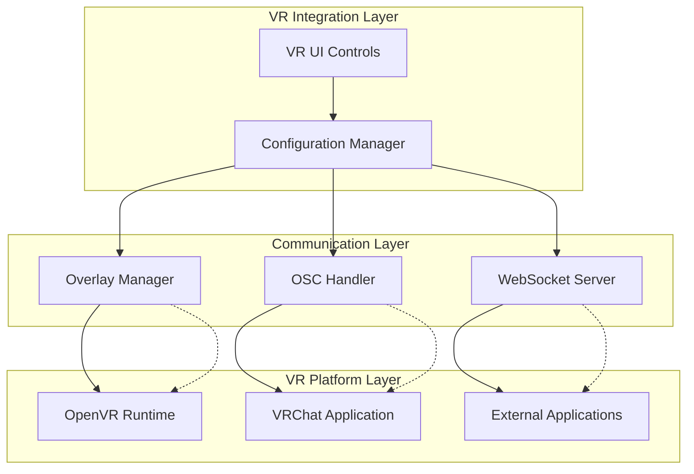
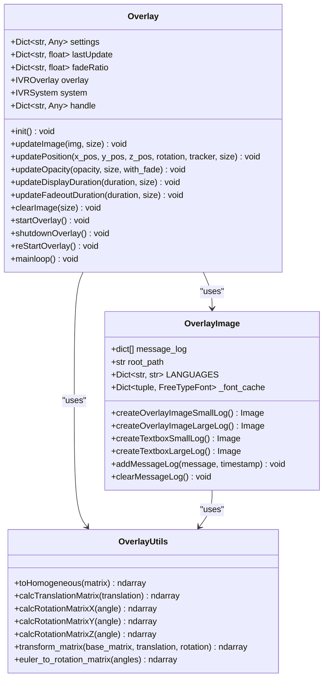
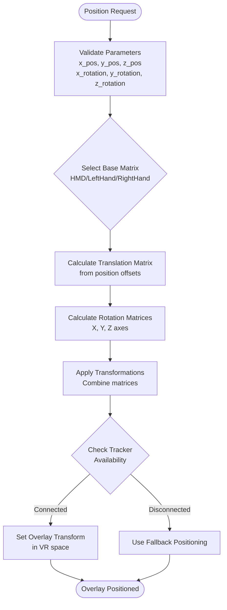
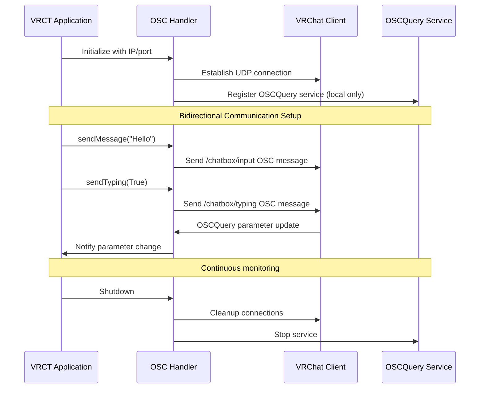
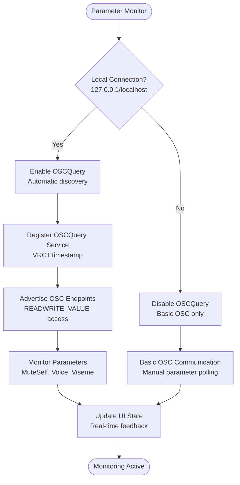
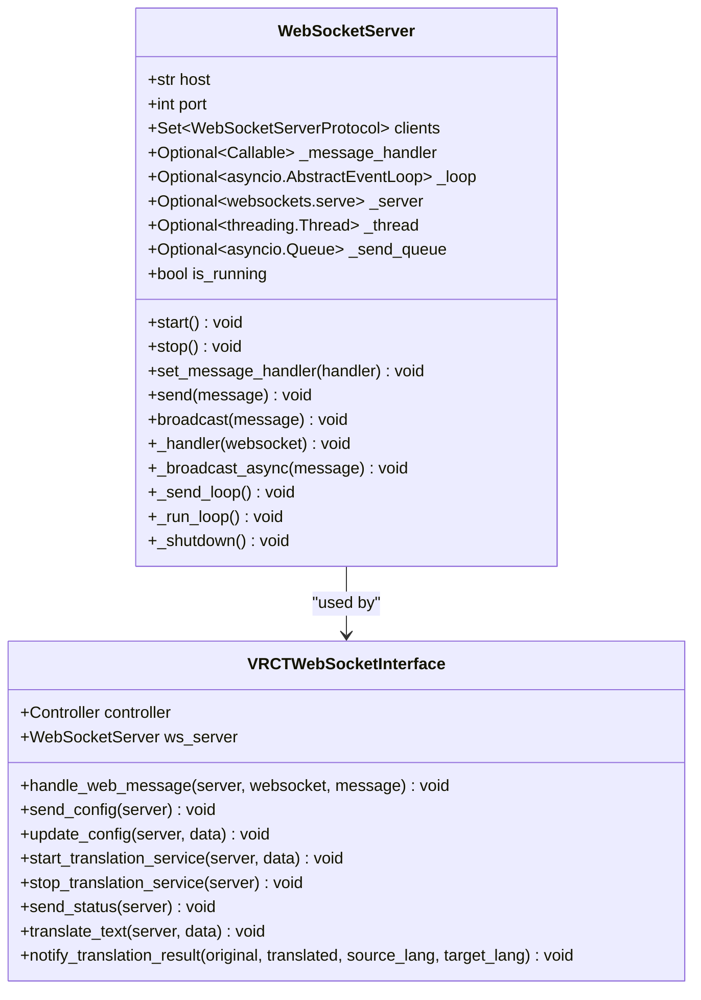
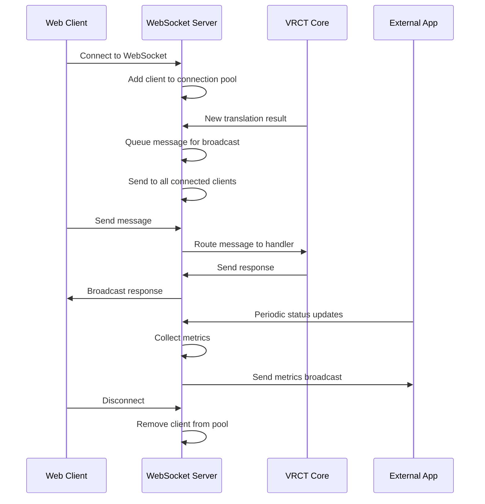
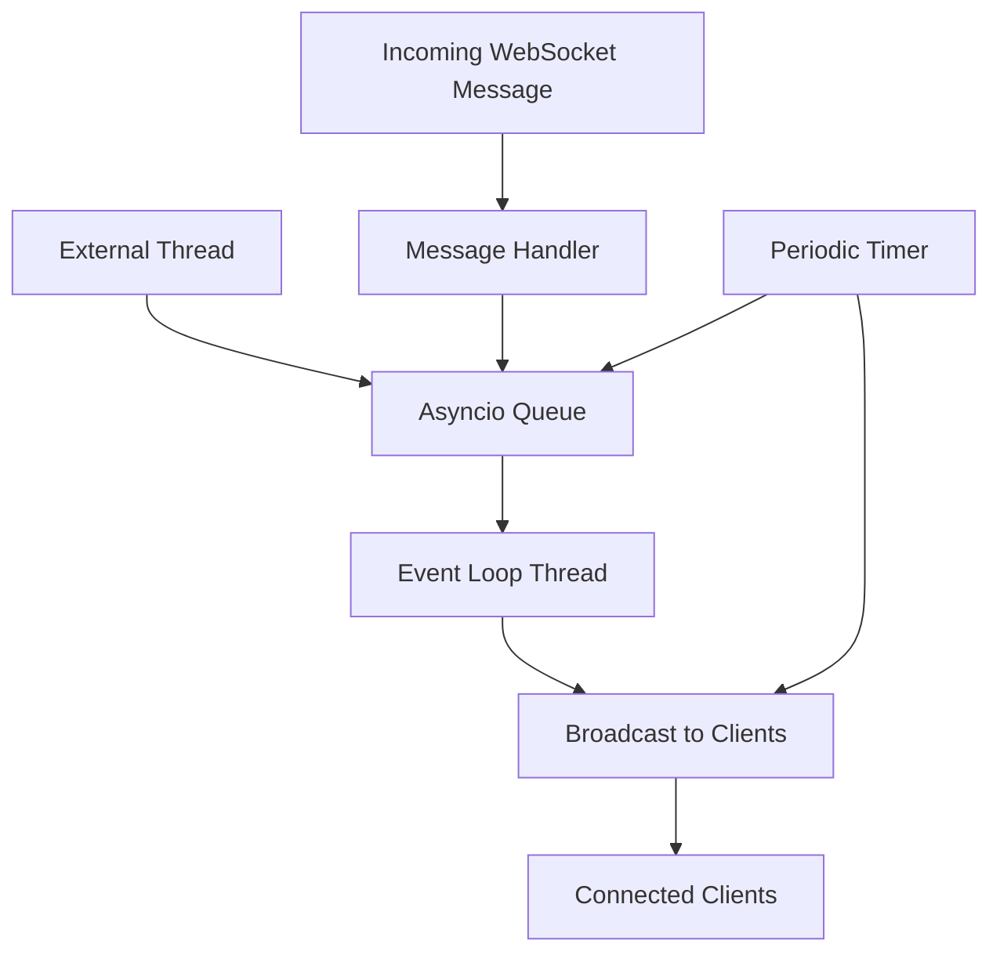
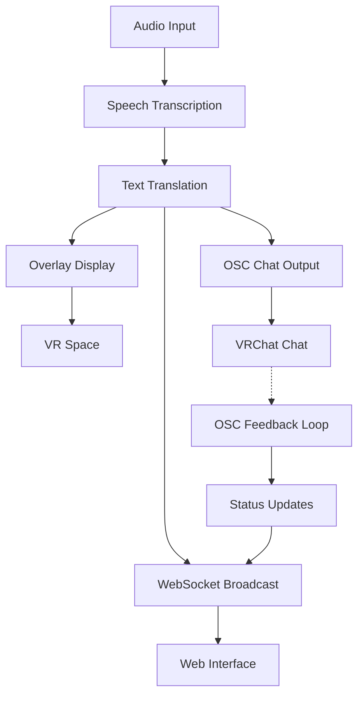
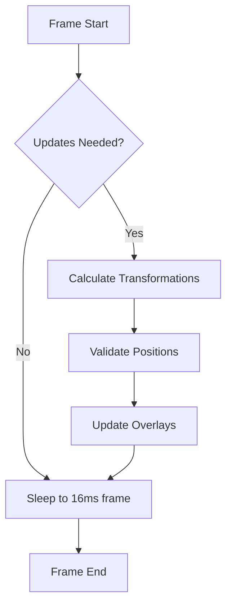

# VR Integration Subsystem

<cite>
**Referenced Files in This Document**
- [overlay.py](file://src-python/models/overlay/overlay.py)
- [osc.py](file://src-python/models/osc/osc.py)
- [websocket_server.py](file://src-python/models/websocket/websocket_server.py)
- [overlay_utils.py](file://src-python/models/overlay/overlay_utils.py)
- [overlay_image.py](file://src-python/models/overlay/overlay_image.py)
- [overlay.md](file://src-python/docs/details/overlay.md)
- [osc.md](file://src-python/docs/details/osc.md)
- [websocket_server.md](file://src-python/docs/details/websocket_server.md)
- [controller.py](file://src-python/controller.py)
- [Vr.jsx](file://src-ui/views/app/config_page/setting_section/setting_box/vr/Vr.jsx)
</cite>

## Table of Contents
1. [Introduction](#introduction)
2. [System Architecture](#system-architecture)
3. [OpenVR Overlay Integration](#openvr-overlay-integration)
4. [OSC Communication with VRChat](#osc-communication-with-vrchat)
5. [WebSocket Server for External Applications](#websocket-server-for-external-applications)
6. [Configuration Management](#configuration-management)
7. [Integration Patterns](#integration-patterns)
8. [Common Issues and Debugging](#common-issues-and-debugging)
9. [Performance Optimization](#performance-optimization)
10. [Troubleshooting Guide](#troubleshooting-guide)

## Introduction

The VR Integration subsystem of VRCT provides comprehensive virtual reality support through three primary integration points: OpenVR overlays for displaying text messages in VR space, OSC (Open Sound Control) communication with VRChat for chat integration, and WebSocket servers for external application connectivity. This subsystem enables seamless communication between VRCT and VR environments, particularly VRChat, while maintaining real-time synchronization across multiple modalities.

The integration system is designed with modularity and reliability in mind, featuring automatic error recovery, configurable positioning systems, and robust communication protocols. It supports multiple overlay sizes, dynamic positioning, transparency controls, and real-time synchronization between different output channels.

## System Architecture

The VR Integration subsystem follows a layered architecture that separates concerns between presentation, communication, and control logic:



**Diagram sources**
- [controller.py](file://src-python/controller.py#L1-L50)
- [osc.py](file://src-python/models/osc/osc.py#L40-L67)
- [websocket_server.py](file://src-python/models/websocket/websocket_server.py#L7-L30)
- [overlay.py](file://src-python/models/overlay/overlay.py#L85-L105)

**Section sources**
- [controller.py](file://src-python/controller.py#L11-L49)
- [overlay.md](file://src-python/docs/details/overlay.md#L1-L50)
- [osc.md](file://src-python/docs/details/osc.md#L1-L50)
- [websocket_server.md](file://src-python/docs/details/websocket_server.md#L1-L50)

## OpenVR Overlay Integration

The OpenVR overlay system provides immersive text display capabilities within VR environments, rendering messages as 2D overlays that can be positioned and scaled according to user preferences.

### Core Overlay System

The [`Overlay`](file://src-python/models/overlay/overlay.py#L85-L105) class serves as the central manager for OpenVR overlay operations:



**Diagram sources**
- [overlay.py](file://src-python/models/overlay/overlay.py#L85-L105)
- [overlay_image.py](file://src-python/models/overlay/overlay_image.py#L12-L42)
- [overlay_utils.py](file://src-python/models/overlay/overlay_utils.py#L1-L126)

### Overlay Positioning and Transformation

The overlay system supports sophisticated positioning through a coordinate transformation system:

#### Base Matrix Calculations

The system defines three primary positioning bases:

- **HMD Base Matrix**: Fixed positioning relative to the head-mounted display
- **Left Hand Base Matrix**: Dynamic positioning relative to the left controller
- **Right Hand Base Matrix**: Dynamic positioning relative to the right controller

Each base matrix establishes a reference coordinate system with configurable offsets and rotations.

#### Coordinate Transformation Pipeline



**Diagram sources**
- [overlay.py](file://src-python/models/overlay/overlay.py#L184-L225)
- [overlay_utils.py](file://src-python/models/overlay/overlay_utils.py#L71-L92)

### Text Rendering and Display

The [`OverlayImage`](file://src-python/models/overlay/overlay_image.py#L12-L42) class handles sophisticated text rendering with multilingual support:

#### Multilingual Font Management

The system automatically selects appropriate fonts based on language detection:

| Language | Font Family | Character Support |
|----------|-------------|-------------------|
| Japanese | NotoSansJP-Regular.ttf | Hiragana, Katakana, Kanji |
| Korean | NotoSansKR-Regular.ttf | Hangul characters |
| Chinese Simplified | NotoSansSC-Regular.ttf | Simplified Chinese |
| Chinese Traditional | NotoSansTC-Regular.ttf | Traditional Chinese |
| Default | NotoSansJP-Regular.ttf | Latin characters |

#### Overlay Types and Layouts

The system supports two primary overlay types:

1. **Small Log Overlay**: Compact single-line displays for quick messages
2. **Large Log Overlay**: Multi-line displays with message history and formatting

**Section sources**
- [overlay.py](file://src-python/models/overlay/overlay.py#L85-L388)
- [overlay_image.py](file://src-python/models/overlay/overlay_image.py#L12-L733)
- [overlay_utils.py](file://src-python/models/overlay/overlay_utils.py#L1-L126)

## OSC Communication with VRChat

The OSC (Open Sound Control) subsystem enables bidirectional communication with VRChat, facilitating chat message transmission, typing indicator control, and parameter monitoring.

### OSC Protocol Implementation

The [`OSCHandler`](file://src-python/models/osc/osc.py#L40-L67) class provides comprehensive OSC communication capabilities:



**Diagram sources**
- [osc.py](file://src-python/models/osc/osc.py#L40-L67)
- [osc.py](file://src-python/models/osc/osc.py#L154-L206)

### OSC Message Types

The system supports several OSC message types for comprehensive VRChat integration:

#### Chat Box Messages
- **Address**: `/chatbox/input`
- **Format**: `[message_string, true, notification_bool]`
- **Purpose**: Sends formatted chat messages to VRChat

#### Typing Indicators
- **Address**: `/chatbox/typing`
- **Format**: `[boolean_flag]`
- **Purpose**: Controls typing animation display

#### Parameter Monitoring
- **Address**: `/avatar/parameters/MuteSelf`
- **Format**: `[boolean_value]`
- **Purpose**: Monitors user mute status

### OSCQuery Integration

OSCQuery provides automatic service discovery and parameter monitoring:

#### Service Discovery Features
- Automatic service registration on localhost connections
- Real-time parameter value monitoring
- Bidirectional endpoint advertisement
- Browser-based parameter inspection

#### Parameter Monitoring Capabilities



**Diagram sources**
- [osc.py](file://src-python/models/osc/osc.py#L154-L206)
- [osc.py](file://src-python/models/osc/osc.py#L242-L304)

**Section sources**
- [osc.py](file://src-python/models/osc/osc.py#L40-L241)
- [osc.md](file://src-python/docs/details/osc.md#L1-L602)

## WebSocket Server for External Applications

The WebSocket server enables real-time communication with external applications, providing message broadcasting, control endpoints, and integration with web-based interfaces.

### WebSocket Server Architecture

The [`WebSocketServer`](file://src-python/models/websocket/websocket_server.py#L7-L30) class implements a robust asynchronous WebSocket communication system:



**Diagram sources**
- [websocket_server.py](file://src-python/models/websocket/websocket_server.py#L7-L30)
- [websocket_server.md](file://src-python/docs/details/websocket_server.md#L188-L341)

### Message Routing and Broadcasting

The WebSocket system supports sophisticated message routing patterns:

#### Message Types and Handlers

| Message Type | Purpose | Handler Function |
|--------------|---------|------------------|
| `translation_request` | Translate text requests | `handle_translation_request()` |
| `config_update` | Configuration changes | `handle_config_update()` |
| `get_config` | Configuration queries | `send_config()` |
| `get_status` | System status requests | `send_status()` |
| `translate_text` | Immediate translation | `translate_text()` |

#### Broadcast Architecture



**Diagram sources**
- [websocket_server.py](file://src-python/models/websocket/websocket_server.py#L38-L57)
- [websocket_server.md](file://src-python/docs/details/websocket_server.md#L361-L530)

### Thread-Safe Communication

The WebSocket server implements thread-safe communication patterns for external application integration:

#### Async Event Loop Management

The server operates within an asyncio event loop that ensures thread safety:

- **Background Thread**: WebSocket server runs in dedicated thread
- **Queue-Based Communication**: External threads communicate via asyncio queues
- **Event Loop Integration**: Seamless integration with VRCT's main event loop

#### Message Queuing System



**Diagram sources**
- [websocket_server.py](file://src-python/models/websocket/websocket_server.py#L70-L82)
- [websocket_server.py](file://src-python/models/websocket/websocket_server.py#L113-L132)

**Section sources**
- [websocket_server.py](file://src-python/models/websocket/websocket_server.py#L7-L222)
- [websocket_server.md](file://src-python/docs/details/websocket_server.md#L1-L989)

## Configuration Management

The VR Integration subsystem provides comprehensive configuration management through multiple layers:

### Overlay Configuration

Overlay settings are managed through a hierarchical configuration system:

#### Small Log Settings
- **Width**: 3840 pixels (full screen width)
- **Height**: 92 pixels (compact height)
- **Font Size**: 92 pixels
- **Display Duration**: Configurable seconds
- **Fadeout Duration**: Configurable seconds
- **Opacity**: 0.0-1.0 range
- **UI Scaling**: 1.0 default scale

#### Large Log Settings
- **Width**: 960 pixels
- **Font Sizes**: 30px (large), 20px (small)
- **Margins**: 25 pixels
- **Corner Radius**: 25 pixels
- **Clause Margins**: 20 pixels

### OSC Configuration

OSC communication settings are centralized in the configuration system:

#### Network Configuration
- **IP Address**: Target VRChat IP (default: 127.0.0.1)
- **Port**: UDP port for OSC communication (default: 9000)
- **Auto-discovery**: OSCQuery service discovery

#### Parameter Monitoring
- **Mute Sync**: Synchronize mute status with VRChat
- **Voice Level**: Monitor voice activity levels
- **Gesture Detection**: Track hand gestures

### WebSocket Configuration

WebSocket server configuration supports flexible deployment:

#### Server Settings
- **Host**: Binding address (default: 127.0.0.1)
- **Port**: WebSocket port (default: 8765)
- **Authentication**: Optional API key protection
- **SSL/TLS**: Secure connection support

#### Client Management
- **Connection Limits**: Maximum concurrent connections
- **Heartbeat**: Connection health monitoring
- **Reconnection**: Automatic reconnection handling

**Section sources**
- [Vr.jsx](file://src-ui/views/app/config_page/setting_section/setting_box/vr/Vr.jsx#L42-L144)
- [controller.py](file://src-python/controller.py#L1505-L1542)

## Integration Patterns

The VR Integration subsystem implements several integration patterns for seamless operation:

### Synchronization Between Modalities

The system maintains synchronization across multiple output channels:



### Message Formatting for Different Channels

Each output channel requires specific message formatting:

#### Overlay Message Format
```
{
    "type": "overlay_message",
    "content": "Translated text",
    "language": "en",
    "timestamp": "2024-01-01T12:00:00Z",
    "position": {
        "x": 0.0,
        "y": -0.2,
        "z": 1.0,
        "rotation": [0.0, 0.0, 0.0],
        "tracker": "HMD"
    },
    "style": {
        "opacity": 0.8,
        "font_size": 24,
        "color": [255, 255, 255, 255],
        "background": [0, 0, 0, 180]
    }
}
```

#### OSC Message Format
```
/chatbox/input ["Translated text", true, true]
/chatbox/typing [true/false]
/avatar/parameters/MuteSelf [true/false]
```

#### WebSocket Message Format
```json
{
    "type": "translation_result",
    "original": "Original text",
    "translated": "Translated text",
    "source_language": "ja",
    "target_language": "en",
    "timestamp": 1234567890.123,
    "metadata": {
        "confidence": 0.95,
        "processing_time": 2.3
    }
}
```

### Error Recovery Patterns

The system implements robust error recovery mechanisms:

#### Overlay Recovery
- **SteamVR Detection**: Automatic SteamVR process monitoring
- **Overlay Restart**: Graceful overlay system restart on failure
- **Position Validation**: Tracker availability checking
- **Resource Cleanup**: Proper resource deallocation

#### OSC Recovery
- **Connection Monitoring**: UDP connection health checks
- **Parameter Retry**: Automatic parameter value retry
- **Service Re-registration**: OSCQuery service re-registration
- **Fallback Mode**: Basic OSC mode when OSCQuery unavailable

#### WebSocket Recovery
- **Connection Pool Management**: Automatic client connection cleanup
- **Message Queue Persistence**: Queued messages survive server restarts
- **Graceful Degradation**: Reduced functionality during failures
- **Health Monitoring**: Periodic connection health checks

**Section sources**
- [overlay.md](file://src-python/docs/details/overlay.md#L168-L348)
- [osc.md](file://src-python/docs/details/osc.md#L118-L217)
- [websocket_server.md](file://src-python/docs/details/websocket_server.md#L361-L530)

## Common Issues and Debugging

### Overlay Visibility Issues

#### Problem: Overlays Not Visible in VR
**Symptoms**: Overlays appear in desktop mode but not in VR headset
**Causes**: 
- SteamVR not running or not properly configured
- OpenVR runtime issues
- Incorrect overlay positioning
- Tracking device disconnection

**Debugging Steps**:
1. Verify SteamVR is running and properly calibrated
2. Check overlay initialization logs
3. Validate tracking device connections
4. Test with default overlay positions

**Solutions**:
```python
# Force overlay restart
overlay.reStartOverlay()

# Check SteamVR status
if not overlay.checkSteamvrRunning():
    print("SteamVR not running")

# Validate tracking devices
if not overlay.system.isTrackedDeviceConnected(trackerIndex):
    print("Tracking device disconnected")
```

### OSC Address Mismatches

#### Problem: OSC Messages Not Received
**Symptoms**: OSC messages sent but not appearing in VRChat
**Causes**:
- Incorrect IP address configuration
- Port conflicts or firewall blocking
- OSCQuery service registration failure
- VRChat OSC reception disabled

**Debugging Tools**:
- OSC monitoring applications (e.g., OSCulator)
- Network packet capture tools
- VRChat console logging
- OSCQuery browser utilities

**Solutions**:
```python
# Test OSC connectivity
osc = OSCHandler(ip_address="127.0.0.1", port=9000)
print(f"OSCQuery enabled: {osc.getIsOscQueryEnabled()}")

# Test message sending
osc.sendMessage("Test message", notification=True)

# Monitor parameter changes
mute_status = osc.getOSCParameterMuteSelf()
print(f"Mute status: {mute_status}")
```

### WebSocket Connection Stability

#### Problem: WebSocket Connections Dropping
**Symptoms**: Intermittent disconnections, lost messages
**Causes**:
- Network instability
- Firewall blocking WebSocket connections
- Server overload
- Client-side connection limits

**Debugging Methods**:
- WebSocket test clients (e.g., wscat, WebSocket King)
- Network monitoring tools
- Server connection statistics
- Client-side heartbeat implementation

**Solutions**:
```python
# Implement connection monitoring
class WebSocketMonitor:
    def __init__(self, ws_server):
        self.ws_server = ws_server
        self.connection_count = 0
    
    def monitor_connections(self):
        while True:
            current_count = len(self.ws_server.clients)
            if current_count != self.connection_count:
                print(f"Connections: {current_count}")
                self.connection_count = current_count
            time.sleep(1)
```

### Performance Issues

#### Problem: High CPU or Memory Usage
**Symptoms**: System slowdown, lag in VR overlays
**Causes**:
- Excessive overlay updates
- Large font rendering operations
- Network congestion
- Resource leaks

**Optimization Strategies**:
- Reduce overlay update frequency
- Optimize font caching
- Implement message batching
- Monitor resource usage

**Section sources**
- [overlay.md](file://src-python/docs/details/overlay.md#L597-L776)
- [osc.md](file://src-python/docs/details/osc.md#L386-L470)
- [websocket_server.md](file://src-python/docs/details/websocket_server.md#L730-L800)

## Performance Optimization

### Overlay Performance Tuning

#### Frame Rate Optimization
The overlay system implements several performance optimization techniques:



**Diagram sources**
- [overlay.py](file://src-python/models/overlay/overlay.py#L259-L268)

#### Optimization Techniques
- **Frame Rate Limiting**: 16ms frame timing (60 FPS target)
- **Conditional Updates**: Only update when necessary
- **Efficient Matrix Operations**: Optimized coordinate transformations
- **Memory Management**: Font cache optimization

### OSC Performance Optimization

#### Message Batching
The OSC system implements intelligent message batching:

```python
class OptimizedOSCHandler:
    def __init__(self, ip_address="127.0.0.1", port=9000):
        self.message_queue = []
        self.batch_size = 10
        self.batch_interval = 0.1
    
    def queue_message(self, message, notification=True):
        self.message_queue.append((message, notification))
        
        if (len(self.message_queue) >= self.batch_size or 
            time.time() - self.last_batch_time >= self.batch_interval):
            self.flush_messages()
```

#### Network Optimization
- **UDP Protocol**: Efficient UDP communication
- **Parameter Caching**: Cached parameter values to reduce network traffic
- **Selective Monitoring**: Only monitor required parameters

### WebSocket Performance Optimization

#### Connection Pool Management
```python
class ConnectionPoolManager:
    def __init__(self):
        self.pools = {}  # pool_name -> set of websockets
    
    def broadcast_to_pool(self, pool_name, message):
        if pool_name in self.pools:
            for websocket in self.pools[pool_name].copy():
                try:
                    websocket.send(message)
                except Exception:
                    self.pools[pool_name].discard(websocket)
```

#### Message Compression
- **JSON Minification**: Remove unnecessary whitespace
- **Binary Formats**: Consider binary message formats for large payloads
- **Compression**: Implement gzip compression for bulk data

**Section sources**
- [overlay.md](file://src-python/docs/details/overlay.md#L532-L596)
- [osc.md](file://src-python/docs/details/osc.md#L471-L536)
- [websocket_server.md](file://src-python/docs/details/websocket_server.md#L730-L800)

## Troubleshooting Guide

### Diagnostic Tools and Commands

#### Overlay Diagnostics
```bash
# Check SteamVR process
ps aux | grep vrmonitor

# Verify OpenVR installation
python -c "import openvr; print(openvr.version)"

# Test overlay creation
python -m src_python.models.overlay.overlay
```

#### OSC Diagnostics
```bash
# Test OSC connectivity
nc -u 127.0.0.1 9000

# Monitor OSC messages
# Use OSC monitoring tools like OSCulator or Wireshark
```

#### WebSocket Diagnostics
```bash
# Test WebSocket connection
wscat -c ws://127.0.0.1:8765

# Check server status
curl http://127.0.0.1:8765/status
```

### Common Error Codes and Solutions

#### OpenVR Errors
- **OverlayError_InvalidParameter**: Check overlay parameters and positioning
- **RuntimeError**: Verify SteamVR installation and calibration
- **AttributeError**: Ensure proper initialization sequence

#### OSC Communication Errors
- **ConnectionRefusedError**: Verify VRChat is running and listening on port 9000
- **TimeoutError**: Check network connectivity and firewall settings
- **ValueError**: Validate OSC message format and parameters

#### WebSocket Errors
- **ConnectionAbortedError**: Check client connection limits
- **WebSocketException**: Verify WebSocket protocol compliance
- **TimeoutError**: Implement proper connection timeout handling

### Logging and Monitoring

#### Comprehensive Logging Setup
```python
import logging

# Configure VR Integration logging
logging.basicConfig(
    level=logging.DEBUG,
    format='%(asctime)s - %(name)s - %(levelname)s - %(message)s',
    handlers=[
        logging.FileHandler('vr_integration.log'),
        logging.StreamHandler()
    ]
)

# Enable debug logging for specific modules
logging.getLogger('src_python.models.overlay').setLevel(logging.DEBUG)
logging.getLogger('src_python.models.osc').setLevel(logging.DEBUG)
logging.getLogger('src_python.models.websocket').setLevel(logging.DEBUG)
```

#### Health Monitoring Dashboard
```python
class VRIntegrationMonitor:
    def __init__(self):
        self.metrics = {
            'overlay_active': False,
            'osc_connected': False,
            'websocket_clients': 0,
            'last_update': time.time()
        }
    
    def collect_health_metrics(self):
        self.metrics['overlay_active'] = overlay.initialized
        self.metrics['osc_connected'] = osc.getIsOscQueryEnabled()
        self.metrics['websocket_clients'] = len(ws_server.clients)
        self.metrics['last_update'] = time.time()
        return self.metrics
```

### Recovery Procedures

#### Complete System Recovery
1. **Stop All Services**: Gracefully shut down overlay, OSC, and WebSocket services
2. **Clear Resources**: Release all OpenVR resources and network connections
3. **Restart SteamVR**: Ensure SteamVR is properly restarted
4. **Reinitialize Systems**: Reinitialize overlay, OSC, and WebSocket components
5. **Verify Connectivity**: Test all communication channels

#### Partial Recovery
- **Overlay Recovery**: Restart overlay system with default settings
- **OSC Recovery**: Re-register OSCQuery service and re-establish connections
- **WebSocket Recovery**: Restart WebSocket server and re-establish client connections

**Section sources**
- [overlay.md](file://src-python/docs/details/overlay.md#L597-L776)
- [osc.md](file://src-python/docs/details/osc.md#L386-L470)
- [websocket_server.md](file://src-python/docs/details/websocket_server.md#L730-L800)