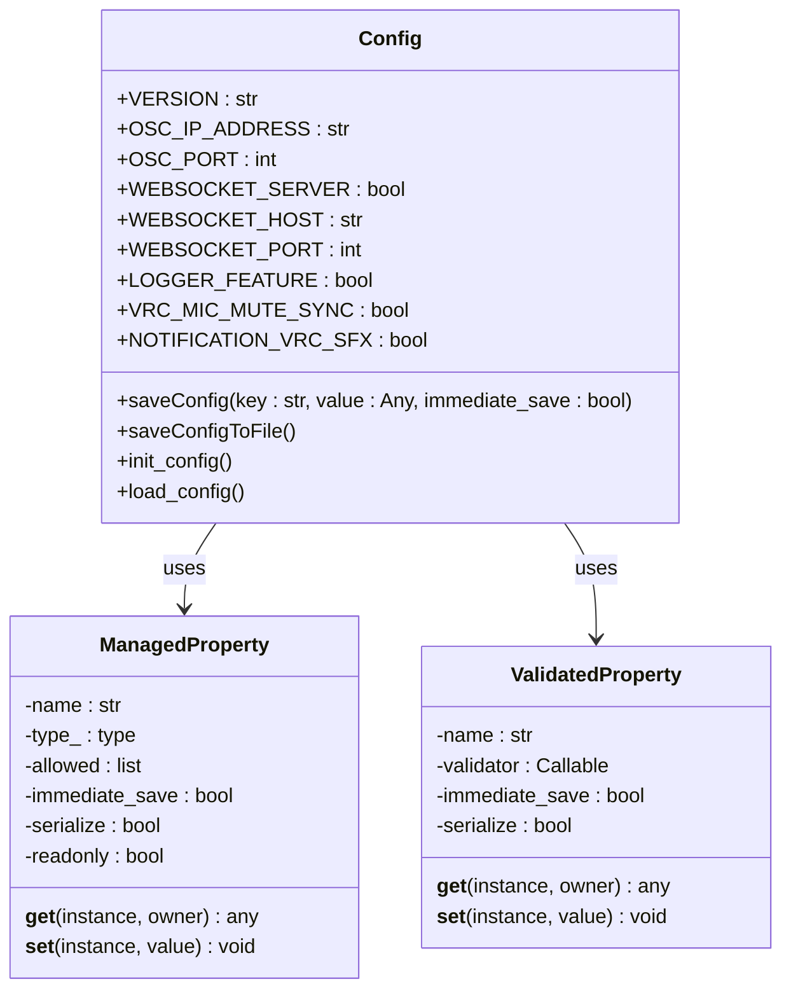
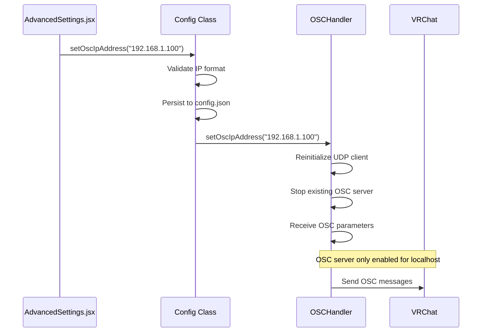
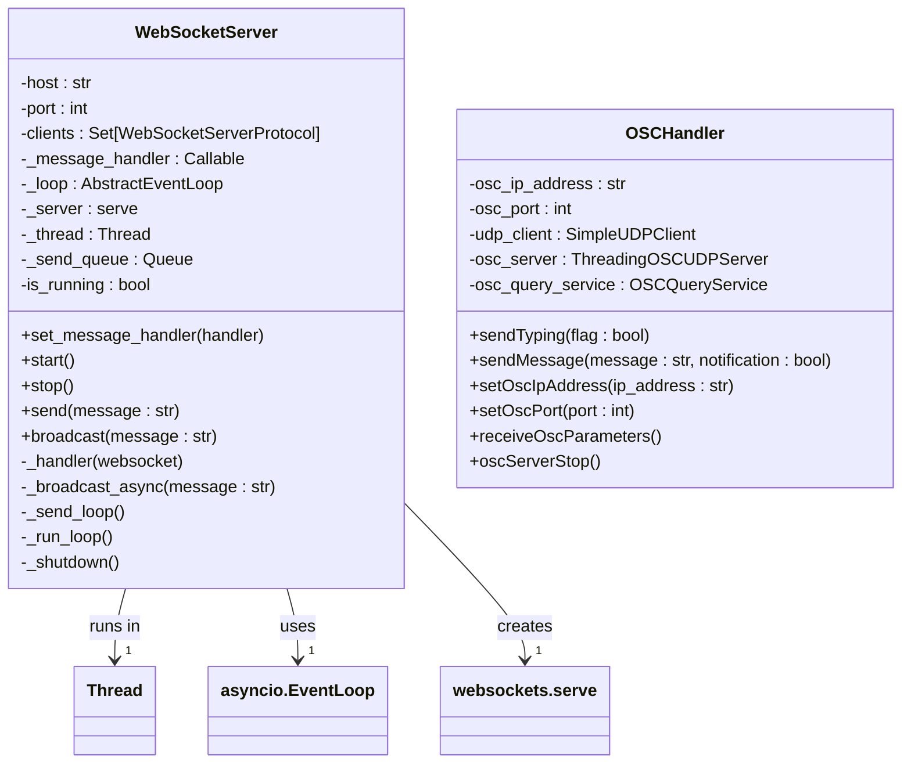
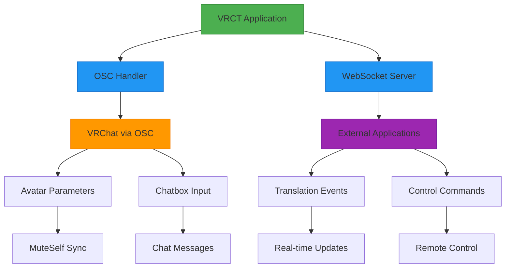
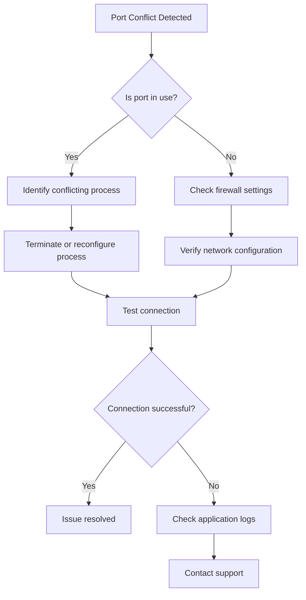

# Advanced Settings

<cite>
**Referenced Files in This Document**   
- [config.py](file://src-python/config.py)
- [AdvancedSettings.jsx](file://src-ui/views/app/config_page/setting_section/setting_box/advanced_settings/AdvancedSettings.jsx)
- [osc.py](file://src-python/models/osc/osc.py)
- [websocket_server.py](file://src-python/models/websocket/websocket_server.py)
- [controller.py](file://src-python/controller.py)
- [model.py](file://src-python/model.py)
</cite>

## Table of Contents
1. [Introduction](#introduction)
2. [Configuration Management](#configuration-management)
3. [OSC Endpoint Configuration](#osc-endpoint-configuration)
4. [WebSocket Server Configuration](#websocket-server-configuration)
5. [Network Integration Architecture](#network-integration-architecture)
6. [Configuration Examples](#configuration-examples)
7. [Security Considerations](#security-considerations)
8. [Troubleshooting Guide](#troubleshooting-guide)

## Introduction
The VRCT application provides advanced configuration options for OSC endpoints, WebSocket server settings, and low-level system integrations. These settings enable users to customize network communication between VRCT and external applications, particularly VRChat. This document details how the Config class manages advanced parameters, how the UI exposes these options through AdvancedSettings.jsx, and how the underlying osc.py and websocket_server.py modules implement network connectivity. The documentation covers configuration storage, validation, network setup, and troubleshooting for various deployment scenarios.

## Configuration Management

The VRCT application uses a centralized Config class to manage all configuration parameters, including advanced network settings. The Config class implements a singleton pattern with property descriptors that handle type validation, value constraints, and automatic persistence to JSON configuration files.



**Diagram sources**
- [config.py](file://src-python/config.py#L232-L303)
- [config.py](file://src-python/config.py#L305-L335)

**Section sources**
- [config.py](file://src-python/config.py#L1-L1027)

## OSC Endpoint Configuration

### Configuration Parameters
The OSC (Open Sound Control) integration in VRCT is controlled by several configuration parameters that define the network endpoints for communication with VRChat:

- **OSC_IP_ADDRESS**: Target IP address for OSC messages (default: "127.0.0.1")
- **OSC_PORT**: UDP port for OSC communication (default: 9000)
- **VRC_MIC_MUTE_SYNC**: Enables microphone mute synchronization with VRChat
- **NOTIFICATION_VRC_SFX**: Enables VRChat sound effects for notifications

These parameters are defined as ManagedProperty descriptors in the Config class, ensuring type validation and automatic persistence:



**Diagram sources**
- [config.py](file://src-python/config.py#L692-L694)
- [AdvancedSettings.jsx](file://src-ui/views/app/config_page/setting_section/setting_box/advanced_settings/AdvancedSettings.jsx#L37-L65)
- [osc.py](file://src-python/models/osc/osc.py#L48-L87)
- [controller.py](file://src-python/controller.py#L1505-L1531)

### OSC Handler Implementation
The OSCHandler class in osc.py manages OSC communication, including message sending and optional OSCQuery advertising. When the target IP address is localhost (127.0.0.1 or localhost), the handler enables OSCQuery functionality, allowing VRChat to discover and interact with VRCT's OSC endpoints.

The handler supports:
- Sending OSC messages for chatbox typing and input
- Receiving OSC parameters from VRChat (e.g., MuteSelf status)
- Advertising OSC endpoints via OSCQuery when running locally
- Dynamic reconfiguration of IP address and port

**Section sources**
- [osc.py](file://src-python/models/osc/osc.py#L1-L241)
- [controller.py](file://src-python/controller.py#L1505-L1542)

## WebSocket Server Configuration

### Configuration Parameters
The WebSocket server in VRCT provides a bidirectional communication channel for external applications to interact with the translation system:

- **WEBSOCKET_SERVER**: Boolean flag to enable/disable the WebSocket server
- **WEBSOCKET_HOST**: Host address for the WebSocket server (default: "127.0.0.1")
- **WEBSOCKET_PORT**: TCP port for WebSocket communication (default: 2231)

These parameters are managed by the Config class and exposed through the AdvancedSettings UI component.

### WebSocket Server Implementation
The WebSocketServer class implements a threaded WebSocket server using the websockets library. The server runs in a separate thread with its own asyncio event loop, allowing non-blocking I/O operations while maintaining compatibility with the main application thread.



**Diagram sources**
- [websocket_server.py](file://src-python/models/websocket/websocket_server.py#L7-L222)
- [osc.py](file://src-python/models/osc/osc.py#L40-L241)

The WebSocket server implementation includes several key features:
- Thread-safe message sending from external threads via a queue mechanism
- Broadcast functionality to send messages to all connected clients
- Graceful shutdown procedures that clean up resources
- Error handling for connection failures and protocol exceptions

When the WebSocket server is enabled, it listens for incoming connections and can receive messages from external applications. The server also broadcasts translation events and system status updates to all connected clients, enabling real-time integration with external tools and dashboards.

**Section sources**
- [websocket_server.py](file://src-python/models/websocket/websocket_server.py#L1-L222)
- [model.py](file://src-python/model.py#L1122-L1187)

## Network Integration Architecture

### Component Interactions
The advanced network settings in VRCT enable integration with external applications through two primary protocols: OSC for VRChat integration and WebSocket for general application integration. These systems work together to create a comprehensive communication framework.



**Diagram sources**
- [osc.py](file://src-python/models/osc/osc.py#L1-L241)
- [websocket_server.py](file://src-python/models/websocket/websocket_server.py#L1-L222)
- [model.py](file://src-python/model.py#L133-L134)

### Configuration Flow
The configuration flow for network settings follows a consistent pattern across both OSC and WebSocket systems:

1. User modifies settings in the AdvancedSettings UI
2. UI validates input and sends update request to backend
3. Controller processes the request and updates configuration
4. Model applies changes to the respective network handler
5. Configuration is persisted to disk

This flow ensures that all configuration changes are properly validated and applied while maintaining system stability.

**Section sources**
- [AdvancedSettings.jsx](file://src-ui/views/app/config_page/setting_section/setting_box/advanced_settings/AdvancedSettings.jsx#L1-L217)
- [controller.py](file://src-python/controller.py#L1505-L1542)
- [controller.py](file://src-python/controller.py#L2777-L2838)

## Configuration Examples

### Local Development Setup
For local development and testing, the default configuration is typically used:

```json
{
  "OSC_IP_ADDRESS": "127.0.0.1",
  "OSC_PORT": 9000,
  "WEBSOCKET_SERVER": true,
  "WEBSOCKET_HOST": "127.0.0.1",
  "WEBSOCKET_PORT": 2231
}
```

This configuration enables both OSCQuery discovery and WebSocket connectivity on the local machine, allowing for full integration with VRChat and external debugging tools.

### Network Deployment
For network deployment where VRCT runs on a different machine than VRChat:

```json
{
  "OSC_IP_ADDRESS": "192.168.1.100",
  "OSC_PORT": 9000,
  "WEBSOCKET_SERVER": true,
  "WEBSOCKET_HOST": "0.0.0.0",
  "WEBSOCKET_PORT": 2231
}
```

In this configuration, OSC messages are sent to a specific IP address on the local network, while the WebSocket server binds to all interfaces (0.0.0.0) to accept connections from any device on the network.

### Secure Deployment
For secure deployment with restricted access:

```json
{
  "OSC_IP_ADDRESS": "127.0.0.1",
  "OSC_PORT": 9000,
  "WEBSOCKET_SERVER": true,
  "WEBSOCKET_HOST": "127.0.0.1",
  "WEBSOCKET_PORT": 2231
}
```

This configuration limits both OSC and WebSocket connectivity to localhost, preventing external access while still allowing integration with applications running on the same machine.

## Security Considerations

### OSC Security
OSC communication in VRCT has inherent security limitations:
- OSC protocol does not include authentication or encryption
- When OSC_IP_ADDRESS is set to a remote address, OSCQuery functionality is disabled
- OSC messages are sent as plain UDP packets that can be intercepted on the network

Best practices for OSC security:
- Use localhost (127.0.0.1) whenever possible
- When using network addresses, ensure the network is trusted and isolated
- Avoid using OSC for sensitive information transmission

### WebSocket Security
The WebSocket server implementation includes several security considerations:
- By default, the server binds to 127.0.0.1, restricting access to localhost
- When binding to 0.0.0.0 or specific IP addresses, the server is accessible to all devices on the network
- No built-in authentication or encryption (WS/WSS)

Security recommendations:
- Only bind to 0.0.0.0 when necessary for network integration
- Use firewall rules to restrict access to the WebSocket port
- Consider implementing a reverse proxy with TLS for secure remote access
- Monitor connected clients and implement connection limits for production use

**Section sources**
- [osc.py](file://src-python/models/osc/osc.py#L50-L51)
- [websocket_server.py](file://src-python/models/websocket/websocket_server.py#L17-L22)
- [config.py](file://src-python/config.py#L692-L706)

## Troubleshooting Guide

### Network Connectivity Issues
Common network connectivity issues and their solutions:

**OSC Connection Problems:**
- Verify VRChat is running and OSC is enabled in VRChat settings
- Check that the OSC_IP_ADDRESS matches the target machine's IP address
- Ensure no firewall is blocking UDP port 9000 (or custom OSC port)
- For localhost connections, verify that OSCQuery dependencies are installed

**WebSocket Connection Problems:**
- Confirm the WebSocket server is enabled in Advanced Settings
- Verify the WEBSOCKET_HOST and WEBSOCKET_PORT settings
- Check for port conflicts with other applications
- Ensure the client is using the correct WebSocket URL (ws://host:port)

### Port Conflicts
Port conflicts can occur when another application is using the same port:



**Diagram sources**
- [controller.py](file://src-python/controller.py#L2791-L2808)
- [controller.py](file://src-python/controller.py#L2819-L2837)

To resolve port conflicts:
1. Use system tools (netstat, lsof) to identify processes using the port
2. Either terminate the conflicting process or reconfigure VRCT to use a different port
3. For WebSocket server, ensure the port is not used by other WebSocket services
4. For OSC, ensure no other OSC applications are using the same port

### Message Routing Problems
Issues with message routing between VRChat and external applications:

**OSC Message Issues:**
- Verify the OSC address patterns match VRChat's expected format
- Check that the OSC client is properly initialized after IP/port changes
- Ensure VRChat's avatar parameters are correctly configured to receive OSC messages
- Validate that the chatbox input permissions are enabled in VRChat

**WebSocket Message Issues:**
- Confirm the message format follows the expected JSON structure
- Check that the WebSocket connection remains active (implement heartbeat if needed)
- Verify the message handler is properly registered in the application
- Ensure the send queue is not blocked by a stalled connection

Error messages and their meanings:
- "Invalid IP address": The entered IP address is not in valid IPv4 format
- "WebSocket server host or port is not available": The specified host/port combination cannot be bound
- "Cannot set IP address": An exception occurred while updating the OSC IP address
- "WebSocket server port is not available": The specified port is already in use

**Section sources**
- [controller.py](file://src-python/controller.py#L1527-L1528)
- [controller.py](file://src-python/controller.py#L2803-L2808)
- [controller.py](file://src-python/controller.py#L2831-L2836)
- [_useBackendErrorHandling.js](file://src-ui/logics/_useBackendErrorHandling.js#L189-L219)