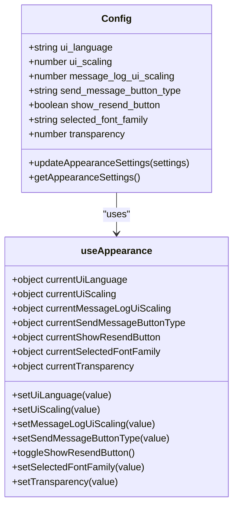
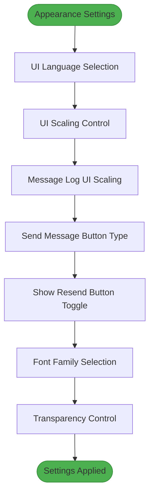
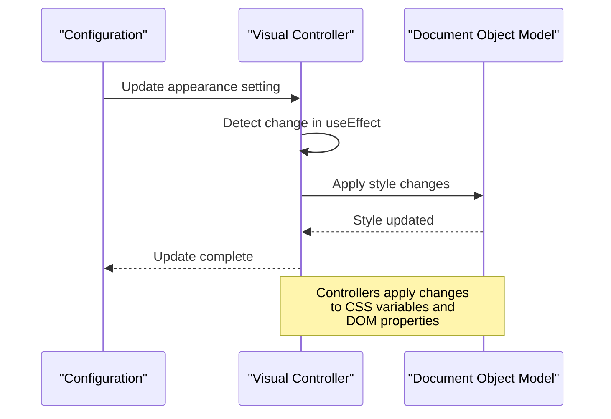
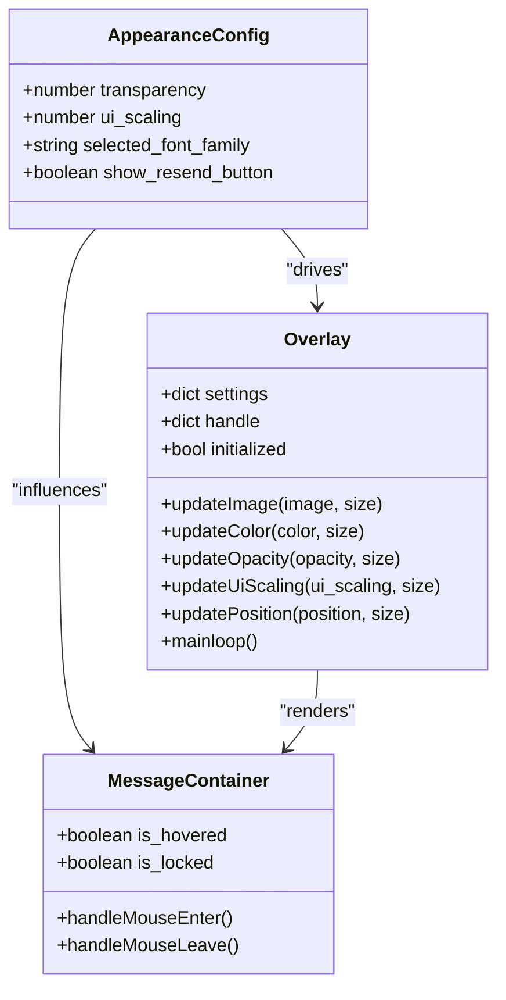
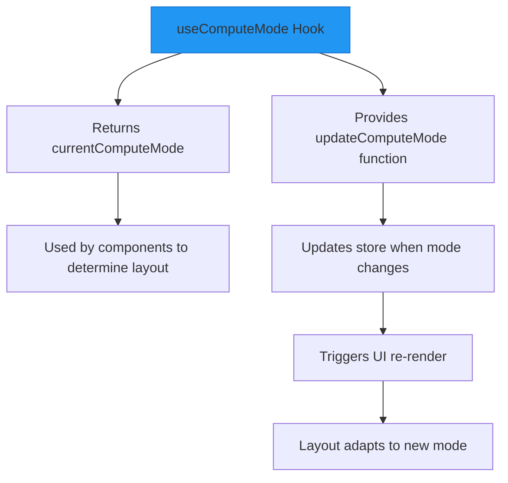

# Appearance Settings

<cite>
**Referenced Files in This Document**   
- [Appearance.jsx](file://src-ui/views/app/config_page/setting_section/setting_box/appearance/Appearance.jsx)
- [ui_config_setter.js](file://src-ui/logics/configs/config_page_setter/ui_config_setter.js)
- [TransparencyController.jsx](file://src-ui/views/app/_app_controllers/TransparencyController.jsx)
- [UiSizeController.jsx](file://src-ui/views/app/_app_controllers/UiSizeController.jsx)
- [FontFamilyController.jsx](file://src-ui/views/app/_app_controllers/FontFamilyController.jsx)
- [UiLanguageController.jsx](file://src-ui/views/app/_app_controllers/UiLanguageController.jsx)
- [MessageContainer.jsx](file://src-ui/views/app/main_page/main_section/message_container/log_box/message_container/MessageContainer.jsx)
- [useComputeMode.js](file://src-ui/logics/common/useComputeMode.js)
- [overlay.py](file://src-python/models/overlay/overlay.py)
</cite>

## Table of Contents
1. [Introduction](#introduction)
2. [Configuration Management](#configuration-management)
3. [Appearance Settings Interface](#appearance-settings-interface)
4. [Visual Property Controllers](#visual-property-controllers)
5. [Overlay Styling and Positioning](#overlay-styling-and-positioning)
6. [Layout Computation Logic](#layout-computation-logic)
7. [Performance Considerations](#performance-considerations)
8. [Best Practices for VR Readability](#best-practices-for-vr-readability)

## Introduction
The VRCT application provides comprehensive appearance settings that allow users to customize the visual presentation of message overlays in virtual reality environments. This documentation details how the Config class manages visual preferences such as overlay opacity, font size, message log height, and compact mode settings. The appearance configuration system enables users to optimize their VR experience by adjusting transparency, scaling, positioning, and other visual properties of the message overlay interface.

## Configuration Management

The appearance settings configuration is managed through a centralized system that handles visual preferences and propagates changes throughout the application. The Config class serves as the primary interface for managing these visual preferences.

**Diagram sources**
- [ui_config_setter.js](file://src-ui/logics/configs/config_page_setter/ui_config_setter.js#L123-L179)
- [index.js](file://src-ui/logics/configs/index.js#L3)

**Section sources**
- [ui_config_setter.js](file://src-ui/logics/configs/config_page_setter/ui_config_setter.js#L123-L179)
- [index.js](file://src-ui/logics/configs/index.js#L3)

## Appearance Settings Interface

The Appearance.jsx component provides the user interface for adjusting visual preferences in VRCT. It organizes various appearance-related controls into a cohesive settings panel that allows users to modify overlay styling, transparency, scaling, and positioning.

**Diagram sources**
- [Appearance.jsx](file://src-ui/views/app/config_page/setting_section/setting_box/appearance/Appearance.jsx#L23-L34)

**Section sources**
- [Appearance.jsx](file://src-ui/views/app/config_page/setting_section/setting_box/appearance/Appearance.jsx#L1-L160)

## Visual Property Controllers

The application implements specialized controller components that respond to appearance configuration changes and apply them to the UI. These controllers use React's useEffect hook to monitor configuration changes and update the DOM accordingly.

**Diagram sources**
- [TransparencyController.jsx](file://src-ui/views/app/_app_controllers/TransparencyController.jsx#L4-L11)
- [UiSizeController.jsx](file://src-ui/views/app/_app_controllers/UiSizeController.jsx#L4-L13)
- [FontFamilyController.jsx](file://src-ui/views/app/_app_controllers/FontFamilyController.jsx#L4-L11)
- [UiLanguageController.jsx](file://src-ui/views/app/_app_controllers/UiLanguageController.jsx#L6-L14)

**Section sources**
- [TransparencyController.jsx](file://src-ui/views/app/_app_controllers/TransparencyController.jsx#L1-L11)
- [UiSizeController.jsx](file://src-ui/views/app/_app_controllers/UiSizeController.jsx#L1-L13)
- [FontFamilyController.jsx](file://src-ui/views/app/_app_controllers/FontFamilyController.jsx#L1-L11)

## Overlay Styling and Positioning

The overlay styling system manages visual properties such as transparency, scaling, and positioning for message displays in VR environments. The OpenVR overlay system receives configuration-driven values that determine how message overlays are rendered in the virtual space.

**Diagram sources**
- [overlay.py](file://src-python/models/overlay/overlay.py#L85-L367)
- [MessageContainer.jsx](file://src-ui/views/app/main_page/main_section/message_container/log_box/message_container/MessageContainer.jsx#L9-L88)

**Section sources**
- [overlay.py](file://src-python/models/overlay/overlay.py#L85-L367)
- [MessageContainer.jsx](file://src-ui/views/app/main_page/main_section/message_container/log_box/message_container/MessageContainer.jsx#L1-L168)

## Layout Computation Logic

The useComputeMode.js logic adapts the application layout based on configuration-driven display modes. This hook provides a centralized way to manage compute mode state and update it in response to user preferences.

**Diagram sources**
- [useComputeMode.js](file://src-ui/logics/common/useComputeMode.js#L3-L10)

**Section sources**
- [useComputeMode.js](file://src-ui/logics/common/useComputeMode.js#L1-L10)

## Performance Considerations

When configuring appearance settings for VR environments, certain performance considerations must be taken into account. High transparency levels and large overlay sizes can impact rendering performance and battery life in VR headsets.

**Configuration Performance Impact Table**

| Setting | Performance Impact | Recommendation |
|--------|-------------------|---------------|
| High Transparency (40-60%) | Moderate - requires additional compositing | Use 70-80% for optimal balance |
| Large Overlay Sizes | High - increases GPU rendering load | Limit to 25-30% of field of view |
| High Font Scaling (160-200%) | Low - minimal GPU impact | Acceptable for accessibility needs |
| Frequent UI Updates | High - affects frame rate stability | Batch updates when possible |
| Multiple Overlays | High - increases scene complexity | Limit to essential overlays only |

**Section sources**
- [overlay.py](file://src-python/models/overlay/overlay.py#L149-L181)
- [UiSizeController.jsx](file://src-ui/views/app/_app_controllers/UiSizeController.jsx#L6-L9)

## Best Practices for VR Readability

Optimizing appearance settings for VR environments requires careful consideration of readability factors. The following best practices are recommended for configuring overlay styling in VRCT:

1. **Transparency Settings**: Maintain overlay opacity between 70-90% to ensure text remains readable against various background environments while still allowing users to see through the overlay to their virtual surroundings.

2. **Font Size and Scaling**: Use the UI scaling controls to adjust font size to a comfortable reading level. The default 100% scaling is optimized for most VR headsets, but users with visual impairments may benefit from increased scaling up to 140%.

3. **Positioning Strategy**: Position overlays in the user's natural field of view, typically slightly below center vision to avoid neck strain during prolonged reading. The overlay positioning controls allow adjustment of X, Y, Z coordinates and rotation angles.

4. **Contrast Optimization**: Ensure sufficient contrast between text and background by selecting appropriate font families and colors. The default color scheme is designed for maximum readability in various lighting conditions.

5. **Compact Mode Usage**: Enable compact mode when screen real estate is limited or when multiple applications are running simultaneously in the VR environment.

6. **Message Log Height**: Adjust the message log height based on the typical message length. For short messages, a smaller height conserves space, while longer messages benefit from increased height to reduce scrolling.

**Section sources**
- [Appearance.jsx](file://src-ui/views/app/config_page/setting_section/setting_box/appearance/Appearance.jsx#L146-L160)
- [overlay.py](file://src-python/models/overlay/overlay.py#L169-L178)
- [TransparencyController.jsx](file://src-ui/views/app/_app_controllers/TransparencyController.jsx#L7)