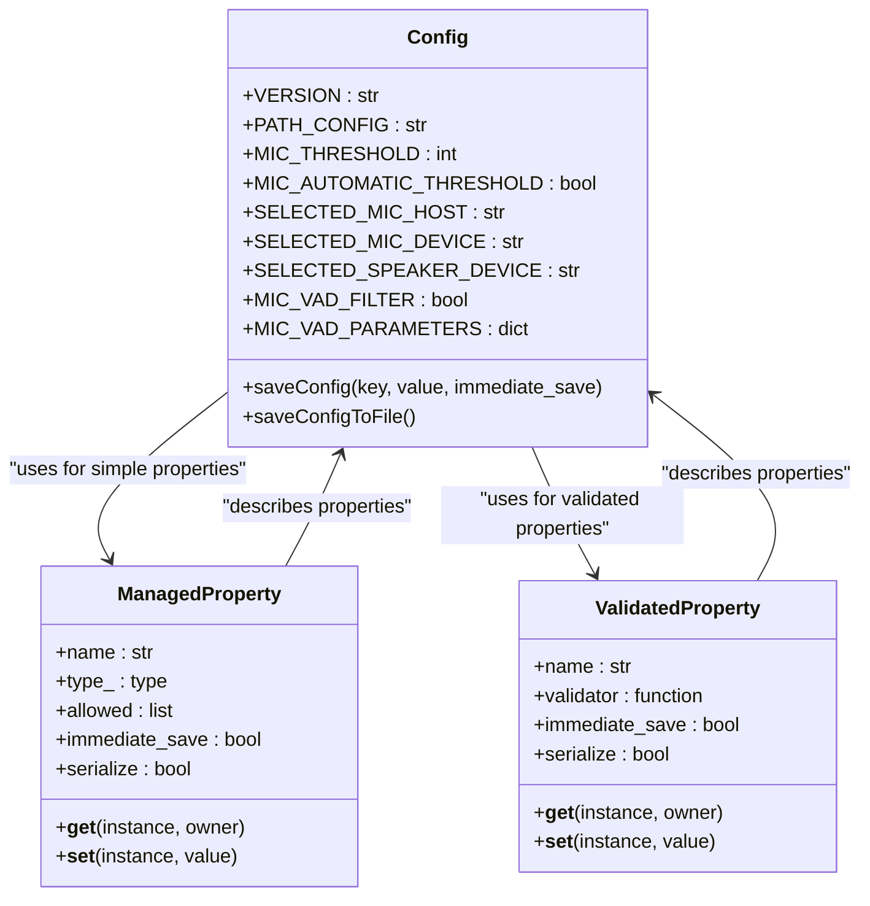
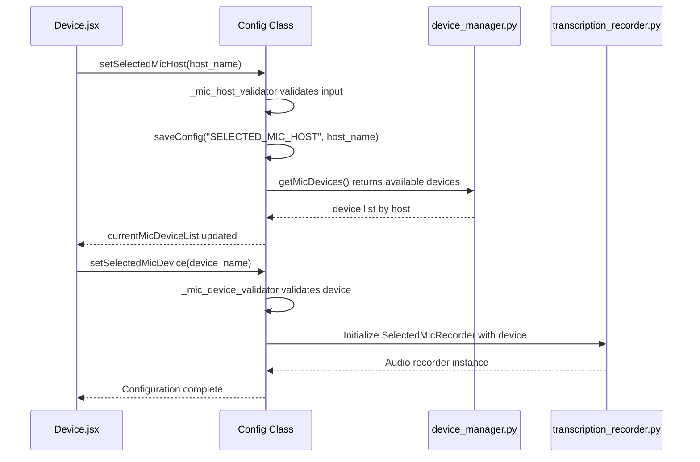
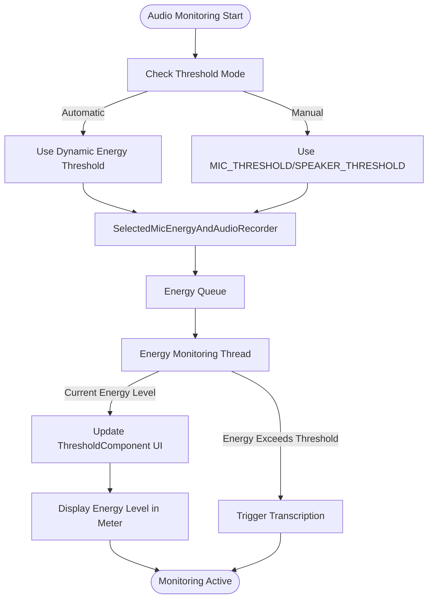
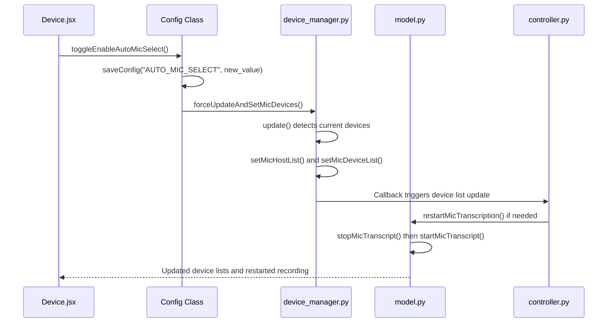

# Audio Device Configuration

<cite>
**Referenced Files in This Document**   
- [config.py](file://src-python/config.py)
- [device_manager.py](file://src-python/device_manager.py)
- [transcription_recorder.py](file://src-python/models/transcription/transcription_recorder.py)
- [Device.jsx](file://src-ui/views/app/config_page/setting_section/setting_box/device/Device.jsx)
- [ThresholdComponent.jsx](file://src-ui/views/app/config_page/setting_section/setting_box/_components/threshold_component/ThresholdComponent.jsx)
- [controller.py](file://src-python/controller.py)
</cite>

## Table of Contents
1. [Introduction](#introduction)
2. [Configuration Management with Config Class](#configuration-management-with-config-class)
3. [Device Selection and Management](#device-selection-and-management)
4. [Audio Threshold Settings and Monitoring](#audio-threshold-settings-and-monitoring)
5. [Dynamic Configuration and Device Refresh](#dynamic-configuration-and-device-refresh)
6. [Practical Configuration Examples](#practical-configuration-examples)
7. [Troubleshooting Common Issues](#troubleshooting-common-issues)

## Introduction
The VRCT application provides comprehensive audio device configuration capabilities for both microphone and speaker input selection, energy threshold settings, and real-time audio monitoring. This documentation details how the system manages audio configuration through the Config class, integrates with the device_manager.py backend service, and utilizes transcription_recorder.py for audio stream initialization and energy monitoring. The configuration system supports dynamic reloading of audio devices and automatic restart of recording sessions without requiring application restart, providing a seamless user experience for voice transcription and translation in virtual reality environments.

## Configuration Management with Config Class
The Config class serves as the central configuration manager for VRCT, persisting audio-related settings such as input/output device IDs, energy thresholds, and VAD (Voice Activity Detection) parameters. Implemented as a singleton, the Config class uses descriptor patterns to manage configuration properties with automatic serialization and validation.

**Diagram sources**
- [config.py](file://src-python/config.py#L232-L336)
- [config.py](file://src-python/config.py#L531-L800)

The Config class implements two descriptor types: ManagedProperty for simple type-validated properties and ValidatedProperty for complex validation scenarios. Audio-related settings are persisted to a JSON configuration file with debounced saving to prevent excessive disk I/O. The class handles audio device selection through validated properties with custom validators that ensure device names exist in the current device list.

**Section sources**
- [config.py](file://src-python/config.py#L531-L800)

## Device Selection and Management
The device selection system in VRCT integrates the UI component Device.jsx with the device_manager.py backend service to provide a comprehensive interface for microphone and speaker configuration. The system supports multiple audio hosts and automatically detects available audio devices.

**Diagram sources**
- [Device.jsx](file://src-ui/views/app/config_page/setting_section/setting_box/device/Device.jsx)
- [config.py](file://src-python/config.py#L491-L510)
- [device_manager.py](file://src-python/device_manager.py#L459-L470)

The device management system uses a hierarchical approach for microphone selection, first choosing an audio host (such as Windows WASAPI, DirectSound, etc.) and then selecting a specific microphone device from that host. Speaker selection is simplified as it only requires selecting from available loopback devices. The device_manager.py service uses PyAudio and platform-specific libraries like pyaudiowpatch and pycaw to enumerate audio devices and monitor for changes.

**Section sources**
- [device_manager.py](file://src-python/device_manager.py#L56-L529)
- [Device.jsx](file://src-ui/views/app/config_page/setting_section/setting_box/device/Device.jsx)

## Audio Threshold Settings and Monitoring
VRCT provides sophisticated audio threshold configuration for both microphone and speaker inputs, allowing users to fine-tune voice activity detection sensitivity. The system supports both automatic (dynamic) and manual threshold settings, with real-time audio monitoring capabilities.

**Diagram sources**
- [transcription_recorder.py](file://src-python/models/transcription/transcription_recorder.py#L149-L264)
- [ThresholdComponent.jsx](file://src-ui/views/app/config_page/setting_section/setting_box/_components/threshold_component/ThresholdComponent.jsx)
- [controller.py](file://src-python/controller.py#L2332-L2348)

The threshold system is implemented through the SelectedMicEnergyAndAudioRecorder and SelectedSpeakerEnergyAndAudioRecorder classes, which extend the BaseEnergyAndAudioRecorder to capture both raw audio data and energy levels. When energy monitoring is enabled (via ENABLE_CHECK_ENERGY_SEND and ENABLE_CHECK_ENERGY_RECEIVE), the system starts background threads that continuously monitor audio energy levels and update the UI in real-time. The ThresholdComponent in the UI displays a visual meter showing current energy levels relative to the configured threshold.

**Section sources**
- [transcription_recorder.py](file://src-python/models/transcription/transcription_recorder.py#L149-L264)
- [ThresholdComponent.jsx](file://src-ui/views/app/config_page/setting_section/setting_box/_components/threshold_component/ThresholdComponent.jsx)

## Dynamic Configuration and Device Refresh
VRCT supports dynamic configuration changes that automatically reload audio devices and restart recording sessions without requiring application restart. This is achieved through a combination of configuration change detection, device monitoring, and session management.

**Diagram sources**
- [device_manager.py](file://src-python/device_manager.py#L507-L517)
- [controller.py](file://src-python/controller.py#L2332-L2348)
- [model.py](file://src-python/model.py#L103-L142)

The system uses a callback-based architecture where configuration changes trigger device list updates and recording session restarts. The device_manager.py service can monitor for system-level audio device changes using Windows COM notifications through pycaw, automatically updating the available device lists when hardware is connected or disconnected. When configuration changes affect audio input/output devices, the system automatically restarts the transcription process to apply the new settings.

**Section sources**
- [device_manager.py](file://src-python/device_manager.py#L266-L323)
- [controller.py](file://src-python/controller.py#L2332-L2348)

## Practical Configuration Examples
### Sensitive Transcription Trigger Configuration
For users who want the application to detect even quiet speech, a sensitive configuration can be set up:

1. Set MIC_AUTOMATIC_THRESHOLD to False (manual mode)
2. Set MIC_THRESHOLD to a low value (e.g., 100-300)
3. Enable audio monitoring with ENABLE_CHECK_ENERGY_SEND
4. Observe the energy meter while speaking at normal volume
5. Adjust the threshold to just below the typical speaking energy level

This configuration will trigger transcription with minimal voice input, ideal for users who speak softly or use low-sensitivity microphones.

### Conservative Transcription Trigger Configuration
For noisy environments where false triggers are a concern, a conservative configuration is recommended:

1. Enable MIC_AUTOMATIC_THRESHOLD for dynamic adjustment
2. If using manual mode, set MIC_THRESHOLD to a higher value (e.g., 800-1200)
3. Increase MIC_RECORD_TIMEOUT to allow longer pauses within phrases
4. Enable MIC_VAD_FILTER for additional voice activity detection filtering

This configuration reduces false positives by requiring stronger audio signals to trigger transcription, filtering out background noise and incidental sounds.

**Section sources**
- [config.py](file://src-python/config.py#L640-L649)
- [transcription_recorder.py](file://src-python/models/transcription/transcription_recorder.py#L193-L226)

## Troubleshooting Common Issues
### No Audio Devices Detected
If no audio devices appear in the selection dropdowns:
1. Verify that microphone and speakers are properly connected and recognized by the operating system
2. Check that the application has microphone permissions enabled
3. Restart the application to force a device scan
4. Ensure that pyaudiowpatch and related audio libraries are properly installed

### Audio Monitoring Not Responding
If the energy meter does not respond to audio input:
1. Verify that ENABLE_CHECK_ENERGY_SEND is enabled
2. Check that the correct microphone device is selected
3. Ensure that the microphone is not muted at the system level
4. Test the microphone in another application to confirm it is working

### False Transcription Triggers
To reduce unwanted transcription triggers:
1. Increase the MIC_THRESHOLD value
2. Enable MIC_AUTOMATIC_THRESHOLD for adaptive thresholding
3. Adjust MIC_PHRASE_TIMEOUT to control how long pauses are allowed
4. Enable MIC_VAD_FILTER for additional voice activity detection

### Delayed Transcription Response
If there is noticeable delay in transcription:
1. Reduce MIC_PHRASE_TIMEOUT to detect speech endings more quickly
2. Ensure that the transcription engine is properly loaded and responsive
3. Check system performance and resource usage
4. Consider using a lighter-weight transcription model

**Section sources**
- [device_manager.py](file://src-python/device_manager.py#L140-L239)
- [transcription_recorder.py](file://src-python/models/transcription/transcription_recorder.py#L149-L264)
- [controller.py](file://src-python/controller.py#L2332-L2348)