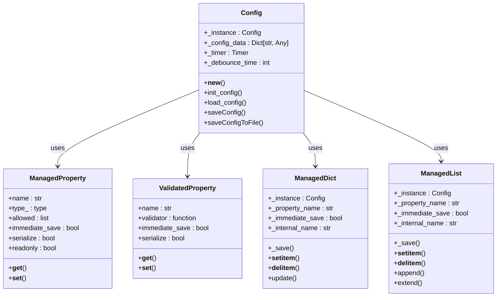
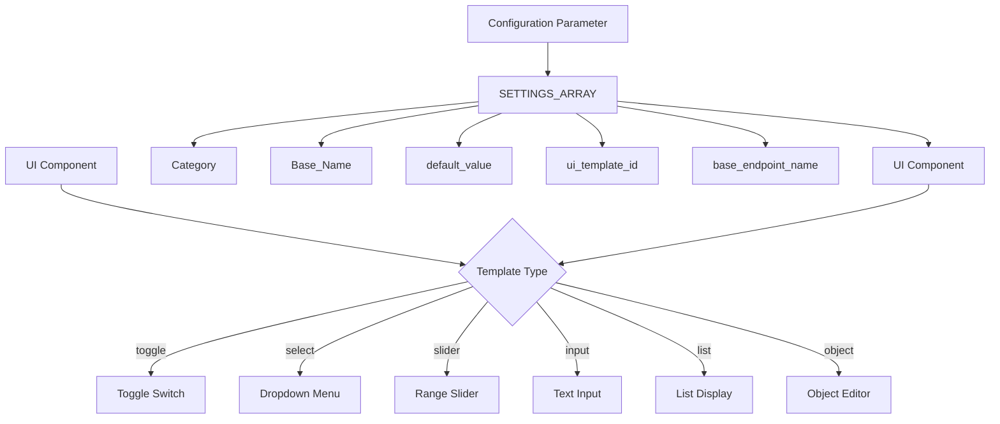
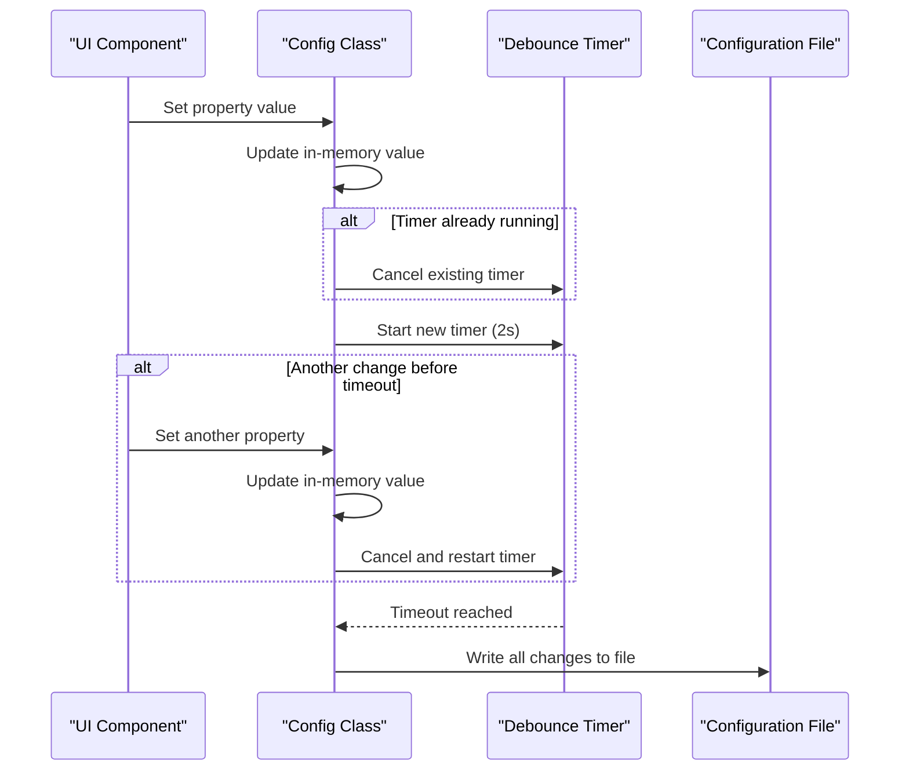
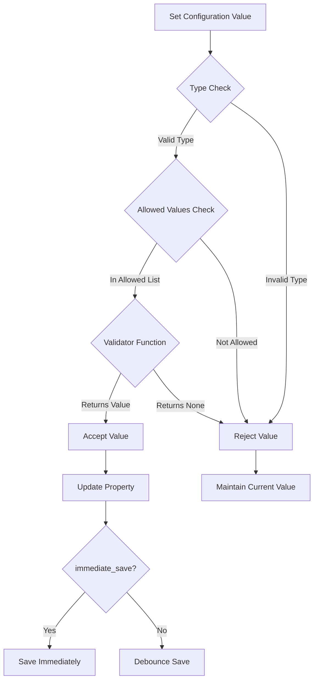
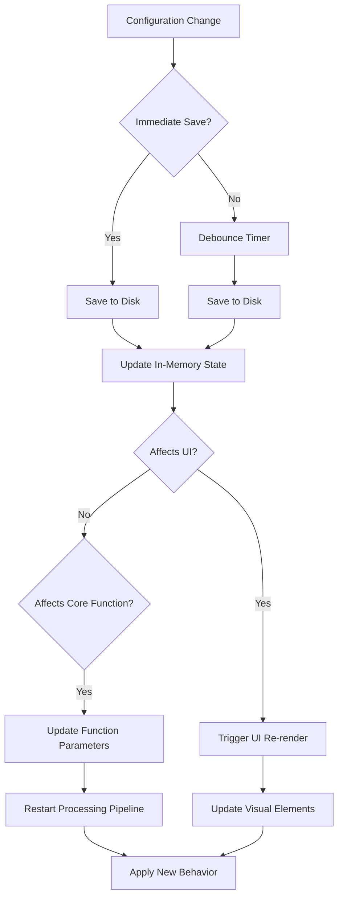

# Configuration

<cite>
**Referenced Files in This Document**   
- [config.py](file://src-python/config.py)
- [ui_config_setter.js](file://src-ui/logics/configs/config_page_setter/ui_config_setter.js)
- [ConfigPage.jsx](file://src-ui/views/app/config_page/ConfigPage.jsx)
- [UiLanguageController.jsx](file://src-ui/views/app/_app_controllers/UiLanguageController.jsx)
- [ConfigPageCloseTriggerController.jsx](file://src-ui/views/app/_app_controllers/ConfigPageCloseTriggerController.jsx)
</cite>

## Table of Contents
1. [Introduction](#introduction)
2. [Configuration Architecture](#configuration-architecture)
3. [Configuration Categories](#configuration-categories)
4. [UI Configuration Mapping](#ui-configuration-mapping)
5. [Debounced Saving Mechanism](#debounced-saving-mechanism)
6. [Configuration Validation](#configuration-validation)
7. [Configuration File Structure](#configuration-file-structure)
8. [Configuration Change Propagation](#configuration-change-propagation)
9. [Frontend Configuration Management](#frontend-configuration-management)
10. [Best Practices](#best-practices)

## Introduction

The VRCT (Virtual Reality Chat Translator) configuration system provides a comprehensive framework for managing application settings across multiple domains including transcription, translation, audio devices, appearance, and advanced options. The system is built around a singleton Config class that ensures consistent access to configuration data throughout the application lifecycle. This document details the architecture, implementation, and usage patterns of the VRCT settings system, focusing on how configuration changes are persisted, validated, and propagated through the application.

**Section sources**
- [config.py](file://src-python/config.py#L531-L1027)

## Configuration Architecture

The VRCT configuration system is centered around the Config class, which implements the singleton pattern to ensure a single instance exists throughout the application. The architecture employs several key design patterns and components:

- **Singleton Pattern**: Ensures only one instance of the Config class exists, providing global access to configuration data
- **Descriptor Pattern**: Uses ManagedProperty and ValidatedProperty descriptors to reduce boilerplate code for property access and validation
- **Debounced Persistence**: Implements a timer-based mechanism to batch configuration saves and reduce I/O operations
- **Auto-registration**: Automatically registers serializable properties to minimize configuration overhead

The Config class manages both read-only constants (such as application paths and version information) and read-write user settings. It handles initialization, loading from disk, and saving to the configuration file with proper error handling to prevent crashes during startup.



**Diagram sources**
- [config.py](file://src-python/config.py#L232-L336)
- [config.py](file://src-python/config.py#L67-L227)

**Section sources**
- [config.py](file://src-python/config.py#L531-L1027)

## Configuration Categories

The VRCT configuration system organizes settings into several distinct categories, each addressing specific aspects of the application's functionality.

### General Preferences

General preferences include fundamental application settings that affect overall behavior:

- **ENABLE_TRANSLATION**: Controls whether translation functionality is active
- **ENABLE_TRANSCRIPTION_SEND/RECEIVE**: Toggles transcription for outgoing and incoming messages
- **ENABLE_FOREGROUND**: Determines if the application should stay in the foreground
- **AUTO_CLEAR_MESSAGE_BOX**: Controls automatic clearing of the message input box
- **SEND_ONLY_TRANSLATED_MESSAGES**: Restricts sent messages to translated content only

### Audio Devices

Audio device settings manage microphone and speaker configuration:

- **MIC_THRESHOLD/SPEAKER_THRESHOLD**: Sets sensitivity thresholds for audio detection
- **MIC_AUTOMATIC_THRESHOLD/SPEAKER_AUTOMATIC_THRESHOLD**: Enables automatic threshold adjustment
- **SELECTED_MIC_HOST/SELECTED_MIC_DEVICE**: Specifies the active microphone device
- **SELECTED_SPEAKER_DEVICE**: Specifies the active speaker device
- **AUTO_MIC_SELECT/AUTO_SPEAKER_SELECT**: Enables automatic device selection

### Translation Engines

Translation engine settings configure the various translation services:

- **SELECTED_TRANSLATION_ENGINES**: Maps translation engines to tab numbers
- **AUTH_KEYS**: Stores API keys for external translation services (DeepL, Plamo, Gemini, OpenAI)
- **SELECTED_PLAMO_MODEL/SELECTED_GEMINI_MODEL/SELECTED_OPENAI_MODEL**: Specifies models for respective services
- **LMSTUDIO_URL/SELECTED_LMSTUDIO_MODEL**: Configuration for LM Studio integration
- **SELECTED_OLLAMA_MODEL**: Configuration for Ollama integration

### Appearance Settings

Appearance settings control the visual presentation of the application:

- **TRANSPARENCY**: Sets window transparency level
- **UI_SCALING**: Controls overall UI scaling
- **TEXTBOX_UI_SCALING**: Adjusts message box scaling
- **MESSAGE_BOX_RATIO**: Sets the ratio between message input and log display
- **FONT_FAMILY**: Specifies the font family for text display
- **UI_LANGUAGE**: Sets the interface language
- **MAIN_WINDOW_SIDEBAR_COMPACT_MODE**: Controls sidebar compact mode

### Advanced Options

Advanced settings provide fine-grained control over specialized features:

- **OSC_IP_ADDRESS/OSC_PORT**: Configures OSC (Open Sound Control) connectivity
- **WEBSOCKET_SERVER/WEBSOCKET_HOST/WEBSOCKET_PORT**: Websocket server configuration
- **OVERLAY_SMALL_LOG/OVERLAY_LARGE_LOG**: Controls overlay display modes
- **VRC_MIC_MUTE_SYNC**: Enables microphone mute synchronization with VRChat
- **NOTIFICATION_VRC_SFX**: Controls VRChat notification sound effects

**Section sources**
- [config.py](file://src-python/config.py#L604-L736)

## UI Configuration Mapping

The UI configuration system maps frontend components to underlying configuration parameters through a structured approach that ensures consistency between the user interface and application state.

### Configuration Category Hooks

The system uses React hooks to provide access to configuration categories:

- **useAppearance**: Manages appearance-related settings
- **useDevice**: Handles audio device configuration
- **useTranslation**: Controls translation engine settings
- **useTranscription**: Manages transcription parameters
- **useVr**: Handles VR/overlay settings
- **useOthers**: Controls general functionality
- **useAdvancedSettings**: Manages advanced options

These hooks are created through the createCategoryHook function, which generates category-specific APIs based on the SETTINGS_ARRAY configuration.

### UI Template Mapping

Each configuration parameter is associated with a specific UI template that determines its presentation:

- **toggle**: Boolean settings presented as toggle switches
- **select**: Dropdown menus for selecting from predefined options
- **slider**: Range controls for numeric values
- **input**: Text inputs for string values
- **list**: List displays for array data
- **object**: Complex object editors

The mapping between configuration parameters and UI components is defined in the SETTINGS_ARRAY, which specifies the category, base name, default value, UI template, and backend endpoint for each setting.



**Diagram sources**
- [ui_config_setter.js](file://src-ui/logics/configs/config_page_setter/ui_config_setter.js#L15-L691)
- [ConfigPage.jsx](file://src-ui/views/app/config_page/ConfigPage.jsx#L1-L21)

**Section sources**
- [ui_config_setter.js](file://src-ui/logics/configs/config_page_setter/ui_config_setter.js#L1-L743)
- [index.js](file://src-ui/logics/configs/index.js#L3-L9)

## Debounced Saving Mechanism

The VRCT configuration system implements a debounced saving mechanism to optimize performance and reduce unnecessary disk I/O operations.

### Implementation Details

The debouncing mechanism works as follows:

1. When a configuration property is modified, the change is immediately stored in memory
2. A timer is started (default 2 seconds) to delay the actual file write operation
3. If another configuration change occurs before the timer expires, the previous timer is canceled and a new one is started
4. When the timer finally expires without interruption, the configuration is written to disk

This approach ensures that rapid successive changes to configuration (such as adjusting a slider) result in only a single write operation, rather than multiple writes.

### Immediate Save Option

Certain configuration properties can bypass the debounce mechanism by setting `immediate_save=True` in their descriptor. This is used for settings that require immediate persistence, such as window geometry or critical UI state.

### Timer Management

The system uses Python's threading.Timer class to implement the debounce functionality:

- The timer runs as a daemon thread, ensuring it doesn't prevent application shutdown
- Each configuration change cancels any existing timer before starting a new one
- The debounce time is configurable via the `_debounce_time` class attribute



**Diagram sources**
- [config.py](file://src-python/config.py#L564-L575)

**Section sources**
- [config.py](file://src-python/config.py#L560-L576)

## Configuration Validation

The VRCT configuration system implements comprehensive validation to ensure data integrity and prevent invalid settings.

### Type Validation

The ManagedProperty descriptor performs type checking when setting values:

- If a type is specified, only values of that type are accepted
- Multiple types can be specified using a tuple (e.g., type_=(int, float))
- Invalid types are silently rejected

### Value Validation

Validation occurs through several mechanisms:

- **Allowed Values**: Properties can specify a list of allowed values or a callable validator function
- **ValidatedProperty**: Complex validation logic is implemented through validator functions that return normalized values or None to reject changes
- **Structure Validation**: Nested objects are validated using validateDictStructure to ensure proper schema

### Specific Validators

The system implements specialized validators for different configuration types:

- **_mic_host_validator**: Validates microphone host selection against available devices
- **_mic_device_validator**: Validates microphone device against selected host
- **_speaker_device_validator**: Validates speaker device selection
- **_compute_device_validator**: Validates compute device selection
- **_format_validator_send/received**: Validates message format structure
- **_plugins_status_validator**: Validates plugin status array structure

### Error Handling

Validation failures are handled gracefully:

- Invalid values are silently rejected without raising exceptions
- Default values are used when validation fails
- Errors are logged but do not interrupt application flow



**Diagram sources**
- [config.py](file://src-python/config.py#L232-L336)
- [config.py](file://src-python/config.py#L342-L490)

**Section sources**
- [config.py](file://src-python/config.py#L232-L490)

## Configuration File Structure

The VRCT configuration system stores settings in a JSON file with a specific structure and location.

### File Location

The configuration file is stored at:
```
{PATH_LOCAL}/config.json
```
Where PATH_LOCAL is determined by the application's execution context (executable directory for frozen applications, script directory otherwise).

### File Format

The configuration file uses JSON format with the following characteristics:

- **Indentation**: 4 spaces for readability
- **Encoding**: UTF-8 to support international characters
- **Structure**: Flat key-value pairs for simple properties, nested objects for complex settings
- **Persistence**: Only properties marked with `serialize=True` are saved

### Example Configuration

```json
{
    "ENABLE_TRANSLATION": true,
    "ENABLE_TRANSCRIPTION_SEND": false,
    "ENABLE_TRANSCRIPTION_RECEIVE": true,
    "UI_LANGUAGE": "en",
    "UI_SCALING": 100,
    "TRANSPARENCY": 80,
    "SELECTED_MIC_HOST": "Windows WASAPI",
    "SELECTED_MIC_DEVICE": "Microphone (Realtek Audio)",
    "MIC_THRESHOLD": 300,
    "SELECTED_TRANSLATION_ENGINES": {
        "1": "CTranslate2",
        "2": "DeepL",
        "3": "Google"
    },
    "SELECTED_YOUR_LANGUAGES": {
        "1": {
            "1": {
                "language": "Japanese",
                "country": "Japan",
                "enable": true
            }
        }
    },
    "OVERLAY_SMALL_LOG_SETTINGS": {
        "x_pos": 0.0,
        "y_pos": 0.0,
        "z_pos": 0.0,
        "x_rotation": 0.0,
        "y_rotation": 0.0,
        "z_rotation": 0.0,
        "display_duration": 5,
        "fadeout_duration": 2,
        "opacity": 1.0,
        "ui_scaling": 1.0,
        "tracker": "HMD"
    }
}
```

### Initialization and Migration

The system handles configuration file initialization and version migration:

- On first run, a new config.json is created with default values
- Missing keys in existing files are populated with defaults from init_config()
- New keys added in updates are automatically included in the next save operation
- Invalid values are ignored, with defaults used instead

**Section sources**
- [config.py](file://src-python/config.py#L560-L563)
- [config.py](file://src-python/config.py#L1001-L1017)

## Configuration Change Propagation

Configuration changes in VRCT propagate through the system to affect various components and behaviors.

### Transcription System

Changes to transcription settings directly impact audio processing:

- **Microphone Settings**: Changes to MIC_THRESHOLD, MIC_RECORD_TIMEOUT, and related parameters affect how audio is captured and processed
- **Engine Selection**: SELECTED_TRANSCRIPTION_ENGINE determines which transcription engine is used
- **Compute Device**: SELECTED_TRANSCRIPTION_COMPUTE_DEVICE specifies the hardware used for processing
- **VAD Parameters**: MIC_VAD_PARAMETERS control voice activity detection behavior

### Translation System

Translation configuration changes affect how text is translated:

- **Engine Selection**: SELECTED_TRANSLATION_ENGINES determines which translation service is used for each tab
- **Model Selection**: Selected model settings (PLAMO, Gemini, etc.) control which AI models are utilized
- **Compute Device**: SELECTED_TRANSLATION_COMPUTE_DEVICE specifies processing hardware
- **Word Filtering**: MIC_WORD_FILTER applies filtering to transcribed text before translation

### Overlay Behavior

Configuration changes affect the VRChat overlay display:

- **Visibility**: OVERLAY_SMALL_LOG and OVERLAY_LARGE_LOG control which overlays are displayed
- **Position and Rotation**: OVERLAY_SMALL_LOG_SETTINGS and OVERLAY_LARGE_LOG_SETTINGS determine overlay placement in VR space
- **Display Duration**: Settings control how long messages remain visible
- **Opacity and Scaling**: Visual appearance parameters

### UI Updates

Configuration changes trigger immediate UI updates:

- **Language Changes**: UI_LANGUAGE changes trigger i18n language switching
- **Appearance Changes**: UI_SCALING, TRANSPARENCY, and FONT_FAMILY changes are applied immediately
- **Window Geometry**: MAIN_WINDOW_GEOMETRY changes resize and reposition the application window



**Diagram sources**
- [config.py](file://src-python/config.py#L564-L575)
- [UiLanguageController.jsx](file://src-ui/views/app/_app_controllers/UiLanguageController.jsx#L1-L14)

**Section sources**
- [config.py](file://src-python/config.py#L560-L576)
- [UiLanguageController.jsx](file://src-ui/views/app/_app_controllers/UiLanguageController.jsx#L1-L14)

## Frontend Configuration Management

The frontend configuration system in VRCT uses a sophisticated approach to manage UI-specific settings through the ui_config_setter.js module.

### Configuration Registry

The system maintains a central registry of all configuration settings in the SETTINGS_ARRAY:

- Each entry specifies the category, base name, default value, UI template, and backend endpoint
- The registry enables automatic generation of configuration hooks and UI components
- Settings are organized by functional category (Device, Appearance, Translation, etc.)

### Dynamic Hook Generation

The createCategoryHook function dynamically generates React hooks for each configuration category:

- Uses the SETTINGS_ARRAY to determine which settings belong to each category
- Creates getter, setter, and updater functions for each setting
- Provides immediate access to current values and update functions
- Handles the connection between UI components and the backend configuration

### UI State Management

The system implements several patterns for managing UI state:

- **Atomic State**: Uses createAtomWithHook to create individual state atoms for each setting
- **Category APIs**: Builds category-specific APIs that group related settings
- **Backend Synchronization**: Ensures UI state stays synchronized with backend configuration
- **Immediate Feedback**: Provides instant visual feedback for user interactions

### Specialized Logic

Certain configuration settings require specialized handling:

- **Weight Download Status**: Manages the state of model weight downloads
- **Hotkeys**: Handles keyboard shortcut configuration
- **Plugins**: Manages plugin status and configuration
- **Supporters**: Handles supporter-related settings

**Section sources**
- [ui_config_setter.js](file://src-ui/logics/configs/config_page_setter/ui_config_setter.js#L1-L743)

## Best Practices

To ensure reliable configuration management in VRCT, follow these best practices:

### Configuration Access

- Always use the singleton config instance rather than creating new instances
- Access configuration properties directly (config.UI_LANGUAGE) rather than through internal attributes
- Use the provided React hooks in frontend components rather than direct configuration access

### Error Handling

- Be aware that invalid configuration values are silently rejected
- Provide user feedback when configuration changes are rejected
- Test edge cases and invalid inputs to ensure graceful degradation

### Performance Considerations

- Avoid rapid successive configuration changes when possible
- Use immediate_save=True only for critical settings that require instant persistence
- Be mindful of the debounce timer when testing configuration changes

### Security

- Be aware that API keys are stored in plain text in the configuration file
- Consider the security implications of storing sensitive information locally
- Regularly review and update authentication keys

### Development and Testing

- Test configuration changes thoroughly across different categories
- Verify that configuration persists correctly across application restarts
- Test migration scenarios when adding new configuration options
- Validate that default values are applied correctly for missing settings

**Section sources**
- [config.py](file://src-python/config.py#L531-L1027)
- [ui_config_setter.js](file://src-ui/logics/configs/config_page_setter/ui_config_setter.js#L1-L743)