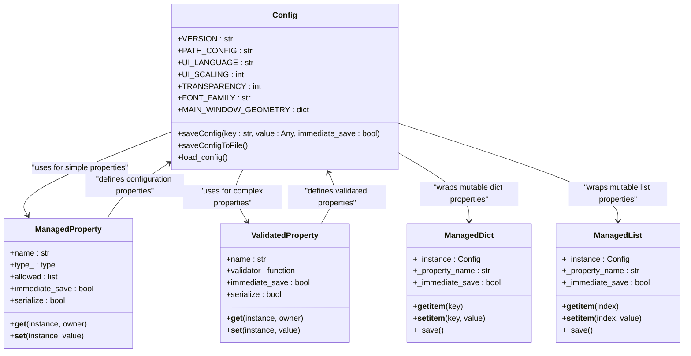
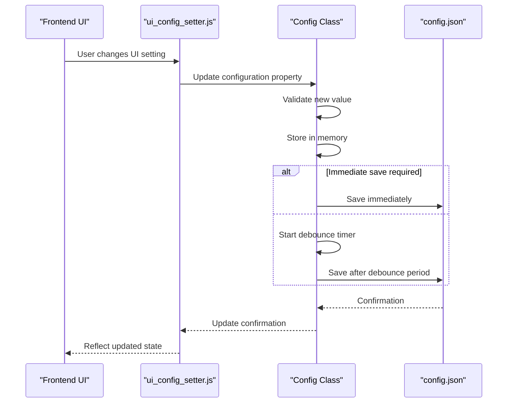
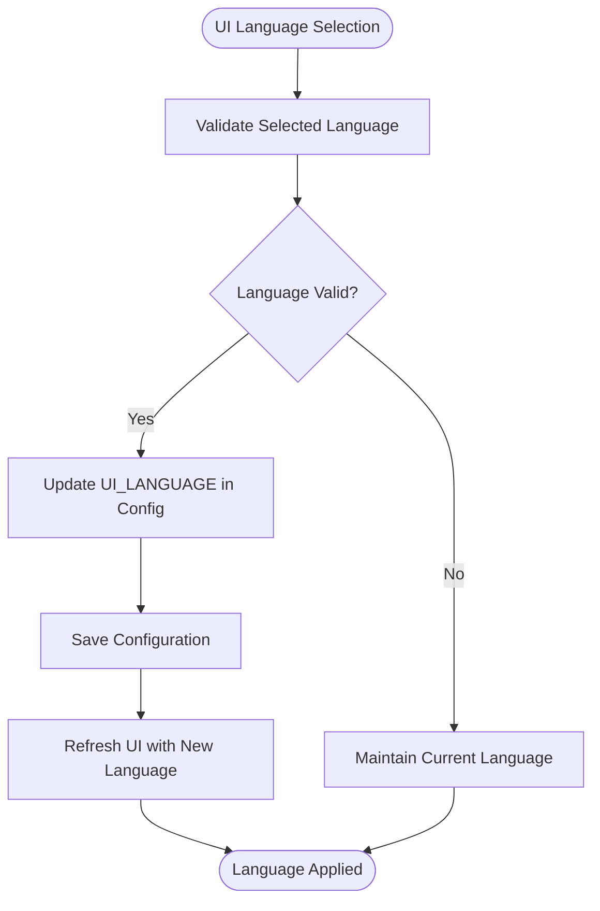
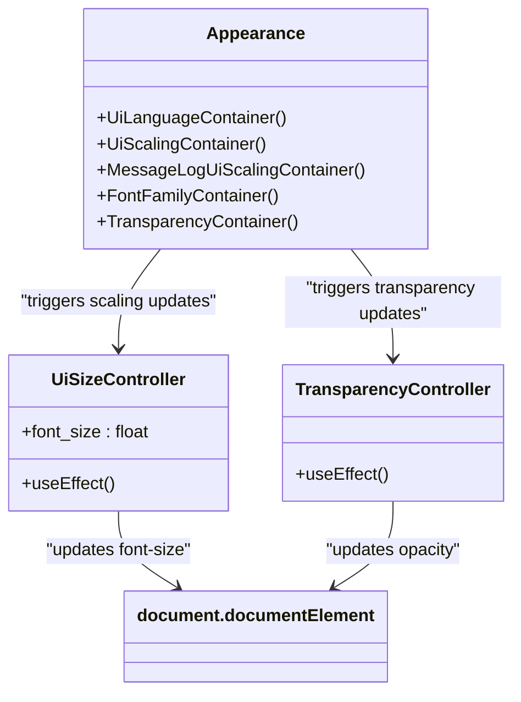
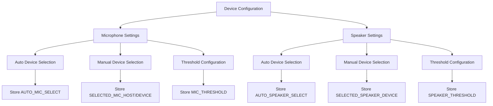
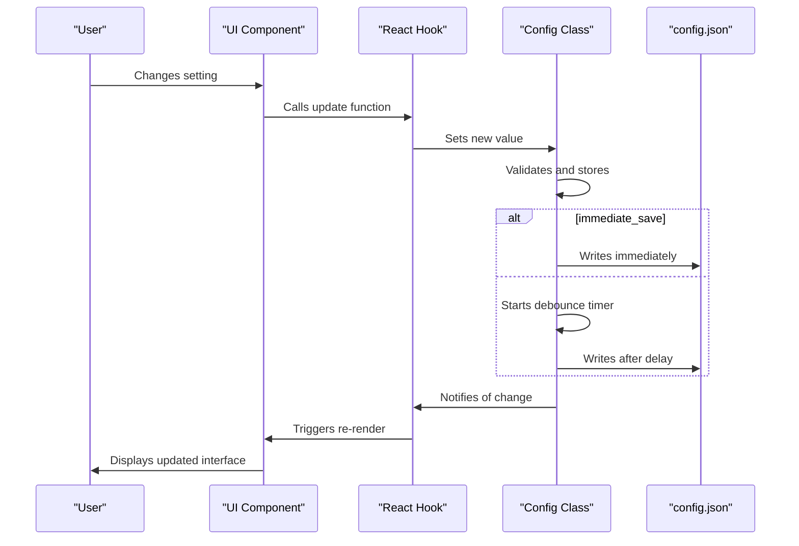

# General Settings

<cite>
**Referenced Files in This Document**   
- [config.py](file://src-python/config.py)
- [ui_config_setter.js](file://src-ui/logics/configs/config_page_setter/ui_config_setter.js)
- [Appearance.jsx](file://src-ui/views/app/config_page/setting_section/setting_box/appearance/Appearance.jsx)
- [Device.jsx](file://src-ui/views/app/config_page/setting_section/setting_box/device/Device.jsx)
- [ui_configs.js](file://src-ui/logics/ui_configs.js)
- [UiSizeController.jsx](file://src-ui/views/app/_app_controllers/UiSizeController.jsx)
- [TransparencyController.jsx](file://src-ui/views/app/_app_controllers/TransparencyController.jsx)
</cite>

## Table of Contents
1. [Introduction](#introduction)
2. [Configuration Architecture](#configuration-architecture)
3. [General Settings Management](#general-settings-management)
4. [UI Appearance Configuration](#ui-appearance-configuration)
5. [Application Behavior Settings](#application-behavior-settings)
6. [Core Preferences](#core-preferences)
7. [Configuration File Structure](#configuration-file-structure)
8. [Reactive Updates System](#reactive-updates-system)
9. [Best Practices](#best-practices)
10. [Conclusion](#conclusion)

## Introduction

The VRCT application provides comprehensive configuration options for customizing UI appearance, application behavior, and core preferences. This document details how the Config class in config.py manages persistent storage of general settings, the role of ui_config_setter.js in synchronizing frontend UI state with backend configuration, and how Appearance.jsx and Device.jsx components render and update settings. The configuration system enables users to personalize their experience while maintaining application stability and performance.

**Section sources**
- [config.py](file://src-python/config.py#L1-L1027)

## Configuration Architecture

The VRCT configuration system follows a robust architecture that separates concerns between backend configuration management and frontend UI synchronization. The system is built around the Config class in config.py, which serves as the central configuration manager, and the ui_config_setter.js module, which handles frontend-backend communication.



**Diagram sources**
- [config.py](file://src-python/config.py#L229-L336)
- [config.py](file://src-python/config.py#L66-L227)

**Section sources**
- [config.py](file://src-python/config.py#L1-L1027)

## General Settings Management

The Config class in config.py implements a sophisticated configuration management system that handles persistent storage of general settings. The class uses descriptor patterns (ManagedProperty and ValidatedProperty) to provide type validation, allowed values checking, and automatic persistence to JSON storage.

The configuration system supports both simple scalar values and complex data structures. For mutable types like dictionaries and lists, the system employs wrapper classes (ManagedDict and ManagedList) that automatically synchronize changes back to the configuration store. This ensures that modifications to nested data structures are properly persisted without requiring explicit save operations.

Configuration changes are debounced using a timer mechanism to optimize disk I/O operations. By default, changes are saved after a 2-second debounce period, but certain critical settings can be configured for immediate saving by setting the immediate_save parameter to True.



**Diagram sources**
- [config.py](file://src-python/config.py#L564-L575)
- [ui_config_setter.js](file://src-ui/logics/configs/config_page_setter/ui_config_setter.js#L695-L743)

**Section sources**
- [config.py](file://src-python/config.py#L531-L1027)

## UI Appearance Configuration

The UI appearance settings in VRCT allow users to customize various visual aspects of the application interface. These settings are managed through the Appearance component and synchronized with the backend configuration system.

### Language and Localization

The UI language setting allows users to select their preferred interface language from available options including English, Japanese, Korean, Traditional Chinese, and Simplified Chinese. The language selection is stored in the UI_LANGUAGE configuration property and triggers a UI refresh to apply the selected language translations.



**Diagram sources**
- [config.py](file://src-python/config.py#L637)
- [Appearance.jsx](file://src-ui/views/app/config_page/setting_section/setting_box/appearance/Appearance.jsx#L45-L52)
- [ui_configs.js](file://src-ui/logics/ui_configs.js#L79-L85)

### Window Size and Scaling

The application supports configurable window size and UI scaling options. The MAIN_WINDOW_GEOMETRY property stores the window's position and dimensions, while UI_SCALING controls the overall interface scaling percentage. The MESSAGE_BOX_RATIO setting determines the relative size of message input and display areas.

The UiSizeController component listens for changes to the UI_SCALING setting and dynamically updates the root font size CSS variable to apply the scaling across the entire interface. This approach ensures consistent scaling of all UI elements while maintaining proper layout proportions.



**Diagram sources**
- [config.py](file://src-python/config.py#L631-L633)
- [Appearance.jsx](file://src-ui/views/app/config_page/setting_section/setting_box/appearance/Appearance.jsx#L54-L85)
- [UiSizeController.jsx](file://src-ui/views/app/_app_controllers/UiSizeController.jsx#L1-L13)
- [TransparencyController.jsx](file://src-ui/views/app/_app_controllers/TransparencyController.jsx#L1-L11)

### Transparency and Visual Effects

The transparency setting controls the overall opacity of the application window, with values ranging from 0 (completely transparent) to 100 (fully opaque). The TRANSPARENCY property is stored as an integer percentage value and applied to the root document element via CSS.

The TransparencyController component uses React's useEffect hook to listen for changes to the transparency setting and update the CSS opacity property accordingly. This reactive approach ensures that transparency changes are applied immediately without requiring a full UI refresh.

**Section sources**
- [config.py](file://src-python/config.py#L630)
- [Appearance.jsx](file://src-ui/views/app/config_page/setting_section/setting_box/appearance/Appearance.jsx)
- [TransparencyController.jsx](file://src-ui/views/app/_app_controllers/TransparencyController.jsx#L1-L11)

## Application Behavior Settings

Application behavior settings control how VRCT interacts with the user and system resources. These settings are primarily managed through the Device component, which handles audio input/output device configuration and related behaviors.

### Audio Device Management

The Device component provides controls for configuring microphone and speaker devices. Users can enable automatic device selection or manually choose specific devices from available options. The configuration system stores the selected device information in SELECTED_MIC_HOST, SELECTED_MIC_DEVICE, and SELECTED_SPEAKER_DEVICE properties.



**Diagram sources**
- [config.py](file://src-python/config.py#L729-L733)
- [Device.jsx](file://src-ui/views/app/config_page/setting_section/setting_box/device/Device.jsx#L1-L194)

### Startup and Window Behavior

The application supports various startup behaviors and window management options. The MAIN_WINDOW_SIDEBAR_COMPACT_MODE setting controls whether the sidebar displays in compact mode by default. Window geometry (position and size) is persisted through the MAIN_WINDOW_GEOMETRY property, allowing the application to restore its previous window state on startup.

**Section sources**
- [config.py](file://src-python/config.py#L627)
- [config.py](file://src-python/config.py#L638)
- [Device.jsx](file://src-ui/views/app/config_page/setting_section/setting_box/device/Device.jsx#L1-L194)

## Core Preferences

Core preferences encompass fundamental application settings that affect overall functionality and user experience. These settings are organized into logical categories and exposed through dedicated configuration components.

### Font and Typography

The FONT_FAMILY setting allows users to select their preferred font for the application interface. The available font options are dynamically populated and stored in the configuration system. This setting affects all text elements in the UI, ensuring consistent typography throughout the application.

### Message Formatting

The application provides options for customizing message formatting, including prefix, suffix, and separator characters for both sent and received messages. These settings are stored in SEND_MESSAGE_FORMAT_PARTS and RECEIVED_MESSAGE_FORMAT_PARTS properties and validated using dedicated validator functions to ensure proper structure.

**Section sources**
- [config.py](file://src-python/config.py#L636)
- [config.py](file://src-python/config.py#L688-L689)

## Configuration File Structure

The VRCT configuration is stored in a JSON file (config.json) that persists user preferences between sessions. The file structure reflects the organization of settings in the Config class, with properties grouped by functionality.

Example configuration file entries for general settings:

```json
{
  "UI_LANGUAGE": "en",
  "UI_SCALING": 100,
  "TRANSPARENCY": 100,
  "FONT_FAMILY": "Yu Gothic UI",
  "MAIN_WINDOW_GEOMETRY": {
    "x_pos": 0,
    "y_pos": 0,
    "width": 870,
    "height": 654
  },
  "MAIN_WINDOW_SIDEBAR_COMPACT_MODE": false,
  "SEND_MESSAGE_BUTTON_TYPE": "show",
  "SHOW_RESEND_BUTTON": false
}
```

The configuration system automatically creates the config.json file if it doesn't exist and initializes it with default values defined in the Config class's init_config method. The load_config method reads existing configuration values and applies them to the runtime configuration.

**Section sources**
- [config.py](file://src-python/config.py#L800-L1000)
- [config.py](file://src-python/config.py#L1001-L1017)

## Reactive Updates System

The configuration system implements a reactive updates mechanism that ensures UI components automatically reflect current configuration states. This is achieved through a combination of React hooks and state management patterns.

The ui_config_setter.js module defines the SETTINGS_ARRAY which maps UI components to configuration properties. For each setting, it creates React atoms with hooks that provide current values and update functions. The createCategoryHook function generates custom hooks (like useAppearance and useDevice) that expose configuration state to UI components.

When a configuration property changes, the system triggers updates through the following sequence:
1. The Config class updates the in-memory value
2. If immediate_save is true or the debounce timer expires, the change is written to config.json
3. The change propagates through React's state system via the atom hooks
4. UI components that use the corresponding hook automatically re-render with the new value

This reactive approach minimizes the need for manual state management and ensures consistency between the UI and underlying configuration.



**Diagram sources**
- [ui_config_setter.js](file://src-ui/logics/configs/config_page_setter/ui_config_setter.js#L15-L691)
- [config.py](file://src-python/config.py#L564-L575)

**Section sources**
- [ui_config_setter.js](file://src-ui/logics/configs/config_page_setter/ui_config_setter.js#L1-L743)

## Best Practices

When customizing the VRCT interface, users and developers should follow these best practices to maintain usability and performance:

1. **Preserve Accessibility**: Ensure that transparency levels and color contrasts meet accessibility standards, particularly for users with visual impairments.

2. **Performance Considerations**: High UI scaling values may impact rendering performance, especially on lower-end hardware. Recommend moderate scaling values (100-150%) for optimal performance.

3. **Consistent Layout**: When adjusting window size and layout, maintain sufficient space for all interface elements to prevent content clipping or overlapping.

4. **Language Support**: When adding new language options, ensure complete translation coverage and proper text direction handling for right-to-left languages.

5. **Configuration Validation**: Always validate configuration changes against allowed values and ranges to prevent application errors.

6. **User Experience**: Provide clear visual feedback when settings are changed, and consider implementing preview functionality for appearance settings.

7. **Persistence Strategy**: Use immediate_save judiciously for settings that require instant application, as frequent disk writes can impact performance and storage lifespan.

**Section sources**
- [config.py](file://src-python/config.py#L233-L243)
- [ui_config_setter.js](file://src-ui/logics/configs/config_page_setter/ui_config_setter.js#L15-L691)
- [ui_configs.js](file://src-ui/logics/ui_configs.js#L1-L136)

## Conclusion

The VRCT general settings system provides a comprehensive and flexible configuration framework that balances user customization with application stability. The architecture effectively separates concerns between backend configuration management and frontend UI presentation, enabling a responsive and intuitive user experience.

The Config class serves as the central authority for application settings, providing robust validation, persistence, and change management. The ui_config_setter.js module bridges the gap between the backend configuration and frontend UI, enabling reactive updates and consistent state management.

By following the documented patterns and best practices, users can effectively customize their VRCT experience while maintaining optimal performance and usability. The system's modular design also facilitates future enhancements and additional configuration options.

**Section sources**
- [config.py](file://src-python/config.py#L1-L1027)
- [ui_config_setter.js](file://src-ui/logics/configs/config_page_setter/ui_config_setter.js#L1-L743)