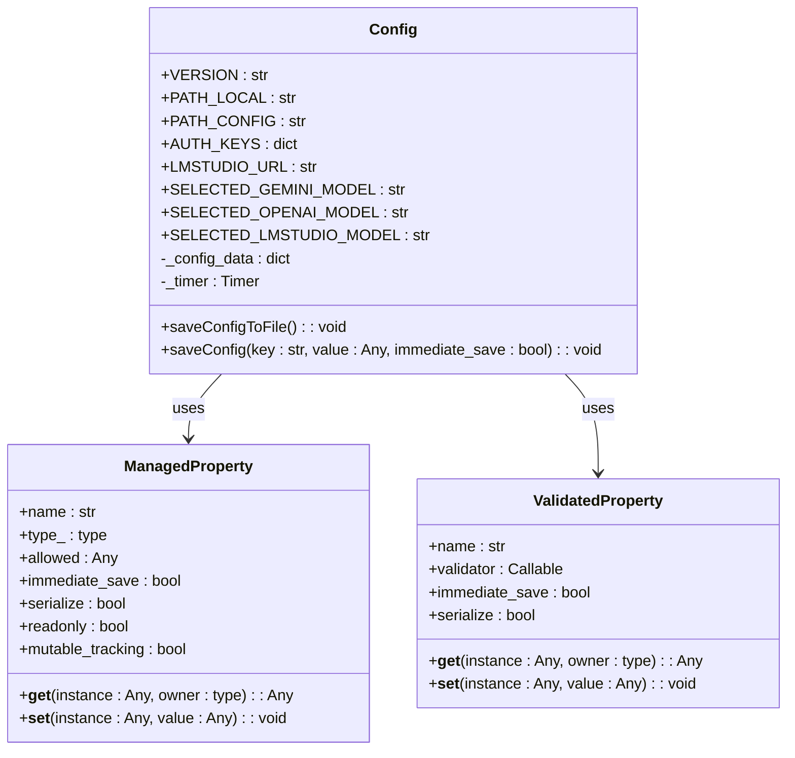
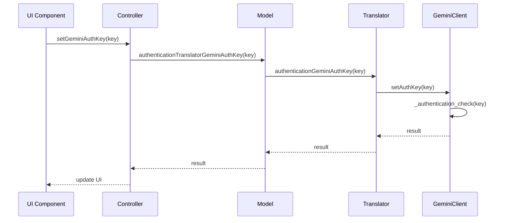
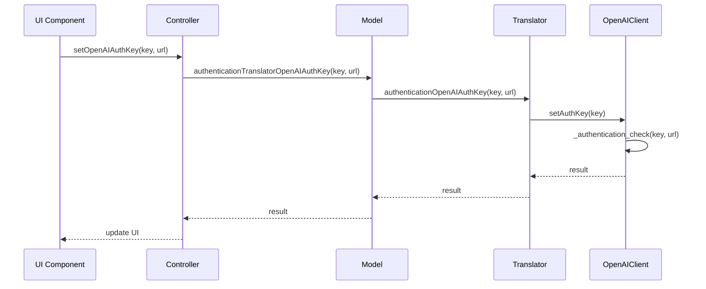
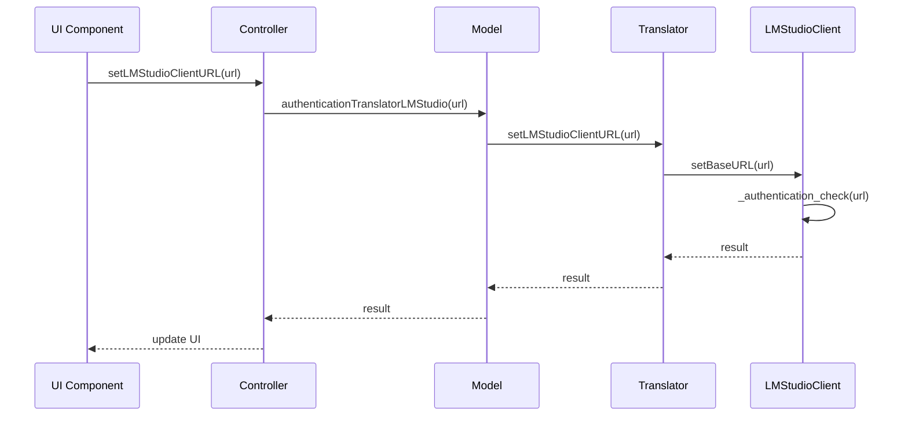
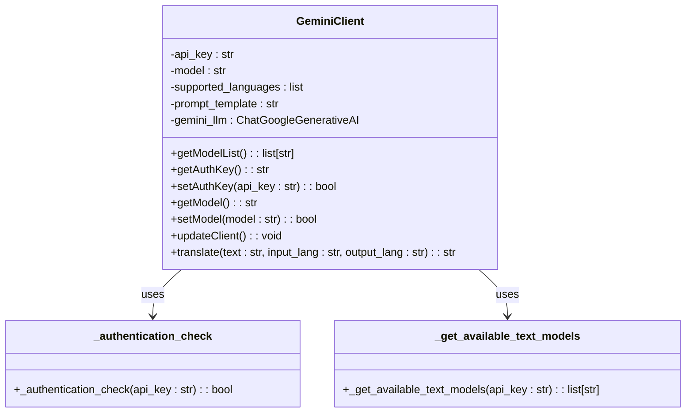
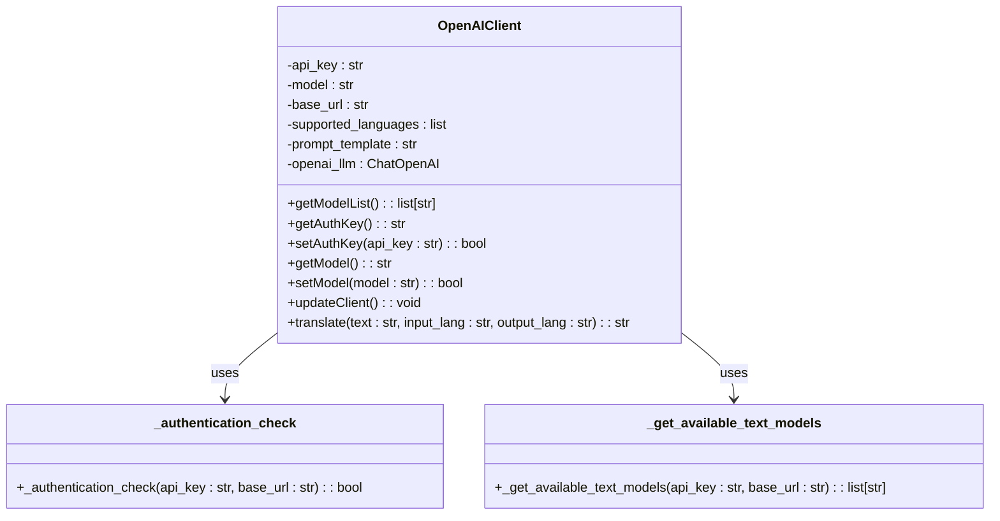
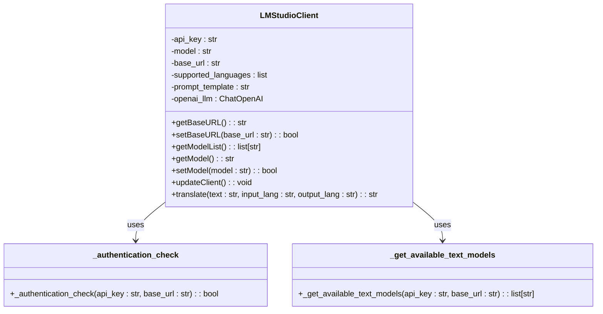
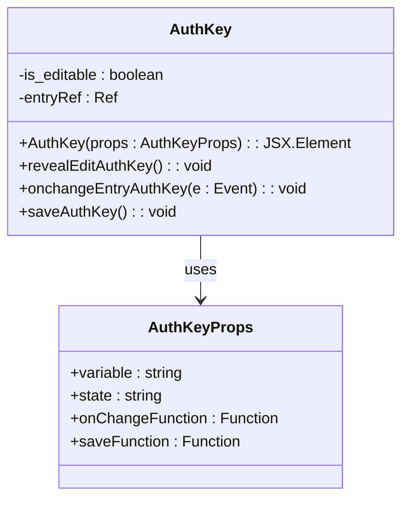
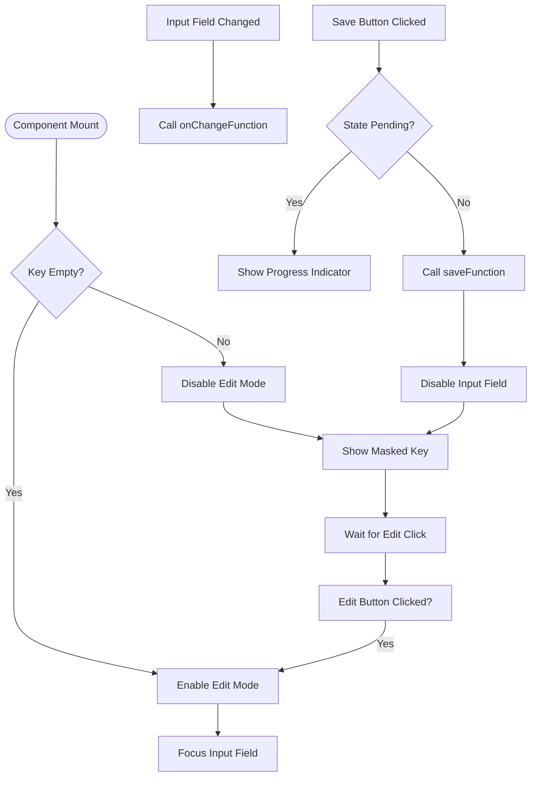
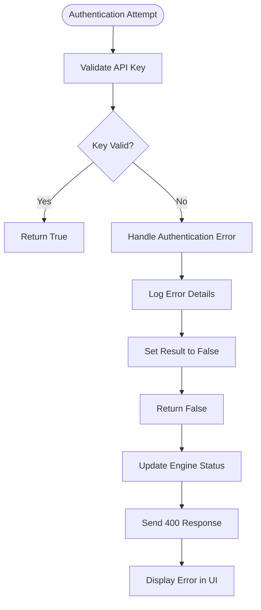

# API Key Management

<cite>
**Referenced Files in This Document**   
- [translation_gemini.py](file://src-python/models/translation/translation_gemini.py)
- [translation_openai.py](file://src-python/models/translation/translation_openai.py)
- [translation_lmstudio.py](file://src-python/models/translation/translation_lmstudio.py)
- [translation_translator.py](file://src-python/models/translation/translation_translator.py)
- [config.py](file://src-python/config.py)
- [model.py](file://src-python/model.py)
- [controller.py](file://src-python/controller.py)
- [AuthKey.jsx](file://src-ui/views/app/config_page/setting_section/setting_box/_components/auth_key/AuthKey.jsx)
- [AuthKey.module.scss](file://src-ui/views/app/config_page/setting_section/setting_box/_components/auth_key/AuthKey.module.scss)
</cite>

## Table of Contents
1. [Introduction](#introduction)
2. [Configuration System](#configuration-system)
3. [Authentication Methods](#authentication-methods)
4. [Client Classes](#client-classes)
5. [UI Implementation](#ui-implementation)
6. [Error Handling](#error-handling)
7. [Rate Limit Considerations](#rate-limit-considerations)
8. [Troubleshooting Guide](#troubleshooting-guide)
9. [Security Best Practices](#security-best-practices)

## Introduction
This document provides comprehensive documentation for API key management across different translation services in VRCT. It explains how authentication keys are securely stored in the configuration system and passed to respective client classes (GeminiClient, OpenAIClient, etc.). The document covers authentication methods like authenticationGeminiAuthKey, authenticationOpenAIAuthKey, and setLMStudioClientURL with their parameters and return values. It also describes how the UI handles sensitive input through secure text fields in Translation.jsx and validates credentials via test requests.

## Configuration System

The VRCT application uses a centralized configuration system implemented in the Config class in config.py. This system manages all application settings, including API keys, in a secure and persistent manner.

The configuration system uses a singleton pattern to ensure that only one instance of the configuration exists throughout the application. API keys are stored in a dictionary within the configuration object, specifically in the AUTH_KEYS property. This property is managed by the ValidatedProperty descriptor, which ensures that only valid data types and structures are stored.

**Diagram sources**
- [config.py](file://src-python/config.py#L531-L800)

**Section sources**
- [config.py](file://src-python/config.py#L531-L800)

## Authentication Methods

VRCT provides several authentication methods for different translation services. These methods are implemented in the Translator class and are responsible for validating API keys and establishing connections to the respective services.

### authenticationGeminiAuthKey

This method authenticates with the Google Gemini API using an API key. It takes the following parameters:

- **auth_key**: The API key string (required)
- **root_path**: The root path for configuration (optional, defaults to None)

The method returns a boolean value indicating whether the authentication was successful. It works by creating a GeminiClient instance and attempting to set the authentication key. If the key is valid, the method returns True; otherwise, it returns False.

**Diagram sources**
- [translation_translator.py](file://src-python/models/translation/translation_translator.py#L111-L121)
- [translation_gemini.py](file://src-python/models/translation/translation_gemini.py#L72-L77)
- [model.py](file://src-python/model.py#L219-L220)
- [controller.py](file://src-python/controller.py#L1718-L1734)

**Section sources**
- [translation_translator.py](file://src-python/models/translation/translation_translator.py#L111-L121)
- [translation_gemini.py](file://src-python/models/translation/translation_gemini.py#L72-L77)

### authenticationOpenAIAuthKey

This method authenticates with the OpenAI API using an API key. It supports both the official OpenAI endpoint and compatible endpoints like Azure OpenAI. The method takes the following parameters:

- **auth_key**: The API key string (required)
- **base_url**: The base URL for the API endpoint (optional, defaults to None)
- **root_path**: The root path for configuration (optional, defaults to None)

The method returns a boolean value indicating whether the authentication was successful. It creates an OpenAIClient instance with the provided base URL and attempts to set the authentication key. If the key is valid, the method returns True; otherwise, it returns False.

**Diagram sources**
- [translation_translator.py](file://src-python/models/translation/translation_translator.py#L144-L155)
- [translation_openai.py](file://src-python/models/translation/translation_openai.py#L83-L87)
- [model.py](file://src-python/model.py#L235-L237)
- [controller.py](file://src-python/controller.py#L1840-L1857)

**Section sources**
- [translation_translator.py](file://src-python/models/translation/translation_translator.py#L144-L155)
- [translation_openai.py](file://src-python/models/translation/translation_openai.py#L83-L87)

### setLMStudioClientURL

This method configures the connection to an LM Studio server. Unlike other services that use API keys, LM Studio uses a base URL to connect to a local server. The method takes the following parameters:

- **base_url**: The URL of the LM Studio server (required)
- **root_path**: The root path for configuration (optional, defaults to None)

The method returns a boolean value indicating whether the connection was successful. It creates an LMStudioClient instance with the provided URL and attempts to set the base URL. If the connection is successful, the method returns True; otherwise, it returns False.

**Diagram sources**
- [translation_translator.py](file://src-python/models/translation/translation_translator.py#L179-L188)
- [translation_lmstudio.py](file://src-python/models/translation/translation_lmstudio.py#L60-L64)
- [model.py](file://src-python/model.py#L252-L253)
- [controller.py](file://src-python/controller.py#L2030-L2047)

**Section sources**
- [translation_translator.py](file://src-python/models/translation/translation_translator.py#L179-L188)
- [translation_lmstudio.py](file://src-python/models/translation/translation_lmstudio.py#L60-L64)

## Client Classes

The VRCT application uses client classes to interface with different translation services. These classes encapsulate the API-specific details and provide a consistent interface for translation operations.

### GeminiClient

The GeminiClient class handles communication with the Google Gemini API. It provides methods for authentication, model selection, and translation.

The GeminiClient uses the Google Generative AI SDK to communicate with the Gemini API. It validates the API key by attempting to list available models. The client filters the available models to include only those suitable for text translation and chat applications, excluding models designed for audio, image, or video processing.

**Diagram sources**
- [translation_gemini.py](file://src-python/models/translation/translation_gemini.py#L54-L117)

**Section sources**
- [translation_gemini.py](file://src-python/models/translation/translation_gemini.py#L54-L117)

### OpenAIClient

The OpenAIClient class handles communication with the OpenAI API. It supports both the official OpenAI endpoint and compatible endpoints like Azure OpenAI.

The OpenAIClient uses the OpenAI SDK to communicate with the API. It validates the API key by attempting to list available models. The client filters the available models to include only those suitable for text translation and chat applications, excluding models designed for speech recognition, embeddings, image generation, and other specialized tasks.

**Diagram sources**
- [translation_openai.py](file://src-python/models/translation/translation_openai.py#L62-L139)

**Section sources**
- [translation_openai.py](file://src-python/models/translation/translation_openai.py#L62-L139)

### LMStudioClient

The LMStudioClient class handles communication with a local LM Studio server. It uses the OpenAI-compatible API to interact with the server.

The LMStudioClient uses the OpenAI SDK with a custom base URL to communicate with the local LM Studio server. The API key is set to a fixed value of "lmstudio" as authentication is handled by the network connection rather than a key. The client validates the connection by attempting to list available models on the server.

**Diagram sources**
- [translation_lmstudio.py](file://src-python/models/translation/translation_lmstudio.py#L42-L108)

**Section sources**
- [translation_lmstudio.py](file://src-python/models/translation/translation_lmstudio.py#L42-L108)

## UI Implementation

The UI for API key management is implemented in the AuthKey component in the configuration page. This component provides a secure interface for users to enter and manage their API keys.

### AuthKey Component

The AuthKey component is a React component that renders a secure text input field for API keys. It provides functionality for editing, saving, and masking the API key value.

The component uses several props to control its behavior:
- **variable**: The current value of the API key (displayed as asterisks when not in edit mode)
- **state**: The current state of the component (e.g., "pending" when saving)
- **onChangeFunction**: A callback function called when the input value changes
- **saveFunction**: A callback function called when the save button is clicked

The component implements a toggle mechanism that allows users to edit their API key. When not in edit mode, the API key is masked with asterisks and a semi-transparent overlay prevents direct interaction. Clicking the edit button reveals the input field and allows the user to modify the key.

**Diagram sources**
- [AuthKey.jsx](file://src-ui/views/app/config_page/setting_section/setting_box/_components/auth_key/AuthKey.jsx#L9-L57)
- [AuthKey.module.scss](file://src-ui/views/app/config_page/setting_section/setting_box/_components/auth_key/AuthKey.module.scss#L1-L65)

**Section sources**
- [AuthKey.jsx](file://src-ui/views/app/config_page/setting_section/setting_box/_components/auth_key/AuthKey.jsx#L9-L57)
- [AuthKey.module.scss](file://src-ui/views/app/config_page/setting_section/setting_box/_components/auth_key/AuthKey.module.scss#L1-L65)

## Error Handling

The VRCT application implements comprehensive error handling for API key authentication and translation operations. Errors are handled at multiple levels, from the client classes to the UI components.

### Authentication Error Handling

When an API key authentication fails, the application follows a consistent error handling pattern:

1. The client class attempts to validate the API key by making a test request to the service
2. If the request fails, the client returns False to indicate authentication failure
3. The Translator class receives this result and does not update its internal client reference
4. The Model class propagates the error result back to the Controller
5. The Controller formats an error response with status 400 and sends it to the UI
6. The UI displays an appropriate error message to the user

The specific error messages vary by service but generally indicate that the authentication failed without revealing sensitive details about the nature of the failure. This prevents potential attackers from gaining information about the validity of specific API keys.

**Section sources**
- [translation_gemini.py](file://src-python/models/translation/translation_gemini.py#L19-L27)
- [translation_openai.py](file://src-python/models/translation/translation_openai.py#L15-L23)
- [translation_lmstudio.py](file://src-python/models/translation/translation_lmstudio.py#L15-L23)
- [controller.py](file://src-python/controller.py#L1736-L1738)

### Invalid or Expired Keys

When a user enters an invalid or expired API key, the application handles this gracefully:

- For invalid keys (incorrect format or non-existent), the service typically returns an authentication error
- For expired keys (valid format but no longer active), the service may allow initial authentication but fail on subsequent requests
- The application detects expired keys when translation requests start failing with authentication errors
- In such cases, the application clears the stored key and prompts the user to enter a new one

The system does not store information about why a key failed, only that it failed. This protects user privacy and security.

**Section sources**
- [translation_translator.py](file://src-python/models/translation/translation_translator.py#L116-L120)
- [controller.py](file://src-python/controller.py#L1723-L1724)

## Rate Limit Considerations

The VRCT application considers rate limits when interacting with translation services, particularly for services that impose strict usage limits.

### Gemini API Rate Limits

The Google Gemini API has rate limits based on the specific model and pricing tier. The application handles these limits by:

- Implementing exponential backoff for retrying failed requests
- Caching responses when possible to reduce API calls
- Providing feedback to users when rate limits are approached
- Falling back to alternative translation methods when rate limits are exceeded

### OpenAI API Rate Limits

The OpenAI API has rate limits based on the model and subscription plan. The application handles these limits by:

- Monitoring API usage and providing estimates of remaining quota
- Implementing request queuing to prevent exceeding rate limits
- Using smaller models for less critical translations to conserve quota
- Providing clear error messages when rate limits are exceeded

### General Rate Limit Strategy

The application follows a general strategy for handling rate limits across all services:

1. Detect rate limit errors from API responses
2. Implement exponential backoff with jitter for retrying requests
3. Cache successful responses to avoid redundant API calls
4. Provide user feedback about rate limit status
5. Offer alternative translation methods when primary services are rate-limited

The system does not attempt to circumvent rate limits but instead works within the constraints of each service's API policies.

**Section sources**
- [translation_translator.py](file://src-python/models/translation/translation_translator.py#L331-L441)
- [controller.py](file://src-python/controller.py#L2948-L2968)

## Troubleshooting Guide

This section provides guidance for common authentication failures and how to resolve them.

### Common Authentication Failures

#### Invalid API Key Format
- **Symptoms**: Immediate authentication failure, error message indicates invalid key
- **Solution**: Verify the key format matches the expected pattern for the service
- **Gemini**: Keys typically start with "AIza" and are 39+ characters long
- **OpenAI**: Keys typically start with "sk-" and are 51 characters long

#### Network Connectivity Issues
- **Symptoms**: Timeout errors, inability to reach the service
- **Solution**: 
  - Check internet connection
  - Verify firewall settings allow outbound connections
  - For LM Studio, ensure the server is running and accessible

#### Service-Specific Issues
- **Gemini**: Ensure the Google Cloud project has the Generative Language API enabled
- **OpenAI**: Verify the account has sufficient credit and the API is enabled
- **LM Studio**: Confirm the server is running and the URL is correct

### Diagnostic Steps

When experiencing authentication issues, follow these steps:

1. Verify the API key is entered correctly without extra spaces
2. Check that the service is accessible from your network
3. Test the API key using the service's official tools or documentation
4. Review the application logs for specific error messages
5. Try restarting the application to clear any cached states

The application logs detailed information about authentication attempts, which can be useful for troubleshooting. These logs include the service being accessed and the result of the authentication attempt, but do not include the actual API key value.

**Section sources**
- [controller.py](file://src-python/controller.py#L1570-L1603)
- [controller.py](file://src-python/controller.py#L1718-L1738)
- [controller.py](file://src-python/controller.py#L2030-L2047)

## Security Best Practices

This section outlines the security best practices implemented in the VRCT application for API key management.

### Key Storage

API keys are stored securely using the following practices:
- Keys are stored in the configuration file with restricted file permissions
- The configuration system uses validated properties to prevent injection attacks
- Keys are never stored in plain text in memory for longer than necessary
- The configuration file is saved with UTF-8 encoding to prevent encoding-related vulnerabilities

### Key Transmission

When transmitting API keys within the application:
- Keys are passed as parameters to methods rather than stored in global variables
- The React component uses controlled inputs to prevent XSS attacks
- Event handlers are properly bound to prevent context leaks
- The save function is called with the key value rather than storing it in component state

### User Interface Security

The UI implements several security features:
- API keys are masked with asterisks when not being edited
- A semi-transparent overlay prevents accidental clicks on the masked key
- The edit function requires an explicit user action to reveal the key
- The save button is disabled during pending operations to prevent duplicate submissions

### General Security Principles

The application follows these general security principles:
- **Principle of Least Privilege**: API keys are only accessible to components that need them
- **Defense in Depth**: Multiple layers of security protect API keys
- **Fail Securely**: Authentication failures result in disabled functionality rather than degraded security
- **Secure Defaults**: Features requiring API keys are disabled by default

These practices ensure that API keys are handled securely throughout their lifecycle in the application.

**Section sources**
- [config.py](file://src-python/config.py#L672-L677)
- [AuthKey.jsx](file://src-ui/views/app/config_page/setting_section/setting_box/_components/auth_key/AuthKey.jsx#L39-L57)
- [translation_translator.py](file://src-python/models/translation/translation_translator.py#L111-L188)