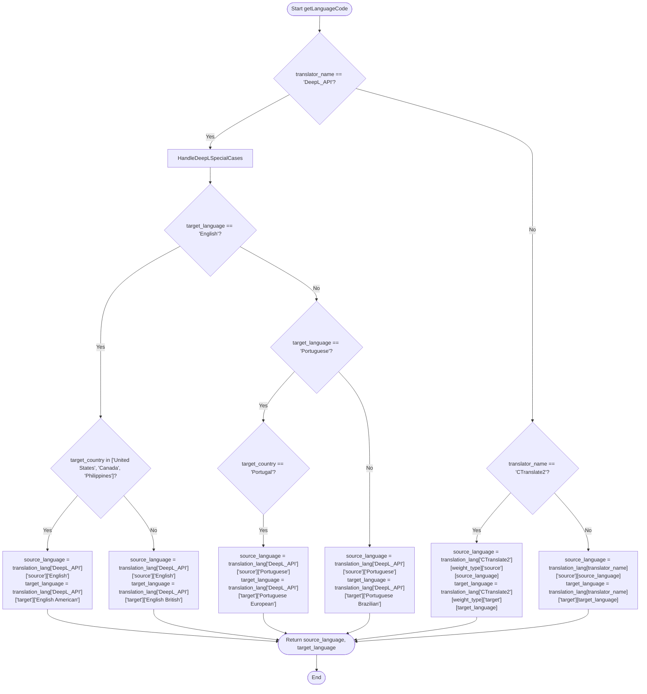
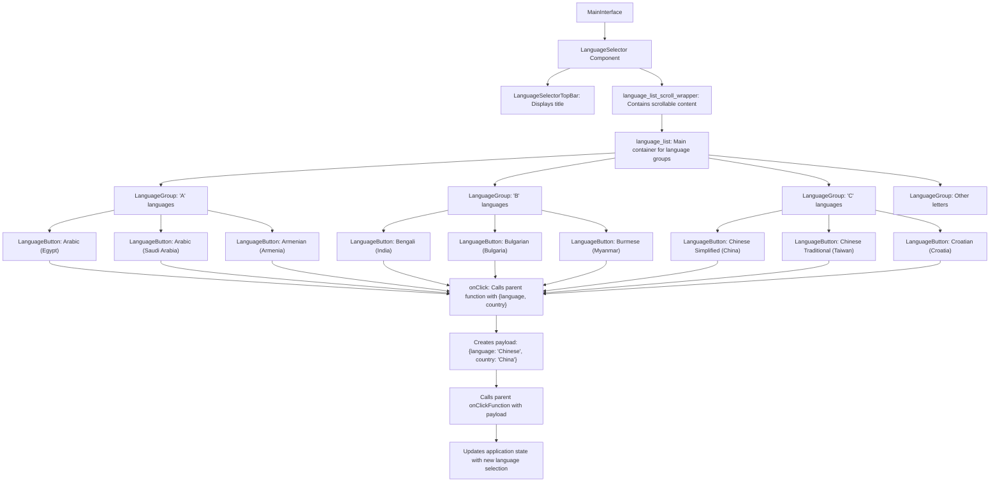

# Language and Country Configuration

<cite>
**Referenced Files in This Document**   
- [languages.yml](file://src-python/models/translation/languages/languages.yml)
- [translation_languages.py](file://src-python/models/translation/translation_languages.py)
- [translation_translator.py](file://src-python/models/translation/translation_translator.py)
- [Translation.jsx](file://src-ui/views/app/config_page/setting_section/setting_box/translation/Translation.jsx)
- [LanguageSelector.jsx](file://src-ui/views/app/main_page/main_section/language_selector/LanguageSelector.jsx)
- [config.py](file://src-python/config.py)
- [model.py](file://src-python/model.py)
- [useLanguageSettings.js](file://src-ui/logics/main/useLanguageSettings.js)
</cite>

## Table of Contents
1. [Introduction](#introduction)
2. [Configuration Storage and Retrieval](#configuration-storage-and-retrieval)
3. [Language Code Resolution Process](#language-code-resolution-process)
4. [Comprehensive Language Mappings](#comprehensive-language-mappings)
5. [UI Language Selection Interface](#ui-language-selection-interface)
6. [Valid Language Combinations and Examples](#valid-language-combinations-and-examples)
7. [Handling Language Code Variations](#handling-language-code-variations)
8. [Fallback Behavior and Error Handling](#fallback-behavior-and-error-handling)
9. [Common Issues and Compatibility Verification](#common-issues-and-compatibility-verification)
10. [Conclusion](#conclusion)

## Introduction
The VRCT (Virtual Reality Chat Translator) system provides a sophisticated language and country configuration framework that enables users to translate text between various languages with country-specific variations. This documentation details how the system manages source_language, target_language, and target_country parameters through its Config system and Translator class. The architecture supports multiple translation backends with comprehensive language mappings defined in languages.yml, including special cases for regional language variations like American vs British English and Brazilian vs European Portuguese. The user interface presents intuitive language selection dropdowns in Translation.jsx, allowing users to configure their translation preferences. This document explains the complete workflow from configuration storage to translation execution, including handling of language code variations between services, fallback mechanisms, and guidance for verifying language compatibility with selected translation engines.

## Configuration Storage and Retrieval

The VRCT system stores language and country configuration parameters in the Config class, which manages various application settings including translation preferences. The configuration system uses validated properties to ensure data integrity when storing language selections.

The Config class defines specific properties for managing language configurations:
- SELECTED_YOUR_LANGUAGES: Stores the user's source language preferences
- SELECTED_TARGET_LANGUAGES: Stores the target language selections
- SELECTED_TRANSLATION_ENGINES: Tracks the active translation engines

These configurations are stored as structured data that includes both language names and country information, allowing the system to differentiate between regional variations of the same language. The configuration system automatically saves changes and synchronizes them across the application.

Language settings are retrieved and updated through the model layer, which acts as an intermediary between the UI and configuration system. The useLanguageSettings.js logic module provides methods to get and set language preferences, communicating with the backend through standardized endpoints like "/get/data/selected_your_languages" and "/set/data/selected_target_languages".

**Section sources**
- [config.py](file://src-python/config.py#L724-L725)
- [model.py](file://src-python/model.py#L312-L319)
- [useLanguageSettings.js](file://src-ui/logics/main/useLanguageSettings.js#L52-L84)

## Language Code Resolution Process

The language code resolution process in VRCT is handled by the getLanguageCode static method in the Translator class, which converts user-friendly language and country selections into backend-specific language codes required by different translation services.

The resolution process follows these steps:
1. Receive translator name, weight type, target country, source language, and target language parameters
2. Apply special case handling for translation backends with regional variations
3. Map the friendly language names to the specific codes required by each backend
4. Return the resolved source and target language codes as a tuple

For the DeepL_API backend, the system applies special logic to distinguish between American and British English, as well as Brazilian and European Portuguese, based on the target country parameter. When the target language is English, the system checks if the target country is in a list of countries that use American English (United States, Canada, Philippines) to determine whether to use "en-US" or "en-GB". Similarly, for Portuguese, it checks if the target country is Portugal to determine between "pt-BR" and "pt-PT".

For CTranslate2 models, the system resolves language codes based on the specific model type being used, as different models may have different language code formats. Other translation backends use a direct mapping from the friendly language name to the backend-specific code.

**Diagram sources**
- [translation_translator.py](file://src-python/models/translation/translation_translator.py#L304-L329)

**Section sources**
- [translation_translator.py](file://src-python/models/translation/translation_translator.py#L304-L329)

## Comprehensive Language Mappings

The VRCT system maintains comprehensive language mappings for each translation backend in the languages.yml configuration file. This centralized configuration defines the source and target language capabilities for all supported translation services, including DeepL, Google, Bing, Papago, CTranslate2, Plamo_API, Gemini_API, OpenAI_API, LMStudio, and Ollama.

Each backend section in languages.yml follows a consistent structure with 'source' and 'target' mappings that associate user-friendly language display names with the specific language codes required by each service. The file uses YAML anchors (&deepl_langs, &google_langs, etc.) to avoid duplication when source and target languages are identical.

Special attention is given to regional language variations, particularly in the DeepL_API section which explicitly defines:
- English (American): en-US
- English (British): en-GB
- Portuguese (Brazilian): pt-BR
- Portuguese (European): pt-PT

For CTranslate2 models, the configuration is more complex as different models support different language sets and code formats. The configuration includes:
- m2m100_418M-ct2-int8 and m2m100_1.2B-ct2-int8 models with standard language codes
- nllb-200-distilled-1.3B-ct2-int8 and nllb-200-3.3B-ct2-int8 models with detailed script-specific codes (e.g., ace_Arab, ace_Latn, khk_Cyrl)

The language mappings vary significantly between backends in terms of coverage:
- DeepL supports 31 languages with basic regional distinctions
- Google supports over 100 languages with extensive regional coverage
- Bing supports approximately 70 languages
- Papago focuses on Asian and European languages (13 languages)
- CTranslate2 models support the most languages, with the NLLB models supporting over 200 language-script combinations

The Plamo_API, Gemini_API, OpenAI_API, LMStudio, and Ollama backends use more natural language names in their mappings (e.g., "Simplified Chinese" instead of "zh") reflecting their different API requirements.

**Section sources**
- [languages.yml](file://src-python/models/translation/languages/languages.yml#L1-L772)

## UI Language Selection Interface

The VRCT user interface provides an intuitive language selection system through the LanguageSelector component, which allows users to choose both their source (your) language and target languages for translation. The interface is designed to present language options in a user-friendly manner while handling the underlying complexity of country-specific variations.

The LanguageSelector component displays languages grouped alphabetically by their first letter, making it easier for users to find their desired language. Each language option is presented with both the language name and country in parentheses (e.g., "English (United States)"), providing clear differentiation between regional variations.

The selection process is managed through the useLanguageSettings.js logic module, which handles the communication between the UI and backend. When a user selects a language, the LanguageSelector component calls the appropriate function (onclickFunction_YourLanguage or onclickFunction_TargetLanguage) with a payload containing the selected language and country information.

The interface supports multiple target languages through a tabbed system where users can configure different language pairs for various contexts. The PresetTabSelector component allows switching between different configuration presets, each with its own language settings.

In the configuration page, the Translation.jsx component provides additional controls for translation engines and models, but the core language selection remains in the main interface. The language selector is accessible from both the main page and configuration sections, ensuring users can easily modify their language preferences.

**Diagram sources**
- [LanguageSelector.jsx](file://src-ui/views/app/main_page/main_section/language_selector/LanguageSelector.jsx#L1-L63)

**Section sources**
- [LanguageSelector.jsx](file://src-ui/views/app/main_page/main_section/language_selector/LanguageSelector.jsx#L1-L63)
- [MainSection.jsx](file://src-ui/views/app/main_page/main_section/MainSection.jsx#L69-L102)
- [useLanguageSettings.js](file://src-ui/logics/main/useLanguageSettings.js#L57-L70)

## Valid Language Combinations and Examples

The VRCT system supports various valid language combinations depending on the selected translation backend. The compatibility of language pairs is determined by the language mappings defined in languages.yml for each backend.

### Common Valid Combinations

**English to Other Languages:**
- English (United States) → Japanese (Japan)
- English (United Kingdom) → Spanish (Spain)
- English (Canada) → French (Canada)

**Asian Language Combinations:**
- Japanese (Japan) → Korean (South Korea)
- Chinese Simplified (China) → Japanese (Japan)
- Chinese Traditional (Taiwan) → English (United States)

**European Language Pairs:**
- French (France) → German (Germany)
- Spanish (Spain) → Italian (Italy)
- Portuguese (Brazil) → English (United States)
- Portuguese (Portugal) → French (France)

**Regional Variations:**
- English (United States) → English (United Kingdom) [for regional spelling conversion]
- Portuguese (Brazil) → Portuguese (Portugal) [for regional vocabulary conversion]

### Example Configuration Scenarios

**Scenario 1: American User Communicating with Japanese Colleagues**
- Source language: English (United States)
- Target language: Japanese (Japan)
- Translation backend: DeepL_API
- Resulting codes: en-US → ja

**Scenario 2: Brazilian Portuguese Speaker Translating for European Audience**
- Source language: Portuguese (Brazil)
- Target language: Portuguese (Portugal)
- Translation backend: CTranslate2 (nllb-200 model)
- Resulting codes: pt → pt-PT

**Scenario 3: Multilingual Conference Setup**
- Preset 1: Japanese (Japan) → English (United States)
- Preset 2: Chinese Simplified (China) → English (United Kingdom)
- Preset 3: Korean (South Korea) → Spanish (Spain)

The system validates language combinations through the findTranslationEngines method in the model.py file, which checks if the selected source and target languages are supported by each available translation engine. Only engines that support all selected languages are made available to the user.

**Section sources**
- [languages.yml](file://src-python/models/translation/languages/languages.yml#L42-L108)
- [model.py](file://src-python/model.py#L321-L337)

## Handling Language Code Variations

The VRCT system handles language code variations between different translation services through its centralized language mapping system in languages.yml and the getLanguageCode resolution method in the Translator class.

Different translation backends use varying conventions for language codes:
- DeepL_API uses BCP 47 format with country codes (en-US, en-GB, pt-BR, pt-PT)
- Google uses a mix of ISO 639-1 and custom codes (zh-CN, zh-TW, tl for Filipino)
- Bing uses similar codes to Google but with some differences (zh-Hant for Traditional Chinese)
- CTranslate2 models use detailed script-specific codes (zho_Hans, zho_Hant, khk_Cyrl)
- Plamo_API and Gemini_API use natural language names as codes (Simplified Chinese, Traditional Chinese)

The system resolves these variations through the following process:
1. The UI presents language options using consistent display names (e.g., "Chinese Simplified")
2. When a translation is requested, the getLanguageCode method maps these display names to the appropriate backend-specific codes
3. For backends with regional variations (like DeepL_API), the target country parameter is used to select the correct regional code
4. The resolved codes are passed to the specific translation client for processing

For CTranslate2 models, additional complexity is handled based on the model type:
- m2m100 models use language codes as tokens (e.g., ">>pt<<" for Portuguese)
- NLLB models use language-script codes (e.g., "por_Latn" for Portuguese)

The system also handles cases where a backend doesn't support regional variations by falling back to the base language code. For example, when translating to Portuguese using Google Translate, the system uses "pt" regardless of whether the target country is Brazil or Portugal, since Google doesn't distinguish between these variants in its API.

This abstraction layer allows the UI to present a consistent language selection experience while accommodating the different requirements of each translation service.

**Section sources**
- [translation_translator.py](file://src-python/models/translation/translation_translator.py#L304-L329)
- [languages.yml](file://src-python/models/translation/languages/languages.yml#L1-L772)

## Fallback Behavior and Error Handling

The VRCT system implements comprehensive fallback behavior and error handling to ensure reliable translation services even when exact language matches are not available or when translation requests fail.

When resolving language codes, the system follows a hierarchical fallback approach:
1. First, attempt to use the country-specific language code (e.g., en-US for English in the United States)
2. If the country-specific code is not supported by the backend, fall back to the base language code (e.g., en for English)
3. If the language is completely unsupported, return an error and disable the translation engine

The system also implements fallback behavior at the engine level. When multiple translation engines are configured, the system checks compatibility with each engine and only enables those that support the selected language pair. This is handled by the findTranslationEngines method in model.py, which evaluates each engine's language support and returns only compatible engines.

Error handling is implemented throughout the translation process:
- In the Translator class, all translation methods are wrapped in try-except blocks to catch and log exceptions
- When a translation fails, the system returns False to maintain compatibility with existing behavior
- Authentication failures are handled gracefully, with the system disabling the affected translation engine rather than crashing

The UI reflects these fallbacks and errors by:
- Disabling translation engine options that are incompatible with the selected languages
- Displaying error messages when authentication fails
- Providing feedback when translations cannot be processed

The system also handles model-specific requirements, such as ensuring CTranslate2 models are properly loaded before attempting translation, with appropriate error handling if model loading fails.

**Section sources**
- [translation_translator.py](file://src-python/models/translation/translation_translator.py#L331-L441)
- [model.py](file://src-python/model.py#L321-L337)
- [translation_languages.py](file://src-python/models/translation/translation_languages.py#L55-L78)

## Common Issues and Compatibility Verification

Users of the VRCT translation system may encounter several common issues related to language and country configuration. Understanding these issues and how to verify compatibility with selected translation engines is essential for optimal system performance.

### Common Issues

**Unsupported Language Pairs:**
- Attempting to translate between languages not supported by the selected backend
- Using regional language variants not supported by certain engines
- Selecting language combinations that exceed a backend's capabilities

**Authentication Problems:**
- Invalid API keys preventing access to cloud-based translation services
- Network connectivity issues with translation endpoints
- Rate limiting or quota exhaustion with cloud services

**Model Loading Issues:**
- CTranslate2 models failing to load due to missing weights or incompatible hardware
- Insufficient VRAM for GPU-accelerated translation models
- Compute type mismatches between system capabilities and model requirements

**Configuration Conflicts:**
- Inconsistent language selections between source and target
- Conflicting country settings for regional language variants
- Preset configurations that exceed backend capabilities

### Compatibility Verification

To verify language compatibility with selected translation engines, users should:

1. **Check Backend Capabilities:**
   - Review the languages.yml file to understand which languages each backend supports
   - Verify that both source and target languages are listed in the backend's source and target mappings
   - Check for regional variant support when using country-specific settings

2. **Test Configuration:**
   - Use the configuration interface to select language pairs and observe which translation engines remain enabled
   - Engines that are incompatible with the selected languages will be automatically disabled
   - Test translations with short phrases to verify functionality

3. **Validate Authentication:**
   - Ensure API keys are correctly entered for services requiring authentication
   - Test connectivity to translation endpoints
   - Verify account quotas and usage limits

4. **Verify Model Availability:**
   - For CTranslate2, ensure the selected model weights are downloaded and accessible
   - Check that system hardware meets model requirements
   - Verify compute device and type settings are appropriate

The system provides feedback on compatibility through the UI, disabling translation engine options that are incompatible with the current language configuration and displaying error messages when authentication or model loading fails.

**Section sources**
- [languages.yml](file://src-python/models/translation/languages/languages.yml#L1-L772)
- [Translation.jsx](file://src-ui/views/app/config_page/setting_section/setting_box/translation/Translation.jsx#L1-L544)
- [model.py](file://src-python/model.py#L321-L337)

## Conclusion
The VRCT translation system provides a robust framework for language and country configuration that balances user-friendly interface design with sophisticated backend processing. By centralizing language mappings in the languages.yml file and implementing a comprehensive resolution process in the Translator class, the system effectively handles the complexities of regional language variations across multiple translation backends. The UI presents an intuitive language selection interface that abstracts away the technical details while still allowing users to specify country preferences for regional variants. The system's fallback behavior and error handling ensure reliable operation even when exact language matches are not available or when translation requests encounter issues. By understanding the configuration storage, code resolution process, language mappings, and compatibility requirements, users can effectively leverage the full capabilities of the VRCT translation system for their multilingual communication needs.