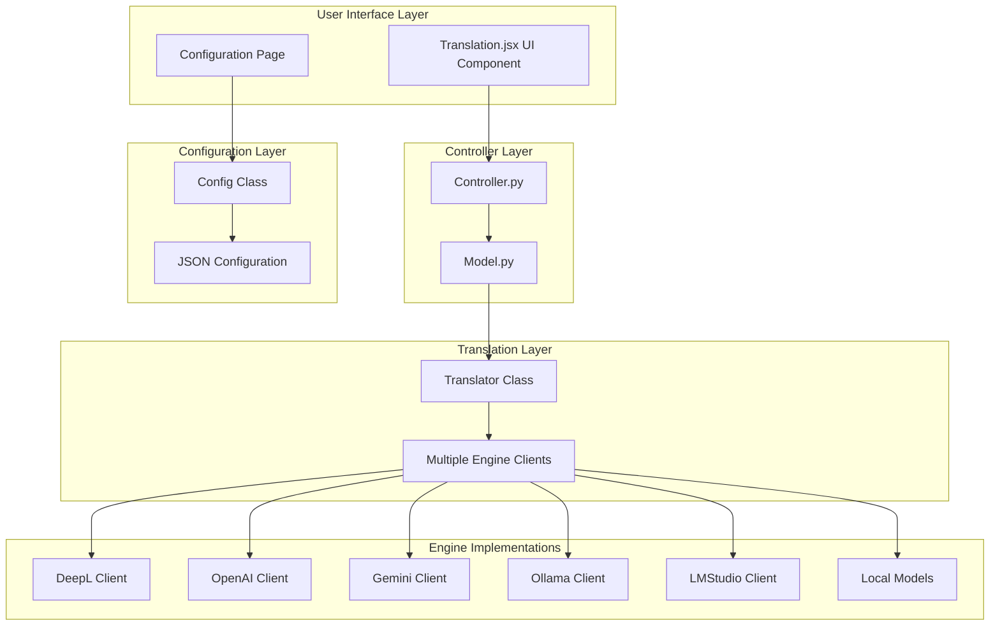
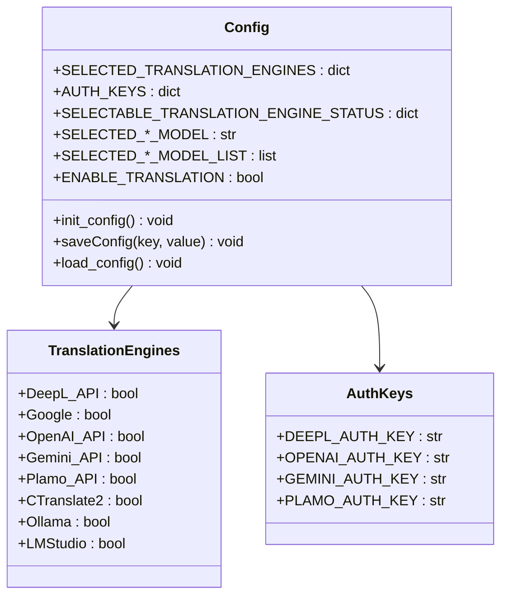
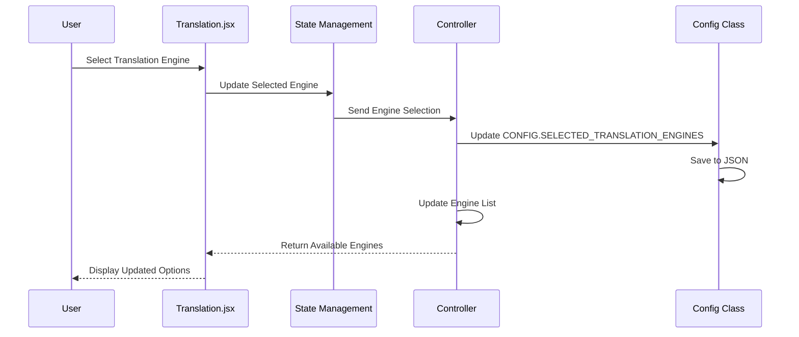
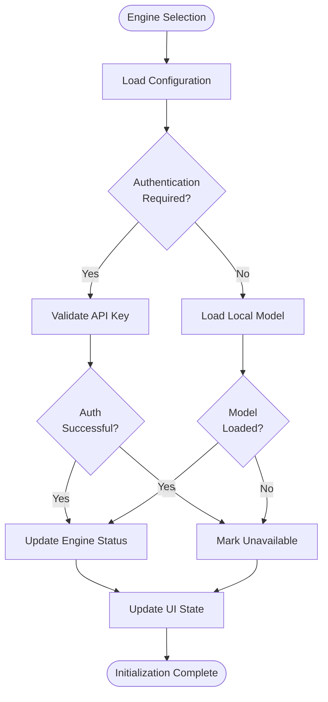
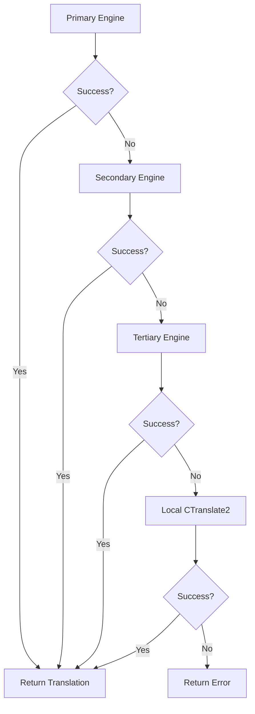
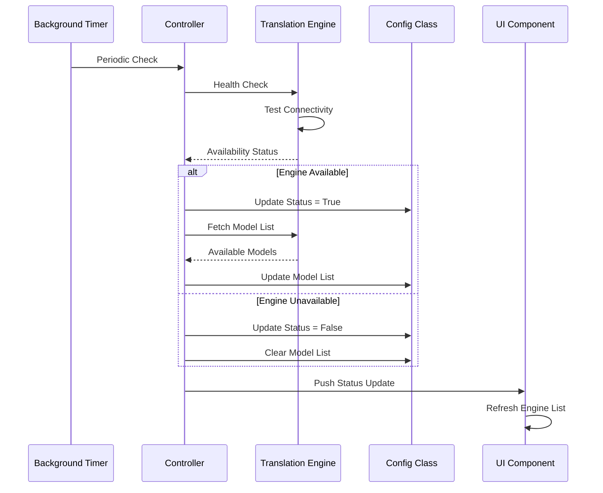
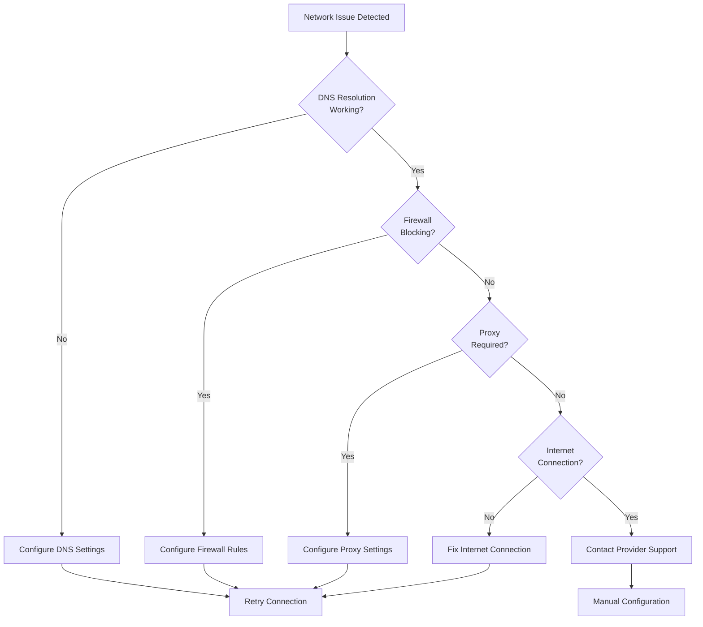

# Translation Engine Selection

<cite>
**Referenced Files in This Document**
- [translation_translator.py](file://src-python/models/translation/translation_translator.py)
- [config.py](file://src-python/config.py)
- [Translation.jsx](file://src-ui/views/app/config_page/setting_section/setting_box/translation/Translation.jsx)
- [translation_gemini.py](file://src-python/models/translation/translation_gemini.py)
- [translation_openai.py](file://src-python/models/translation/translation_openai.py)
- [translation_ollama.py](file://src-python/models/translation/translation_ollama.py)
- [translation_languages.py](file://src-python/models/translation/translation_languages.py)
- [controller.py](file://src-python/controller.py)
- [model.py](file://src-python/model.py)
- [requirements.txt](file://requirements.txt)
- [translation_translator.md](file://src-python/docs/details/translation_translator.md)
</cite>

## Table of Contents
1. [Introduction](#introduction)
2. [Translation Engine Architecture](#translation-engine-architecture)
3. [Supported Translation Engines](#supported-translation-engines)
4. [Configuration Management](#configuration-management)
5. [Engine Selection Interface](#engine-selection-interface)
6. [Initialization Process](#initialization-process)
7. [Fallback Mechanisms](#fallback-mechanisms)
8. [Runtime Model Availability Checking](#runtime-model-availability-checking)
9. [Common Issues and Troubleshooting](#common-issues-and-troubleshooting)
10. [Best Practices](#best-practices)

## Introduction

VRCT provides a comprehensive translation engine selection system that supports multiple translation backends, allowing users to choose between cloud-based APIs and local models. The system is designed with flexibility, reliability, and ease of use in mind, offering automatic fallback mechanisms and comprehensive error handling.

The translation engine system consists of three main components:
- **Backend Selection**: Users can choose from various translation providers
- **Configuration Management**: Centralized storage of authentication keys and engine settings
- **Runtime Engine Management**: Dynamic loading and switching between different translation engines

## Translation Engine Architecture

The translation system follows a layered architecture that separates concerns between user interface, configuration management, and backend implementations.



**Diagram sources**
- [Translation.jsx](file://src-ui/views/app/config_page/setting_section/setting_box/translation/Translation.jsx#L1-L50)
- [controller.py](file://src-python/controller.py#L864-L932)
- [config.py](file://src-python/config.py#L531-L730)
- [translation_translator.py](file://src-python/models/translation/translation_translator.py#L39-L60)

**Section sources**
- [translation_translator.py](file://src-python/models/translation/translation_translator.py#L39-L60)
- [controller.py](file://src-python/controller.py#L864-L932)

## Supported Translation Engines

VRCT supports seven distinct translation engines, each with unique characteristics and capabilities:

### Cloud-Based Engines

| Engine | Authentication | Cost Model | Languages | Features |
|--------|---------------|------------|-----------|----------|
| **DeepL API** | API Key | Paid | 26+ | Highest quality, regional variants |
| **Google** | Built-in | Free tier limits | 100+ | Web scraping, free usage |
| **OpenAI API** | API Key | Paid | GPT models | Fine-tuned models available |
| **Gemini API** | API Key | Paid | Flexible | Google's latest models |
| **Plamo API** | API Key | Paid | Custom | Specialized domains |

### Local Engines

| Engine | Model Size | Memory Usage | Speed | Offline Capability |
|--------|------------|--------------|-------|-------------------|
| **CTranslate2** | Small/Large | 1GB/6GB RAM | Fast | Fully offline |
| **Ollama** | Variable | Depends on model | Medium | Local deployment |
| **LMStudio** | Variable | Depends on model | Medium | Local deployment |

### Engine-Specific Configuration Values

Each engine requires specific configuration parameters:

#### DeepL API Configuration
```yaml
# Required fields
DEEPL_AUTH_KEY: "your-api-key-here"
SELECTED_DEEPL_MODEL: "Free"  # or "Pro"
```

#### OpenAI API Configuration
```yaml
# Required fields
OPENAI_AUTH_KEY: "sk-your-api-key"
SELECTED_OPENAI_MODEL: "gpt-4"
BASE_URL: "https://api.openai.com/v1"  # Optional for custom endpoints
```

#### Gemini API Configuration
```yaml
# Required fields
GEMINI_AUTH_KEY: "your-gemini-api-key"
SELECTED_GEMINI_MODEL: "gemini-pro"
```

#### Ollama Configuration
```yaml
# Required fields
OLLAMA_BASE_URL: "http://localhost:11434"
SELECTED_OLLAMA_MODEL: "llama2"
```

#### LMStudio Configuration
```yaml
# Required fields
LMSTUDIO_URL: "http://localhost:1234/v1"
SELECTED_LMSTUDIO_MODEL: "custom-model"
```

#### CTranslate2 Configuration
```yaml
# Required fields
CTRANSLATE2_WEIGHT_TYPE: "small"  # or "large"
SELECTED_TRANSLATION_COMPUTE_DEVICE: {
    "device": "cpu",
    "device_index": 0,
    "device_name": "CPU"
}
SELECTED_TRANSLATION_COMPUTE_TYPE: "float16"
```

**Section sources**
- [translation_translator.py](file://src-python/models/translation/translation_translator.py#L331-L441)
- [translation_gemini.py](file://src-python/models/translation/translation_gemini.py#L54-L93)
- [translation_openai.py](file://src-python/models/translation/translation_openai.py#L62-L105)

## Configuration Management

The Config class serves as the central hub for managing translation engine configurations, storing authentication keys, and maintaining engine availability status.

### Config Class Structure



**Diagram sources**
- [config.py](file://src-python/config.py#L531-L730)
- [config.py](file://src-python/config.py#L671-L678)

### Engine Status Tracking

The system maintains real-time status of each translation engine through the `SELECTABLE_TRANSLATION_ENGINE_STATUS` dictionary:

```python
# Example status configuration
SELECTABLE_TRANSLATION_ENGINE_STATUS = {
    "DeepL_API": True,      # Available and authenticated
    "Google": False,        # Available but not authenticated
    "OpenAI_API": False,    # Not available (network issue)
    "CTranslate2": True     # Loaded and ready
}
```

### Configuration Persistence

All translation settings are persisted to JSON configuration files with automatic saving and debouncing mechanisms to prevent excessive disk writes.

**Section sources**
- [config.py](file://src-python/config.py#L531-L730)
- [controller.py](file://src-python/controller.py#L864-L932)

## Engine Selection Interface

The UI component provides an intuitive interface for selecting and configuring translation engines through the Translation.jsx component.

### UI Component Architecture



**Diagram sources**
- [Translation.jsx](file://src-ui/views/app/config_page/setting_section/setting_box/translation/Translation.jsx#L1-L50)
- [controller.py](file://src-python/controller.py#L884-L888)

### Engine Dropdown Menu Implementation

The engine selection dropdown provides:
- **Visual Status Indicators**: Available/Unavailable indicators
- **Authentication Status**: Authenticated/Unauthenticated display
- **Model Selection**: Engine-specific model configuration
- **Real-time Updates**: Immediate feedback on engine availability

### Configuration Forms

Each engine type provides specialized configuration forms:

- **Authentication Keys**: Secure input fields for API keys
- **Model Selection**: Dropdown menus for available models
- **Advanced Settings**: Compute device and performance options
- **Validation**: Real-time validation of input values

**Section sources**
- [Translation.jsx](file://src-ui/views/app/config_page/setting_section/setting_box/translation/Translation.jsx#L1-L544)

## Initialization Process

The translation engine initialization follows a structured process that ensures proper setup and authentication for each selected engine.

### Engine Initialization Sequence



**Diagram sources**
- [controller.py](file://src-python/controller.py#L2948-L3041)
- [translation_translator.py](file://src-python/models/translation/translation_translator.py#L48-L60)

### Specific Engine Initialization

#### DeepL API Initialization
```python
# Authentication and model discovery
def authenticationDeepLAuthKey(self, auth_key: str) -> bool:
    self.deepl_client = DeepLClient(auth_key)
    # Quick smoke test
    self.deepl_client.translate_text(" ", target_lang="EN-US")
```

#### OpenAI API Initialization
```python
# Comprehensive model validation
def _get_available_text_models(api_key: str, base_url: str | None = None) -> list[str]:
    client = OpenAI(api_key=api_key, base_url=base_url)
    res = client.models.list()
    # Filter for appropriate models
    allowed_models = [
        model.id for model in res.data 
        if model.id.startswith("gpt-") and not any(kw in model.id for kw in exclude_keywords)
    ]
```

#### CTranslate2 Initialization
```python
# Model loading with device configuration
def changeCTranslate2Model(self, path: str, model_type: str, device: str = "cpu", 
                          device_index: int = 0, compute_type: str = "auto") -> None:
    self.ctranslate2_translator = ctranslate2.Translator(
        weight_path, device=device, device_index=device_index,
        compute_type=compute_type, inter_threads=1, intra_threads=4
    )
```

**Section sources**
- [translation_translator.py](file://src-python/models/translation/translation_translator.py#L48-L302)
- [translation_gemini.py](file://src-python/models/translation/translation_gemini.py#L19-L52)
- [translation_openai.py](file://src-python/models/translation/translation_openai.py#L15-L60)

## Fallback Mechanisms

VRCT implements sophisticated fallback mechanisms to ensure reliable translation services even when primary engines fail.

### Automatic Fallback Chain



**Diagram sources**
- [translation_translator.py](file://src-python/models/translation/translation_translator.py#L331-L441)

### Fallback Priority Order

The system follows this priority order for translation attempts:

1. **Primary Cloud Engines** (DeepL API, OpenAI API, Gemini API)
2. **Secondary Cloud Engines** (DeepL Web, Google Translate)
3. **Local Engines** (CTranslate2, Ollama, LMStudio)
4. **Error Handling** (Return False or original text)

### Network Failure Handling

When network connectivity issues occur, the system automatically:
- Disables unavailable engines
- Updates UI to reflect current status
- Provides clear error messages to users
- Maintains configuration persistence

### VRAM Overflow Protection

The system monitors GPU memory usage and implements automatic fallback:
- Detects VRAM overflow during translation
- Automatically switches to CTranslate2
- Stops translation service temporarily
- Logs detailed error information for debugging

**Section sources**
- [translation_translator.py](file://src-python/models/translation/translation_translator.py#L331-L441)
- [controller.py](file://src-python/controller.py#L836-L865)

## Runtime Model Availability Checking

The system continuously monitors engine availability and updates the UI accordingly through dynamic model discovery and health checks.

### Availability Monitoring Process



**Diagram sources**
- [controller.py](file://src-python/controller.py#L2948-L3041)
- [model.py](file://src-python/model.py#L321-L337)

### Model Discovery Methods

Each engine implements specific model discovery mechanisms:

#### API-Based Engines
```python
# DeepL model discovery
def _get_available_text_models(api_key: str) -> list[str]:
    client = genai.Client(api_key=api_key)
    res = client.models.list()
    return [model.name.replace("models/", "") for model in res 
            if "gemini" in model.name.lower()]
```

#### Local Engines
```python
# Ollama model discovery
def _get_available_text_models(base_url: str | None = None) -> list[str]:
    response = requests.get(f"{base_url}/api/tags")
    models = response.json()["models"]
    return [model["name"] for model in models]
```

### Real-Time Status Updates

The system provides real-time status updates through:
- **Immediate Feedback**: Instant UI updates when engines become available
- **Background Monitoring**: Continuous health checks without user intervention
- **Error Propagation**: Clear error messages for troubleshooting
- **Automatic Recovery**: Engines automatically recover when issues resolve

**Section sources**
- [controller.py](file://src-python/controller.py#L2948-L3041)
- [translation_gemini.py](file://src-python/models/translation/translation_gemini.py#L29-L52)
- [translation_ollama.py](file://src-python/models/translation/translation_ollama.py#L26-L40)

## Common Issues and Troubleshooting

This section addresses frequently encountered issues and provides systematic solutions for translation engine problems.

### Missing Dependencies

#### Optional Dependencies Required

Some translation engines require optional dependencies that may not be installed:

| Engine | Required Package | Purpose | Installation Command |
|--------|------------------|---------|---------------------|
| **DeepL API** | `deepl` | Official DeepL client | `pip install deepl` |
| **OpenAI API** | `langchain-openai` | OpenAI integration | `pip install langchain-openai` |
| **Gemini API** | `langchain-google-genai` | Google Gemini client | `pip install langchain-google-genai` |
| **Ollama** | `langchain-ollama` | Ollama integration | `pip install langchain-ollama` |
| **CTranslate2** | `ctranslate2` | Local translation | `pip install ctranslate2` |

#### Dependency Detection

The system automatically detects available dependencies:

```python
# Optional dependency handling
try:
    from deepl import DeepLClient
    ENABLE_TRANSLATORS = True
except Exception:
    other_web_Translator = None
    ENABLE_TRANSLATORS = False
```

### Authentication Failures

#### API Key Validation Issues

Common authentication problems and solutions:

1. **Invalid API Key Format**
   - **Symptom**: "Authentication failure" error messages
   - **Solution**: Verify key format matches engine requirements
   - **Example**: OpenAI keys must start with "sk-" prefix

2. **Expired or Revoked Keys**
   - **Symptom**: 401 Unauthorized errors
   - **Solution**: Regenerate API keys in provider dashboard
   - **Prevention**: Regular key rotation and monitoring

3. **Quota Exceeded**
   - **Symptom**: Rate limiting or quota exceeded errors
   - **Solution**: Upgrade subscription or wait for quota reset
   - **Monitoring**: Track usage patterns and set alerts

### Network Connectivity Issues

#### Connection Problems



**Diagram sources**
- [controller.py](file://src-python/controller.py#L2948-L3041)

#### Local Engine Issues

##### CTranslate2 Model Loading Problems

1. **Missing Model Files**
   - **Symptom**: "Model not found" errors
   - **Solution**: Download and extract model files to correct directory
   - **Location**: `./weights/ctranslate2/<model-name>/`

2. **Insufficient Memory**
   - **Symptom**: Out of memory errors
   - **Solution**: Use smaller model or increase system memory
   - **Alternative**: Switch to CPU-only mode

3. **GPU Compatibility**
   - **Symptom**: CUDA initialization failures
   - **Solution**: Install compatible CUDA drivers and PyTorch
   - **Verification**: Check `torch.cuda.is_available()`

### Performance Issues

#### Slow Translation Performance

Common causes and solutions:

1. **Large Text Blocks**
   - **Problem**: Single large translation requests
   - **Solution**: Split text into smaller chunks (recommended: <500 characters)
   - **Implementation**: Automatic chunking in translation pipeline

2. **Network Latency**
   - **Problem**: High network round-trip times
   - **Solution**: Use closer geographic regions or local engines
   - **Monitoring**: Implement latency tracking

3. **Resource Contention**
   - **Problem**: Multiple simultaneous translations
   - **Solution**: Implement request queuing and rate limiting
   - **Configuration**: Adjust concurrent request limits

### Configuration Problems

#### Engine Selection Conflicts

When multiple engines are configured:
- **Priority Override**: System automatically selects highest-priority available engine
- **Conflict Resolution**: Last-configured engine takes precedence
- **Fallback Chain**: Automatic switching when preferred engine fails

#### Model Compatibility Issues

Different engines support different model types:
- **DeepL**: Supports specific language pairs only
- **OpenAI**: Supports GPT models with specific capabilities
- **CTranslate2**: Supports M2M100 and NLLB models
- **Local Engines**: Support models installed locally

**Section sources**
- [translation_translator.py](file://src-python/models/translation/translation_translator.py#L1-L30)
- [controller.py](file://src-python/controller.py#L2948-L3041)
- [requirements.txt](file://requirements.txt#L1-L32)

## Best Practices

### Engine Selection Guidelines

#### Choosing the Right Engine

1. **Quality vs. Cost Trade-offs**
   - **DeepL API**: Highest quality, paid service
   - **OpenAI API**: Good quality, flexible pricing
   - **CTranslate2**: Free, offline, good quality
   - **Google/Bing**: Free, reasonable quality

2. **Use Case Considerations**
   - **High-volume applications**: Use local engines or API with caching
   - **Sensitive content**: Prefer local engines or private APIs
   - **Low-latency requirements**: Use local engines or CDN-optimized APIs
   - **Budget constraints**: Start with free web services

3. **Geographic Considerations**
   - **Regional variants**: DeepL supports regional language variants
   - **Language coverage**: Some engines support more languages than others
   - **Performance**: Choose geographically closest API endpoints

### Configuration Management

#### Security Best Practices

1. **API Key Management**
   - **Environment Variables**: Store keys in environment variables
   - **Encryption**: Encrypt sensitive configuration data
   - **Rotation**: Regularly rotate API keys
   - **Access Control**: Limit access to configuration files

2. **Backup and Recovery**
   - **Configuration Backup**: Regular backups of translation settings
   - **Disaster Recovery**: Document restoration procedures
   - **Testing**: Regular testing of backup procedures

#### Performance Optimization

1. **Caching Strategies**
   - **Translation Caching**: Cache frequent translations
   - **Model Preloading**: Load models during idle periods
   - **Connection Pooling**: Reuse HTTP connections

2. **Resource Management**
   - **Memory Monitoring**: Monitor memory usage for local engines
   - **GPU Utilization**: Optimize GPU usage for CTranslate2
   - **Network Bandwidth**: Monitor and optimize network usage

### Monitoring and Maintenance

#### Health Monitoring

1. **Regular Checks**
   - **Engine Availability**: Daily availability checks
   - **Performance Metrics**: Track translation speed and accuracy
   - **Error Rates**: Monitor error frequencies and patterns

2. **Alerting Systems**
   - **Critical Failures**: Immediate alerts for unavailable engines
   - **Performance Degradation**: Alerts for slow translations
   - **Resource Exhaustion**: Warnings for memory/CPU limits

#### Maintenance Procedures

1. **Regular Updates**
   - **Model Updates**: Keep local models updated
   - **Library Updates**: Update dependencies regularly
   - **Configuration Reviews**: Periodic configuration audits

2. **Documentation**
   - **Change Logs**: Document all configuration changes
   - **Troubleshooting Guides**: Maintain comprehensive troubleshooting documentation
   - **Training Materials**: Train team members on system operation

**Section sources**
- [translation_translator.md](file://src-python/docs/details/translation_translator.md#L242-L453)
- [translation_translator.py](file://src-python/models/translation/translation_translator.py#L331-L441)