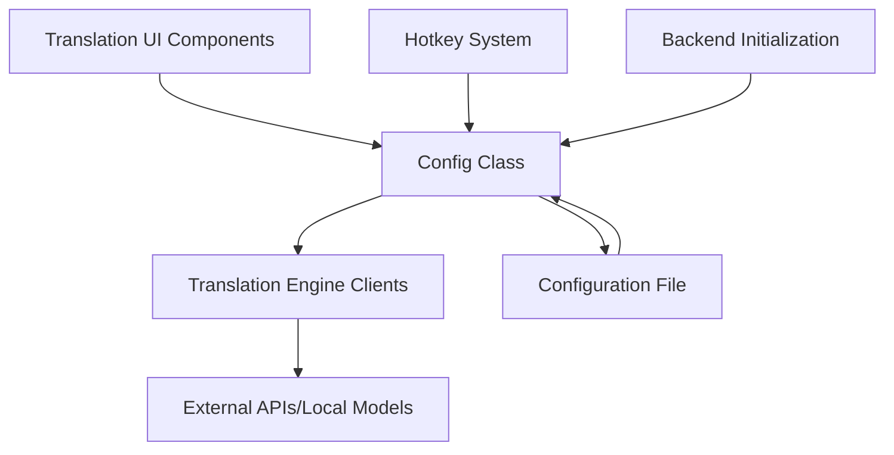
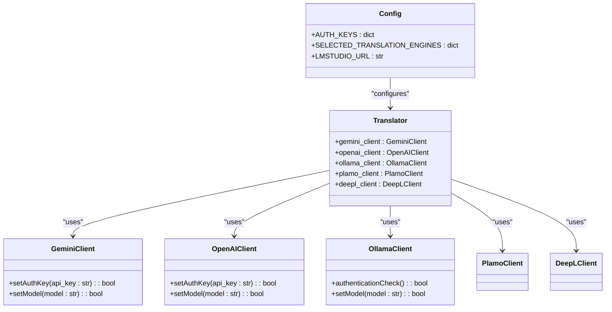
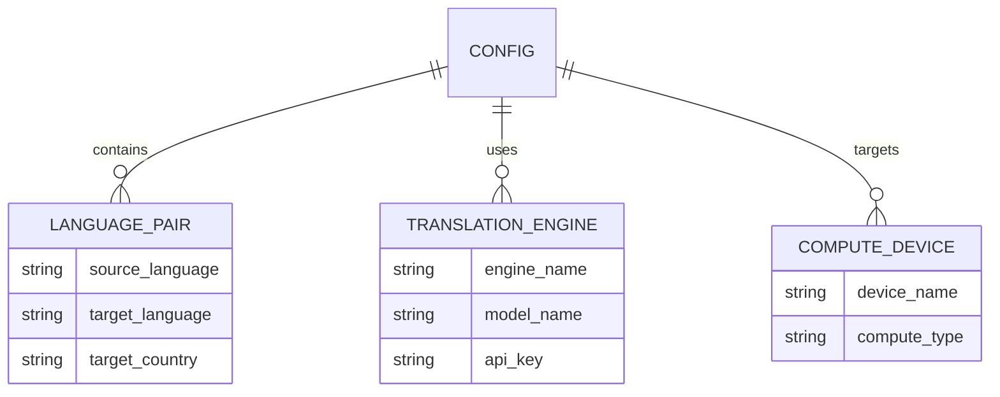
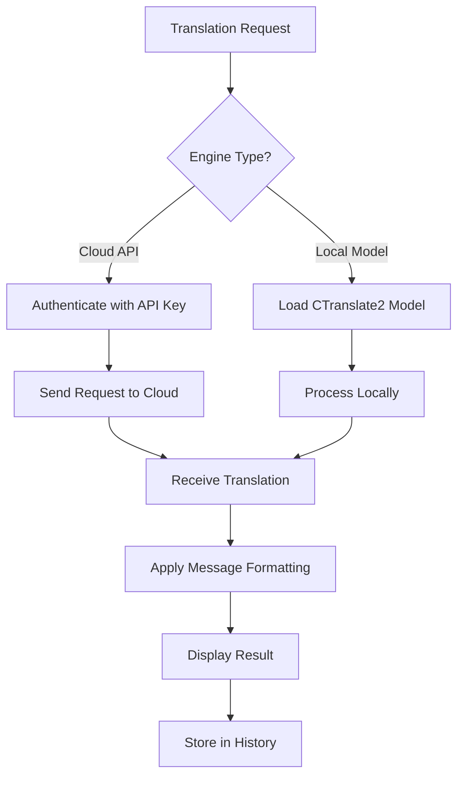
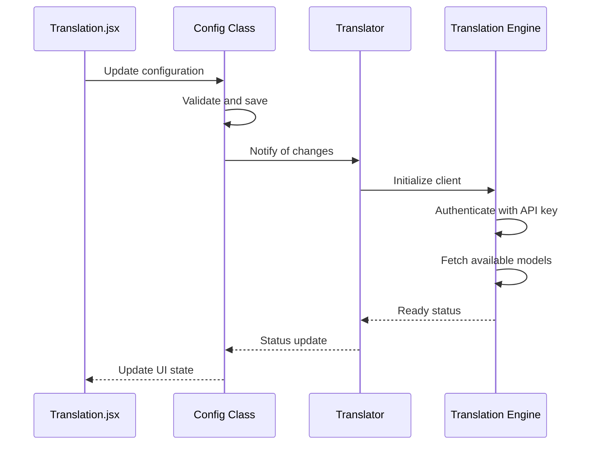
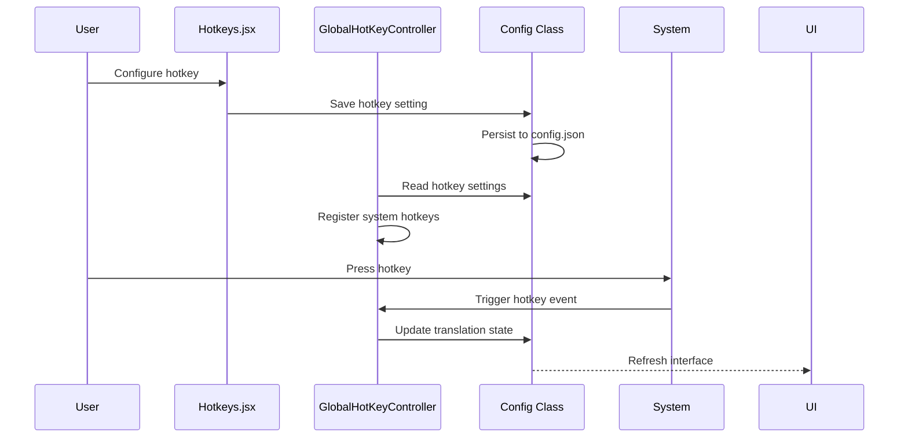

# Translation Settings

<cite>
**Referenced Files in This Document**   
- [config.py](file://src-python/config.py)
- [translation_translator.py](file://src-python/models/translation/translation_translator.py)
- [Translation.jsx](file://src-ui/views/app/config_page/setting_section/setting_box/translation/Translation.jsx)
- [translation_languages.py](file://src-python/models/translation/translation_languages.py)
- [languages.yml](file://src-python/models/translation/languages/languages.yml)
- [translation_gemini.py](file://src-python/models/translation/translation_gemini.py)
- [translation_openai.py](file://src-python/models/translation/translation_openai.py)
- [translation_ollama.py](file://src-python/models/translation/translation_ollama.py)
- [Hotkeys.jsx](file://src-ui/views/app/config_page/setting_section/setting_box/hotkeys/Hotkeys.jsx)
- [GlobalHotKeyController.jsx](file://src-ui/views/app/_app_controllers/GlobalHotKeyController.jsx)
</cite>

## Table of Contents
1. [Introduction](#introduction)
2. [Configuration Architecture](#configuration-architecture)
3. [Engine Selection and API Key Management](#engine-selection-and-api-key-management)
4. [Language Pair Configuration](#language-pair-configuration)
5. [Translation Behavior and Batch Processing](#translation-behavior-and-batch-processing)
6. [UI Component Integration](#ui-component-integration)
7. [Backend Initialization and Fallback Mechanisms](#backend-initialization-and-fallback-mechanisms)
8. [Hotkey Integration](#hotkey-integration)
9. [Troubleshooting Guide](#troubleshooting-guide)

## Introduction
This document provides comprehensive documentation for the translation settings configuration in VRCT (Voice Recognition & Chat Translator). The system enables users to configure various translation engines, manage API authentication keys, select language pairs, and customize translation behavior. The configuration system is built around a centralized Config class that stores all translation-related parameters and ensures proper initialization of translation backends. This documentation covers the complete workflow from user interface interaction through backend initialization and execution.

## Configuration Architecture

The translation configuration system in VRCT follows a layered architecture with clear separation between UI components, configuration management, and backend services. The core of the system is the Config class which serves as a singleton configuration manager, storing all translation parameters and providing type-safe access through property descriptors.



**Diagram sources**
- [config.py](file://src-python/config.py)
- [Translation.jsx](file://src-ui/views/app/config_page/setting_section/setting_box/translation/Translation.jsx)

**Section sources**
- [config.py](file://src-python/config.py#L531-L800)
- [translation_translator.py](file://src-python/models/translation/translation_translator.py#L39-L455)

## Engine Selection and API Key Management

VRCT supports multiple translation engines including Gemini, OpenAI, Ollama, Plamo, DeepL, and local CTranslate2 models. The Config class manages engine selection through the SELECTED_TRANSLATION_ENGINES property, which stores the active engine for each translation context.

API key management is handled through the AUTH_KEYS property in the Config class, which securely stores authentication credentials for cloud-based translation services. Each engine has specific authentication methods:



**Diagram sources**
- [config.py](file://src-python/config.py#L672-L677)
- [translation_translator.py](file://src-python/models/translation/translation_translator.py#L48-L54)
- [translation_gemini.py](file://src-python/models/translation/translation_gemini.py#L54-L128)
- [translation_openai.py](file://src-python/models/translation/translation_openai.py#L62-L140)
- [translation_ollama.py](file://src-python/models/translation/translation_ollama.py#L42-L112)

**Section sources**
- [config.py](file://src-python/config.py#L672-L677)
- [translation_translator.py](file://src-python/models/translation/translation_translator.py#L111-L238)

## Language Pair Configuration

Language pair configuration in VRCT is managed through a comprehensive system that maps user-friendly language names to engine-specific language codes. The system uses YAML-based language definitions stored in languages.yml, which are loaded by the translation_languages.py module.

The Config class stores language selection through several key properties:
- SELECTED_YOUR_LANGUAGES: Source language preferences
- SELECTED_TARGET_LANGUAGES: Target language preferences
- SELECTED_TAB_NO: Active translation tab



**Diagram sources**
- [config.py](file://src-python/config.py#L724-L725)
- [translation_languages.py](file://src-python/models/translation/translation_languages.py#L14-L144)
- [languages.yml](file://src-python/models/translation/languages/languages.yml#L1-L772)

**Section sources**
- [translation_languages.py](file://src-python/models/translation/translation_languages.py#L14-L144)
- [languages.yml](file://src-python/models/translation/languages/languages.yml#L1-L772)

## Translation Behavior and Batch Processing

Translation behavior in VRCT is controlled by several configuration parameters that affect how translations are processed and displayed. The system supports both real-time and batch translation modes, with configurable compute devices and optimization settings.

Key configuration options include:
- CTRANSLATE2_WEIGHT_TYPE: Local model selection for offline translation
- SELECTED_TRANSLATION_COMPUTE_DEVICE: Hardware acceleration target
- SELECTED_TRANSLATION_COMPUTE_TYPE: Precision and performance settings



**Diagram sources**
- [translation_translator.py](file://src-python/models/translation/translation_translator.py#L240-L301)
- [config.py](file://src-python/config.py#L720-L726)

**Section sources**
- [translation_translator.py](file://src-python/models/translation/translation_translator.py#L240-L301)
- [config.py](file://src-python/config.py#L720-L726)

## UI Component Integration

The Translation.jsx UI component provides the user interface for configuring translation settings in VRCT. It integrates with the Config class through React hooks to provide real-time updates and validation.

The component structure includes:
- CTranslate2WeightType_Box: Local model selection
- TranslationComputeDevice_Box: Hardware acceleration settings
- AuthKey components for each supported engine
- Model selection dropdowns for cloud-based services

```mermaid
componentDiagram
[Translation.jsx] --> [Config Class]
[Translation.jsx] --> [useTranslation Hook]
[useTranslation Hook] --> [Config Class]
[AuthKeyContainer] --> [Config Class]
[DropdownMenuContainer] --> [Config Class]
[MultiDropdownMenuContainer] --> [Config Class]
```

**Diagram sources**
- [Translation.jsx](file://src-ui/views/app/config_page/setting_section/setting_box/translation/Translation.jsx#L1-L544)
- [config.py](file://src-python/config.py)

**Section sources**
- [Translation.jsx](file://src-ui/views/app/config_page/setting_section/setting_box/translation/Translation.jsx#L1-L544)

## Backend Initialization and Fallback Mechanisms

The translation_translator.py module implements the backend initialization logic that reads configuration values and initializes the appropriate translation backend. The Translator class serves as a facade that abstracts the differences between various translation engines.

Fallback mechanisms are implemented to handle cases where:
- API keys are invalid or missing
- Selected models are not available
- Network connectivity issues occur
- Rate limits are exceeded



**Diagram sources**
- [translation_translator.py](file://src-python/models/translation/translation_translator.py#L39-L455)
- [config.py](file://src-python/config.py)

**Section sources**
- [translation_translator.py](file://src-python/models/translation/translation_translator.py#L39-L455)

## Hotkey Integration

Hotkey configurations in VRCT are integrated with translation triggers through the GlobalHotKeyController and Hotkeys.jsx components. The system allows users to define keyboard shortcuts for toggling translation functionality.

Key hotkey features include:
- toggle_translation: Enable/disable translation
- toggle_transcription_send: Control speech-to-text input
- toggle_transcription_receive: Control text-to-speech output
- toggle_vrct_visibility: Show/hide the VRCT interface



**Diagram sources**
- [Hotkeys.jsx](file://src-ui/views/app/config_page/setting_section/setting_box/hotkeys/Hotkeys.jsx#L1-L50)
- [GlobalHotKeyController.jsx](file://src-ui/views/app/_app_controllers/GlobalHotKeyController.jsx#L1-L25)
- [config.py](file://src-python/config.py)

**Section sources**
- [Hotkeys.jsx](file://src-ui/views/app/config_page/setting_section/setting_box/hotkeys/Hotkeys.jsx#L1-L50)
- [GlobalHotKeyController.jsx](file://src-ui/views/app/_app_controllers/GlobalHotKeyController.jsx#L1-L25)

## Troubleshooting Guide

This section provides guidance for resolving common issues with translation settings in VRCT.

### API Rate Limits
When encountering rate limit errors:
1. Check your API usage against the provider's limits
2. Implement request throttling in your application
3. Consider upgrading to a higher-tier API plan
4. Use local CTranslate2 models as an alternative

### Invalid API Keys
To resolve authentication issues:
1. Verify the API key format matches the provider's requirements
2. Regenerate the API key if necessary
3. Check for typos or extra whitespace in the key
4. Ensure the key has the required permissions for translation

### Language Support Limitations
When facing language compatibility issues:
1. Verify the selected language is supported by the chosen engine
2. Check the languages.yml file for correct language code mappings
3. Consider using alternative engines that support the required languages
4. For local models, ensure the appropriate CTranslate2 weights are downloaded

### Model Availability Issues
If models are not appearing in the selection dropdown:
1. Verify the API endpoint is reachable
2. Check network connectivity and firewall settings
3. For Ollama, ensure the service is running at http://localhost:11434
4. For local models, verify the weights are properly downloaded in the weights/ctranslate2 directory

**Section sources**
- [translation_translator.py](file://src-python/models/translation/translation_translator.py)
- [translation_gemini.py](file://src-python/models/translation/translation_gemini.py)
- [translation_openai.py](file://src-python/models/translation/translation_openai.py)
- [translation_ollama.py](file://src-python/models/translation/translation_ollama.py)