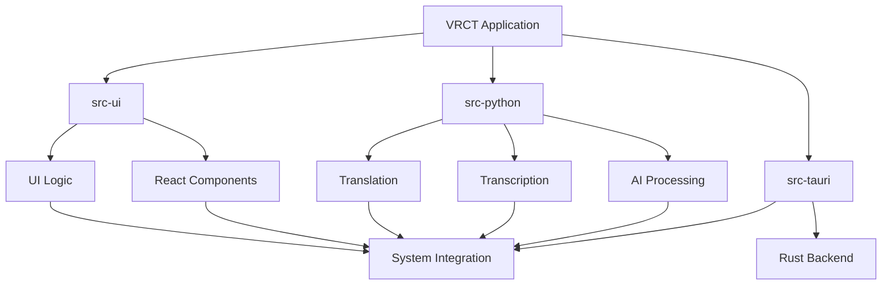
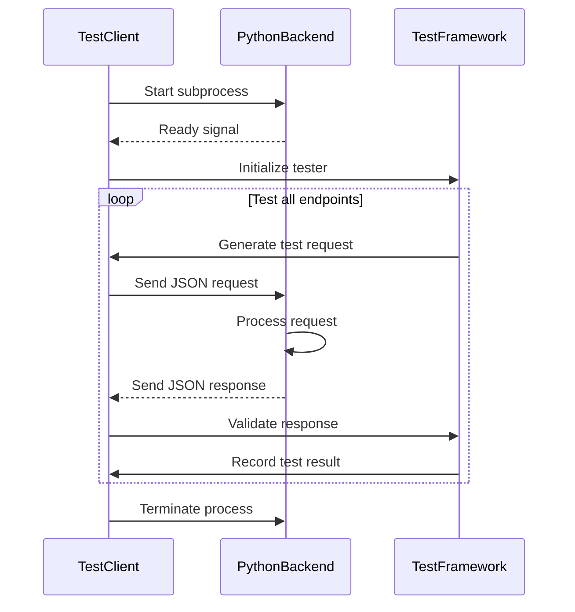

# Development Guide

<cite>
**Referenced Files in This Document**   
- [README.md](file://README.md)
- [package.json](file://package.json)
- [vite.config.js](file://vite.config.js)
- [Cargo.toml](file://src-tauri/Cargo.toml)
- [tauri.conf.json](file://src-tauri/tauri.conf.json)
- [requirements.txt](file://requirements.txt)
- [コーディングルール.md](file://src-python/docs/コーディングルール.md)
- [test_client.py](file://src-python/test_client.py)
- [test_endpoints.py](file://src-python/test_endpoints.py)
- [controller.py](file://src-python/controller.py)
- [model.py](file://src-python/model.py)
- [mainloop.py](file://src-python/mainloop.py)
- [config.py](file://src-python/config.py)
- [lib.rs](file://src-tauri/src/lib.rs)
- [main.rs](file://src-tauri/src/main.rs)
</cite>

## Table of Contents
1. [Introduction](#introduction)
2. [Project Structure](#project-structure)
3. [Development Environment Setup](#development-environment-setup)
4. [Build Process](#build-process)
5. [Contribution Guidelines](#contribution-guidelines)
6. [Testing Procedures](#testing-procedures)
7. [Debugging Techniques](#debugging-techniques)
8. [Version Control Practices](#version-control-practices)
9. [Common Pitfalls and Tips](#common-pitfalls-and-tips)
10. [Conclusion](#conclusion)

## Introduction
This development guide provides comprehensive instructions for contributing to the VRCT codebase. VRCT is a full-stack application that enables real-time voice transcription and translation for virtual reality environments. The application features a React-based frontend, a Tauri/Rust backend for system integration, and Python services for AI processing including speech recognition and translation. This guide covers the complete development workflow, from environment setup to contribution guidelines, testing procedures, and debugging techniques. The document is structured to help developers understand the codebase architecture, follow coding standards, and effectively contribute to the project.

## Project Structure

The VRCT codebase follows a modular structure with three main directories: `src-python`, `src-ui`, and `src-tauri`, each serving distinct purposes in the application architecture. The `src-python` directory contains the core AI processing logic for transcription and translation, while `src-ui` houses the React frontend components and user interface logic. The `src-tauri` directory contains the Rust-based backend that bridges the frontend and Python services, handling system-level operations and inter-process communication.

**Diagram sources**
- [README.md](file://README.md)
- [package.json](file://package.json)
- [vite.config.js](file://vite.config.js)
- [Cargo.toml](file://src-tauri/Cargo.toml)

**Section sources**
- [README.md](file://README.md)
- [package.json](file://package.json)
- [vite.config.js](file://vite.config.js)
- [Cargo.toml](file://src-tauri/Cargo.toml)

## Development Environment Setup

Setting up the development environment for VRCT requires installing dependencies for three technology stacks: Python for AI processing, Node.js for the frontend, and Rust for the Tauri backend. First, install Python 3.9 or higher and create a virtual environment using `python -m venv venv` followed by activating it with `venv\Scripts\activate` on Windows or `source venv/bin/activate` on macOS/Linux. Install the Python dependencies with `pip install -r requirements.txt`. For the frontend, ensure Node.js 16+ is installed and run `npm install` to install the JavaScript dependencies listed in `package.json`. The Tauri backend requires Rust to be installed via `rustup`, which can be obtained from the official Rust website. After installing Rust, the Tauri CLI can be installed with `npm install -D @tauri-apps/cli`. The `vite.config.js` file configures the Vite development server with React integration and custom aliases for easier module imports, while `tauri.conf.json` defines the application settings including window properties and security configurations.

**Section sources**
- [package.json](file://package.json)
- [vite.config.js](file://vite.config.js)
- [Cargo.toml](file://src-tauri/Cargo.toml)
- [tauri.conf.json](file://src-tauri/tauri.conf.json)
- [requirements.txt](file://requirements.txt)

## Build Process

The build process for VRCT involves compiling both the frontend and backend components into a distributable application. The frontend uses Vite as the build tool, with configuration defined in `vite.config.js`. Running `npm run vite-build` compiles the React components in `src-ui` into optimized static assets placed in the `dist` directory. The Tauri backend, configured in `Cargo.toml` and `tauri.conf.json`, packages these frontend assets with the Rust application code to create a cross-platform desktop application. The build process is orchestrated through npm scripts in `package.json`, with `npm run build` executing the complete build sequence: cleaning previous builds, compiling Python scripts with PyInstaller, building the frontend with Vite, and finally packaging everything with Tauri. For development, the `npm run dev` script concurrently starts the Python backend, Vite development server, and Tauri application, enabling hot reloading for efficient development. The `build.bat` and `build_cuda.bat` scripts handle the compilation of Python code into executable form, with the CUDA version including GPU acceleration libraries.

**Section sources**
- [package.json](file://package.json)
- [vite.config.js](file://vite.config.js)
- [Cargo.toml](file://src-tauri/Cargo.toml)
- [tauri.conf.json](file://src-tauri/tauri.conf.json)
- [build.bat](file://build.bat)
- [build_cuda.bat](file://build_cuda.bat)

## Contribution Guidelines

Contributions to the VRCT codebase must adhere to established coding standards and workflow practices. The coding rules, documented in `src-python/docs/コーディングルール.md`, emphasize readability and maintainability while respecting existing code patterns. Key guidelines include using snake_case for functions and variables, PascalCase for classes, and UPPER_SNAKE_CASE for constants. Type annotations are encouraged for new code, with a gradual adoption strategy using mypy for type checking. The pull request workflow follows a standard GitHub process: fork the repository, create a feature branch, implement changes with comprehensive tests, and submit a pull request for review. Each pull request should include a clear description of the changes, reference any related issues, and ensure all automated tests pass. Code changes should be focused and atomic, addressing a single issue or feature. Documentation updates are required for any API changes or new features. The project uses a combination of ruff for code formatting and linting, with pre-commit hooks recommended to automatically format code before commits.

**Section sources**
- [コーディングルール.md](file://src-python/docs/コーディングルール.md)
- [package.json](file://package.json)

## Testing Procedures

The VRCT codebase employs a comprehensive testing strategy to ensure the reliability of both backend and frontend components. For backend validation, two primary testing approaches are used: `test_client.py` and `test_endpoints.py`. The `test_client.py` script simulates a frontend client by establishing stdin/stdout communication with the Python backend, allowing for end-to-end testing of API endpoints. This approach enables testing of the complete request-response cycle, including JSON serialization and error handling. The `test_endpoints.py` file contains unit tests that directly invoke backend functions, providing faster feedback during development. Both testing frameworks use a similar pattern of sending requests to specific endpoints and validating the responses against expected status codes and data structures. The testing strategy includes validation of edge cases, error conditions, and performance under various input scenarios. For the frontend, React components are tested using standard JavaScript testing frameworks, though specific configuration details are not present in the provided codebase. The testing workflow is integrated into the development process, with recommendations to run tests locally before submitting pull requests.

### Backend Testing with test_client.py

The `test_client.py` script provides a robust framework for testing the Python backend through stdin/stdout communication. This approach closely mimics the actual production environment where the Tauri backend communicates with the Python services. The test client establishes a subprocess running the main Python application and sends JSON-formatted requests to various endpoints. Each request includes an endpoint identifier and optional data payload, which is base64-encoded to handle special characters. The test framework validates responses by checking status codes, response structure, and content against expected values. The script includes comprehensive error handling and timeout mechanisms to prevent hanging tests. Automated testing is implemented through the `AutomatedEndpointTester` class, which systematically tests all available endpoints, categorizing them into validity, data setting, execution, and deletion types. This comprehensive approach ensures that all API endpoints are validated for both success and error conditions.

**Diagram sources**
- [test_client.py](file://src-python/test_client.py)
- [test_endpoints.py](file://src-python/test_endpoints.py)

**Section sources**
- [test_client.py](file://src-python/test_client.py)
- [test_endpoints.py](file://src-python/test_endpoints.py)

## Debugging Techniques

Debugging full-stack issues in VRCT requires understanding the interaction between React, Tauri, and Python components. The primary communication channel between the frontend and backend is through stdin/stdout, with JSON messages exchanged between the Tauri Rust application and Python services. When debugging UI issues, the React Developer Tools browser extension can be used to inspect component state and props. For Tauri-related issues, the `tauri.conf.json` file's `devUrl` setting enables development mode where the application connects to the Vite development server at `http://localhost:1420`, allowing for hot reloading and browser-based debugging. Python backend debugging can be performed by running `python mainloop.py` directly and using print statements or a debugger to trace execution. The `controller.py` and `model.py` files contain the core business logic, with the `Controller` class acting as the intermediary between the frontend requests and model operations. When debugging communication issues, examining the JSON messages exchanged between components is crucial. The `run_mapping` dictionary in `mainloop.py` defines the endpoint-to-action mapping, serving as a reference for understanding how frontend requests are processed by the backend.

**Section sources**
- [controller.py](file://src-python/controller.py)
- [model.py](file://src-python/model.py)
- [mainloop.py](file://src-python/mainloop.py)
- [tauri.conf.json](file://src-tauri/tauri.conf.json)

## Version Control Practices

The VRCT project follows standard Git workflow practices with a focus on maintaining code quality and collaboration efficiency. The main branch represents the stable, production-ready code, while feature development occurs on separate branches. Branch names should be descriptive and follow the convention `feature/descriptive-name` or `bugfix/descriptive-name`. Commits should be atomic, focusing on a single change, with clear and concise commit messages that explain the purpose of the change. Pull requests require review by at least one other team member before merging, ensuring code quality and knowledge sharing. The project uses GitHub Issues to track bugs, feature requests, and tasks, with issues referenced in commit messages and pull requests for traceability. Regular rebasing of feature branches onto the latest main branch is recommended to minimize merge conflicts. The `.gitignore` file excludes generated files, dependencies, and sensitive configuration files from version control. For large assets or binary files, the project may use Git LFS, though this is not explicitly configured in the provided codebase.

**Section sources**
- [package.json](file://package.json)
- [README.md](file://README.md)

## Common Pitfalls and Tips

Developers working with the VRCT codebase should be aware of several common pitfalls and follow recommended best practices. One common issue is improper handling of the stdin/stdout communication between the Tauri frontend and Python backend, which can lead to message parsing errors or deadlocks. Always ensure that JSON messages are properly formatted and that the receiving end correctly handles the input stream. Another pitfall is memory management in the Python components, particularly when loading large AI models for transcription and translation. The `model.py` file implements lazy initialization and resource cleanup to mitigate this issue. When modifying the `run_mapping` dictionary in `mainloop.py`, ensure that corresponding changes are made in the frontend to maintain API compatibility. For performance optimization, consider the computational requirements of AI processing and implement appropriate throttling or batching mechanisms. When adding new features, follow the existing code patterns and update documentation accordingly. Regularly run the test suite to catch regressions early, and use the provided development scripts to ensure a consistent development environment across team members.

**Section sources**
- [mainloop.py](file://src-python/mainloop.py)
- [model.py](file://src-python/model.py)
- [controller.py](file://src-python/controller.py)
- [config.py](file://src-python/config.py)

## Conclusion

This development guide provides a comprehensive overview of the VRCT codebase, covering the essential aspects of contributing to the project. By understanding the three-tier architecture with `src-python`, `src-ui`, and `src-tauri` directories, developers can effectively navigate the codebase and make meaningful contributions. The setup, build, testing, and debugging procedures outlined in this document enable developers to establish a productive development environment and maintain code quality. Adhering to the contribution guidelines and version control practices ensures smooth collaboration and code integration. As VRCT continues to evolve, this guide will serve as a foundation for new contributors, helping them quickly become productive while maintaining the high standards of the project. Regular updates to this documentation will ensure it remains relevant as the codebase and development practices evolve.