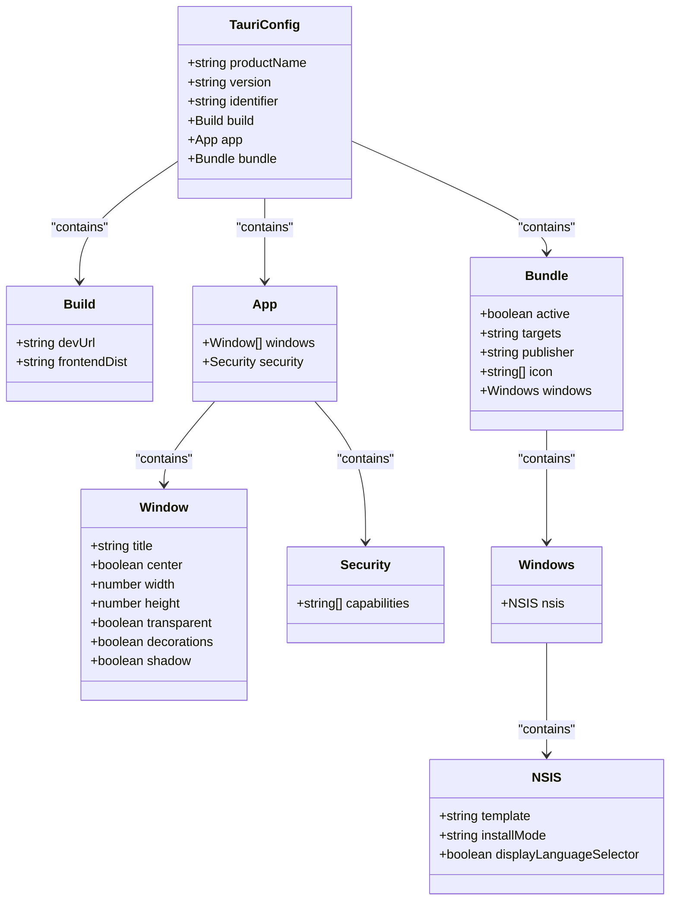
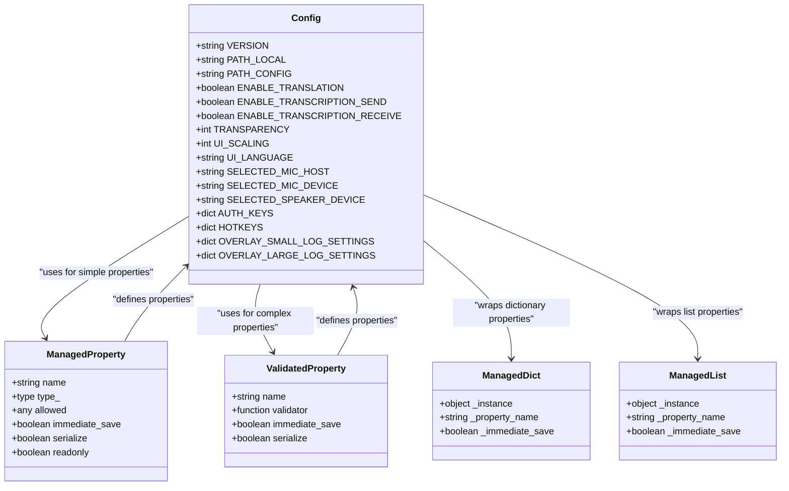
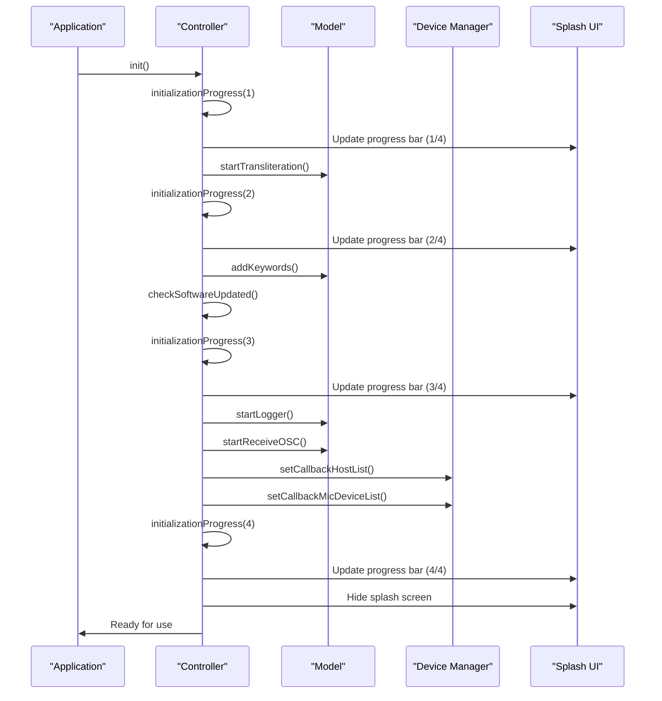
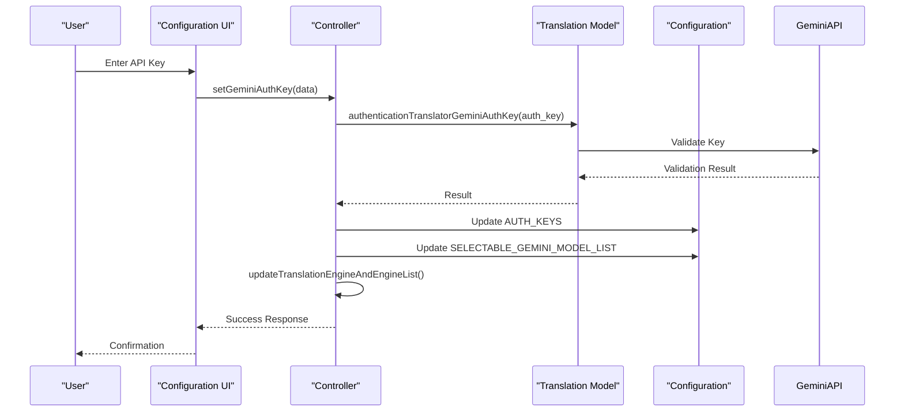

# Initial Configuration

<cite>
**Referenced Files in This Document**   
- [tauri.conf.json](file://src-tauri/tauri.conf.json)
- [config.py](file://src-python/config.py)
- [websocket_server.py](file://src-python/models/websocket/websocket_server.py)
- [osc.py](file://src-python/models/osc/osc.py)
- [mainloop.py](file://src-python/mainloop.py)
- [controller.py](file://src-python/controller.py)
</cite>

## Table of Contents
1. [Introduction](#introduction)
2. [Tauri Configuration](#tauri-configuration)
3. [Persistent User Settings](#persistent-user-settings)
4. [First-Launch Behavior](#first-launch-behavior)
5. [VRChat Integration](#vrchat-integration)
6. [API Key Configuration](#api-key-configuration)
7. [Common Configuration Adjustments](#common-configuration-adjustments)

## Introduction
This document provides comprehensive guidance for the initial configuration of VRCT after installation. It covers the essential configuration files, first-launch behavior, audio device detection, VRChat integration through WebSocket and OSC endpoints, and API key setup for translation services. The configuration system is designed to be both user-friendly through the UI and accessible through direct file modification for advanced users.

## Tauri Configuration
The `tauri.conf.json` file serves as the central configuration for the VRCT desktop application, defining critical application metadata, window properties, security capabilities, and bundling settings. This configuration file is essential for the proper functioning and appearance of the application.



**Diagram sources**
- [tauri.conf.json](file://src-tauri/tauri.conf.json#L1-L60)

### Application Metadata
The `tauri.conf.json` file defines fundamental application metadata that identifies VRCT to the operating system and users. The `productName` field specifies the application name as "VRCT", while the `version` field tracks the current release version (3.3.1). The `identifier` field provides a unique reverse-domain identifier ("com.vrct.app") for system-level identification. These metadata fields are crucial for proper application recognition, updates, and integration with the operating system.

**Section sources**
- [tauri.conf.json](file://src-tauri/tauri.conf.json#L3-L5)

### Window Properties
VRCT's window properties are specifically configured to create a seamless overlay experience in VRChat. The application window is set to be transparent (`"transparent": true`) and without standard window decorations (`"decorations": false`), allowing it to blend naturally with the VR environment. The window is centered on screen with a default width of 450 pixels and height of 220 pixels, with minimum dimensions preventing excessive resizing. The shadow effect is disabled (`"shadow": false`) to maintain a clean, borderless appearance that integrates smoothly with VRChat's interface.

**Section sources**
- [tauri.conf.json](file://src-tauri/tauri.conf.json#L14-L24)

### Security Capabilities
The security configuration in `tauri.conf.json` defines the application's permissions through capabilities. The app utilizes two capabilities: "default" and "vrct-capability". The "vrct-capability" grants extensive permissions necessary for VRCT's functionality, including window manipulation (dragging, resizing, minimizing), global shortcut registration for hotkeys, file system access for configuration and plugin management, HTTP access to specific GitHub endpoints for updates and plugin lists, and shell execution permissions for the VRCT-sidecar process. This capability-based security model ensures VRCT has the necessary permissions while maintaining a secure boundary.

**Section sources**
- [tauri.conf.json](file://src-tauri/tauri.conf.json#L25-L28)
- [vrct_capability.json](file://src-tauri/capabilities/vrct_capability.json#L1-L64)

### Bundling Settings
The bundling configuration specifies how VRCT is packaged for distribution, particularly for Windows users. The application is configured to create an NSIS (Nullsoft Scriptable Install System) installer, which provides a familiar installation experience for Windows users. The installer includes options for current user installation (`"installMode": "currentUser"`) and displays a language selector during installation (`"displayLanguageSelector": true`), allowing users to choose their preferred language. The bundle configuration also specifies the application icon files in various sizes and includes the VRCT-sidecar binary as an external component, ensuring all necessary files are properly packaged.

**Section sources**
- [tauri.conf.json](file://src-tauri/tauri.conf.json#L30-L57)

## Persistent User Settings
The `config.py` file serves as the central repository for persistent user settings in VRCT, implementing a robust configuration system that manages application state across sessions. This Python module defines a singleton `Config` class that exposes both read-only application constants and read-write user preferences through property descriptors.



**Diagram sources**
- [config.py](file://src-python/config.py#L531-L800)

### Configuration Architecture
The configuration system employs a sophisticated architecture using descriptor classes (`ManagedProperty` and `ValidatedProperty`) to automate property management. `ManagedProperty` handles simple typed properties with optional validation and automatic persistence, while `ValidatedProperty` manages complex properties requiring custom validation logic through validator functions. This design pattern eliminates repetitive getter/setter code and ensures consistent behavior across all configuration options. The system also includes `ManagedDict` and `ManagedList` wrapper classes that automatically persist changes to dictionary and list properties, ensuring that modifications to nested data structures are properly saved.

**Section sources**
- [config.py](file://src-python/config.py#L229-L337)
- [config.py](file://src-python/config.py#L531-L540)

### Audio Device Configuration
Audio device settings are critical for VRCT's transcription functionality, allowing users to select their preferred microphone and speaker devices. The configuration includes properties for `SELECTED_MIC_HOST`, `SELECTED_MIC_DEVICE`, and `SELECTED_SPEAKER_DEVICE`, which store the user's choices for audio input and output. These settings are validated against available devices through the device manager, ensuring only valid options are accepted. The configuration also supports automatic device selection (`AUTO_MIC_SELECT` and `AUTO_SPEAKER_SELECT`), which can be useful when users frequently change audio hardware.

**Section sources**
- [config.py](file://src-python/config.py#L729-L735)
- [config.py](file://src-python/config.py#L731-L733)

### Language Preferences
Language settings in VRCT are designed to support multilingual communication in VRChat. The configuration includes `SELECTED_YOUR_LANGUAGES` and `SELECTED_TARGET_LANGUAGES`, which define the user's native languages and the languages they wish to translate to, respectively. Each language selection includes the language code, country code, and an enable flag, allowing for fine-grained control over which language pairs are active. The UI language is controlled by the `UI_LANGUAGE` property, which supports English ("en"), Japanese ("ja"), Korean ("ko"), Traditional Chinese ("zh-Hant"), and Simplified Chinese ("zh-Hans").

**Section sources**
- [config.py](file://src-python/config.py#L724-L725)
- [config.py](file://src-python/config.py#L770)

### Overlay Positioning
Overlay positioning settings control the appearance and behavior of VRCT's text overlays in VRChat. The configuration includes two sets of settings: `OVERLAY_SMALL_LOG_SETTINGS` and `OVERLAY_LARGE_LOG_SETTINGS`, which define the position, rotation, display duration, fadeout duration, opacity, and UI scaling for both small and large overlay modes. Each setting includes tracker options ("HMD", "LeftHand", "RightHand") that determine which VR controller or headset the overlay follows, allowing users to position the text for optimal visibility during gameplay.

**Section sources**
- [config.py](file://src-python/config.py#L684-L685)
- [config.py](file://src-python/config.py#L361-L391)

## First-Launch Behavior
VRCT's first-launch behavior is designed to guide users through essential setup steps while automatically configuring core functionality. The initialization process is managed by the controller and follows a structured sequence to ensure all components are properly configured before the application becomes fully operational.



**Diagram sources**
- [controller.py](file://src-python/controller.py#L3069-L3107)
- [mainloop.py](file://src-python/mainloop.py#L582)
- [SplashComponent.jsx](file://src-ui/views/app/others/splash_component/SplashComponent.jsx#L1-L18)

### Initialization Sequence
The initialization sequence follows a four-stage progress system that guides the user through the startup process. Stage 1 involves initializing the transliteration system, which converts text between different scripts (e.g., Japanese kana to Roman characters). Stage 2 configures the word filter system, which allows users to exclude specific words from transcription. Stage 3 checks for software updates and initializes logging functionality if enabled. Stage 4 establishes OSC communication with VRChat and initializes the device manager for audio device monitoring. Each stage updates the progress bar in the splash screen, providing visual feedback to the user.

**Section sources**
- [controller.py](file://src-python/controller.py#L3071-L3107)
- [StartUpProgressContainer.jsx](file://src-ui/views/app/others/splash_component/start_up_progress_container/StartUpProgressContainer.jsx#L1-L39)

### Automatic Model Downloading
During initialization, VRCT automatically downloads necessary AI models based on the user's selected translation and transcription engines. The system checks the configuration for enabled engines and downloads the corresponding models if they are not already present. This process is managed through the download endpoints in the mainloop mapping, which trigger model downloads for CTranslate2 weights and Whisper transcription models. The download progress is reported through the UI, allowing users to monitor the status of model acquisition before the application is fully functional.

**Section sources**
- [mainloop.py](file://src-python/mainloop.py#L38-L43)
- [mainloop.py](file://src-python/mainloop.py#L323)
- [mainloop.py](file://src-python/mainloop.py#L183)

### Audio Device Detection
Audio device detection is a critical component of VRCT's first-launch behavior, ensuring the application can properly capture and process audio from the user's microphone and speakers. The device manager automatically scans for available audio hosts and devices during initialization, populating the configuration with detected hardware. The system supports multiple audio backends and can identify devices from different hosts (e.g., Windows Audio Session API, ASIO). Users can select their preferred devices through the UI, and the configuration automatically validates selections against the current list of available devices.

**Section sources**
- [device_manager.py](file://src-python/device_manager.py#L79-L96)
- [controller.py](file://src-python/controller.py#L3104-L3107)
- [mainloop.py](file://src-python/mainloop.py#L232-L234)

## VRChat Integration
VRCT integrates with VRChat through both WebSocket and OSC (Open Sound Control) protocols, enabling bidirectional communication between the application and the VR environment. This integration allows VRCT to send translated messages to VRChat and receive information about the user's state within the virtual world.

```mermaid
flowchart TD
VRCT[VRCT Application] --> |WebSocket| VRChat[VRChat Client]
VRCT --> |OSC| VRChat
VRChat --> |WebSocket| VRCT
VRChat --> |OSC| VRCT
subgraph VRCT
WS[WebSocket Server]
OSC[OSC Handler]
Config[Configuration]
end
subgraph VRChat
WSEndpoint[WebSocket Endpoint]
OSCQuery[OSC Query Service]
AvatarParams[Avatar Parameters]
end
Config --> WS : "Host/Port"
Config --> OSC : "IP/Port"
WS < --> WSEndpoint : "JSON Messages"
OSC < --> OSCQuery : "OSC Packets"
OSC --> AvatarParams : "/avatar/parameters/MuteSelf"
OSC --> AvatarParams : "/chatbox/input"
OSC --> AvatarParams : "/chatbox/typing"
```

**Diagram sources**
- [websocket_server.py](file://src-python/models/websocket/websocket_server.py#L1-L222)
- [osc.py](file://src-python/models/osc/osc.py#L1-L241)

### WebSocket Endpoints
The WebSocket integration provides a robust communication channel between VRCT and external applications or scripts. The WebSocket server, implemented in `websocket_server.py`, runs on localhost (127.0.0.1) by default on port 8765, allowing other applications to connect and exchange JSON-formatted messages with VRCT. The server supports bidirectional communication, enabling external applications to send commands to VRCT (such as translation requests) and receive notifications about events within VRCT (such as new transcriptions or translations). This endpoint is configurable through the `WEBSOCKET_HOST` and `WEBSOCKET_PORT` settings in the configuration.

**Section sources**
- [websocket_server.py](file://src-python/models/websocket/websocket_server.py#L17-L22)
- [config.py](file://src-python/config.py#L705-L706)
- [mainloop.py](file://src-python/mainloop.py#L377-L383)

### OSC Configuration
OSC integration enables direct communication with VRChat, allowing VRCT to send messages to the in-game chatbox and receive information about the user's avatar state. The OSC handler, defined in `osc.py`, manages both sending and receiving OSC messages. By default, VRCT sends messages to localhost on port 9000, but these settings are configurable through `OSC_IP_ADDRESS` and `OSC_PORT` in the configuration. When the target address is localhost, VRCT also advertises its presence through OSCQuery, making it discoverable by VRChat and other OSC-compatible applications. The system can send typing indicators and chat messages, and can receive the MuteSelf parameter to synchronize microphone mute states between VRCT and VRChat.

**Section sources**
- [osc.py](file://src-python/models/osc/osc.py#L48-L53)
- [config.py](file://src-python/config.py#L693-L694)
- [mainloop.py](file://src-python/mainloop.py#L386-L391)

## API Key Configuration
VRCT supports multiple translation services that require API keys for authentication. These services include Gemini, OpenAI, and DeepL, each providing different translation capabilities and quality levels. The configuration system provides both UI-based and direct file modification methods for setting API keys, accommodating users of different technical proficiency levels.



**Diagram sources**
- [controller.py](file://src-python/controller.py#L1718-L1734)
- [model.py](file://src-python/model.py#L219-L220)
- [translation_gemini.py](file://src-python/models/translation/translation_gemini.py#L72-L76)

### Translation Service Setup
Each translation service has specific requirements for API key configuration. For Gemini, users need to provide an API key obtained from the Google AI Studio, which must be at least 39 characters long. OpenAI requires a secret key starting with "sk-" and at least 164 characters in length. DeepL uses an authentication key available from the user's DeepL account page. When a valid API key is entered, VRCT validates it by making a test request to the service and, upon successful authentication, updates the configuration to enable the service and populate the available model list for that service.

**Section sources**
- [controller.py](file://src-python/controller.py#L1718-L1734)
- [controller.py](file://src-python/controller.py#L1810-L1825)
- [config.py](file://src-python/config.py#L672-L676)

### UI Configuration Method
The primary method for configuring API keys is through the application's user interface. Users navigate to the translation settings section of the configuration panel, where they find dedicated fields for each supported translation service. When a user enters an API key and confirms the input, the application sends a request to the corresponding endpoint (e.g., `/set/data/gemini_auth_key`) which triggers the authentication process. The UI provides immediate feedback on the success or failure of key validation, displaying appropriate messages to guide the user in case of errors.

**Section sources**
- [mainloop.py](file://src-python/mainloop.py#L199-L201)
- [mainloop.py](file://src-python/mainloop.py#L206-L208)
- [mainloop.py](file://src-python/mainloop.py#L185-L187)

### Direct Configuration Method
For advanced users or automated setups, API keys can be configured directly by modifying the `config.json` file. The keys are stored in the `AUTH_KEYS` dictionary within the configuration file, with keys corresponding to the service names ("Gemini_API", "OpenAI_API", "DeepL_API"). Users can edit this file while VRCT is not running to set or update API keys. When VRCT starts, it reads these keys and attempts to authenticate with the corresponding services. This method is useful for deployment scenarios or when the UI is not accessible.

**Section sources**
- [config.py](file://src-python/config.py#L672-L676)
- [controller.py](file://src-python/controller.py#L1722-L1724)
- [controller.py](file://src-python/controller.py#L1819-L1821)

## Common Configuration Adjustments
Users frequently make specific configuration adjustments to optimize VRCT's performance and functionality for their particular use case and hardware setup. These adjustments can significantly impact the application's behavior, resource usage, and integration with VRChat.

### Performance Optimization
For users experiencing performance issues, several configuration options can help reduce resource consumption. Setting `SELECTED_TRANSLATION_COMPUTE_DEVICE` to CPU instead of GPU can reduce VRChat's performance impact, though it may slow down translation. Reducing `UI_SCALING` and `TEXTBOX_UI_SCALING` values decreases the graphical load of the overlay. Disabling unused transcription engines or translation services through their respective enable flags can also improve performance. Users with limited VRAM should avoid using large AI models and instead opt for smaller, more efficient models when available.

**Section sources**
- [config.py](file://src-python/config.py#L734-L735)
- [config.py](file://src-python/config.py#L631-L632)
- [config.py](file://src-python/config.py#L625-L627)

### Functionality Customization
Users can customize VRCT's functionality to match their communication preferences in VRChat. Enabling `SEND_ONLY_TRANSLATED_MESSAGES` ensures that only translated text is sent to the chatbox, keeping the conversation focused on multilingual communication. Configuring `HOTKEYS` allows users to quickly toggle translation on and off or send messages without using the mouse. Adjusting the `OVERLAY_SMALL_LOG_SETTINGS` and `OVERLAY_LARGE_LOG_SETTINGS` enables users to position the text overlay for optimal visibility without obstructing their view in VR. Setting `VRC_MIC_MUTE_SYNC` synchronizes the microphone mute state between VRCT and VRChat, providing a seamless experience.

**Section sources**
- [config.py](file://src-python/config.py#L696)
- [config.py](file://src-python/config.py#L649-L657)
- [config.py](file://src-python/config.py#L684-L685)
- [config.py](file://src-python/config.py#L703)