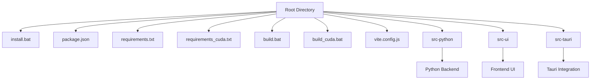
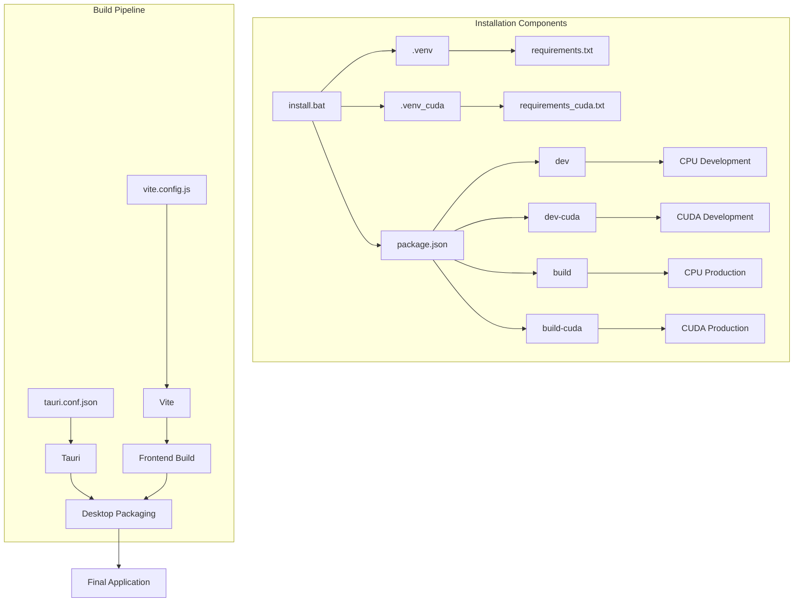
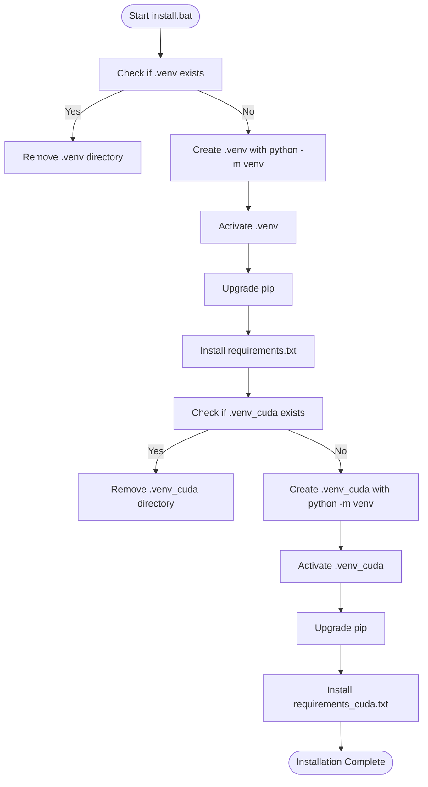
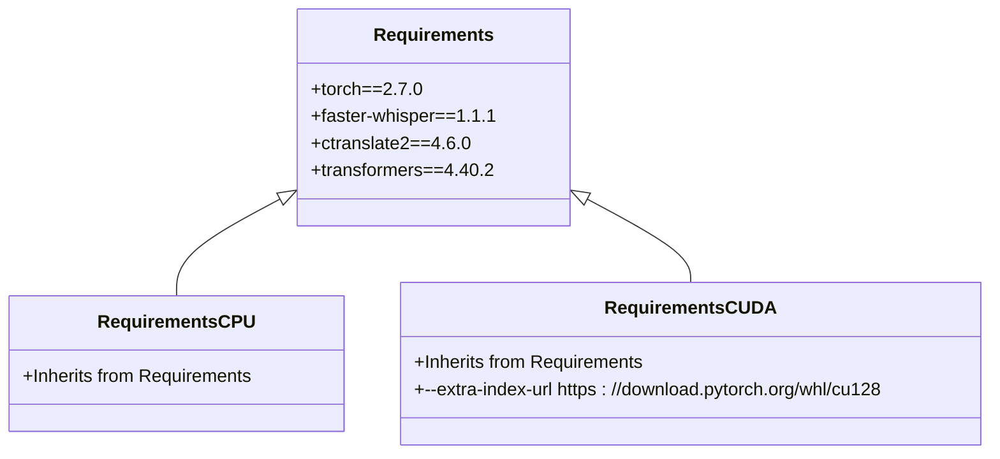
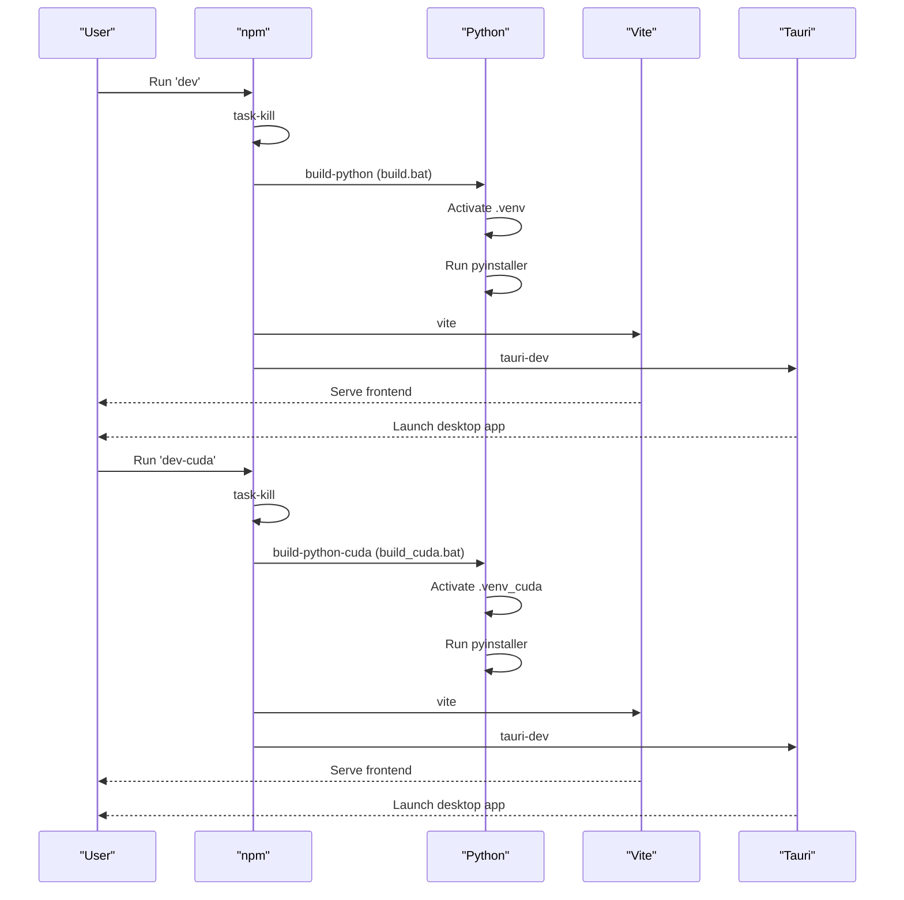
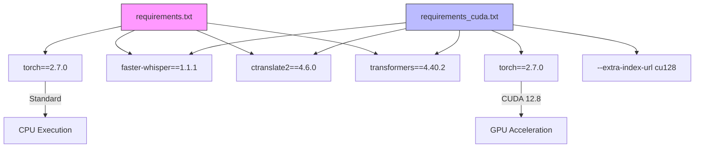

# Installation Process

<cite>
**Referenced Files in This Document**   
- [install.bat](file://install.bat)
- [package.json](file://package.json)
- [requirements.txt](file://requirements.txt)
- [requirements_cuda.txt](file://requirements_cuda.txt)
- [build.bat](file://build.bat)
- [build_cuda.bat](file://build_cuda.bat)
- [vite.config.js](file://vite.config.js)
- [tauri.conf.json](file://src-tauri/tauri.conf.json)
</cite>

## Table of Contents
1. [Introduction](#introduction)
2. [Project Structure](#project-structure)
3. [Core Components](#core-components)
4. [Architecture Overview](#architecture-overview)
5. [Detailed Component Analysis](#detailed-component-analysis)
6. [Dependency Analysis](#dependency-analysis)
7. [Performance Considerations](#performance-considerations)
8. [Troubleshooting Guide](#troubleshooting-guide)
9. [Conclusion](#conclusion)

## Introduction
This document provides comprehensive guidance for installing VRCT (Voice Recognition & Translation) on Windows systems. The installation process involves setting up isolated Python virtual environments, installing dependencies for both CPU and GPU-accelerated execution, and orchestrating frontend and backend builds through npm scripts. The documentation details the execution flow of installation scripts, explains the differences between CPU-only and CUDA-enabled configurations, and provides step-by-step instructions for successful deployment.

**Section sources**
- [install.bat](file://install.bat#L1-L25)
- [package.json](file://package.json#L1-L63)

## Project Structure
The VRCT project follows a modular architecture with three main source directories: `src-python` for backend logic, `src-ui` for frontend components, and `src-tauri` for desktop application integration. The root directory contains essential configuration and build files including `install.bat`, `package.json`, `requirements.txt`, and `vite.config.js`. The installation process is orchestrated through batch scripts and npm commands that coordinate Python dependency management with frontend compilation via Vite and Tauri.

**Diagram sources**
- [install.bat](file://install.bat#L1-L25)
- [package.json](file://package.json#L1-L63)
- [vite.config.js](file://vite.config.js#L1-L135)

**Section sources**
- [install.bat](file://install.bat#L1-L25)
- [package.json](file://package.json#L1-L63)
- [vite.config.js](file://vite.config.js#L1-L135)

## Core Components
The installation process centers around two virtual environments: `.venv` for CPU-based execution and `.venv_cuda` for GPU-accelerated processing. The `install.bat` script creates these isolated environments and installs dependencies from `requirements.txt` and `requirements_cuda.txt` respectively. Key components include the Python backend using PyTorch and faster-whisper for speech processing, the React-based frontend built with Vite, and the Tauri framework for desktop application packaging.

**Section sources**
- [install.bat](file://install.bat#L1-L25)
- [requirements.txt](file://requirements.txt#L1-L32)
- [requirements_cuda.txt](file://requirements_cuda.txt#L1-L33)

## Architecture Overview
The VRCT installation architecture follows a hybrid approach combining Python backend services with a modern JavaScript frontend, packaged as a desktop application through Tauri. The build process separates CPU and GPU configurations to optimize performance based on hardware capabilities. Virtual environments ensure dependency isolation while npm scripts orchestrate the complete build workflow.

**Diagram sources**
- [install.bat](file://install.bat#L1-L25)
- [package.json](file://package.json#L1-L63)
- [vite.config.js](file://vite.config.js#L1-L135)
- [tauri.conf.json](file://src-tauri/tauri.conf.json#L1-L60)

## Detailed Component Analysis

### Installation Script Analysis
The `install.bat` script performs a complete environment setup by first removing any existing virtual environments, then creating fresh `.venv` and `.venv_cuda` environments, and finally installing dependencies from their respective requirements files.

**Diagram sources**
- [install.bat](file://install.bat#L1-L25)

**Section sources**
- [install.bat](file://install.bat#L1-L25)

### CPU vs CUDA Installation
The project provides two distinct installation paths: CPU-only and CUDA-accelerated. The primary difference lies in the PyTorch installation, where `requirements_cuda.txt` includes the `--extra-index-url` directive pointing to NVIDIA's CUDA 12.8 repository.

**Diagram sources**
- [requirements.txt](file://requirements.txt#L1-L32)
- [requirements_cuda.txt](file://requirements_cuda.txt#L1-L33)

**Section sources**
- [requirements.txt](file://requirements.txt#L1-L32)
- [requirements_cuda.txt](file://requirements_cuda.txt#L1-L33)

### Build Script Orchestration
The `package.json` scripts coordinate the complete development and build workflow, integrating Python backend compilation with frontend building through Vite and desktop packaging via Tauri.

**Diagram sources**
- [package.json](file://package.json#L1-L63)
- [build.bat](file://build.bat#L1-L2)
- [build_cuda.bat](file://build_cuda.bat#L1-L2)

**Section sources**
- [package.json](file://package.json#L1-L63)
- [build.bat](file://build.bat#L1-L2)
- [build_cuda.bat](file://build_cuda.bat#L1-L2)

## Dependency Analysis
The dependency management system uses isolated virtual environments to prevent conflicts between CPU and GPU packages. The `requirements.txt` and `requirements_cuda.txt` files share most dependencies except for the PyTorch installation source.

**Diagram sources**
- [requirements.txt](file://requirements.txt#L1-L32)
- [requirements_cuda.txt](file://requirements_cuda.txt#L1-L33)

**Section sources**
- [requirements.txt](file://requirements.txt#L1-L32)
- [requirements_cuda.txt](file://requirements_cuda.txt#L1-L33)

## Performance Considerations
The CUDA-enabled installation provides significant performance improvements for speech recognition and translation tasks by leveraging GPU acceleration. However, it requires compatible NVIDIA hardware with CUDA 12.8 support. The CPU-only version offers broader compatibility but with reduced processing speed for AI models.

**Section sources**
- [requirements.txt](file://requirements.txt#L1-L32)
- [requirements_cuda.txt](file://requirements_cuda.txt#L1-L33)

## Troubleshooting Guide
Common installation issues include pip resolution failures, missing Visual Studio redistributables, and CUDA compatibility problems. Users should ensure Python 3.9+ is installed, run the installer as administrator when necessary, and verify GPU compatibility before attempting CUDA installation.

**Section sources**
- [install.bat](file://install.bat#L1-L25)
- [package.json](file://package.json#L1-L63)

## Conclusion
The VRCT installation process provides a robust framework for setting up both CPU and GPU-accelerated environments through automated scripts. By using isolated virtual environments and clearly separated dependency files, the system ensures reliable deployment across different hardware configurations. The integration of npm scripts with batch files creates a seamless development workflow from initial setup to final packaging.