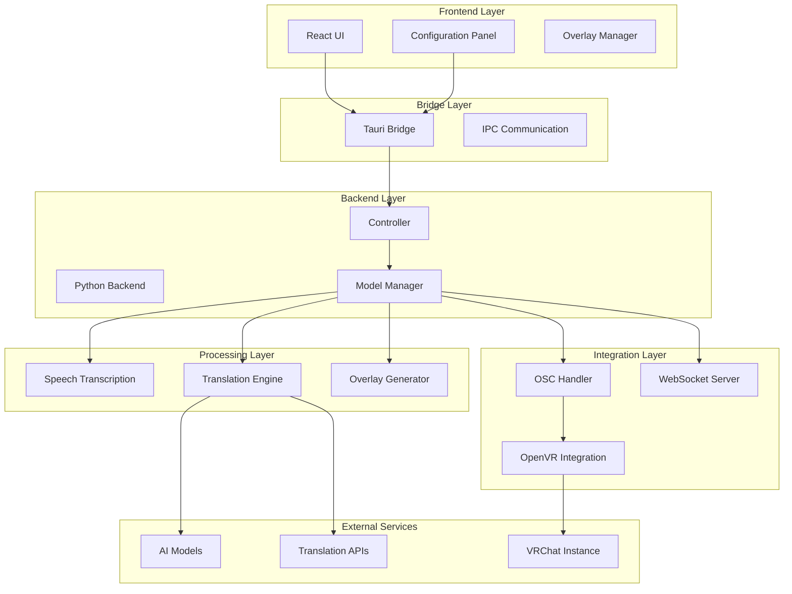

# Introduction

<cite>
**Referenced Files in This Document**
- [README.md](file://README.md)
- [package.json](file://package.json)
- [src-python/controller.py](file://src-python/controller.py)
- [src-python/model.py](file://src-python/model.py)
- [src-python/config.py](file://src-python/config.py)
- [src-tauri/src/main.rs](file://src-tauri/src/main.rs)
- [src-tauri/src/lib.rs](file://src-tauri/src/lib.rs)
- [src-ui/views/app/App.jsx](file://src-ui/views/app/App.jsx)
- [src-python/models/overlay/overlay.py](file://src-python/models/overlay/overlay.py)
- [src-python/models/osc/osc.py](file://src-python/models/osc/osc.py)
- [src-python/models/translation/translation_translator.py](file://src-python/models/translation/translation_translator.py)
- [src-python/docs/仕様書.md](file://src-python/docs/仕様書.md)
- [src-python/docs/规格说明_zh.md](file://src-python/docs/规格说明_zh.md)
- [src-python/docs/details/transcription_recorder.md](file://src-python/docs/details/transcription_recorder.md)
</cite>

## Table of Contents
1. [Project Overview](#project-overview)
2. [Purpose and Vision](#purpose-and-vision)
3. [Target Audience](#target-audience)
4. [Core Value Proposition](#core-value-proposition)
5. [System Architecture](#system-architecture)
6. [Key Features and Benefits](#key-features-and-benefits)
7. [Primary Use Cases](#primary-use-cases)
8. [Modular Design and Extensibility](#modular-design-and-extensibility)
9. [Technical Foundation](#technical-foundation)
10. [Getting Started](#getting-started)

## Project Overview

VRCT (VR Chat Translator) is a sophisticated real-time multilingual communication assistant designed specifically for VR environments, with primary focus on VRChat. The application serves as a comprehensive solution for overcoming language barriers in virtual reality spaces, enabling seamless cross-language communication through advanced speech transcription, translation, and overlay display technologies.

Built on a modern technology stack combining Tauri for desktop architecture with React for the user interface and Python for backend processing, VRCT delivers high-performance real-time translation capabilities while maintaining low-latency operation essential for immersive VR experiences.

**Section sources**
- [src-python/docs/仕様書.md](file://src-python/docs/仕様書.md#1-12)
- [src-python/docs/规格说明_zh.md](file://src-python/docs/规格说明_zh.md#1-39)

## Purpose and Vision

VRCT addresses the fundamental challenge of communication in global VR communities by providing real-time transcription and translation services. The application transforms spoken language into text, translates it across multiple languages, and displays the results through VR overlays, enabling users to understand conversations regardless of their native languages.

The vision behind VRCT is to create an inclusive virtual environment where language differences become irrelevant, fostering genuine connections and collaboration among international VR users. By leveraging cutting-edge AI technologies, VRCT aims to bridge cultural and linguistic divides in virtual social spaces.

**Section sources**
- [src-python/docs/仕様書.md](file://src-python/docs/仕様書.md#5-6)
- [src-python/docs/规格说明_zh.md](file://src-python/docs/规格说明_zh.md#5-6)

## Target Audience

VRCT targets multiple user segments within the VR ecosystem:

### Primary Users
- **VR Enthusiasts**: Individuals participating in VRChat and other virtual social platforms who want to communicate with international friends
- **Streamers and Content Creators**: Live streamers requiring real-time translation for diverse audiences
- **International Communities**: Users from different countries collaborating in VR environments

### Technical Users
- **VR Application Developers**: Developers integrating VRCT with custom VR applications through OSC and WebSocket protocols
- **Advanced Users**: Tech-savvy individuals configuring complex translation workflows and custom language setups

### Accessibility Beneficiaries
- **Non-native Speakers**: Users learning new languages through practical VR communication
- **Accessibility Seekers**: Individuals requiring assistive communication technologies in virtual environments

## Core Value Proposition

VRCT delivers unparalleled value through its comprehensive approach to VR communication:

### Real-Time Processing
- **Sub-second Latency**: Ultra-low latency processing ensures natural conversation flow
- **Continuous Operation**: Uninterrupted service during VR sessions
- **Adaptive Quality**: Dynamic quality adjustment based on system resources

### Multilingual Excellence
- **Cross-Language Support**: Seamless translation between hundreds of supported languages
- **Multiple Engines**: Integration with various translation providers for optimal results
- **Customizable Workflows**: Flexible configuration for different use cases

### Immersive Integration
- **VR Overlay System**: Native VRChat integration through OpenVR overlays
- **OSC Protocol Support**: Direct communication with VR applications
- **WebSocket Connectivity**: Real-time data streaming for external applications

## System Architecture

VRCT employs a sophisticated multi-layered architecture designed for reliability, performance, and extensibility:

**Diagram sources**
- [src-tauri/src/lib.rs](file://src-tauri/src/lib.rs#1-65)
- [src-python/controller.py](file://src-python/controller.py#1-100)
- [src-python/model.py](file://src-python/model.py#1-200)

### Architecture Components

#### Tauri Desktop Bridge
The Tauri framework provides a secure, lightweight desktop application foundation with Rust-based performance and React-based user interface flexibility. The bridge handles system-level operations, file system access, and inter-process communication.

#### React Frontend
A modern React-based user interface offering intuitive configuration panels, real-time status monitoring, and comprehensive settings management. The frontend communicates seamlessly with the Python backend through Tauri's IPC mechanisms.

#### Python Backend Engine
The core processing engine written in Python handles complex tasks including speech recognition, translation orchestration, overlay generation, and external service integration. This modular design enables easy extension and maintenance.

**Section sources**
- [src-tauri/src/lib.rs](file://src-tauri/src/lib.rs#1-65)
- [src-python/controller.py](file://src-python/controller.py#1-100)
- [src-python/model.py](file://src-python/model.py#1-200)

## Key Features and Benefits

### Speech Transcription Capabilities
- **Real-time Audio Processing**: Continuous audio capture from both microphone and speaker inputs
- **Multi-device Support**: Simultaneous processing from multiple audio devices
- **Energy Level Monitoring**: Intelligent noise detection and voice activity recognition
- **Automatic Threshold Adjustment**: Adaptive sensitivity based on environmental conditions

### Advanced Translation System
- **Multiple Translation Engines**: Support for DeepL, OpenAI, Gemini, Ollama, and local CTranslate2 models
- **Fallback Mechanisms**: Automatic switching between translation services for reliability
- **Batch Processing**: Concurrent translation of multiple target languages
- **Quality Optimization**: Engine selection based on content type and language pair

### VR Overlay Integration
- **OpenVR Compatibility**: Native integration with SteamVR and OpenVR systems
- **Customizable Display**: Configurable overlay positions, sizes, and transparency
- **Real-time Updates**: Dynamic content refresh without disrupting VR experience
- **Multi-target Support**: Simultaneous display for different user groups

### External Integration Options
- **OSC Protocol**: Direct communication with VR applications and game engines
- **WebSocket Server**: Real-time data streaming for external monitoring and control
- **REST API**: Programmatic access to core functionality
- **Plugin Architecture**: Extensible system for custom integrations

**Section sources**
- [src-python/docs/details/transcription_recorder.md](file://src-python/docs/details/transcription_recorder.md#1-100)
- [src-python/models/translation/translation_translator.py](file://src-python/models/translation/translation_translator.py#1-200)
- [src-python/models/overlay/overlay.py](file://src-python/models/overlay/overlay.py#1-200)

## Primary Use Cases

### Cross-Language Communication
VRCT enables natural conversations between users speaking different languages in VRChat and other virtual environments. The real-time translation allows for spontaneous interaction without interrupting the immersive experience.

### Live Streaming Support
Content creators can broadcast multilingual streams with automatic captioning and translation, reaching broader audiences while maintaining authenticity and immediacy.

### International Collaboration
Teams and communities from different countries can collaborate effectively in VR spaces, with translation ensuring clear communication regardless of language barriers.

### Accessibility Enhancement
Users with hearing impairments or language learning needs benefit from real-time text conversion and translation, making VR content more accessible.

### Educational Applications
Language learners can practice with native speakers in immersive environments, receiving instant translation feedback and pronunciation assistance.

## Modular Design and Extensibility

VRCT's architecture emphasizes modularity and extensibility, allowing for easy customization and enhancement:

### Translation Engine Flexibility
The translation system supports multiple backends through a unified interface, enabling users to choose optimal engines for specific language pairs or use cases. New translation services can be integrated through the plugin architecture.

### Plugin System
A comprehensive plugin system allows developers to extend VRCT's functionality with custom translation engines, overlay themes, or integration modules. The system supports dynamic loading and configuration of third-party extensions.

### Configuration Management
Flexible configuration system with JSON-based persistence, allowing users to customize every aspect of the application's behavior without code modification.

### API Integration
Well-defined APIs enable integration with external applications, monitoring systems, and custom VR environments through OSC, WebSocket, and REST protocols.

**Section sources**
- [src-python/models/translation/translation_translator.py](file://src-python/models/translation/translation_translator.py#1-200)
- [src-python/controller.py](file://src-python/controller.py#800-900)

## Technical Foundation

### AI and Machine Learning Integration
VRCT leverages state-of-the-art AI technologies including:
- **Whisper Speech Recognition**: High-accuracy speech-to-text conversion
- **CTranslate2**: Efficient neural machine translation models
- **Cloud Translation APIs**: Integration with leading translation services
- **Local Models**: Privacy-focused offline translation capabilities

### Performance Optimization
- **GPU Acceleration**: CUDA support for accelerated translation processing
- **Memory Management**: Efficient resource allocation and garbage collection
- **Background Processing**: Non-blocking operations for smooth UI performance
- **Adaptive Quality**: Dynamic quality adjustment based on system capabilities

### Security and Privacy
- **Local Processing**: Optional offline mode for sensitive communications
- **Data Minimization**: Minimal data retention and processing
- **Secure Communication**: Encrypted protocols for external integrations
- **User Control**: Comprehensive privacy settings and opt-out options

**Section sources**
- [src-python/config.py](file://src-python/config.py#1-200)
- [src-python/model.py](file://src-python/model.py#1-200)

## Getting Started

VRCT provides multiple pathways for users to begin utilizing its powerful translation capabilities:

### Quick Setup
1. **Installation**: Download and install the application from the official releases
2. **Initial Configuration**: Configure basic settings through the intuitive web interface
3. **Device Selection**: Choose audio input and output devices for optimal performance
4. **Language Setup**: Select source and target languages for translation

### Advanced Configuration
1. **Translation Engine Selection**: Choose preferred translation services and API keys
2. **Overlay Customization**: Configure VR overlay appearance and positioning
3. **Integration Setup**: Connect with external applications through OSC or WebSocket
4. **Performance Tuning**: Optimize settings for your hardware configuration

### Integration Options
- **VRChat Integration**: Enable automatic OSC communication with VRChat
- **Streaming Tools**: Connect with popular streaming software for real-time captions
- **Development APIs**: Integrate with custom applications through documented APIs
- **Monitoring Systems**: Set up WebSocket connections for real-time status monitoring

For detailed installation instructions, configuration guides, and advanced usage scenarios, refer to the comprehensive documentation available in the project repository.