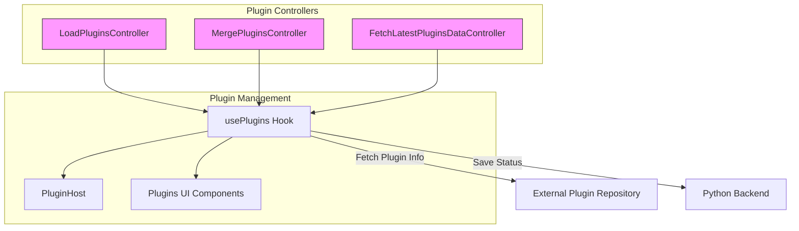
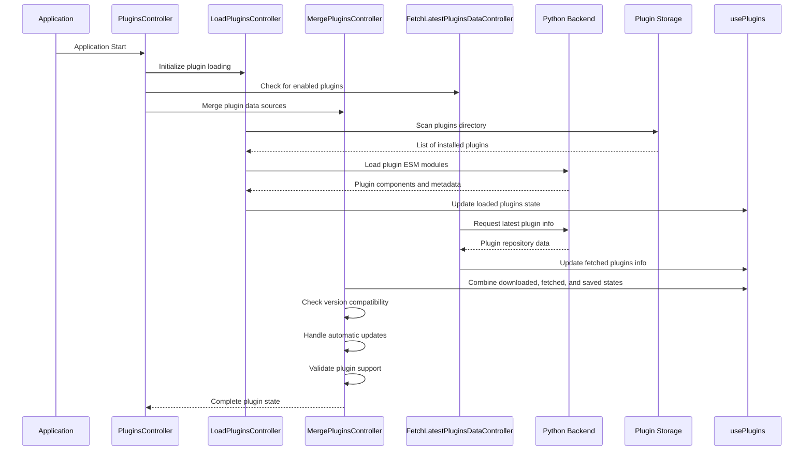
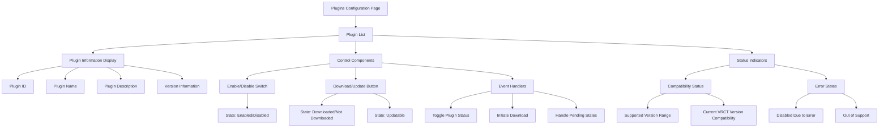
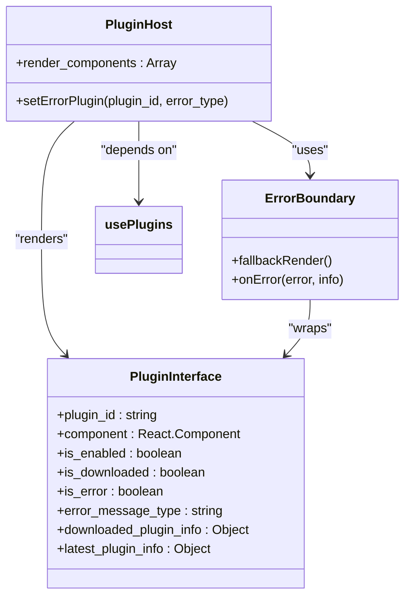
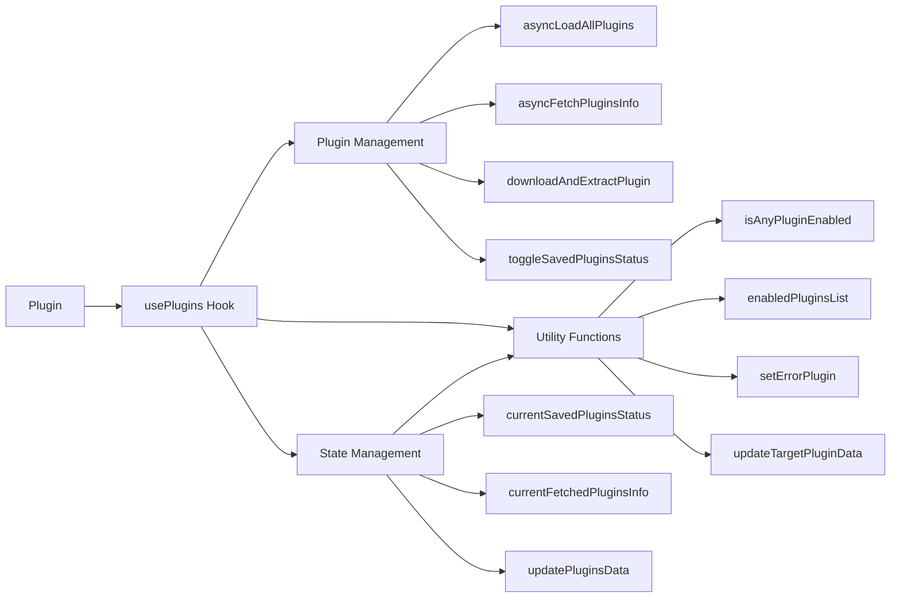
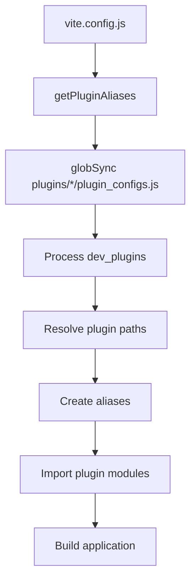
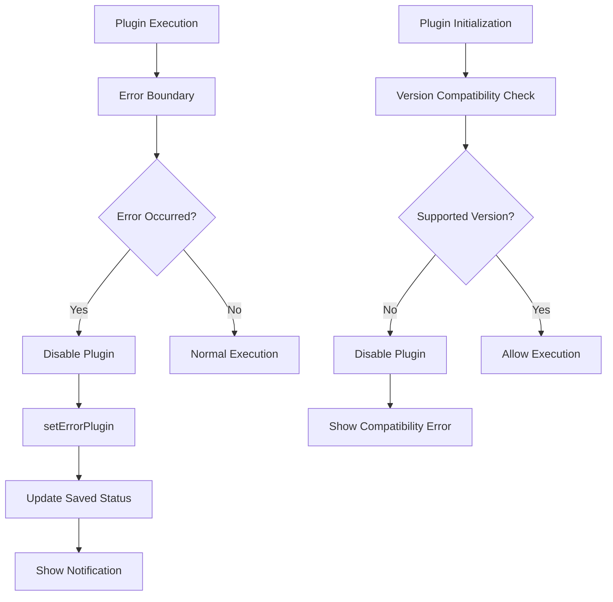

# Plugin System

<cite>
**Referenced Files in This Document**   
- [plugins_index.js](file://src-ui/plugins/plugins_index.js)
- [index.js](file://src-tauri/plugins/index.js)
- [LoadPluginsController.jsx](file://src-ui/views/app/_app_controllers/plugins_controllers/LoadPluginsController.jsx)
- [MergePluginsController.jsx](file://src-ui/views/app/_app_controllers/plugins_controllers/MergePluginsController.jsx)
- [FetchLatestPluginsDataController.jsx](file://src-ui/views/app/_app_controllers/plugins_controllers/FetchLatestPluginsDataController.jsx)
- [PluginsController.jsx](file://src-ui/views/app/_app_controllers/PluginsController.jsx)
- [usePlugins.js](file://src-ui/logics/configs/config_page_setter/plugins/usePlugins.js)
- [PluginHost.jsx](file://src-ui/views/app/main_page/main_section/PluginHost.jsx)
- [Plugins.jsx](file://src-ui/views/app/config_page/setting_section/setting_box/plugins/Plugins.jsx)
- [PluginsControlComponent.jsx](file://src-ui/views/app/config_page/setting_section/setting_box/plugins/plugins_control_component/PluginsControlComponent.jsx)
- [vite.config.js](file://vite.config.js)
</cite>

## Table of Contents
1. [Introduction](#introduction)
2. [Plugin Infrastructure Overview](#plugin-infrastructure-overview)
3. [Plugin Loading and Initialization](#plugin-loading-and-initialization)
4. [UI Integration and Configuration](#ui-integration-and-configuration)
5. [Extension Points](#extension-points)
6. [Plugin Development Guidelines](#plugin-development-guidelines)
7. [Security Considerations](#security-considerations)
8. [Future Roadmap](#future-roadmap)
9. [Conclusion](#conclusion)

## Introduction
The VRCT plugin system provides a flexible extensibility architecture that allows third-party developers to enhance the application's functionality. This document details the current implementation of the plugin infrastructure, focusing on the loading mechanism, UI integration, available extension points, and development guidelines for creating new plugins. The system is designed to support dynamic plugin management with version compatibility checking, automatic updates, and error handling.

## Plugin Infrastructure Overview

The VRCT plugin system is implemented through a combination of frontend and backend components that work together to manage plugin lifecycle, configuration, and integration. The architecture follows a controller-based pattern where specialized controllers handle different aspects of plugin management.



**Diagram sources**
- [LoadPluginsController.jsx](file://src-ui/views/app/_app_controllers/plugins_controllers/LoadPluginsController.jsx)
- [MergePluginsController.jsx](file://src-ui/views/app/_app_controllers/plugins_controllers/MergePluginsController.jsx)
- [FetchLatestPluginsDataController.jsx](file://src-ui/views/app/_app_controllers/plugins_controllers/FetchLatestPluginsDataController.jsx)
- [usePlugins.js](file://src-ui/logics/configs/config_page_setter/plugins/usePlugins.js)

**Section sources**
- [PluginsController.jsx](file://src-ui/views/app/_app_controllers/PluginsController.jsx)
- [usePlugins.js](file://src-ui/logics/configs/config_page_setter/plugins/usePlugins.js)

## Plugin Loading and Initialization

The plugin loading process is managed through a series of React controllers that handle different stages of plugin initialization. The system follows a three-phase approach: loading installed plugins, fetching latest plugin information, and merging these data sources to create a unified plugin state.



**Diagram sources**
- [LoadPluginsController.jsx](file://src-ui/views/app/_app_controllers/plugins_controllers/LoadPluginsController.jsx)
- [MergePluginsController.jsx](file://src-ui/views/app/_app_controllers/plugins_controllers/MergePluginsController.jsx)
- [FetchLatestPluginsDataController.jsx](file://src-ui/views/app/_app_controllers/plugins_controllers/FetchLatestPluginsDataController.jsx)
- [usePlugins.js](file://src-ui/logics/configs/config_page_setter/plugins/usePlugins.js)

**Section sources**
- [LoadPluginsController.jsx](file://src-ui/views/app/_app_controllers/plugins_controllers/LoadPluginsController.jsx#L1-L26)
- [MergePluginsController.jsx](file://src-ui/views/app/_app_controllers/plugins_controllers/MergePluginsController.jsx#L1-L205)
- [FetchLatestPluginsDataController.jsx](file://src-ui/views/app/_app_controllers/plugins_controllers/FetchLatestPluginsDataController.jsx#L1-L17)

## UI Integration and Configuration

Plugins are integrated into the VRCT UI through dedicated components that display plugin status, enable/disable controls, and update notifications. The configuration page provides a comprehensive interface for managing plugins, including installation, updates, and compatibility information.



**Diagram sources**
- [Plugins.jsx](file://src-ui/views/app/config_page/setting_section/setting_box/plugins/Plugins.jsx)
- [PluginsControlComponent.jsx](file://src-ui/views/app/config_page/setting_section/setting_box/plugins/plugins_control_component/PluginsControlComponent.jsx)
- [usePlugins.js](file://src-ui/logics/configs/config_page_setter/plugins/usePlugins.js)

**Section sources**
- [Plugins.jsx](file://src-ui/views/app/config_page/setting_section/setting_box/plugins/Plugins.jsx#L1-L128)
- [PluginsControlComponent.jsx](file://src-ui/views/app/config_page/setting_section/setting_box/plugins/plugins_control_component/PluginsControlComponent.jsx#L1-L38)

## Extension Points

The VRCT plugin system provides several extension points that allow plugins to modify the UI, add custom logic, and integrate with backend services. These extension points are designed to be flexible while maintaining application stability and security.

### UI Modifications
Plugins can extend the VRCT interface by providing React components that are rendered in designated areas of the application. The PluginHost component manages the rendering of enabled plugins in the main interface.



**Diagram sources**
- [PluginHost.jsx](file://src-ui/views/app/main_page/main_section/PluginHost.jsx)
- [usePlugins.js](file://src-ui/logics/configs/config_page_setter/plugins/usePlugins.js)

**Section sources**
- [PluginHost.jsx](file://src-ui/views/app/main_page/main_section/PluginHost.jsx#L1-L28)
- [usePlugins.js](file://src-ui/logics/configs/config_page_setter/plugins/usePlugins.js#L376-L378)

### Custom Logic Hooks
The plugin system exposes a comprehensive API through the usePlugins hook, which provides access to plugin management functions, state, and application context. This allows plugins to interact with the core application and other plugins.



**Diagram sources**
- [usePlugins.js](file://src-ui/logics/configs/config_page_setter/plugins/usePlugins.js)

**Section sources**
- [usePlugins.js](file://src-ui/logics/configs/config_page_setter/plugins/usePlugins.js#L407-L425)

## Plugin Development Guidelines

Developing plugins for VRCT requires adherence to specific file structure conventions, registration processes, and API access patterns. The following guidelines ensure compatibility and proper integration with the host application.

### File Structure
Plugins must follow a standardized directory structure within the plugins directory. Each plugin should have its own subdirectory containing the necessary files:

```
plugins/
└── plugin_name/
    ├── index.esm.js        # Main plugin module (ESM format)
    ├── plugin_info.json    # Plugin metadata and configuration
    ├── main.css            # Optional CSS styles
    └── plugin_configs.js   # Optional configuration for development
```

The build system uses vite.config.js to resolve plugin paths and aliases, with dev_plugins array allowing temporary development plugins to be included.



**Diagram sources**
- [vite.config.js](file://vite.config.js#L71-L135)
- [plugins_index.js](file://src-ui/plugins/plugins_index.js)

**Section sources**
- [vite.config.js](file://vite.config.js#L98-L135)
- [plugins_index.js](file://src-ui/plugins/plugins_index.js#L1-L3)

### Registration Process
Plugins are automatically discovered and registered through the plugin loading system. The registration process involves:

1. Scanning the plugins directory for installed plugins
2. Loading plugin metadata from plugin_info.json
3. Importing the plugin module (index.esm.js)
4. Registering the plugin component with the UI system
5. Merging plugin state with global application state

The usePlugins hook manages the registration process and provides access to registered plugins through the currentPluginsData state.

### API Access Patterns
Plugins can access the VRCT API through the plugin context provided during initialization. The context includes:

- Application configuration and settings
- Internationalization (i18n) functions
- Common and configuration logic hooks
- Standard libraries (React, clsx, react-i18next)

Plugins should use the provided context rather than importing these dependencies directly to ensure compatibility and proper integration.

## Security Considerations

The VRCT plugin system implements several security measures to protect the application and user data from potential risks associated with third-party plugins.

### Sandboxing Limitations
Currently, the plugin system has limited sandboxing capabilities. Plugins are loaded as part of the main application context, which means they have access to the same privileges as the core application. This design choice prioritizes integration flexibility over strict isolation.

The system mitigates risks through:
- Error boundaries that prevent plugin crashes from affecting the main application
- Automatic disabling of plugins that generate errors
- Version compatibility checking to prevent incompatible plugins from running
- Clear separation between plugin code and core application logic



**Diagram sources**
- [PluginHost.jsx](file://src-ui/views/app/main_page/main_section/PluginHost.jsx)
- [MergePluginsController.jsx](file://src-ui/views/app/_app_controllers/plugins_controllers/MergePluginsController.jsx)

**Section sources**
- [PluginHost.jsx](file://src-ui/views/app/main_page/main_section/PluginHost.jsx#L14-L21)
- [MergePluginsController.jsx](file://src-ui/views/app/_app_controllers/plugins_controllers/MergePluginsController.jsx#L174-L197)

## Future Roadmap

The VRCT plugin system is expected to evolve with enhanced capabilities and improved developer experience. Potential future developments include:

- **Enhanced Sandboxing**: Implementation of stricter isolation mechanisms to limit plugin access to application resources
- **Permission System**: Granular permission controls that allow users to grant specific capabilities to plugins
- **Plugin Marketplace**: Integrated interface for discovering, installing, and managing plugins from a central repository
- **API Versioning**: Formal API contracts with versioning to ensure backward compatibility
- **Performance Monitoring**: Tools to monitor plugin resource usage and impact on application performance
- **Debugging Support**: Enhanced developer tools for debugging and testing plugins

The development team is committed to maintaining backward compatibility for existing plugins while introducing new features and improvements to the extensibility architecture.

## Conclusion
The VRCT plugin system provides a robust foundation for extending the application's functionality through third-party plugins. The current implementation offers a comprehensive set of features for plugin management, UI integration, and lifecycle control. While the system prioritizes flexibility and ease of development, it also includes essential security measures to protect the application and users. As the plugin ecosystem grows, the architecture is designed to accommodate future enhancements while maintaining compatibility with existing plugins.