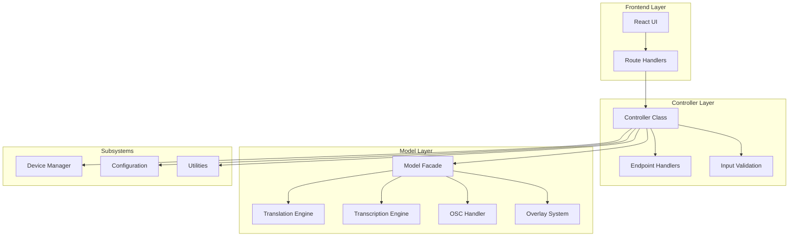
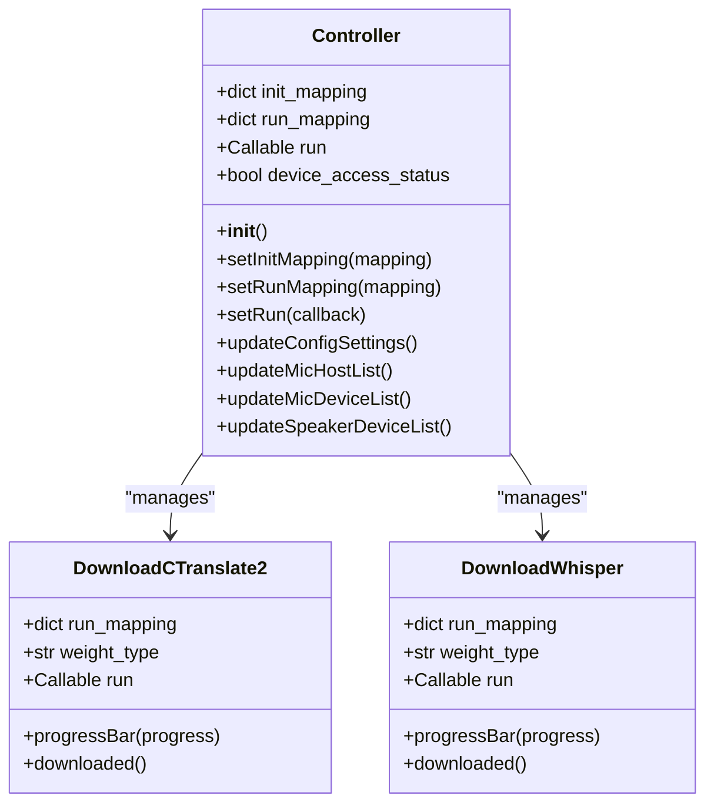
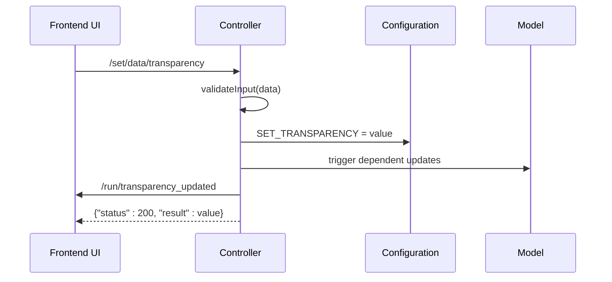
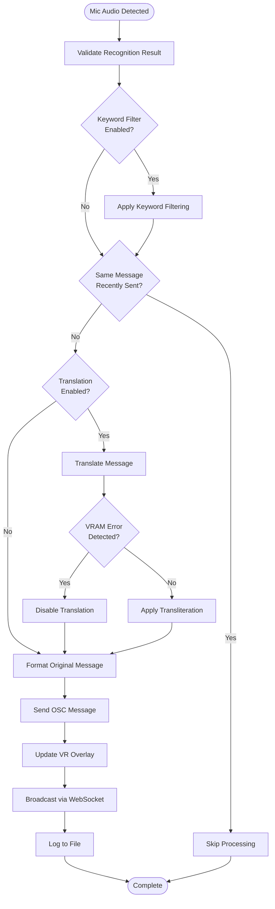
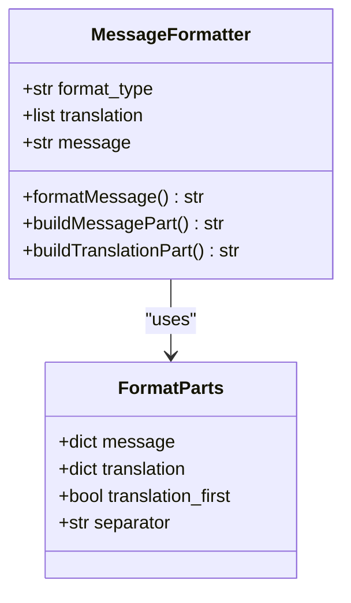
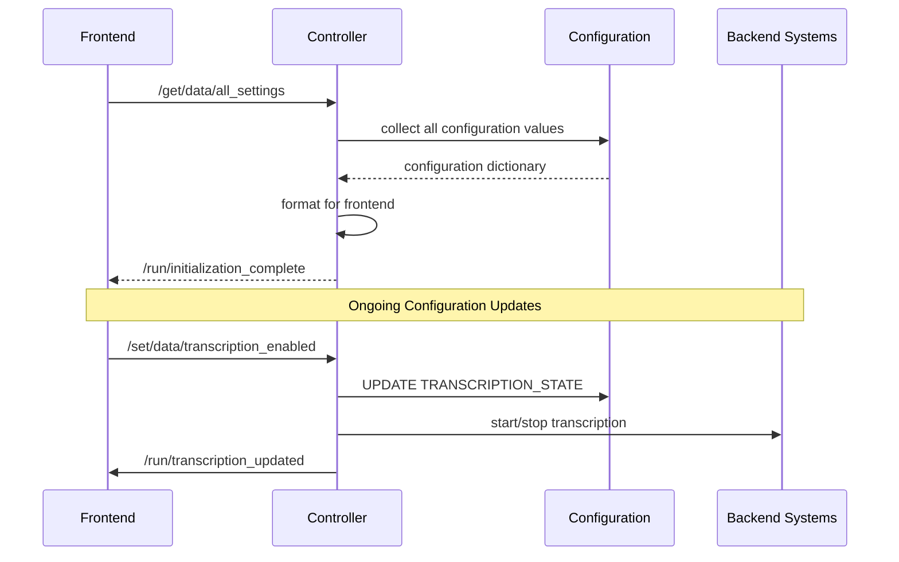
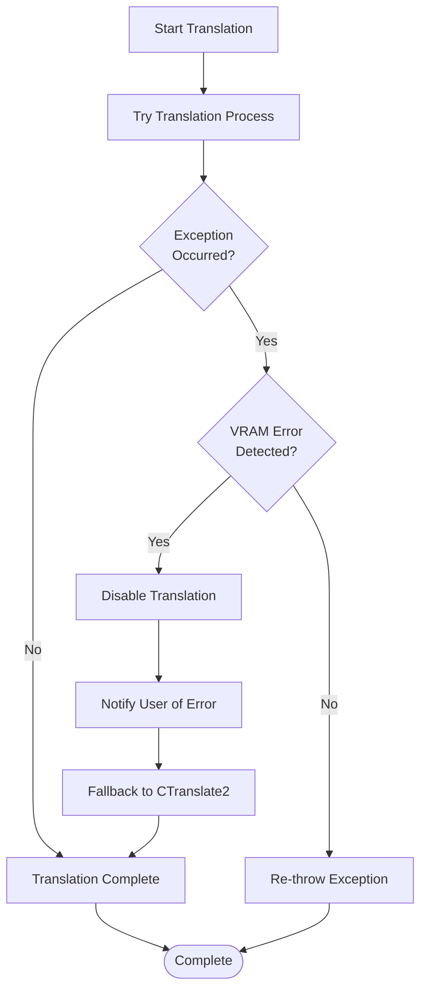
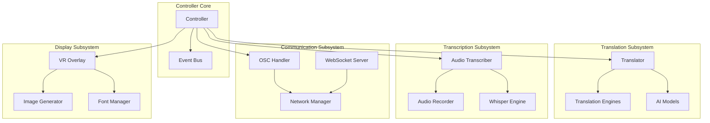
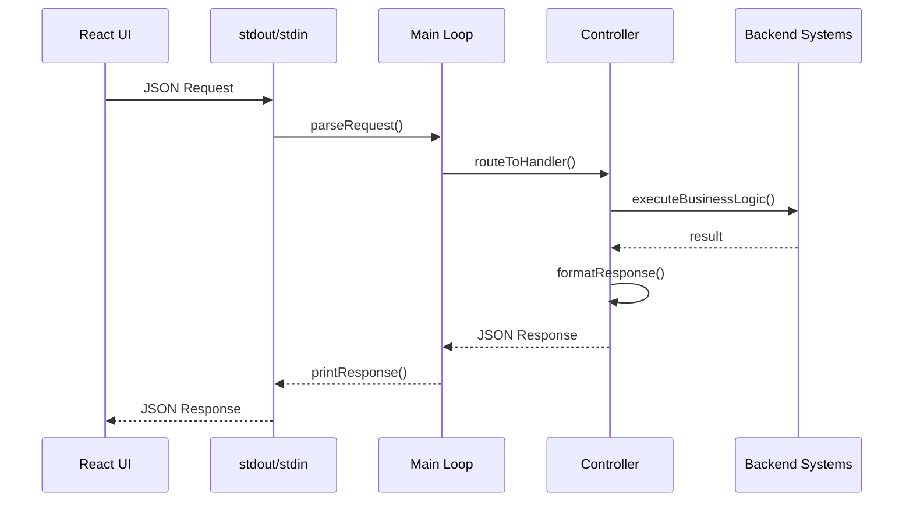
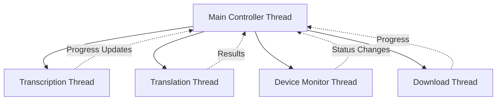

# Controller Logic

<cite>
**Referenced Files in This Document**
- [controller.py](file://src-python/controller.py)
- [mainloop.py](file://src-python/mainloop.py)
- [model.py](file://src-python/model.py)
- [config.py](file://src-python/config.py)
- [utils.py](file://src-python/utils.py)
- [useReceiveRoutes.js](file://src-ui/logics/useReceiveRoutes.js)
- [useStdoutToPython.js](file://src-ui/logics/common/useStdoutToPython.js)
- [controller.md](file://src-python/docs/controller.md)
- [controller_details.md](file://src-python/docs/details/controller.md)
- [test_endpoints.py](file://src-python/test_endpoints.py)
- [printResponse](file://src-python/utils.py#L481-L511)
</cite>

## Table of Contents
1. [Introduction](#introduction)
2. [Architecture Overview](#architecture-overview)
3. [Controller Class Structure](#controller-class-structure)
4. [Endpoint Management](#endpoint-management)
5. [Message Processing Pipeline](#message-processing-pipeline)
6. [Configuration Management](#configuration-management)
7. [Error Handling and Recovery](#error-handling-and-recovery)
8. [Integration with Subsystems](#integration-with-subsystems)
9. [Communication Protocol](#communication-protocol)
10. [Performance Considerations](#performance-considerations)
11. [Troubleshooting Guide](#troubleshooting-guide)
12. [Conclusion](#conclusion)

## Introduction

The Controller component serves as the central orchestrator in VRCT's architecture, acting as the intermediary between the React UI frontend and the Python backend model. It implements a sophisticated business logic layer that manages complex workflows involving translation, transcription, OSC communication, and overlay display systems. The Controller handles user interactions, executes business logic, coordinates between different subsystems, and maintains the overall state of the application.

This component is responsible for processing user actions, validating inputs, coordinating with AI models, managing device access, and ensuring seamless communication between all parts of the system. It operates as a facade pattern implementation, providing a unified interface to the frontend while delegating specific tasks to specialized subsystems.

## Architecture Overview

The Controller follows a layered architecture pattern with clear separation of concerns:



**Diagram sources**
- [controller.py](file://src-python/controller.py#L12-L49)
- [mainloop.py](file://src-python/mainloop.py#L78-L83)

The Controller operates within a JSON-RPC communication framework where the frontend sends structured requests and receives formatted responses. This architecture enables loose coupling between components while maintaining clear data flow and error propagation mechanisms.

**Section sources**
- [controller.py](file://src-python/controller.py#L12-L49)
- [mainloop.py](file://src-python/mainloop.py#L78-L83)

## Controller Class Structure

The Controller class implements a comprehensive business logic layer with several key components:

### Core Initialization



**Diagram sources**
- [controller.py](file://src-python/controller.py#L12-L49)
- [controller.py](file://src-python/controller.py#L188-L220)

### Key Attributes and Methods

The Controller maintains several critical attributes for system coordination:

- **init_mapping**: Dictionary mapping initialization endpoints to their handlers
- **run_mapping**: Dictionary mapping notification endpoints to frontend destinations  
- **run**: Callback function for sending notifications to the frontend
- **device_access_status**: Boolean flag controlling exclusive device access

The class provides specialized methods for different functional areas including device management, translation control, transcription handling, and configuration synchronization.

**Section sources**
- [controller.py](file://src-python/controller.py#L12-L49)

## Endpoint Management

The Controller manages two primary types of endpoints: GET/SET operations for configuration and RUN operations for real-time notifications.

### Configuration Endpoints (/set/, /get/)

Configuration endpoints handle CRUD operations for system settings:



**Diagram sources**
- [mainloop.py](file://src-python/mainloop.py#L85-L130)
- [controller.py](file://src-python/controller.py#L1025-L1028)

### Real-time Notification Endpoints (/run/)

Real-time endpoints provide live updates about system state changes:

| Endpoint Category | Purpose | Example Endpoints |
|-------------------|---------|-------------------|
| Device Status | Hardware detection | `/run/connected_network`, `/run/error_device` |
| Progress Tracking | Download completion | `/run/download_progress_ctranslate2_weight` |
| Feature State | Capability availability | `/run/enable_ai_models`, `/run/enable_translation` |
| System Events | State changes | `/run/initialization_complete`, `/run/feed_watchdog` |

**Section sources**
- [mainloop.py](file://src-python/mainloop.py#L13-L76)
- [controller.py](file://src-python/controller.py#L50-L110)

## Message Processing Pipeline

The Controller implements a sophisticated message processing pipeline that handles audio recognition results and transforms them into actionable data.

### Mic Message Processing



**Diagram sources**
- [controller.py](file://src-python/controller.py#L254-L410)

### Message Formatting System

The Controller implements a flexible message formatting system that allows users to customize how translated messages appear:



**Diagram sources**
- [controller.py](file://src-python/controller.py#L763-L795)

**Section sources**
- [controller.py](file://src-python/controller.py#L254-L410)
- [controller.py](file://src-python/controller.py#L763-L795)

## Configuration Management

The Controller provides comprehensive configuration management with automatic synchronization between frontend and backend states.

### Configuration Synchronization Flow



**Diagram sources**
- [controller.py](file://src-python/controller.py#L100-L110)
- [mainloop.py](file://src-python/mainloop.py#L85-L130)

### Configuration Categories

The Controller manages configurations across several domains:

| Category | Endpoints | Description |
|----------|-----------|-------------|
| Appearance | `/get/data/transparency`, `/get/data/font_family` | UI appearance settings |
| Translation | `/get/data/selected_translation_engines` | Translation engine selection |
| Transcription | `/get/data/mic_threshold`, `/get/data/speaker_device` | Audio processing settings |
| Overlay | `/get/data/overlay_large_log_settings` | VR overlay configuration |
| Network | `/get/data/osc_ip_address`, `/get/data/websocket_host` | Communication settings |

**Section sources**
- [controller.py](file://src-python/controller.py#L1025-L1200)
- [mainloop.py](file://src-python/mainloop.py#L135-L353)

## Error Handling and Recovery

The Controller implements comprehensive error handling with automatic recovery mechanisms and user-friendly error reporting.

### VRAM Error Detection and Recovery



**Diagram sources**
- [controller.py](file://src-python/controller.py#L296-L318)

### Error Response Patterns

The Controller follows consistent error response patterns:

```python
# Standard error response format
{
    "status": 400,
    "result": {
        "message": "Descriptive error message",
        "data": error_context
    }
}
```

Common error scenarios include:
- **Device Access Conflicts**: Exclusive device locking during configuration changes
- **Memory Constraints**: VRAM overflow detection with automatic fallback
- **Network Issues**: OSC connection failures with retry mechanisms
- **Validation Errors**: Input parameter validation with helpful error messages

**Section sources**
- [controller.py](file://src-python/controller.py#L296-L318)
- [_useBackendErrorHandling.js](file://src-ui/logics/_useBackendErrorHandling.js#L189-L234)

## Integration with Subsystems

The Controller serves as the central coordinator for all VRCT subsystems, ensuring proper orchestration and state management.

### Subsystem Integration Architecture



**Diagram sources**
- [controller.py](file://src-python/controller.py#L1-L10)
- [model.py](file://src-python/model.py#L81-L142)

### Cross-Subsystem Coordination

The Controller manages complex interactions between subsystems:

- **Translation and Transcription**: Coordinating audio processing and language conversion
- **Device Management**: Synchronizing microphone/speaker access across systems
- **State Synchronization**: Maintaining consistent state across all components
- **Resource Allocation**: Managing GPU memory and CPU resources efficiently

**Section sources**
- [controller.py](file://src-python/controller.py#L1-L10)
- [model.py](file://src-python/model.py#L81-L142)

## Communication Protocol

The Controller implements a JSON-RPC based communication protocol that enables bidirectional communication between frontend and backend.

### Request-Response Flow



**Diagram sources**
- [useStdoutToPython.js](file://src-ui/logics/common/useStdoutToPython.js#L1-L21)
- [useReceiveRoutes.js](file://src-ui/logics/useReceiveRoutes.js#L146-L191)

### Response Formatting

The Controller uses a standardized response format:

```python
# Success response
{
    "status": 200,
    "endpoint": "/get/data/transparency",
    "result": 0.75
}

# Error response  
{
    "status": 400,
    "endpoint": "/set/data/osc_ip_address",
    "result": {
        "message": "Invalid IP address format",
        "data": "invalid-address"
    }
}
```

**Section sources**
- [useStdoutToPython.js](file://src-ui/logics/common/useStdoutToPython.js#L1-L21)
- [useReceiveRoutes.js](file://src-ui/logics/useReceiveRoutes.js#L146-L191)
- [printResponse](file://src-python/utils.py#L481-L511)

## Performance Considerations

The Controller implements several performance optimization strategies to ensure responsive operation under various conditions.

### Asynchronous Processing

Critical operations are executed asynchronously to maintain UI responsiveness:

- **Model Downloads**: Background downloading with progress callbacks
- **Translation Processing**: Non-blocking translation with fallback mechanisms
- **Device Monitoring**: Separate threads for device status checking
- **Network Operations**: Async communication with external services

### Memory Management

The Controller implements careful memory management:

- **VRAM Monitoring**: Automatic detection and recovery from memory overflow
- **Model Caching**: Intelligent caching of frequently used AI models
- **Resource Cleanup**: Proper cleanup of temporary resources and connections

### Threading Strategy



**Diagram sources**
- [controller.py](file://src-python/controller.py#L1-L10)

## Troubleshooting Guide

### Common Issues and Solutions

#### Translation Failures

**Symptoms**: Translation requests return empty results or errors
**Causes**: 
- VRAM overflow during translation
- Network connectivity issues
- Invalid API credentials

**Solutions**:
1. Check VRAM usage and reduce model size
2. Verify network connectivity
3. Validate API keys in configuration

#### Device Access Conflicts

**Symptoms**: Microphone/speaker devices become unresponsive
**Causes**:
- Multiple applications accessing devices simultaneously
- Device driver issues
- Permission problems

**Solutions**:
1. Restart device monitoring
2. Check device permissions
3. Update device drivers

#### OSC Communication Failures

**Symptoms**: Messages not appearing in VRChat
**Causes**:
- Incorrect IP address or port
- Firewall blocking connections
- VRChat not running

**Solutions**:
1. Verify OSC settings
2. Check firewall configuration
3. Ensure VRChat is running

**Section sources**
- [controller.py](file://src-python/controller.py#L296-L318)
- [_useBackendErrorHandling.js](file://src-ui/logics/_useBackendErrorHandling.js#L189-L234)

## Conclusion

The Controller component represents the heart of VRCT's architecture, providing sophisticated orchestration capabilities that enable seamless integration between diverse subsystems. Its design emphasizes reliability, performance, and user experience through comprehensive error handling, asynchronous processing, and intelligent resource management.

The Controller's role as a business logic layer ensures that complex workflows involving translation, transcription, and VR communication operate smoothly while maintaining clear separation of concerns. Its standardized communication protocol and comprehensive configuration management make it adaptable to various use cases while providing consistent behavior across different deployment scenarios.

Through its integration with device management, AI model coordination, and real-time notification systems, the Controller enables VRCT to deliver a robust and responsive virtual communication experience that adapts to changing system conditions and user requirements.