# Model Architecture

<cite>
**Referenced Files in This Document**
- [model.py](file://src-python/model.py)
- [config.py](file://src-python/config.py)
- [__init__.py](file://src-python/models/__init__.py)
- [translation_translator.py](file://src-python/models/translation/translation_translator.py)
- [transcription_transcriber.py](file://src-python/models/transcription/transcription_transcriber.py)
- [overlay.py](file://src-python/models/overlay/overlay.py)
- [watchdog.py](file://src-python/models/watchdog/watchdog.py)
- [websocket_server.py](file://src-python/models/websocket/websocket_server.py)
- [osc.py](file://src-python/models/osc/osc.py)
- [model.md](file://src-python/docs/details/model.md)
- [model_zh.md](file://src-python/docs/details/model_zh.md)
</cite>

## Table of Contents
1. [Introduction](#introduction)
2. [Architecture Overview](#architecture-overview)
3. [Singleton Pattern Implementation](#singleton-pattern-implementation)
4. [Lazy Initialization Strategy](#lazy-initialization-strategy)
5. [Core Components](#core-components)
6. [Thread Management System](#thread-management-system)
7. [Resource Management](#resource-management)
8. [Error Handling and Fallback Mechanisms](#error-handling-and-fallback-mechanisms)
9. [Integration with Configuration System](#integration-with-configuration-system)
10. [Scalability and Performance Considerations](#scalability-and-performance-considerations)
11. [Fault Tolerance Design](#fault-tolerance-design)
12. [Conclusion](#conclusion)

## Introduction

The VRCT Model component serves as the central orchestrator and facade for the entire VR communication translation system. Acting as a singleton pattern implementation, it provides controlled access to core functionalities including translation, transcription, overlay rendering, OSC communication, and WebSocket services. The architecture emphasizes lazy initialization to optimize startup performance while maintaining robust resource management and graceful degradation capabilities.

The Model acts as a unified interface that abstracts the complexity of managing multiple AI models, VR systems, and network protocols, providing a clean abstraction layer for the UI and other system components.

## Architecture Overview

The Model follows a facade pattern combined with singleton architecture, providing centralized control over all VRCT subsystems. The design emphasizes modularity, lazy initialization, and fault tolerance.

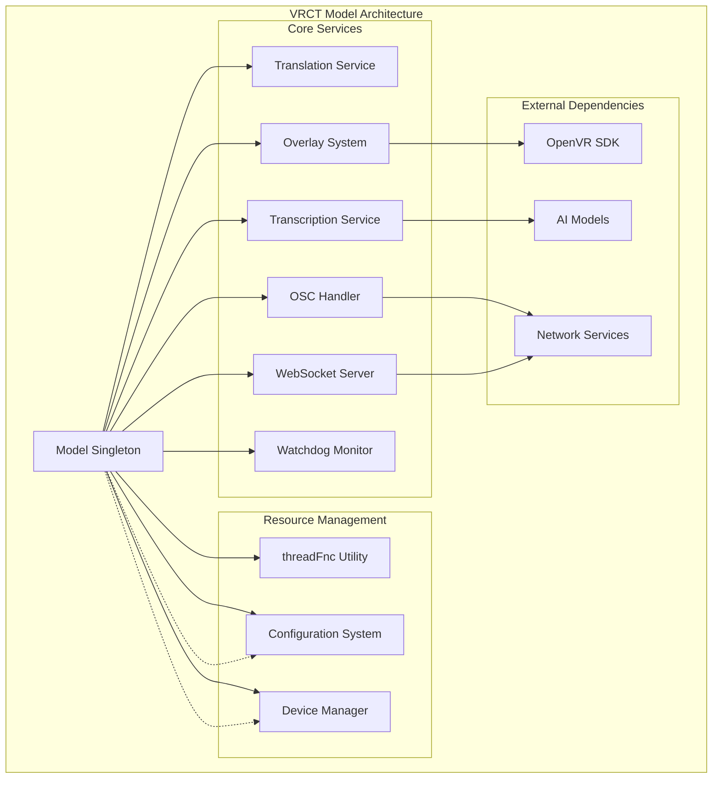
```mermaid
graph TB
subgraph "VRCT Model Architecture"
Model[Model Singleton]
subgraph "Core Services"
Translator[Translation Service]
Transcriber[Transcription Service]
Overlay[Overlay System]
OSC[OSC Handler]
WebSocket[WebSocket Server]
Watchdog[Watchdog Monitor]
end
subgraph "Resource Management"
ThreadFnc[threadFnc Utility]
Config[Configuration System]
DeviceMgr[Device Manager]
end
subgraph "External Dependencies"
OpenVR[OpenVR SDK]
AIModels[AI Models]
Network[Network Services]
end
end
Model --> Translator
Model --> Transcriber
Model --> Overlay
Model --> OSC
Model --> WebSocket
Model --> Watchdog
Model --> ThreadFnc
Model --> Config
Model --> DeviceMgr
Overlay --> OpenVR
Transcriber --> AIModels
OSC --> Network
WebSocket --> Network
Model -.-> Config
Model -.-> DeviceMgr
```

**Diagram sources**
- [model.py](file://src-python/model.py#L81-L1204)
- [config.py](file://src-python/config.py#L531-L1027)

## Singleton Pattern Implementation

The Model implements a sophisticated singleton pattern that ensures only one instance exists throughout the application lifecycle while maintaining lazy initialization capabilities.

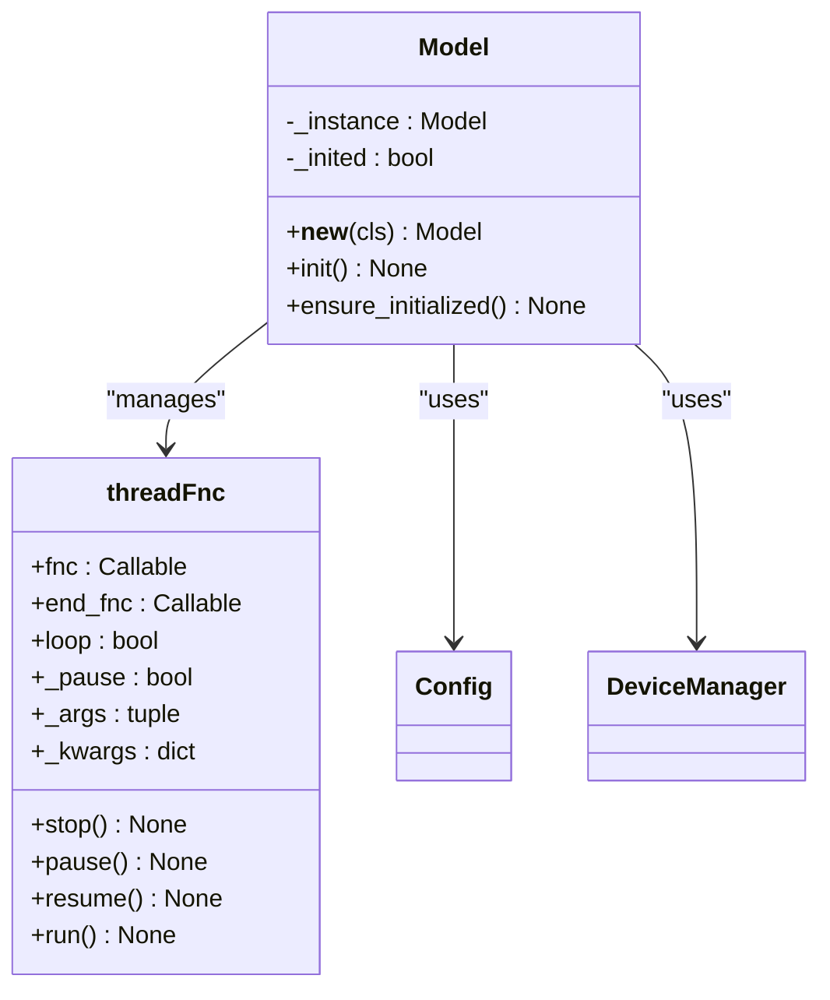
```mermaid
classDiagram
class Model {
-_instance : Model
-_inited : bool
+__new__(cls) Model
+init() None
+ensure_initialized() None
}
class threadFnc {
+fnc : Callable
+end_fnc : Callable
+loop : bool
+_pause : bool
+_args : tuple
+_kwargs : dict
+stop() None
+pause() None
+resume() None
+run() None
}
Model --> threadFnc : "manages"
Model --> Config : "uses"
Model --> DeviceManager : "uses"
```

**Diagram sources**
- [model.py](file://src-python/model.py#L81-L1204)

The singleton implementation provides several key benefits:
- **Memory Efficiency**: Only one instance exists, preventing resource duplication
- **Global Access**: Centralized access point for all system functionality
- **Lazy Initialization**: Heavy resources loaded on-demand
- **Thread Safety**: Controlled instantiation prevents race conditions

**Section sources**
- [model.py](file://src-python/model.py#L81-L1204)

## Lazy Initialization Strategy

The Model employs a sophisticated lazy initialization pattern that defers expensive resource allocation until explicitly required, optimizing startup performance and memory usage.

### Initialization Phases

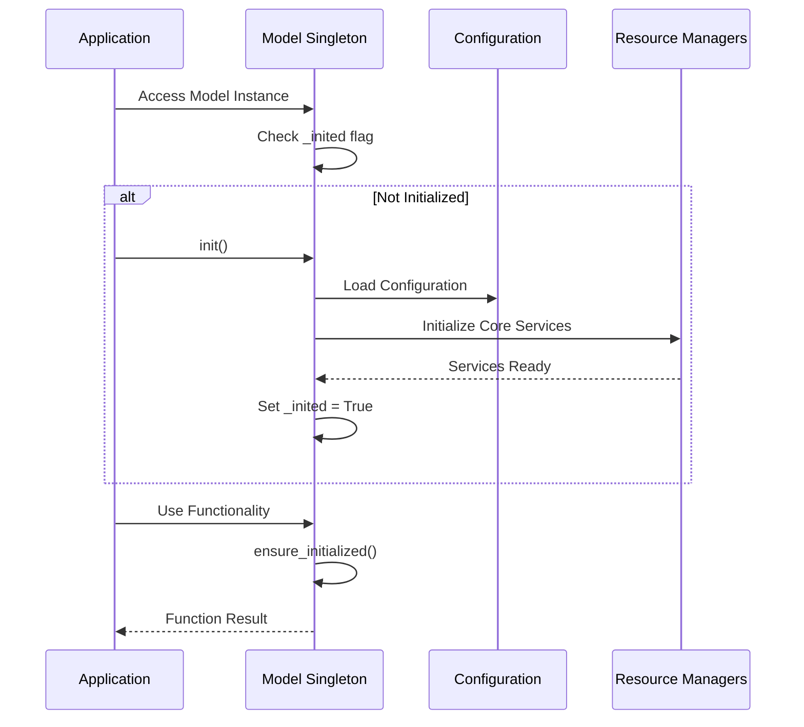
```mermaid
sequenceDiagram
participant App as Application
participant Model as Model Singleton
participant Config as Configuration
participant Resources as Resource Managers
App->>Model : Access Model Instance
Model->>Model : Check _inited flag
alt Not Initialized
App->>Model : init()
Model->>Config : Load Configuration
Model->>Resources : Initialize Core Services
Resources-->>Model : Services Ready
Model->>Model : Set _inited = True
end
App->>Model : Use Functionality
Model->>Model : ensure_initialized()
Model-->>App : Function Result
```

**Diagram sources**
- [model.py](file://src-python/model.py#L93-L153)

### Key Initialization Methods

The Model provides three primary initialization approaches:

1. **Explicit Initialization**: [`init()`](file://src-python/model.py#L93-L153) - Full resource construction
2. **Automatic Initialization**: [`ensure_initialized()`](file://src-python/model.py#L143-L153) - Lazy on-demand
3. **Constructor Control**: [`__new__()`](file://src-python/model.py#L84-L91) - Singleton enforcement

**Section sources**
- [model.py](file://src-python/model.py#L84-L153)

## Core Components

The Model orchestrates five primary subsystems, each responsible for specific VRCT functionality:

### Translation Engine

The translation service provides multilingual text conversion using multiple AI backends:

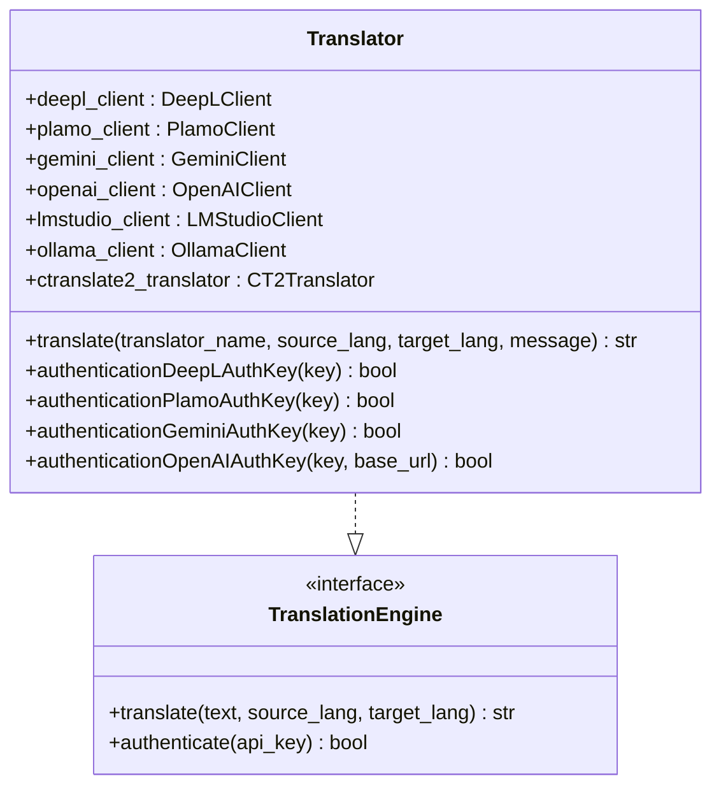
```mermaid
classDiagram
class Translator {
+deepl_client : DeepLClient
+plamo_client : PlamoClient
+gemini_client : GeminiClient
+openai_client : OpenAIClient
+lmstudio_client : LMStudioClient
+ollama_client : OllamaClient
+ctranslate2_translator : CT2Translator
+translate(translator_name, source_lang, target_lang, message) str
+authenticationDeepLAuthKey(key) bool
+authenticationPlamoAuthKey(key) bool
+authenticationGeminiAuthKey(key) bool
+authenticationOpenAIAuthKey(key, base_url) bool
}
class TranslationEngine {
<<interface>>
+translate(text, source_lang, target_lang) str
+authenticate(api_key) bool
}
Translator ..|> TranslationEngine
```

**Diagram sources**
- [translation_translator.py](file://src-python/models/translation/translation_translator.py#L39-L455)

### Transcription System

The transcription service converts audio to text using either cloud APIs or local AI models:

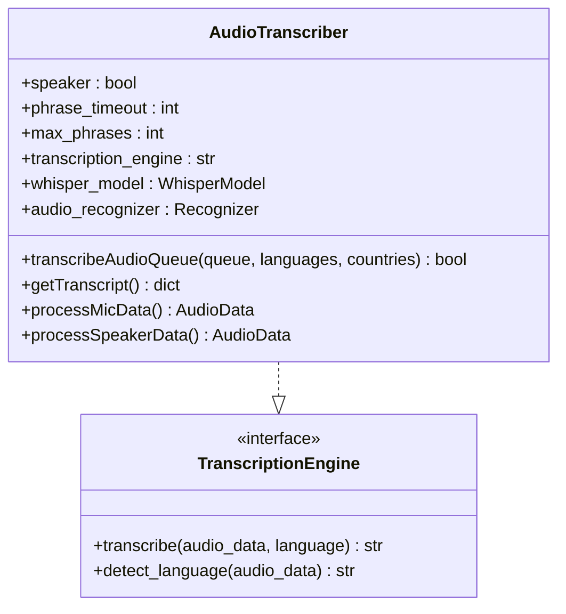
```mermaid
classDiagram
class AudioTranscriber {
+speaker : bool
+phrase_timeout : int
+max_phrases : int
+transcription_engine : str
+whisper_model : WhisperModel
+audio_recognizer : Recognizer
+transcribeAudioQueue(queue, languages, countries) bool
+getTranscript() dict
+processMicData() AudioData
+processSpeakerData() AudioData
}
class TranscriptionEngine {
<<interface>>
+transcribe(audio_data, language) str
+detect_language(audio_data) str
}
AudioTranscriber ..|> TranscriptionEngine
```

**Diagram sources**
- [transcription_transcriber.py](file://src-python/models/transcription/transcription_transcriber.py#L31-L220)

### Overlay Rendering System

The overlay system manages VR display content using OpenVR integration:

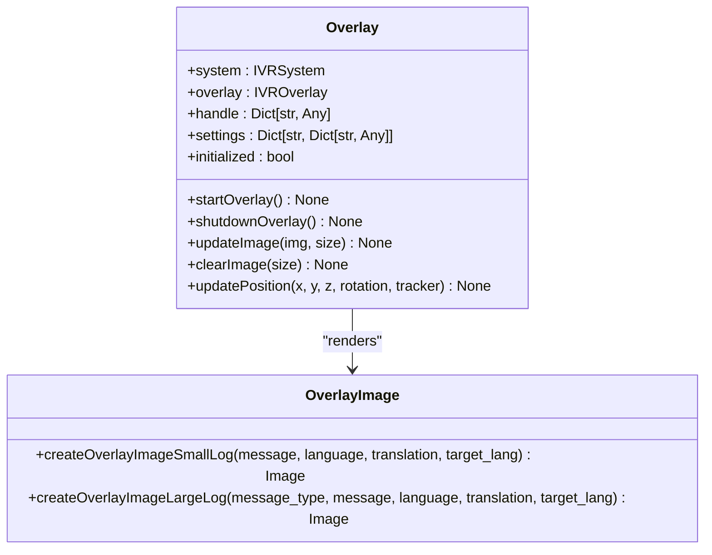
```mermaid
classDiagram
class Overlay {
+system : IVRSystem
+overlay : IVROverlay
+handle : Dict[str, Any]
+settings : Dict[str, Dict[str, Any]]
+initialized : bool
+startOverlay() None
+shutdownOverlay() None
+updateImage(img, size) None
+clearImage(size) None
+updatePosition(x, y, z, rotation, tracker) None
}
class OverlayImage {
+createOverlayImageSmallLog(message, language, translation, target_lang) Image
+createOverlayImageLargeLog(message_type, message, language, translation, target_lang) Image
}
Overlay --> OverlayImage : "renders"
```

**Diagram sources**
- [overlay.py](file://src-python/models/overlay/overlay.py#L85-L388)

### OSC Communication Handler

The OSC handler manages real-time communication with VR applications:

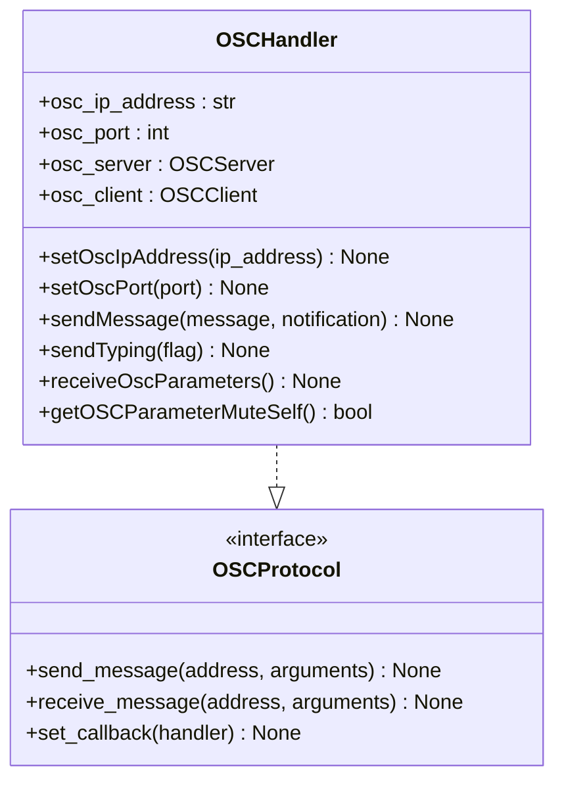
```mermaid
classDiagram
class OSCHandler {
+osc_ip_address : str
+osc_port : int
+osc_server : OSCServer
+osc_client : OSCClient
+setOscIpAddress(ip_address) None
+setOscPort(port) None
+sendMessage(message, notification) None
+sendTyping(flag) None
+receiveOscParameters() None
+getOSCParameterMuteSelf() bool
}
class OSCProtocol {
<<interface>>
+send_message(address, arguments) None
+receive_message(address, arguments) None
+set_callback(handler) None
}
OSCHandler ..|> OSCProtocol
```

### WebSocket Server

The WebSocket server enables real-time communication with external clients:

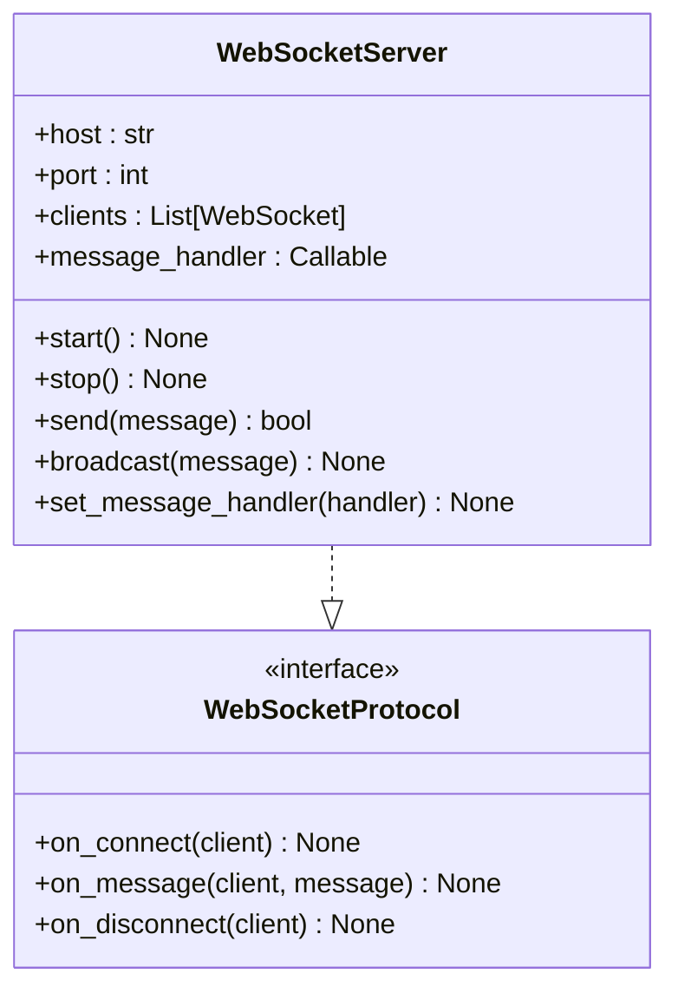
```mermaid
classDiagram
class WebSocketServer {
+host : str
+port : int
+clients : List[WebSocket]
+message_handler : Callable
+start() None
+stop() None
+send(message) bool
+broadcast(message) None
+set_message_handler(handler) None
}
class WebSocketProtocol {
<<interface>>
+on_connect(client) None
+on_message(client, message) None
+on_disconnect(client) None
}
WebSocketServer ..|> WebSocketProtocol
```

**Section sources**
- [model.py](file://src-python/model.py#L118-L1204)
- [translation_translator.py](file://src-python/models/translation/translation_translator.py#L39-L455)
- [transcription_transcriber.py](file://src-python/models/transcription/transcription_transcriber.py#L31-L220)
- [overlay.py](file://src-python/models/overlay/overlay.py#L85-L388)

## Thread Management System

The Model utilizes a specialized thread management utility called `threadFnc` that provides sophisticated control over background tasks with pause/resume capabilities.

### threadFnc Architecture

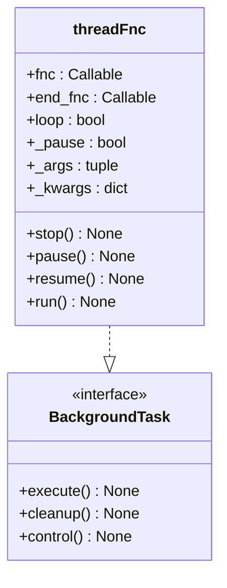
```mermaid
classDiagram
class threadFnc {
+fnc : Callable
+end_fnc : Callable
+loop : bool
+_pause : bool
+_args : tuple
+_kwargs : dict
+stop() None
+pause() None
+resume() None
+run() None
}
class BackgroundTask {
<<interface>>
+execute() None
+cleanup() None
+control() None
}
threadFnc ..|> BackgroundTask
```

**Diagram sources**
- [model.py](file://src-python/model.py#L37-L79)

### Thread Lifecycle Management

The thread management system provides comprehensive lifecycle control:

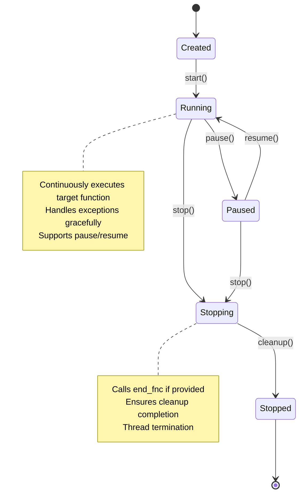
```mermaid
stateDiagram-v2
[*] --> Created
Created --> Running : start()
Running --> Paused : pause()
Paused --> Running : resume()
Running --> Stopping : stop()
Paused --> Stopping : stop()
Stopping --> Stopped : cleanup()
Stopped --> [*]
note right of Running
Continuously executes target function
Handles exceptions gracefully
Supports pause/resume
end note
note right of Stopping
Calls end_fnc if provided
Ensures cleanup completion
Thread termination
end note
```

**Diagram sources**
- [model.py](file://src-python/model.py#L37-L79)

### Usage Patterns

The Model employs `threadFnc` for various background operations:

- **Transcription Processing**: Continuous audio transcription with pause/resume
- **Overlay Updates**: Real-time VR overlay rendering updates
- **Watchdog Monitoring**: System health monitoring with automatic restart
- **Energy Monitoring**: Microphone and speaker energy level tracking

**Section sources**
- [model.py](file://src-python/model.py#L37-L79)

## Resource Management

The Model implements comprehensive resource management strategies to handle expensive operations efficiently while maintaining system stability.

### GPU Resource Management

The system includes sophisticated GPU memory management with VRAM error detection:

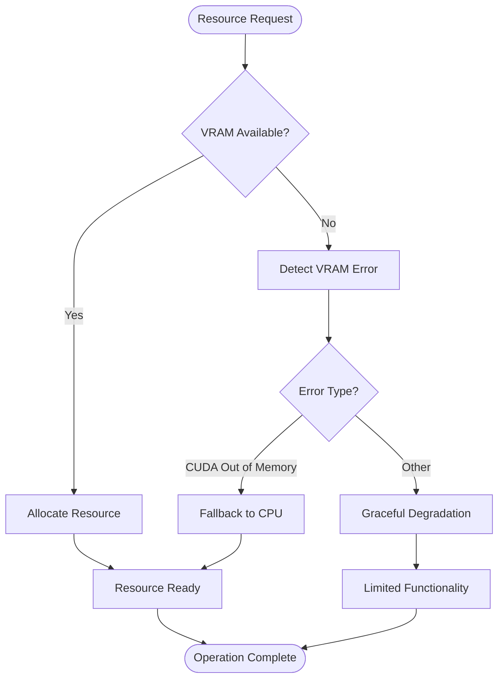
```mermaid
flowchart TD
Start([Resource Request]) --> CheckVRAM{VRAM Available?}
CheckVRAM --> |Yes| AllocateResource[Allocate Resource]
CheckVRAM --> |No| DetectError[Detect VRAM Error]
DetectError --> ErrorType{Error Type?}
ErrorType --> |CUDA Out of Memory| FallbackCPU[Fallback to CPU]
ErrorType --> |Other| GracefulDegradation[Graceful Degradation]
AllocateResource --> Success[Resource Ready]
FallbackCPU --> Success
GracefulDegradation --> ReducedFunctionality[Limited Functionality]
Success --> End([Operation Complete])
ReducedFunctionality --> End
```

**Diagram sources**
- [model.py](file://src-python/model.py#L731-L738)

### Memory Optimization Strategies

The Model employs several memory optimization techniques:

1. **Lazy Loading**: Resources loaded only when needed
2. **Garbage Collection**: Explicit GC calls for large objects
3. **Resource Pooling**: Reuse of expensive objects
4. **Memory Monitoring**: Automatic detection of memory pressure

**Section sources**
- [model.py](file://src-python/model.py#L731-L738)

## Error Handling and Fallback Mechanisms

The Model implements comprehensive error handling with graceful degradation capabilities to ensure system reliability.

### Error Detection and Recovery

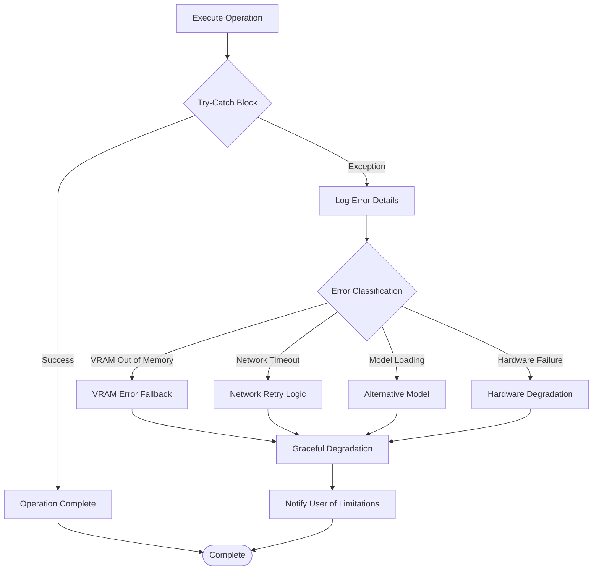
```mermaid
flowchart TD
Operation[Execute Operation] --> TryCatch{Try-Catch Block}
TryCatch --> |Success| Success[Operation Complete]
TryCatch --> |Exception| LogError[Log Error Details]
LogError --> ErrorType{Error Classification}
ErrorType --> |VRAM Out of Memory| VRAMFallback[VRAM Error Fallback]
ErrorType --> |Network Timeout| NetworkRetry[Network Retry Logic]
ErrorType --> |Model Loading| ModelFallback[Alternative Model]
ErrorType --> |Hardware Failure| HardwareFallback[Hardware Degradation]
VRAMFallback --> GracefulDegradation[Graceful Degradation]
NetworkRetry --> GracefulDegradation
ModelFallback --> GracefulDegradation
HardwareFallback --> GracefulDegradation
GracefulDegradation --> NotifyUser[Notify User of Limitations]
Success --> End([Complete])
NotifyUser --> End
```

**Diagram sources**
- [model.py](file://src-python/model.py#L731-L738)

### Fallback Strategies

The Model implements multiple fallback strategies:

1. **Primary to Secondary**: Fail from main AI model to backup model
2. **Local to Cloud**: Switch from local processing to cloud services
3. **High Quality to Low Quality**: Reduce model quality for performance
4. **Full Functionality to Limited**: Disable non-critical features

**Section sources**
- [model.py](file://src-python/model.py#L731-L738)

## Integration with Configuration System

The Model maintains tight integration with the configuration system for dynamic behavior adjustment and persistent settings management.

### Configuration Management

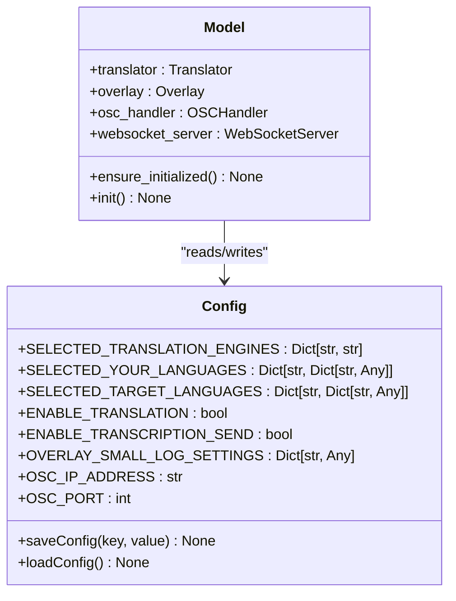
```mermaid
classDiagram
class Config {
+SELECTED_TRANSLATION_ENGINES : Dict[str, str]
+SELECTED_YOUR_LANGUAGES : Dict[str, Dict[str, Any]]
+SELECTED_TARGET_LANGUAGES : Dict[str, Dict[str, Any]]
+ENABLE_TRANSLATION : bool
+ENABLE_TRANSCRIPTION_SEND : bool
+OVERLAY_SMALL_LOG_SETTINGS : Dict[str, Any]
+OSC_IP_ADDRESS : str
+OSC_PORT : int
+saveConfig(key, value) None
+loadConfig() None
}
class Model {
+translator : Translator
+overlay : Overlay
+osc_handler : OSCHandler
+websocket_server : WebSocketServer
+ensure_initialized() None
+init() None
}
Model --> Config : "reads/writes"
```

**Diagram sources**
- [config.py](file://src-python/config.py#L531-L1027)

### Dynamic Configuration Updates

The Model responds to configuration changes without requiring restart:

- **Language Settings**: Real-time language switching
- **Quality Settings**: Dynamic model quality adjustment
- **Performance Settings**: Runtime performance tuning
- **Feature Flags**: Enable/disable functionality

**Section sources**
- [config.py](file://src-python/config.py#L531-L1027)

## Scalability and Performance Considerations

The Model architecture is designed with scalability in mind, supporting various deployment scenarios and performance requirements.

### Performance Optimization Strategies

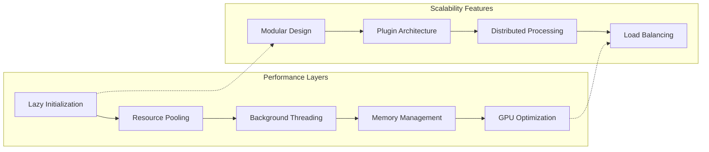
```mermaid
graph LR
subgraph "Performance Layers"
A[Lazy Initialization] --> B[Resource Pooling]
B --> C[Background Threading]
C --> D[Memory Management]
D --> E[GPU Optimization]
end
subgraph "Scalability Features"
F[Modular Design] --> G[Plugin Architecture]
G --> H[Distributed Processing]
H --> I[Load Balancing]
end
A -.-> F
E -.-> I
```

### Large AI Model Loading

The system handles large AI model loading efficiently:

1. **Streaming Loading**: Models loaded in chunks
2. **Memory Mapping**: Virtual memory for large models
3. **Model Quantization**: Reduced precision for memory savings
4. **Selective Loading**: Load only required model components

### Concurrent Processing

The Model supports concurrent operations through:

- **Thread-Safe Operations**: Atomic operations for shared resources
- **Lock-Free Algorithms**: Lock-free data structures where possible
- **Asynchronous Processing**: Non-blocking I/O operations
- **Resource Scheduling**: Intelligent resource allocation

## Fault Tolerance Design

The Model implements comprehensive fault tolerance mechanisms to ensure system reliability under various failure conditions.

### Watchdog System

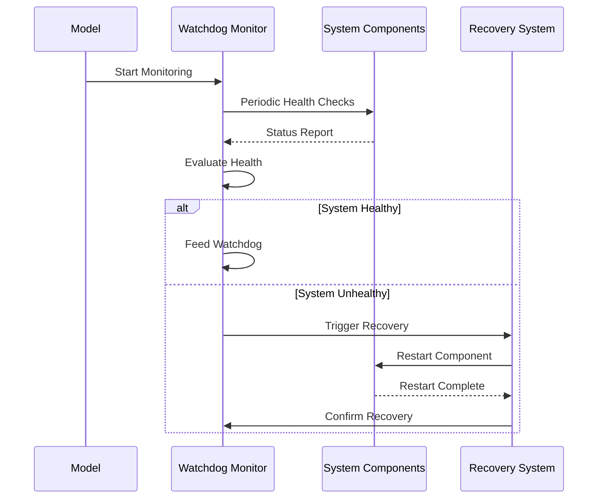
```mermaid
sequenceDiagram
participant Model as Model
participant Watchdog as Watchdog Monitor
participant System as System Components
participant Recovery as Recovery System
Model->>Watchdog : Start Monitoring
Watchdog->>System : Periodic Health Checks
System-->>Watchdog : Status Report
Watchdog->>Watchdog : Evaluate Health
alt System Healthy
Watchdog->>Watchdog : Feed Watchdog
else System Unhealthy
Watchdog->>Recovery : Trigger Recovery
Recovery->>System : Restart Component
System-->>Recovery : Restart Complete
Recovery->>Watchdog : Confirm Recovery
end
```

**Diagram sources**
- [model.py](file://src-python/model.py#L1097-L1117)

### Recovery Mechanisms

The Model implements multiple recovery strategies:

1. **Automatic Restart**: Failed components automatically restarted
2. **State Restoration**: Previous state restored after recovery
3. **Graceful Degradation**: Continue operation with reduced functionality
4. **User Notification**: Inform users of system status changes

### Monitoring and Alerting

The system provides comprehensive monitoring:

- **Health Metrics**: CPU, memory, GPU utilization
- **Performance Counters**: Operation timing and throughput
- **Error Tracking**: Detailed error logging and reporting
- **Predictive Analytics**: Early warning of potential failures

**Section sources**
- [model.py](file://src-python/model.py#L1097-L1117)

## Conclusion

The VRCT Model architecture represents a sophisticated approach to managing complex VR communication translation systems. Through its singleton pattern implementation, lazy initialization strategy, comprehensive resource management, and fault tolerance mechanisms, it provides a robust foundation for handling demanding AI workloads in VR environments.

Key architectural strengths include:

- **Modularity**: Clean separation of concerns across subsystems
- **Scalability**: Support for various deployment scenarios and performance requirements
- **Reliability**: Comprehensive error handling and recovery mechanisms
- **Performance**: Optimized resource management and lazy loading strategies
- **Flexibility**: Extensible design supporting multiple AI backends and configurations

The Model's design demonstrates best practices for building production-ready AI systems that must operate reliably in demanding VR environments while maintaining excellent user experience through graceful degradation and intelligent fallback mechanisms.