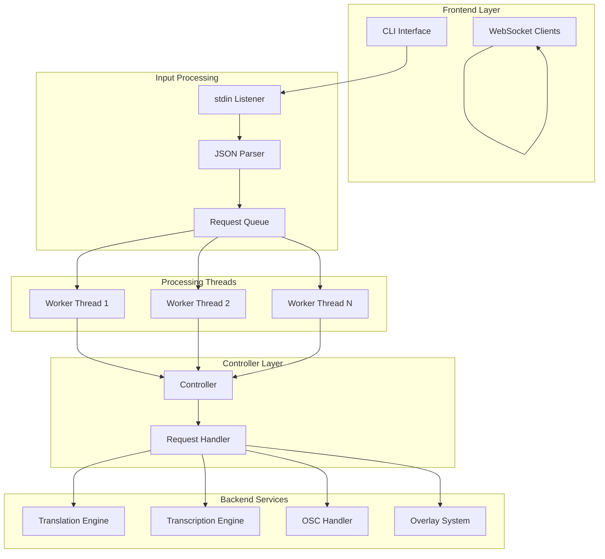
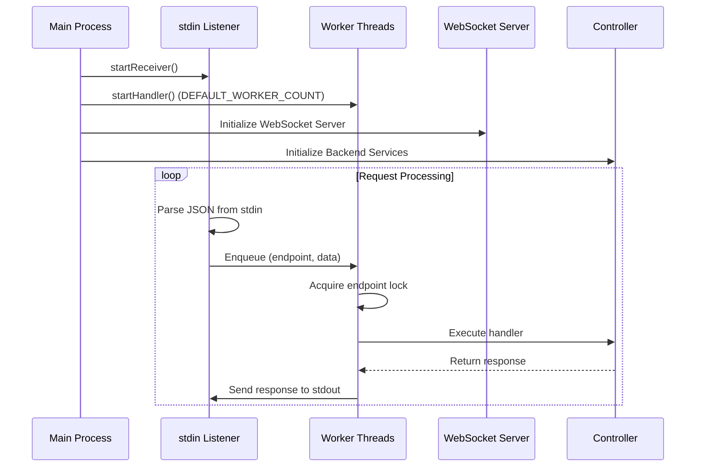
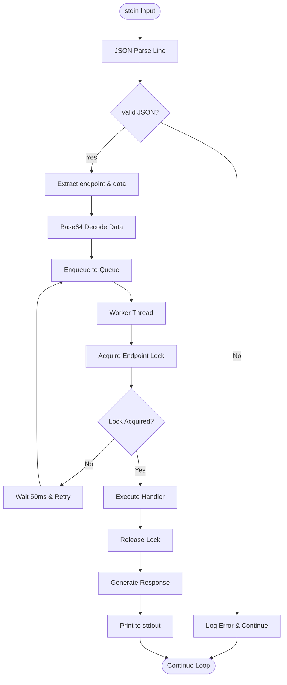
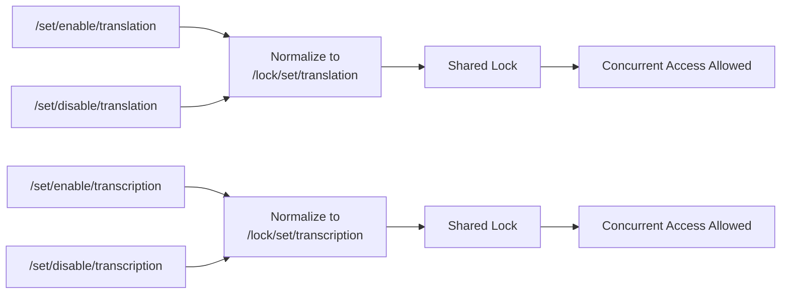
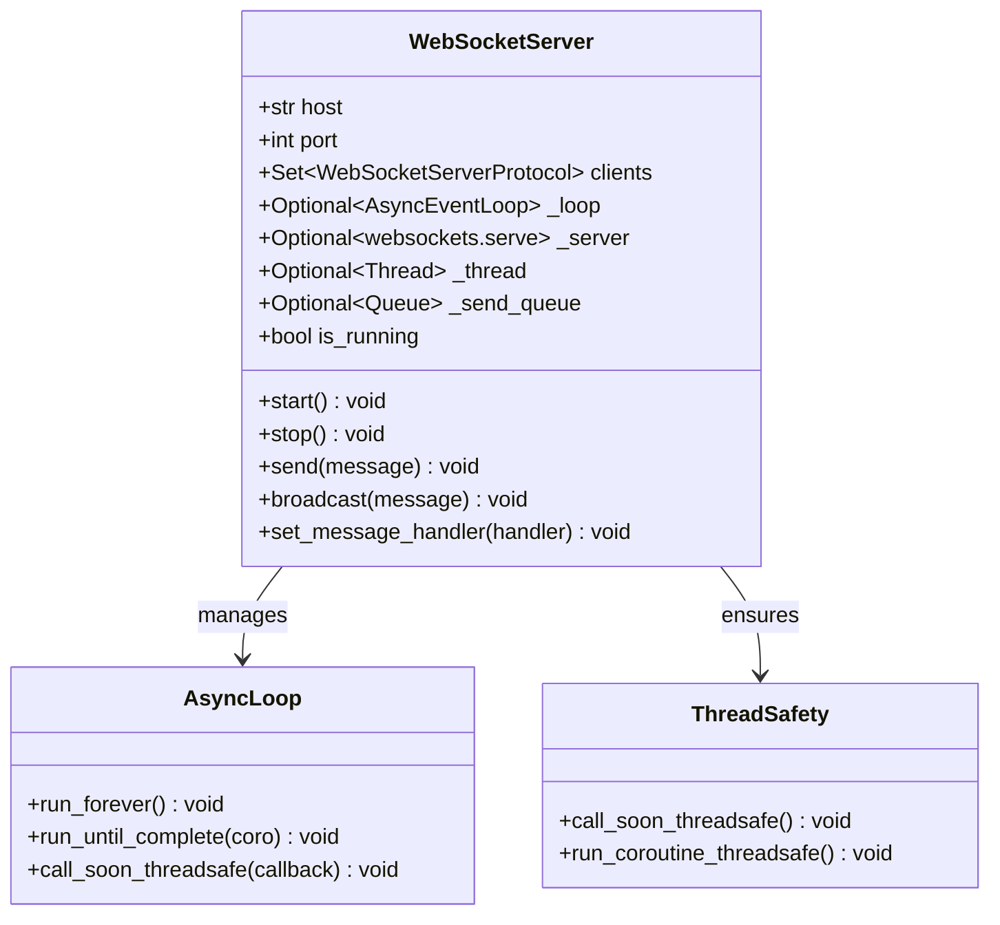
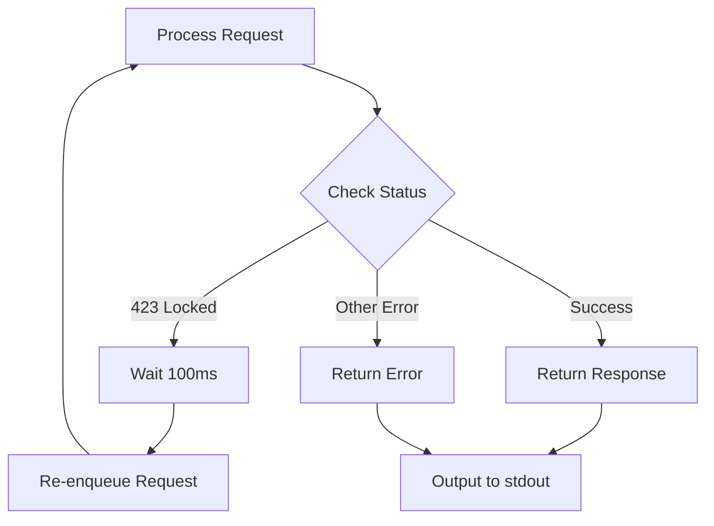
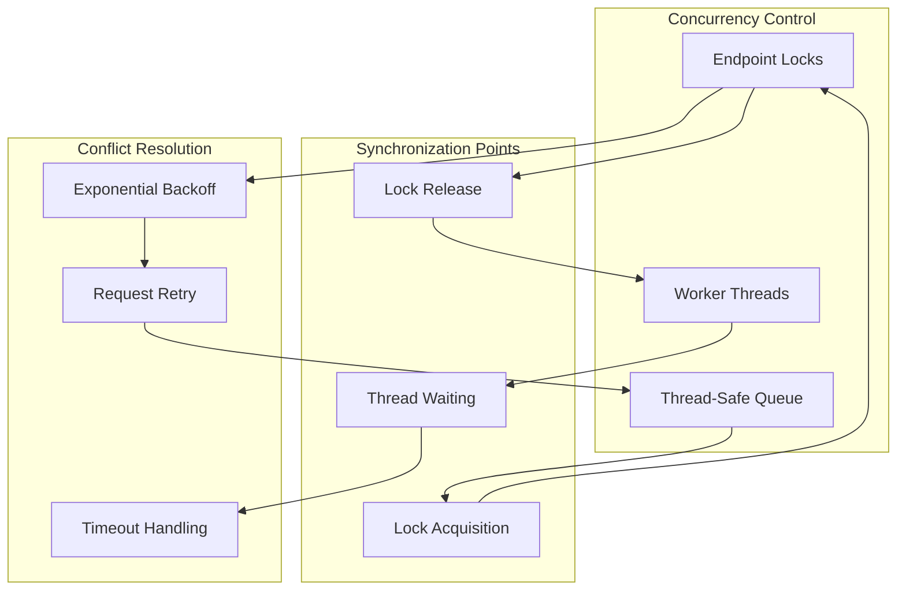

# Request Handling and Threading Model

<cite>
**Referenced Files in This Document**
- [mainloop.py](file://src-python/mainloop.py)
- [controller.py](file://src-python/controller.py)
- [websocket_server.py](file://src-python/models/websocket/websocket_server.py)
- [model.py](file://src-python/model.py)
- [test_client.py](file://src-python/test_client.py)
- [watchdog.py](file://src-python/models/watchdog/watchdog.py)
</cite>

## Table of Contents
1. [Introduction](#introduction)
2. [System Architecture Overview](#system-architecture-overview)
3. [Threading Architecture](#threading-architecture)
4. [Request Processing Pipeline](#request-processing-pipeline)
5. [Endpoint Locking Mechanism](#endpoint-locking-mechanism)
6. [WebSocket Server Integration](#websocket-server-integration)
7. [Error Handling and Retry Logic](#error-handling-and-retry-logic)
8. [Performance Considerations](#performance-considerations)
9. [Concurrency Management](#concurrency-management)
10. [Design Patterns and Best Practices](#design-patterns-and-best-practices)

## Introduction

The VRCT mainloop system implements a sophisticated request handling architecture designed to manage high-frequency OSC and transcription events while maintaining system responsiveness. The system employs a multi-threaded design with specialized components for handling JSON command parsing, request dispatching, and concurrent operation management.

The architecture separates concerns between stdin input processing, request queuing, and worker thread execution, providing robust error handling, endpoint locking mechanisms, and performance optimization for real-time translation and transcription workflows.

## System Architecture Overview

The VRCT mainloop system follows a producer-consumer pattern with multiple specialized threads handling different aspects of request processing:



**Diagram sources**
- [mainloop.py](file://src-python/mainloop.py#L408-L588)
- [websocket_server.py](file://src-python/models/websocket/websocket_server.py#L7-L30)

**Section sources**
- [mainloop.py](file://src-python/mainloop.py#L408-L588)

## Threading Architecture

The VRCT system implements a multi-threaded architecture with distinct roles for different thread types:

### Thread Types and Responsibilities

| Thread Type | Role | Lifecycle | Purpose |
|-------------|------|-----------|---------|
| **stdin Listener** | Receiver | Process lifetime | Parse JSON from stdin and enqueue requests |
| **Worker Threads** | Handlers | Process lifetime | Execute request handlers with endpoint locking |
| **WebSocket Server** | Async Server | Process lifetime | Handle bidirectional WebSocket communication |
| **Background Services** | Controllers | Process lifetime | Manage AI models, devices, and system state |

### Thread Creation and Management

The mainloop creates threads dynamically based on configuration:



**Diagram sources**
- [mainloop.py](file://src-python/mainloop.py#L465-L551)
- [websocket_server.py](file://src-python/models/websocket/websocket_server.py#L103-L112)

**Section sources**
- [mainloop.py](file://src-python/mainloop.py#L406-L551)
- [websocket_server.py](file://src-python/models/websocket/websocket_server.py#L103-L176)

## Request Processing Pipeline

The request processing follows a structured pipeline with multiple stages of validation and execution:

### Pipeline Stages

1. **Input Reception**: JSON parsing from stdin with error handling
2. **Request Validation**: Endpoint and data validation
3. **Queue Enqueue**: Thread-safe queue insertion
4. **Lock Acquisition**: Endpoint-specific locking for concurrency control
5. **Handler Execution**: Business logic execution
6. **Response Generation**: JSON serialization and output

### Request Flow Diagram



**Diagram sources**
- [mainloop.py](file://src-python/mainloop.py#L439-L544)

**Section sources**
- [mainloop.py](file://src-python/mainloop.py#L439-L544)

## Endpoint Locking Mechanism

The system implements a sophisticated endpoint locking mechanism to prevent race conditions on shared resources:

### Lock Normalization Strategy

The locking system normalizes `/set/enable/*` and `/set/disable/*` endpoints to shared lock keys:



**Diagram sources**
- [mainloop.py](file://src-python/mainloop.py#L419-L426)

### Lock Implementation Details

The endpoint locking mechanism uses Python's `threading.Lock` objects with non-blocking acquisition attempts:

| Lock Type | Scope | Behavior | Use Case |
|-----------|-------|----------|----------|
| **Endpoint Lock** | Single endpoint | Exclusive execution | Prevent concurrent modifications |
| **Normalization Lock** | Enable/disable pairs | Shared across related endpoints | Synchronize enable/disable operations |
| **Global Lock** | System-wide | Full system protection | Critical system operations |

**Section sources**
- [mainloop.py](file://src-python/mainloop.py#L418-L438)

## WebSocket Server Integration

The WebSocket server operates in a separate thread using asyncio for asynchronous I/O:

### WebSocket Architecture



**Diagram sources**
- [websocket_server.py](file://src-python/models/websocket/websocket_server.py#L7-L30)

### Thread-Safe Communication Pattern

The WebSocket server implements thread-safe communication between the main thread and asyncio event loop:

```mermaid
sequenceDiagram
participant Main as Main Thread
participant Queue as Send Queue
participant Loop as Async Event Loop
participant Client as WebSocket Client
Main->>Queue : put_nowait(message)
Queue->>Loop : Process message
Loop->>Loop : Broadcast to all clients
Loop->>Client : Send message
Note over Main,Client : Thread-safe cross-boundary communication
```

**Diagram sources**
- [websocket_server.py](file://src-python/models/websocket/websocket_server.py#L83-L91)

**Section sources**
- [websocket_server.py](file://src-python/models/websocket/websocket_server.py#L7-L176)

## Error Handling and Retry Logic

The system implements comprehensive error handling with retry mechanisms for transient failures:

### Error Classification and Handling

| Error Type | Detection Method | Recovery Strategy | Retry Logic |
|------------|------------------|-------------------|-------------|
| **JSON Parse Error** | `json.JSONDecodeError` | Log and continue | No retry |
| **Handler Execution Error** | Exception catch | Log and return error | No retry |
| **Endpoint Locked** | Status 423 | Wait and retry | Exponential backoff |
| **Serialization Error** | `json.dumps()` failure | Fallback response | No retry |
| **EOF Reached** | `readline()` returns empty | Sleep and retry | No retry |

### Retry Logic Implementation



**Diagram sources**
- [mainloop.py](file://src-python/mainloop.py#L539-L544)

**Section sources**
- [mainloop.py](file://src-python/mainloop.py#L459-L463)
- [mainloop.py](file://src-python/mainloop.py#L539-L544)

## Performance Considerations

The system is optimized for high-frequency OSC and transcription events with several performance enhancements:

### Performance Optimizations

1. **Worker Thread Scaling**: Default 3 workers with configurable count
2. **Non-blocking Lock Acquisition**: 50ms wait time for lock contention
3. **Processing Delays**: 200ms delays between handler executions
4. **Queue Timeout**: 500ms timeouts for queue operations
5. **Base64 Encoding**: Efficient data encoding for binary content

### Throughput Characteristics

| Metric | Value | Impact |
|--------|-------|---------|
| **Default Workers** | 3 | Parallel request processing |
| **Lock Wait Time** | 50ms | Reduced contention |
| **Handler Delay** | 200ms | Prevents resource exhaustion |
| **Queue Timeout** | 500ms | Balanced responsiveness |
| **Memory Usage** | Low overhead | Minimal footprint |

### High-Frequency Event Handling

The system handles high-frequency events through:

- **Asynchronous WebSocket Processing**: Non-blocking I/O for real-time updates
- **Thread Pool Management**: Efficient worker thread utilization
- **Resource Pooling**: Reused connections and cached models
- **Intelligent Queuing**: Fair scheduling of requests

**Section sources**
- [mainloop.py](file://src-python/mainloop.py#L406-L407)
- [mainloop.py](file://src-python/mainloop.py#L539-L544)

## Concurrency Management

The system implements sophisticated concurrency control to ensure data consistency and prevent race conditions:

### Concurrency Control Mechanisms



**Diagram sources**
- [mainloop.py](file://src-python/mainloop.py#L514-L544)

### Concurrency Patterns

1. **Producer-Consumer**: stdin reader produces requests, workers consume
2. **Lock-Free Queuing**: Thread-safe queue eliminates lock contention
3. **Non-blocking Synchronization**: Lock acquisition with timeouts
4. **Resource Pooling**: Shared resources with controlled access

**Section sources**
- [mainloop.py](file://src-python/mainloop.py#L514-L544)

## Design Patterns and Best Practices

The VRCT mainloop system demonstrates several software engineering best practices:

### Architectural Patterns

1. **Observer Pattern**: Controller observes system state changes
2. **Command Pattern**: JSON requests represent executable commands
3. **Factory Pattern**: Dynamic handler creation based on endpoint
4. **Singleton Pattern**: Global controller and model instances
5. **Thread Pool Pattern**: Managed worker thread lifecycle

### Error Handling Best Practices

- **Defensive Programming**: Comprehensive input validation
- **Graceful Degradation**: Fallback responses for failures
- **Logging Integration**: Structured error logging with stack traces
- **Resource Cleanup**: Proper thread and connection termination

### Performance Best Practices

- **Lazy Initialization**: Resources created on-demand
- **Connection Pooling**: Reused network connections
- **Memory Management**: Garbage collection awareness
- **Monitoring Integration**: Health checks and metrics

**Section sources**
- [mainloop.py](file://src-python/mainloop.py#L1-L588)
- [controller.py](file://src-python/controller.py#L1-L800)