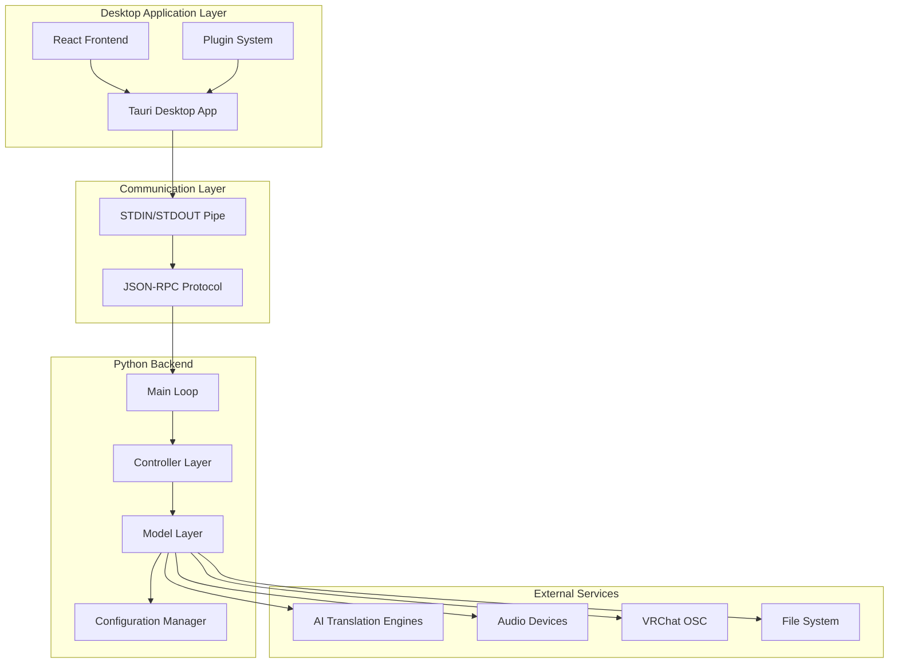
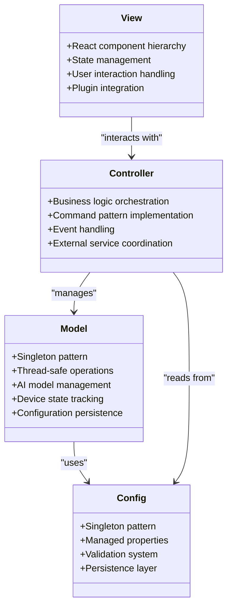
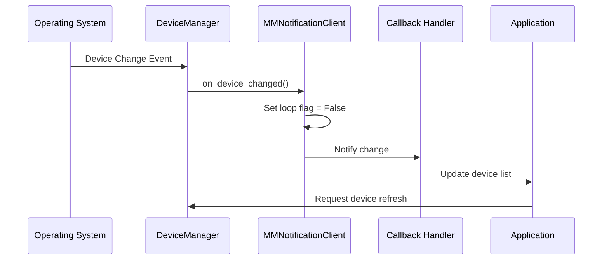
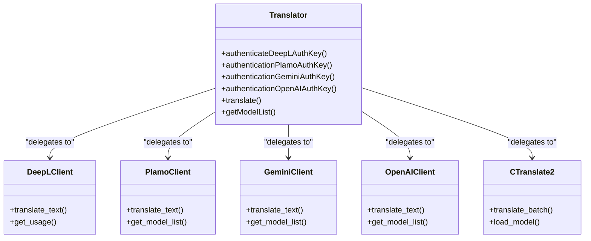
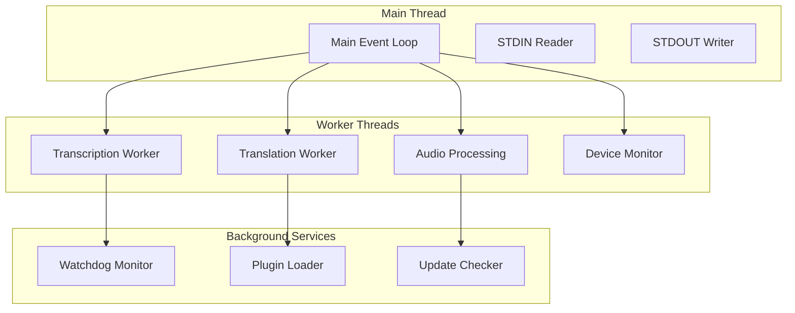
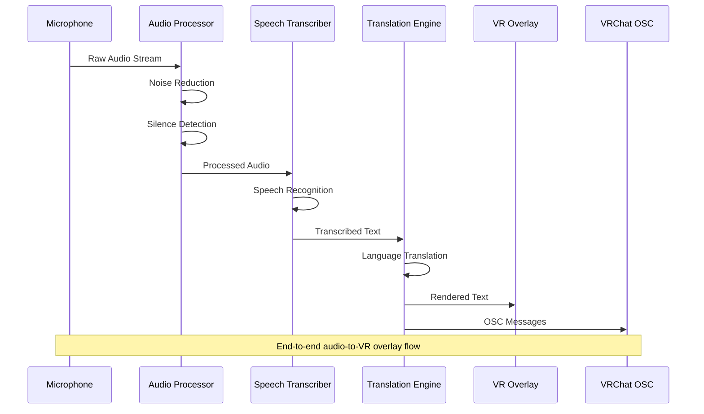
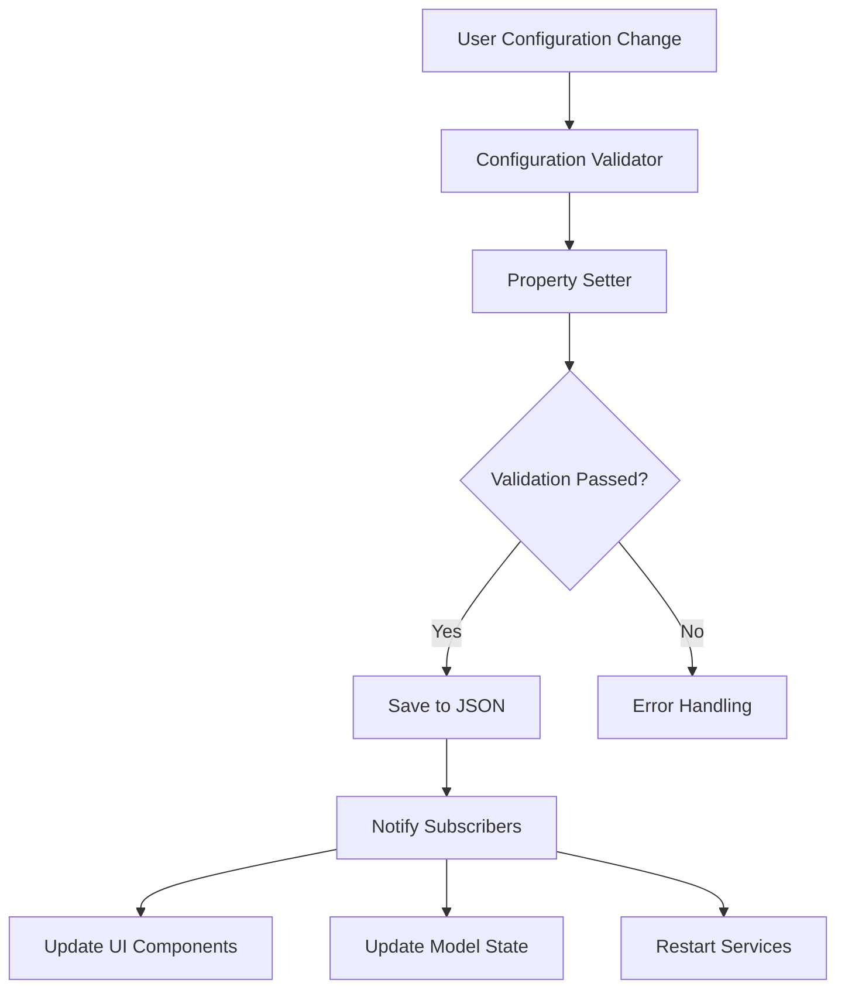
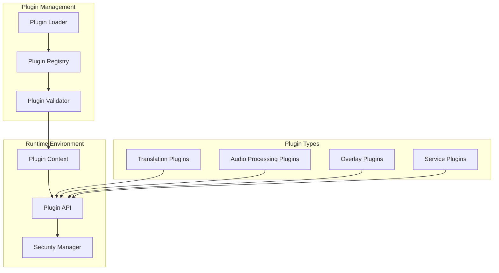
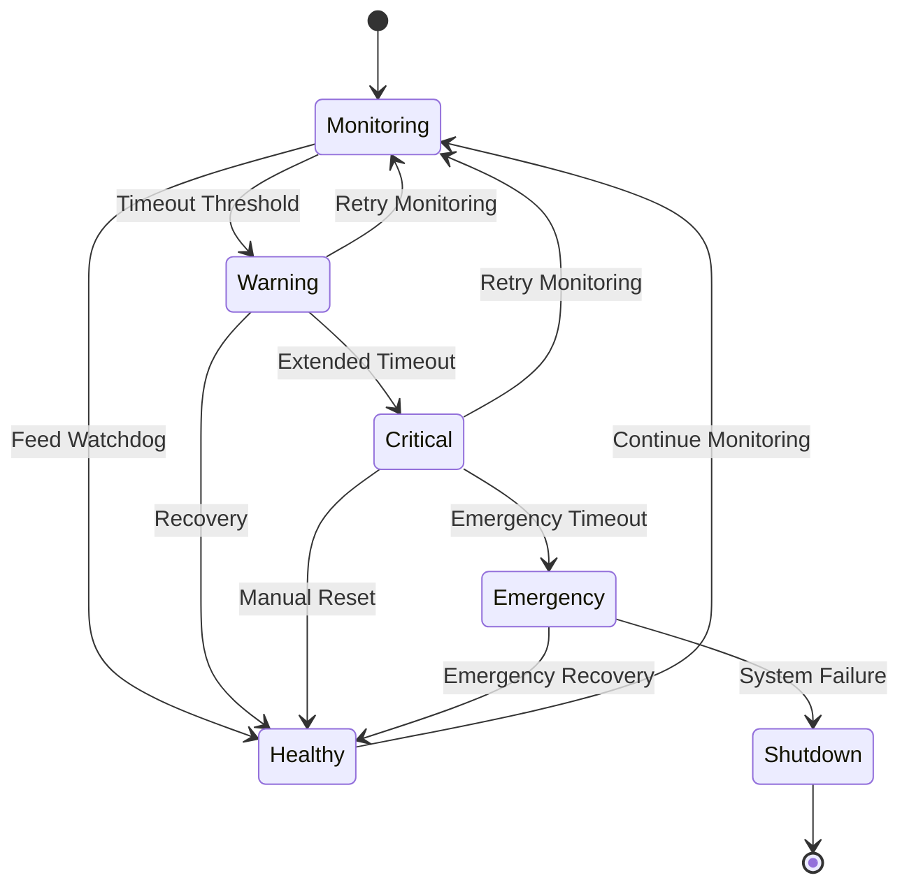

# Technical Architecture

<cite>
**Referenced Files in This Document**
- [model.py](file://src-python/model.py)
- [controller.py](file://src-python/controller.py)
- [mainloop.py](file://src-python/mainloop.py)
- [config.py](file://src-python/config.py)
- [device_manager.py](file://src-python/device_manager.py)
- [watchdog.py](file://src-python/models/watchdog/watchdog.py)
- [translation_translator.py](file://src-python/models/translation/translation_translator.py)
- [main.rs](file://src-tauri/src/main.rs)
- [lib.rs](file://src-tauri/src/lib.rs)
- [App.jsx](file://src-ui/views/App.jsx)
- [README.en.md](file://docs/readmes/README.en.md)
</cite>

## Table of Contents
1. [Introduction](#introduction)
2. [System Overview](#system-overview)
3. [Architectural Patterns](#architectural-patterns)
4. [Core Components](#core-components)
5. [Threading Model](#threading-model)
6. [Data Flow Architecture](#data-flow-architecture)
7. [Technology Stack](#technology-stack)
8. [Scalability and Extensibility](#scalability-and-extensibility)
9. [Fault Tolerance](#fault-tolerance)
10. [Performance Considerations](#performance-considerations)
11. [Conclusion](#conclusion)

## Introduction

VRCT (Virtual Reality Communication Tool) is a sophisticated desktop application designed to facilitate real-time communication between users speaking different languages in virtual reality environments, particularly VRChat. The application employs a hybrid architecture combining Tauri-powered desktop framework with React frontend and Python backend, communicating through STDIN/STDOUT pipes for optimal performance and cross-platform compatibility.

The system implements a sophisticated MVC-like architectural pattern with clear separation of concerns, utilizing advanced design patterns including Singleton for configuration and model management, Observer pattern for device monitoring, Facade pattern for translation services, and Dependency Injection for modular component architecture.

## System Overview

VRCT operates as a desktop application with a multi-layered architecture that seamlessly integrates audio processing, AI translation services, and VR overlay rendering. The system architecture follows a client-server model where the Tauri-based desktop application serves as the primary interface, communicating with a Python backend through standardized JSON-RPC protocol.

**Diagram sources**
- [main.rs](file://src-tauri/src/main.rs#L1-L7)
- [lib.rs](file://src-tauri/src/lib.rs#L1-L65)
- [mainloop.py](file://src-python/mainloop.py#L1-L588)
- [controller.py](file://src-python/controller.py#L1-L3133)
- [model.py](file://src-python/model.py#L1-L1204)

**Section sources**
- [README.en.md](file://docs/readmes/README.en.md#L58-L82)
- [main.rs](file://src-tauri/src/main.rs#L1-L7)
- [lib.rs](file://src-tauri/src/lib.rs#L1-L65)

## Architectural Patterns

### MVC-like Pattern Implementation

VRCT implements a sophisticated MVC-like architecture with clear separation between Model, View, and Controller components:

**Diagram sources**
- [model.py](file://src-python/model.py#L81-L142)
- [controller.py](file://src-python/controller.py#L11-L28)
- [config.py](file://src-python/config.py#L531-L590)

### Singleton Pattern

The application extensively uses the Singleton pattern for critical components:

- **Configuration Management**: [`Config`](file://src-python/config.py#L531-L590) class ensures global access to application settings
- **Model Management**: [`Model`](file://src-python/model.py#L81-L142) class manages AI models and system state
- **Device Monitoring**: [`DeviceManager`](file://src-python/device_manager.py#L56-L71) handles audio device detection

### Observer Pattern

The [`DeviceManager`](file://src-python/device_manager.py#L35-L55) implements the Observer pattern for real-time device change notifications:

**Diagram sources**
- [device_manager.py](file://src-python/device_manager.py#L35-L55)

### Facade Pattern

The [`Translator`](file://src-python/models/translation/translation_translator.py#L39-L60) class implements the Facade pattern to provide unified access to multiple translation engines:

**Diagram sources**
- [translation_translator.py](file://src-python/models/translation/translation_translator.py#L39-L60)

### Dependency Injection

The system implements dependency injection through constructor parameters and factory methods, enabling loose coupling between components and facilitating testing and extensibility.

**Section sources**
- [model.py](file://src-python/model.py#L81-L142)
- [controller.py](file://src-python/controller.py#L11-L28)
- [config.py](file://src-python/config.py#L531-L590)
- [device_manager.py](file://src-python/device_manager.py#L35-L55)
- [translation_translator.py](file://src-python/models/translation/translation_translator.py#L39-L60)

## Core Components

### Model Layer

The Model layer represents the core business logic and data management functionality:

#### AI Model Management
The [`Model`](file://src-python/model.py#L81-L142) class orchestrates AI model lifecycle management, including:
- Translation model loading and unloading
- Speech recognition model management
- GPU/CPU resource allocation
- Memory optimization and cleanup

#### Device State Management
Audio device management through the [`DeviceManager`](file://src-python/device_manager.py#L56-L71) provides:
- Real-time device detection and monitoring
- Automatic device switching
- Cross-platform compatibility
- Error recovery mechanisms

#### Configuration Persistence
The [`Config`](file://src-python/config.py#L531-L590) class manages application settings with:
- Type-safe property descriptors
- Automatic serialization/deserialization
- Validation and constraint enforcement
- Change notification system

### Controller Layer

The Controller layer handles business logic orchestration and command processing:

#### Command Pattern Implementation
The [`Controller`](file://src-python/controller.py#L11-L28) implements a command pattern for:
- Request routing and validation
- Business logic execution
- Response formatting
- Error handling and recovery

#### Translation Engine Coordination
Translation services are coordinated through:
- Engine selection and fallback logic
- Rate limiting and quota management
- Quality assessment and filtering
- Concurrent request handling

### View Layer

The View layer consists of React components that provide:
- User interface management
- State synchronization with backend
- Plugin integration points
- Internationalization support

**Section sources**
- [model.py](file://src-python/model.py#L81-L142)
- [controller.py](file://src-python/controller.py#L11-L28)
- [config.py](file://src-python/config.py#L531-L590)
- [device_manager.py](file://src-python/device_manager.py#L56-L71)

## Threading Model

VRCT implements a sophisticated threading model using worker threads for non-blocking operations:

### Worker Thread Architecture

**Diagram sources**
- [mainloop.py](file://src-python/mainloop.py#L408-L588)

### Thread Safety Mechanisms

The system implements several thread safety mechanisms:

#### Lock-Based Synchronization
- Endpoint-level locking for concurrent request handling
- Resource access protection
- Atomic state updates

#### Queue-Based Communication
- Thread-safe message passing
- Asynchronous operation handling
- Backpressure management

#### Graceful Shutdown
- Coordinated thread termination
- Resource cleanup and cleanup
- Signal handling and propagation

**Section sources**
- [mainloop.py](file://src-python/mainloop.py#L408-L588)

## Data Flow Architecture

### Audio Processing Pipeline

The audio processing pipeline demonstrates the system's data flow architecture:

**Diagram sources**
- [model.py](file://src-python/model.py#L616-L768)
- [controller.py](file://src-python/controller.py#L254-L415)

### Configuration Management Flow

Configuration changes propagate through the system using a publish-subscribe pattern:

**Diagram sources**
- [config.py](file://src-python/config.py#L531-L590)

**Section sources**
- [model.py](file://src-python/model.py#L616-L768)
- [controller.py](file://src-python/controller.py#L254-L415)
- [config.py](file://src-python/config.py#L531-L590)

## Technology Stack

### Frontend Technologies

**Tauri Framework**
- Rust-based desktop application framework
- Secure web view integration
- Native system API access
- Cross-platform deployment

**React Ecosystem**
- Component-based UI architecture
- State management with hooks
- Plugin system integration
- Internationalization support

### Backend Technologies

**Python Core**
- AI model processing and management
- Audio signal processing
- Machine learning inference
- External service integration

**Key Libraries**
- PyTorch for AI model inference
- Transformers for NLP tasks
- SoundFile for audio processing
- Requests for HTTP communications

### Communication Protocol

The system uses a custom JSON-RPC protocol over STDIN/STDOUT for:
- Request-response communication
- Asynchronous operation handling
- Error propagation and recovery
- Type-safe data exchange

**Section sources**
- [main.rs](file://src-tauri/src/main.rs#L1-L7)
- [lib.rs](file://src-tauri/src/lib.rs#L1-L65)
- [mainloop.py](file://src-python/mainloop.py#L1-L588)

## Scalability and Extensibility

### Plugin System Architecture

VRCT implements a sophisticated plugin system for extensibility:

**Diagram sources**
- [usePlugins.js](file://src-ui/logics/configs/config_page_setter/plugins/usePlugins.js#L58-L380)

### Modular Architecture Benefits

The modular architecture provides several scalability advantages:

#### Horizontal Scaling
- Plugin-based feature extension
- Service-oriented architecture
- Distributed processing capabilities

#### Vertical Scaling
- Resource-aware model loading
- Dynamic memory management
- Adaptive quality settings

#### Feature Evolution
- Incremental feature development
- Backward compatibility maintenance
- Gradual migration strategies

**Section sources**
- [usePlugins.js](file://src-ui/logics/configs/config_page_setter/plugins/usePlugins.js#L58-L380)

## Fault Tolerance

### Watchdog Monitoring System

The [`Watchdog`](file://src-python/models/watchdog/watchdog.py#L1-L670) system provides comprehensive fault detection and recovery:

**Diagram sources**
- [watchdog.py](file://src-python/models/watchdog/watchdog.py#L1-L670)

### Error Handling Strategies

The system implements multiple layers of error handling:

#### Graceful Degradation
- Automatic fallback to local models
- Reduced functionality mode
- Service degradation policies

#### Recovery Mechanisms
- Automatic retry with exponential backoff
- Circuit breaker pattern implementation
- Health check and self-healing

#### Monitoring and Alerting
- Comprehensive logging infrastructure
- Performance metrics collection
- Alert system integration

**Section sources**
- [watchdog.py](file://src-python/models/watchdog/watchdog.py#L1-L670)

## Performance Considerations

### Optimization Strategies

#### Memory Management
- Lazy loading of AI models
- Garbage collection optimization
- Memory pool management
- Resource pooling for audio processing

#### CPU Utilization
- Multi-threaded processing
- GPU acceleration for AI inference
- SIMD instruction utilization
- Background processing prioritization

#### I/O Optimization
- Asynchronous file operations
- Streaming audio processing
- Network request batching
- Cache-friendly data structures

### Performance Monitoring

The system includes built-in performance monitoring:

#### Metrics Collection
- Processing latency tracking
- Resource utilization monitoring
- Error rate analysis
- User experience metrics

#### Adaptive Optimization
- Dynamic quality adjustment
- Resource-based scaling
- Predictive caching
- Load balancing

## Conclusion

VRCT's technical architecture demonstrates a sophisticated approach to building scalable, maintainable, and extensible desktop applications. The hybrid Tauri/React/Python stack provides excellent cross-platform compatibility while maintaining high performance for real-time audio processing and AI inference.

The implementation of advanced architectural patterns including Singleton, Observer, Facade, and Dependency Injection creates a robust foundation that supports both current functionality and future extensibility. The threading model ensures responsive user experience while handling computationally intensive tasks efficiently.

The fault tolerance mechanisms, particularly the comprehensive watchdog system, ensure reliable operation in production environments. The plugin architecture enables community-driven feature development and customization, fostering an ecosystem of extensions and integrations.

This architectural foundation positions VRCT as a leading solution for cross-language communication in virtual environments, with clear pathways for future enhancements and technological advancements.