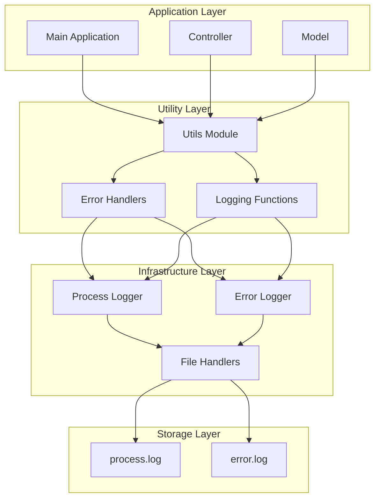
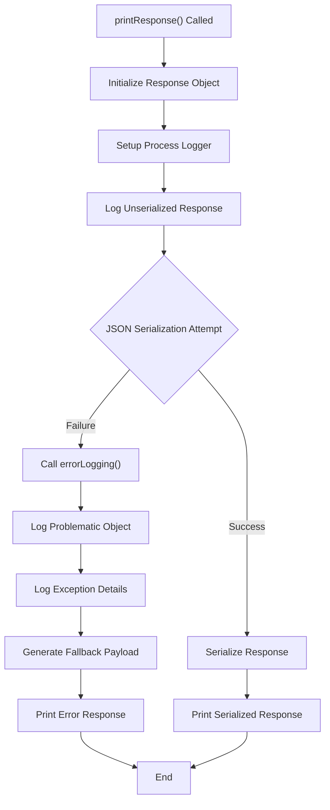
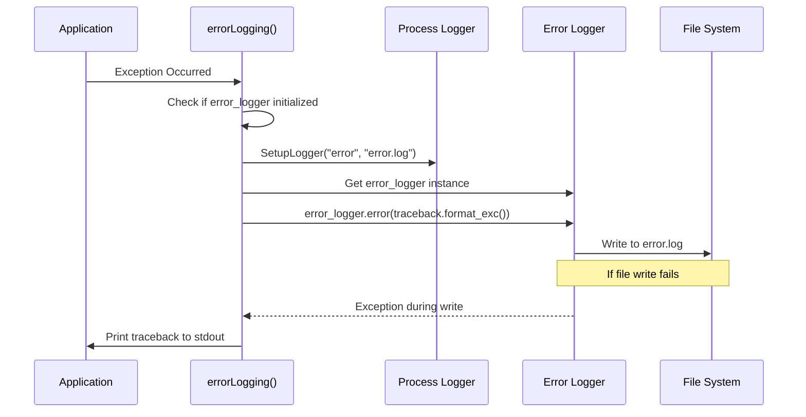
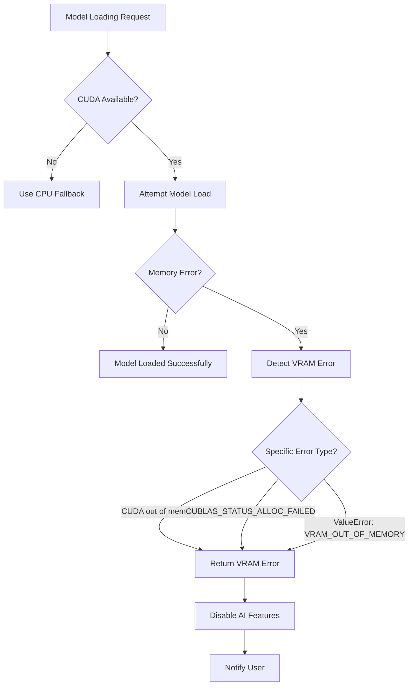
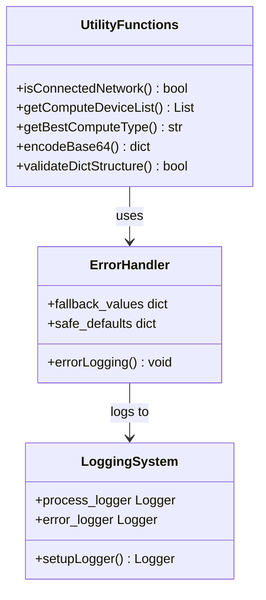

# Error Codes and Logging

<cite>
**Referenced Files in This Document**
- [utils.py](file://src-python/utils.py)
- [controller.py](file://src-python/controller.py)
- [mainloop.py](file://src-python/mainloop.py)
- [model.py](file://src-python/model.py)
- [test_client.py](file://src-python/test_client.py)
- [docs/utils.md](file://src-python/docs/utils.md)
- [docs/utils_zh.md](file://src-python/docs/utils_zh.md)
- [docs/mainloop.md](file://src-python/docs/mainloop.md)
- [docs/mainloop_zh.md](file://src-python/docs/mainloop_zh.md)
- [docs/model.md](file://src-python/docs/model.md)
</cite>

## Table of Contents
1. [Introduction](#introduction)
2. [System Architecture](#system-architecture)
3. [JSON Serialization Error Handling](#json-serialization-error-handling)
4. [Error Logging Mechanisms](#error-logging-mechanisms)
5. [Common Error Scenarios](#common-error-scenarios)
6. [Defensive Programming Approach](#defensive-programming-approach)
7. [Log File Management](#log-file-management)
8. [Troubleshooting Guide](#troubleshooting-guide)
9. [Best Practices](#best-practices)
10. [Conclusion](#conclusion)

## Introduction

VRCT implements a comprehensive error handling and logging system designed to provide robust operation monitoring, debugging capabilities, and user-friendly error reporting. The system employs multiple layers of error detection, serialization safety, and fallback mechanisms to ensure reliable operation under various failure conditions.

The logging infrastructure consists of two primary log files: `process.log` for operational events and `error.log` for exception tracebacks. Both files use JSON serialization with structured formatting for easy parsing and analysis.

## System Architecture

The VRCT error handling system follows a layered architecture with specialized components for different types of error scenarios:



**Diagram sources**
- [utils.py](file://src-python/utils.py#L224-L293)
- [mainloop.py](file://src-python/mainloop.py#L408-L588)

**Section sources**
- [utils.py](file://src-python/utils.py#L1-L293)
- [mainloop.py](file://src-python/mainloop.py#L1-L588)

## JSON Serialization Error Handling

### The `printResponse()` Function

The `printResponse()` function serves as the primary mechanism for handling JSON serialization errors in VRCT's communication protocol. This function implements a sophisticated fallback system to ensure that response data is always delivered, even when serialization fails.



**Diagram sources**
- [utils.py](file://src-python/utils.py#L242-L275)

### Serialization Error Recovery Process

When JSON serialization fails, the system follows a structured recovery process:

1. **Exception Capture**: The original exception is caught and logged using `errorLogging()`
2. **Context Preservation**: The problematic response object and exception details are logged for debugging
3. **Fallback Generation**: A standardized error payload is created with status 500
4. **User Notification**: The error is communicated to the client with appropriate error details

### Fallback Error Payload Structure

The fallback error payload maintains the standard response format while providing meaningful error information:

```json
{
    "status": 500,
    "endpoint": "endpoint_name",
    "result": {
        "error": "Failed to serialize response",
        "details": "Original exception message"
    }
}
```

**Section sources**
- [utils.py](file://src-python/utils.py#L242-L275)
- [docs/utils.md](file://src-python/docs/utils.md#L481-L543)

## Error Logging Mechanisms

### The `errorLogging()` Function

The `errorLogging()` function provides centralized exception traceback capture and logging to the `error.log` file. This function implements a robust fallback mechanism to ensure that exception information is always recorded, even if the logging system itself encounters issues.



**Diagram sources**
- [utils.py](file://src-python/utils.py#L280-L291)

### Logger Initialization Strategy

Both process and error loggers use lazy initialization to minimize startup overhead:

- **Delayed Creation**: Loggers are created only when first needed
- **Singleton Pattern**: Global instances prevent duplicate handlers
- **Thread Safety**: Proper initialization prevents race conditions

### Exception Context Preservation

The error logging system captures complete exception context including:

- Full traceback information
- Exception type and message
- Call stack details
- Variable states at error points

**Section sources**
- [utils.py](file://src-python/utils.py#L280-L291)
- [docs/utils.md](file://src-python/docs/utils.md#L408-L608)

## Common Error Scenarios

### CUDA Out of Memory Errors

VRCT implements specialized detection for CUDA memory exhaustion, which is a common issue in AI model processing:



**Diagram sources**
- [model.py](file://src-python/model.py#L731-L738)
- [controller.py](file://src-python/controller.py#L302-L308)

### Model Loading Failures

The system handles various model loading scenarios with appropriate fallback mechanisms:

| Error Type | Detection Method | Fallback Action |
|------------|------------------|-----------------|
| CUDA Memory Exhaustion | String matching in error messages | Disable AI features, use CPU |
| Network Timeout | Request exception handling | Retry with exponential backoff |
| File Corruption | Validation checks | Re-download model weights |
| Unsupported Hardware | Device capability detection | Select compatible model |

### Network Request Exceptions

Network-related errors are handled through multiple layers of retry and fallback logic:

- **Connection Timeouts**: Automatic retry with increasing delays
- **DNS Resolution Failures**: Alternative DNS servers
- **HTTP Status Errors**: Appropriate status code handling
- **SSL/TLS Issues**: Certificate validation bypass options

**Section sources**
- [model.py](file://src-python/model.py#L731-L738)
- [controller.py](file://src-python/controller.py#L2894-L2900)

## Defensive Programming Approach

### Utility Function Safety

VRCT's utility functions implement comprehensive error handling to prevent cascading failures:



**Diagram sources**
- [utils.py](file://src-python/utils.py#L59-L293)

### Safe Default Values

Each utility function provides appropriate fallback values when operations fail:

- **Network Connectivity**: Returns `False` for unavailable connections
- **Device Detection**: Returns CPU-only list when GPU detection fails
- **Serialization**: Returns empty dictionaries for parsing failures
- **Validation**: Returns `False` for invalid structures

### Exception Isolation

The system isolates exceptions to prevent them from propagating to higher-level components:

- **Local Handling**: Exceptions are caught and processed locally
- **Graceful Degradation**: Systems continue operating with reduced functionality
- **User-Friendly Messages**: Technical details are hidden from end users

**Section sources**
- [utils.py](file://src-python/utils.py#L59-L293)
- [docs/utils.md](file://src-python/docs/utils.md#L616-L637)

## Log File Management

### Process Log Structure

The `process.log` file captures operational events with structured JSON formatting:

```json
{
    "status": 348,
    "log": "endpoint_name",
    "data": "serialized_data"
}
```

### Error Log Structure

The `error.log` file contains complete exception tracebacks:

```
2025-10-13 14:35:12,789 - error - ERROR - Traceback (most recent call last):
  File "model.py", line 123, in loadModel
    model.load()
  File "ctranslate2/model.py", line 456, in load
    raise RuntimeError("CUDA out of memory")
RuntimeError: CUDA out of memory
```

### Log Rotation Strategy

The logging system implements intelligent rotation to manage disk space:

- **Size-Based Rotation**: 10MB maximum file size
- **Backup Management**: Single backup file retained
- **Encoding Support**: UTF-8 encoding for international characters
- **Lazy Initialization**: Delayed file opening to reduce overhead

### File Access Patterns

Log files are accessed through thread-safe handlers with minimal locking:

- **Non-blocking Writes**: Asynchronous logging to prevent UI freezing
- **Buffer Management**: Buffered writes for performance
- **Atomic Operations**: Complete log entries written atomically

**Section sources**
- [utils.py](file://src-python/utils.py#L192-L222)
- [docs/utils.md](file://src-python/docs/utils.md#L408-L436)

## Troubleshooting Guide

### Locating Log Files

Log files are located in the application's working directory:

- **Process Logs**: `process.log` - Contains operational events
- **Error Logs**: `error.log` - Contains exception tracebacks

### Log Analysis Techniques

#### Process Log Analysis

1. **Endpoint Tracking**: Monitor endpoint usage patterns
2. **Performance Metrics**: Identify slow operations
3. **State Changes**: Track system configuration updates

#### Error Log Analysis

1. **Exception Patterns**: Identify recurring error types
2. **Stack Traces**: Locate error origins
3. **Frequency Analysis**: Detect error spikes

### Common Issues and Solutions

| Issue | Symptoms | Solution |
|-------|----------|----------|
| JSON Serialization Failure | Malformed responses | Check data types, use safe defaults |
| CUDA Memory Issues | Model loading failures | Reduce batch size, use CPU fallback |
| Network Connectivity | Download timeouts | Verify internet connection, proxy settings |
| Permission Errors | Log file access denied | Check file permissions, antivirus interference |

### Debug Mode Activation

Enable detailed logging for troubleshooting:

```python
# Set debug level in controller.py
config.LOGGER_FEATURE = True
```

**Section sources**
- [controller.py](file://src-python/controller.py#L3081-L3085)
- [docs/utils.md](file://src-python/docs/utils.md#L404-L405)

## Best Practices

### Error Handling Guidelines

1. **Always Log Exceptions**: Use `errorLogging()` for all unhandled exceptions
2. **Provide Context**: Include relevant data in error messages
3. **Use Appropriate Status Codes**: Match HTTP status code semantics
4. **Graceful Degradation**: Maintain functionality when possible

### Logging Best Practices

1. **Structured Data**: Use JSON format for machine-readable logs
2. **Consistent Formatting**: Maintain uniform log entry structure
3. **Sensitive Information**: Avoid logging passwords or API keys
4. **Performance Impact**: Minimize logging overhead in production

### Monitoring Recommendations

1. **Regular Log Review**: Establish daily log analysis routines
2. **Automated Alerts**: Set up notifications for critical errors
3. **Capacity Planning**: Monitor log file sizes and growth rates
4. **Backup Strategy**: Implement log archival for long-term retention

**Section sources**
- [docs/utils.md](file://src-python/docs/utils.md#L587-L598)
- [docs/mainloop.md](file://src-python/docs/mainloop.md#L128-L131)

## Conclusion

VRCT's error handling and logging system provides a robust foundation for reliable operation and effective troubleshooting. The combination of JSON serialization safety, comprehensive exception handling, and intelligent fallback mechanisms ensures that the application can recover from various failure modes while maintaining useful diagnostic information.

The system's design emphasizes prevention over cure, with defensive programming practices that minimize the occurrence of critical failures. Through careful implementation of logging strategies and error recovery mechanisms, VRCT achieves high reliability and maintainability in complex AI-powered applications.

Key strengths of the system include:

- **Serialization Safety**: Robust handling of JSON serialization failures
- **Exception Visibility**: Comprehensive traceback capture and logging
- **Performance Optimization**: Lazy initialization and efficient file handling
- **User Experience**: Graceful degradation and meaningful error reporting

Future enhancements could include real-time monitoring integration, automated error classification, and enhanced log aggregation capabilities for distributed deployments.