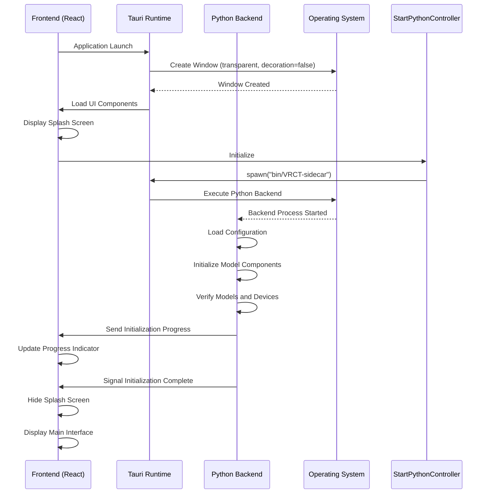
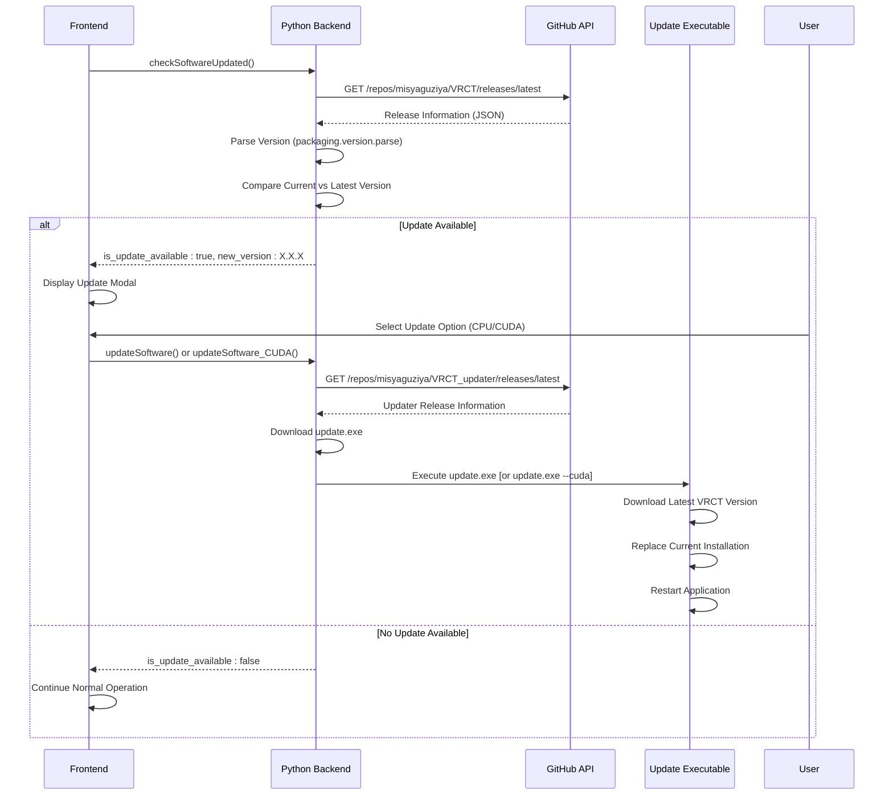

# Startup and Initialization Problems

<cite>
**Referenced Files in This Document**   
- [controller.py](file://src-python/controller.py)
- [model.py](file://src-python/model.py)
- [config.py](file://src-python/config.py)
- [utils.py](file://src-python/utils.py)
- [StartPythonController.jsx](file://src-ui/views/app/_app_controllers/StartPythonController.jsx)
- [App.jsx](file://src-ui/views/app/App.jsx)
- [useInitProgress.js](file://src-ui/logics/common/useInitProgress.js)
- [UpdateModal.jsx](file://src-ui/views/app/others/modal_controller/update_modal/UpdateModal.jsx)
- [tauri.conf.json](file://src-tauri/tauri.conf.json)
- [main.rs](file://src-tauri/src/main.rs)
- [requirements.txt](file://requirements.txt)
- [package.json](file://package.json)
</cite>

## Table of Contents
1. [Introduction](#introduction)
2. [Startup Sequence Overview](#startup-sequence-overview)
3. [Model Downloading Process](#model-downloading-process)
4. [Backend Initialization](#backend-initialization)
5. [Version Checking and Auto-Update Mechanism](#version-checking-and-auto-update-mechanism)
6. [Startup Progress Indicator](#startup-progress-indicator)
7. [Configuration File Management](#configuration-file-management)
8. [Common Startup Issues](#common-startup-issues)
9. [Troubleshooting Procedures](#troubleshooting-procedures)
10. [Python Environment and Dependency Verification](#python-environment-and-dependency-verification)
11. [Application Launch Failure and Hangs](#application-launch-failure-and-hangs)
12. [Conclusion](#conclusion)

## Introduction
This document provides comprehensive guidance for diagnosing and resolving startup and initialization issues in VRCT (Virtual Reality Chat Translator). The application combines speech transcription, translation, and overlay display functionalities for virtual reality environments, requiring complex initialization procedures involving model downloading, backend services, and hardware configuration. This guide details the complete startup sequence, explains common failure points, and provides systematic troubleshooting procedures for various initialization problems. The information is derived from analysis of the application's source code, configuration files, and startup mechanisms to provide accurate and actionable guidance for users experiencing difficulties with the application's initialization process.

**Section sources**
- [controller.py](file://src-python/controller.py#L1-L3133)
- [model.py](file://src-python/model.py#L1-L1204)
- [config.py](file://src-python/config.py#L1-L1027)

## Startup Sequence Overview
The VRCT application follows a structured startup sequence that begins with the Tauri frontend framework loading and progresses through several critical initialization phases. The process starts with the execution of the Rust-based main function in `main.rs`, which initializes the Tauri runtime and launches the application window defined in `tauri.conf.json`. The frontend, built with React, then loads the main application component `App.jsx`, which orchestrates the initialization process through various controller components. The startup sequence follows this order: UI initialization → Python backend startup → configuration loading → model verification → device detection → service initialization → completion signaling. During this process, the application displays a splash screen until the backend is fully initialized, as determined by the `useIsBackendReady` hook. The `StartPythonController` plays a crucial role in launching the Python backend as a sidecar process, establishing communication between the frontend and backend through Tauri's command system. The entire startup process is designed to be resilient, with error handling and recovery mechanisms built into each phase to ensure the application can either complete initialization or provide meaningful error information when failures occur.

**Diagram sources**
- [main.rs](file://src-tauri/src/main.rs#L1-L7)
- [tauri.conf.json](file://src-tauri/tauri.conf.json#L1-L60)
- [App.jsx](file://src-ui/views/app/App.jsx#L1-L82)
- [StartPythonController.jsx](file://src-ui/views/app/_app_controllers/StartPythonController.jsx#L1-L81)
- [controller.py](file://src-python/controller.py#L1-L3133)
- [model.py](file://src-python/model.py#L1-L1204)

**Section sources**
- [main.rs](file://src-tauri/src/main.rs#L1-L7)
- [tauri.conf.json](file://src-tauri/tauri.conf.json#L1-L60)
- [App.jsx](file://src-ui/views/app/App.jsx#L1-L82)

## Model Downloading Process
The model downloading process in VRCT is a critical initialization step that ensures the application has access to the necessary AI models for transcription and translation functionality. The application requires two primary types of models: Whisper models for speech transcription and CTranslate2 models for text translation. These models are not bundled with the application distribution due to their large file sizes and are instead downloaded on-demand during the first startup or when users select specific model weights in the configuration interface. The downloading mechanism is implemented in the `model.py` file, with dedicated functions `downloadWhisperWeight` and `downloadCTranslate2Weight` that handle the retrieval of model files from remote repositories. The download progress is communicated to the frontend through the controller's callback system, allowing the UI to display real-time progress indicators. Model files are stored in the local application directory specified by `config.PATH_LOCAL`, with a directory structure that organizes models by type and weight. The application verifies the integrity of downloaded models by checking for the presence of expected files and directories before marking them as available for use. Users can manually trigger model downloads through the configuration interface, and the application maintains a record of downloaded models in the configuration to prevent redundant downloads on subsequent startups.

**Section sources**
- [model.py](file://src-python/model.py#L28-L30)
- [controller.py](file://src-python/controller.py#L188-L252)
- [config.py](file://src-python/config.py#L760-L761)

## Backend Initialization
The backend initialization process in VRCT involves the creation and configuration of multiple interdependent components that provide the core functionality of the application. When the Python backend process starts, it initializes the `Controller` class, which serves as the central coordination point for all application functionality. The controller sets up mapping dictionaries for initialization and runtime functions, establishes communication endpoints, and begins the initialization of model components. The `Model` class, implemented as a singleton, is responsible for managing AI models, device handlers, and service components. During initialization, the model sets up the translation engine (`Translator`), OSC handler (`OSCHandler`), transcription components (`AudioTranscriber`), overlay system (`Overlay`), and WebSocket server (`WebSocketServer`). Each component is initialized in a specific order to ensure dependencies are resolved correctly. The initialization process also includes setting up threading mechanisms for real-time audio processing, with separate threads for microphone and speaker audio recording, transcription, and energy level monitoring. Error handling is integrated throughout the initialization process, with try-catch blocks around critical initialization steps to prevent startup failures from crashing the entire application. The backend communicates its initialization progress to the frontend through the `run` callback function, allowing the UI to reflect the current state of the startup process.

```mermaid
classDiagram
class Controller {
+init_mapping : dict
+run_mapping : dict
+run : Callable
+device_access_status : bool
+setInitMapping(init_mapping)
+setRunMapping(run_mapping)
+setRun(run)
+startThreadingTranscriptionSendMessage()
+stopThreadingTranscriptionSendMessage()
+startThreadingTranscriptionReceiveMessage()
+stopThreadingTranscriptionReceiveMessage()
+progressBarMicEnergy(energy)
+progressBarSpeakerEnergy(energy)
+micMessage(result)
+speakerMessage(result)
+chatMessage(data)
+getVersion()
+checkSoftwareUpdated()
+getComputeMode()
+getComputeDeviceList()
+getSelectedTranslationComputeDevice()
+setSelectedTranslationComputeDevice(device)
+getSelectableCtranslate2WeightTypeDict()
}
class Model {
+logger : Logger
+th_check_device : Thread
+mic_print_transcript : threadFnc
+mic_audio_recorder : SelectedMicEnergyAndAudioRecorder
+mic_transcriber : AudioTranscriber
+mic_energy_recorder : SelectedMicEnergyRecorder
+speaker_print_transcript : threadFnc
+speaker_audio_recorder : SelectedSpeakerEnergyAndAudioRecorder
+speaker_transcriber : AudioTranscriber
+speaker_energy_recorder : SelectedSpeakerEnergyRecorder
+previous_send_message : str
+previous_receive_message : str
+translator : Translator
+keyword_processor : KeywordProcessor
+overlay : Overlay
+overlay_image : OverlayImage
+mic_audio_queue : Queue
+mic_mute_status : bool
+transliterator : Transliterator
+watchdog : Watchdog
+osc_handler : OSCHandler
+websocket_server : WebSocketServer
+websocket_server_loop : bool
+websocket_server_alive : bool
+th_websocket_server : Thread
+checkTranslatorCTranslate2ModelWeight(weight_type)
+changeTranslatorCTranslate2Model()
+downloadCTranslate2ModelWeight(weight_type, callback, end_callback)
+downloadCTranslate2ModelTokenizer(weight_type)
+isLoadedCTranslate2Model()
+isChangedTranslatorParameters()
+setChangedTranslatorParameters(is_changed)
+checkTranscriptionWhisperModelWeight(weight_type)
+downloadWhisperModelWeight(weight_type, callback, end_callback)
+resetKeywordProcessor()
+authenticationTranslatorDeepLAuthKey(auth_key)
+authenticationTranslatorPlamoAuthKey(auth_key)
+getTranslatorPlamoModelList()
+setTranslatorPlamoModel(model)
+updateTranslatorPlamoClient()
+authenticationTranslatorGeminiAuthKey(auth_key)
+getTranslatorGeminiModelList()
+setTranslatorGeminiModel(model)
+updateTranslatorGeminiClient()
+authenticationTranslatorOpenAIAuthKey(auth_key, base_url)
+getTranslatorOpenAIModelList()
+setTranslatorOpenAIModel(model)
+updateTranslatorOpenAIClient()
+authenticationTranslatorLMStudio(base_url)
+getTranslatorLMStudioModelList()
+setTranslatorLMStudioModel(model)
+updateTranslatorLMStudioClient()
+authenticationTranslatorOllama()
+getTranslatorOllamaModelList()
+setTranslatorOllamaModel(model)
+updateTranslatorOllamaClient()
+startLogger()
+stopLogger()
+getListLanguageAndCountry()
+findTranslationEngines(source_lang, target_lang, engines_status)
+getTranslate(translator_name, source_language, target_language, target_country, message)
+getInputTranslate(message, source_language)
+getOutputTranslate(message, source_language)
+addKeywords()
+checkKeywords(message)
+detectRepeatSendMessage(message)
+detectRepeatReceiveMessage(message)
+startTransliteration()
+stopTransliteration()
+convertMessageToTransliteration(message, hiragana, romaji)
+setOscIpAddress(ip_address)
+setOscPort(port)
+oscStartSendTyping()
+oscStopSendTyping()
+oscSendMessage(message)
+setMuteSelfStatus()
+startReceiveOSC()
+stopReceiveOSC()
+getIsOscQueryEnabled()
+checkSoftwareUpdated()
+updateSoftware()
+updateCudaSoftware()
+getListMicHost()
+getMicDefaultDevice()
+getListMicDevice()
+getListSpeakerDevice()
+startMicTranscript(fnc)
+resumeMicTranscript()
+pauseMicTranscript()
+detectVRAMError(error)
+changeMicTranscriptStatus()
+stopMicTranscript()
+startCheckMicEnergy(fnc)
+startCheckSpeakerEnergy(fnc)
+stopCheckMicEnergy()
+stopCheckSpeakerEnergy()
}
class threadFnc {
+fnc : Callable
+end_fnc : Callable
+loop : bool
+_pause : bool
+_args : tuple
+_kwargs : dict
+stop()
+pause()
+resume()
+run()
}
Controller --> Model : "uses"
Model --> threadFnc : "creates"
Model --> Translator : "uses"
Model --> OSCHandler : "uses"
Model --> AudioTranscriber : "uses"
Model --> Overlay : "uses"
Model --> WebSocketServer : "uses"
Model --> Watchdog : "uses"
```

**Diagram sources**
- [controller.py](file://src-python/controller.py#L11-L800)
- [model.py](file://src-python/model.py#L37-L800)
- [model.py](file://src-python/model.py#L81-L142)

**Section sources**
- [controller.py](file://src-python/controller.py#L11-L800)
- [model.py](file://src-python/model.py#L37-L800)

## Version Checking and Auto-Update Mechanism
The version checking and auto-update mechanism in VRCT provides users with automatic notifications when new versions of the application are available. The system periodically checks for updates by querying the GitHub API endpoint specified in `config.GITHUB_URL` to retrieve information about the latest release. This check is performed through the `checkSoftwareUpdated` method in the `Model` class, which compares the current application version (`config.VERSION`) with the latest version available on GitHub using the `packaging.version.parse` function for proper version comparison. When an update is available, the application displays a modal notification through the `UpdateModal` component, presenting users with options to update to either the CPU or CUDA version of the application. The update process is handled by downloading an updater executable from the GitHub releases page and executing it with appropriate parameters. For CUDA versions, the updater is launched with a "--cuda" flag to ensure the correct version is installed. The auto-update mechanism is designed to be non-intrusive, allowing users to defer updates while still providing clear information about the benefits of updating, particularly the performance improvements offered by the CUDA version for compatible hardware. The update notification also includes information about plugin compatibility to help users understand potential impacts on their existing configuration.

**Diagram sources**
- [model.py](file://src-python/model.py#L516-L575)
- [UpdateModal.jsx](file://src-ui/views/app/others/modal_controller/update_modal/UpdateModal.jsx#L1-L100)
- [config.py](file://src-python/config.py#L577-L583)

**Section sources**
- [model.py](file://src-python/model.py#L516-L575)
- [UpdateModal.jsx](file://src-ui/views/app/others/modal_controller/update_modal/UpdateModal.jsx#L1-L100)

## Startup Progress Indicator
The startup progress indicator in VRCT provides users with real-time feedback on the initialization process, helping to manage expectations during what can be a lengthy startup sequence. The progress system is implemented through the `useInitProgress` hook in the frontend, which maintains a state variable `currentInitProgress` that is updated throughout the initialization process. The backend communicates progress updates to the frontend through specific endpoints that are mapped in the controller's `init_mapping` dictionary. These updates include key milestones such as configuration loading, model verification, device detection, and service initialization. The splash screen displays a progress bar that reflects the completion percentage of the initialization process, with textual indicators showing the current phase being executed. This feedback mechanism is crucial for user experience, as it prevents the perception that the application is frozen during initialization, which can take considerable time depending on system performance and network conditions for model downloads. The progress indicator also serves as a diagnostic tool, as the last displayed progress stage before a failure can help identify where in the initialization process the problem occurred.

**Section sources**
- [useInitProgress.js](file://src-ui/logics/common/useInitProgress.js#L1-L10)
- [controller.py](file://src-python/controller.py#L41-L46)
- [App.jsx](file://src-ui/views/app/App.jsx#L50-L52)

## Configuration File Management
Configuration file management in VRCT is handled through the `Config` class, which provides a robust system for persisting user settings across application sessions. The configuration is stored in a JSON file located at `config.PATH_CONFIG`, which is created on first run if it does not exist. The `Config` class uses a combination of `ManagedProperty` and `ValidatedProperty` descriptors to ensure type safety and data integrity, automatically validating values before saving them to the configuration file. Changes to configuration properties are persisted with a debounce mechanism to prevent excessive disk I/O, with changes being saved after a 2-second delay unless immediate saving is requested. The configuration system supports both read-only properties (such as application version and paths) and read-write properties (such as user preferences and device selections). Sensitive information like API keys is stored in the configuration file but should be protected through appropriate file permissions. The configuration system also includes recovery mechanisms for corrupted files, with default values being used when configuration loading fails. Users can manually reset the configuration by deleting the config.json file, which will be recreated with default values on the next application startup.

```mermaid
classDiagram
class Config {
_instance : Config
_config_data : Dict[str, Any]
_timer : Timer
_debounce_time : int
saveConfigToFile()
saveConfig(key, value, immediate_save)
init_config()
load_config()
VERSION : ManagedProperty
PATH_LOCAL : ManagedProperty
PATH_CONFIG : ManagedProperty
PATH_LOGS : ManagedProperty
GITHUB_URL : ManagedProperty
UPDATER_URL : ManagedProperty
BOOTH_URL : ManagedProperty
DOCUMENTS_URL : ManagedProperty
DEEPL_AUTH_KEY_PAGE_URL : ManagedProperty
MAX_MIC_THRESHOLD : ManagedProperty
MAX_SPEAKER_THRESHOLD : ManagedProperty
WATCHDOG_TIMEOUT : ManagedProperty
WATCHDOG_INTERVAL : ManagedProperty
SELECTABLE_TAB_NO_LIST : ManagedProperty
SELECTED_TAB_TARGET_LANGUAGES_NO_LIST : ManagedProperty
SELECTABLE_CTRANSLATE2_WEIGHT_TYPE_LIST : ManagedProperty
SELECTABLE_WHISPER_WEIGHT_TYPE_LIST : ManagedProperty
SELECTABLE_TRANSLATION_ENGINE_LIST : ManagedProperty
SELECTABLE_TRANSCRIPTION_ENGINE_LIST : ManagedProperty
SELECTABLE_UI_LANGUAGE_LIST : ManagedProperty
COMPUTE_MODE : ManagedProperty
SELECTABLE_COMPUTE_DEVICE_LIST : ManagedProperty
SEND_MESSAGE_BUTTON_TYPE_LIST : ManagedProperty
ENABLE_TRANSLATION : ManagedProperty
ENABLE_TRANSCRIPTION_SEND : ManagedProperty
ENABLE_TRANSCRIPTION_RECEIVE : ManagedProperty
ENABLE_FOREGROUND : ManagedProperty
ENABLE_CHECK_ENERGY_SEND : ManagedProperty
ENABLE_CHECK_ENERGY_RECEIVE : ManagedProperty
SELECTABLE_CTRANSLATE2_WEIGHT_TYPE_DICT : ManagedProperty
SELECTABLE_WHISPER_WEIGHT_TYPE_DICT : ManagedProperty
SELECTABLE_TRANSLATION_ENGINE_STATUS : ManagedProperty
SELECTABLE_TRANSCRIPTION_ENGINE_STATUS : ManagedProperty
SELECTABLE_PLAMO_MODEL_LIST : ManagedProperty
SELECTABLE_GEMINI_MODEL_LIST : ManagedProperty
SELECTABLE_OPENAI_MODEL_LIST : ManagedProperty
SELECTABLE_LMSTUDIO_MODEL_LIST : ManagedProperty
SELECTABLE_OLLAMA_MODEL_LIST : ManagedProperty
CONVERT_MESSAGE_TO_ROMAJI : ManagedProperty
CONVERT_MESSAGE_TO_HIRAGANA : ManagedProperty
MAIN_WINDOW_SIDEBAR_COMPACT_MODE : ManagedProperty
TRANSPARENCY : ManagedProperty
UI_SCALING : ManagedProperty
TEXTBOX_UI_SCALING : ManagedProperty
MESSAGE_BOX_RATIO : ManagedProperty
SEND_MESSAGE_BUTTON_TYPE : ManagedProperty
SHOW_RESEND_BUTTON : ManagedProperty
FONT_FAMILY : ManagedProperty
UI_LANGUAGE : ManagedProperty
MAIN_WINDOW_GEOMETRY : ValidatedProperty
MIC_THRESHOLD : ManagedProperty
MIC_AUTOMATIC_THRESHOLD : ManagedProperty
MIC_RECORD_TIMEOUT : ManagedProperty
MIC_PHRASE_TIMEOUT : ManagedProperty
MIC_MAX_PHRASES : ManagedProperty
MIC_AVG_LOGPROB : ManagedProperty
MIC_NO_SPEECH_PROB : ManagedProperty
MIC_NO_REPEAT_NGRAM_SIZE : ManagedProperty
MIC_VAD_FILTER : ManagedProperty
MIC_VAD_PARAMETERS : ManagedProperty
HOTKEYS : ValidatedProperty
SPEAKER_THRESHOLD : ManagedProperty
SPEAKER_AUTOMATIC_THRESHOLD : ManagedProperty
SPEAKER_RECORD_TIMEOUT : ManagedProperty
SPEAKER_PHRASE_TIMEOUT : ManagedProperty
SPEAKER_MAX_PHRASES : ManagedProperty
SPEAKER_AVG_LOGPROB : ManagedProperty
SPEAKER_NO_SPEECH_PROB : ManagedProperty
SPEAKER_NO_REPEAT_NGRAM_SIZE : ManagedProperty
SPEAKER_VAD_FILTER : ManagedProperty
SPEAKER_VAD_PARAMETERS : ManagedProperty
AUTH_KEYS : ValidatedProperty
LMSTUDIO_URL : ManagedProperty
SELECTED_TRANSCRIPTION_COMPUTE_TYPE : ValidatedProperty
OVERLAY_SMALL_LOG_SETTINGS : ValidatedProperty
OVERLAY_LARGE_LOG_SETTINGS : ValidatedProperty
SEND_MESSAGE_FORMAT_PARTS : ValidatedProperty
RECEIVED_MESSAGE_FORMAT_PARTS : ValidatedProperty
WEBSOCKET_SERVER : ManagedProperty
OSC_IP_ADDRESS : ManagedProperty
OSC_PORT : ManagedProperty
AUTO_CLEAR_MESSAGE_BOX : ManagedProperty
SEND_ONLY_TRANSLATED_MESSAGES : ManagedProperty
OVERLAY_SMALL_LOG : ManagedProperty
OVERLAY_LARGE_LOG : ManagedProperty
OVERLAY_SHOW_ONLY_TRANSLATED_MESSAGES : ManagedProperty
SEND_MESSAGE_TO_VRC : ManagedProperty
SEND_RECEIVED_MESSAGE_TO_VRC : ManagedProperty
LOGGER_FEATURE : ManagedProperty
VRC_MIC_MUTE_SYNC : ManagedProperty
NOTIFICATION_VRC_SFX : ManagedProperty
WEBSOCKET_HOST : ManagedProperty
WEBSOCKET_PORT : ManagedProperty
SELECTED_TAB_NO : ManagedProperty
SELECTED_TRANSCRIPTION_ENGINE : ManagedProperty
USE_EXCLUDE_WORDS : ManagedProperty
CTRANSLATE2_WEIGHT_TYPE : ManagedProperty
WHISPER_WEIGHT_TYPE : ManagedProperty
SELECTED_PLAMO_MODEL : ManagedProperty
SELECTED_GEMINI_MODEL : ManagedProperty
SELECTED_OPENAI_MODEL : ManagedProperty
SELECTED_LMSTUDIO_MODEL : ManagedProperty
SELECTED_OLLAMA_MODEL : ManagedProperty
MIC_WORD_FILTER : ValidatedProperty
PLUGINS_STATUS : ValidatedProperty
SELECTED_TRANSLATION_ENGINES : ValidatedProperty
SELECTED_YOUR_LANGUAGES : ValidatedProperty
SELECTED_TARGET_LANGUAGES : ValidatedProperty
SELECTED_TRANSLATION_COMPUTE_TYPE : ValidatedProperty
AUTO_MIC_SELECT : ManagedProperty
AUTO_SPEAKER_SELECT : ManagedProperty
SELECTED_MIC_HOST : ValidatedProperty
SELECTED_MIC_DEVICE : ValidatedProperty
SELECTED_SPEAKER_DEVICE : ValidatedProperty
SELECTED_TRANSLATION_COMPUTE_DEVICE : ValidatedProperty
SELECTED_TRANSCRIPTION_COMPUTE_DEVICE : ValidatedProperty
}
class ManagedProperty {
name : str
type_ : type
allowed : Any
immediate_save : bool
serialize : bool
readonly : bool
mutable_tracking : bool
private_name : str
wrapper_cache_name : str
__get__(instance, owner)
__set__(instance, value)
}
class ValidatedProperty {
name : str
validator : Callable
immediate_save : bool
serialize : bool
private_name : str
__get__(instance, owner)
__set__(instance, value)
}
class ManagedDict {
_instance : Config
_property_name : str
_immediate_save : bool
_internal_name : str
_get_internal()
_save()
__getitem__(key)
__setitem__(key, value)
__delitem__(key)
__contains__(key)
get(key, default)
keys()
values()
items()
update(*args, **kwargs)
pop(*args)
popitem()
clear()
setdefault(key, default)
}
class ManagedList {
_instance : Config
_property_name : str
_immediate_save : bool
_internal_name : str
_get_internal()
_save()
__getitem__(index)
__setitem__(index, value)
__delitem__(index)
__len__()
__contains__(value)
__iter__()
append(value)
extend(iterable)
insert(index, value)
remove(value)
pop(index)
clear()
sort(*args, **kwargs)
reverse()
}
Config --> ManagedProperty : "uses for simple properties"
Config --> ValidatedProperty : "uses for complex validation"
Config --> ManagedDict : "uses for mutable dict tracking"
Config --> ManagedList : "uses for mutable list tracking"
ManagedProperty --> Config : "stored in _config_data"
ValidatedProperty --> Config : "stored in _config_data"
```

**Diagram sources**
- [config.py](file://src-python/config.py#L531-L800)
- [config.py](file://src-python/config.py#L229-L337)
- [config.py](file://src-python/config.py#L66-L145)
- [config.py](file://src-python/config.py#L146-L227)

**Section sources**
- [config.py](file://src-python/config.py#L531-L800)

## Common Startup Issues
Common startup issues in VRCT typically fall into several categories: missing or failed model downloads, CUDA compatibility problems, configuration file corruption, permission errors, antivirus interference, and incomplete installations. Missing transcription or translation models occur when the application fails to download the required Whisper or CTranslate2 models, often due to network connectivity issues or insufficient disk space. Failed model downloads may result from interrupted downloads or corrupted files, which can be identified by the application's model verification process failing to recognize the downloaded files. CUDA compatibility issues arise when users attempt to run the CUDA version of the application on systems without compatible NVIDIA GPUs or without the necessary CUDA drivers installed, leading to initialization failures in the GPU acceleration components. Configuration file corruption can prevent the application from loading user preferences and device settings, potentially causing the application to fail during the configuration loading phase. Permission errors may occur when the application lacks the necessary permissions to write to its installation directory or access audio devices, particularly on systems with strict security policies. Antivirus software may interfere with the application's operation by blocking the execution of the Python backend or the updater executable, mistaking them for potentially harmful software. Incomplete installations, often resulting from interrupted downloads or extraction processes, can leave the application in a non-functional state with missing components or corrupted files.

**Section sources**
- [model.py](file://src-python/model.py#L154-L167)
- [model.py](file://src-python/model.py#L186-L189)
- [utils.py](file://src-python/utils.py#L107-L132)
- [config.py](file://src-python/config.py#L550-L557)
- [StartPythonController.jsx](file://src-ui/views/app/_app_controllers/StartPythonController.jsx#L50-L54)

## Troubleshooting Procedures
Troubleshooting procedures for VRCT startup issues should follow a systematic approach beginning with the most common and easily resolved problems. First, verify network connectivity and ensure sufficient disk space is available for model downloads and application operation. Check the application logs in the "logs" directory for error messages that can provide specific information about the nature of the failure. For model-related issues, attempt to manually trigger model downloads through the configuration interface and monitor the download progress indicator for any signs of failure. If CUDA compatibility issues are suspected, verify that compatible NVIDIA GPU hardware is present and that the latest CUDA drivers are installed, or switch to the CPU version of the application. For configuration file problems, rename or delete the config.json file to force the application to create a new configuration with default values. Address permission errors by running the application with elevated privileges or adjusting file system permissions on the installation directory. To resolve antivirus interference, add the application directory to the antivirus exclusion list or temporarily disable real-time scanning during application startup. For incomplete installations, perform a clean reinstall by completely removing the application directory and extracting a fresh copy from the downloaded archive. When the application fails to launch or hangs during startup, check the process.log and error.log files for detailed error information, and consider using the clean.py script provided in the repository to remove temporary files and reset the application state.

**Section sources**
- [utils.py](file://src-python/utils.py#L184-L190)
- [model.py](file://src-python/model.py#L284-L294)
- [controller.py](file://src-python/controller.py#L9-L10)
- [clean.py](file://clean.py)
- [task_kill.py](file://task_kill.py)

## Python Environment and Dependency Verification
Python environment and dependency verification is essential for ensuring VRCT operates correctly, as the application relies on a specific set of Python packages with precise version requirements. The required dependencies are listed in requirements.txt and requirements_cuda.txt, with the latter including additional packages optimized for CUDA-enabled systems. Key dependencies include torch (2.7.0) for deep learning operations, faster-whisper (1.1.1) for speech transcription, ctranslate2 (4.6.0) for efficient text translation, and various supporting packages for audio processing, networking, and configuration management. To verify the Python environment, ensure that Python 3.9 or later is installed and that the required packages can be imported without errors. The build.bat and build_cuda.bat scripts automate the installation of dependencies and the creation of the executable, handling the complex process of bundling the Python environment with the application. Users experiencing issues should verify that all dependencies are correctly installed by running "pip list" and comparing the installed versions with those specified in the requirements files. For CUDA-specific issues, verify that the CUDA toolkit is properly installed and that the torch package was built with CUDA support by checking torch.cuda.is_available(). Environment conflicts can be avoided by using a virtual environment dedicated to VRCT, isolating its dependencies from other Python projects on the system.

**Section sources**
- [requirements.txt](file://requirements.txt#L1-L32)
- [package.json](file://package.json#L7-L24)
- [build.bat](file://build.bat)
- [build_cuda.bat](file://build_cuda.bat)
- [utils.py](file://src-python/utils.py#L8-L11)

## Application Launch Failure and Hangs
Application launch failure and hangs in VRCT can be diagnosed by examining several key areas: process execution, log files, resource usage, and system compatibility. When the application fails to launch, first verify that the VRCT-sidecar executable is being created in the bin directory and that it has the appropriate permissions to execute. Check the process.log and error.log files for any error messages that occurred during the startup sequence, paying particular attention to exceptions during configuration loading, model initialization, or device access. High CPU or memory usage during startup may indicate an infinite loop or resource leak in the initialization code, while GPU memory exhaustion can cause hangs when loading large AI models. System compatibility issues may arise from outdated operating system versions, missing Visual C++ redistributables, or conflicting audio drivers. The application's watchdog mechanism, configured with a 60-second timeout, should detect and report hangs in the main processing loop, but initialization hangs may occur before this system is fully operational. For persistent launch failures, use the task_kill.py script to ensure all VRCT processes are terminated before attempting to restart, as orphaned processes can prevent the application from starting properly. In cases where the application appears to hang during startup, monitor the progress indicator to determine at which stage the initialization process stalls, as this can provide valuable clues about the underlying issue.

**Section sources**
- [controller.py](file://src-python/controller.py#L6-L10)
- [model.py](file://src-python/model.py#L132-L137)
- [utils.py](file://src-python/utils.py#L227-L276)
- [task_kill.py](file://task_kill.py)
- [config.py](file://src-python/config.py#L590-L591)

## Conclusion
Diagnosing startup and initialization issues in VRCT requires a comprehensive understanding of the application's architecture, startup sequence, and dependency requirements. By following the systematic approach outlined in this document, users can effectively identify and resolve common problems related to model downloading, backend initialization, version checking, configuration management, and system compatibility. The key to successful troubleshooting lies in methodically verifying each component of the startup process, from the initial launch of the frontend to the complete initialization of AI models and device handlers. Paying close attention to log files, progress indicators, and error messages provides valuable diagnostic information that can pinpoint the exact stage where initialization fails. For persistent issues, performing clean installations, verifying Python environment integrity, and addressing system-level factors such as permissions and antivirus interference often resolves the problem. As VRCT continues to evolve with new features and optimizations, maintaining awareness of the initialization process and its potential failure points will remain essential for ensuring reliable application operation.