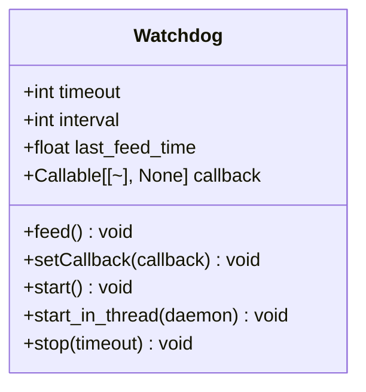
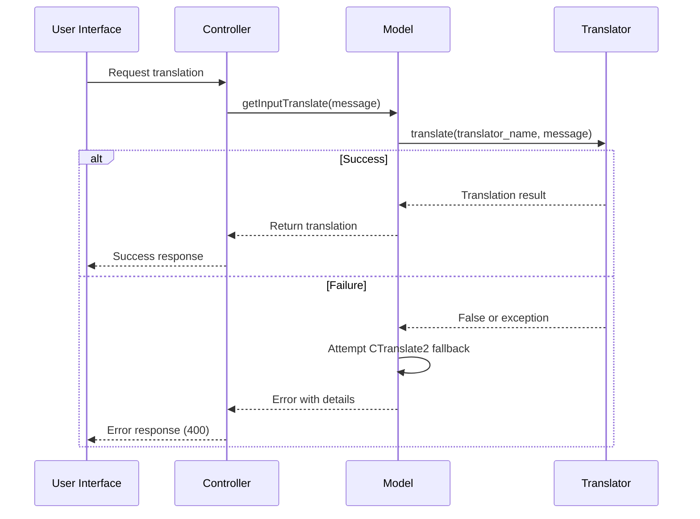
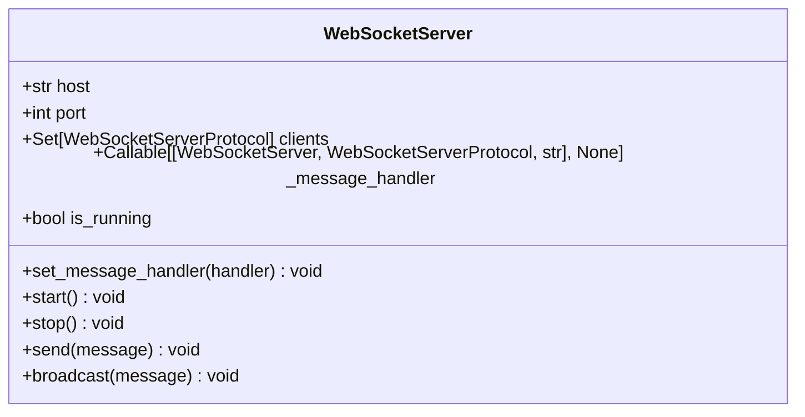

# Troubleshooting

<cite>
**Referenced Files in This Document**   
- [utils.py](file://src-python/utils.py)
- [controller.py](file://src-python/controller.py)
- [mainloop.py](file://src-python/mainloop.py)
- [device_manager.py](file://src-python/device_manager.py)
- [model.py](file://src-python/model.py)
- [config.py](file://src-python/config.py)
- [websocket_server.py](file://src-python/models/websocket/websocket_server.py)
- [osc.py](file://src-python/models/osc/osc.py)
- [watchdog.py](file://src-python/models/watchdog/watchdog.py)
</cite>

## Table of Contents
1. [Error Codes and Logging](#error-codes-and-logging)
2. [Watchdog System](#watchdog-system)
3. [Startup Issues](#startup-issues)
4. [Transcription and Translation Failures](#transcription-and-translation-failures)
5. [Audio Device and Permission Issues](#audio-device-and-permission-issues)
6. [Network and Communication Problems](#network-and-communication-problems)
7. [Performance Optimization](#performance-optimization)
8. [Known Issues and Workarounds](#known-issues-and-workarounds)

## Error Codes and Logging

The VRCT application uses a structured logging system to handle errors and provide diagnostic information. The primary error handling mechanism is implemented in `utils.py`, which contains functions for logging, error reporting, and response serialization.

The system uses two main log files:
- `process.log`: Records application events and structured responses
- `error.log`: Contains detailed exception tracebacks for debugging

Key error handling functions in `utils.py`:
- `printResponse(status, endpoint, result)`: Serializes and outputs structured responses. If JSON serialization fails, it logs the error and emits a generic 500 error payload.
- `errorLogging()`: Captures and logs the current exception traceback to `error.log`. This is the primary mechanism for recording detailed error information.
- `printLog(log, data)`: Records structured process log messages to `process.log`.

The application uses a standardized status code system:
- **200**: Success
- **348**: Process log message
- **400**: Client error (e.g., invalid request, device not found)
- **423**: Locked endpoint
- **500**: Internal server error

When errors occur, they are typically reported through the response system with descriptive messages that can be used for troubleshooting. For example, transcription failures due to missing devices are reported with status 400 and messages like "No mic device detected".

**Section sources**
- [utils.py](file://src-python/utils.py#L1-L293)
- [controller.py](file://src-python/controller.py#L1-L3133)
- [mainloop.py](file://src-python/mainloop.py#L1-L588)

## Watchdog System

The VRCT application implements a watchdog system to monitor application health and recover from crashes. The watchdog is implemented in `models/watchdog/watchdog.py` as a simple timer-based mechanism that must be periodically "fed" by the main application loop.

**Diagram sources** 
- [watchdog.py](file://src-python/models/watchdog/watchdog.py#L1-L104)

The watchdog system works as follows:
1. The watchdog is initialized with a timeout period (default 60 seconds) and an interval for checking (default 20 seconds).
2. The main application loop must call `feed()` periodically to reset the watchdog timer.
3. If the watchdog is not fed within the timeout period, it invokes a registered callback function.
4. In VRCT, this callback is connected to the application shutdown mechanism, allowing for graceful recovery from hangs or unresponsive states.

The watchdog is integrated into the main application flow through the `Model` class in `model.py`, which initializes the watchdog with configuration values from `config.py`. The main loop in `mainloop.py` is responsible for feeding the watchdog during normal operation.

The system uses a background thread implementation (`start_in_thread`) to continuously monitor the application state without blocking the main execution flow. This ensures that even if the main application becomes unresponsive, the watchdog can still trigger recovery actions.

**Section sources**
- [watchdog.py](file://src-python/models/watchdog/watchdog.py#L1-L104)
- [model.py](file://src-python/model.py#L1-L1204)
- [mainloop.py](file://src-python/mainloop.py#L1-L588)

## Startup Issues

Common startup issues in VRCT typically relate to missing models, configuration problems, or dependency initialization failures. The application follows a structured initialization sequence that can help diagnose startup problems.

The startup process begins in `mainloop.py`, which sets up the controller and mapping system before calling `controller.init()`. This initialization sequence includes:

1. **Configuration loading**: The `Config` class in `config.py` initializes with default values and attempts to load user settings from `config.json`.
2. **Device manager initialization**: `device_manager.py` is initialized to detect available audio devices.
3. **Model initialization**: The `Model` class in `model.py` initializes subsystems including translation, transcription, overlay, and communication components.
4. **Progress reporting**: The initialization progress is reported through the `initialization_progress` endpoint.

Common startup issues include:
- **Missing configuration file**: If `config.json` is missing or corrupted, the application will create a new one with default values.
- **Missing AI models**: Translation and transcription models are downloaded on demand. If the download fails, the corresponding features will be disabled.
- **Audio device detection failures**: If audio libraries (PyAudio, pycaw) are not available, the application will run with limited functionality.
- **Permission errors**: On some systems, access to audio devices may be blocked by system permissions or security software.

The application uses defensive programming in the initialization process, with try-except blocks around potentially failing operations. This prevents startup crashes due to missing optional components, allowing the application to run with reduced functionality rather than failing completely.

**Section sources**
- [mainloop.py](file://src-python/mainloop.py#L1-L588)
- [config.py](file://src-python/config.py#L1-L1027)
- [model.py](file://src-python/model.py#L1-L1204)
- [device_manager.py](file://src-python/device_manager.py#L1-L529)

## Transcription and Translation Failures

Transcription and translation failures in VRCT can occur due to various reasons, including model loading issues, resource constraints, and input validation problems. The error handling is primarily implemented in `controller.py` and `model.py`.

### Transcription Failures
Transcription failures are typically reported with status 400 and descriptive messages. Common causes include:
- **Missing or invalid audio devices**: If no microphone or speaker device is available, transcription will fail with "No mic device detected" or "No speaker device detected" messages.
- **VRAM/GPU memory issues**: When GPU memory is insufficient for model loading, the application detects this and disables the affected feature.
- **Model loading failures**: If transcription models (Whisper) are not downloaded or corrupted, transcription will be unavailable.

The transcription system uses energy threshold detection to determine when to start recording. Issues with threshold settings can cause transcription to fail to trigger or trigger too frequently.

### Translation Failures
Translation failures are handled through several mechanisms:
- **API rate limits**: When translation engines (DeepL, Gemini, etc.) return rate limit errors, the application detects this and may switch to alternative engines.
- **VRAM overflow**: The `detectVRAMError` method in `model.py` specifically checks for CUDA out of memory errors and other VRAM-related issues.
- **Authentication failures**: Invalid API keys for translation services are detected and reported.

The application implements a fallback mechanism where if one translation engine fails, it attempts to use CTranslate2 as a backup. This is handled in the `getTranslate` method of the `Model` class.

**Diagram sources** 
- [controller.py](file://src-python/controller.py#L1-L3133)
- [model.py](file://src-python/model.py#L1-L1204)

**Section sources**
- [controller.py](file://src-python/controller.py#L1-L3133)
- [model.py](file://src-python/model.py#L1-L1204)
- [utils.py](file://src-python/utils.py#L1-L293)

## Audio Device and Permission Issues

Audio device and permission issues are common in VRCT due to the application's reliance on system audio capture and playback. The device management system is implemented in `device_manager.py` and handles both microphone and speaker devices.

### Device Detection and Management
The application uses PyAudio and WASAPI (on Windows) to detect audio devices. Key components include:
- **Host detection**: Different audio APIs (e.g., MME, WASAPI) are treated as separate hosts.
- **Microphone devices**: Input devices are grouped by host and made available for selection.
- **Speaker devices**: Loopback devices are used to capture system audio output.

Common issues include:
- **No devices detected**: This can occur if audio drivers are not properly installed or if the application lacks permission to access audio devices.
- **Device conflicts**: Other applications using the same audio device can prevent VRCT from accessing it.
- **Default device changes**: The application monitors for device changes and updates the UI accordingly.

### Permission Issues
On modern operating systems, applications often require explicit permission to access microphone and audio output. Issues can arise when:
- **Microphone permission is denied**: The application cannot access the selected microphone device.
- **Audio loopback not available**: On some systems, capturing system audio output requires specific permissions or driver configurations.
- **Conflicting applications**: Other applications (e.g., communication software, audio editors) may have exclusive access to audio devices.

The application handles these issues gracefully by:
- Providing clear error messages when devices cannot be accessed
- Allowing users to select different devices through the configuration interface
- Implementing fallback mechanisms when primary devices are unavailable

**Section sources**
- [device_manager.py](file://src-python/device_manager.py#L1-L529)
- [model.py](file://src-python/model.py#L1-L1204)
- [controller.py](file://src-python/controller.py#L1-L3133)

## Network and Communication Problems

VRCT uses WebSocket and OSC (Open Sound Control) for communication with other applications and services. Issues with these communication channels can affect the application's functionality.

### WebSocket Communication
The WebSocket server is implemented in `models/websocket/websocket_server.py` and provides a bidirectional communication channel. Common issues include:

- **Port conflicts**: If the default WebSocket port (8765) is already in use, the server cannot start.
- **Firewall restrictions**: System firewalls may block WebSocket connections.
- **Client connection issues**: Network problems can prevent clients from connecting to the WebSocket server.

The application checks port availability using the `isAvailableWebSocketServer` function in `utils.py` before attempting to start the server. This helps prevent startup failures due to port conflicts.

**Diagram sources** 
- [websocket_server.py](file://src-python/models/websocket/websocket_server.py#L1-L222)

### OSC Communication
OSC communication is handled by the `OSCHandler` class in `models/osc/osc.py`. This component manages both sending OSC messages and receiving them via OSCQuery.

Common OSC issues include:
- **Network connectivity**: OSC messages are sent over UDP, which can be affected by network conditions.
- **IP address configuration**: The OSC target IP must be correctly configured, especially when communicating with applications on different machines.
- **Port conflicts**: The OSC port (default 9000) may be in use by another application.

The application supports OSCQuery for automatic discovery of VRChat parameters when running on localhost. This feature is automatically disabled when using remote IP addresses to avoid unnecessary network activity.

**Section sources**
- [websocket_server.py](file://src-python/models/websocket/websocket_server.py#L1-L222)
- [osc.py](file://src-python/models/osc/osc.py#L1-L241)
- [utils.py](file://src-python/utils.py#L1-L293)

## Performance Optimization

Performance issues in VRCT typically relate to CPU/GPU usage, latency, and memory consumption. The application provides several configuration options to optimize performance for different hardware setups.

### Compute Device Configuration
The application can utilize both CPU and GPU for model inference. Key performance settings include:
- **Compute mode**: Can be set to CPU or CUDA (GPU) mode depending on hardware availability.
- **Compute type**: For GPU, different precision types (float32, float16, int8) can be selected to balance performance and accuracy.
- **Device selection**: Users can select specific GPU devices when multiple are available.

The `getComputeDeviceList` and `getBestComputeType` functions in `utils.py` help determine the optimal configuration based on the available hardware.

### Latency Reduction
To reduce latency in transcription and translation:
- **Model size**: Smaller models (e.g., Whisper Tiny, Distil models) process faster but with reduced accuracy.
- **Batch processing**: The application processes audio in chunks to balance responsiveness and efficiency.
- **Energy thresholding**: Configurable thresholds prevent unnecessary processing when no speech is detected.

### Resource Management
The application implements several resource management strategies:
- **Model loading**: Models are loaded on demand rather than at startup to reduce initial memory usage.
- **Memory cleanup**: Unused resources are garbage collected when features are disabled.
- **Thread management**: Background tasks are carefully managed to avoid excessive CPU usage.

Users can optimize performance by:
- Selecting appropriate model sizes for their hardware
- Adjusting transcription settings (e.g., phrase timeout, record timeout)
- Disabling unused features to reduce resource consumption
- Using GPU acceleration when available

**Section sources**
- [utils.py](file://src-python/utils.py#L1-L293)
- [config.py](file://src-python/config.py#L1-L1027)
- [model.py](file://src-python/model.py#L1-L1204)

## Known Issues and Workarounds

Several known issues exist in VRCT, particularly related to specific hardware/software configurations. These issues and their workarounds are documented below.

### Windows Audio Configuration
- **Issue**: On some Windows systems, WASAPI loopback devices are not properly detected.
- **Workaround**: Restart the application after ensuring no other audio applications are running, or use alternative audio routing software.

### GPU Memory Management
- **Issue**: Large translation models may cause VRAM overflow on GPUs with limited memory.
- **Workaround**: Use smaller model variants or switch to CPU computation in the settings.

### Network Configuration
- **Issue**: Corporate firewalls or strict security software may block WebSocket or OSC communication.
- **Workaround**: Configure firewall exceptions for VRCT or use alternative communication methods.

### Audio Device Conflicts
- **Issue**: Exclusive mode audio applications can prevent VRCT from accessing audio devices.
- **Workaround**: Close conflicting applications or configure them to use shared mode audio access.

### Overlay Rendering
- **Issue**: On some graphics drivers, the overlay may not render correctly or may cause performance issues.
- **Workaround**: Update graphics drivers or adjust overlay settings (opacity, scaling) in the configuration.

These issues are actively monitored and addressed in ongoing development. Users experiencing persistent problems are encouraged to check for updates or report issues to the development team.

**Section sources**
- [utils.py](file://src-python/utils.py#L1-L293)
- [device_manager.py](file://src-python/device_manager.py#L1-L529)
- [model.py](file://src-python/model.py#L1-L1204)
- [config.py](file://src-python/config.py#L1-L1027)