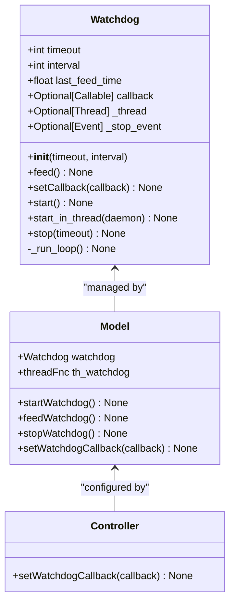
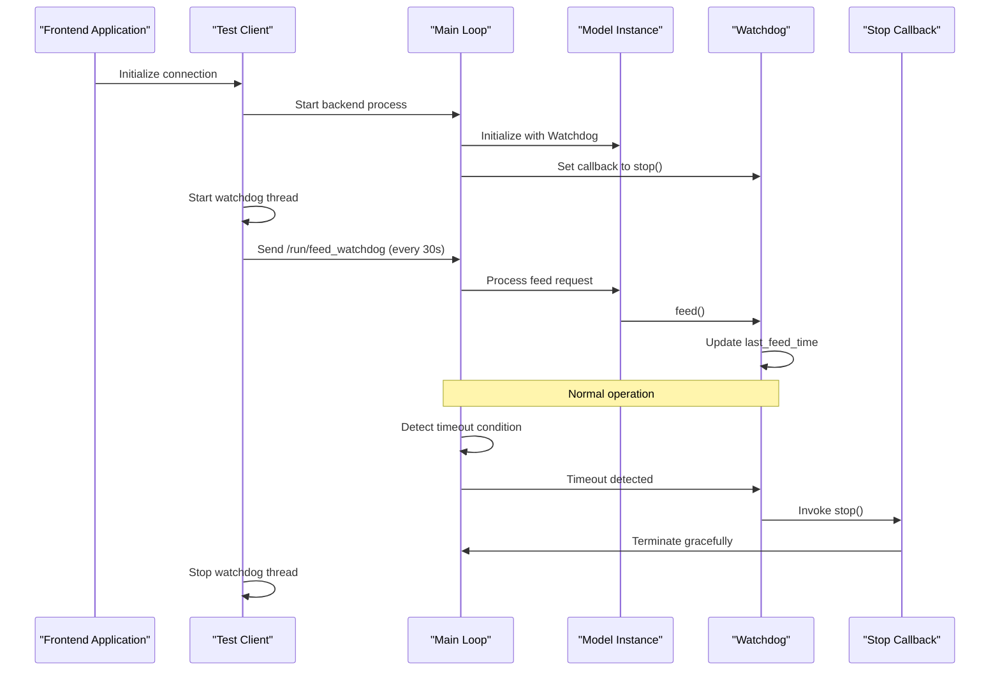
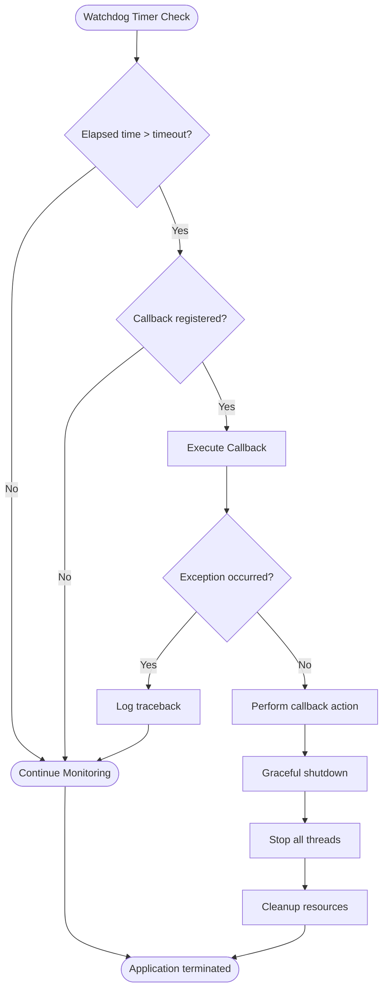

# Watchdog System

<cite>
**Referenced Files in This Document**
- [watchdog.py](file://src-python/models/watchdog/watchdog.py)
- [model.py](file://src-python/model.py)
- [mainloop.py](file://src-python/mainloop.py)
- [config.py](file://src-python/config.py)
- [controller.py](file://src-python/controller.py)
- [test_client.py](file://src-python/test_client.py)
- [websocket_server.md](file://src-python/docs/details/websocket_server.md)
- [watchdog.md](file://src-python/docs/details/watchdog.md)
</cite>

## Table of Contents
1. [Introduction](#introduction)
2. [Watchdog Class Implementation](#watchdog-class-implementation)
3. [Configuration Parameters](#configuration-parameters)
4. [Core Methods](#core-methods)
5. [Integration with VRCT Backend](#integration-with-vrct-backend)
6. [Frontend Communication Mechanism](#frontend-communication-mechanism)
7. [Callback System and Graceful Termination](#callback-system-and-graceful-termination)
8. [Monitoring Applications](#monitoring-applications)
9. [Troubleshooting Guide](#troubleshooting-guide)
10. [Best Practices](#best-practices)

## Introduction

The Watchdog system in VRCT is a lightweight, timeout-based monitoring utility designed to ensure application health through periodic "feeding" mechanisms. It provides a simple yet effective way to detect communication failures and system timeouts, particularly useful for maintaining UI-backend synchronization and detecting process availability issues.

The system operates on a fundamental principle: applications must periodically signal their continued operation ("feed" the watchdog) within specified intervals. If the watchdog detects a timeout period without receiving a feed signal, it triggers predefined callback functions to handle the situation appropriately.

## Watchdog Class Implementation

The Watchdog class serves as the core monitoring component with a minimalist design philosophy focused on reliability and simplicity.



**Diagram sources**
- [watchdog.py](file://src-python/models/watchdog/watchdog.py#L6-L104)
- [model.py](file://src-python/model.py#L132-L132)
- [model.py](file://src-python/model.py#L1097-L1114)

**Section sources**
- [watchdog.py](file://src-python/models/watchdog/watchdog.py#L6-L104)

## Configuration Parameters

The Watchdog system uses two primary configuration parameters that define its behavior:

### Timeout Parameter
- **Purpose**: Defines the maximum allowable time without a feed signal before triggering the callback
- **Default Value**: 60 seconds (configurable via `WATCHDOG_TIMEOUT`)
- **Unit**: Seconds
- **Behavior**: When the elapsed time since the last feed exceeds this value, the callback is invoked

### Interval Parameter  
- **Purpose**: Suggested sleep interval between consecutive watchdog checks
- **Default Value**: 20 seconds (configurable via `WATCHDOG_INTERVAL`)
- **Unit**: Seconds
- **Behavior**: Controls the frequency of timeout checks during continuous monitoring

### Configuration Integration

The Watchdog instances are configured through the VRCT configuration system:

```python
# Watchdog configuration in VRCT
self.watchdog = Watchdog(config.WATCHDOG_TIMEOUT, config.WATCHDOG_INTERVAL)
```

**Section sources**
- [watchdog.py](file://src-python/models/watchdog/watchdog.py#L20-L28)
- [config.py](file://src-python/config.py#L754-L755)
- [model.py](file://src-python/model.py#L131-L132)

## Core Methods

### Feed Method
The `feed()` method refreshes the watchdog timer by recording the current timestamp as the last feed time.

**Implementation Details:**
- Updates `last_feed_time` to `time.time()`
- No return value
- Thread-safe operation

### SetCallback Method
Registers a callback function to be executed when the watchdog times out.

**Implementation Details:**
- Accepts a zero-argument callable
- Stores the callback reference for later invocation
- Supports dynamic callback updates

### Start Method
Performs a single watchdog check and optionally sleeps for the interval period.

**Implementation Logic:**
1. Calculate elapsed time since last feed
2. Compare against timeout threshold
3. Invoke callback if timeout exceeded and callback is registered
4. Sleep for the specified interval (blocking operation)

**Thread Safety:** Not thread-safe for concurrent invocations

### StartInThread Method
Launches the watchdog in a background thread for continuous monitoring.

**Implementation Features:**
- Creates a daemon thread by default
- Uses internal run loop with event-based stopping
- Implements defensive thread lifecycle management

### Stop Method
Gracefully terminates the background watchdog thread.

**Implementation Details:**
- Sets stop event to signal thread termination
- Waits for thread completion with configurable timeout
- Performs resource cleanup and thread object nullification

**Section sources**
- [watchdog.py](file://src-python/models/watchdog/watchdog.py#L29-L104)

## Integration with VRCT Backend

The Watchdog system integrates seamlessly with VRCT's architecture through the Model class, providing centralized monitoring capabilities.



**Diagram sources**
- [mainloop.py](file://src-python/mainloop.py#L578-L588)
- [model.py](file://src-python/model.py#L1097-L1114)
- [test_client.py](file://src-python/test_client.py#L283-L301)

### Model Integration Methods

The Model class provides convenience methods for Watchdog management:

#### startWatchdog()
- Initializes and starts the watchdog monitoring thread
- Uses the custom `threadFnc` wrapper for enhanced thread management
- Daemon threads prevent blocking application exit

#### feedWatchdog()
- Provides a simplified interface for feeding the watchdog
- Ensures proper initialization before operation
- Centralized feed management point

#### stopWatchdog()
- Safely stops the watchdog monitoring thread
- Handles thread lifecycle and cleanup
- Prevents resource leaks

**Section sources**
- [model.py](file://src-python/model.py#L1097-L1114)

## Frontend Communication Mechanism

The Watchdog system relies on a heartbeat mechanism where the frontend must send periodic `/run/feed_watchdog` requests to maintain backend health detection.

### Heartbeat Protocol

**Frequency**: Every 30 seconds (hard-coded in the test client)
**Method**: Fire-and-forget requests (no response expected)
**Implementation**: JSON-encoded requests sent through stdin to the mainloop process

### Test Client Implementation

The test client automatically manages the watchdog heartbeat:

```python
def _start_watchdog(self):
    """Start watchdog thread (30-second intervals sending /run/feed_watchdog)"""
    def _watchdog_loop():
        while not self._watchdog_stop_event.is_set():
            if self._watchdog_stop_event.wait(timeout=30):
                break
            if self.process.poll() is None:
                try:
                    request = {"endpoint": "/run/feed_watchdog"}
                    request_json = json.dumps(request, ensure_ascii=False)
                    self.process.stdin.write(request_json + '\n')
                    self.process.stdin.flush()
                except Exception as e:
                    print(f"[Watchdog] Send error: {e}")
                    break
```

### Endpoint Handler Integration

The mainloop processes `/run/feed_watchdog` requests through the standard endpoint handler system:

**Processing Flow:**
1. Request received via stdin
2. Endpoint mapped to handler function
3. Handler calls `model.feedWatchdog()`
4. Watchdog timer refreshed
5. Response sent (typically empty)

**Section sources**
- [test_client.py](file://src-python/test_client.py#L283-L301)
- [mainloop.py](file://src-python/mainloop.py#L503-L505)

## Callback System and Graceful Termination

The Watchdog system implements a sophisticated callback mechanism that enables graceful application termination when communication failures are detected.

### Callback Registration

The mainloop establishes the callback relationship during initialization:

```python
# Mainloop initialization sets up the callback
main_instance.controller.setWatchdogCallback(main_instance.stop)
```

### Callback Execution Flow



**Diagram sources**
- [watchdog.py](file://src-python/models/watchdog/watchdog.py#L47-L56)
- [mainloop.py](file://src-python/mainloop.py#L581)

### Error Handling and Resilience

The Watchdog implementation includes several resilience mechanisms:

**Exception Isolation:**
- Callback exceptions are caught and logged but don't propagate
- Prevents watchdog failure from affecting application stability
- Maintains monitoring capability even with problematic callbacks

**Thread Safety:**
- Event-based thread coordination for safe shutdown
- Proper resource cleanup during termination
- Defensive programming against race conditions

**Section sources**
- [watchdog.py](file://src-python/models/watchdog/watchdog.py#L47-L56)
- [mainloop.py](file://src-python/mainloop.py#L581)

## Monitoring Applications

The Watchdog system can be adapted for various monitoring scenarios beyond VRCT's primary use case.

### VRChat Process Availability Monitoring

```python
class VRChatMonitor:
    def __init__(self):
        self.watchdog = Watchdog(timeout=60, interval=30)
        self.watchdog.setCallback(self.on_vrchat_timeout)
    
    def on_vrchat_timeout(self):
        print("VRChat process not responding")
        if self.is_vrchat_running():
            self.restart_vrchat()
        else:
            self.start_vrchat()
    
    def feed_watchdog(self):
        self.watchdog.feed()
```

### Network Connectivity Monitoring

```python
class NetworkWatchdog:
    def __init__(self, target_host="8.8.8.8"):
        self.watchdog = Watchdog(timeout=45, interval=15)
        self.watchdog.setCallback(self.on_network_timeout)
    
    def on_network_timeout(self):
        print("Network connectivity issue detected")
        self.attempt_reconnection()
    
    def check_network_continuously(self):
        self.watchdog.start_in_thread(daemon=True)
        while True:
            if self.ping_host(self.target_host):
                self.watchdog.feed()
            time.sleep(10)
```

### Process Health Monitoring

```python
class ProcessMonitor:
    def __init__(self, process_name):
        self.watchdog = Watchdog(timeout=60, interval=20)
        self.watchdog.setCallback(self.on_process_timeout)
    
    def on_process_timeout(self):
        print(f"Process {self.process_name} timed out")
        self.restart_process()
    
    def feed_watchdog(self):
        if self.is_process_running():
            self.watchdog.feed()
```

**Section sources**
- [watchdog.md](file://src-python/docs/details/watchdog.md#L164-L236)
- [watchdog.md](file://src-python/docs/details/watchdog.md#L238-L318)

## Troubleshooting Guide

### Common Issues and Solutions

#### Unexpected Backend Termination

**Symptoms:**
- Backend process terminates unexpectedly
- Watchdog timeout messages in logs
- Frontend loses connection

**Diagnosis Steps:**
1. Check if `/run/feed_watchdog` requests are being sent
2. Verify frontend connection stability
3. Review backend logs for error patterns
4. Monitor system resource usage

**Solutions:**
- Ensure test client is running and connected
- Increase watchdog timeout for unstable networks
- Implement retry mechanisms in frontend

#### Thread Management Problems

**Symptoms:**
- Memory leaks over time
- Threads not terminating properly
- Resource contention issues

**Diagnosis Steps:**
1. Monitor thread count and lifecycle
2. Check for unhandled exceptions in callbacks
3. Verify proper shutdown sequences

**Solutions:**
- Use daemon threads for background monitoring
- Implement proper exception handling in callbacks
- Ensure all threads are joined during shutdown

#### Communication Failures

**Symptoms:**
- Watchdog timeouts despite active frontend
- Intermittent connection drops
- High latency in response times

**Diagnosis Steps:**
1. Measure network latency and reliability
2. Check for firewall or proxy interference
3. Monitor system load and resource availability

**Solutions:**
- Adjust heartbeat frequency based on network conditions
- Implement connection recovery mechanisms
- Use alternative communication channels

### Debugging Techniques

#### Enable Verbose Logging

```python
import logging
logging.basicConfig(level=logging.DEBUG)

# Add debug statements to monitor watchdog state
def debug_watchdog_state(watchdog):
    print(f"Last feed: {watchdog.last_feed_time}")
    print(f"Current time: {time.time()}")
    print(f"Elapsed: {time.time() - watchdog.last_feed_time}")
    print(f"Timeout: {watchdog.timeout}")
```

#### Monitor Thread Activity

```python
def monitor_threads():
    import threading
    active_threads = threading.enumerate()
    print(f"Active threads: {len(active_threads)}")
    for thread in active_threads:
        print(f"  - {thread.name}")
```

**Section sources**
- [watchdog.md](file://src-python/docs/details/watchdog.md#L522-L608)

## Best Practices

### Configuration Guidelines

1. **Timeout Selection**: Choose timeout values based on expected communication patterns
   - Shorter timeouts (30-60 seconds) for real-time applications
   - Longer timeouts (120+ seconds) for batch or less frequent operations

2. **Interval Tuning**: Balance responsiveness with system load
   - Frequent checks (5-10 seconds) for critical systems
   - Moderate checks (20-30 seconds) for general monitoring
   - Infrequent checks (60+ seconds) for low-priority monitoring

### Implementation Patterns

1. **Centralized Management**: Use the Model class methods for consistent Watchdog management
2. **Exception Handling**: Always wrap callback logic in try-catch blocks
3. **Resource Cleanup**: Ensure proper thread termination and resource release
4. **Testing**: Implement comprehensive testing for timeout scenarios

### Performance Considerations

1. **Memory Footprint**: Watchdog has minimal memory overhead
2. **CPU Usage**: Single-threaded operation minimizes CPU impact
3. **Network Impact**: Fire-and-forget heartbeats minimize bandwidth usage
4. **Scalability**: Watchdog scales linearly with monitoring requirements

### Security Considerations

1. **Callback Validation**: Validate callback functions before registration
2. **Thread Safety**: Ensure callbacks are thread-safe
3. **Resource Access**: Limit callback access to necessary resources only
4. **Error Reporting**: Implement secure error logging and reporting

The Watchdog system provides a robust foundation for application health monitoring in VRCT, enabling reliable detection of communication failures and system timeouts while maintaining minimal resource overhead and maximum reliability.