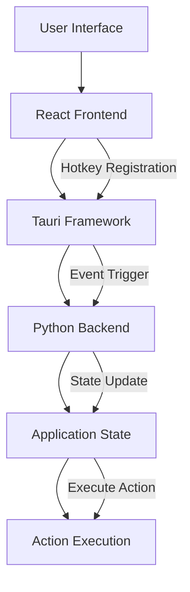
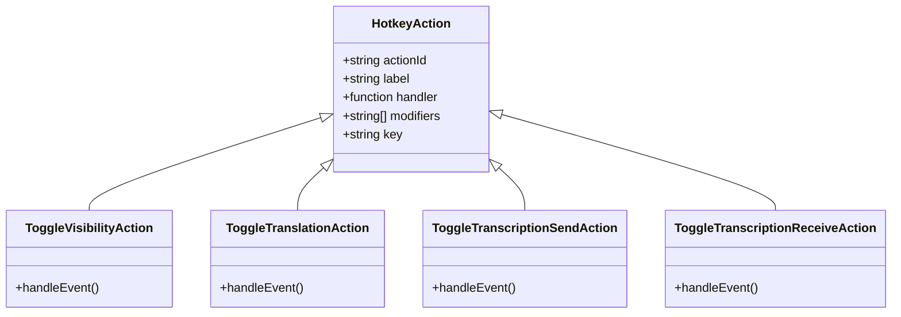
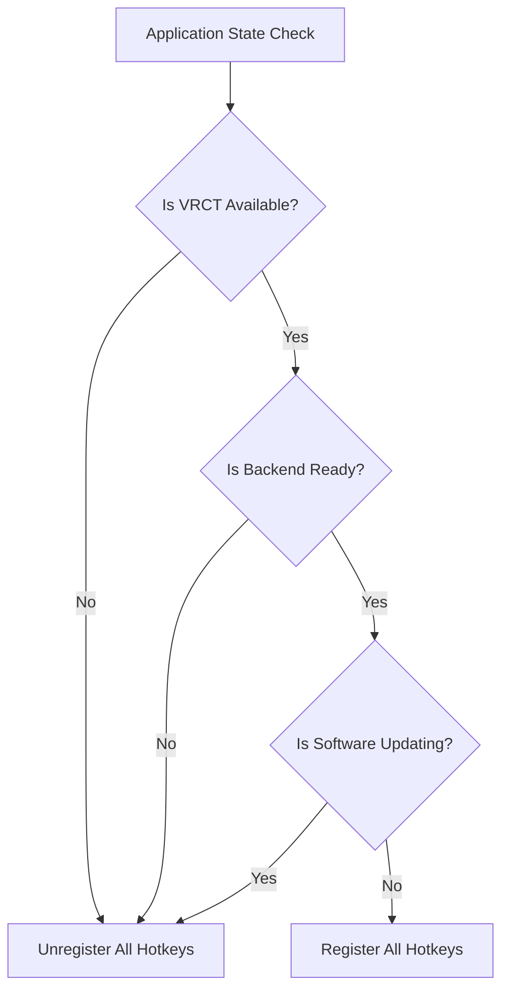
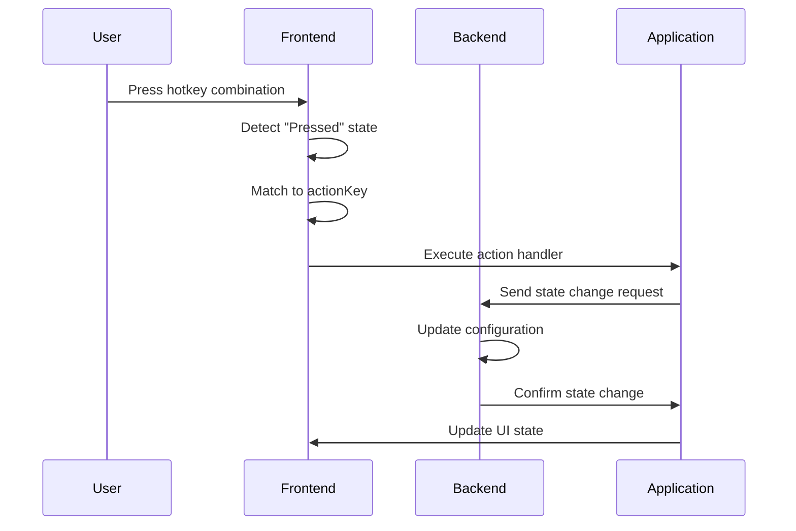
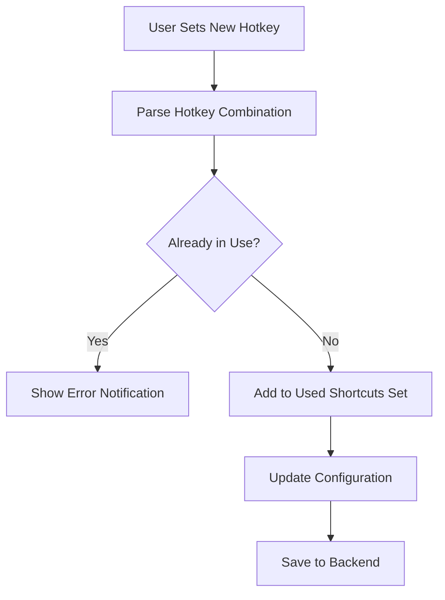

# Hotkey Configuration

<cite>
**Referenced Files in This Document**   
- [useHotkeys.js](file://src-ui/logics/configs/config_page_setter/hotkeys/useHotkeys.js)
- [GlobalHotKeyController.jsx](file://src-ui/views/app/_app_controllers/GlobalHotKeyController.jsx)
- [Hotkeys.jsx](file://src-ui/views/app/config_page/setting_section/setting_box/hotkeys/Hotkeys.jsx)
- [controller.py](file://src-python/controller.py)
- [config.py](file://src-python/config.py)
- [useMainFunction.js](file://src-ui/logics/main/useMainFunction.js)
</cite>

## Table of Contents
1. [Introduction](#introduction)
2. [Hotkey Architecture Overview](#hotkey-architecture-overview)
3. [Available Hotkey Actions](#available-hotkey-actions)
4. [Hotkey Registration and Management](#hotkey-registration-and-management)
5. [Configuration Interface](#configuration-interface)
6. [Conflict Resolution and Privilege Requirements](#conflict-resolution-and-privilege-requirements)
7. [Optimal Hotkey Setups for VR Scenarios](#optimal-hotkey-setups-for-vr-scenarios)
8. [Troubleshooting Common Issues](#troubleshooting-common-issues)

## Introduction

This document provides comprehensive information about the hotkey configuration system in VRCT (Virtual Reality Chat Translator). The application implements a global hotkey system that allows users to control core functionality through customizable keyboard shortcuts. The system is built on the Tauri framework for frontend hotkey registration and a Python backend for event handling and state management. This documentation covers the architecture, available actions, configuration process, and troubleshooting for the hotkey system.

## Hotkey Architecture Overview

The VRCT hotkey system follows a layered architecture with clear separation between frontend and backend components. The React frontend handles hotkey registration and user interface, while the Python backend manages application state and executes actions. The Tauri framework bridges these components, enabling secure communication between the frontend and backend.

**Diagram sources**
- [useHotkeys.js](file://src-ui/logics/configs/config_page_setter/hotkeys/useHotkeys.js)
- [controller.py](file://src-python/controller.py)

**Section sources**
- [useHotkeys.js](file://src-ui/logics/configs/config_page_setter/hotkeys/useHotkeys.js)
- [controller.py](file://src-python/controller.py)

## Available Hotkey Actions

VRCT provides several hotkey actions that allow users to quickly toggle core functionality:

- **Toggle VRCT Visibility**: Shows or hides the main application window
- **Toggle Translation**: Enables or disables the translation feature
- **Toggle Transcription Send**: Controls microphone transcription for outgoing messages
- **Toggle Transcription Receive**: Controls speaker transcription for incoming messages

These actions are defined in the hotkey configuration system and mapped to specific functions in the application. Each action corresponds to a specific endpoint in the Python controller that handles the state change.

**Diagram sources**
- [useHotkeys.js](file://src-ui/logics/configs/config_page_setter/hotkeys/useHotkeys.js)
- [controller.py](file://src-python/controller.py)

**Section sources**
- [useHotkeys.js](file://src-ui/logics/configs/config_page_setter/hotkeys/useHotkeys.js)
- [controller.py](file://src-python/controller.py)

## Hotkey Registration and Management

The hotkey registration system is managed through the Tauri plugin `@tauri-apps/plugin-global-shortcut`. The registration process is conditional and only occurs when the application is ready and not updating.

### Registration Process

The `GlobalHotKeyController` component manages the lifecycle of hotkey registration:

1. It monitors three state conditions: backend readiness, software update status, and application availability
2. When all conditions are met (application available, backend ready, not updating), it calls `registerShortcuts()`
3. If any condition fails, it calls `unregisterAll()` to remove existing hotkeys

**Diagram sources**
- [GlobalHotKeyController.jsx](file://src-ui/views/app/_app_controllers/GlobalHotKeyController.jsx)
- [useHotkeys.js](file://src-ui/logics/configs/config_page_setter/hotkeys/useHotkeys.js)

The actual registration is handled by the `useHotkeys` hook, which:

1. Unregisters all existing shortcuts
2. Iterates through the configured hotkeys
3. Registers each hotkey with its corresponding action handler
4. Handles the "Pressed" event state to prevent multiple triggers

When a hotkey is pressed, the system performs the following sequence:

**Diagram sources**
- [useHotkeys.js](file://src-ui/logics/configs/config_page_setter/hotkeys/useHotkeys.js)
- [controller.py](file://src-python/controller.py)

**Section sources**
- [useHotkeys.js](file://src-ui/logics/configs/config_page_setter/hotkeys/useHotkeys.js)
- [GlobalHotKeyController.jsx](file://src-ui/views/app/_app_controllers/GlobalHotKeyController.jsx)

## Configuration Interface

The hotkey configuration interface allows users to record and save custom hotkey combinations through an intuitive UI. The interface is implemented in the `Hotkeys` component and uses the `useHotkeys` hook for state management.

### Configuration Components

The configuration system consists of several React components:

- **Hotkeys**: Main container component that renders the hotkey settings section
- **HotkeysEntryContainer**: Template component for individual hotkey entries
- **useHotkeys**: Custom hook that manages hotkey state and provides configuration functions

The configuration process involves:

1. Retrieving current hotkey settings from the backend via `/get/data/hotkeys`
2. Displaying existing hotkey assignments in the UI
3. Allowing users to record new combinations
4. Validating for conflicts before saving
5. Sending updated configuration to backend via `/set/data/hotkeys`

### Conflict Detection

The system implements conflict detection to prevent multiple actions from using the same hotkey combination:

The `setHotkeys` function in `useHotkeys.js` handles conflict detection by maintaining a `Set` of used shortcuts and validating new assignments against this set.

**Section sources**
- [Hotkeys.jsx](file://src-ui/views/app/config_page/setting_section/setting_box/hotkeys/Hotkeys.jsx)
- [useHotkeys.js](file://src-ui/logics/configs/config_page_setter/hotkeys/useHotkeys.js)

## Conflict Resolution and Privilege Requirements

### Hotkey Conflicts with Other Applications

Global hotkeys may conflict with other applications, particularly games and productivity software. To resolve conflicts:

1. **Choose unique combinations**: Use modifier keys (Ctrl, Alt, Shift, Meta) with less common keys
2. **Avoid game controls**: Steer clear of WASD, arrow keys, and common game control keys
3. **Test in context**: Verify hotkeys work while the target application is active

The system automatically handles conflicts within VRCT by preventing duplicate hotkey assignments.

### Elevated Privileges Requirement

Global hotkeys require elevated privileges to function properly, especially when the application is minimized or running in the background. This is due to operating system security restrictions on global input monitoring.

To ensure hotkey functionality:

1. **Run with appropriate permissions**: On Windows, run as administrator if necessary
2. **Configure antivirus exceptions**: Some security software may block global hotkey registration
3. **Enable accessibility permissions**: On macOS, grant accessibility permissions to the application

The hotkey system is designed to work when the application is minimized through the window management functions in the Tauri `appWindow` object, which can restore focus to the application when a hotkey is pressed.

**Section sources**
- [useHotkeys.js](file://src-ui/logics/configs/config_page_setter/hotkeys/useHotkeys.js)
- [GlobalHotKeyController.jsx](file://src-ui/views/app/_app_controllers/GlobalHotKeyController.jsx)

## Optimal Hotkey Setups for VR Scenarios

### VR Chat Scenarios

For typical VR chat scenarios, the following hotkey setup is recommended:

- **Toggle Translation**: Ctrl+Shift+T
- **Toggle Transcription Send**: Ctrl+Shift+R
- **Toggle Transcription Receive**: Ctrl+Shift+E
- **Toggle VRCT Visibility**: Ctrl+Shift+V

This setup uses a consistent modifier pattern (Ctrl+Shift) with mnemonic keys (T=Translation, R=Record, E=Ear, V=Visibility).

### Gaming Scenarios

When playing VR games, avoid conflicts with common game controls:

- **Toggle Translation**: Ctrl+Alt+T
- **Toggle Transcription Send**: Ctrl+Alt+R
- **Toggle Transcription Receive**: Ctrl+Alt+E
- **Toggle VRCT Visibility**: Ctrl+Alt+V

Using the Alt key instead of Shift reduces conflicts with movement controls.

### Streaming Scenarios

For streamers who need quick access to translation controls:

- **Toggle Translation**: Ctrl+Shift+1
- **Toggle Transcription Send**: Ctrl+Shift+2
- **Toggle Transcription Receive**: Ctrl+Shift+3
- **Toggle VRCT Visibility**: Ctrl+Shift+0

Number keys provide quick access and are less likely to conflict with game controls.

**Section sources**
- [useHotkeys.js](file://src-ui/logics/configs/config_page_setter/hotkeys/useHotkeys.js)
- [controller.py](file://src-python/controller.py)

## Troubleshooting Common Issues

### Hotkeys Not Registering

If hotkeys fail to register, check the following:

1. **Application state**: Ensure the backend is ready and not updating
2. **Permissions**: Verify the application has necessary privileges
3. **Conflicts**: Check for duplicate hotkey assignments
4. **Antivirus**: Temporarily disable security software to test

The system logs registration failures to the console, which can be accessed through the developer tools.

### Game Control Conflicts

To resolve conflicts with game controls:

1. **Change modifier keys**: Use different combinations of Ctrl, Alt, Shift, Meta
2. **Use function keys**: F1-F12 keys are less commonly used in games
3. **Add multiple modifiers**: Use three-key combinations (e.g., Ctrl+Alt+Shift+T)

### Elevated Privileges Issues

If hotkeys don't work when the application is minimized:

1. **Run as administrator**: On Windows, right-click and select "Run as administrator"
2. **Check accessibility settings**: On macOS, ensure VRCT is in the Accessibility list
3. **Disable conflicting software**: Some keyboard utilities may interfere with global hotkeys

The hotkey system includes error handling that logs registration failures to help diagnose these issues.

**Section sources**
- [useHotkeys.js](file://src-ui/logics/configs/config_page_setter/hotkeys/useHotkeys.js)
- [GlobalHotKeyController.jsx](file://src-ui/views/app/_app_controllers/GlobalHotKeyController.jsx)
- [controller.py](file://src-python/controller.py)