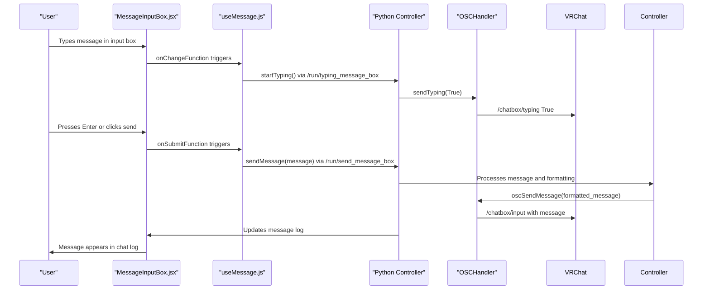
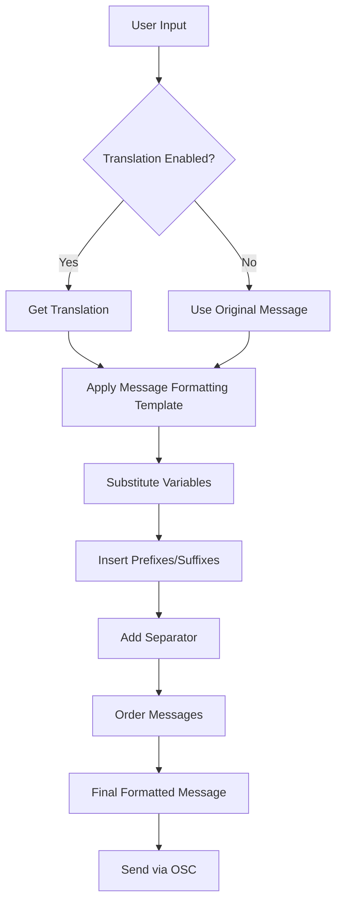
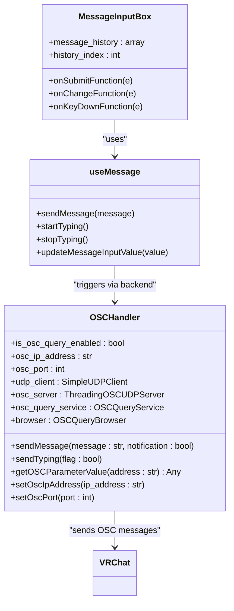
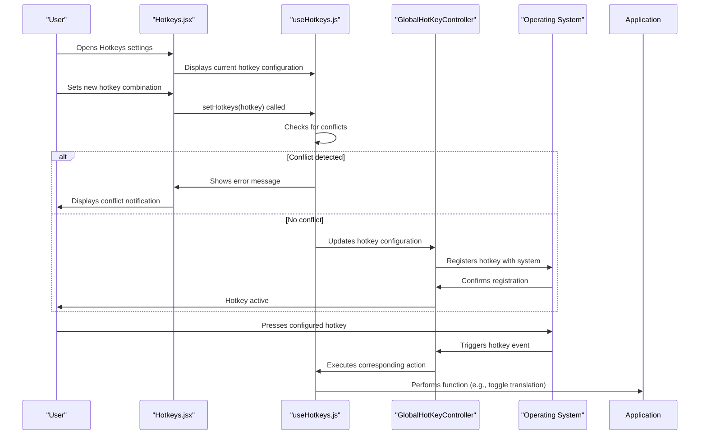

# Message Sending

<cite>
**Referenced Files in This Document**   
- [osc.py](file://src-python/models/osc/osc.py)
- [MessageInputBox.jsx](file://src-ui/views/app/main_page/main_section/message_container/message_input_box/MessageInputBox.jsx)
- [useMessage.js](file://src-ui/logics/common/useMessage.js)
- [controller.py](file://src-python/controller.py)
- [useHotkeys.js](file://src-ui/logics/configs/config_page_setter/hotkeys/useHotkeys.js)
- [GlobalHotKeyController.jsx](file://src-ui/views/app/_app_controllers/GlobalHotKeyController.jsx)
- [Hotkeys.jsx](file://src-ui/views/app/config_page/setting_section/setting_box/hotkeys/Hotkeys.jsx)
- [MessageFormat.jsx](file://src-ui/views/app/config_page/setting_section/setting_box/_components/message_format/MessageFormat.jsx)
- [mainloop.py](file://src-python/mainloop.py)
</cite>

## Table of Contents
1. [Introduction](#introduction)
2. [Message Input and Transmission](#message-input-and-transmission)
3. [Message Formatting and Templates](#message-formatting-and-templates)
4. [OSC Communication System](#osc-communication-system)
5. [Hotkey Configuration](#hotkey-configuration)
6. [Troubleshooting Message Delivery Issues](#troubleshooting-message-delivery-issues)

## Introduction
This document provides comprehensive documentation for the message sending capabilities in VRCT (VRChat Translator). The system enables users to manually input messages through a message input box and send them to VRChat via the OSC (Open Sound Control) protocol. The documentation covers message formatting options, including variable substitution and template usage, the integration between the UI input component and the OSC messaging system, hotkey configuration for message input, and troubleshooting common issues. The architecture involves React components for the user interface and a Python backend that processes OSC transmissions, creating a seamless experience for sending translated messages in VRChat.

## Message Input and Transmission

The message sending functionality in VRCT is centered around a message input box that allows users to compose and send messages to VRChat. The React component `MessageInputBox` handles the user interface for message input, while the backend Python code processes the message transmission via OSC protocol. When a user types in the message input box, the system tracks the typing state and sends appropriate OSC messages to indicate when the user is typing. This creates a realistic typing experience in VRChat where other users can see when someone is composing a message.

The message input process begins when a user types in the text area. The `onChangeFunction` in the `MessageInputBox` component detects changes and updates the message input value in the application state. When the user types, the `startTyping()` function is called, which sends a typing indicator to VRChat. When the user stops typing (the input field loses focus or becomes empty), the `stopTyping()` function is called to indicate that typing has ended. This mimics the native VRChat typing indicator that appears when users are composing messages.

To send a message, the user can either press Enter (unless configured otherwise) or click the send button. The `onSubmitFunction` handles the message submission process. It first validates that the message is not empty, then calls the `sendMessage()` function with the message content. After sending, if the "Auto Clear Message Input Box" setting is enabled, the input field is automatically cleared. The system also maintains a message history that can be accessed using Shift + Up/Down arrow keys, allowing users to quickly resend previous messages.

**Diagram sources**
- [MessageInputBox.jsx](file://src-ui/views/app/main_page/main_section/message_container/message_input_box/MessageInputBox.jsx)
- [useMessage.js](file://src-ui/logics/common/useMessage.js)
- [controller.py](file://src-python/controller.py)
- [osc.py](file://src-python/models/osc/osc.py)

**Section sources**
- [MessageInputBox.jsx](file://src-ui/views/app/main_page/main_section/message_container/message_input_box/MessageInputBox.jsx)
- [useMessage.js](file://src-ui/logics/common/useMessage.js)

## Message Formatting and Templates

VRCT provides extensive message formatting options that allow users to customize how messages appear when sent to VRChat. The message formatting system supports variable substitution and template usage, enabling users to create consistent message formats for both sent and received messages. The formatting configuration is accessible through the "Others" section in the settings menu, where users can define prefixes, suffixes, separators, and the order of original and translated messages.

The message formatting system uses a structured configuration with several key components: message prefix and suffix, translation prefix and suffix, separator, and message order. Users can define custom text to appear before and after both the original message and its translation. The separator determines what text appears between the original message and translation. The message order can be swapped to show either the original message first or the translation first, providing flexibility based on user preference.

For template usage, VRCT provides example previews that dynamically update as users modify the formatting options. These examples use common phrases in different languages (English, Japanese, Korean, French) to demonstrate how messages will appear. The system also supports special characters like newlines, which can be entered using "\n" in the input fields and are automatically converted to actual line breaks in the final message. This allows users to create multi-line message formats for more complex messaging needs.

The formatting configuration is stored in the application settings and applied whenever a message is sent. When translation is enabled, the system automatically formats the message according to the configured template, combining the original message, translation, and formatting elements into a single string that is sent to VRChat. This ensures consistency across all messages and reduces the need for manual formatting by the user.

**Diagram sources**
- [MessageFormat.jsx](file://src-ui/views/app/config_page/setting_section/setting_box/_components/message_format/MessageFormat.jsx)
- [controller.py](file://src-python/controller.py)

**Section sources**
- [MessageFormat.jsx](file://src-ui/views/app/config_page/setting_section/setting_box/_components/message_format/MessageFormat.jsx)
- [controller.py](file://src-python/controller.py)

## OSC Communication System

The OSC (Open Sound Control) communication system in VRCT is implemented through the `OSCHandler` class in the Python backend. This system handles the transmission of messages from VRCT to VRChat using the OSC protocol, which is a communications protocol for multimedia systems. The OSC handler manages the connection to VRChat, sends messages, and can also receive OSC messages from VRChat for bidirectional communication.

The core functionality of the OSC system revolves around two main endpoints: `/chatbox/typing` and `/chatbox/input`. The `/chatbox/typing` endpoint is used to indicate when the user is typing, which triggers the typing indicator in VRChat. The `/chatbox/input` endpoint is used to send the actual message content to the VRChat chatbox. When a message is sent, it is transmitted as an OSC message with three parameters: the message text, a boolean flag for clearing the chatbox, and a notification flag for whether to play a sound and visual notification.

The OSC handler is configured with the target IP address and port number, which by default is set to localhost (127.0.0.1) on port 9000, matching VRChat's default OSC settings. The system supports both local and remote VRChat instances, with OSCQuery functionality automatically disabled for remote connections to ensure compatibility. The message transmission process includes error handling and defensive programming to ensure reliable communication even in suboptimal network conditions.

When a message is sent from the UI, the request is forwarded through the application's routing system to the controller, which processes the message formatting and then calls the OSC handler's `sendMessage` method. The OSC handler then packages the formatted message into an OSC packet and sends it via UDP to the configured VRChat instance. This end-to-end process ensures that messages are transmitted efficiently and reliably from the user interface to the VRChat environment.

**Diagram sources**
- [osc.py](file://src-python/models/osc/osc.py)
- [MessageInputBox.jsx](file://src-ui/views/app/main_page/main_section/message_container/message_input_box/MessageInputBox.jsx)
- [useMessage.js](file://src-ui/logics/common/useMessage.js)

**Section sources**
- [osc.py](file://src-python/models/osc/osc.py)
- [controller.py](file://src-python/controller.py)

## Hotkey Configuration

The hotkey configuration system in VRCT allows users to set custom keyboard shortcuts for various functions, including opening the message input box and sending messages. The system is implemented through the `useHotkeys` React hook and the `GlobalHotKeyController` component, which work together to register, manage, and respond to global keyboard shortcuts.

Users can configure hotkeys through the settings menu under the "Hotkeys" section. Each function that supports hotkeys has a dedicated entry where users can press a key combination to set the shortcut. The system prevents conflicts by checking if a hotkey is already in use and displaying an error message if a conflict is detected. When a user sets a hotkey, the configuration is saved and registered with the operating system to ensure the shortcut works even when VRCT is not in focus.

The hotkey system supports standard modifier keys (Ctrl, Shift, Alt, and Meta/Windows) combined with regular keys. When a hotkey is pressed, the corresponding action is triggered. For example, the "Toggle Translation" hotkey will enable or disable the translation feature, while the "Toggle Transcription Send" hotkey will start or stop voice transcription. The system also includes a hotkey to toggle VRCT visibility, allowing users to quickly show or hide the application interface.

The registration of hotkeys is handled by the `GlobalHotKeyController`, which listens for changes in the application state. When VRCT is ready and not updating, the controller registers all configured hotkeys with the operating system. If VRCT is closed or updating, the hotkeys are unregistered to prevent unintended actions. This ensures that hotkeys only work when VRCT is properly running and available.

**Diagram sources**
- [useHotkeys.js](file://src-ui/logics/configs/config_page_setter/hotkeys/useHotkeys.js)
- [Hotkeys.jsx](file://src-ui/views/app/config_page/setting_section/setting_box/hotkeys/Hotkeys.jsx)
- [GlobalHotKeyController.jsx](file://src-ui/views/app/_app_controllers/GlobalHotKeyController.jsx)

**Section sources**
- [useHotkeys.js](file://src-ui/logics/configs/config_page_setter/hotkeys/useHotkeys.js)
- [Hotkeys.jsx](file://src-ui/views/app/config_page/setting_section/setting_box/hotkeys/Hotkeys.jsx)
- [GlobalHotKeyController.jsx](file://src-ui/views/app/_app_controllers/GlobalHotKeyController.jsx)

## Troubleshooting Message Delivery Issues

When experiencing issues with message delivery in VRCT, several common problems may occur, each with specific troubleshooting steps. The most frequent issues include messages not sending, incorrect message formatting, and hotkey conflicts. Understanding the system architecture and configuration options is essential for diagnosing and resolving these problems.

For messages not sending, the first step is to verify the OSC connection settings. Ensure that the IP address and port in VRCT match those configured in VRChat (typically 127.0.0.1:9000). Check that VRChat is running and that the "Allow OSC" setting is enabled in VRChat's settings under "Developer". If messages still don't send, try restarting both VRCT and VRChat, as connection states can sometimes become corrupted. Additionally, check the firewall settings to ensure that UDP traffic on port 9000 is not being blocked.

For incorrect formatting issues, verify the message formatting configuration in the "Others" settings section. Check that the prefixes, suffixes, separator, and message order are correctly configured according to your preferences. If special characters like newlines are not working, ensure that "\n" is used in the input fields rather than actual line breaks. Test the formatting with the preview examples to confirm that messages appear as expected before sending.

Hotkey conflicts can occur when multiple applications register the same keyboard shortcut. In VRCT, the system prevents multiple functions from using the same hotkey, but conflicts with other applications are possible. If a hotkey is not working, try changing it to a different combination. Ensure that no other applications are using the same shortcut, particularly other voice chat or streaming software. The hotkey registration status can be verified in the settings, where active hotkeys are displayed.

Other potential issues include the message input box not appearing, which may be resolved by checking the "Toggle VRCT Visibility" hotkey or restarting the application. If typing indicators are not appearing in VRChat, verify that the "Send Typing Status" setting is enabled in VRCT. For persistent issues, checking the application logs may provide additional diagnostic information about what is preventing message transmission.

**Section sources**
- [osc.py](file://src-python/models/osc/osc.py)
- [MessageInputBox.jsx](file://src-ui/views/app/main_page/main_section/message_container/message_input_box/MessageInputBox.jsx)
- [useHotkeys.js](file://src-ui/logics/configs/config_page_setter/hotkeys/useHotkeys.js)
- [controller.py](file://src-python/controller.py)