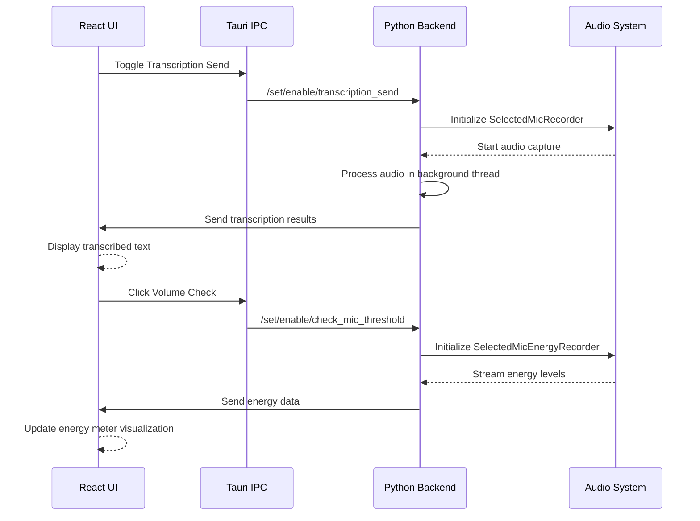
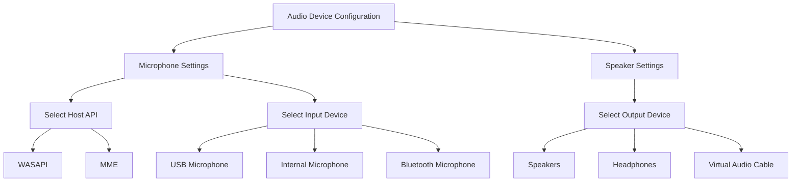
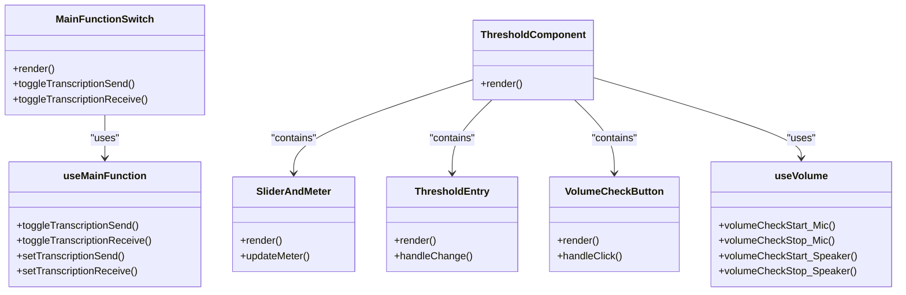

# Real-time Transcription

<cite>
**Referenced Files in This Document**   
- [transcription_recorder.py](file://src-python/models/transcription/transcription_recorder.py)
- [transcription_transcriber.py](file://src-python/models/transcription/transcription_transcriber.py)
- [transcription_whisper.py](file://src-python/models/transcription/transcription_whisper.py)
- [ThresholdComponent.jsx](file://src-ui/views/app/config_page/setting_section/setting_box/_components/threshold_component/ThresholdComponent.jsx)
- [useVolume.js](file://src-ui/logics/common/useVolume.js)
- [model.py](file://src-python/model.py)
- [controller.py](file://src-python/controller.py)
- [device_manager.py](file://src-python/device_manager.py)
- [config.py](file://src-python/config.py)
- [useMainFunction.js](file://src-ui/logics/main/useMainFunction.js)
</cite>

## Table of Contents
1. [Introduction](#introduction)
2. [Audio Capture and Processing Pipeline](#audio-capture-and-processing-pipeline)
3. [Transcription Activation Workflows](#transcription-activation-workflows)
4. [UI Indicators for Transcription Status](#ui-indicators-for-transcription-status)
5. [Audio Device Configuration](#audio-device-configuration)
6. [Sensitivity Settings and Threshold Configuration](#sensitivity-settings-and-threshold-configuration)
7. [React Component Architecture](#react-component-architecture)
8. [Backend Integration via Tauri IPC](#backend-integration-via-tauri-ipc)
9. [Optimizing Transcription Accuracy](#optimizing-transcription-accuracy)
10. [Troubleshooting Common Issues](#troubleshooting-common-issues)

## Introduction
The real-time transcription feature in VRCT enables users to capture and transcribe audio from both microphone and speaker sources in real-time. This documentation provides a comprehensive overview of the transcription system, covering the audio capture pipeline, activation workflows, UI indicators, configuration options, and integration between frontend React components and backend Python services through Tauri's IPC layer. The system leverages Whisper-based models for offline transcription and Google's speech recognition for online transcription, with robust error handling and performance optimization features.

## Audio Capture and Processing Pipeline
The transcription system captures audio from both microphone and speaker sources through a multi-stage processing pipeline. The system uses specialized recorder classes that extend the base `BaseRecorder` class to handle different audio sources. For microphone input, the `SelectedMicRecorder` class captures audio, while the `SelectedSpeakerRecorder` class handles speaker audio through WASAPI loopback devices.

The audio processing pipeline begins with audio capture using the `speech_recognition` library's `Recognizer` class, which interfaces with PyAudio to access audio devices. Captured audio is processed in chunks and pushed into queues for transcription. The system supports both raw audio data and energy level monitoring, with separate recorder classes for each purpose: `SelectedMicEnergyRecorder` and `SelectedSpeakerEnergyRecorder` for energy monitoring, and `SelectedMicEnergyAndAudioRecorder` and `SelectedSpeakerEnergyAndAudioRecorder` for combined audio and energy capture.

Transcription is handled by the `AudioTranscriber` class, which processes audio data from the queues and converts it to text using either Google's web recognizer or a local Whisper model. The transcriber manages phrase detection, handles timeouts, and maintains a rolling transcript of recent phrases. When using Whisper models, audio data is converted to the appropriate format (16kHz, 16-bit PCM) before processing, and the system supports various Whisper model sizes from "tiny" to "large-v3".

**Section sources**
- [transcription_recorder.py](file://src-python/models/transcription/transcription_recorder.py#L14-L264)
- [transcription_transcriber.py](file://src-python/models/transcription/transcription_transcriber.py#L31-L220)

## Transcription Activation Workflows
The transcription system provides multiple activation workflows for enabling transcription modes. The primary activation mechanism is through threshold-based voice activity detection, which monitors audio energy levels to determine when speech is present. The system uses configurable energy thresholds to distinguish between background noise and actual speech, with both manual and automatic threshold adjustment options.

For microphone transcription, activation is controlled through the `startMicTranscript` method in the `Model` class, which initializes the transcription pipeline when the user enables the transcription send feature. Similarly, speaker transcription is activated through the `startSpeakerTranscript` method when transcription receive is enabled. These methods validate the selected audio devices, initialize the appropriate recorder classes, and start the background listening threads.

The system also supports energy monitoring workflows that allow users to check and calibrate their audio devices. When a user clicks the volume check button in the UI, the system sends commands to enable energy monitoring for the selected device. The backend responds with real-time energy levels, which are displayed in the UI as a visual meter. This allows users to adjust their microphone gain or speaker volume to optimal levels before starting transcription.

**Diagram sources**
- [model.py](file://src-python/model.py#L616-L631)
- [controller.py](file://src-python/controller.py#L2332-L2349)
- [ThresholdComponent.jsx](file://src-ui/views/app/config_page/setting_section/setting_box/_components/threshold_component/ThresholdComponent.jsx#L13-L135)

**Section sources**
- [model.py](file://src-python/model.py#L616-L631)
- [controller.py](file://src-python/controller.py#L2332-L2349)

## UI Indicators for Transcription Status
The UI provides several visual indicators to communicate transcription status to users. When transcription is active, a recording animation is displayed to indicate that audio is being captured and processed. This animation provides immediate feedback that the system is listening and helps users understand when their speech is being transcribed.

Energy meters are displayed for both microphone and speaker inputs, showing real-time audio levels as a visual bar. These meters are particularly useful during the device calibration phase, allowing users to see the impact of their microphone gain or speaker volume adjustments. The energy meters update in real-time as audio energy is received from the backend, providing a responsive visual representation of audio input levels.

The system also uses status switches in the main interface to indicate the current transcription mode. These switches show whether microphone transcription (transcription send) and speaker transcription (transcription receive) are enabled or disabled. When a transcription mode is active, the corresponding switch displays an active state, providing clear visual feedback about which audio sources are being monitored.

Additional UI elements include error notifications that appear when audio devices cannot be accessed or when transcription fails due to resource constraints. These notifications help users diagnose and resolve issues with their audio setup or system resources.

**Section sources**
- [ThresholdComponent.jsx](file://src-ui/views/app/config_page/setting_section/setting_box/_components/threshold_component/ThresholdComponent.jsx#L13-L135)
- [useVolume.js](file://src-ui/logics/common/useVolume.js#L1-L62)
- [useMainFunction.js](file://src-ui/logics/main/useMainFunction.js#L1-L109)

## Audio Device Configuration
Audio input and output devices are configured through the device settings section of the configuration page. Users can select their preferred microphone host API and device from a dropdown menu that is populated with available audio devices. The system supports multiple host APIs including Windows WASAPI and MME, allowing users to choose the most appropriate driver for their audio hardware.

For speaker transcription, users select the audio output device they want to monitor from a list of available speaker devices. The system uses WASAPI loopback functionality to capture audio being played through the selected device, enabling transcription of audio from games, media players, or other applications. This allows users to transcribe speech from virtual environments, videos, or voice chat applications.

The device configuration system automatically detects and lists available audio devices when the application starts or when devices are connected/disconnected. It uses the `device_manager` module to query the system's audio APIs and maintain an up-to-date list of available devices. When a user selects a device, the selection is persisted in the application configuration and restored on subsequent launches.

**Diagram sources**
- [device_manager.py](file://src-python/device_manager.py#L57-L529)
- [config.py](file://src-python/config.py#L1-L200)

**Section sources**
- [device_manager.py](file://src-python/device_manager.py#L57-L529)
- [config.py](file://src-python/config.py#L1-L200)

## Sensitivity Settings and Threshold Configuration
Sensitivity settings and threshold configuration are managed through the threshold component in the configuration page. Users can adjust the energy threshold for both microphone and speaker inputs using a slider control combined with a numerical input field. The threshold determines the minimum audio energy level required to trigger transcription, helping to filter out background noise and prevent false triggers.

The system provides both manual and automatic threshold adjustment options. When automatic threshold adjustment is enabled, the system dynamically adjusts the threshold based on ambient noise levels. This is particularly useful in environments with varying background noise, as it allows the system to adapt to changing acoustic conditions without requiring manual recalibration.

The threshold configuration interface includes a volume check feature that allows users to test their current settings. When activated, this feature displays a real-time energy meter that responds to audio input, helping users find the optimal threshold setting. The meter visualizes the relationship between the current audio energy level and the configured threshold, making it easy to see when speech will trigger transcription.

Threshold values are constrained within a valid range (0-1000 for microphone, 0-100 for speaker) to prevent invalid configurations. The system validates threshold values and provides error feedback if a user attempts to set a value outside the acceptable range.

**Section sources**
- [ThresholdComponent.jsx](file://src-ui/views/app/config_page/setting_section/setting_box/_components/threshold_component/ThresholdComponent.jsx#L13-L135)
- [useVolume.js](file://src-ui/logics/common/useVolume.js#L1-L62)
- [controller.py](file://src-python/controller.py#L1366-L1401)

## React Component Architecture
The transcription feature is managed by several React components that handle UI rendering and state management. The main transcription switch is implemented in the `MainFunctionSwitch` component, which provides toggle controls for enabling and disabling microphone and speaker transcription. This component uses state hooks to track the current transcription status and communicates with the backend through Tauri's IPC layer.

The threshold configuration is handled by the `ThresholdComponent`, which is composed of several sub-components including `SliderAndMeter`, `ThresholdEntry`, and `VolumeCheckButton`. These components work together to provide a cohesive interface for adjusting sensitivity settings. The `SliderAndMeter` component displays the threshold slider and energy meter, while the `ThresholdEntry` provides a text input for precise threshold values, and the `VolumeCheckButton` enables the real-time energy monitoring feature.

State management is implemented using a combination of React hooks and a centralized store. The `useVolume` hook provides access to volume and threshold state, while the `useMainFunction` hook manages the transcription toggle states. These hooks abstract the communication with the backend, allowing UI components to interact with the transcription system through a clean, consistent API.

**Diagram sources**
- [MainFunctionSwitch.jsx](file://src-ui/views/app/main_page/sidebar_section/main_function_switch/MainFunctionSwitch.jsx#L37-L75)
- [ThresholdComponent.jsx](file://src-ui/views/app/config_page/setting_section/setting_box/_components/threshold_component/ThresholdComponent.jsx#L13-L135)
- [useMainFunction.js](file://src-ui/logics/main/useMainFunction.js#L1-L109)
- [useVolume.js](file://src-ui/logics/common/useVolume.js#L1-L62)

**Section sources**
- [MainFunctionSwitch.jsx](file://src-ui/views/app/main_page/sidebar_section/main_function_switch/MainFunctionSwitch.jsx#L37-L75)
- [ThresholdComponent.jsx](file://src-ui/views/app/config_page/setting_section/setting_box/_components/threshold_component/ThresholdComponent.jsx#L13-L135)
- [useMainFunction.js](file://src-ui/logics/main/useMainFunction.js#L1-L109)
- [useVolume.js](file://src-ui/logics/common/useVolume.js#L1-L62)

## Backend Integration via Tauri IPC
The transcription system integrates frontend React components with backend Python services through Tauri's IPC (Inter-Process Communication) layer. This architecture allows the UI to send commands to the backend and receive real-time updates about transcription status, energy levels, and other system events.

The communication follows a request-response pattern where the frontend sends commands to enable or disable transcription features, adjust settings, or request device information. The backend processes these commands and sends responses back to the frontend. For example, when a user toggles the transcription send switch, the frontend sends a `/set/enable/transcription_send` command through Tauri IPC, which is handled by the controller's `setEnableTranscriptionSend` method.

For real-time data such as energy levels and transcription results, the backend pushes updates to the frontend using event-driven communication. The backend emits events with the relevant data, which are received by the frontend and used to update the UI state. This push-based approach ensures that the UI remains responsive and up-to-date with the current system state.

The IPC layer also handles error reporting, allowing the backend to notify the frontend of issues such as device access errors or resource constraints. These errors are displayed to users as notifications, providing clear feedback about problems that need to be addressed.

**Section sources**
- [controller.py](file://src-python/controller.py#L1-L200)
- [useMainFunction.js](file://src-ui/logics/main/useMainFunction.js#L1-L109)
- [useVolume.js](file://src-ui/logics/common/useVolume.js#L1-L62)

## Optimizing Transcription Accuracy
Several strategies can be employed to optimize transcription accuracy in different environments. In noisy environments, adjusting the energy threshold to a higher value can help filter out background noise and prevent false triggers. Users should position their microphone close to their mouth and use directional microphones when possible to improve the signal-to-noise ratio.

For Whisper-based transcription, selecting an appropriate model size can balance accuracy and performance. Larger models like "large-v3" provide higher accuracy but require more computational resources, while smaller models like "base" or "small" offer faster processing with slightly reduced accuracy. Users should choose a model that matches their hardware capabilities and accuracy requirements.

The system's dynamic energy threshold feature can improve accuracy in environments with varying noise levels by automatically adjusting the detection threshold based on ambient conditions. This adaptive approach helps maintain consistent transcription performance as background noise changes throughout a session.

Additional accuracy improvements can be achieved by ensuring proper audio levels. Users should use the volume check feature to verify that their microphone input is strong but not clipping, and that speaker output is at an appropriate level for clear transcription. Proper device selection and configuration also contribute to transcription accuracy, with dedicated audio interfaces typically providing better quality than built-in laptop microphones.

**Section sources**
- [transcription_recorder.py](file://src-python/models/transcription/transcription_recorder.py#L14-L264)
- [transcription_transcriber.py](file://src-python/models/transcription/transcription_transcriber.py#L31-L220)
- [transcription_whisper.py](file://src-python/models/transcription/transcription_whisper.py#L1-L161)

## Troubleshooting Common Issues
### Audio Device Not Detected
When an audio device is not detected, the system displays an error notification indicating which device is missing. This issue can occur when devices are disconnected, drivers are not properly installed, or when the selected device is no longer available. To resolve this issue:

1. Verify that the audio device is properly connected and powered on
2. Check that the correct device is selected in the configuration page
3. Restart the application to refresh the device list
4. Update audio drivers if necessary
5. Try a different USB port for USB audio devices

The system automatically monitors for device changes and updates the available device list when devices are connected or disconnected.

### Low Transcription Accuracy
Low transcription accuracy can result from several factors including poor audio quality, incorrect threshold settings, or suboptimal model selection. To improve accuracy:

1. Adjust the energy threshold to filter out background noise
2. Position the microphone closer to the sound source
3. Use higher-quality audio equipment
4. Select a larger Whisper model for improved accuracy
5. Enable dynamic threshold adjustment for varying noise environments
6. Ensure proper audio levels using the volume check feature

### High CPU Usage During Transcription
High CPU usage during transcription is typically associated with using larger Whisper models or running multiple transcription processes simultaneously. To reduce CPU usage:

1. Select a smaller Whisper model (e.g., "base" or "small" instead of "large-v3")
2. Ensure GPU acceleration is enabled if available
3. Close other CPU-intensive applications
4. Reduce the number of active transcription processes
5. Adjust the phrase timeout settings to process shorter audio segments

The system includes VRAM monitoring that automatically disables transcription if GPU memory is insufficient, preventing system instability.

**Section sources**
- [controller.py](file://src-python/controller.py#L1366-L1401)
- [_useBackendErrorHandling.js](file://src-ui/logics/_useBackendErrorHandling.js#L49-L119)
- [transcription_whisper.py](file://src-python/models/transcription/transcription_whisper.py#L112-L139)
- [model.py](file://src-python/model.py#L185-L190)