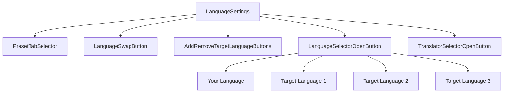
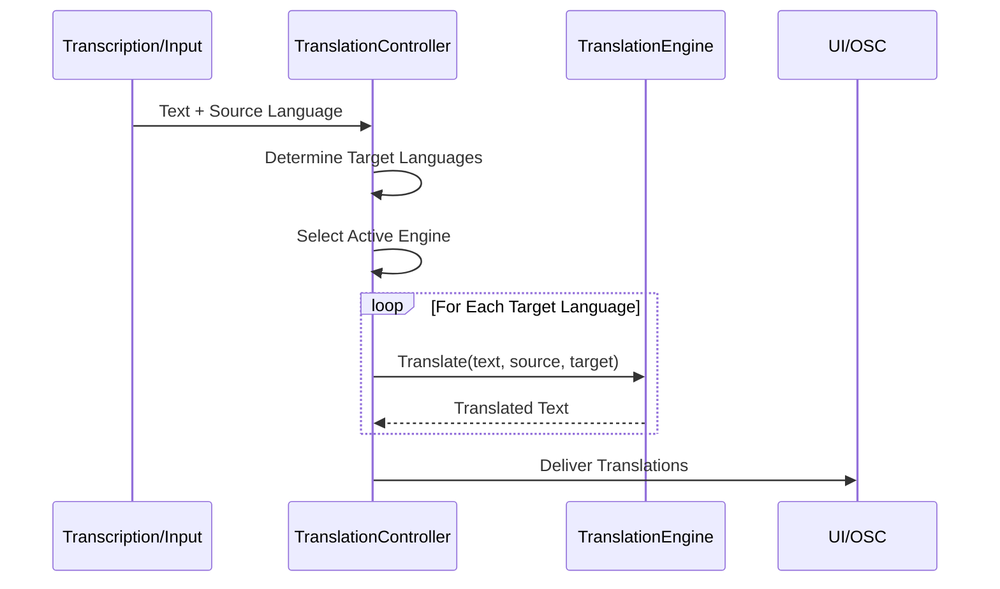
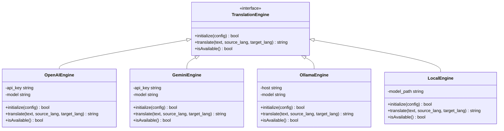
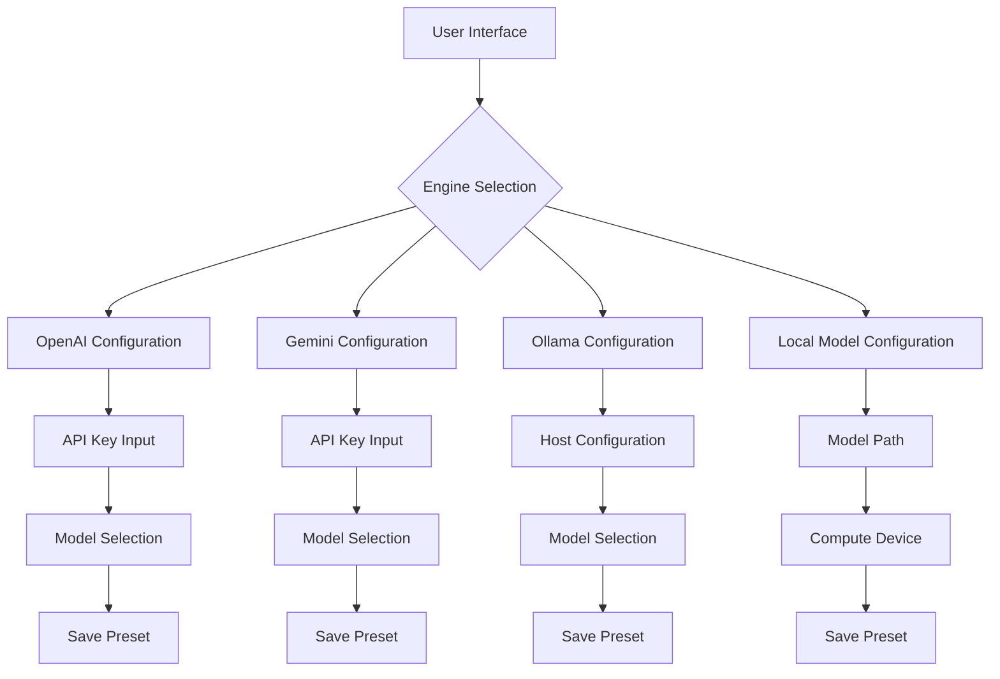
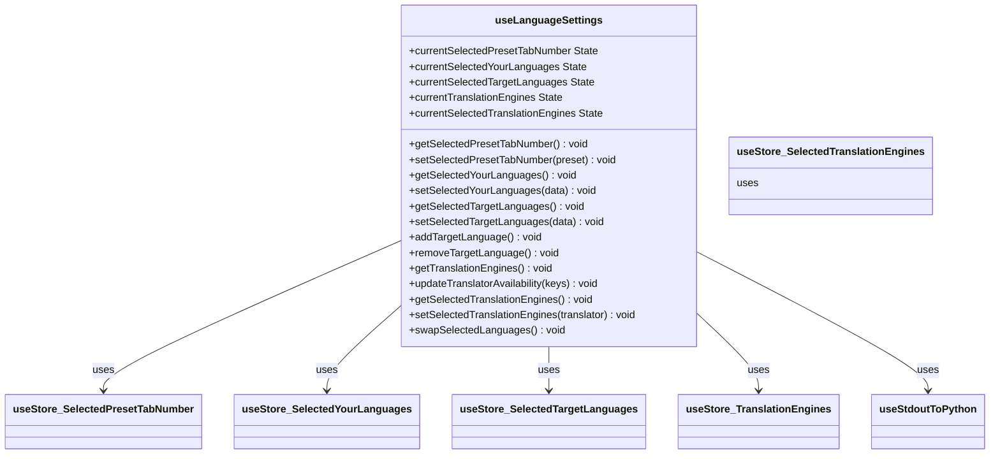

# Translation Features

<cite>
**Referenced Files in This Document**   
- [useLanguageSettings.js](file://src-ui/logics/main/useLanguageSettings.js)
- [LanguageSettings.jsx](file://src-ui/views/app/main_page/sidebar_section/language_settings/LanguageSettings.jsx)
- [AddRemoveTargetLanguageButtons.jsx](file://src-ui/views/app/main_page/sidebar_section/language_settings/add_remove_target_language_buttons/AddRemoveTargetLanguageButtons.jsx)
- [LanguageSwapButton.jsx](file://src-ui/views/app/main_page/sidebar_section/language_settings/language_swap_button/LanguageSwapButton.jsx)
- [PresetTabSelector.jsx](file://src-ui/views/app/main_page/sidebar_section/language_settings/preset_tab_selector/PresetTabSelector.jsx)
- [TranslatorSelector.jsx](file://src-ui/views/app/main_page/sidebar_section/language_settings/translator_selector_open_button/translator_selector/TranslatorSelector.jsx)
- [translation_translator.py](file://src-python/models/translation/translation_translator.py)
- [translation_openai.py](file://src-python/models/translation/translation_openai.py)
- [translation_gemini.py](file://src-python/models/translation/translation_gemini.py)
- [translation_ollama.py](file://src-python/models/translation/translation_ollama.py)
- [translation_plamo.py](file://src-python/models/translation/translation_plamo.py)
- [translation_lmstudio.py](file://src-python/models/translation/translation_lmstudio.py)
- [translation_languages.py](file://src-python/models/translation/translation_languages.py)
- [languages.yml](file://src-python/models/translation/languages/languages.yml)
- [ui_configs.js](file://src-ui/ui_configs.js)
</cite>

## Table of Contents
1. [Introduction](#introduction)
2. [Language Selection Interface](#language-selection-interface)
3. [Translation Workflow](#translation-workflow)
4. [Translation Engines](#translation-engines)
5. [Batch Translation for Multilingual VR Environments](#batch-translation-for-multilingual-vr-environments)
6. [Engine Management and API Configuration](#engine-management-and-api-configuration)
7. [State Management with Custom Hooks](#state-management-with-custom-hooks)
8. [Error Handling and Fallback Mechanisms](#error-handling-and-fallback-mechanisms)
9. [Common Issues and Troubleshooting](#common-issues-and-troubleshooting)
10. [Conclusion](#conclusion)

## Introduction
The VRCT application provides comprehensive translation capabilities designed for real-time communication in multilingual virtual reality environments. The system supports translation from transcription output or manual text input through multiple translation engines including OpenAI, Gemini, Ollama, Plamo, LMStudio, and local models. This document details the architecture, workflow, and user interface components that enable flexible language selection, multi-engine support, and batch translation to multiple target languages simultaneously.

**Section sources**
- [useLanguageSettings.js](file://src-ui/logics/main/useLanguageSettings.js#L1-L188)
- [translation_translator.py](file://src-python/models/translation/translation_translator.py)

## Language Selection Interface
The language selector UI component provides an intuitive interface for managing source and target languages. Users can configure up to three target languages simultaneously, with visual controls for adding and removing target language slots. The interface includes:

- **Preset Tabs**: Three configurable presets (1, 2, 3) that store independent language configurations
- **Source Language Selector**: Designated for the user's native language with microphone indicator
- **Target Language Selectors**: Up to three target languages with headphone indicators
- **Swap Functionality**: Bidirectional language exchange between source and target
- **Visual State Indicators**: Icons showing active transcription and translation status

The UI components are organized hierarchically with `LanguageSettings` as the parent component containing `PresetTabSelector`, `LanguageSwapButton`, `AddRemoveTargetLanguageButtons`, and multiple `LanguageSelectorOpenButton` instances.

**Diagram sources**
- [LanguageSettings.jsx](file://src-ui/views/app/main_page/sidebar_section/language_settings/LanguageSettings.jsx#L10-L56)
- [PresetTabSelector.jsx](file://src-ui/views/app/main_page/sidebar_section/language_settings/preset_tab_selector/PresetTabSelector.jsx#L3-L32)

**Section sources**
- [LanguageSettings.jsx](file://src-ui/views/app/main_page/sidebar_section/language_settings/LanguageSettings.jsx#L1-L56)
- [AddRemoveTargetLanguageButtons.jsx](file://src-ui/views/app/main_page/sidebar_section/language_settings/add_remove_target_language_buttons/AddRemoveTargetLanguageButtons.jsx#L1-L34)
- [LanguageSwapButton.jsx](file://src-ui/views/app/main_page/sidebar_section/language_settings/language_swap_button/LanguageSwapButton.jsx#L1-L41)
- [PresetTabSelector.jsx](file://src-ui/views/app/main_page/sidebar_section/language_settings/preset_tab_selector/PresetTabSelector.jsx#L1-L32)

## Translation Workflow
The translation workflow processes text from either real-time transcription or manual input through a standardized pipeline:

1. **Input Source**: Text originates from either speech-to-text transcription or direct user input
2. **Language Detection**: Automatic detection of source language when not explicitly set
3. **Engine Selection**: Routing to the configured translation engine (OpenAI, Gemini, etc.)
4. **Parallel Processing**: Simultaneous translation to all enabled target languages
5. **Output Delivery**: Results delivered to UI components and optionally to OSC endpoints

The workflow is managed by the `translation_translator.py` module which coordinates between the translation engine implementations and the application's state management system.

**Diagram sources**
- [translation_translator.py](file://src-python/models/translation/translation_translator.py)
- [useLanguageSettings.js](file://src-ui/logics/main/useLanguageSettings.js#L152-L187)

**Section sources**
- [translation_translator.py](file://src-python/models/translation/translation_translator.py)
- [useLanguageSettings.js](file://src-ui/logics/main/useLanguageSettings.js#L152-L187)

## Translation Engines
VRCT supports multiple translation engines, each implemented as a separate module with a consistent interface:

- **OpenAI**: Cloud-based translation using GPT models
- **Gemini**: Google's AI model for translation
- **Ollama**: Local LLM inference with various models
- **Plamo**: Local Japanese-optimized model
- **LMStudio**: Local model server integration
- **Local Models**: On-device translation engines

Each engine module (`translation_openai.py`, `translation_gemini.py`, etc.) implements the same interface methods for initialization, translation, and status checking. The system dynamically enables or disables engines based on API key availability and connectivity.

**Diagram sources**
- [translation_openai.py](file://src-python/models/translation/translation_openai.py)
- [translation_gemini.py](file://src-python/models/translation/translation_gemini.py)
- [translation_ollama.py](file://src-python/models/translation/translation_ollama.py)
- [translation_plamo.py](file://src-python/models/translation/translation_plamo.py)
- [translation_lmstudio.py](file://src-python/models/translation/translation_lmstudio.py)

**Section sources**
- [translation_openai.py](file://src-python/models/translation/translation_openai.py)
- [translation_gemini.py](file://src-python/models/translation/translation_gemini.py)
- [translation_ollama.py](file://src-python/models/translation/translation_ollama.py)
- [translation_plamo.py](file://src-python/models/translation/translation_plamo.py)
- [translation_lmstudio.py](file://src-python/models/translation/translation_lmstudio.py)

## Batch Translation for Multilingual VR Environments
The system supports batch translation to multiple target languages simultaneously, which is essential for multilingual VR environments where users speak different languages. When a single transcription is processed:

1. The source text is sent to the selected translation engine
2. Concurrent requests are made for each enabled target language
3. Translations are processed in parallel when supported by the engine
4. Results are aggregated and delivered to their respective display components

This capability allows a single speaker's words to be simultaneously translated into multiple languages for different audience members in a virtual space. The configuration is managed through the UI's target language selectors, where users can enable up to three different target languages.

**Section sources**
- [useLanguageSettings.js](file://src-ui/logics/main/useLanguageSettings.js#L86-L105)
- [translation_translator.py](file://src-python/models/translation/translation_translator.py)

## Engine Management and API Configuration
Translation engines are managed through a centralized configuration system:

- **API Key Management**: Secure storage and validation of API keys for cloud services
- **Engine Availability Detection**: Automatic checking of engine status and connectivity
- **Default Language Pairs**: Configurable presets for frequently used language combinations
- **Engine Switching**: Runtime switching between different translation providers

The `useLanguageSettings.js` hook provides functions to manage engine selection (`setSelectedTranslationEngines`) and receives availability updates from the backend. Engine configurations are stored in preset tabs, allowing users to save different engine-language combinations for various scenarios.

**Diagram sources**
- [useLanguageSettings.js](file://src-ui/logics/main/useLanguageSettings.js#L108-L133)
- [ui_configs.js](file://src-ui/ui_configs.js)

**Section sources**
- [useLanguageSettings.js](file://src-ui/logics/main/useLanguageSettings.js#L108-L133)
- [ui_configs.js](file://src-ui/ui_configs.js)

## State Management with Custom Hooks
The application uses React custom hooks for state management, with `useLanguageSettings.js` serving as the central hook for translation-related state:

- **Preset Management**: Tracks the active preset tab and facilitates switching
- **Language State**: Manages source and target language selections
- **Engine State**: Handles translation engine selection and availability
- **Asynchronous Operations**: Coordinates with the Python backend via WebSocket

The hook uses Zustand for state management and exposes both current state values and pending state indicators for UI feedback. It communicates with the backend through the `asyncStdoutToPython` function, sending commands to get or set configuration values.

**Diagram sources**
- [useLanguageSettings.js](file://src-ui/logics/main/useLanguageSettings.js#L5-L188)

**Section sources**
- [useLanguageSettings.js](file://src-ui/logics/main/useLanguageSettings.js#L5-L188)

## Error Handling and Fallback Mechanisms
The system implements comprehensive error handling for translation operations:

- **Translation Delays**: UI indicators show processing status with timeout handling
- **Partial Translations**: When some engines fail, others continue and results are delivered
- **Fallback Engines**: Configurable fallback chains when primary engines are unavailable
- **Network Resilience**: Retry mechanisms for transient network issues

The `updateTranslatorAvailability` function in `useLanguageSettings.js` receives periodic status updates from the backend, allowing the UI to reflect which engines are currently available. When an engine fails, the system can automatically switch to a backup engine if configured.

**Section sources**
- [useLanguageSettings.js](file://src-ui/logics/main/useLanguageSettings.js#L113-L120)
- [translation_translator.py](file://src-python/models/translation/translation_translator.py)

## Common Issues and Troubleshooting
### API Rate Limits
When encountering rate limits:
1. Check API key usage quotas in the respective service console
2. Implement request throttling in the engine configuration
3. Consider switching to a different engine temporarily
4. Upgrade service tier if available

### Incorrect Language Detection
For language detection issues:
1. Manually set the source language in the UI
2. Ensure clear audio input for transcription
3. Verify the language is supported in `languages.yml`
4. Check for mixed-language input that may confuse detection

### Translation Quality Variations
To address quality differences between providers:
1. Test multiple engines with your target language pairs
2. Adjust prompt templates in the engine configuration files
3. Fine-tune model parameters for specific use cases
4. Consider using specialized models for particular language combinations

### Engine Connectivity Problems
For connectivity issues:
1. Verify API keys are correctly entered
2. Check network connectivity and firewall settings
3. Validate service endpoints in the configuration
4. Restart the application to reinitialize connections

**Section sources**
- [translation_openai.py](file://src-python/models/translation/translation_openai.py)
- [translation_gemini.py](file://src-python/models/translation/translation_gemini.py)
- [translation_utils.py](file://src-python/models/translation/translation_utils.py)
- [languages.yml](file://src-python/models/translation/languages/languages.yml)

## Conclusion
The VRCT translation system provides a robust, flexible framework for real-time multilingual communication in virtual environments. Through its modular engine architecture, intuitive UI components, and comprehensive state management, users can configure complex translation workflows tailored to their specific needs. The system's support for batch translation to multiple languages simultaneously makes it particularly well-suited for multilingual VR applications where participants speak different languages. By understanding the interaction between the React frontend components and Python backend services, users can effectively configure, troubleshoot, and optimize their translation experience.