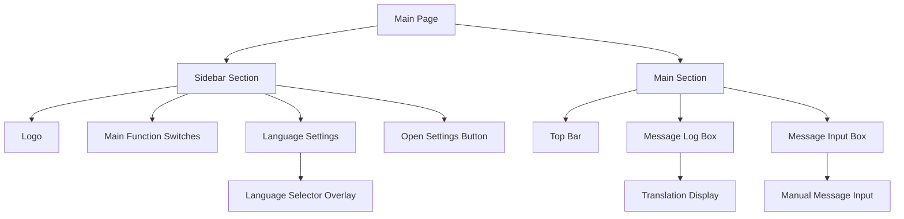
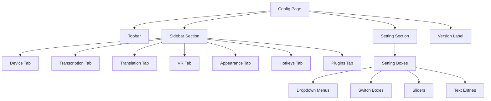
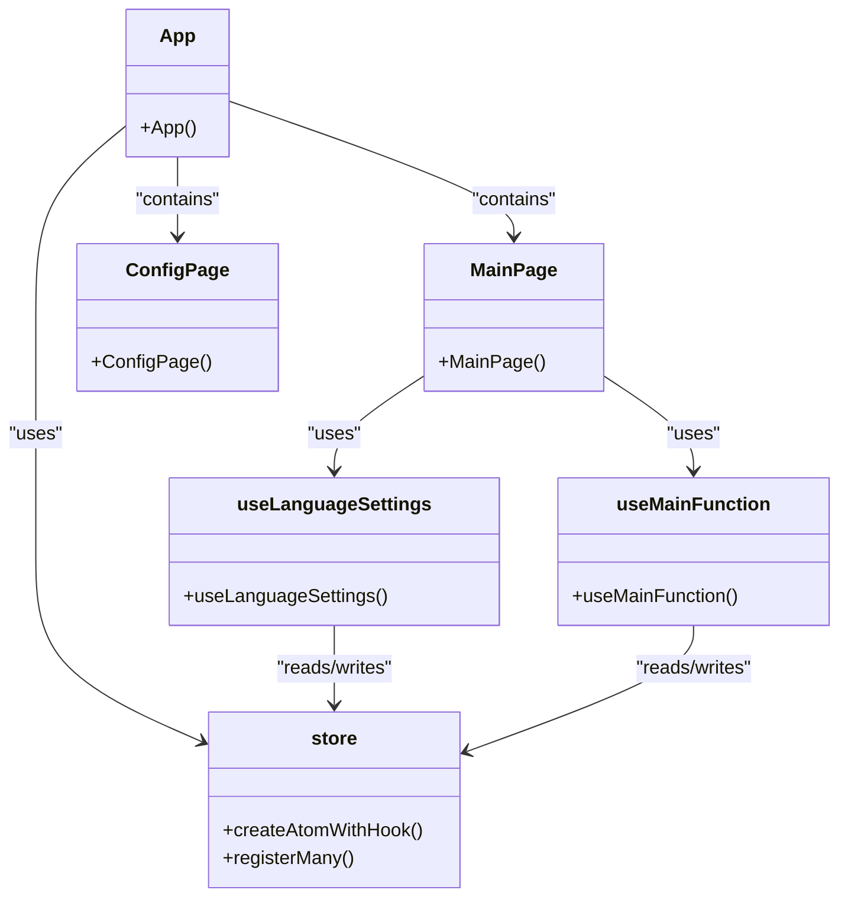

# User Guide

<cite>
**Referenced Files in This Document**   
- [App.jsx](file://src-ui/views/app/App.jsx)
- [MainPage.jsx](file://src-ui/views/app/main_page/MainPage.jsx)
- [ConfigPage.jsx](file://src-ui/views/app/config_page/ConfigPage.jsx)
- [MainSection.jsx](file://src-ui/views/app/main_page/main_section/MainSection.jsx)
- [SidebarSection.jsx](file://src-ui/views/app/main_page/sidebar_section/SidebarSection.jsx)
- [MessageContainer.jsx](file://src-ui/views/app/main_page/main_section/message_container/MessageContainer.jsx)
- [LanguageSelector.jsx](file://src-ui/views/app/main_page/main_section/language_selector/LanguageSelector.jsx)
- [store.js](file://src-ui/logics/store.js)
- [useLanguageSettings.js](file://src-ui/logics/main/useLanguageSettings.js)
- [useMainFunction.js](file://src-ui/logics/main/useMainFunction.js)
</cite>

## Table of Contents
1. [Introduction](#introduction)
2. [Main Interface Layout](#main-interface-layout)
3. [Real-Time Transcription Workflows](#real-time-transcription-workflows)
4. [Manual Message Sending](#manual-message-sending)
5. [VR Overlay Translation Display](#vr-overlay-translation-display)
6. [Configuration Page Interaction](#configuration-page-interaction)
7. [Step-by-Step Common Tasks](#step-by-step-common-tasks)
8. [UI Components Overview](#ui-components-overview)
9. [React Component Architecture](#react-component-architecture)
10. [User Experience Tips](#user-experience-tips)

## Introduction
VRCT (Virtual Reality Chat Translator) is a real-time translation tool designed for VRChat and similar virtual environments. This user guide provides comprehensive instructions for daily usage, covering interface navigation, transcription workflows, message sending, and configuration management. The application enables seamless multilingual communication through automatic speech transcription and translation, with output displayed in VR overlays via OSC (Open Sound Control) protocol.

**Section sources**
- [App.jsx](file://src-ui/views/app/App.jsx#L32-L82)

## Main Interface Layout
The VRCT interface consists of two primary views: the main page for real-time communication and the configuration page for settings management. The main page features a sidebar section on the left and a main section on the right.

The sidebar contains the application logo, main function switches for transcription modes, language settings with selectors for both your language and target languages, and an open settings button. The main section includes a top bar with controls, a message log box displaying translated conversations, a resizable separator, and a message input box for manual messages.

Language selectors appear as overlay panels when activated, organized alphabetically by first letter of the language name, showing both language and country designation. The message input area supports adjustable sizing through a draggable separator between the message log and input box.

**Diagram sources**
- [MainPage.jsx](file://src-ui/views/app/main_page/MainPage.jsx#L7-L21)
- [SidebarSection.jsx](file://src-ui/views/app/main_page/sidebar_section/SidebarSection.jsx#L12-L33)
- [MainSection.jsx](file://src-ui/views/app/main_page/main_section/MainSection.jsx#L16-L34)

**Section sources**
- [MainPage.jsx](file://src-ui/views/app/main_page/MainPage.jsx#L7-L21)
- [SidebarSection.jsx](file://src-ui/views/app/main_page/sidebar_section/SidebarSection.jsx#L12-L33)
- [MainSection.jsx](file://src-ui/views/app/main_page/main_section/MainSection.jsx#L16-L34)

## Real-Time Transcription Workflows
VRCT supports two real-time transcription modes: microphone input transcription (speech-to-text from your voice) and speaker audio transcription (speech-to-text from others' voices in the environment). Both modes are controlled through dedicated switches in the sidebar.

To enable microphone transcription, click the "Transcription Send" switch in the sidebar. This activates audio recording from your selected microphone device, transcribes your speech to text, translates it to the target language, and sends the translated message via OSC to VRChat. The system monitors microphone volume levels and uses threshold detection to determine when speech is occurring.

For speaker transcription, activate the "Transcription Receive" switch. This captures audio from your system's speaker output or selected audio input device, processes it to detect speech from other users, transcribes the spoken content, translates it to your language, and displays the results in the message log. The application uses voice activity detection to filter out non-speech audio and background noise.

Both transcription modes operate in real-time with minimal latency, processing audio in small chunks to maintain responsiveness. The system automatically handles language detection for incoming speech when multiple target languages are configured.

**Section sources**
- [useMainFunction.js](file://src-ui/logics/main/useMainFunction.js)
- [store.js](file://src-ui/logics/store.js#L152-L155)
- [MainFunctionSwitch.jsx](file://src-ui/views/app/main_page/sidebar_section/main_function_switch/MainFunctionSwitch.jsx)

## Manual Message Sending
Users can send manual text messages through the message input box located at the bottom of the main section. To send a message, type your text in the input field and press Enter or click the send button. The message will be translated from your selected language to the target language(s) and transmitted to VRChat via OSC protocol.

The message input box supports multi-line input through Shift+Enter for line breaks without sending. The height of the input box is adjustable by dragging the separator between the message log and input area, allowing users to customize the interface based on their preferences.

Messages sent manually follow the same translation pipeline as transcribed speech, using the currently selected translation engine and language pair configurations. The sent message appears in the message log with appropriate labeling indicating it was sent from your side.

**Section sources**
- [MessageContainer.jsx](file://src-ui/views/app/main_page/main_section/message_container/MessageContainer.jsx#L9-L89)
- [MessageInputBox.jsx](file://src-ui/views/app/main_page/main_section/message_container/message_input_box/MessageInputBox.jsx)
- [useMessageInputBoxRatio.js](file://src-ui/logics/main/useMessageInputBoxRatio.js)

## VR Overlay Translation Display
Translated text is displayed in VRChat through OSC (Open Sound Control) protocol integration. When a message is translated—whether from microphone transcription or manual input—it is sent to VRChat where it appears as text overlays above user avatars.

The OSC transmission system sends both the original and translated text with metadata including speaker identification, language codes, and message type (transcribed or manual). In VRChat, compatible worlds or UI mods display this information as floating text bubbles, allowing users to read translations in the virtual environment.

The message format and display behavior can be customized in the configuration page under VR settings, including options for text simplification, transliteration, and display duration. Users can also configure whether to show original text, translated text, or both in the VR overlays.

**Section sources**
- [osc.py](file://src-python/models/osc/osc.py)
- [useMainFunction.js](file://src-ui/logics/main/useMainFunction.js)
- [websocket_server.py](file://src-python/models/websocket/websocket_server.py)

## Configuration Page Interaction
The configuration page is accessed by clicking the settings icon in the main interface. It features a sidebar with navigation tabs for different configuration categories (Device, Transcription, Translation, VR, Appearance, Hotkeys, Plugins, Others) and a main settings area that changes based on the selected tab.

Each setting is presented in a consistent format with descriptive labels, input controls appropriate to the setting type (dropdowns, switches, sliders, text inputs), and contextual help where needed. The page uses a scrollable layout with section headers to organize related settings.

Changes to settings are typically applied immediately, with some requiring application restart for full effect. The configuration system uses a state management approach where UI components subscribe to configuration atoms, ensuring that changes propagate throughout the application in real-time.

Navigation between configuration sections maintains the user's scroll position within each section, providing a seamless experience when returning to previously visited settings.

**Diagram sources**
- [ConfigPage.jsx](file://src-ui/views/app/config_page/ConfigPage.jsx#L8-L21)
- [SettingSection.jsx](file://src-ui/views/app/config_page/setting_section/SettingSection.jsx)
- [SidebarSection.jsx](file://src-ui/views/app/config_page/sidebar_section/SidebarSection.jsx)

**Section sources**
- [ConfigPage.jsx](file://src-ui/views/app/config_page/ConfigPage.jsx#L8-L21)
- [useSettingsLogics.js](file://src-ui/logics/configs/useSettingsLogics.js)

## Step-by-Step Common Tasks

### Switching Languages
1. In the sidebar, click on the language selector button for either "Your Language" or "Target Language"
2. A language selection overlay will appear showing languages grouped alphabetically
3. Browse or scroll to find your desired language
4. Click on the language entry (displayed as "Language (Country)")
5. The selection will be applied immediately, and the overlay will close

### Toggling Transcription Modes
1. In the sidebar, locate the "Transcription Send" switch (microphone icon) or "Transcription Receive" switch (speaker icon)
2. Click the switch to toggle its state
3. When enabled (blue), the corresponding transcription mode is active
4. The switch will display real-time status indicators showing when audio is being processed

### Sending Messages via OSC to VRChat
1. Type your message in the message input box at the bottom of the main section
2. Press Enter to send (or Shift+Enter for a new line without sending)
3. The message will appear in the message log with "You" label
4. The system will translate the message and send it via OSC to VRChat
5. In VRChat, the translated message will appear as an overlay above your avatar

**Section sources**
- [LanguageSettings.jsx](file://src-ui/views/app/main_page/sidebar_section/language_settings/LanguageSettings.jsx)
- [useLanguageSettings.js](file://src-ui/logics/main/useLanguageSettings.js)
- [MainFunctionSwitch.jsx](file://src-ui/views/app/main_page/sidebar_section/main_function_switch/MainFunctionSwitch.jsx)
- [MessageInputBox.jsx](file://src-ui/views/app/main_page/main_section/message_container/message_input_box/MessageInputBox.jsx)

## UI Components Overview
The VRCT interface includes several key components with specific visual indicators:

- **Compact Mode Toggle**: A button that collapses the sidebar to show only icons, maximizing space for the main communication area
- **Hotkey Indicators**: Visual badges that show when hotkeys are active or when a hotkey operation is in progress
- **Notification Badges**: Small indicators that appear on buttons when there are updates, messages, or system events requiring attention
- **Volume Meters**: Real-time visual feedback showing microphone and speaker input levels
- **Threshold Sliders**: Adjustable controls with accompanying meters that show the sensitivity level for voice activity detection
- **Status Indicators**: Color-coded elements (typically green for active, gray for inactive) that show the current state of transcription and translation services

These components provide immediate visual feedback about the system state and help users understand when their input is being processed and when translations are being transmitted.

**Section sources**
- [CompactSwitchBox.jsx](file://src-ui/views/app/config_page/topbar/compact_switch_box/CompactSwitchBox.jsx)
- [VolumeCheckButton.jsx](file://src-ui/views/app/config_page/setting_section/setting_box/threshold_component/volume_check_button/VolumeCheckButton.jsx)
- [SliderAndMeter.jsx](file://src-ui/views/app/config_page/setting_section/setting_box/threshold_component/slider_and_meter/SliderAndMeter.jsx)
- [SwitchBox.jsx](file://src-ui/views/app/config_page/setting_section/setting_box/switch_box/SwitchBox.jsx)

## React Component Architecture
VRCT's UI is built with React and uses Jotai for state management, providing a scalable and maintainable architecture. The application follows a component-based structure with clear separation of concerns between UI presentation and business logic.

State management is implemented through Jotai atoms defined in the store.js file, where each application state has corresponding atoms for data, loading status, and error states. Components use custom hooks (prefixed with "use") to access and modify state, promoting reusability and testability.

The main state flow follows this pattern:
1. UI components call hook functions to initiate actions
2. Hooks update Jotai atoms which trigger re-renders in subscribed components
3. State changes propagate through the component tree
4. Side effects (like Python backend communication) are handled by controller components

Key architectural patterns include:
- **Separation of Logic and UI**: Business logic is isolated in the /logics directory while UI components focus on presentation
- **Atomic State Management**: Each piece of state is managed independently, allowing fine-grained reactivity
- **Context-Free Design**: The application avoids React Context in favor of Jotai atoms for better performance and debugging
- **Controller Components**: Special components in the _app_controllers directory handle side effects and integration with the Python backend

This architecture enables responsive UI updates, efficient re-renders, and clear data flow throughout the application.

**Diagram sources**
- [store.js](file://src-ui/logics/store.js#L36-L248)
- [useLanguageSettings.js](file://src-ui/logics/main/useLanguageSettings.js)
- [useMainFunction.js](file://src-ui/logics/main/useMainFunction.js)

**Section sources**
- [store.js](file://src-ui/logics/store.js#L36-L248)
- [useLanguageSettings.js](file://src-ui/logics/main/useLanguageSettings.js)
- [useMainFunction.js](file://src-ui/logics/main/useMainFunction.js)

## User Experience Tips
For optimal performance and user experience:

1. **Microphone Setup**: Position your microphone close to your mouth and adjust the threshold slider so that it activates during speech but not during silence. Use the volume meter to ensure your voice reaches adequate levels.

2. **Speaker Transcription**: For best results with speaker transcription, use headphones to prevent audio feedback loops, and ensure the application has access to your system audio output.

3. **Performance Optimization**: When experiencing performance issues, consider using lighter translation models or switching to CPU-only computation if you don't have a compatible GPU.

4. **Language Configuration**: Set up multiple target language presets for different social situations, and use the preset tab selector to quickly switch between language configurations.

5. **Hotkey Utilization**: Configure hotkeys for frequently used functions like toggling transcription modes or showing/hiding the VRCT interface to minimize the need for manual navigation.

6. **Network Stability**: Ensure stable OSC communication by verifying that VRChat and VRCT are running with appropriate permissions, and check that firewall settings allow the necessary network traffic.

7. **Resource Management**: Close unnecessary applications when running VRCT, as real-time transcription and translation can be resource-intensive, especially with large language models.

**Section sources**
- [Performance considerations from various component behaviors and state management patterns]
- [UI interaction patterns from component implementations]