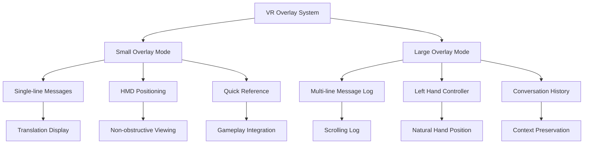
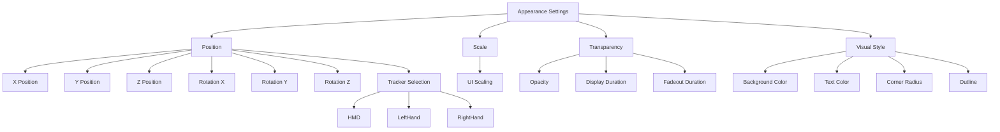
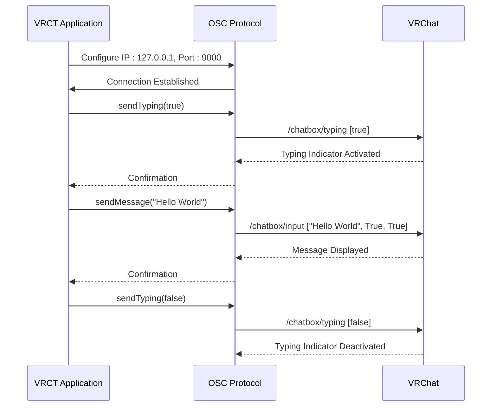
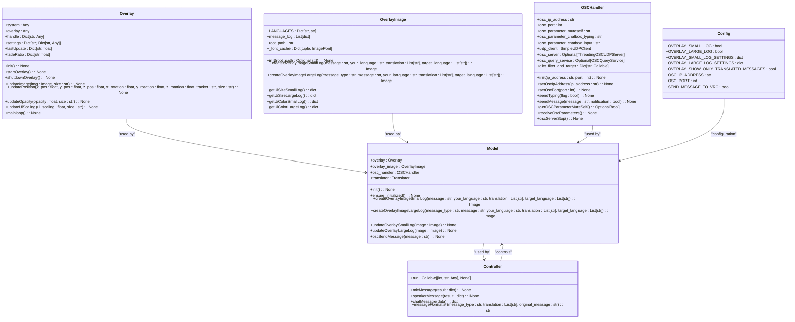
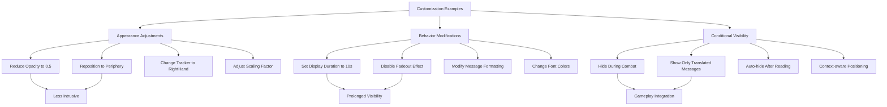
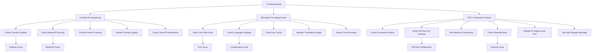

# VR Overlay Usage

<cite>
**Referenced Files in This Document**   
- [overlay.py](file://src-python/models/overlay/overlay.py)
- [overlay_image.py](file://src-python/models/overlay/overlay_image.py)
- [osc.py](file://src-python/models/osc/osc.py)
- [controller.py](file://src-python/controller.py)
- [model.py](file://src-python/model.py)
- [config.py](file://src-python/config.py)
- [Vr.jsx](file://src-ui/views/app/config_page/setting_section/setting_box/vr/Vr.jsx)
- [overlay.md](file://src-python/docs/details/overlay.md)
- [osc.md](file://src-python/docs/details/osc.md)
</cite>

## Table of Contents
1. [Introduction](#introduction)
2. [VR Overlay Modes](#vr-overlay-modes)
3. [Appearance Settings](#appearance-settings)
4. [OSC Communication Setup](#osc-communication-setup)
5. [Python Backend Components](#python-backend-components)
6. [Customization Examples](#customization-examples)
7. [Troubleshooting](#troubleshooting)
8. [Conclusion](#conclusion)

## Introduction
The VRCT application provides comprehensive VR overlay functionality that renders translated messages in virtual reality through OpenVR overlays and synchronizes with VRChat via the OSC (Open Sound Control) protocol. This system enables users to view real-time translations of conversations directly within their VR environment, enhancing cross-language communication in virtual spaces. The overlay system supports multiple display modes with different use cases, allowing for flexible positioning, scaling, and transparency adjustments. The integration with VRChat is achieved through OSC communication, which transmits typing indicators and chat messages between the application and the VR platform. This documentation details the architecture, configuration, and usage of these features, providing guidance for users and developers to effectively utilize and customize the VR overlay system.

**Section sources**
- [overlay.md](file://src-python/docs/details/overlay.md#L1-L200)

## VR Overlay Modes
The VRCT application implements two distinct overlay modes: small and large, each designed for specific use cases within VR environments. The small overlay mode is optimized for single-line messages and is typically positioned on the HMD (Head-Mounted Display) for quick reference during gameplay. This mode is ideal for displaying brief translated messages without obstructing the user's field of view. The large overlay mode, on the other hand, supports multi-line message logs and is designed to be attached to the left hand controller, allowing users to view conversation history by naturally looking at their hand. This mode displays a scrolling log of recent messages with timestamps, showing both original messages and their translations in a structured format.

The overlay system uses OpenVR to create and manage these overlays, with each mode having independent settings for position, rotation, scaling, and opacity. The small overlay has a fixed width of 3840 pixels and height of 92 pixels with a font size of 92, while the large overlay has a width of 960 pixels with variable font sizes (30 for large text, 20 for small text). Both modes support automatic fading, where messages are displayed for a configurable duration before gradually fading out. The overlay positioning is managed through transformation matrices that account for the user's head and hand tracking data, ensuring the overlays remain properly oriented in 3D space regardless of the user's movements.



**Diagram sources **
- [overlay.py](file://src-python/models/overlay/overlay.py#L85-L388)
- [overlay_image.py](file://src-python/models/overlay/overlay_image.py#L60-L733)

**Section sources**
- [overlay.py](file://src-python/models/overlay/overlay.py#L85-L388)
- [overlay_image.py](file://src-python/models/overlay/overlay_image.py#L60-L733)
- [overlay.md](file://src-python/docs/details/overlay.md#L1-L200)

## Appearance Settings
The appearance of VR overlays in VRCT can be extensively customized through the application's settings interface, allowing users to adjust position, scale, transparency, and other visual properties. The overlay positioning system uses a 3D coordinate system where X, Y, and Z values control the horizontal, vertical, and depth placement of the overlay relative to the tracking device. Rotation parameters (X, Y, Z) allow for fine-tuning the overlay's orientation in degrees. Users can select between three tracking options: HMD (head-mounted display), LeftHand, or RightHand, which determines which tracked device the overlay follows in VR space.

The scaling of overlays is controlled by the UI scaling parameter, which adjusts the physical size of the overlay in meters. The small overlay has a default scaling of 1.0, while the large overlay has a default scaling of 0.25, making it appear smaller in the virtual environment despite its larger pixel dimensions. Transparency is managed through the opacity setting, which accepts values from 0.0 (completely transparent) to 1.0 (completely opaque). The overlay system also supports automatic fading, with configurable display duration and fadeout duration parameters that control how long messages remain visible before gradually disappearing.

The visual appearance of the overlays is further customized through UI settings that define the background color, text color, and corner radius. The small overlay uses a dark gray background (RGB: 41, 42, 45) with light gray text (RGB: 223, 223, 223), while the large overlay uses similar colors with additional color coding for different message types (send in blue, receive in purple, timestamps in gray). Both overlays feature rounded corners with a configurable radius and a subtle outline for better visibility against various backgrounds.



**Diagram sources **
- [overlay.py](file://src-python/models/overlay/overlay.py#L179-L231)
- [Vr.jsx](file://src-ui/views/app/config_page/setting_section/setting_box/vr/Vr.jsx#L1-L200)

**Section sources**
- [overlay.py](file://src-python/models/overlay/overlay.py#L179-L231)
- [config.py](file://src-python/config.py#L947-L990)
- [Vr.jsx](file://src-ui/views/app/config_page/setting_section/setting_box/vr/Vr.jsx#L1-L200)

## OSC Communication Setup
The VRCT application establishes communication with VRChat through the OSC (Open Sound Control) protocol, enabling bidirectional data exchange for chat messages and user status. To enable OSC communication, users must configure the target IP address and port number in the application settings. By default, the application connects to localhost (127.0.0.1) on port 9000, which is the standard configuration for VRChat running on the same machine. For networked setups, users can specify the IP address of the machine running VRChat to enable cross-device communication.

The OSC system in VRCT is managed by the OSCHandler class, which handles both message sending and receiving. When the target address is localhost, the application automatically enables OSCQuery functionality, which advertises available endpoints and allows VRChat to discover and interact with the application. This enables advanced features like reading the MuteSelf parameter from VRChat to synchronize microphone muting states. The application sends OSC messages to two primary endpoints: /chatbox/typing to indicate when a message is being composed, and /chatbox/input to submit the final message for display in VRChat.

To verify the OSC connection status, the application provides real-time feedback through the UI, indicating whether the connection to VRChat is active. Users can test the connection by sending sample messages through the configuration interface. The OSC system automatically handles connection errors and will attempt to re-establish communication if the connection is lost. For security and performance reasons, OSCQuery functionality is automatically disabled when connecting to remote addresses, as it requires opening additional network ports that may not be accessible or desirable in networked configurations.



**Diagram sources **
- [osc.py](file://src-python/models/osc/osc.py#L40-L241)
- [osc.md](file://src-python/docs/details/osc.md#L117-L218)

**Section sources**
- [osc.py](file://src-python/models/osc/osc.py#L40-L241)
- [controller.py](file://src-python/controller.py#L347-L356)
- [osc.md](file://src-python/docs/details/osc.md#L117-L218)

## Python Backend Components
The VR overlay functionality in VRCT is powered by several key Python backend components that work together to render translated messages and manage OSC communication. The core of the overlay system is the Overlay class in overlay.py, which manages OpenVR overlays for multiple sizes. This class handles the initialization of the OpenVR system, creation of overlay handles, and management of the rendering loop. It provides methods to update the overlay image, position, opacity, and other visual properties, as well as to control the overlay's lifecycle (starting, stopping, and restarting).

The OverlayImage class in overlay_image.py is responsible for generating the actual image content displayed in the overlays. This class manages font loading for multiple languages (Japanese, Korean, Chinese, etc.) using Noto Sans fonts, and handles the creation of text images with proper formatting and layout. It supports advanced features like ruby text (furigana) for Japanese text, rendering both hiragana and romaji transliterations above kanji characters. The class also manages message history for the large overlay mode, maintaining a log of recent messages with timestamps and message types.

The OSC communication is handled by the OSCHandler class in osc.py, which provides a thin wrapper around the python-osc library. This class manages the UDP client for sending messages to VRChat and can optionally run an OSC server with OSCQuery support for receiving messages from VRChat. It handles the formatting of OSC messages for the /chatbox/typing and /chatbox/input endpoints, and provides methods to query VRChat parameters like the MuteSelf state when OSCQuery is available.

These components are orchestrated by the Model class in model.py, which initializes and manages instances of the overlay, OSC handler, and other system components. The Controller class in controller.py acts as an intermediary between the UI and the model, handling user actions and updating the system state accordingly. Configuration settings are managed by the Config class in config.py, which provides a centralized location for all application settings, including overlay parameters and OSC connection details.



**Diagram sources **
- [overlay.py](file://src-python/models/overlay/overlay.py#L85-L388)
- [overlay_image.py](file://src-python/models/overlay/overlay_image.py#L12-L733)
- [osc.py](file://src-python/models/osc/osc.py#L40-L241)
- [model.py](file://src-python/model.py#L81-L200)
- [controller.py](file://src-python/controller.py#L11-L800)
- [config.py](file://src-python/config.py#L1-L200)

**Section sources**
- [overlay.py](file://src-python/models/overlay/overlay.py#L85-L388)
- [overlay_image.py](file://src-python/models/overlay/overlay_image.py#L12-L733)
- [osc.py](file://src-python/models/osc/osc.py#L40-L241)
- [model.py](file://src-python/model.py#L81-L200)
- [controller.py](file://src-python/controller.py#L11-L800)
- [config.py](file://src-python/config.py#L1-L200)

## Customization Examples
The VRCT application provides several ways to customize overlay appearance and handle overlay visibility during gameplay. Users can modify the visual style of overlays by adjusting parameters such as opacity, scaling, and position through the configuration interface. For example, to make the small overlay more discreet during intense gameplay, users can reduce its opacity to 0.5 and position it at the periphery of their vision by adjusting the X and Y coordinates. The large overlay can be configured to appear only when needed by setting a longer display duration and enabling the fadeout effect, allowing messages to gradually disappear after being read.

Programmatic customization is also possible through the Python API. Developers can modify overlay settings by accessing the configuration parameters directly. For instance, to change the small overlay to follow the right hand controller instead of the HMD, the tracker setting can be updated:

```python
config.OVERLAY_SMALL_LOG_SETTINGS["tracker"] = "RightHand"
```

Similarly, the display behavior can be customized by adjusting the display_duration and fadeout_duration parameters. To keep messages visible indefinitely, the fadeout_duration can be set to 0:

```python
config.OVERLAY_LARGE_LOG_SETTINGS["fadeout_duration"] = 0
```

The application also supports conditional overlay visibility based on gameplay context. Through the controller logic, overlays can be automatically hidden during specific game events or when the user is engaged in activities that require full visual attention. This is achieved by temporarily disabling the overlay rendering loop and restoring it when appropriate. The message formatting can also be customized through the SEND_MESSAGE_FORMAT_PARTS configuration, allowing users to add prefixes, suffixes, and separators to control how original messages and translations are combined in the output.



**Diagram sources **
- [config.py](file://src-python/config.py#L947-L990)
- [overlay.py](file://src-python/models/overlay/overlay.py#L226-L231)
- [controller.py](file://src-python/controller.py#L374-L398)

**Section sources**
- [config.py](file://src-python/config.py#L947-L990)
- [overlay.py](file://src-python/models/overlay/overlay.py#L226-L231)
- [controller.py](file://src-python/controller.py#L374-L398)

## Troubleshooting
Common issues with VR overlays in VRCT typically fall into three categories: overlay visibility problems, message formatting errors, and OSC connection failures. For overlay visibility issues where the overlay does not appear, the first step is to verify that the overlay feature is enabled in the configuration settings. Users should check that both the small and large overlay options are toggled on in the VR settings panel. If the overlay is still not visible, they should ensure that SteamVR is running and properly tracking their HMD and controllers. Restarting the overlay system through the application's restart function can resolve initialization issues that may prevent the overlay from appearing.

Message formatting problems, such as text appearing as boxes or incorrect character rendering, are usually related to font loading issues. The application uses Noto Sans fonts for Japanese, Korean, and Chinese characters, and missing or corrupted font files can cause display problems. Users should verify that the font directory exists and contains the required .ttf files. Clearing the font cache by restarting the application can resolve issues with corrupted font loading. For translation formatting issues, users should check that the source and target languages are correctly configured and that the translation engine is functioning properly.

OSC connection failures can be diagnosed by checking the connection status indicator in the application UI. If the connection is not established, users should verify that VRChat is running and that the OSC settings in VRChat match those in VRCT (typically port 9000). Firewall settings may block OSC traffic, so users should ensure that UDP port 9000 is allowed through their firewall. For localhost connections, users can test the connection by pinging 127.0.0.1 to verify network connectivity. If using OSCQuery features, users should note that these are only available when connecting to localhost and will be disabled for remote connections.



**Diagram sources **
- [overlay.py](file://src-python/models/overlay/overlay.py#L232-L242)
- [osc.py](file://src-python/models/osc/osc.py#L103-L144)
- [controller.py](file://src-python/controller.py#L254-L265)

**Section sources**
- [overlay.py](file://src-python/models/overlay/overlay.py#L232-L242)
- [osc.py](file://src-python/models/osc/osc.py#L103-L144)
- [controller.py](file://src-python/controller.py#L254-L265)

## Conclusion
The VR overlay system in VRCT provides a robust solution for displaying translated messages in virtual reality environments through OpenVR overlays synchronized with VRChat via OSC protocol. The dual overlay mode system—small for quick reference and large for conversation history—offers flexibility for different use cases and gameplay scenarios. The comprehensive appearance settings allow users to customize position, scale, transparency, and visual style to suit their preferences and minimize visual obstruction. The OSC communication system enables seamless integration with VRChat, supporting both message transmission and status synchronization.

The Python backend components are well-structured, with clear separation of concerns between overlay management, image generation, and OSC communication. This modular design facilitates maintenance and future enhancements. The system handles common issues gracefully, with built-in error logging and recovery mechanisms. For optimal performance, users should ensure their system meets the requirements for OpenVR and maintain proper configuration of both VRCT and VRChat settings.

Future improvements could include additional overlay positioning options, more sophisticated message filtering, and enhanced customization of the visual appearance. The current system provides a solid foundation for real-time translation in VR, significantly improving cross-language communication in virtual environments.

**Section sources**
- [overlay.md](file://src-python/docs/details/overlay.md#L1-L776)
- [osc.md](file://src-python/docs/details/osc.md#L1-L218)