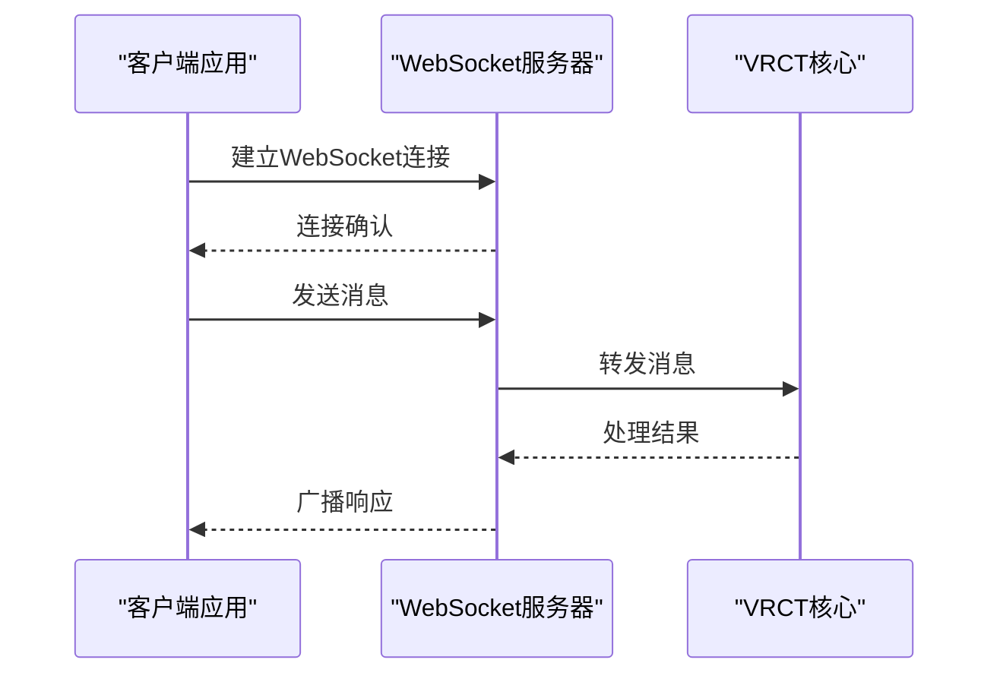

# API参考

<cite>
**本文档中引用的文件**
- [websocket_server.py](file://src-python/models/websocket/websocket_server.py)
- [osc.py](file://src-python/models/osc/osc.py)
- [controller.py](file://src-python/controller.py)
- [test_client.py](file://src-python/test_client.py)
- [model.py](file://src-python/model.py)
- [mainloop.py](file://src-python/mainloop.py)
- [websocket_server.md](file://src-python/docs/details/websocket_server.md)
- [osc.md](file://src-python/docs/details/osc.md)
</cite>

## 目录
1. [简介](#简介)
2. [WebSocket API](#websocket-api)
3. [OSC通信协议](#osc通信协议)
4. [内部IPC接口](#内部ipc接口)
5. [错误处理机制](#错误处理机制)
6. [客户端集成指南](#客户端集成指南)
7. [最佳实践](#最佳实践)

## 简介

VRCT提供了三种主要的通信接口：WebSocket API用于实时双向通信、OSC协议用于与VRChat的深度集成、以及内部IPC接口用于应用程序组件间的通信。本文档详细说明了这些接口的使用方法、消息格式和集成示例。

## WebSocket API

### 连接方式

WebSocket服务器默认运行在`ws://127.0.0.1:8765`，支持多个客户端同时连接。



**图表来源**
- [websocket_server.py](file://src-python/models/websocket/websocket_server.py#L38-L57)

### 支持的消息类型

#### 1. 发送翻译消息 (SEND_TRANSLATION)

```json
{
  "type": "SENT",
  "src_languages": [...],
  "dst_languages": [...],
  "message": "原文文本",
  "translation": ["翻译文本"],
  "transliteration": [["转写文本"]]
}
```

#### 2. 接收翻译消息 (RECEIVED)

```json
{
  "type": "RECEIVED", 
  "src_languages": [...],
  "dst_languages": [...],
  "message": "原文文本",
  "translation": ["翻译文本"],
  "transliteration": [["转写文本"]]
}
```

#### 3. 聊天消息 (CHAT)

```json
{
  "type": "CHAT",
  "src_languages": [...],
  "dst_languages": [...],
  "message": "聊天文本",
  "translation": ["翻译文本"],
  "transliteration": [["转写文本"]]
}
```

### 请求/响应JSON格式

#### 标准响应格式

```json
{
  "status": 200,
  "endpoint": "/get/data/version",
  "result": "1.2.3"
}
```

#### 错误响应格式

```json
{
  "status": 400,
  "endpoint": "/set/data/transparency",
  "result": {
    "message": "值超出范围",
    "data": null
  }
}
```

### 错误码定义

| 状态码 | 含义 | 描述 |
|--------|------|------|
| 200 | 成功 | 请求正常处理 |
| 400 | 验证错误 | 参数格式或范围错误 |
| 404 | 无效端点 | 不存在的API端点 |
| 423 | 锁定中 | 资源被锁定，建议重试 |
| 500 | 内部错误 | 服务器内部错误 |

**章节来源**
- [websocket_server.py](file://src-python/models/websocket/websocket_server.py#L1-L222)
- [websocket_server.md](file://src-python/docs/details/websocket_server.md#L1-L800)

## OSC通信协议

### OSC消息地址模式

#### VRChat标准地址

| 地址模式 | 功能 | 参数类型 |
|----------|------|----------|
| `/chatbox/input` | 发送聊天消息 | `[string, bool, bool]` |
| `/chatbox/typing` | 设置输入状态 | `[bool]` |
| `/avatar/parameters/MuteSelf` | 获取静音状态 | 无参数 |

#### 自定义地址

| 地址模式 | 功能 | 参数类型 |
|----------|------|----------|
| `/vrct/status` | VRCT状态查询 | 无参数 |
| `/vrct/config` | 配置信息获取 | 无参数 |
| `/vrct/translate` | 翻译请求 | `[string, string, string]` |

### 参数结构

#### 聊天消息发送

```python
# 消息格式: [文本, 清除标志, 通知标志]
osc.sendMessage("Hello World", True, True)
```

#### 输入状态控制

```python
# 开始输入
osc.sendTyping(True)

# 结束输入  
osc.sendTyping(False)
```

### 在VR平台中的应用场景

#### 1. 实时翻译显示
- 监听`/avatar/parameters/MuteSelf`检测用户静音状态
- 在用户未静音时发送翻译消息
- 根据用户手势调整显示位置

#### 2. 状态同步
- 监听语音级别变化
- 同步本地翻译状态到VRChat参数
- 实现跨设备的状态同步

#### 3. 用户交互
- 检测用户输入状态
- 显示翻译进度
- 提供翻译质量反馈

**章节来源**
- [osc.py](file://src-python/models/osc/osc.py#L1-L241)
- [osc.md](file://src-python/docs/details/osc.md#L1-L602)

## 内部IPC接口

### API方法概览

#### 版本管理
- `getVersion()`: 获取当前版本信息
- `checkSoftwareUpdated()`: 检查软件更新

#### 计算设备管理
- `getComputeMode()`: 获取计算模式
- `getComputeDeviceList()`: 获取可用计算设备列表
- `getSelectedTranslationComputeDevice()`: 获取选中的翻译计算设备
- `setSelectedTranslationComputeDevice(device)`: 设置翻译计算设备

#### 配置管理
- `getSelectableCtranslate2WeightTypeDict()`: 获取可选的CTranslate2权重类型
- `getSelectableWhisperWeightTypeDict()`: 获取可选的Whisper权重类型

### 调用方式和参数规范

#### 基本调用模式

```python
# 同步调用
result = controller.getVersion()
print(result["result"])

# 异步调用
controller.setEnableTranslation()
```

#### 参数验证

```python
# 类型检查示例
def set_transparent(data):
    if not isinstance(data, int):
        return {"status": 400, "result": "透明度必须是整数"}
    if not 0 <= data <= 100:
        return {"status": 400, "result": "透明度范围: 0-100"}
    return {"status": 200, "result": data}
```

### 消息格式规范

#### 请求格式
```json
{
  "endpoint": "/get/data/version",
  "data": "base64编码的数据"
}
```

#### 响应格式
```json
{
  "status": 200,
  "endpoint": "/get/data/version",
  "result": "1.2.3"
}
```

**章节来源**
- [controller.py](file://src-python/controller.py#L763-L800)
- [mainloop.py](file://src-python/mainloop.py#L1-L400)

## 错误处理机制

### 错误分类

#### 网络错误
- 连接超时
- 服务器不可达
- 网络中断恢复

#### 数据错误
- JSON解析失败
- 参数类型错误
- 参数范围超出

#### 业务逻辑错误
- 权限不足
- 资源锁定
- 依赖服务不可用

### 错误恢复策略

#### 自动重试机制
```python
def retry_operation(operation, max_retries=3, delay=1):
    for attempt in range(max_retries):
        try:
            return operation()
        except NetworkError as e:
            if attempt == max_retries - 1:
                raise
            time.sleep(delay * (2 ** attempt))
```

#### 优雅降级
```python
def graceful_degradation(func):
    def wrapper(*args, **kwargs):
        try:
            return func(*args, **kwargs)
        except Exception as e:
            logger.warning(f"功能降级: {e}")
            return fallback_behavior()
    return wrapper
```

**章节来源**
- [test_client.py](file://src-python/test_client.py#L212-L233)

## 客户端集成指南

### JavaScript客户端示例

```javascript
class VRCTWebSocketClient {
    constructor(url = 'ws://127.0.0.1:8765') {
        this.url = url;
        this.socket = null;
        this.messageHandlers = new Map();
        this.connect();
    }
    
    connect() {
        this.socket = new WebSocket(this.url);
        
        this.socket.onopen = () => {
            console.log('WebSocket连接已建立');
            this.emit('connected');
        };
        
        this.socket.onmessage = (event) => {
            const message = JSON.parse(event.data);
            this.handleMessage(message);
        };
        
        this.socket.onclose = () => {
            console.log('WebSocket连接已关闭');
            this.emit('disconnected');
        };
    }
    
    handleMessage(message) {
        const handler = this.messageHandlers.get(message.type);
        if (handler) {
            handler(message);
        }
    }
    
    registerHandler(type, callback) {
        this.messageHandlers.set(type, callback);
    }
    
    sendMessage(type, data) {
        const message = { type, ...data };
        this.socket.send(JSON.stringify(message));
    }
    
    getVersion() {
        return new Promise((resolve, reject) => {
            const requestId = Math.random().toString(36).substr(2, 9);
            this.registerHandler(`version_${requestId}`, (response) => {
                resolve(response.result);
            });
            
            this.sendMessage('get_version', { requestId });
        });
    }
}
```

### Python客户端示例

```python
import websocket
import json
import threading

class VRCTWebSocketClient:
    def __init__(self, url='ws://127.0.0.1:8765'):
        self.url = url
        self.ws = None
        self.handlers = {}
        self.connected = False
        
    def on_message(self, ws, message):
        data = json.loads(message)
        handler = self.handlers.get(data['type'])
        if handler:
            handler(data)
    
    def on_open(self, ws):
        self.connected = True
        print("WebSocket连接已建立")
        
    def on_close(self, ws, close_status_code, close_msg):
        self.connected = False
        print("WebSocket连接已关闭")
        
    def connect(self):
        self.ws = websocket.WebSocketApp(
            self.url,
            on_message=self.on_message,
            on_open=self.on_open,
            on_close=self.on_close
        )
        
        thread = threading.Thread(target=self.ws.run_forever)
        thread.daemon = True
        thread.start()
        
    def send_message(self, type, data):
        message = {"type": type, **data}
        self.ws.send(json.dumps(message))
        
    def register_handler(self, message_type, handler):
        self.handlers[message_type] = handler
```

### C#客户端示例

```csharp
public class VRCTWebSocketClient
{
    private WebSocket socket;
    private Dictionary<string, Action<dynamic>> handlers;
    
    public VRCTWebSocketClient(string url = "ws://127.0.0.1:8765")
    {
        socket = new WebSocket(url);
        handlers = new Dictionary<string, Action<dynamic>>();
        
        socket.MessageReceived += OnMessageReceived;
        socket.Opened += OnOpened;
        socket.Closed += OnClosed;
    }
    
    private void OnMessageReceived(object sender, MessageReceivedEventArgs e)
    {
        var message = JsonConvert.DeserializeObject<dynamic>(e.Message);
        if (handlers.TryGetValue(message.type.ToString(), out var handler))
        {
            handler(message);
        }
    }
    
    public void RegisterHandler(string messageType, Action<dynamic> handler)
    {
        handlers[messageType] = handler;
    }
    
    public async Task<T> GetVersionAsync()
    {
        var tcs = new TaskCompletionSource<T>();
        RegisterHandler("version", (data) => {
            tcs.SetResult(data.result);
        });
        
        await SendAsync("get_version", new { });
        return await tcs.Task;
    }
}
```

**章节来源**
- [test_client.py](file://src-python/test_client.py#L1-L800)

## 最佳实践

### 性能优化

#### WebSocket连接管理
- 维持长连接而非频繁建立断开
- 实现连接池管理多个客户端
- 使用心跳机制检测连接状态

#### 消息批处理
- 对于高频消息进行批处理
- 实现消息优先级队列
- 避免不必要的消息广播

#### 内存管理
- 及时清理不需要的消息缓存
- 实现消息过期机制
- 监控内存使用情况

### 安全考虑

#### 认证授权
- 实现API密钥认证
- 限制客户端访问权限
- 记录访问日志

#### 数据保护
- 加密敏感数据传输
- 验证消息来源合法性
- 防止恶意消息注入

### 监控和调试

#### 日志记录
```python
import logging

logger = logging.getLogger(__name__)

def log_api_call(endpoint, data, status):
    logger.info(f"API调用: {endpoint} - 状态: {status}")
    if status == 200:
        logger.debug(f"请求数据: {data}")
    else:
        logger.error(f"错误响应: {data}")
```

#### 性能监控
```python
import time
from functools import wraps

def monitor_performance(func):
    @wraps(func)
    def wrapper(*args, **kwargs):
        start_time = time.time()
        result = func(*args, **kwargs)
        duration = time.time() - start_time
        logger.info(f"{func.__name__} 执行时间: {duration:.3f}s")
        return result
    return wrapper
```

### 故障排除

#### 常见问题解决

| 问题 | 可能原因 | 解决方案 |
|------|----------|----------|
| 连接失败 | 端口被占用 | 检查端口使用情况，更换端口 |
| 消息丢失 | 网络不稳定 | 实现消息确认机制 |
| 性能下降 | 内存泄漏 | 检查对象引用，及时释放资源 |
| 权限错误 | 认证失败 | 验证API密钥有效性 |

#### 调试工具
- 使用WebSocket调试器监控消息流
- 实现详细的日志记录
- 提供健康检查端点
- 监控系统资源使用情况

通过遵循这些最佳实践，可以确保VRCT API的稳定性和可维护性，为开发者提供可靠的集成体验。