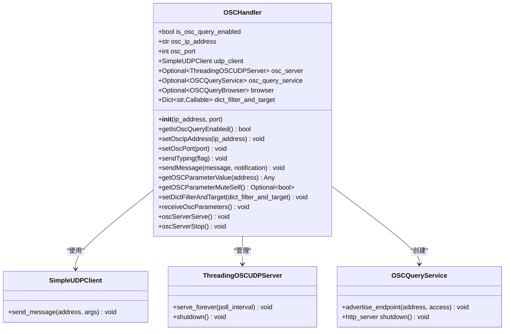
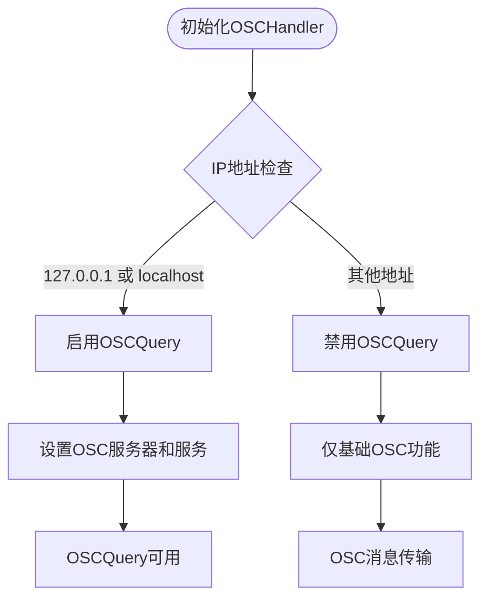
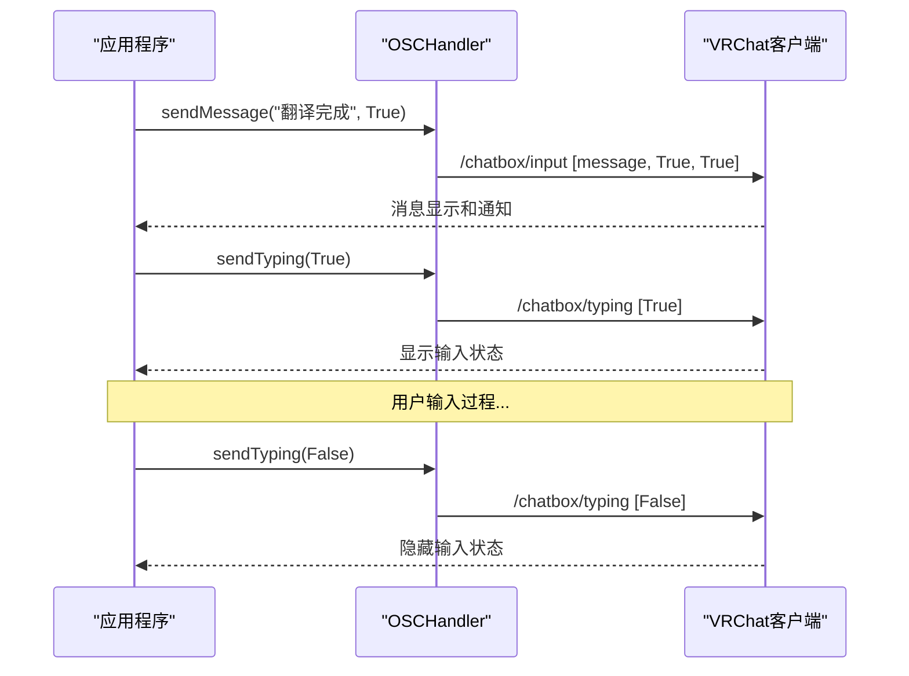
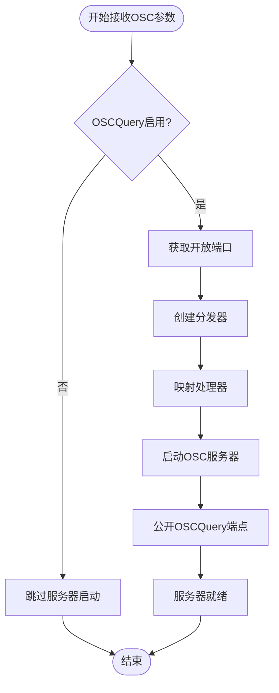
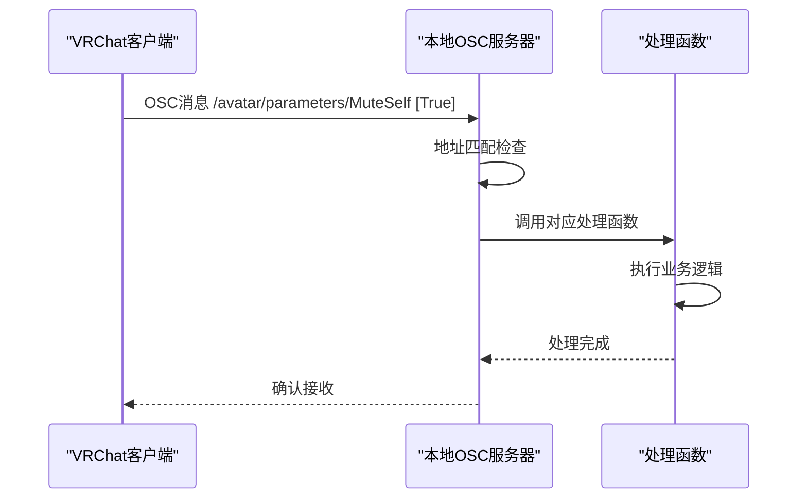
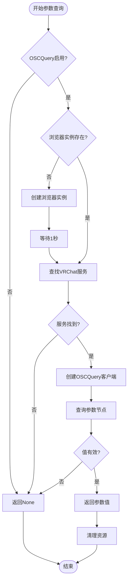
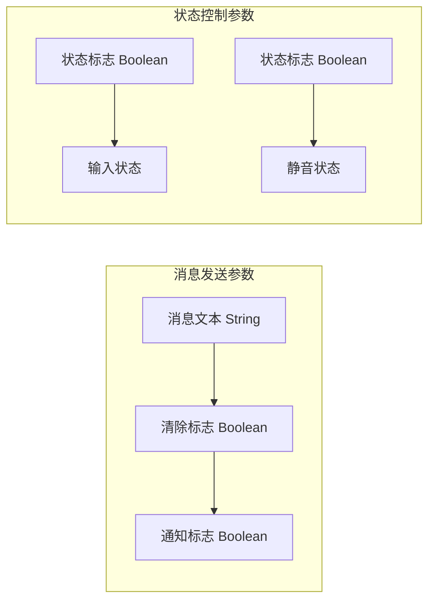
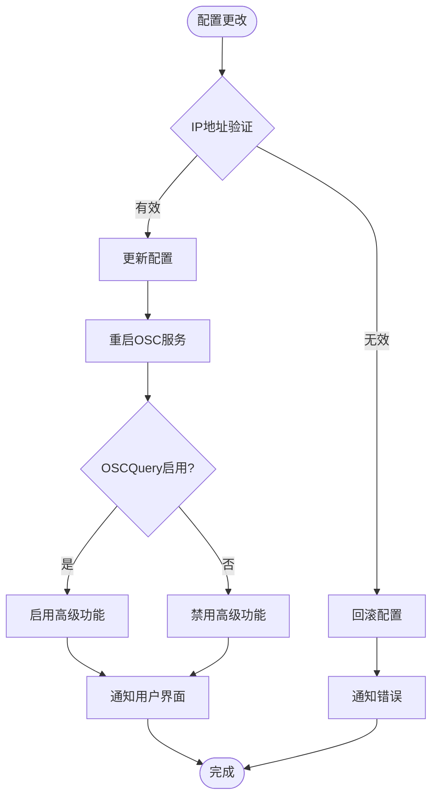
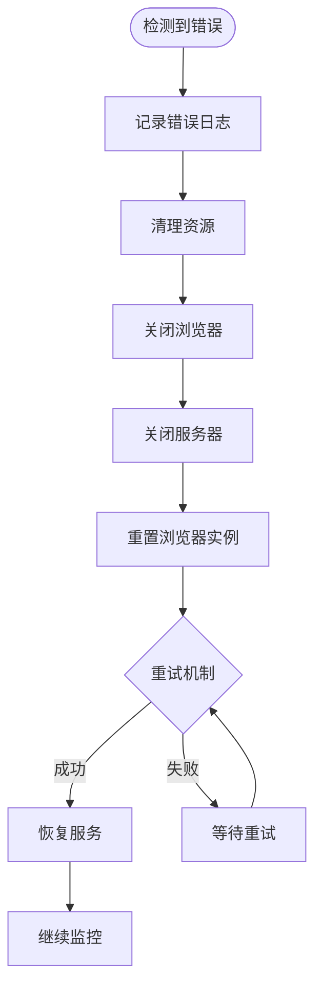
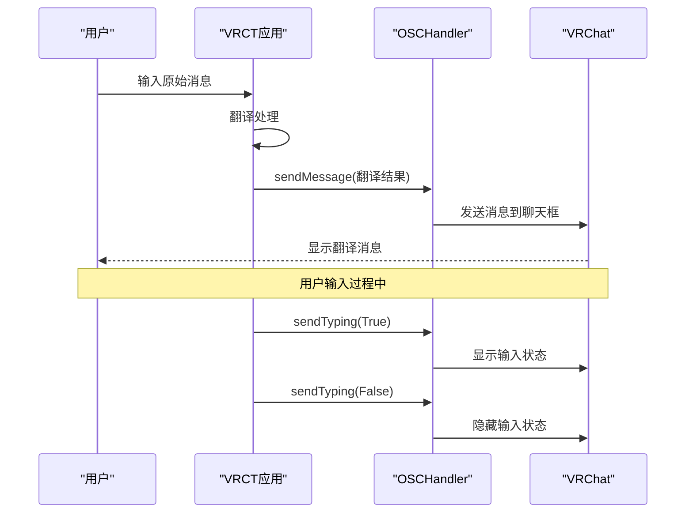

# OSC通信协议

<cite>
**本文档中引用的文件**
- [osc.py](file://src-python/models/osc/osc.py)
- [osc.md](file://src-python/docs/details/osc.md)
- [model.py](file://src-python/model.py)
- [controller.py](file://src-python/controller.py)
- [config.py](file://src-python/config.py)
- [useIsOscAvailable.js](file://src-ui/logics/common/useIsOscAvailable.js)
- [useHandleOscQuery.js](file://src-ui/logics/common/useHandleOscQuery.js)
- [Others.jsx](file://src-ui/views/app/config_page/setting_section/setting_box\others\Others.jsx)
- [controller_zh.md](file://src-python/docs/controller_zh.md)
</cite>

## 目录
1. [简介](#简介)
2. [OSCHandler核心类](#oschandler核心类)
3. [OSCQuery启用条件](#oscquery启用条件)
4. [OSC消息发送功能](#osc消息发送功能)
5. [OSC消息接收与处理机制](#osc消息接收与处理机制)
6. [参数查询功能](#参数查询功能)
7. [OSC地址列表](#osc地址列表)
8. [配置系统集成](#配置系统集成)
9. [错误处理与恢复机制](#错误处理与恢复机制)
10. [实际应用场景](#实际应用场景)

## 简介

VRCT项目实现了基于Open Sound Control (OSC) 协议的高级通信系统，专门用于与VRChat平台进行交互。该系统不仅支持基本的OSC消息传输，还集成了OSCQuery协议，提供了双向通信、自动服务发现和实时参数监控等高级功能。

OSCHandler类是整个OSC通信系统的核心，它负责管理OSC消息的发送和接收，同时在本地环境下提供OSCQuery服务，实现VR平台中的服务发现和参数查询功能。

## OSCHandler核心类

OSCHandler类是一个轻量级的OSC通信包装器，提供以下核心功能：



**图表来源**
- [osc.py](file://src-python/models/osc/osc.py#L40-L241)

**节来源**
- [osc.py](file://src-python/models/osc/osc.py#L40-L241)

## OSCQuery启用条件

OSCQuery协议的启用受到严格的限制，仅在特定条件下可用：

### 启用条件
- **IP地址检查**: 仅当目标地址为"127.0.0.1"或"localhost"时启用OSCQuery
- **本地连接要求**: 远程连接会自动禁用OSCQuery功能
- **库依赖**: 需要安装tinyoscquery库才能使用OSCQuery功能

### 实现逻辑



**图表来源**
- [osc.py](file://src-python/models/osc/osc.py#L48-L57)

### 配置影响

OSCQuery的启用状态直接影响以下功能：
- **参数监控**: 无法实时获取VRChat参数值
- **服务发现**: 无法自动发现VRChat实例
- **双向通信**: 无法接收来自VRChat的参数变化通知

**节来源**
- [osc.py](file://src-python/models/osc/osc.py#L48-L86)
- [useHandleOscQuery.js](file://src-ui/logics/common/useHandleOscQuery.js#L12-L35)

## OSC消息发送功能

### sendMessage方法

sendMessage方法负责向VRChat的聊天框发送消息，支持多种消息格式和通知选项：

#### 方法签名
```python
def sendMessage(self, message: str = "", notification: bool = True) -> None
```

#### 参数说明
- **message**: 要发送的消息文本（非空字符串）
- **notification**: 是否触发VRChat的通知效果（声音和视觉提示）

#### 消息格式
发送的消息被封装为OSC数组：
- 第一个元素：消息文本字符串
- 第二个元素：清除标志（始终为True）
- 第三个元素：通知标志

### sendTyping方法

sendTyping方法用于控制VRChat中的输入状态指示器：

#### 方法签名
```python
def sendTyping(self, flag: bool = False) -> None
```

#### 功能特性
- **布尔参数**: 控制输入状态的开启和关闭
- **即时生效**: 状态变更立即反映在VRChat界面
- **用户友好**: 提供更好的用户体验，显示对方正在输入

### 使用示例流程



**图表来源**
- [osc.py](file://src-python/models/osc/osc.py#L89-L102)
- [model.py](file://src-python/model.py#L474-L484)

**节来源**
- [osc.py](file://src-python/models/osc/osc.py#L89-L102)
- [model.py](file://src-python/model.py#L474-L484)

## OSC消息接收与处理机制

### setDictFilterAndTarget方法

该方法建立OSC地址过滤器与处理函数之间的映射关系：

#### 核心功能
- **地址映射**: 将OSC地址模式映射到相应的处理函数
- **灵活配置**: 支持多个地址的批量配置
- **回调机制**: 提供事件驱动的处理方式

#### 配置示例
```python
osc_handlers = {
    "/avatar/parameters/MuteSelf": handle_mute_change,
    "/chatbox/typing": handle_typing_change,
    "/chatbox/input": handle_chatbox_input
}
osc.setDictFilterAndTarget(osc_handlers)
```

### receiveOscParameters方法

该方法启动本地OSC服务器并公开OSCQuery端点：

#### 服务器启动流程



**图表来源**
- [osc.py](file://src-python/models/osc/osc.py#L154-L185)

#### 服务发现机制
- **自动命名**: 使用服务名称+时间戳生成唯一标识
- **端口分配**: 自动获取可用的UDP和HTTP端口
- **持续运行**: 服务器长时间运行，支持持续通信

### 处理器执行流程



**图表来源**
- [osc.py](file://src-python/models/osc/osc.py#L166-L168)

**节来源**
- [osc.py](file://src-python/models/osc/osc.py#L150-L185)

## 参数查询功能

### getOSCParameterMuteSelf方法

专门用于获取VRChat的MuteSelf参数状态：

#### 功能特性
- **专用查询**: 专门针对MuteSelf参数优化
- **类型安全**: 返回明确的布尔值或None
- **错误处理**: 优雅处理查询失败的情况

### getOSCParameterValue通用方法

提供通用的OSC参数查询功能：

#### 查询流程



**图表来源**
- [osc.py](file://src-python/models/osc/osc.py#L103-L144)

#### 错误恢复机制
- **浏览器重置**: 查询失败时自动清理和重建浏览器实例
- **异常捕获**: 全面的异常处理确保系统稳定性
- **资源管理**: 自动关闭和释放网络资源

**节来源**
- [osc.py](file://src-python/models/osc/osc.py#L103-L144)
- [model.py](file://src-python/model.py#L486-L488)

## OSC地址列表

以下是VRCT系统中使用的主要OSC地址及其功能：

| 地址 | 数据类型 | 应用场景 | 描述 |
|------|----------|----------|------|
| `/chatbox/typing` | Boolean | 输入状态控制 | 控制VRChat中的输入状态指示器 |
| `/chatbox/input` | Array[String, Boolean, Boolean] | 消息发送 | 向VRChat聊天框发送消息 |
| `/avatar/parameters/MuteSelf` | Boolean | 音频状态监控 | 监控用户的静音状态 |

### 地址详细说明

#### /chatbox/typing
- **用途**: 显示或隐藏输入状态指示器
- **参数**: `[boolean flag]`
- **应用场景**: 在开始和结束输入时切换状态

#### /chatbox/input
- **用途**: 向VRChat发送消息
- **参数**: `[message_text, clear_flag, notification_flag]`
- **应用场景**: 发送翻译结果或其他文本消息

#### /avatar/parameters/MuteSelf
- **用途**: 监控音频静音状态
- **参数**: `[boolean mute_state]`
- **应用场景**: 同步麦克风状态，避免在静音时发送语音

### 参数格式规范



**图表来源**
- [osc.py](file://src-python/models/osc/osc.py#L54-L56)

**节来源**
- [osc.py](file://src-python/models/osc/osc.py#L54-L56)
- [controller.py](file://src-python/controller.py#L492-L498)

## 配置系统集成

### 配置变量

VRCT系统通过配置文件管理OSC相关设置：

| 配置项 | 类型 | 默认值 | 描述 |
|--------|------|--------|------|
| `OSC_IP_ADDRESS` | String | "127.0.0.1" | VRChat目标IP地址 |
| `OSC_PORT` | Integer | 9000 | OSC通信端口号 |
| `SEND_MESSAGE_TO_VRC` | Boolean | True | 是否向VRChat发送消息 |
| `VRC_MIC_MUTE_SYNC` | Boolean | False | VRChat麦克风静音同步 |
| `NOTIFICATION_VRC_SFX` | Boolean | True | VRChat通知音效 |

### 配置管理流程



**图表来源**
- [controller.py](file://src-python/controller.py#L1504-L1520)
- [config.py](file://src-python/config.py#L692-L693)

### 用户界面集成

配置功能通过React组件提供用户友好的界面：

#### 功能开关组件
- **VRC麦克风静音同步**: 自动同步VRChat的静音状态
- **发送消息到VRChat**: 控制是否向VRChat发送翻译消息
- **通知音效**: 控制VRChat通知的声音效果

**节来源**
- [config.py](file://src-python/config.py#L692-L693)
- [controller.py](file://src-python/controller.py#L1504-L1520)
- [Others.jsx](file://src-ui/views/app/config_page/setting_section/setting_box\others\Others.jsx#L108-L129)

## 错误处理与恢复机制

### 防御性编程设计

OSCHandler类采用全面的错误处理策略：

#### 异常处理层次
1. **导入保护**: 检测可选依赖库的缺失
2. **运行时保护**: 处理网络连接问题
3. **资源清理**: 自动释放网络资源
4. **状态恢复**: 重建失败的服务实例

### 服务恢复流程



**图表来源**
- [osc.py](file://src-python/models/osc/osc.py#L132-L144)

### 性能优化措施

#### CPU使用率优化
- **长轮询间隔**: 将默认的2秒轮询间隔延长至10秒
- **线程池管理**: 使用守护线程避免阻塞主程序
- **资源复用**: 重用OSCQuery浏览器实例

#### 网络优化
- **端口自动选择**: 自动获取可用端口避免冲突
- **连接超时**: 设置合理的网络超时时间
- **重连机制**: 自动重新建立断开的连接

**节来源**
- [osc.py](file://src-python/models/osc/osc.py#L187-L191)
- [osc.py](file://src-python/models/osc/osc.py#L132-L144)

## 实际应用场景

### VRChat集成场景

#### 翻译系统集成


**图表来源**
- [model.py](file://src-python/model.py#L474-L484)

#### 静音状态同步
- **自动检测**: 监控VRChat的静音状态
- **智能控制**: 在静音状态下暂停语音转录
- **用户体验**: 避免在静音时产生不必要的噪音

#### 输入状态反馈
- **实时响应**: 用户开始输入时立即显示状态
- **及时取消**: 用户停止输入时快速隐藏状态
- **流畅体验**: 最小化延迟确保良好的用户体验

### 开发者工具支持

#### 调试和监控
- **参数追踪**: 实时监控VRChat参数变化
- **连接状态**: 监控OSC连接的健康状况
- **性能指标**: 记录消息发送和接收的性能数据

#### 自动化测试
- **模拟输入**: 模拟用户输入状态
- **参数验证**: 验证VRChat参数的正确性
- **连接测试**: 测试OSC连接的稳定性

**节来源**
- [model.py](file://src-python/model.py#L474-L484)
- [controller.py](file://src-python/controller.py#L492-L498)

## 结论

VRCT项目的OSC通信协议实现了一个功能完整、稳定可靠的VRChat集成解决方案。通过OSCHandler类的精心设计，系统不仅支持基本的OSC消息传输，还提供了高级的OSCQuery功能，实现了真正的双向通信。

### 主要优势
- **本地优先**: OSCQuery功能仅在本地连接时启用，确保安全性
- **健壮性**: 全面的错误处理和自动恢复机制
- **易用性**: 简洁的API设计和丰富的配置选项
- **扩展性**: 模块化的架构支持功能扩展

### 技术特色
- **服务发现**: 自动发现和连接VRChat实例
- **实时监控**: 实时参数查询和状态同步
- **性能优化**: 高效的资源管理和网络优化
- **开发友好**: 完善的调试和监控支持

该OSC通信协议为VRCT项目提供了强大的VRChat集成能力，是实现跨语言交流和增强VR社交体验的重要技术基础。