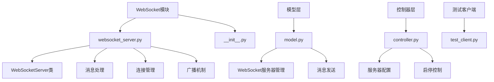
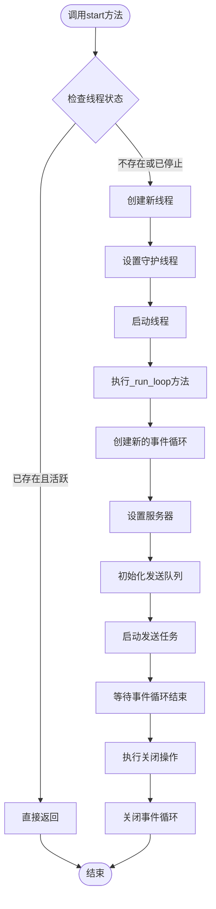
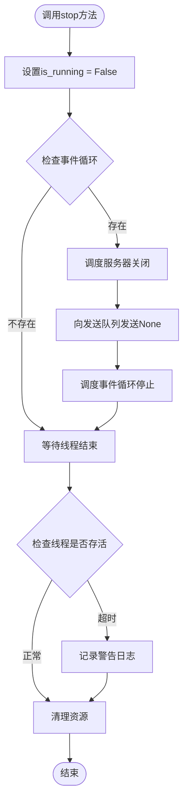
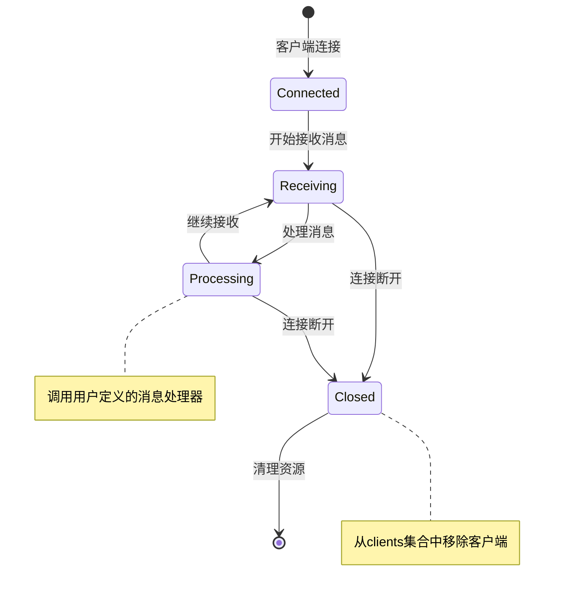

# WebSocket API 文档

<cite>
**本文档中引用的文件**
- [websocket_server.py](file://src-python/src/models/websocket/websocket_server.py)
- [model.py](file://src-python/model.py)
- [controller.py](file://src-python/controller.py)
- [test_client.py](file://src-python/test_client.py)
- [websocket_server.md](file://src-python/docs/details/websocket_server.md)
</cite>

## 目录
1. [简介](#简介)
2. [项目结构](#项目结构)
3. [核心组件](#核心组件)
4. [架构概览](#架构概览)
5. [详细组件分析](#详细组件分析)
6. [依赖关系分析](#依赖关系分析)
7. [性能考虑](#性能考虑)
8. [故障排除指南](#故障排除指南)
9. [结论](#结论)

## 简介

本文档详细介绍了VRCT项目中的WebSocket API系统，重点围绕`WebSocketServer`类的实现。该系统提供了完整的WebSocket服务器功能，支持独立线程运行、客户端连接管理、消息处理和广播等功能。

WebSocket API系统的核心特性包括：
- 在独立线程中运行的asyncio事件循环
- 客户端连接的自动管理和清理
- 异步消息处理和广播机制
- 跨线程安全的消息传递
- JSON格式的消息协议

## 项目结构

WebSocket相关的核心文件组织如下：



**图表来源**
- [websocket_server.py](file://src-python/src/models/websocket/websocket_server.py#L1-L222)
- [model.py](file://src-python/model.py#L1122-L1204)

**章节来源**
- [websocket_server.py](file://src-python/src/models/websocket/websocket_server.py#L1-L50)
- [model.py](file://src-python/model.py#L1112-L1204)

## 核心组件

### WebSocketServer类

`WebSocketServer`是WebSocket通信的核心管理类，提供以下主要功能：

#### 主要属性
- `host`: 服务器主机地址（默认：'127.0.0.1'）
- `port`: 服务器端口号（默认：8765）
- `clients`: 连接的WebSocket客户端集合
- `_message_handler`: 消息处理回调函数
- `_loop`: asyncio事件循环实例
- `_server`: WebSocket服务器实例
- `_thread`: 服务器运行线程
- `_send_queue`: 发送消息队列
- `is_running`: 服务器运行状态标志

#### 核心方法

1. **服务器控制方法**
   - `start()`: 启动服务器（在独立线程中运行）
   - `stop()`: 停止服务器并释放资源

2. **消息处理方法**
   - `set_message_handler(handler)`: 设置消息处理回调
   - `send(message)`: 外部线程安全的消息发送
   - `broadcast(message)`: 异步广播消息

**章节来源**
- [websocket_server.py](file://src-python/src/models/websocket/websocket_server.py#L17-L29)

## 架构概览

WebSocket API系统采用多线程架构，确保服务器的高并发处理能力：

```mermaid
sequenceDiagram
participant Client as 客户端
participant Server as WebSocketServer
participant Loop as 事件循环线程
participant Queue as 发送队列
participant Handler as 消息处理器
Client->>Server : 建立WebSocket连接
Server->>Server : 将客户端添加到clients集合
Server->>Loop : 启动事件循环线程
Client->>Server : 发送消息
Server->>Handler : 调用消息处理回调
Handler->>Server : 处理消息结果
Note over Server,Queue : 外部线程消息发送
Server->>Queue : 将消息放入发送队列
Queue->>Loop : 在事件循环中广播消息
Loop->>Client : 广播给所有客户端
Client->>Server : 断开连接
Server->>Server : 从clients集合移除客户端
```

**图表来源**
- [websocket_server.py](file://src-python/src/models/websocket/websocket_server.py#L38-L56)
- [websocket_server.py](file://src-python/src/models/websocket/websocket_server.py#L70-L82)

## 详细组件分析

### 服务器启动流程（start方法）

`start()`方法负责启动WebSocket服务器，其执行流程如下：



**图表来源**
- [websocket_server.py](file://src-python/src/models/websocket/websocket_server.py#L103-L112)
- [websocket_server.py](file://src-python/src/models/websocket/websocket_server.py#L113-L143)

#### 关键实现细节

1. **线程管理**: 使用`threading.Thread`创建守护线程，确保主线程退出时服务器也能正确终止
2. **事件循环**: 在独立线程中创建新的asyncio事件循环，避免阻塞主线程
3. **服务器初始化**: 通过`websockets.serve()`创建WebSocket服务器实例
4. **发送队列**: 初始化`asyncio.Queue`用于跨线程消息传递

**章节来源**
- [websocket_server.py](file://src-python/src/models/websocket/websocket_server.py#L103-L143)

### 服务器停止流程（stop方法）

`stop()`方法负责优雅地关闭WebSocket服务器：



**图表来源**
- [websocket_server.py](file://src-python/src/models/websocket/websocket_server.py#L161-L176)

#### 停止流程的关键步骤

1. **状态标记**: 设置`is_running`标志位，通知服务器停止监听
2. **事件循环调度**: 使用`call_soon_threadsafe`安全地调度关闭操作
3. **队列终止**: 向发送队列发送特殊值`None`，触发发送循环退出
4. **线程同步**: 使用`join()`等待服务器线程正常终止

**章节来源**
- [websocket_server.py](file://src-python/src/models/websocket/websocket_server.py#L161-L176)

### 客户端连接管理

WebSocket服务器通过`_handler`协程管理单个客户端连接：



**图表来源**
- [websocket_server.py](file://src-python/src/models/websocket/websocket_server.py#L38-L56)

#### 连接生命周期管理

1. **连接建立**: 客户端连接时，自动将WebSocket对象添加到`clients`集合
2. **消息处理**: 通过`set_message_handler()`设置的回调函数处理接收到的消息
3. **异常处理**: 捕获`ConnectionClosed`异常，优雅处理客户端断开
4. **资源清理**: 连接断开时自动从客户端集合中移除

**章节来源**
- [websocket_server.py](file://src-python/src/models/websocket/websocket_server.py#L38-L56)

### 消息处理机制

#### set_message_handler方法

`set_message_handler()`方法允许设置自定义的消息处理回调：

```python
def set_message_handler(self, handler: Callable[['WebSocketServer', WebSocketServerProtocol, str], None])
```

回调函数接收三个参数：
- `server`: WebSocketServer实例
- `websocket`: 当前连接的WebSocket对象
- `message`: 接收到的原始消息字符串

#### 消息广播功能

系统提供两种消息广播方式：

1. **send方法**（外部线程安全）
   - 用于GUI线程或其他后台线程发送消息
   - 通过事件循环调度安全地将消息放入发送队列
   - 实现跨线程消息传递

2. **broadcast方法**（直接异步广播）
   - 用于协程内部直接广播消息
   - 使用`asyncio.run_coroutine_threadsafe`在事件循环中执行
   - 提供更高的性能和更低的延迟

**章节来源**
- [websocket_server.py](file://src-python/src/models/websocket/websocket_server.py#L31-L37)
- [websocket_server.py](file://src-python/src/models/websocket/websocket_server.py#L83-L102)

### _send_queue队列和_send_loop协程

#### 发送队列机制

```mermaid
sequenceDiagram
participant External as 外部线程
participant Queue as 发送队列
participant Loop as _send_loop协程
participant Clients as 所有客户端
External->>Queue : put_nowait(message)
Queue->>Loop : 获取消息
Loop->>Loop : _broadcast_async(message)
Loop->>Clients : 并行发送给所有客户端
Clients-->>Loop : 确认接收
Loop->>Queue : 标记消息已处理
```

**图表来源**
- [websocket_server.py](file://src-python/src/models/websocket/websocket_server.py#L70-L82)

#### 实现特点

1. **异步队列**: 使用`asyncio.Queue`实现线程安全的消息队列
2. **并行广播**: 使用`asyncio.gather()`并行发送消息给所有客户端
3. **异常容忍**: `return_exceptions=True`确保单个客户端失败不影响其他客户端
4. **优雅退出**: 通过发送特殊值`None`优雅地终止发送循环

**章节来源**
- [websocket_server.py](file://src-python/src/models/websocket/websocket_server.py#L58-L82)

### JSON消息格式示例

系统支持多种JSON消息格式，以下是常见指令的结构：

#### SEND_TRANSLATION指令
```json
{
  "type": "SEND_TRANSLATION",
  "source_text": "こんにちは世界",
  "target_language": "en",
  "timestamp": 1234567890.123
}
```

#### GET_CONFIG指令
```json
{
  "type": "GET_CONFIG",
  "config_key": "translation_engine",
  "timestamp": 1234567890.123
}
```

#### 错误处理策略

系统实现了完善的错误处理机制：

1. **ConnectionClosed异常**: 自动捕获并优雅处理客户端断开
2. **JSON解析错误**: 捕获`json.JSONDecodeError`并返回错误响应
3. **通用异常处理**: 捕获所有其他异常并返回标准化错误信息
4. **资源清理**: 确保即使发生异常也能正确清理资源

**章节来源**
- [websocket_server.md](file://src-python/docs/details/websocket_server.md#L554-L594)

## 依赖关系分析

WebSocket API系统的依赖关系图：

```mermaid
graph TD
A[WebSocketServer] --> B[asyncio]
A --> C[threading]
A --> D[websockets]
A --> E[WebSocketServerProtocol]
F[Model] --> A
F --> G[Thread]
F --> H[asyncio.run]
I[Controller] --> F
I --> J[端点处理]
K[TestClient] --> L[WebSocket客户端]
K --> M[JSON通信]
A --> N[Set[WebSocketServerProtocol]]
A --> O[Optional[Callable]]
A --> P[Optional[asyncio.AbstractEventLoop]]
A --> Q[Optional[websockets.serve]]
A --> R[Optional[threading.Thread]]
A --> S[Optional[asyncio.Queue]]
```

**图表来源**
- [websocket_server.py](file://src-python/src/models/websocket/websocket_server.py#L1-L5)
- [model.py](file://src-python/model.py#L1122-L1159)

### 外部依赖

1. **asyncio**: Python标准库，提供异步I/O支持
2. **threading**: Python标准库，提供多线程支持
3. **websockets**: 第三方库，提供WebSocket协议实现

### 内部依赖

1. **Model类**: 提供WebSocket服务器的高级管理接口
2. **Controller类**: 提供WebSocket服务器的配置和控制接口
3. **TestClient**: 提供WebSocket客户端测试工具

**章节来源**
- [websocket_server.py](file://src-python/src/models/websocket/websocket_server.py#L1-L5)
- [model.py](file://src-python/model.py#L1122-L1159)

## 性能考虑

### 并发处理能力

1. **事件驱动架构**: 基于asyncio的事件驱动模型，支持高并发连接
2. **异步I/O**: 使用异步WebSocket库，避免阻塞式I/O操作
3. **并行广播**: 使用`asyncio.gather()`并行发送消息给多个客户端

### 内存管理

1. **连接池管理**: 自动管理客户端连接的生命周期
2. **垃圾回收**: 及时清理断开连接的客户端对象
3. **队列限制**: 通过队列大小控制内存使用

### 网络优化

1. **连接复用**: 支持多个客户端同时连接
2. **消息批处理**: 可通过扩展实现消息批处理优化
3. **压缩支持**: 可通过修改实现消息压缩

## 故障排除指南

### 常见问题及解决方案

#### 1. 服务器无法启动
**症状**: 调用`start()`后服务器不响应
**原因**: 端口被占用或权限不足
**解决方案**: 
- 检查端口是否被其他进程占用
- 使用管理员权限运行程序
- 尝试使用不同的端口号

#### 2. 客户端连接频繁断开
**症状**: 客户端连接后很快断开
**原因**: 网络不稳定或消息处理异常
**解决方案**:
- 检查网络连接质量
- 添加消息处理的日志记录
- 实现重连机制

#### 3. 消息发送失败
**症状**: 调用`send()`或`broadcast()`后消息未送达
**原因**: 事件循环未正确运行或队列满载
**解决方案**:
- 确认服务器处于运行状态
- 检查队列容量设置
- 添加发送失败的重试机制

**章节来源**
- [websocket_server.py](file://src-python/src/models/websocket/websocket_server.py#L161-L176)
- [model.py](file://src-python/model.py#L1161-L1181)

### 调试技巧

1. **启用详细日志**: 在消息处理回调中添加日志记录
2. **监控连接状态**: 定期检查`clients`集合的状态
3. **性能监控**: 监控队列长度和消息处理时间
4. **异常捕获**: 实现全面的异常处理和日志记录

## 结论

VRCT项目的WebSocket API系统提供了一个功能完整、性能优异的WebSocket服务器实现。通过`WebSocketServer`类，开发者可以轻松构建支持高并发、异步消息处理的WebSocket应用。

### 主要优势

1. **线程安全**: 通过独立线程和事件循环确保线程安全
2. **高性能**: 基于asyncio的异步架构提供优秀的并发性能
3. **易于使用**: 简洁的API设计，便于集成和扩展
4. **健壮性**: 完善的错误处理和资源管理机制

### 扩展建议

1. **认证机制**: 可以添加WebSocket级别的认证和授权
2. **消息持久化**: 实现消息的持久化存储和重放功能
3. **负载均衡**: 支持多实例部署和负载均衡
4. **监控指标**: 添加详细的性能监控和指标收集

该WebSocket API系统为VRCT项目提供了强大的实时通信能力，支持各种需要实时数据交换的应用场景。