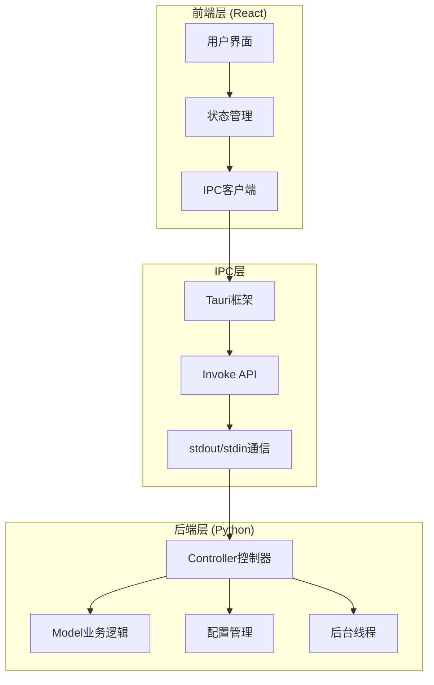
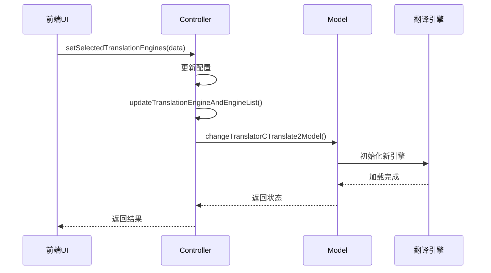
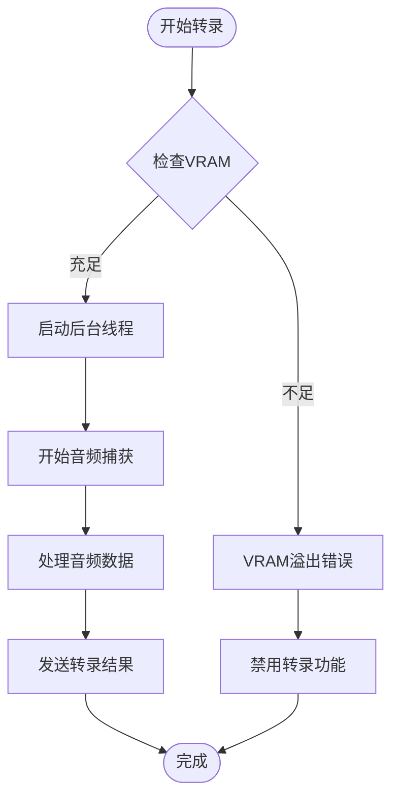

# 内部IPC接口

<cite>
**本文档中引用的文件**
- [controller.py](file://src-python/controller.py)
- [test_client.py](file://src-python/test_client.py)
- [useMainFunction.js](file://src-ui/logics/main/useMainFunction.js)
- [mainloop.py](file://src-python/mainloop.py)
- [model.py](file://src-python/model.py)
- [config.py](file://src-python/config.py)
</cite>

## 目录
1. [简介](#简介)
2. [项目架构概览](#项目架构概览)
3. [核心IPC接口](#核心ipc接口)
4. [翻译引擎管理接口](#翻译引擎管理接口)
5. [语音转录控制接口](#语音转录控制接口)
6. [配置管理接口](#配置管理接口)
7. [数据传输协议](#数据传输协议)
8. [错误处理机制](#错误处理机制)
9. [测试客户端](#测试客户端)
10. [最佳实践](#最佳实践)

## 简介

VRCT项目采用Python后端与React前端的双层架构，通过内部IPC（进程间通信）接口实现前后端的数据交换。该系统的核心是controller.py模块，它定义了一套标准化的公共方法，作为前端UI与后端Python逻辑之间的桥梁。

### 核心特性

- **标准化接口**：所有公共方法都遵循统一的返回格式
- **异步处理**：支持后台线程操作，避免阻塞主线程
- **状态管理**：实时更新配置状态并通知前端
- **错误恢复**：完善的错误检测和恢复机制
- **多引擎支持**：支持多种翻译和转录引擎

## 项目架构概览



**图表来源**
- [controller.py](file://src-python/controller.py#L1-L50)
- [useMainFunction.js](file://src-ui/logics/main/useMainFunction.js#L1-L44)

**章节来源**
- [controller.py](file://src-python/controller.py#L1-L100)
- [mainloop.py](file://src-python/mainloop.py#L1-L50)

## 核心IPC接口

### 版本信息接口

#### getVersion方法
获取应用程序版本号，作为系统初始化的重要检查点。

**方法签名**：
```python
@staticmethod
def getVersion(*args, **kwargs) -> dict
```

**调用上下文**：
- 前端首次连接时验证后端可用性
- 自动更新检查的基础信息
- 调试和日志记录

**返回格式**：
```json
{
    "status": 200,
    "result": "1.2.3"
}
```

**章节来源**
- [controller.py](file://src-python/controller.py#L763-L766)

### 计算模式接口

#### getComputeMode方法
获取当前计算模式设置，决定AI模型的运行方式。

**方法签名**：
```python
@staticmethod
def getComputeMode(*args, **kwargs) -> dict
```

**可能值**：
- `"cpu"`：仅使用CPU
- `"cuda"`：使用NVIDIA GPU
- `"auto"`：自动选择最优设备

**章节来源**
- [controller.py](file://src-python/controller.py#L776-L779)

## 翻译引擎管理接口

### 动态切换翻译引擎

#### setSelectedTranslationEngines方法
动态切换当前使用的翻译引擎，支持Gemini、Ollama、Plamo等多种引擎。

**方法签名**：
```python
@staticmethod
def setSelectedTranslationEngines(data:dict, *args, **kwargs) -> dict
```

**参数结构**：
```json
{
    "tab_id": "engine_name"
}
```

**调用流程**：


**图表来源**
- [controller.py](file://src-python/controller.py#L928-L932)
- [controller.py](file://src-python/controller.py#L2661-L2679)

**关键控制流**：
1. **配置更新**：更新全局配置中的选定引擎
2. **引擎验证**：检查目标引擎是否可用
3. **模型重载**：触发翻译模型的重新初始化
4. **状态同步**：通知前端更新界面状态

**章节来源**
- [controller.py](file://src-python/controller.py#L928-L932)
- [controller.py](file://src-python/controller.py#L2661-L2679)

### 引擎状态管理

#### 引擎列表获取
```python
@staticmethod
def getTranslationEngines(*args, **kwargs) -> dict
```

#### 当前引擎查询
```python
@staticmethod
def getSelectedTranslationEngines(*args, **kwargs) -> dict
```

**章节来源**
- [controller.py](file://src-python/controller.py#L891-L907)
- [controller.py](file://src-python/controller.py#L925-L927)

## 语音转录控制接口

### 转录流程控制

#### 启动转录功能
```python
def setEnableTranscriptionSend(self, *args, **kwargs) -> dict
def setEnableTranscriptionReceive(self, *args, **kwargs) -> dict
```

#### 停止转录功能
```python
def setDisableTranscriptionSend(self, *args, **kwargs) -> dict
def setDisableTranscriptionReceive(self, *args, **kwargs) -> dict
```

**启动流程**：


**图表来源**
- [controller.py](file://src-python/controller.py#L2366-L2388)
- [controller.py](file://src-python/controller.py#L2556-L2567)

**后台线程管理**：
每个转录功能都有对应的线程管理方法：

```python
# 发送转录线程
def startThreadingTranscriptionSendMessage(self) -> None
def stopThreadingTranscriptionSendMessage(self) -> None

# 接收转录线程  
def startThreadingTranscriptionReceiveMessage(self) -> None
def stopThreadingTranscriptionReceiveMessage(self) -> None
```

**章节来源**
- [controller.py](file://src-python/controller.py#L2366-L2388)
- [controller.py](file://src-python/controller.py#L2556-L2616)

### 音量阈值控制

#### 微调能量检测
```python
def setEnableCheckMicThreshold(self, *args, **kwargs) -> dict
def setDisableCheckMicThreshold(self, *args, **kwargs) -> dict
```

#### 播放器能量检测
```python
def setEnableCheckSpeakerThreshold(self, *args, **kwargs) -> dict
def setDisableCheckSpeakerThreshold(self, *args, **kwargs) -> dict
```

**章节来源**
- [controller.py](file://src-python/controller.py#L2344-L2354)
- [controller.py](file://src-python/controller.py#L2332-L2342)

## 配置管理接口

### 设备配置

#### 麦克风设备选择
```python
def setSelectedMicHost(self, data, *args, **kwargs) -> dict
def setSelectedMicDevice(self, data, *args, **kwargs) -> dict
```

#### 扬声器设备选择
```python
def setSelectedSpeakerDevice(self, data, *args, **kwargs) -> dict
```

### 界面配置

#### 透明度设置
```python
@staticmethod
def setTransparency(data, *args, **kwargs) -> dict
```

#### UI缩放设置
```python
@staticmethod
def setUiScaling(data, *args, **kwargs) -> dict
```

#### 字体设置
```python
@staticmethod
def setFontFamily(data, *args, **kwargs) -> dict
```

**章节来源**
- [controller.py](file://src-python/controller.py#L1142-L1161)
- [controller.py](file://src-python/controller.py#L1026-L1029)
- [controller.py](file://src-python/controller.py#L1035-L1037)

## 数据传输协议

### 标准响应格式

所有IPC接口都遵循统一的响应格式：

```python
{
    "status": int,      # HTTP状态码
    "result": Any,      # 实际返回数据
    "endpoint": str     # 请求的端点路径
}
```

### 错误状态码

| 状态码 | 含义 | 使用场景 |
|--------|------|----------|
| 200 | 成功 | 正常操作完成 |
| 400 | 客户端错误 | 参数无效或超出范围 |
| 401 | 权限不足 | 需要管理员权限 |
| 404 | 资源不存在 | 请求的端点不存在 |
| 500 | 服务器错误 | 内部处理异常 |

### 数据编码

所有数据在传输前都会进行Base64编码：

```python
import base64
import json

# 编码过程
data = {"key": "value"}
encoded_data = base64.b64encode(json.dumps(data).encode('utf-8')).decode('utf-8')

# 解码过程
decoded_data = json.loads(base64.b64decode(encoded_data).decode('utf-8'))
```

**章节来源**
- [test_client.py](file://src-python/test_client.py#L149-L156)

## 错误处理机制

### VRAM内存管理

系统具备智能的VRAM内存检测和管理能力：

```python
# VRAM错误检测
is_vram_error, error_message = model.detectVRAMError(exception)
if is_vram_error:
    # 自动回滚到默认设备
    self.run(400, self.run_mapping["error_translation_enable_vram_overflow"], {
        "message": "VRAM out of memory enabling translation",
        "data": error_message
    })
    self.setDisableTranslation()
```

### 设备访问状态

```python
# 设备访问互斥锁
while self.device_access_status is False:
    sleep(1)
self.device_access_status = False

try:
    # 执行设备操作
    model.startMicTranscript(self.micMessage)
finally:
    self.device_access_status = True
```

**章节来源**
- [controller.py](file://src-python/controller.py#L2526-L2551)
- [controller.py](file://src-python/controller.py#L2519-L2552)

## 测试客户端

### test_client.py功能

测试客户端提供了完整的IPC接口测试环境：

```python
class TestClient:
    def __init__(self):
        # 启动后端进程
        self.process = subprocess.Popen(
            [sys.executable, 'mainloop.py'],
            stdin=subprocess.PIPE,
            stdout=subprocess.PIPE,
            stderr=subprocess.PIPE,
            text=True
        )
        
    def send_request(self, endpoint: str, data=None, timeout=30.0):
        # 构建请求
        request = {"endpoint": endpoint}
        if data is not None:
            json_data = json.dumps(data, ensure_ascii=False)
            encoded_data = base64.b64encode(json_data.encode('utf-8')).decode('utf-8')
            request["data"] = encoded_data
            
        # 发送请求
        self.process.stdin.write(json.dumps(request, ensure_ascii=False) + '\n')
        self.process.stdin.flush()
        
        # 等待响应
        response = self.process.stdout.readline()
        return json.loads(response.strip())
```

### 调用示例

```bash
# 设置翻译引擎为Gemini
echo '{"command": "set_selected_translation_engines", "args": ["gemini"]}' | python test_client.py

# 获取当前版本
echo '{"command": "get_version"}' | python test_client.py

# 启用翻译功能
echo '{"command": "set_enable_translation"}' | python test_client.py
```

**章节来源**
- [test_client.py](file://src-python/test_client.py#L31-L51)
- [test_client.py](file://src-python/test_client.py#L129-L282)

## 最佳实践

### 1. 异步操作处理

对于耗时操作，始终使用后台线程：

```python
# 正确做法：使用后台线程
def startThreadingTranscriptionSendMessage(self) -> None:
    th_startTranscriptionSendMessage = Thread(target=self.startTranscriptionSendMessage)
    th_startTranscriptionSendMessage.daemon = True
    th_startTranscriptionSendMessage.start()

# 错误做法：直接阻塞主线程
def startTranscriptionSendMessage(self) -> None:
    # 可能导致界面冻结
    model.startMicTranscript(self.micMessage)
```

### 2. 错误恢复策略

```python
def setEnableTranslation(self, *args, **kwargs) -> dict:
    try:
        if model.isLoadedCTranslate2Model() is False:
            model.changeTranslatorCTranslate2Model()
        config.ENABLE_TRANSLATION = True
        return {"status": 200, "result": config.ENABLE_TRANSLATION}
    except Exception as e:
        # 错误检测和恢复
        is_vram_error, error_message = model.detectVRAMError(e)
        if is_vram_error:
            self.setDisableTranslation()
            return {"status": 400, "result": False}
        raise
```

### 3. 状态同步

```python
# 更新配置后立即通知前端
def setSelectedTranslationEngines(self, data:dict, *args, **kwargs) -> dict:
    config.SELECTED_TRANSLATION_ENGINES = data
    # 立即通知前端更新
    self.run(200, self.run_mapping["selected_translation_engines"], config.SELECTED_TRANSLATION_ENGINES)
    return {"status": 200, "result": config.SELECTED_TRANSLATION_ENGINES}
```

### 4. 资源清理

```python
def stopThreadingTranscriptionSendMessage(self) -> None:
    th_stopTranscriptionSendMessage = Thread(target=self.stopTranscriptionSendMessage)
    th_stopTranscriptionSendMessage.daemon = True
    th_stopTranscriptionSendMessage.start()
    # 等待线程完成
    th_stopTranscriptionSendMessage.join()
```

这个IPC接口系统为VRCT项目提供了稳定、高效的前后端通信能力，支持复杂的AI功能和实时交互需求。通过标准化的接口设计和完善的错误处理机制，确保了系统的可靠性和用户体验。