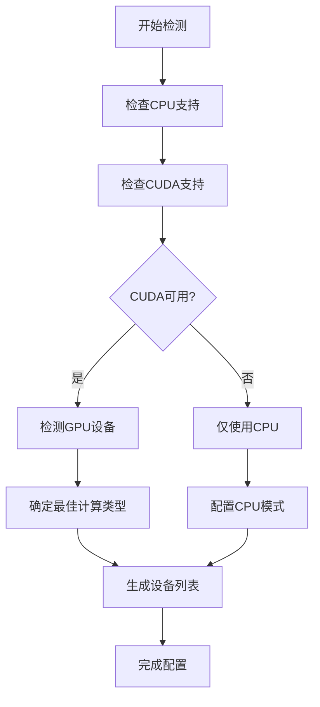
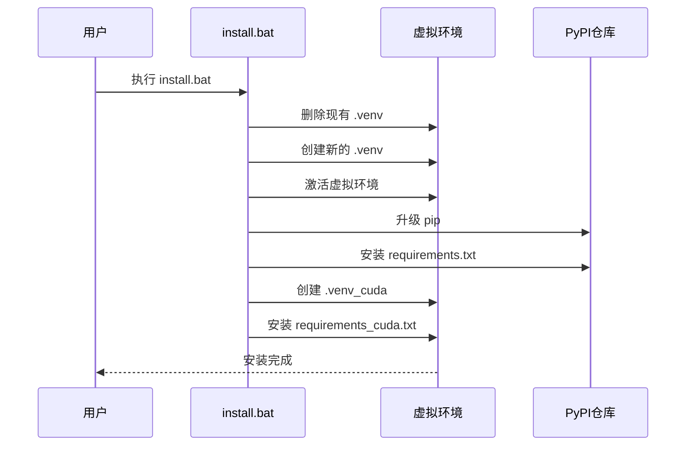
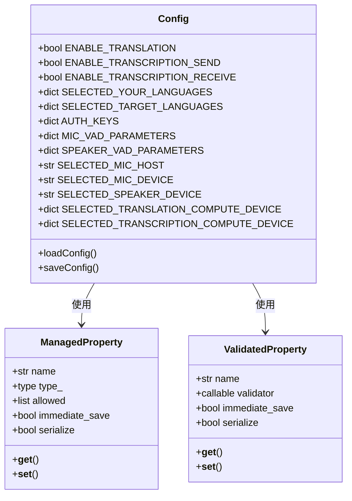
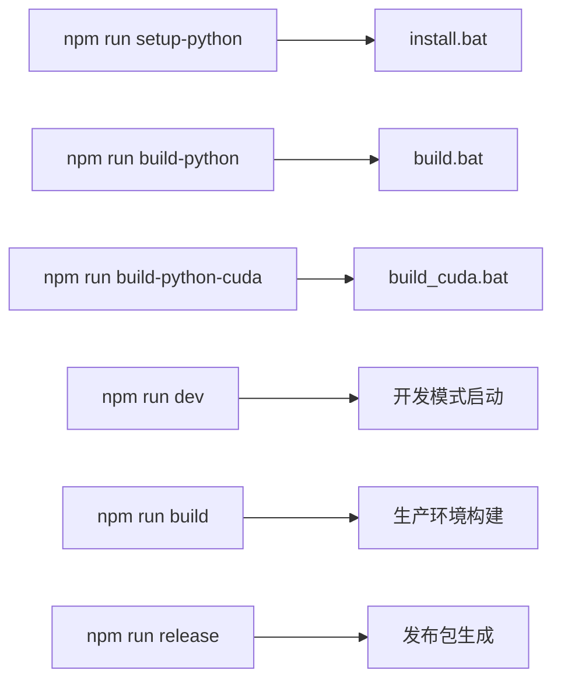
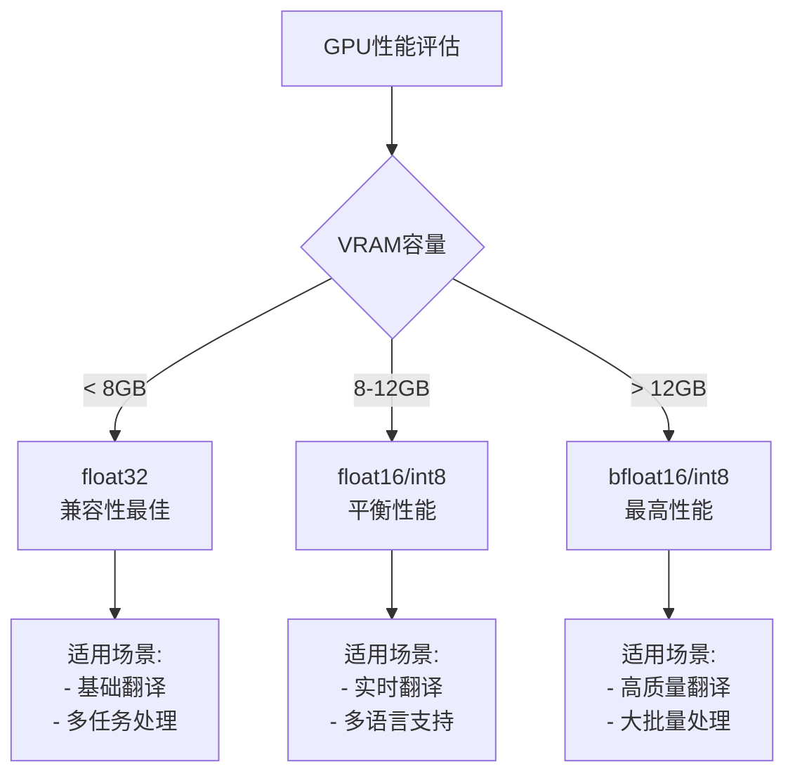
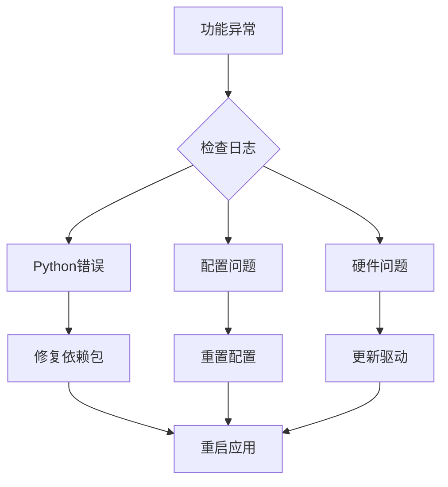

# 安装与配置

<cite>
**本文档中引用的文件**
- [install.bat](file://install.bat)
- [build.bat](file://build.bat)
- [build_cuda.bat](file://build_cuda.bat)
- [requirements.txt](file://requirements.txt)
- [requirements_cuda.txt](file://requirements_cuda.txt)
- [package.json](file://package.json)
- [src-python/config.py](file://src-python/config.py)
- [src-python/utils.py](file://src-python/utils.py)
- [locales/readme_first.txt](file://locales/readme_first.txt)
- [docs/readmes/README.en.md](file://docs/readmes/README.en.md)
</cite>

## 目录
1. [简介](#简介)
2. [系统要求](#系统要求)
3. [环境准备](#环境准备)
4. [安装步骤](#安装步骤)
5. [配置详解](#配置详解)
6. [构建与打包](#构建与打包)
7. [常见问题解决](#常见问题解决)
8. [依赖包说明](#依赖包说明)
9. [硬件优化建议](#硬件优化建议)
10. [故障排除指南](#故障排除指南)

## 简介

VRCT是一个用于VRChat对话支持的软件，提供聊天翻译、语音转文字等功能。本指南将详细介绍从环境准备到首次运行的完整安装配置流程。

## 系统要求

### 最低系统要求
- **操作系统**: Windows 10 或更高版本 (Windows 11 推荐)
- **处理器**: Intel i5 或 AMD Ryzen 5 及以上
- **内存**: 8GB RAM (推荐 16GB)
- **存储空间**: 至少 10GB 可用磁盘空间
- **显卡**: 支持 CUDA 的 NVIDIA 显卡 (可选，但强烈推荐)

### 推荐系统要求
- **操作系统**: Windows 11 22H2 或更高版本
- **处理器**: Intel i7 或 AMD Ryzen 7 及以上
- **内存**: 16GB RAM (推荐 32GB)
- **存储空间**: 20GB 可用磁盘空间
- **显卡**: NVIDIA RTX 3060 或更高型号

## 环境准备

### Python 环境要求
- **Python 版本**: 3.10 或 3.11
- **pip**: 最新版本
- **虚拟环境**: 自动创建

### 开发工具要求
- **Git**: 用于克隆仓库 (可选)
- **Visual Studio Build Tools**: 用于编译C扩展 (可选)
- **Node.js**: 用于前端构建 (如果需要重新构建UI)

### 硬件检测

系统会自动检测可用的计算设备：



**图表来源**
- [src-python/utils.py](file://src-python/utils.py#L92-L132)

## 安装步骤

### 方法一：直接下载安装 (推荐)

1. **下载最新版本**
   - 从 [GitHub Releases](https://github.com/misyaguziya/VRCT/releases/) 下载
   - 或从 [BOOTH.pm](https://misyaguziya.booth.pm/items/5155325) 购买

2. **解压文件**
   - 将下载的压缩包解压到目标目录
   - 建议使用专用目录，避免与其他程序冲突

3. **首次运行**
   - 运行 `VRCT.exe`
   - 系统会自动创建配置文件和必要的目录结构

### 方法二：从源码安装

#### 1. 克隆仓库
```bash
git clone https://github.com/misyaguziya/VRCT.git
cd VRCT
```

#### 2. 执行安装脚本



**图表来源**
- [install.bat](file://install.bat#L1-L25)

#### 3. 安装脚本详解

**install.bat 脚本功能**：
- 清理旧的虚拟环境
- 创建两个独立的Python虚拟环境
  - `.venv`: 标准版本 (CPU + CUDA)
  - `.venv_cuda`: 仅CUDA版本
- 分别安装对应的依赖包

**build.bat 和 build_cuda.bat**：
- 用于构建最终的应用程序包
- 使用 PyInstaller 打包应用
- 区分标准版和CUDA版

**节来源**
- [install.bat](file://install.bat#L1-L25)
- [build.bat](file://build.bat#L1-L2)
- [build_cuda.bat](file://build_cuda.bat#L1-L2)

## 配置详解

### 主配置文件结构

VRCT使用JSON格式的配置文件，位于应用程序目录下：



**图表来源**
- [src-python/config.py](file://src-python/config.py#L232-L335)

### 关键配置项说明

#### 计算设备配置

**CPU/GPU选择**：
- 系统自动检测可用设备
- 默认优先使用CUDA (GPU加速)
- 支持手动切换CPU模式

**计算类型优化**：
- `float32`: 基础精度，兼容性最好
- `float16`: 中等精度，性能较好
- `int8`: 高性能，适合现代GPU
- `bfloat16`: 高精度，部分GPU支持

#### 语言设置

**输入语言配置**：
- 支持多种语言组合
- 可启用/禁用特定语言对
- 自动检测默认语言

**目标语言配置**：
- 多目标语言支持
- 可配置多个翻译目标
- 实时语言切换

#### 翻译引擎配置

| 引擎类型 | 描述 | API要求 | 性能特点 |
|---------|------|---------|----------|
| DeepL | 商业翻译服务 | API密钥 | 高质量翻译 |
| OpenAI | GPT系列模型 | API密钥 | 流式处理 |
| Gemini | Google AI模型 | API密钥 | 多模态支持 |
| Plamo | 本地部署 | 本地服务 | 隐私保护 |
| Ollama | 本地LLM | 本地安装 | 自定义模型 |

#### 音频设备配置

**麦克风设置**：
- 自动设备检测
- 声音阈值调节
- VAD (Voice Activity Detection) 参数
- 录音超时控制

**扬声器设置**：
- 屏幕录制音频
- 自动设备选择
- 音量阈值配置
- 噪声过滤

**节来源**
- [src-python/config.py](file://src-python/config.py#L531-L1027)

## 构建与打包

### 开发环境构建

#### NPM脚本命令



**图表来源**
- [package.json](file://package.json#L7-L24)

#### 构建流程详解

1. **清理工作**：删除临时文件和旧的构建产物
2. **Python构建**：使用PyInstaller打包Python后端
3. **前端构建**：使用Vite构建React前端
4. **Tauri打包**：将前后端整合为最终可执行文件

### CUDA版本构建

对于支持CUDA的GPU，可以构建专门的CUDA版本：

- 使用 `requirements_cuda.txt` 安装CUDA优化的依赖
- 针对NVIDIA GPU进行性能优化
- 支持更高级别的计算精度

**节来源**
- [package.json](file://package.json#L7-L24)

## 常见问题解决

### 依赖包问题

#### 1. 依赖包安装失败

**症状**：pip安装过程中出现错误
**解决方案**：
- 确保网络连接正常
- 使用国内镜像源
- 升级pip到最新版本
- 检查Python版本兼容性

#### 2. CUDA版本不兼容

**症状**：GPU加速功能无法使用
**解决方案**：
- 检查CUDA版本与PyTorch兼容性
- 更新显卡驱动程序
- 安装正确的CUDA Toolkit版本

#### 3. 依赖包冲突

**症状**：某些功能异常或崩溃
**解决方案**：
- 清理虚拟环境
- 重新安装依赖包
- 使用lock文件锁定版本

### 硬件相关问题

#### 1. 音频设备识别失败

**症状**：无法识别麦克风或扬声器
**解决方案**：
- 检查设备驱动程序
- 确认设备权限设置
- 重启音频服务

#### 2. 显卡性能问题

**症状**：GPU加速效果不佳
**解决方案**：
- 检查GPU温度和功耗
- 调整计算精度设置
- 更新显卡驱动

### 配置问题

#### 1. 配置文件损坏

**症状**：程序启动失败或配置丢失
**解决方案**：
- 删除损坏的配置文件
- 重置为默认配置
- 检查文件权限

#### 2. API密钥无效

**症状**：翻译功能无法使用
**解决方案**：
- 检查API密钥格式
- 确认账户余额充足
- 验证API访问权限

## 依赖包说明

### 核心依赖包

#### 机器学习框架
- **torch==2.7.0**: PyTorch深度学习框架
- **faster-whisper==1.1.1**: 高性能语音识别库
- **ctranslate2==4.6.0**: 神经机器翻译引擎
- **transformers==4.40.2**: Hugging Face Transformers

#### 音频处理
- **PyAudioWPatch==0.2.12.6**: 音频输入输出
- **pydub==0.25.1**: 音频文件处理
- **SpeechRecognition**: 语音识别接口

#### 网络通信
- **websockets==15.0.1**: WebSocket协议支持
- **python-osc==1.9.0**: OSC协议支持
- **requests**: HTTP请求库

#### 用户界面
- **PyYAML==6.0.2**: YAML配置文件解析
- **psutil==5.9.8**: 系统资源监控
- **pycaw==20240210**: Windows音频控制

### 翻译服务依赖

#### 在线翻译服务
- **deepl==1.22.0**: DeepL API客户端
- **langchain-openai==0.3.32**: OpenAI集成
- **langchain-google-genai==2.1.10**: Google AI集成
- **langchain-ollama==0.3.10**: Ollama集成

#### 本地翻译
- **translators**: 第三方翻译服务聚合
- **SudachiPy**: 日语分词工具

### 开发工具依赖

- **pyinstaller==6.10.0**: 应用程序打包
- **numpy==1.26.4**: 数值计算基础
- **pillow==10.0.0**: 图像处理
- **openvr==1.26.701**: VR头盔支持

**节来源**
- [requirements.txt](file://requirements.txt#L1-L32)
- [requirements_cuda.txt](file://requirements_cuda.txt#L1-L33)

## 硬件优化建议

### GPU优化配置

#### NVIDIA显卡推荐
- **入门级**: GTX 1660 Super (8GB)
- **中端**: RTX 3060 (8GB) 或 RTX 4060 (8GB)
- **高端**: RTX 4070/4080 (12GB+) 或 RTX 6000 Ada (24GB)

#### 计算精度选择


### CPU优化配置

#### 多核处理器优势
- **并行处理能力**: 加速语音识别和翻译
- **多线程支持**: 提升整体系统响应
- **内存带宽**: 减少数据传输延迟

#### 推荐CPU规格
- **Intel**: i7-12700K 或 i9-13900K
- **AMD**: Ryzen 7 7800X3D 或 Ryzen 9 7950X
- **核心数**: 8核心以上，16线程
- **频率**: 基础频率3.5GHz以上

### 内存优化

#### 内存容量建议
- **最低**: 16GB DDR4 3200MHz
- **推荐**: 32GB DDR5 6000MHz
- **高端**: 64GB DDR5 6400MHz

#### 内存分配策略
- **系统内存**: 8-12GB
- **应用内存**: 16-24GB
- **缓存内存**: 4-8GB

## 故障排除指南

### 启动问题诊断

#### 1. 程序无法启动
**检查清单**：
- Python环境是否正确配置
- 依赖包是否完整安装
- 配置文件是否损坏
- 权限设置是否正确

#### 2. 功能模块异常
**诊断流程**：


### 性能优化

#### 1. 翻译速度慢
**优化方案**：
- 降低计算精度 (float32)
- 减少并发任务数量
- 使用本地模型替代在线服务
- 增加系统内存

#### 2. 音频延迟高
**优化方案**：
- 调整缓冲区大小
- 使用专用音频接口
- 优化VAD参数
- 减少后台程序占用

#### 3. GPU利用率低
**优化方案**：
- 检查CUDA版本兼容性
- 调整批处理大小
- 优化模型加载方式
- 监控GPU温度和功耗

### 数据备份与恢复

#### 配置备份
- 定期备份 `config.json` 文件
- 记录自定义设置
- 备份用户数据和日志

#### 系统恢复
- 删除损坏的配置文件
- 重新安装应用程序
- 从备份恢复重要设置
- 验证功能完整性

**节来源**
- [src-python/utils.py](file://src-python/utils.py#L192-L200)

## 结论

通过本指南，您应该能够成功安装和配置VRCT软件。建议在开始使用前仔细阅读相关文档，特别是针对您的硬件配置进行适当的优化设置。如果遇到任何问题，请参考故障排除章节或寻求社区支持。

记住定期更新软件版本以获得最新的功能和安全补丁。祝您使用愉快！