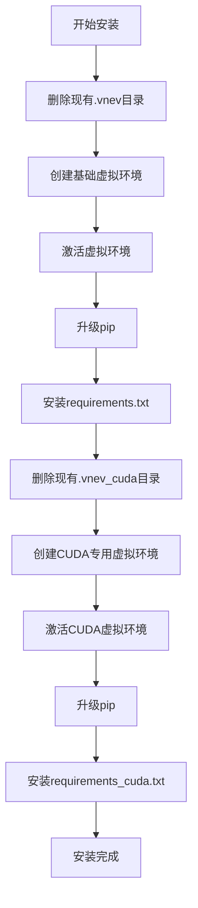
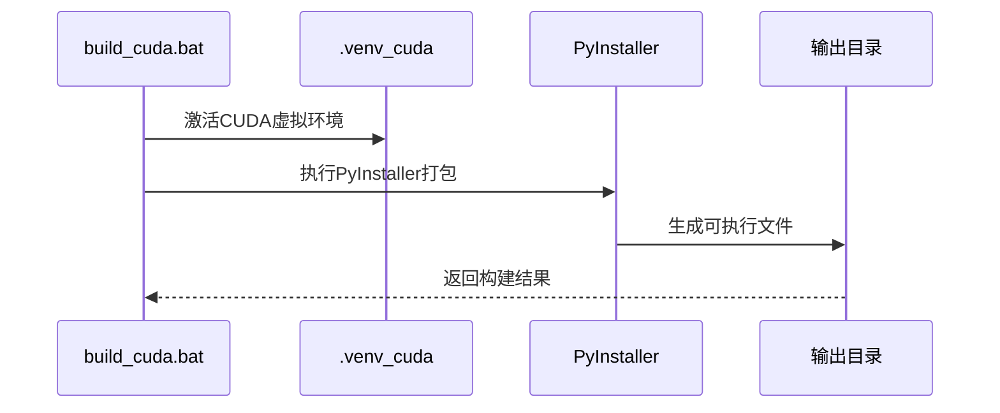
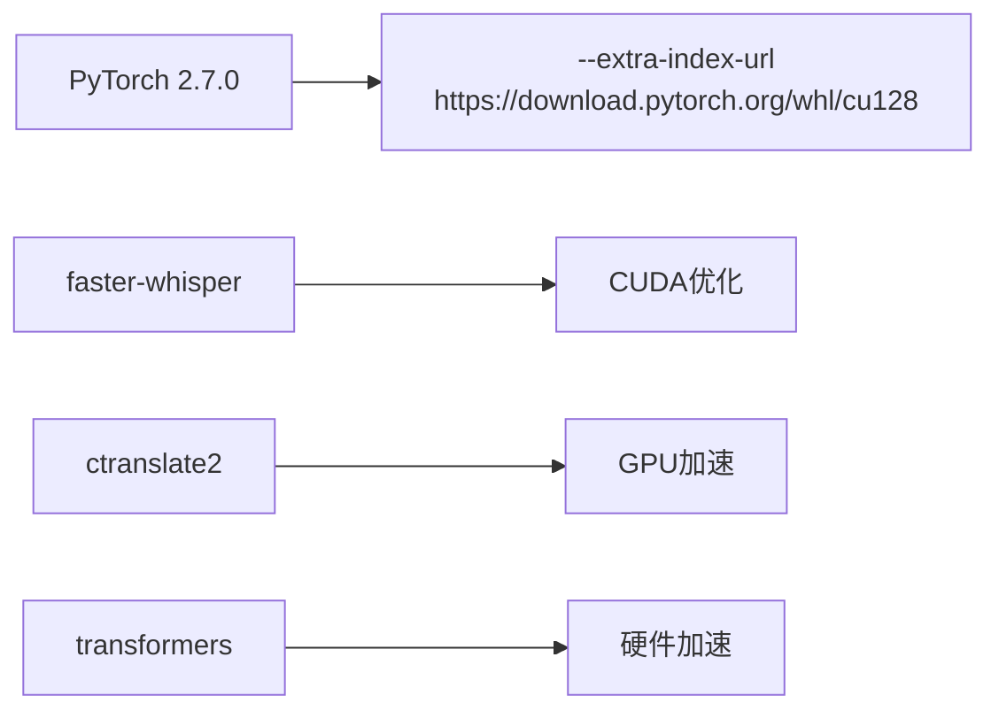
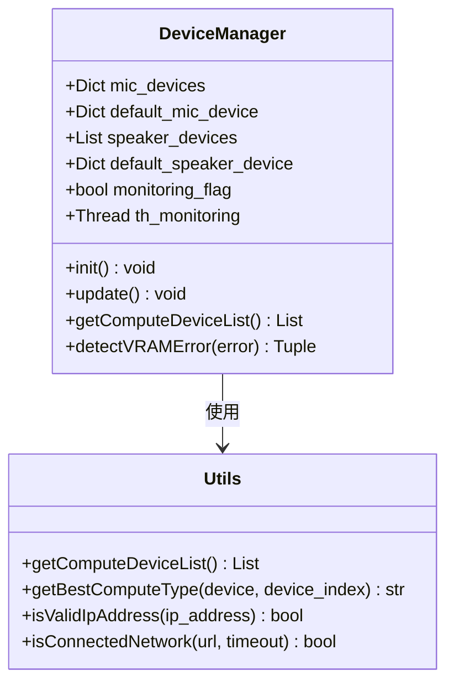
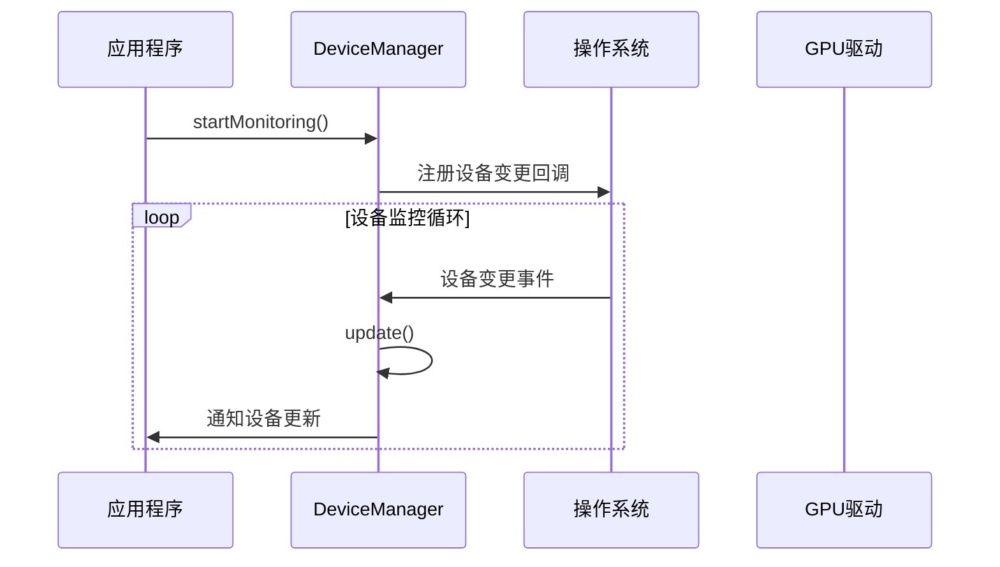

# CUDA加速安装指南

<cite>
**本文档中引用的文件**
- [install.bat](file://install.bat)
- [build_cuda.bat](file://build_cuda.bat)
- [requirements_cuda.txt](file://requirements_cuda.txt)
- [requirements.txt](file://requirements.txt)
- [mainloop.py](file://src-python/mainloop.py)
- [model.py](file://src-python/model.py)
- [device_manager.py](file://src-python/device_manager.py)
- [utils.py](file://src-python/utils.py)
- [config.py](file://src-python/config.py)
</cite>

## 目录
1. [简介](#简介)
2. [系统要求](#系统要求)
3. [CUDA环境准备](#cuda环境准备)
4. [安装脚本详解](#安装脚本详解)
5. [PyTorch CUDA配置](#pytorch-cuda配置)
6. [GPU检测与验证](#gpu检测与验证)
7. [常见问题解决](#常见问题解决)
8. [性能优化建议](#性能优化建议)
9. [故障排除指南](#故障排除指南)

## 简介

本指南基于VRCT项目的CUDA加速安装流程，详细介绍如何在Windows环境下配置CUDA支持，包括专用虚拟环境创建、PyTorch CUDA绑定、GPU可用性验证等关键步骤。VRCT是一个支持多语言翻译和语音识别的应用程序，通过CUDA加速显著提升AI模型推理性能。

## 系统要求

### 硬件要求
- **GPU**: NVIDIA GPU（推荐RTX系列或更高）
- **显存**: 至少4GB（推荐8GB以上用于大型模型）
- **CPU**: 支持AVX指令集的现代处理器
- **内存**: 最少8GB RAM（推荐16GB以上）

### 软件要求
- **操作系统**: Windows 10/11 (64位)
- **Python**: 3.8-3.11
- **NVIDIA驱动**: 最新稳定版
- **CUDA Toolkit**: 12.8或更高版本

## CUDA环境准备

### 1. NVIDIA驱动安装

在开始之前，请确保已安装最新版本的NVIDIA驱动程序：

```bash
# 检查驱动版本
nvidia-smi
```

输出示例：
```
+-----------------------------------------------------------------------------+
| NVIDIA-SMI 551.78       Driver Version: 551.78       CUDA Version: 12.4     |
|-------------------------------+----------------------+----------------------+
| GPU  Name        Persistence-M| Bus-Id        Disp.A | Volatile Uncorr. ECC |
| Fan  Temp  Perf  Pwr:Usage/Cap|         Memory-Usage | GPU-Util  Compute M. |
|===============================+======================+======================|
|   0  NVIDIA GeForce ...  On   | 00000000:01:00.0 Off |                  N/A |
| 30%   45C    P8    10W / 250W |      0MiB / 12288MiB |      0%      Default |
+-------------------------------+----------------------+----------------------+
```

### 2. CUDA Toolkit安装

下载并安装CUDA Toolkit 12.8或更高版本：
- 访问[NVIDIA CUDA下载页面](https://developer.nvidia.com/cuda-downloads)
- 选择适合Windows的安装包
- 安装完成后添加CUDA路径到系统PATH

## 安装脚本详解

### install.bat脚本分析

install.bat脚本执行以下关键步骤：



**图表来源**
- [install.bat](file://install.bat#L1-L25)

#### 关键步骤说明

1. **基础环境创建** (`lines 1-12`)
   - 删除现有的`.venv`虚拟环境
   - 创建新的Python虚拟环境
   - 激活虚拟环境
   - 升级pip到最新版本
   - 安装标准依赖包

2. **CUDA专用环境** (`lines 14-25`)
   - 删除现有的`.venv_cuda`虚拟环境
   - 创建专门的CUDA加速虚拟环境
   - 激活CUDA环境
   - 升级pip
   - 安装CUDA优化的依赖包

**节来源**
- [install.bat](file://install.bat#L1-L25)

### build_cuda.bat脚本分析

build_cuda.bat脚本专门用于构建CUDA版本的应用程序：



**图表来源**
- [build_cuda.bat](file://build_cuda.bat#L1-L2)

**节来源**
- [build_cuda.bat](file://build_cuda.bat#L1-L2)

## PyTorch CUDA配置

### requirements_cuda.txt详解

CUDA版本的requirements文件包含特殊的索引URL配置：



**图表来源**
- [requirements_cuda.txt](file://requirements_cuda.txt#L1-L33)

#### 关键配置说明

1. **PyTorch CUDA版本** (`line 1`)
   ```
   torch==2.7.0
   ```
   指定使用PyTorch 2.7.0版本，该版本包含CUDA 12.8支持。

2. **特殊索引URL** (`line 2`)
   ```
   --extra-index-url https://download.pytorch.org/whl/cu128
   ```
   这个配置告诉pip从NVIDIA提供的CUDA 12.8专用仓库下载预编译的PyTorch二进制文件，确保与本地CUDA驱动完全兼容。

3. **其他CUDA优化包**
   - `faster-whisper`: 语音识别库的CUDA加速版本
   - `ctranslate2`: 神经机器翻译库，支持GPU推理
   - `transformers`: Hugging Face Transformers库的GPU优化版本

**节来源**
- [requirements_cuda.txt](file://requirements_cuda.txt#L1-L33)

### CUDA版本验证

安装完成后，验证PyTorch是否正确绑定到CUDA：

```python
import torch
print(f"CUDA可用: {torch.cuda.is_available()}")
print(f"CUDA版本: {torch.version.cuda}")
print(f"GPU数量: {torch.cuda.device_count()}")
print(f"当前GPU: {torch.cuda.current_device()}")
print(f"GPU名称: {torch.cuda.get_device_name(0)}")
```

## GPU检测与验证

### 设备管理器功能

VRCT项目包含完整的设备管理系统，能够自动检测和管理计算设备：



**图表来源**
- [device_manager.py](file://src-python/device_manager.py#L57-L529)
- [utils.py](file://src-python/utils.py#L92-L167)

### GPU计算类型支持

系统根据GPU架构自动选择最优的计算类型：

| GPU系列 | 支持的计算类型 | 性能等级 |
|---------|---------------|----------|
| RTX系列 | int8_bfloat16, int8_float16, int8, bfloat16, float16, int8_float32, float32 | 最高 |
| Tesla/A100 | int8_bfloat16, int8_float16, int8, bfloat16, float16, int8_float32, float32 | 高 |
| Quadro | int8_bfloat16, int8_float16, int8, bfloat16, float16, int8_float32, float32 | 中等 |
| GTX系列 | float32 | 基础 |

**节来源**
- [utils.py](file://src-python/utils.py#L108-L127)

### 实时设备监控

设备管理器提供实时监控功能：



**图表来源**
- [device_manager.py](file://src-python/device_manager.py#L266-L306)

## 常见问题解决

### 1. CUDA初始化失败

**症状**: `RuntimeError: CUDA error: initialization error`

**解决方案**:
```bash
# 检查CUDA驱动兼容性
nvidia-smi

# 清理CUDA缓存
set CUDA_CACHE_DISABLE=1
set CUDA_LAUNCH_BLOCKING=1

# 重新安装CUDA版本的PyTorch
pip uninstall torch torchvision torchaudio
pip install torch torchvision torchaudio --index-url https://download.pytorch.org/whl/cu128
```

### 2. 显存不足错误

**症状**: `RuntimeError: CUDA out of memory`

**解决方案**:
```python
import torch
import gc

# 强制释放GPU内存
torch.cuda.empty_cache()
gc.collect()

# 检查可用显存
print(f"GPU内存使用: {torch.cuda.memory_allocated() / 1024**3:.2f} GB")
print(f"GPU内存空闲: {torch.cuda.memory_reserved() / 1024**3:.2f} GB")
```

### 3. 驱动版本过低

**症状**: `RuntimeError: CUDA driver version is insufficient`

**解决方案**:
1. 下载并安装最新NVIDIA驱动
2. 重启计算机
3. 验证驱动版本：`nvidia-smi`

### 4. PyTorch版本不匹配

**症状**: `ImportError: DLL load failed`

**解决方案**:
```bash
# 检查当前PyTorch安装
pip show torch

# 卸载并重新安装正确的版本
pip uninstall torch torchvision torchaudio
pip install torch torchvision torchaudio --index-url https://download.pytorch.org/whl/cu128
```

## 性能优化建议

### 1. 计算类型选择

根据GPU性能自动选择最优计算类型：

```python
def optimize_compute_type(gpu_name):
    """根据GPU型号选择最优计算类型"""
    if "RTX" in gpu_name or "GeForce" in gpu_name:
        return "int8_bfloat16"  # 最高性能
    elif "Tesla" in gpu_name or "A100" in gpu_name:
        return "bfloat16"       # 高性能
    else:
        return "float32"        # 兼容性优先
```

### 2. 内存管理策略

实现智能内存管理：

```python
class MemoryManager:
    def __init__(self):
        self.min_memory_threshold = 0.2  # 保留20%显存
        
    def ensure_memory_available(self, required_gb):
        """确保有足够的GPU内存"""
        total_memory = torch.cuda.get_device_properties(0).total_memory
        allocated_memory = torch.cuda.memory_allocated()
        
        if allocated_memory / total_memory > (1 - self.min_memory_threshold):
            torch.cuda.empty_cache()
            return True
        return False
```

### 3. 批处理优化

根据GPU能力调整批处理大小：

```python
def calculate_optimal_batch_size(gpu_name, model_size_gb):
    """根据GPU和模型大小计算最优批处理大小"""
    if "RTX 3090" in gpu_name or "RTX 4090" in gpu_name:
        return min(32, int(24 / model_size_gb))
    elif "RTX 3080" in gpu_name:
        return min(16, int(16 / model_size_gb))
    else:
        return 1  # 基础配置
```

## 故障排除指南

### 诊断工具

创建完整的诊断脚本：

```python
#!/usr/bin/env python3
"""CUDA诊断工具"""

import torch
import subprocess
import sys
import os

def check_system_requirements():
    """检查系统要求"""
    print("=== 系统要求检查 ===")
    
    # Python版本
    print(f"Python版本: {sys.version}")
    
    # CUDA版本
    if torch.cuda.is_available():
        print(f"CUDA版本: {torch.version.cuda}")
        print(f"GPU数量: {torch.cuda.device_count()}")
        for i in range(torch.cuda.device_count()):
            print(f"GPU {i}: {torch.cuda.get_device_name(i)}")
    else:
        print("CUDA不可用")
    
    # NVIDIA驱动
    try:
        result = subprocess.run(["nvidia-smi"], capture_output=True, text=True)
        print(f"NVIDIA驱动: {result.stdout.split('Driver Version:')[1].split()[0]}")
    except:
        print("无法检测NVIDIA驱动")

def check_environment():
    """检查环境变量"""
    print("\n=== 环境变量检查 ===")
    cuda_home = os.environ.get("CUDA_HOME")
    cuda_path = os.environ.get("CUDA_PATH")
    path = os.environ.get("PATH", "")
    
    print(f"CUDA_HOME: {cuda_home}")
    print(f"CUDA_PATH: {cuda_path}")
    print(f"PATH中包含CUDA: {'CUDA' in path}")

def check_pytorch_packages():
    """检查PyTorch相关包"""
    print("\n=== PyTorch包检查 ===")
    packages = ["torch", "torchvision", "torchaudio"]
    
    for pkg in packages:
        try:
            module = __import__(pkg)
            print(f"{pkg}: {module.__version__}")
        except ImportError:
            print(f"{pkg}: 未安装")

if __name__ == "__main__":
    check_system_requirements()
    check_environment()
    check_pytorch_packages()
```

### 日志记录

启用详细的CUDA日志：

```python
import logging

# 配置CUDA日志
logging.basicConfig(level=logging.INFO)
logger = logging.getLogger(__name__)

def log_cuda_operations(operation, duration, memory_used=None):
    """记录CUDA操作日志"""
    log_message = f"CUDA操作: {operation} - 耗时: {duration:.2f}s"
    if memory_used:
        log_message += f", 内存使用: {memory_used:.2f}GB"
    logger.info(log_message)
```

### 自动修复机制

实现自动故障恢复：

```python
class CUDAFallbackManager:
    def __init__(self):
        self.primary_device = "cuda:0"
        self.fallback_device = "cpu"
        self.fallback_count = 0
        self.max_fallbacks = 3
        
    def execute_with_fallback(self, operation, *args, **kwargs):
        """带降级机制的操作执行"""
        try:
            return operation(*args, **kwargs)
        except RuntimeError as e:
            if "out of memory" in str(e).lower():
                if self.fallback_count < self.max_fallbacks:
                    self.fallback_count += 1
                    print(f"GPU内存不足，切换到CPU (尝试 {self.fallback_count}/{self.max_fallbacks})")
                    return self.execute_with_fallback(operation, *args, fallback=True, **kwargs)
                else:
                    raise RuntimeError("GPU内存不足且达到最大降级次数")
            else:
                raise
```

通过遵循本指南，您应该能够成功配置和优化VRCT项目的CUDA加速功能。如果遇到任何问题，请参考故障排除部分或联系技术支持团队。