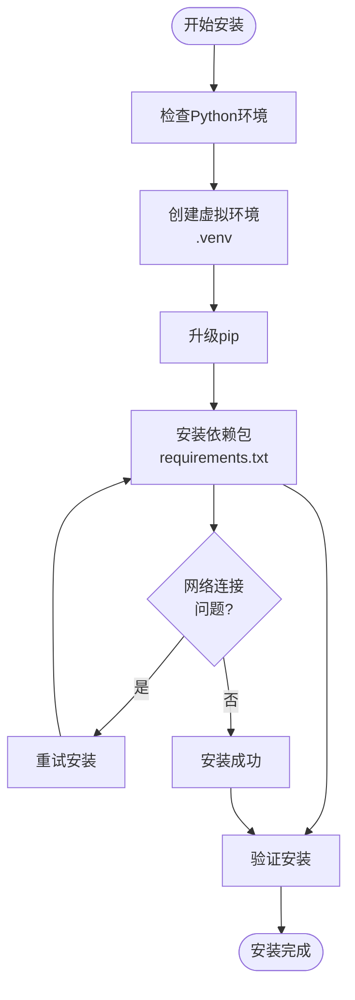
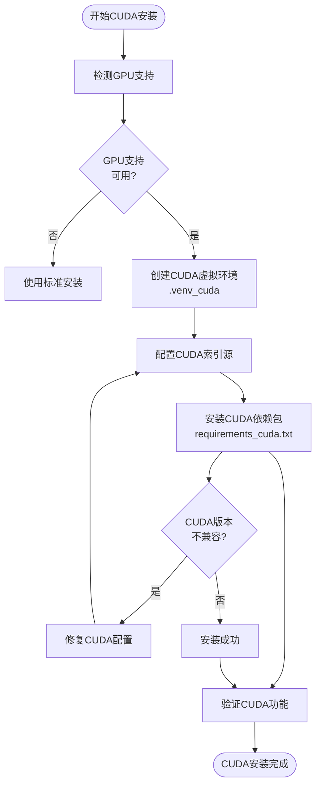
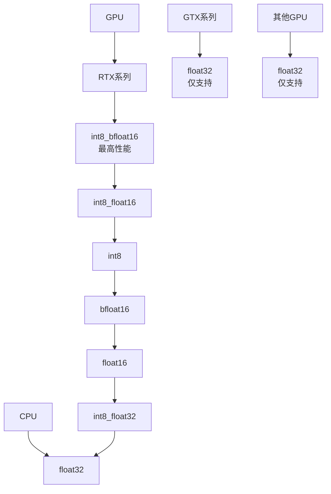
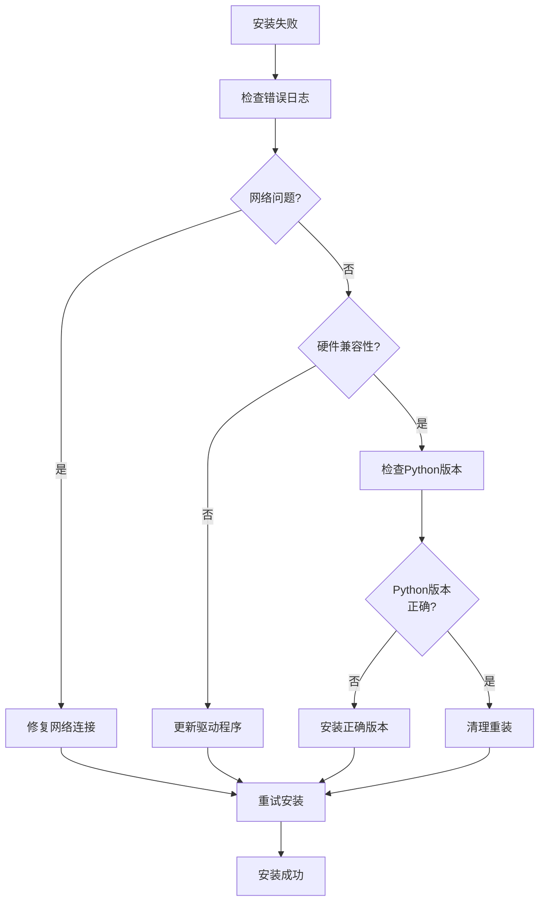

# 安装步骤

<cite>
**本文档中引用的文件**
- [install.bat](file://install.bat)
- [requirements.txt](file://requirements.txt)
- [requirements_cuda.txt](file://requirements_cuda.txt)
- [build.bat](file://build.bat)
- [build_cuda.bat](file://build_cuda.bat)
- [package.json](file://package.json)
- [README.md](file://docs/readmes/README.en.md)
- [src-python/utils.py](file://src-python/utils.py)
- [src-python/config.py](file://src-python/config.py)
- [src-ui/logics/common/useUpdateSoftware.js](file://src-ui/logics/common/useUpdateSoftware.js)
</cite>

## 目录
1. [简介](#简介)
2. [系统要求](#系统要求)
3. [标准安装模式](#标准安装模式)
4. [CUDA加速安装模式](#cuda加速安装模式)
5. [核心依赖包详解](#核心依赖包详解)
6. [硬件兼容性指南](#硬件兼容性指南)
7. [常见问题解决](#常见问题解决)
8. [故障排除指南](#故障排除指南)
9. [总结](#总结)

## 简介

VRCT是一个支持VRChat对话翻译和转录的软件，采用混合架构设计，包含前端React界面和后端Python服务。本指南将详细介绍两种安装模式：标准安装（CPU模式）和CUDA加速安装（GPU模式），帮助用户根据硬件条件选择最适合的安装方式。

## 系统要求

### 基础要求
- **操作系统**: Windows 10或更高版本
- **Python**: 3.8或更高版本
- **内存**: 至少4GB RAM（推荐8GB以上）
- **存储空间**: 至少2GB可用空间

### 硬件要求对比

| 功能特性 | 标准模式 | CUDA模式 |
|---------|---------|---------|
| 计算设备 | CPU | CPU + GPU |
| AI推理速度 | 较慢 | 显著提升 |
| 内存占用 | 较低 | 中等 |
| GPU需求 | 无 | NVIDIA GPU（推荐） |
| CUDA版本 | 无需 | CUDA 12.8 |

## 标准安装模式

### 安装流程概述

标准安装模式适用于没有NVIDIA GPU或不需要GPU加速的用户。该模式使用CPU进行所有AI计算任务。



**图表来源**
- [install.bat](file://install.bat#L1-L25)

### 详细安装步骤

#### 1. 准备工作
- 确保已安装Python 3.8或更高版本
- 确保网络连接稳定
- 关闭杀毒软件（可选）

#### 2. 执行安装脚本
运行以下命令启动标准安装：

```bash
install.bat
```

#### 3. 安装过程详解

**虚拟环境创建**：
- 删除现有`.venv`目录（如果存在）
- 创建新的Python虚拟环境
- 激活虚拟环境

**依赖包安装**：
- 升级pip到最新版本
- 强制重新安装所有依赖包
- 使用`--no-cache-dir`避免缓存问题

**安装完成后**：
- 验证所有依赖包正确安装
- 设置环境变量
- 准备就绪状态

**节来源**
- [install.bat](file://install.bat#L1-L25)

## CUDA加速安装模式

### 安装流程概述

CUDA加速安装模式专为配备NVIDIA GPU的用户设计，通过GPU加速AI计算任务，显著提升性能。



**图表来源**
- [install.bat](file://install.bat#L14-L25)
- [requirements_cuda.txt](file://requirements_cuda.txt#L1-L33)

### CUDA安装详细步骤

#### 1. 硬件准备
- 确认NVIDIA GPU驱动程序已安装
- 确认CUDA Toolkit版本兼容
- 确认显存足够（至少2GB）

#### 2. 执行CUDA安装
运行以下命令启动CUDA安装：

```bash
install.bat
```

#### 3. CUDA特定配置

**PyTorch CUDA索引**：
- 添加额外的PyTorch索引源
- 指向`https://download.pytorch.org/whl/cu128`
- 自动下载适合的CUDA版本包

**依赖包差异**：
- 标准版：`torch==2.7.0`
- CUDA版：`torch==2.7.0` + `--extra-index-url`

**节来源**
- [install.bat](file://install.bat#L14-L25)
- [requirements_cuda.txt](file://requirements_cuda.txt#L1-L33)

## 核心依赖包详解

### 核心AI框架

#### PyTorch (2.7.0)
- **用途**: 深度学习框架，用于模型推理
- **版本要求**: 固定版本2.7.0确保兼容性
- **CUDA支持**: 支持GPU加速计算

#### Faster Whisper (1.1.1)
- **用途**: 高速语音识别引擎
- **特点**: 基于Whisper模型的优化版本
- **性能**: 支持多种计算精度

#### CTranslate2 (4.6.0)
- **用途**: 高性能神经机器翻译
- **优势**: 支持INT8量化，提升推理速度
- **兼容性**: 与PyTorch深度集成

### 系统依赖

#### NumPy (1.26.4)
- **用途**: 数值计算基础库
- **重要性**: AI模型运算的核心依赖

#### Pillow (10.0.0)
- **用途**: 图像处理
- **应用**: OCR和图像预处理

#### PyAudioWPatch (0.2.12.6)
- **用途**: 音频输入输出
- **特点**: 改进的音频处理能力

### 通信和接口

#### Python-OSC (1.9.0)
- **用途**: 开放音乐控制协议
- **应用**: 与VRChat通信

#### WebSockets (15.0.1)
- **用途**: 实时双向通信
- **实现**: 前后端数据交换

### 语言和翻译

#### Transformers (4.40.2)
- **用途**: 预训练语言模型
- **支持**: 多种翻译和理解任务

#### DeepL (1.22.0)
- **用途**: 专业翻译服务
- **特点**: 高质量翻译API

**节来源**
- [requirements.txt](file://requirements.txt#L1-L32)
- [requirements_cuda.txt](file://requirements_cuda.txt#L1-L33)

## 硬件兼容性指南

### GPU兼容性矩阵

| GPU系列 | 计算类型支持 | 推荐设置 | 性能等级 |
|---------|-------------|---------|---------|
| **RTX系列** | 全部支持 | int8_bfloat16 | 高 |
| **Tesla/A100** | 全部支持 | int8_bfloat16 | 极高 |
| **Quadro系列** | 全部支持 | int8_bfloat16 | 高 |
| **GTX系列** | float32 | float32 | 中等 |
| **其他** | float32 | float32 | 基础 |

### 计算类型优先级



**图表来源**
- [src-python/utils.py](file://src-python/utils.py#L149-L167)

### 硬件检测和配置

系统会自动检测可用的计算设备并选择最优配置：

**CPU配置**：
- 支持所有计算类型
- 默认使用`auto`模式自动选择

**GPU配置**：
- 检测CUDA设备数量
- 获取GPU名称和能力
- 应用设备特定限制

**节来源**
- [src-python/utils.py](file://src-python/utils.py#L92-L132)

## 常见问题解决

### 网络连接问题

#### 问题症状
- 依赖包下载失败
- PyTorch下载超时
- 网络连接不稳定

#### 解决方案

**临时解决方案**：
1. 检查网络连接状态
2. 尝试使用代理服务器
3. 手动下载缺失的包

**长期解决方案**：
```bash
# 设置国内镜像源
pip install --index-url https://pypi.tuna.tsinghua.edu.cn/simple -r requirements.txt
```

### CUDA版本不兼容

#### 问题症状
- PyTorch无法加载CUDA版本
- GPU设备检测失败
- 计算类型不匹配

#### 解决方案

**检查CUDA版本**：
```python
import torch
print(f"CUDA可用: {torch.cuda.is_available()}")
print(f"CUDA版本: {torch.version.cuda}")
print(f"GPU数量: {torch.cuda.device_count()}")
```

**手动指定CUDA版本**：
编辑`requirements_cuda.txt`中的PyTorch版本：
```txt
--extra-index-url https://download.pytorch.org/whl/cu118  # CUDA 11.8
--extra-index-url https://download.pytorch.org/whl/cu121  # CUDA 12.1
```

### 内存不足问题

#### 问题症状
- 安装过程中内存溢出
- 模型加载失败
- 系统响应缓慢

#### 解决方案

**减少内存使用**：
1. 使用标准安装而非CUDA安装
2. 降低模型量化级别
3. 关闭不必要的应用程序

**增加虚拟内存**：
```bash
# Windows系统
# 控制面板 -> 系统 -> 高级系统设置 -> 性能设置 -> 高级 -> 虚拟内存
```

### 权限问题

#### 问题症状
- 无法创建虚拟环境
- 无法写入安装目录
- pip安装失败

#### 解决方案

**以管理员身份运行**：
```bash
# 右键点击install.bat
# 选择"以管理员身份运行"
```

**修改安装路径**：
```bash
# 修改install.bat中的路径
set INSTALL_PATH=C:\VRCT
```

## 故障排除指南

### 安装失败诊断流程



### 错误代码对照表

| 错误类型 | 可能原因 | 解决方法 |
|---------|---------|---------|
| `ModuleNotFoundError` | 缺少依赖包 | 重新运行安装脚本 |
| `CUDA out of memory` | 显存不足 | 使用CPU模式或降低模型大小 |
| `Permission denied` | 权限不足 | 以管理员身份运行 |
| `TimeoutError` | 网络超时 | 检查网络连接或使用代理 |

### 性能优化建议

#### 系统级优化
1. **关闭后台程序**: 减少系统资源占用
2. **调整电源设置**: 设置高性能模式
3. **清理磁盘空间**: 确保有足够的可用空间

#### 应用级优化
1. **选择合适模型**: 根据硬件选择模型大小
2. **调整计算精度**: 平衡速度和精度
3. **监控资源使用**: 使用任务管理器监控

**节来源**
- [src-python/docs/utils.md](file://src-python/docs/utils.md#L616-L644)

## 总结

VRCT提供了灵活的安装选项，用户可以根据硬件条件和性能需求选择合适的安装模式：

### 选择指南

**选择标准安装的情况**：
- 没有NVIDIA GPU
- 对性能要求不高
- 需要最小系统资源
- 主要在CPU上运行

**选择CUDA安装的情况**：
- 配备NVIDIA GPU
- 需要高性能AI推理
- 处理大量语音转录
- 进行实时翻译

### 最佳实践

1. **备份配置**: 安装前备份现有配置
2. **定期更新**: 保持软件和驱动程序最新
3. **监控性能**: 关注系统资源使用情况
4. **社区支持**: 利用官方文档和社区资源

通过遵循本指南，用户可以顺利完成VRCT的安装，并根据需要选择最适合的运行模式。如果遇到任何问题，请参考故障排除部分或寻求社区支持。