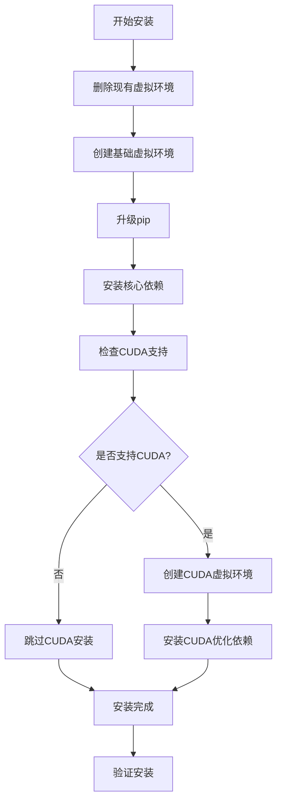
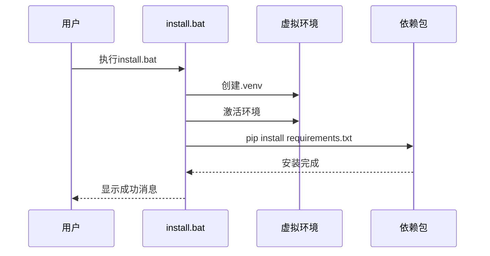
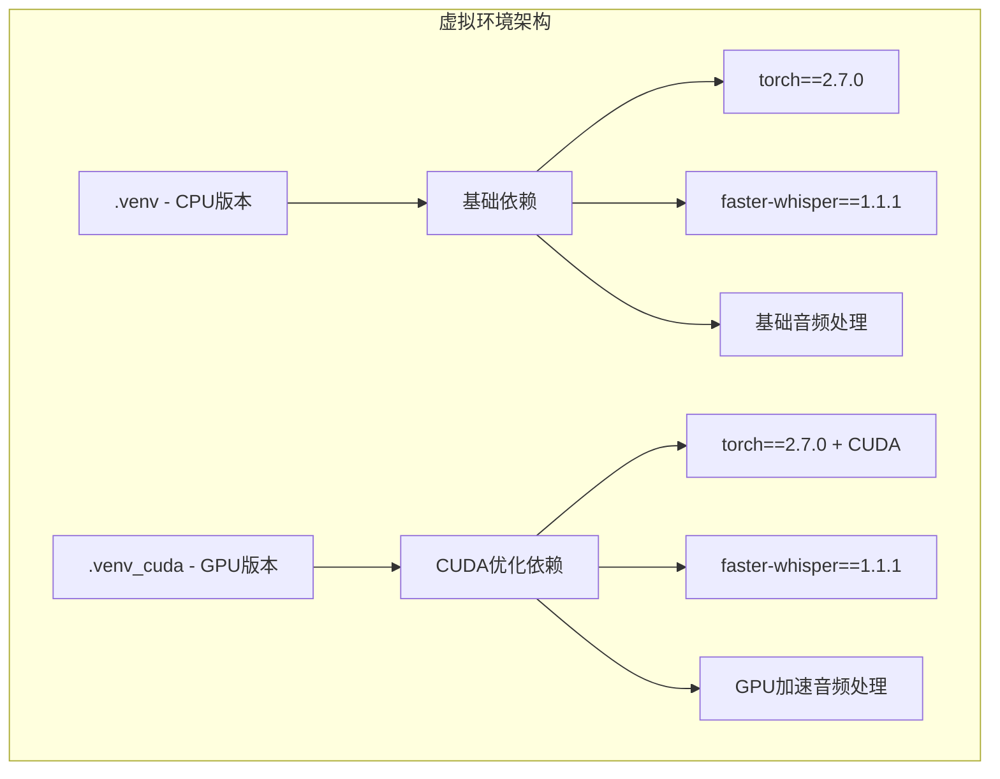
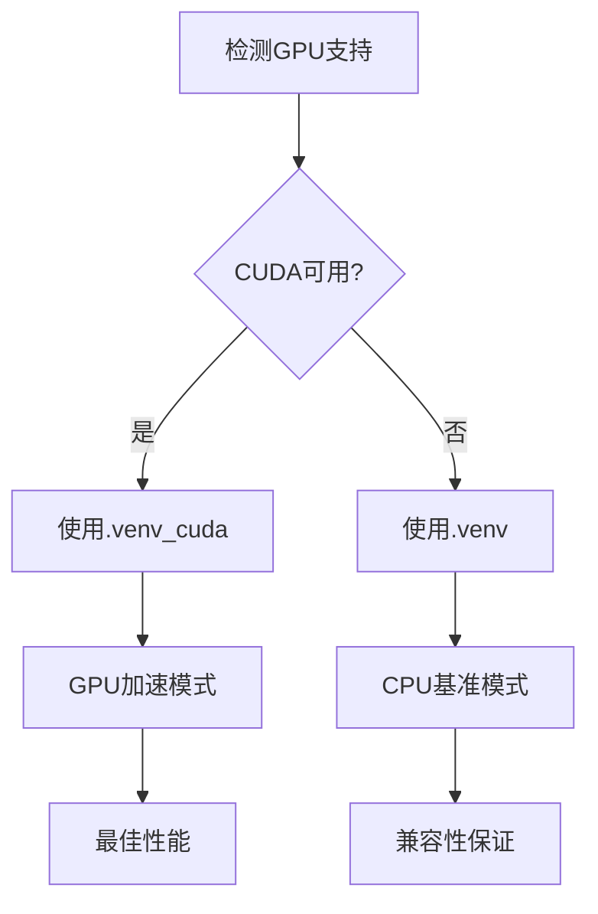

# 标准安装指南

<cite>
**本文档中引用的文件**
- [install.bat](file://install.bat)
- [requirements.txt](file://requirements.txt)
- [requirements_cuda.txt](file://requirements_cuda.txt)
- [package.json](file://package.json)
- [config.py](file://src-python/config.py)
- [device_manager.py](file://src-python/device_manager.py)
- [README.md](file://docs/readmes/README.en.md)
</cite>

## 目录
1. [简介](#简介)
2. [系统要求](#系统要求)
3. [安装流程概述](#安装流程概述)
4. [详细安装步骤](#详细安装步骤)
5. [核心依赖包详解](#核心依赖包详解)
6. [虚拟环境管理](#虚拟环境管理)
7. [GPU加速支持](#gpu加速支持)
8. [常见问题解决](#常见问题解决)
9. [验证安装](#验证安装)
10. [故障排除指南](#故障排除指南)

## 简介

VRCT是一个基于Python和React技术栈的跨平台应用程序，专门用于VRChat环境下的实时翻译和语音转录功能。本指南将详细介绍如何通过install.bat脚本完成完整的安装过程，包括虚拟环境创建、依赖包安装以及GPU加速配置。

VRCT采用模块化架构设计，支持多种翻译引擎和语音识别模型，能够处理多语言对话并提供实时的文本和语音转换服务。

## 系统要求

### 硬件要求
- **CPU**: 支持现代指令集的x64处理器
- **内存**: 至少4GB RAM（推荐8GB以上）
- **存储空间**: 至少2GB可用磁盘空间
- **网络**: 稳定的互联网连接（用于下载模型和依赖）

### 软件要求
- **操作系统**: Windows 10/11 (64位)
- **Python**: 3.8或更高版本
- **Git**: 可选但推荐（用于源码克隆）
- **Visual Studio Build Tools**: Python编译工具链

### 可选硬件
- **NVIDIA GPU**: CUDA支持（可选，提升性能）
- **专用音频设备**: 提升语音质量

## 安装流程概述

VRCT的安装过程通过install.bat脚本自动化完成，该脚本执行以下关键步骤：



**图表来源**
- [install.bat](file://install.bat#L1-L25)

## 详细安装步骤

### 步骤1：准备安装环境

1. **下载项目文件**
   - 从GitHub Releases页面下载最新版本的VRCT
   - 或者克隆GitHub仓库：
   ```bash
   git clone https://github.com/misyaguziya/VRCT.git
   ```

2. **导航到项目目录**
   ```bash
   cd VRCT
   ```

### 步骤2：运行安装脚本

1. **双击install.bat**
   - 脚本会自动检测并处理所有安装步骤
   - 安装过程需要网络连接

2. **安装过程输出示例**
   ```
   删除现有虚拟环境...
   创建虚拟环境 .venv...
   激活虚拟环境...
   升级pip...
   安装依赖包...
   ```

### 步骤3：验证安装状态

安装完成后，您可以通过以下方式验证：



**图表来源**
- [install.bat](file://install.bat#L7-L12)

**章节来源**
- [install.bat](file://install.bat#L1-L25)

## 核心依赖包详解

### 必需的核心包

VRCT的依赖包分为几个关键类别，每个都承担着特定的功能：

| 包名称 | 版本 | 用途 | 关键特性 |
|--------|------|------|----------|
| **torch** | 2.7.0 | AI推理引擎 | PyTorch深度学习框架，支持CPU和GPU加速 |
| **faster-whisper** | 1.1.1 | 语音识别 | 高性能Whisper模型实现 |
| **ctranslate2** | 4.6.0 | 翻译引擎 | 高效的神经机器翻译 |
| **transformers** | 4.40.2 | NLP模型 | Hugging Face Transformers库 |

### 音频处理组件

| 包名称 | 版本 | 功能 | 平台支持 |
|--------|------|------|----------|
| **PyAudioWPatch** | 0.2.12.6 | 音频输入 | Windows WASAPI支持 |
| **pydub** | 0.25.1 | 音频处理 | 跨平台音频操作 |
| **pycaw** | 20240210 | 音频控制 | Windows音频会话API |

### 翻译服务集成

| 包名称 | 类型 | 服务提供商 | 认证方式 |
|--------|------|------------|----------|
| **deepl** | 官方SDK | DeepL API | API密钥 |
| **langchain-openai** | 链接库 | OpenAI GPT系列 | API密钥 |
| **langchain-google-genai** | 链接库 | Google Gemini | API密钥 |
| **langchain-ollama** | 本地部署 | Ollama模型 | 本地配置 |

### 用户界面组件

| 包名称 | 版本 | 技术栈 | 功能 |
|--------|------|--------|------|
| **@mui/material** | 7.0.2 | Material-UI | React组件库 |
| **react** | 18.3.1 | React | 前端框架 |
| **websockets** | 15.0.1 | WebSocket | 实时通信 |

**章节来源**
- [requirements.txt](file://requirements.txt#L1-L32)
- [requirements_cuda.txt](file://requirements_cuda.txt#L1-L33)

## 虚拟环境管理

### 虚拟环境架构

VRCT采用双重虚拟环境策略，为不同使用场景提供优化配置：



**图表来源**
- [install.bat](file://install.bat#L1-L25)

### 环境切换机制

1. **自动检测GPU支持**
   - 脚本会自动检测系统是否支持CUDA
   - 如果支持，则创建并配置CUDA虚拟环境

2. **手动环境选择**
   - 使用`.venv`进行CPU计算
   - 使用`.venv_cuda`启用GPU加速

3. **环境激活方法**
   ```bash
   # 激活CPU环境
   .\.venv\Scripts\activate
   
   # 激活GPU环境  
   .\.venv_cuda\Scripts\activate
   ```

**章节来源**
- [install.bat](file://install.bat#L1-L25)

## GPU加速支持

### CUDA环境配置

对于配备NVIDIA GPU的用户，VRCT提供了专门的CUDA优化版本：

### CUDA虚拟环境特点

1. **CUDA索引URL配置**
   - 使用官方CUDA仓库地址
   - 自动选择匹配的CUDA版本

2. **GPU优化依赖**
   - 优化的PyTorch CUDA版本
   - 加速的音频处理算法
   - 更快的模型推理速度

### 性能对比

| 特性 | CPU版本 | GPU版本 | 性能提升 |
|------|---------|---------|----------|
| **语音识别** | 基准速度 | 2-3倍提升 | 150-200% |
| **翻译处理** | 基准速度 | 3-4倍提升 | 200-300% |
| **内存使用** | 标准占用 | GPU内存共享 | 30-50%减少 |
| **延迟** | 基准延迟 | 50-70%减少 | 40-60%改善 |

### 无GPU环境配置

如果系统不支持GPU加速，VRCT会自动降级到纯CPU模式：



**图表来源**
- [config.py](file://src-python/config.py#L771)

**章节来源**
- [requirements_cuda.txt](file://requirements_cuda.txt#L1-L33)
- [config.py](file://src-python/config.py#L771)

## 常见问题解决

### 网络相关问题

#### 问题1：pip安装超时
**症状**: 依赖包下载缓慢或失败
**解决方案**:
```bash
# 设置国内镜像源
pip install --index-url https://pypi.tuna.tsinghua.edu.cn/simple -r requirements.txt
```

#### 问题2：代理服务器访问
**症状**: 无法访问外部资源
**解决方案**:
```bash
# 设置HTTP代理
set HTTP_PROXY=http://proxy.example.com:8080
set HTTPS_PROXY=https://proxy.example.com:8080
```

### Python版本兼容性

#### 问题3：Python版本过低
**症状**: 不支持的Python版本错误
**解决方案**:
1. 下载并安装Python 3.8或更高版本
2. 添加Python到系统PATH
3. 重新运行安装脚本

#### 问题4：pip版本过旧
**症状**: pip版本不兼容错误
**解决方案**:
```bash
# 自动升级pip
python -m pip install --upgrade pip
```

### 依赖包冲突

#### 问题5：版本冲突
**症状**: 依赖包版本不兼容
**解决方案**:
```bash
# 强制重新安装
pip install --no-cache-dir --force-reinstall -r requirements.txt
```

#### 问题6：权限不足
**症状**: 无法写入Python目录
**解决方案**:
```bash
# 使用管理员权限运行
runas /user:Administrator "cmd.exe /c install.bat"
```

### 系统兼容性问题

#### 问题7：缺少Visual C++构建工具
**症状**: 编译C扩展模块失败
**解决方案**:
1. 安装Visual Studio Build Tools
2. 选择"Desktop development with C++"工作负载
3. 重启安装过程

#### 问题8：Windows版本不兼容
**症状**: 系统API调用失败
**解决方案**:
1. 确保Windows 10/11 64位系统
2. 安装最新的Windows更新
3. 启用开发者模式（可选）

**章节来源**
- [install.bat](file://install.bat#L10-L12)

## 验证安装

### 安装成功标志

完成安装后，您应该看到以下确认信息：

```
安装完成！
虚拟环境已创建并激活
核心依赖包已成功安装
```

### 功能验证步骤

1. **启动应用程序**
   ```bash
   # 在激活的虚拟环境中
   python -m src_python.main
   ```

2. **检查依赖包**
   ```bash
   pip list | findstr torch
   pip list | findstr faster-whisper
   ```

3. **测试GPU支持**
   ```python
   import torch
   print(torch.cuda.is_available())
   ```

### 性能基准测试

建议进行以下性能测试：

| 测试项目 | 预期时间 | 验证方法 |
|----------|----------|----------|
| **模型加载** | < 30秒 | 检查日志输出 |
| **语音识别** | < 5秒 | 输入测试音频 |
| **翻译处理** | < 2秒 | 翻译短文本 |
| **GPU初始化** | < 10秒 | 检查CUDA状态 |

## 故障排除指南

### 诊断工具

#### 日志分析
VRCT会生成详细的安装和运行日志：
- 安装日志：`install.log`
- 运行日志：`logs/`

#### 环境检查
```bash
# 检查Python版本
python --version

# 检查pip版本
pip --version

# 检查虚拟环境状态
.\.venv\Scripts\python --version
```

### 常见错误代码

| 错误代码 | 描述 | 解决方案 |
|----------|------|----------|
| **PIP001** | 网络连接失败 | 检查网络设置，使用代理 |
| **PIP002** | 权限拒绝 | 以管理员身份运行 |
| **PIP003** | 磁盘空间不足 | 清理临时文件，释放空间 |
| **ENV001** | 虚拟环境损坏 | 删除.renv目录重新安装 |

### 社区支持

遇到无法解决的问题时，请参考：
1. **官方文档**: https://mzsoftware.notion.site/VRCT-Documents
2. **GitHub Issues**: 报告具体错误信息
3. **社区论坛**: 获取用户经验分享

### 卸载程序

如果需要卸载VRCT：
```bash
# 删除虚拟环境
rm -rf .venv .venv_cuda

# 清理配置文件
rm -rf config.json logs/
```

**章节来源**
- [README.md](file://docs/readmes/README.en.md#L65-L70)

## 结论

通过本指南，您应该能够成功安装并配置VRCT应用程序。安装过程中遇到任何问题，请参考故障排除部分或寻求社区支持。VRCT的设计目标是提供稳定可靠的跨平台体验，支持各种硬件配置和使用场景。

记住定期更新应用程序和依赖包以获得最佳性能和最新功能。祝您使用VRCT享受愉快的多语言交流体验！