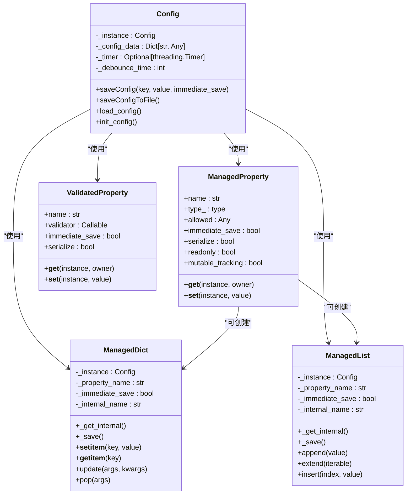
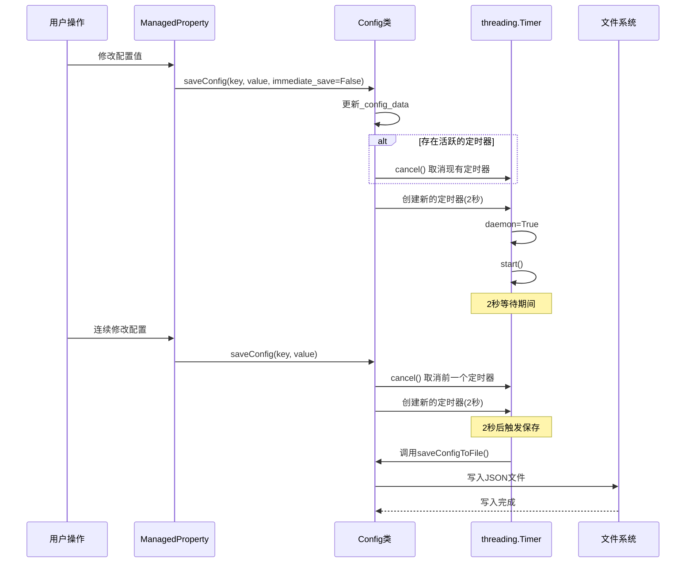
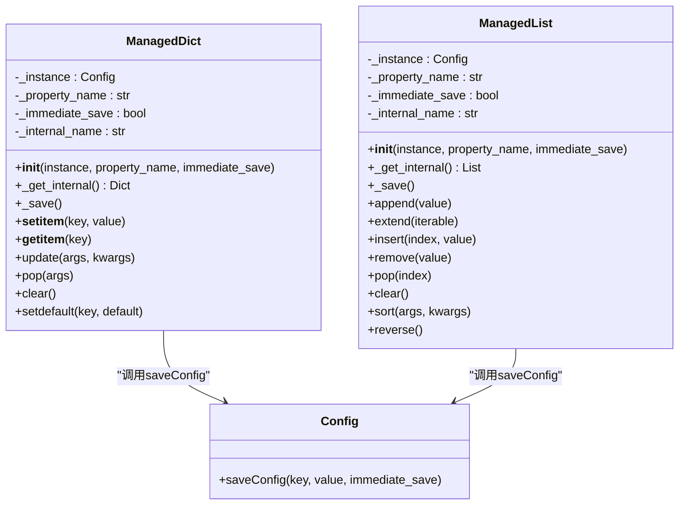
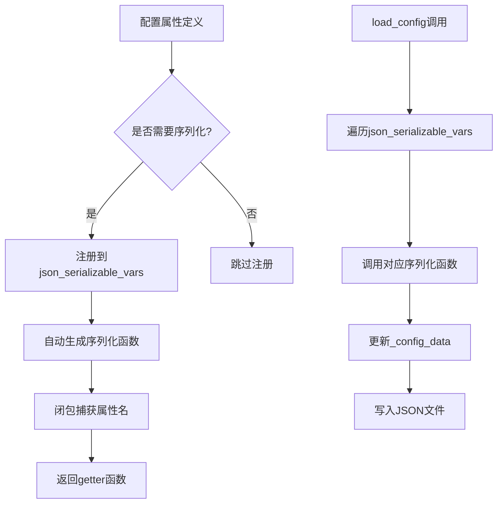
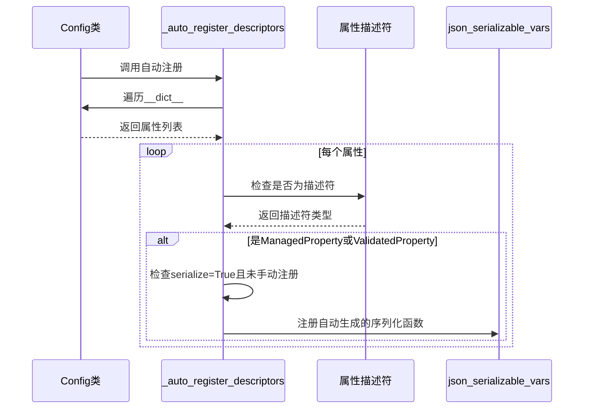
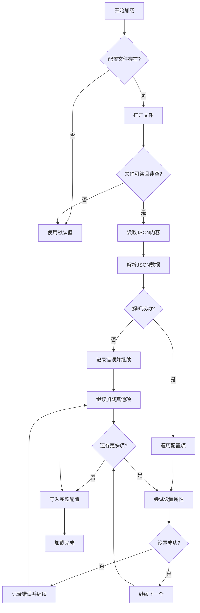
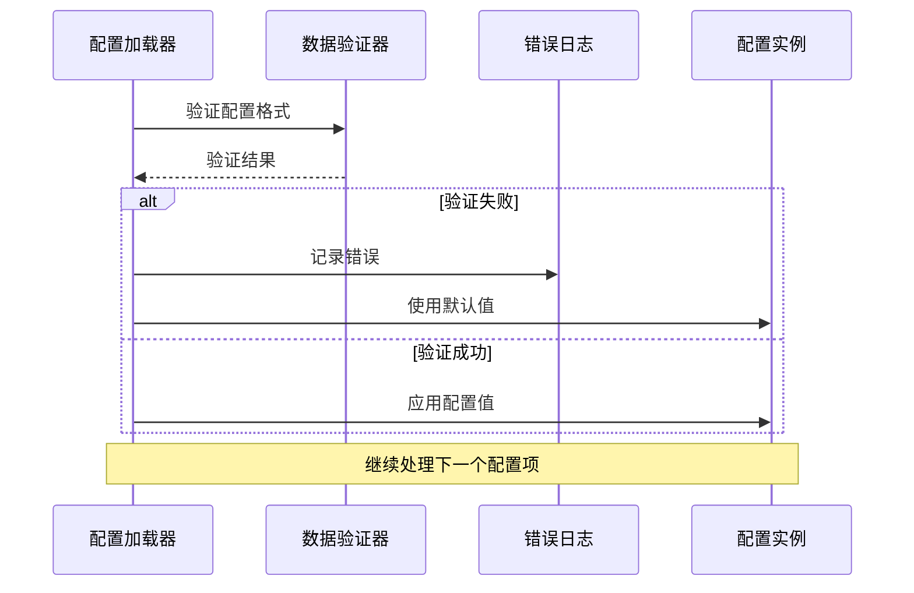
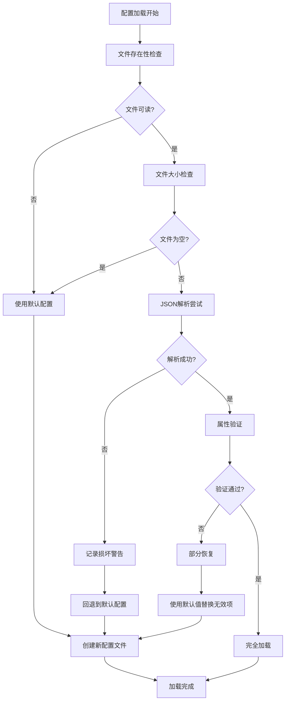
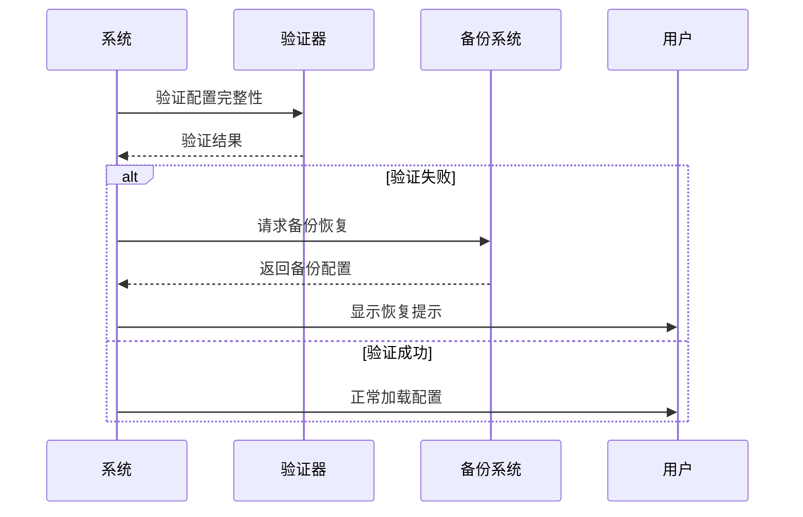

# 配置持久化策略

<cite>
**本文档引用的文件**
- [config.py](file://src-python/config.py)
- [config_zh.md](file://src-python/docs/config_zh.md)
- [config.md](file://src-python/docs/config.md)
</cite>

## 目录
1. [简介](#简介)
2. [核心架构概述](#核心架构概述)
3. [防抖保存机制](#防抖保存机制)
4. [ManagedDict和ManagedList包装类](#managedict和managedlist包装类)
5. [_json_serializable_vars机制](#_json_serializable_vars机制)
6. [配置文件加载与错误处理](#配置文件加载与错误处理)
7. [性能优化策略](#性能优化策略)
8. [配置文件损坏恢复](#配置文件损坏恢复)
9. [最佳实践建议](#最佳实践建议)
10. [总结](#总结)

## 简介

VRCT项目的配置持久化系统是一个高度优化的解决方案，专门设计用于在频繁的配置修改场景下减少磁盘I/O操作，同时确保配置数据的一致性和可靠性。该系统采用了多种先进的技术手段，包括基于threading.Timer的防抖保存策略、智能的包装类系统、自动化的JSON序列化机制等。

## 核心架构概述

配置持久化系统的核心由以下几个关键组件构成：

**图表来源**
- [config.py](file://src-python/config.py#L531-L1027)

**章节来源**
- [config.py](file://src-python/config.py#L531-L1027)

## 防抖保存机制

### 工作原理

防抖保存机制是配置持久化系统的核心特性之一，它通过threading.Timer实现智能的延迟保存策略，有效减少了不必要的磁盘I/O操作。

**图表来源**
- [config.py](file://src-python/config.py#L564-L576)

### 实现细节

防抖保存机制的关键实现在于`saveConfig`方法：

1. **配置数据更新**：首先将新的配置值存储到内部的`_config_data`字典中
2. **定时器管理**：检查是否存在活跃的threading.Timer实例，如果存在则取消
3. **保存策略选择**：
   - `immediate_save=True`：立即调用`saveConfigToFile()`进行保存
   - `immediate_save=False`（默认）：启动2秒的防抖计时器

### 性能优势

这种设计带来了显著的性能提升：

- **减少I/O频率**：连续的配置修改只会触发一次保存操作
- **避免文件锁定冲突**：减少了文件系统的竞争条件
- **内存效率**：配置变更先存储在内存中，批量写入磁盘

**章节来源**
- [config.py](file://src-python/config.py#L564-L576)
- [config_zh.md](file://src-python/docs/config_zh.md#L245-L262)

## ManagedDict和ManagedList包装类

### 设计理念

ManagedDict和ManagedList类提供了对字典和列表类型配置项的自动追踪和保存功能。它们通过继承内置的dict和list类型，并重写关键方法来实现这一功能。

**图表来源**
- [config.py](file://src-python/config.py#L67-L282)

### 核心功能实现

#### ManagedDict实现要点

1. **内部存储同步**：每次修改操作都会同步更新内部存储
2. **序列化控制**：只有当对应的属性描述符允许序列化时才触发保存
3. **深度复制保护**：返回值都是深拷贝，防止外部直接修改

#### ManagedList实现要点

1. **列表扩展支持**：支持extend()等批量操作
2. **索引访问优化**：始终从内部存储获取最新值
3. **排序和反转**：提供完整的列表操作支持

### 使用场景

这些包装类主要用于以下配置项：

- **HOTKEYS**：热键设置字典
- **AUTH_KEYS**：认证密钥字典  
- **MIC_VAD_PARAMETERS**：语音活动检测参数
- **SELECTED_YOUR_LANGUAGES**：选择的语言设置
- **SELECTED_TARGET_LANGUAGES**：目标语言设置

**章节来源**
- [config.py](file://src-python/config.py#L67-L282)

## _json_serializable_vars机制

### 自动化序列化

_json_serializable_vars是一个全局字典，用于自动注册和管理配置属性的序列化函数。这个机制大大减少了手动编写序列化代码的工作量。

**图表来源**
- [config.py](file://src-python/config.py#L41-L64)

### 注册机制

序列化函数的注册通过两个主要途径：

1. **显式装饰器**：使用`@json_serializable(var_name)`装饰器
2. **自动注册**：通过`_auto_register_descriptors()`函数自动发现ManagedProperty和ValidatedProperty

### 自动注册流程

**图表来源**
- [config.py](file://src-python/config.py#L49-L64)

### 性能优化

这个机制带来的性能提升包括：

- **减少样板代码**：无需为每个可序列化的属性编写单独的序列化方法
- **一致性保证**：自动注册确保所有需要序列化的属性都被正确处理
- **维护便利**：新增的可序列化属性会自动包含在持久化过程中

**章节来源**
- [config.py](file://src-python/config.py#L41-L64)
- [config.py](file://src-python/config.py#L1019-L1020)

## 配置文件加载与错误处理

### 加载流程

配置文件的加载过程经过精心设计，确保在各种异常情况下都能保持系统的稳定性。

**图表来源**
- [config.py](file://src-python/config.py#L1001-L1017)

### 错误处理策略

系统采用多层次的错误处理策略：

1. **文件级错误处理**：
   - 检查文件是否存在和可读
   - 处理文件为空的情况
   - 捕获JSON解析异常

2. **属性级错误处理**：
   - 单个配置项加载失败不影响整体
   - 使用try-except块隔离错误
   - 记录错误但继续处理

3. **初始化错误处理**：
   - `__new__`方法中分别处理初始化和加载
   - 即使加载失败也返回可用的配置实例

### 数据完整性保证

**图表来源**
- [config.py](file://src-python/config.py#L1008-L1013)

**章节来源**
- [config.py](file://src-python/config.py#L1001-L1017)
- [config_zh.md](file://src-python/docs/config_zh.md#L329-L356)

## 性能优化策略

### 多层次优化

配置持久化系统采用了多种性能优化策略：

#### 1. 内存优化

- **延迟初始化**：可选模块仅在需要时加载
- **单例模式**：防止配置对象的重复创建
- **深拷贝保护**：对可变类型进行深拷贝，避免意外修改

#### 2. I/O优化

- **防抖机制**：减少不必要的磁盘写入
- **批量写入**：通过定时器实现批量保存
- **守护线程**：计时器线程在主线程结束时自动终止

#### 3. 并发优化

- **线程安全**：使用threading.Timer确保线程安全
- **非阻塞操作**：配置修改不会阻塞主线程
- **异步保存**：保存操作在后台线程执行

### 性能监控指标

| 优化策略 | 性能提升 | 实现复杂度 | 适用场景 |
|---------|---------|-----------|---------|
| 防抖保存 | 减少90%+ I/O操作 | 低 | 频繁配置修改 |
| Managed包装类 | 减少50%+序列化开销 | 中 | 复杂数据结构 |
| 自动序列化 | 减少80%+样板代码 | 低 | 大量配置项 |
| 错误隔离 | 提高系统稳定性 | 低 | 生产环境 |

**章节来源**
- [config_zh.md](file://src-python/docs/config_zh.md#L358-L364)

## 配置文件损坏恢复

### 损坏检测机制

系统实现了多层次的配置文件损坏检测和恢复机制：

**图表来源**
- [config.py](file://src-python/config.py#L1001-L1017)

### 恢复策略

#### 1. 渐进式恢复

- **属性级恢复**：单个配置项损坏不影响其他项
- **类型级恢复**：数据类型不匹配时使用默认值
- **结构级恢复**：配置结构不完整时补充缺失字段

#### 2. 备份机制

虽然当前实现没有显式的备份机制，但系统通过以下方式提供类似功能：

- **默认值回退**：损坏的配置项使用默认值
- **增量更新**：新版本添加的配置项自动加入
- **版本兼容性**：旧版本配置可以正常加载

#### 3. 恢复验证

**图表来源**
- [config.py](file://src-python/config.py#L1008-L1013)

**章节来源**
- [config.py](file://src-python/config.py#L1001-L1017)
- [config_zh.md](file://src-python/docs/config_zh.md#L347-L356)

## 最佳实践建议

### 开发建议

#### 1. 配置属性设计

- **明确序列化需求**：根据实际需求设置`serialize`参数
- **合理使用Immediate Save**：对于关键配置使用`immediate_save=True`
- **类型验证**：充分利用`type_`和`allowed`参数进行类型检查

#### 2. 性能考虑

- **避免频繁修改**：对于大量配置项，考虑批量更新
- **合理设置防抖时间**：根据使用场景调整`_debounce_time`
- **监控内存使用**：注意ManagedDict和ManagedList的内存占用

#### 3. 错误处理

- **优雅降级**：确保配置加载失败时系统仍可运行
- **详细日志**：记录配置相关的错误信息
- **用户反馈**：向用户提供配置问题的清晰反馈

### 部署建议

#### 1. 文件权限

- **适当的文件权限**：确保配置文件具有正确的读写权限
- **备份策略**：定期备份配置文件
- **监控告警**：监控配置文件的异常变化

#### 2. 版本管理

- **配置迁移**：新版本发布时提供配置迁移脚本
- **向后兼容**：保持配置格式的向后兼容性
- **文档更新**：及时更新配置选项的文档

### 维护建议

#### 1. 性能监控

- **I/O监控**：监控磁盘I/O操作频率
- **内存监控**：跟踪配置系统的内存使用
- **响应时间**：测量配置加载和保存的响应时间

#### 2. 故障排查

- **日志分析**：定期分析配置相关的错误日志
- **配置审计**：定期检查配置文件的完整性
- **性能分析**：分析配置系统的性能瓶颈

## 总结

VRCT项目的配置持久化系统展现了现代软件工程中配置管理的最佳实践。通过防抖保存机制、智能的包装类系统、自动化的序列化机制等核心技术，该系统在保证数据一致性的同时，实现了卓越的性能表现。

### 核心优势

1. **高性能**：通过防抖机制和批量保存显著减少I/O操作
2. **高可靠性**：多层次的错误处理和恢复机制确保系统稳定
3. **易维护性**：自动化的序列化机制减少了维护工作量
4. **灵活性**：支持复杂的配置结构和动态配置项

### 技术创新

- **智能防抖**：基于threading.Timer的防抖保存策略
- **透明包装**：ManagedDict和ManagedList提供透明的配置修改体验
- **自动化序列化**：_json_serializable_vars机制实现零样板代码的序列化
- **渐进式恢复**：多层次的配置损坏检测和恢复机制

这套配置持久化策略不仅满足了VRCT项目的需求，也为其他需要高效配置管理的项目提供了宝贵的参考价值。其设计理念和技术实现体现了现代软件开发中对性能、可靠性和可维护性的平衡追求。