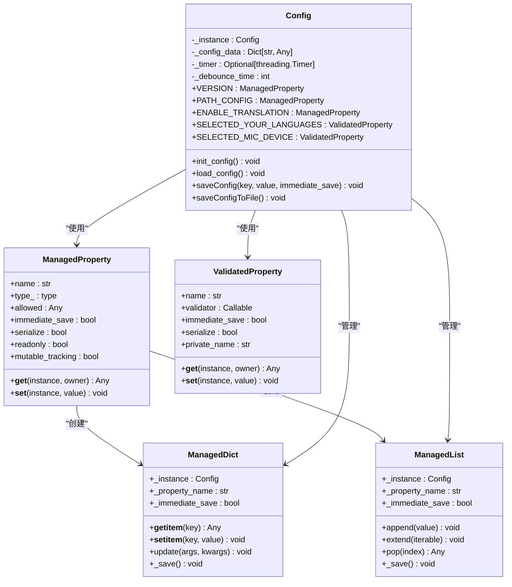
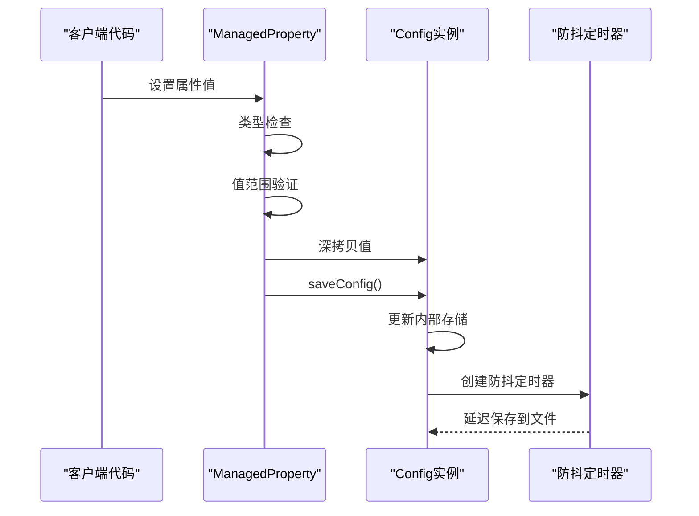
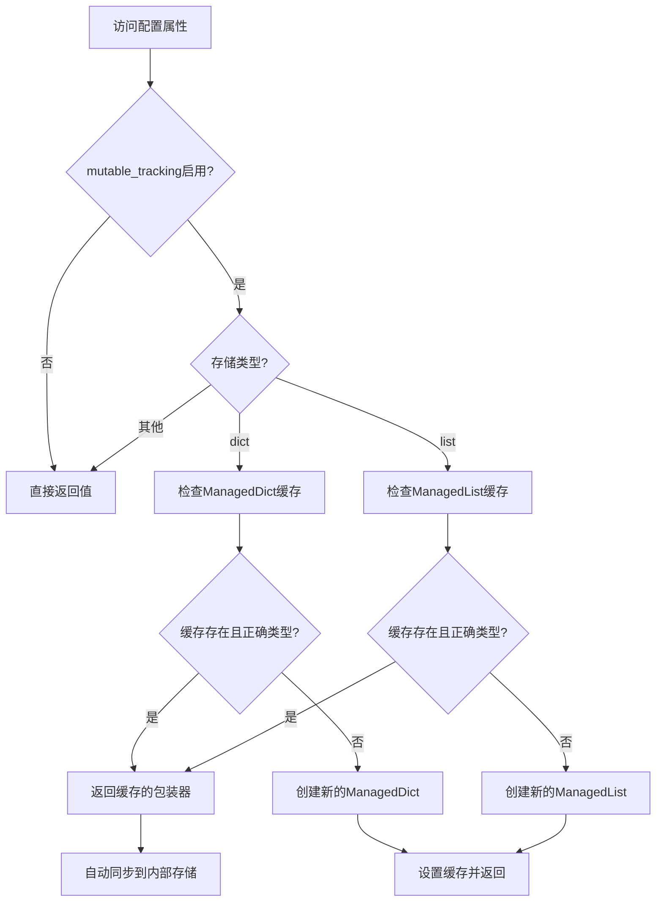
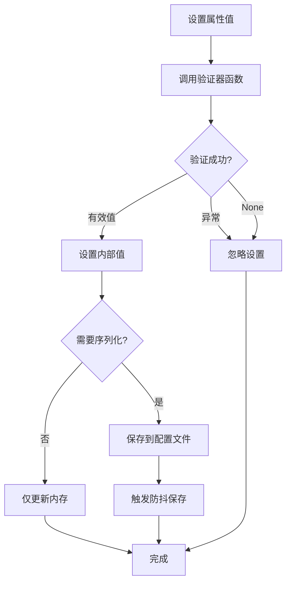
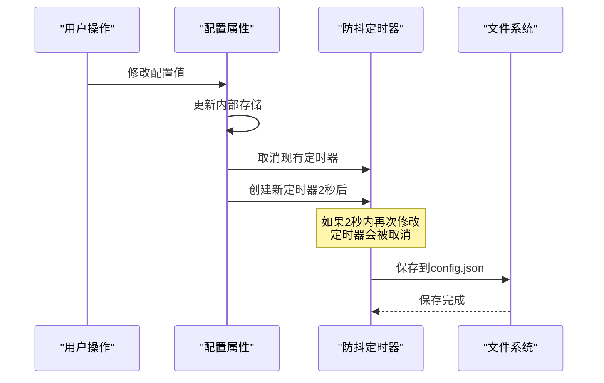
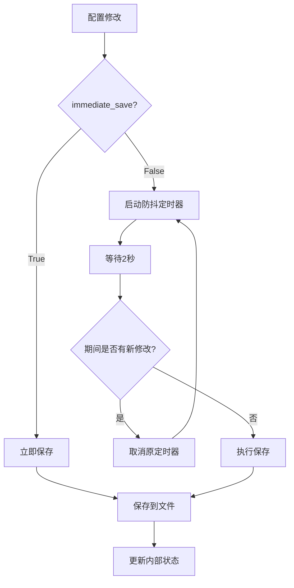
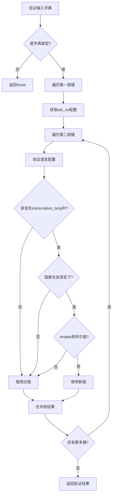
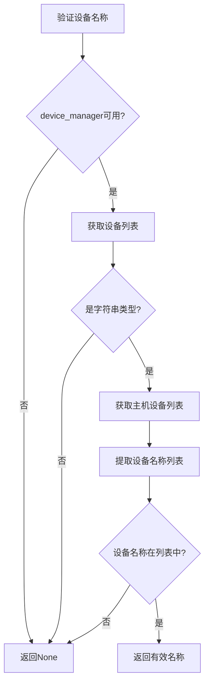

# 配置管理系统深度解析

<cite>
**本文档引用的文件**
- [config.py](file://src-python/config.py)
- [device_manager.py](file://src-python/device_manager.py)
- [utils.py](file://src-python/utils.py)
- [config.md](file://src-python/docs/config.md)
- [config_zh.md](file://src-python/docs/config_zh.md)
</cite>

## 目录
1. [概述](#概述)
2. [系统架构](#系统架构)
3. [核心组件分析](#核心组件分析)
4. [配置分类详解](#配置分类详解)
5. [自动保存机制](#自动保存机制)
6. [复杂数据结构验证](#复杂数据结构验证)
7. [最佳实践与注意事项](#最佳实践与注意事项)
8. [故障排除指南](#故障排除指南)
9. [总结](#总结)

## 概述

VRCT的配置管理系统是一个高度模块化和类型安全的单例配置框架，采用描述符模式实现全局配置管理。该系统通过`ManagedProperty`和`ValidatedProperty`两个核心描述符类，提供了类型验证、值范围检查、自动持久化和防抖保存等高级功能。

### 核心特性

- **单例模式**：确保全局配置的一致性和唯一性
- **描述符模式**：通过`ManagedProperty`和`ValidatedProperty`实现类型安全的配置访问
- **自动持久化**：基于防抖机制的智能保存策略
- **类型验证**：运行时类型检查和值范围验证
- **复杂数据结构支持**：支持嵌套字典、列表等复杂配置结构
- **外部依赖处理**：优雅处理可选模块缺失的情况

## 系统架构



**图表来源**
- [config.py](file://src-python/config.py#L232-L336)
- [config.py](file://src-python/config.py#L66-L228)

**章节来源**
- [config.py](file://src-python/config.py#L531-L590)

## 核心组件分析

### ManagedProperty描述符

`ManagedProperty`是配置系统的核心组件，实现了简单配置属性的类型验证和持久化。

#### 工作原理



**图表来源**
- [config.py](file://src-python/config.py#L270-L303)

#### 关键特性

1. **类型验证**：通过`type_`参数指定期望的类型
2. **值范围检查**：支持可迭代对象或可调用函数的验证
3. **深拷贝保护**：对可变类型进行深拷贝防止外部引用
4. **序列化控制**：通过`serialize`参数控制是否保存到JSON
5. **只读支持**：通过`readonly`参数实现不可修改的配置项

#### Mutable Tracking机制

对于复杂的可变类型（字典、列表），`ManagedProperty`支持`mutable_tracking`功能：



**图表来源**
- [config.py](file://src-python/config.py#L249-L263)

**章节来源**
- [config.py](file://src-python/config.py#L232-L303)

### ValidatedProperty描述符

`ValidatedProperty`专门用于处理复杂的验证逻辑，支持自定义验证器函数。

#### 验证流程



**图表来源**
- [config.py](file://src-python/config.py#L323-L335)

#### 验证器函数模式

验证器函数遵循以下签名：
```python
def validator(value, instance) -> normalized_value | None
```

验证器必须：
1. 接收两个参数：待验证的值和配置实例
2. 返回规范化后的值或`None`（表示验证失败）
3. 处理异常情况并返回`None`

**章节来源**
- [config.py](file://src-python/config.py#L305-L336)

## 配置分类详解

### 只读常量配置

只读配置项包含应用程序的基本信息和系统常量，这些配置在运行时不应被修改。

#### 系统基本信息

| 配置项 | 类型 | 描述 |
|--------|------|------|
| `VERSION` | `str` | 应用程序版本号 |
| `PATH_LOCAL` | `str` | 应用程序本地路径 |
| `PATH_CONFIG` | `str` | 配置文件路径 |
| `PATH_LOGS` | `str` | 日志文件目录路径 |
| `GITHUB_URL` | `str` | GitHub发布页面URL |
| `UPDATER_URL` | `str` | 更新器发布页面URL |

#### 系统常量

| 配置项 | 类型 | 描述 |
|--------|------|------|
| `MAX_MIC_THRESHOLD` | `int` | 最大麦克风阈值 |
| `MAX_SPEAKER_THRESHOLD` | `int` | 最大扬声器阈值 |
| `WATCHDOG_TIMEOUT` | `int` | 看门狗超时时间（秒） |
| `WATCHDOG_INTERVAL` | `int` | 看门狗检查间隔（秒） |

#### 动态生成的只读配置

这些配置项根据系统环境动态生成：

| 配置项 | 类型 | 来源 |
|--------|------|------|
| `SELECTABLE_TAB_NO_LIST` | `List[str]` | 固定选项列表 |
| `SELECTABLE_UI_LANGUAGE_LIST` | `List[str]` | 支持的语言列表 |
| `SELECTABLE_COMPUTE_DEVICE_LIST` | `List[Dict]` | 可用计算设备列表 |
| `COMPUTE_MODE` | `str` | 计算模式（cuda/cpu） |

**章节来源**
- [config.py](file://src-python/config.py#L577-L600)

### 可写配置

可写配置分为多个类别，每个类别都有特定的用途和验证规则。

#### 布尔标志配置

这些配置控制功能的启用/禁用状态：

| 配置项 | 类型 | 默认值 | 描述 |
|--------|------|--------|------|
| `ENABLE_TRANSLATION` | `bool` | `False` | 是否启用翻译功能 |
| `ENABLE_TRANSCRIPTION_SEND` | `bool` | `False` | 是否启用发送转录 |
| `ENABLE_TRANSCRIPTION_RECEIVE` | `bool` | `False` | 是否启用接收转录 |
| `ENABLE_FOREGROUND` | `bool` | `False` | 是否保持前台显示 |

#### 选择性配置

这些配置限制用户只能从预定义的选项中选择：

| 配置项 | 类型 | 验证规则 | 描述 |
|--------|------|----------|------|
| `SELECTED_TAB_NO` | `str` | 必须在`SELECTABLE_TAB_NO_LIST`中 | 当前选中的标签页 |
| `UI_LANGUAGE` | `str` | 必须在`SELECTABLE_UI_LANGUAGE_LIST`中 | 用户界面语言 |
| `SEND_MESSAGE_BUTTON_TYPE` | `str` | 必须在预定义列表中 | 发送按钮类型 |

#### 数值配置

这些配置接受数值输入，并可能有范围限制：

| 配置项 | 类型 | 范围 | 默认值 | 描述 |
|--------|------|------|--------|------|
| `MIC_THRESHOLD` | `int` | `0-2000` | `300` | 麦克风音量阈值 |
| `TRANSPARENCY` | `int` | `0-100` | `100` | 窗口透明度 |
| `UI_SCALING` | `int` | `50-200` | `100` | UI缩放比例 |

**章节来源**
- [config.py](file://src-python/config.py#L603-L718)

## 自动保存机制

### 防抖保存策略

配置系统采用基于`threading.Timer`的防抖保存机制，避免频繁的磁盘I/O操作。

#### 保存流程



**图表来源**
- [config.py](file://src-python/config.py#L564-L575)

#### 立即保存机制

某些关键配置项支持立即保存，通过`immediate_save=True`参数实现：

| 配置项 | 立即保存原因 |
|--------|--------------|
| `MAIN_WINDOW_GEOMETRY` | 界面布局信息，需要即时保存 |
| `MESSAGE_BOX_RATIO` | 分割比例调整，用户体验要求高 |
| `PLUGINS_STATUS` | 插件状态变更，需要实时同步 |

#### 保存时机控制



**图表来源**
- [config.py](file://src-python/config.py#L564-L575)

**章节来源**
- [config.py](file://src-python/config.py#L560-L575)

## 复杂数据结构验证

### SELECTED_YOUR_LANGUAGES和SELECTED_TARGET_LANGUAGES

这两个配置项是最复杂的验证逻辑之一，涉及多层嵌套字典和外部依赖验证。

#### 数据结构定义

```python
{
    "tab_no": {
        "lang_no": {
            "language": str,      # 语言代码
            "country": str,       # 国家代码  
            "enable": bool        # 是否启用
        }
    }
}
```

#### 验证逻辑



**图表来源**
- [config.py](file://src-python/config.py#L445-L481)

#### 外部依赖验证

验证过程依赖于外部模块提供的语言数据：

1. **transcription_lang**：来自`models.transcription.transcription_languages`模块
2. **设备管理器**：来自`device_manager`模块
3. **计算设备**：来自`utils.getComputeDeviceList()`函数

**章节来源**
- [config.py](file://src-python/config.py#L445-L481)

### SELECTED_MIC_DEVICE和SELECTED_SPEAKER_DEVICE

这些配置项依赖于`device_manager`模块，需要处理外部模块缺失的情况。

#### 验证流程



**图表来源**
- [config.py](file://src-python/config.py#L491-L510)

#### 错误处理策略

系统采用渐进式错误处理：

1. **模块缺失**：当`device_manager`未导入时，使用默认值
2. **设备查询失败**：捕获异常并使用安全默认值
3. **验证失败**：返回旧值而非抛出异常

**章节来源**
- [config.py](file://src-python/config.py#L491-L520)

## 最佳实践与注意事项

### 修改配置的最佳实践

#### 1. 使用类型安全的方式访问配置

```python
# ✅ 推荐：使用配置实例访问
from config import config
config.MIC_THRESHOLD = 500
config.UI_LANGUAGE = "ja"

# ❌ 避免：直接修改内部属性
config._MIC_THRESHOLD = 500  # 不推荐
```

#### 2. 处理配置验证失败

```python
# ✅ 推荐：检查配置的有效性
if config.SELECTED_TAB_NO in config.SELECTABLE_TAB_NO_LIST:
    # 安全使用配置
    pass

# ❌ 避免：假设配置总是有效
selected_tab = config.SELECTED_TAB_NO  # 可能是无效值
```

#### 3. 批量配置修改

```python
# ✅ 推荐：批量修改后手动保存
with config.batch_save():
    config.MIC_THRESHOLD = 500
    config.SPEAKER_THRESHOLD = 400
    config.UI_LANGUAGE = "ja"
# 配置会在退出上下文后一次性保存

# ❌ 避免：频繁单独保存
config.MIC_THRESHOLD = 500  # 会触发防抖保存
config.SPEAKER_THRESHOLD = 400  # 会触发新的防抖保存
```

### 注意事项

#### 1. 循环依赖处理

配置系统与设备管理器之间存在循环依赖：

```python
# config.py 导入 device_manager
from device_manager import device_manager

# device_manager.py 导入 config
from config import config
```

解决方案：
- 使用延迟导入和懒加载
- 提供安全的默认值
- 在初始化过程中处理循环依赖

#### 2. 多线程环境下的安全性

虽然配置属性本身不是线程安全的，但保存机制是线程安全的：

```python
# ✅ 推荐：在主线程中修改配置
def update_config_in_main_thread():
    config.MIC_THRESHOLD = 500

# ❌ 避免：在多个线程中同时修改配置
def unsafe_config_modification():
    config.MIC_THRESHOLD = 500  # 可能导致竞态条件
```

#### 3. 配置文件损坏的处理

系统对配置文件损坏有容错机制：

```python
# ✅ 推荐：配置加载失败时使用默认值
try:
    config.load_config()
except Exception:
    # 使用初始化时的默认值
    pass

# ❌ 避免：假设配置文件总是有效的
mic_threshold = config.MIC_THRESHOLD  # 可能是无效值
```

#### 4. 性能优化建议

1. **避免频繁修改**：对于频繁修改的配置，考虑使用内存缓存
2. **批量操作**：对于多个相关配置的修改，使用批量操作
3. **延迟初始化**：利用配置系统的延迟初始化特性

### 配置迁移策略

#### 1. 版本兼容性

```python
# ✅ 推荐：向后兼容的配置加载
def load_config_with_migration():
    if os_path.isfile(config.PATH_CONFIG):
        with open(config.PATH_CONFIG, 'r', encoding="utf-8") as fp:
            data = json_load(fp)
            
        # 迁移旧版本配置
        if "old_key" in data:
            data["new_key"] = migrate_old_key(data.pop("old_key"))
            
        return data
    return {}
```

#### 2. 新配置项的添加

```python
# ✅ 推荐：优雅地添加新配置项
class Config:
    def init_config(self):
        # 添加新配置项
        self._NEW_FEATURE_ENABLED = False
        
        # 确保新配置项在保存时包含
        if not hasattr(self, '_config_data'):
            self._config_data = {}
        if 'NEW_FEATURE_ENABLED' not in self._config_data:
            self._config_data['NEW_FEATURE_ENABLED'] = self._NEW_FEATURE_ENABLED
```

## 故障排除指南

### 常见问题及解决方案

#### 1. 配置保存失败

**症状**：修改配置后重启应用发现设置恢复为默认值

**可能原因**：
- 配置文件权限不足
- 磁盘空间不足
- 文件系统异常

**解决方案**：
```python
# 检查配置文件权限
import os
print(os.access(config.PATH_CONFIG, os.W_OK))

# 手动保存配置
try:
    config.saveConfigToFile()
except Exception as e:
    print(f"保存失败: {e}")
```

#### 2. 配置验证失败

**症状**：设置某些配置项时没有生效

**诊断步骤**：
```python
# 检查配置项的验证规则
print(f"当前值: {config.MIC_THRESHOLD}")
print(f"类型: {type(config.MIC_THRESHOLD)}")
print(f"允许范围: 0-{config.MAX_MIC_THRESHOLD}")
```

**常见验证失败场景**：
- 数值超出范围
- 字符串不在允许列表中
- 复杂数据结构格式错误

#### 3. 外部依赖问题

**症状**：设备相关的配置项无法正常工作

**诊断方法**：
```python
# 检查device_manager状态
from device_manager import device_manager
if device_manager is None:
    print("设备管理器未初始化")
else:
    print(f"可用麦克风设备: {list(device_manager.getMicDevices().keys())}")
```

#### 4. 配置加载错误

**症状**：应用启动时出现配置相关的错误

**调试步骤**：
```python
# 检查配置文件是否存在
import os
if os.path.exists(config.PATH_CONFIG):
    print("配置文件存在")
else:
    print("配置文件不存在，使用默认值")

# 检查配置文件格式
try:
    with open(config.PATH_CONFIG, 'r', encoding='utf-8') as f:
        content = f.read()
        print(f"文件大小: {len(content)} 字节")
except Exception as e:
    print(f"读取配置文件失败: {e}")
```

### 性能问题诊断

#### 1. 配置保存性能

**监控指标**：
- 防抖定时器的触发频率
- 磁盘I/O操作的耗时
- 内存使用情况

**优化建议**：
```python
# 减少不必要的配置保存
import threading
import time

# 监控配置保存事件
def monitor_config_saves():
    original_save = config.saveConfig
    
    def monitored_save(key, value, immediate_save=False):
        start_time = time.time()
        original_save(key, value, immediate_save)
        elapsed = time.time() - start_time
        if elapsed > 0.1:  # 超过100ms的保存
            print(f"配置保存耗时: {elapsed:.3f}s for {key}")
    
    config.saveConfig = monitored_save
```

#### 2. 内存使用优化

**监控可变配置的内存使用**：
```python
import sys

def monitor_config_memory():
    config_items = [
        'SELECTED_YOUR_LANGUAGES',
        'SELECTED_TARGET_LANGUAGES',
        'HOTKEYS',
        'AUTH_KEYS'
    ]
    
    for item in config_items:
        value = getattr(config, item)
        size = sys.getsizeof(value)
        print(f"{item}: {size} bytes")
```

## 总结

VRCT的配置管理系统是一个设计精良的单例配置框架，通过描述符模式实现了类型安全、自动验证和智能持久化的配置管理。其主要优势包括：

### 技术亮点

1. **类型安全**：通过描述符模式确保配置值的类型正确性
2. **智能验证**：支持简单类型检查和复杂业务逻辑验证
3. **自动持久化**：基于防抖机制的智能保存策略
4. **容错处理**：优雅处理外部依赖缺失和配置文件损坏
5. **扩展性**：支持复杂数据结构和动态配置项

### 设计原则

1. **单一职责**：每个描述符类专注于特定类型的配置管理
2. **开闭原则**：易于扩展新的配置类型和验证规则
3. **依赖倒置**：通过接口抽象处理外部依赖
4. **组合优于继承**：使用描述符组合实现复杂功能

### 应用价值

该配置管理系统不仅为VRCT提供了稳定可靠的配置管理能力，也为其他Python项目提供了优秀的配置管理设计参考。其设计理念和实现方式值得在类似的系统中借鉴和应用。

通过深入理解这个配置系统的设计和实现，开发者可以更好地利用其功能，同时在自己的项目中应用类似的设计模式来构建健壮的配置管理解决方案。