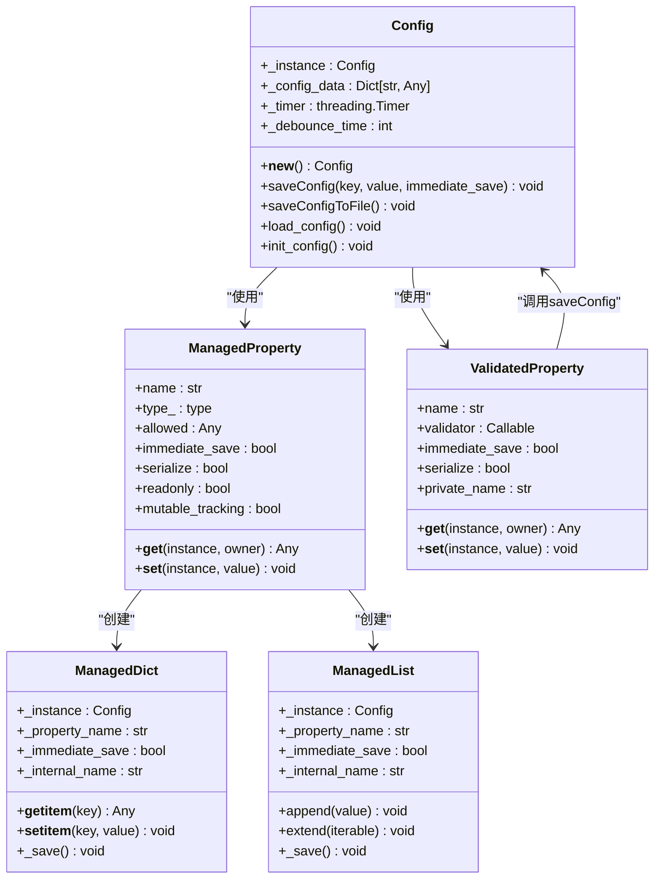
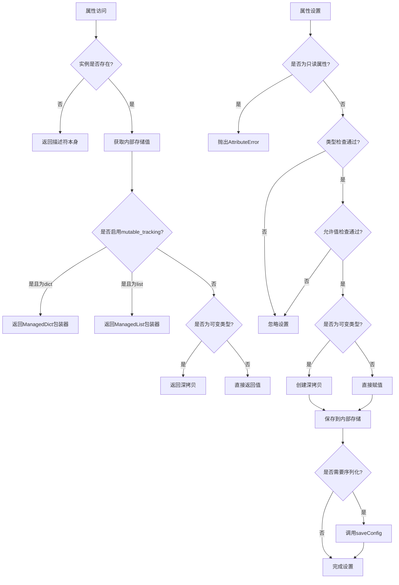
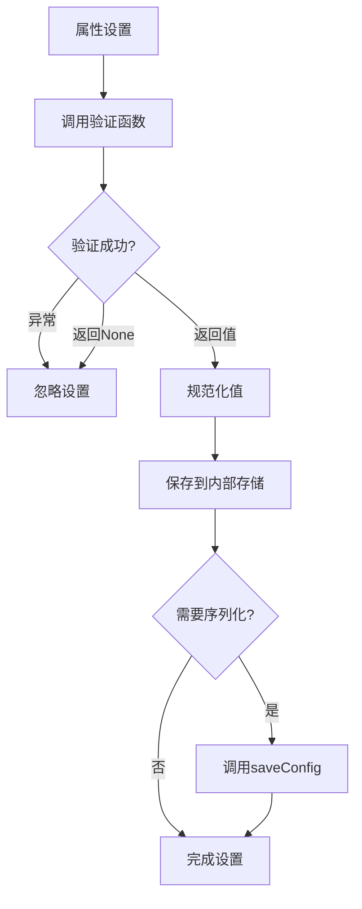

# 配置项定义

<cite>
**本文档中引用的文件**
- [config.py](file://src-python/config.py)
- [config.md](file://src-python/docs/config.md)
- [config_zh.md](file://src-python/docs/config_zh.md)
- [ConfigPage.jsx](file://src-ui/views/app/config_page/ConfigPage.jsx)
- [SettingSection.jsx](file://src-ui/views/app/config_page/setting_section/SettingSection.jsx)
- [OpenSettings.jsx](file://src-ui/views/app/main_page/sidebar_section/open_settings/OpenSettings.jsx)
</cite>

## 目录
1. [概述](#概述)
2. [配置系统架构](#配置系统架构)
3. [配置项分类](#配置项分类)
4. [描述符机制详解](#描述符机制详解)
5. [配置项详细分析](#配置项详细分析)
6. [配置项使用示例](#配置项使用示例)
7. [扩展新配置项](#扩展新配置项)
8. [最佳实践](#最佳实践)
9. [总结](#总结)

## 概述

VRCT项目的配置系统是一个高度类型安全且功能丰富的配置管理框架，通过精心设计的描述符机制实现了配置项的统一管理和持久化存储。该系统采用单例模式确保配置的一致性，通过`ManagedProperty`和`ValidatedProperty`两个核心描述符提供了类型验证、值范围检查和自动保存等功能。

配置系统的核心特点包括：
- **类型安全**：通过描述符机制实现强类型检查
- **自动验证**：内置值范围和格式验证
- **持久化存储**：自动将配置保存到JSON文件
- **防抖优化**：避免频繁的磁盘I/O操作
- **分层管理**：清晰区分只读常量和可写配置

## 配置系统架构



**图表来源**
- [config.py](file://src-python/config.py#L232-L336)
- [config.py](file://src-python/config.py#L66-L228)

**章节来源**
- [config.py](file://src-python/config.py#L531-L580)

## 配置项分类

配置系统根据用途和特性将配置项分为三个主要类别：

### 1. 只读常量（Read Only）

只读常量是应用程序启动时确定的固定值，包含版本信息、路径信息、URL地址等静态数据。这些配置项具有以下特征：

- **不可修改**：设置为`readonly=True`，防止运行时修改
- **不序列化**：设置为`serialize=False`，不保存到JSON文件
- **立即生效**：无需等待保存操作即可使用

**典型配置项**：
- `VERSION`：应用程序版本号
- `PATH_CONFIG`：配置文件路径
- `PATH_LOGS`：日志目录路径
- `MAX_MIC_THRESHOLD`：麦克风阈值上限
- `WATCHDOG_TIMEOUT`：看门狗超时时间

### 2. 运行时配置（Runtime Settings）

运行时配置用于控制应用程序的功能开关和临时状态，这些配置不会被持久化到文件中：

- **临时存储**：仅在内存中保持，程序重启后丢失
- **无序列化**：设置为`serialize=False`
- **即时响应**：修改后立即生效

**典型配置项**：
- `ENABLE_TRANSLATION`：翻译功能开关
- `ENABLE_TRANSCRIPTION_SEND`：发送语音识别开关
- `SELECTABLE_CTRANSLATE2_WEIGHT_TYPE_DICT`：CTranslate2权重状态字典

### 3. 持久化配置（Save Json Data）

持久化配置是用户可调整的长期设置，通过JSON文件进行持久化存储：

- **自动保存**：修改后自动保存到文件
- **防抖机制**：避免频繁I/O操作
- **类型验证**：确保数据格式正确

**典型配置项**：
- `MIC_THRESHOLD`：麦克风阈值
- `UI_LANGUAGE`：界面语言
- `TRANSPARENCY`：窗口透明度
- `FONT_FAMILY`：字体族

**章节来源**
- [config.py](file://src-python/config.py#L577-L736)
- [config.md](file://src-python/docs/config.md#L21-L35)

## 描述符机制详解

### ManagedProperty描述符

`ManagedProperty`是最常用的配置描述符，提供了完整的类型验证和值范围检查功能：



**图表来源**
- [config.py](file://src-python/config.py#L244-L303)

#### 核心特性

1. **类型验证**：通过`type_`参数指定期望类型
2. **值范围检查**：通过`allowed`参数限制有效值
3. **深拷贝保护**：对可变类型进行深拷贝防止外部修改
4. **自动保存**：修改后自动触发保存机制
5. **可变类型跟踪**：支持字典和列表的实时同步

### ValidatedProperty描述符

`ValidatedProperty`专门处理复杂的验证逻辑，通过自定义验证函数实现灵活的数据校验：



**图表来源**
- [config.py](file://src-python/config.py#L318-L335)

#### 验证函数要求

验证函数必须满足以下签名：
```python
def validator(value, instance) -> normalized_value | None
```

验证函数应：
- 返回规范化后的值或`None`
- 处理异常情况
- 不执行副作用操作

**章节来源**
- [config.py](file://src-python/config.py#L232-L336)

## 配置项详细分析

### 只读常量配置项

只读常量配置项在`Config`类中声明时设置了`readonly=True`和`serialize=False`：

```python
# 版本信息
VERSION = ManagedProperty('VERSION', readonly=True, serialize=False)
PATH_CONFIG = ManagedProperty('PATH_CONFIG', readonly=True, serialize=False)

# 应用程序常量
MAX_MIC_THRESHOLD = ManagedProperty('MAX_MIC_THRESHOLD', readonly=True, serialize=False)
WATCHDOG_TIMEOUT = ManagedProperty('WATCHDOG_TIMEOUT', readonly=True, serialize=False)

# 动态生成的常量
SELECTABLE_TAB_NO_LIST = ManagedProperty('SELECTABLE_TAB_NO_LIST', readonly=True, serialize=False)
SELECTABLE_UI_LANGUAGE_LIST = ManagedProperty('SELECTABLE_UI_LANGUAGE_LIST', readonly=True, serialize=False)
```

这些配置项的特点：
- **初始化时机**：在`init_config()`方法中设置
- **访问方式**：直接通过`config.PROPERTY_NAME`访问
- **修改限制**：运行时无法修改，尝试修改会抛出`AttributeError`

### 可写配置项

可写配置项根据复杂程度分为简单配置和复杂配置两类：

#### 简单配置（ManagedProperty）

简单的布尔标志和数值配置：

```python
# 功能开关
ENABLE_TRANSLATION = ManagedProperty('ENABLE_TRANSLATION', type_=bool)
ENABLE_TRANSCRIPTION_SEND = ManagedProperty('ENABLE_TRANSCRIPTION_SEND', type_=bool)

# 数值配置
MIC_THRESHOLD = ManagedProperty('MIC_THRESHOLD', type_=int)
UI_SCALING = ManagedProperty('UI_SCALING', type_=int)

# 字符串配置
UI_LANGUAGE = ManagedProperty('UI_LANGUAGE', type_=str, allowed=lambda v, inst: v in inst.SELECTABLE_UI_LANGUAGE_LIST)
```

#### 复杂配置（ValidatedProperty）

需要特殊验证逻辑的配置：

```python
# 几何形状验证
MAIN_WINDOW_GEOMETRY = ValidatedProperty('MAIN_WINDOW_GEOMETRY', _main_window_geometry_validator, immediate_save=True)

# 热键配置验证
HOTKEYS = ValidatedProperty('HOTKEYS',
    validator=lambda val, inst: (
        {k: (v if (isinstance(v, list) or v is None) else inst.HOTKEYS.get(k))
         for k, v in val.items()} if isinstance(val, dict) and set(val.keys()) == set(inst.HOTKEYS.keys()) else None
    ),
    immediate_save=True
)

# 语言选择验证
SELECTED_YOUR_LANGUAGES = ValidatedProperty('SELECTED_YOUR_LANGUAGES', _selected_your_languages_validator)
SELECTED_TARGET_LANGUAGES = ValidatedProperty('SELECTED_TARGET_LANGUAGES', _selected_target_languages_validator)
```

**章节来源**
- [config.py](file://src-python/config.py#L577-L736)

## 配置项使用示例

### 基本使用模式

```python
from config import config

# 获取只读常量
print(f"应用程序版本: {config.VERSION}")
print(f"配置文件路径: {config.PATH_CONFIG}")

# 修改可写配置（自动保存）
config.MIC_THRESHOLD = 500
config.UI_LANGUAGE = "ja"
config.TRANSPARENCY = 80

# 获取配置值
current_threshold = config.MIC_THRESHOLD
current_language = config.UI_LANGUAGE
```

### 高级使用模式

#### 可变类型配置

```python
# 字典配置（自动同步）
mic_vad_params = config.MIC_VAD_PARAMETERS
mic_vad_params['threshold'] = 0.3
mic_vad_params['min_speech_duration_ms'] = 250
# 自动保存到配置文件

# 列表配置
word_filter = config.MIC_WORD_FILTER
word_filter.append("badword")
word_filter.remove("filterword")
```

#### 热键配置

```python
# 设置热键
hotkeys = config.HOTKEYS
hotkeys['toggle_translation'] = ['Ctrl', 'T']
hotkeys['send_message'] = ['Enter']

# 获取当前热键配置
current_hotkeys = config.HOTKEYS
print(f"翻译切换热键: {current_hotkeys.get('toggle_translation')}")
```

### 实际应用场景

#### 微调音频设置

```python
# 调整麦克风灵敏度
config.MIC_THRESHOLD = 300
config.MIC_AUTOMATIC_THRESHOLD = False
config.MIC_AVG_LOGPROB = -1.5

# 配置VAD参数
vad_params = config.MIC_VAD_PARAMETERS
vad_params['threshold'] = 0.2
vad_params['min_speech_duration_ms'] = 300
vad_params['max_silence_duration_ms'] = 1000
```

#### 用户界面定制

```python
# 界面语言设置
config.UI_LANGUAGE = "zh-Hans"
config.FONT_FAMILY = "Microsoft YaHei"
config.UI_SCALING = 120

# 窗口透明度
config.TRANSPARENCY = 90

# 主窗口几何形状
geometry = {
    'x_pos': 100,
    'y_pos': 100,
    'width': 900,
    'height': 700
}
config.MAIN_WINDOW_GEOMETRY = geometry
```

**章节来源**
- [config.md](file://src-python/docs/config.md#L38-L70)

## 扩展新配置项

### 添加简单配置项

要在配置系统中添加新的简单配置项，按照以下步骤操作：

#### 1. 在Config类中添加描述符

```python
class Config:
    # ... 现有配置项 ...
    
    # 新增配置项
    NEW_FEATURE_ENABLED = ManagedProperty('NEW_FEATURE_ENABLED', type_=bool, default=False)
    NEW_SETTING_VALUE = ManagedProperty('NEW_SETTING_VALUE', type_=int, allowed=[1, 2, 3, 4, 5])
```

#### 2. 在init_config()方法中设置默认值

```python
def init_config(self):
    # ... 现有初始化代码 ...
    
    # 设置新配置项的默认值
    self._NEW_FEATURE_ENABLED = False
    self._NEW_SETTING_VALUE = 3
```

#### 3. （可选）添加验证逻辑

如果需要更复杂的验证，可以使用ValidatedProperty：

```python
def _new_setting_validator(val, inst):
    if not isinstance(val, int):
        return None
    if val < 1 or val > 10:
        return None
    return val

class Config:
    # ... 现有配置项 ...
    
    # 使用ValidatedProperty
    NEW_SETTING_VALUE = ValidatedProperty('NEW_SETTING_VALUE', _new_setting_validator)
```

### 添加可变类型配置

#### 字典配置

```python
# 描述符声明
NEW_DICTIONARY_CONFIG = ManagedProperty('NEW_DICTIONARY_CONFIG', type_=dict, mutable_tracking=True)

# 初始化
def init_config(self):
    # ... 现有初始化代码 ...
    
    # 设置默认值
    self._NEW_DICTIONARY_CONFIG = {
        'option1': True,
        'option2': False,
        'count': 0
    }
```

#### 列表配置

```python
# 描述符声明
NEW_LIST_CONFIG = ManagedProperty('NEW_LIST_CONFIG', type_=list, mutable_tracking=True)

# 初始化
def init_config(self):
    # ... 现有初始化代码 ...
    
    # 设置默认值
    self._NEW_LIST_CONFIG = ['default_item1', 'default_item2']
```

### 添加复杂验证配置

#### 自定义验证函数

```python
def _complex_validation_validator(val, inst):
    """复杂验证逻辑"""
    if not isinstance(val, dict):
        return None
    
    # 验证必需字段
    required_fields = ['host', 'port', 'timeout']
    if not all(field in val for field in required_fields):
        return None
    
    # 验证字段类型
    if not isinstance(val['host'], str) or not isinstance(val['port'], int):
        return None
    
    # 验证端口号范围
    if not (1 <= val['port'] <= 65535):
        return None
    
    # 验证超时时间
    if not (0.1 <= val['timeout'] <= 30.0):
        return None
    
    return val

# 使用验证器
COMPLEX_CONFIG = ValidatedProperty('COMPLEX_CONFIG', _complex_validation_validator)
```

### 配置项命名规范

1. **使用大写字母**：符合Python常量命名约定
2. **描述性名称**：清晰表达配置用途
3. **层次化命名**：使用下划线分隔相关配置
   - `MIC_`：麦克风相关配置
   - `SPEAKER_`：扬声器相关配置
   - `UI_`：界面相关配置
   - `TRANSLATION_`：翻译相关配置
   - `TRANSCRIPTION_`：语音识别相关配置

### 最佳实践

1. **类型声明**：始终指定`type_`参数
2. **范围限制**：使用`allowed`参数限制有效值
3. **默认值**：在`init_config()`中设置合理默认值
4. **文档注释**：为每个配置项添加清晰的文档
5. **向后兼容**：新增配置项时考虑现有配置文件的兼容性

**章节来源**
- [config.py](file://src-python/config.py#L531-L1027)

## 最佳实践

### 配置项设计原则

1. **单一职责**：每个配置项只负责一个特定功能
2. **类型安全**：严格限制配置项的数据类型
3. **验证优先**：在设置前进行充分验证
4. **默认值合理**：提供有意义的默认值
5. **向后兼容**：新增配置项不影响现有配置

### 性能优化

1. **防抖机制**：频繁修改的配置使用防抖保存
2. **延迟初始化**：可选模块采用延迟加载
3. **内存管理**：及时清理不再使用的配置项
4. **批量操作**：对多个相关配置进行批量更新

### 错误处理

1. **异常捕获**：在配置保存过程中捕获异常
2. **降级策略**：配置加载失败时使用默认值
3. **日志记录**：记录配置相关的错误信息
4. **用户反馈**：向用户提供配置问题的提示

### 安全考虑

1. **敏感信息**：避免在配置中存储敏感信息
2. **权限控制**：限制配置修改的权限
3. **数据验证**：严格验证所有输入数据
4. **备份恢复**：提供配置备份和恢复机制

## 总结

VRCT项目的配置系统通过精心设计的描述符机制实现了高度类型安全和功能丰富的配置管理。`ManagedProperty`和`ValidatedProperty`两个核心描述符分别处理简单配置和复杂配置，提供了完整的类型验证、值范围检查和自动保存功能。

系统的三大配置分类——只读常量、运行时配置和持久化配置——清晰地划分了不同类型的配置需求，确保了配置管理的有序性和效率。通过单例模式保证了配置的一致性，通过防抖机制优化了性能，通过安全的导入机制增强了系统的鲁棒性。

对于开发者而言，这个配置系统不仅提供了强大的功能，还展示了优秀的软件设计原则。无论是日常使用还是扩展新功能，都应当遵循既定的设计模式和最佳实践，以保持系统的整体质量和可维护性。