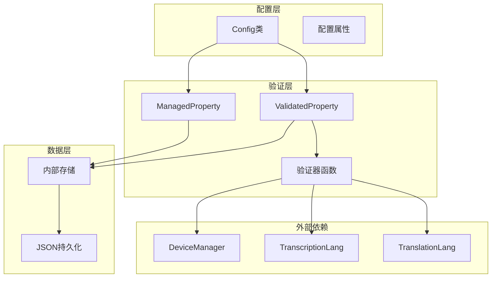
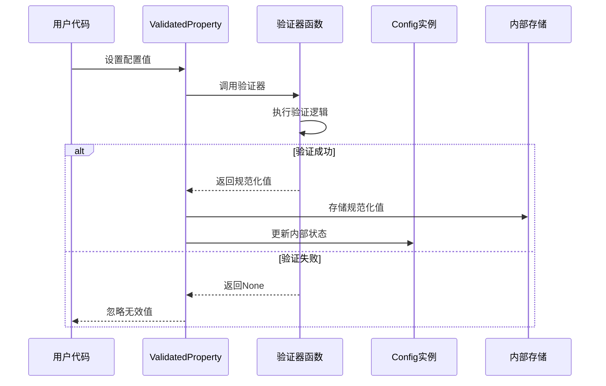
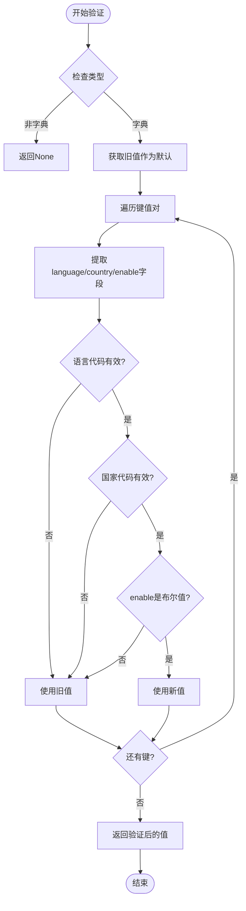
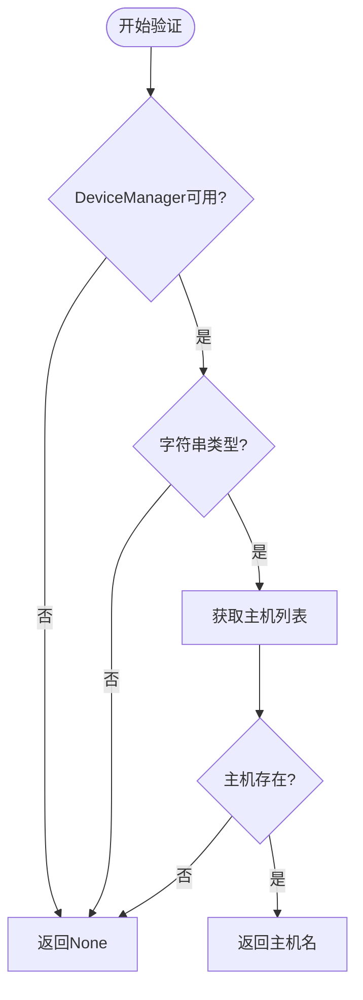
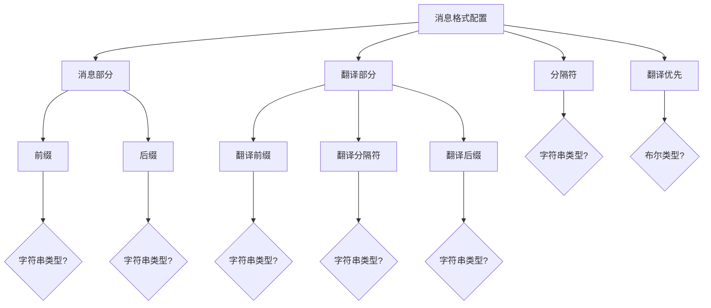
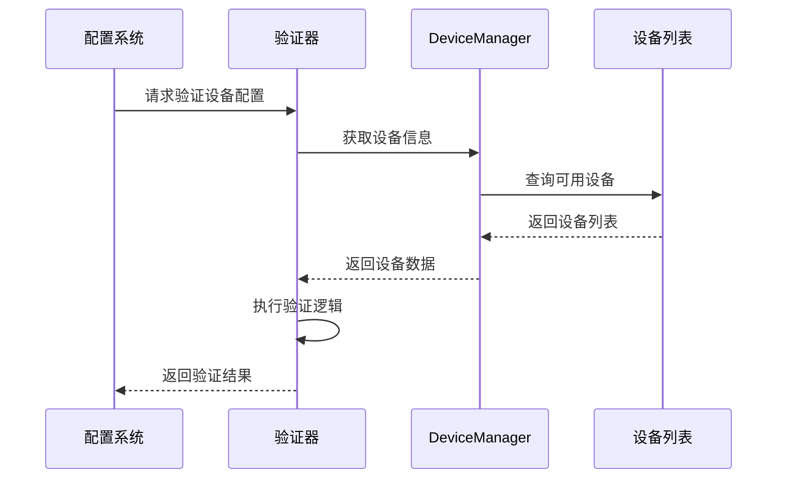
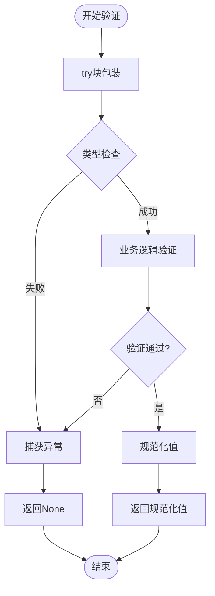
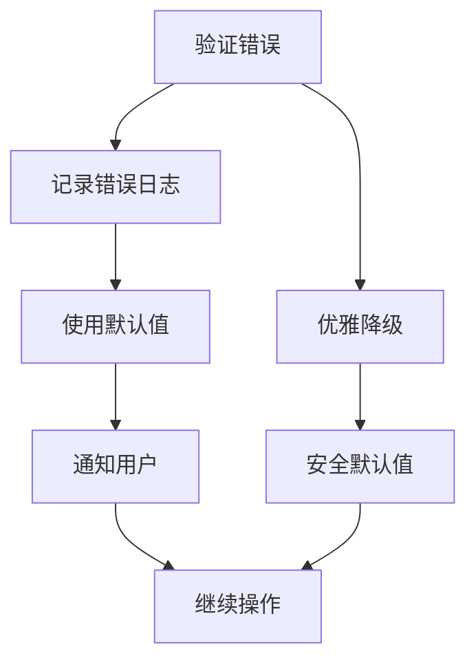

# 配置验证机制

<cite>
**本文档引用的文件**
- [config.py](file://src-python/config.py)
- [device_manager.py](file://src-python/device_manager.py)
- [utils.py](file://src-python/utils.py)
- [transcription_languages.md](file://src-python/docs/details/transcription_languages.md)
- [model_zh.md](file://src-python/docs/model_zh.md)
</cite>

## 目录
1. [简介](#简介)
2. [配置验证架构概述](#配置验证架构概述)
3. [ValidatedProperty描述符详解](#validatedproperty描述符详解)
4. [核心验证器函数分析](#核心验证器函数分析)
5. [复杂数据结构验证](#复杂数据结构验证)
6. [设备依赖验证机制](#设备依赖验证机制)
7. [验证器开发指南](#验证器开发指南)
8. [最佳实践与故障排除](#最佳实践与故障排除)
9. [总结](#总结)

## 简介

VRCT项目采用了一套基于描述符（Descriptor）模式的配置验证系统，通过`ValidatedProperty`类实现了对复杂配置数据结构的严格验证。该系统不仅确保了配置数据的有效性和一致性，还提供了与外部模块（如设备管理器）的智能交互能力。

这套验证机制的核心优势在于：
- **类型安全**：确保配置值符合预期的数据类型
- **结构验证**：深度检查复杂嵌套数据结构的完整性
- **动态验证**：支持基于外部状态的条件验证
- **错误恢复**：在验证失败时提供合理的默认值
- **性能优化**：通过延迟加载和缓存机制提升性能

## 配置验证架构概述

VRCT的配置验证系统采用了分层架构设计，主要包含以下组件：



**图表来源**
- [config.py](file://src-python/config.py#L531-L800)
- [device_manager.py](file://src-python/device_manager.py#L57-L120)

**章节来源**
- [config.py](file://src-python/config.py#L531-L800)

## ValidatedProperty描述符详解

`ValidatedProperty`是VRCT配置系统的核心组件，它继承了Python描述符协议，为复杂的配置验证提供了灵活而强大的框架。

### 描述符工作原理



**图表来源**
- [config.py](file://src-python/config.py#L305-L336)

### ValidatedProperty类实现

ValidatedProperty类的设计遵循了Python描述符协议的标准实现：

| 方法 | 功能 | 参数 | 返回值 |
|------|------|------|--------|
| `__init__` | 初始化描述符 | name, validator, immediate_save, serialize | None |
| `__get__` | 获取属性值 | instance, owner | 属性值或描述符本身 |
| `__set__` | 设置属性值 | instance, value | None |

验证过程的关键步骤包括：
1. **调用验证器**：执行传入的验证函数
2. **异常处理**：捕获验证过程中的任何异常
3. **值检查**：验证器返回None时忽略该值
4. **存储更新**：成功验证后更新内部存储
5. **持久化**：根据配置决定是否立即保存到JSON

**章节来源**
- [config.py](file://src-python/config.py#L305-L336)

## 核心验证器函数分析

VRCT项目中定义了多个专门的验证器函数，每个都针对特定类型的配置进行精确验证。

### _selected_your_languages_validator

这个验证器专门处理用户语言选择的复杂数据结构：



**图表来源**
- [config.py](file://src-python/config.py#L445-L462)

验证器的核心逻辑包括：
- **类型检查**：确保输入是字典类型
- **字段验证**：检查必需的language、country、enable字段
- **有效性验证**：使用transcription_lang进行语言和国家代码验证
- **默认值回退**：验证失败时使用当前配置值

### _selected_target_languages_validator

与用户语言验证器类似，但针对目标语言设置：

| 验证项目 | 检查内容 | 失败处理 |
|----------|----------|----------|
| 数据类型 | 字典类型 | 返回None |
| 语言代码 | 在transcription_lang中存在 | 使用旧值 |
| 国家代码 | 在指定语言下存在 | 使用旧值 |
| 启用状态 | 布尔值类型 | 使用旧值 |
| 结构完整性 | 键值对结构正确 | 使用旧值 |

### _mic_host_validator

麦克风主机验证器展示了如何与外部模块集成：



**图表来源**
- [config.py](file://src-python/config.py#L491-L498)

**章节来源**
- [config.py](file://src-python/config.py#L445-L462)
- [config.py](file://src-python/config.py#L491-L498)

## 复杂数据结构验证

VRCT的配置系统需要处理多种复杂的嵌套数据结构，验证器必须能够深入检查这些结构的每一层。

### 主窗口几何配置验证

主窗口几何配置是一个典型的复杂验证场景：

| 字段 | 类型要求 | 验证规则 | 默认值处理 |
|------|----------|----------|------------|
| x | int | 整数值 | 使用原始值或默认值 |
| y | int | 整数值 | 使用原始值或默认值 |
| width | int | 正整数值 | 使用原始值或默认值 |
| height | int | 正整数值 | 使用原始值或默认值 |

### 消息格式配置验证

消息格式配置涉及多层嵌套结构：



**图表来源**
- [config.py](file://src-python/config.py#L393-L414)

### 计算设备配置验证

计算设备配置需要验证设备信息的完整性：

| 验证层次 | 检查项目 | 实现方式 |
|----------|----------|----------|
| 结构验证 | 字典结构正确 | 键名匹配检查 |
| 设备信息 | 设备类型、索引、名称 | 类型和范围验证 |
| 计算类型 | 支持的计算类型列表 | 集合成员检查 |
| 深度验证 | 嵌套字段完整性 | 递归验证 |

**章节来源**
- [config.py](file://src-python/config.py#L342-L414)
- [config.py](file://src-python/config.py#L522-L528)

## 设备依赖验证机制

VRCT的配置验证系统与设备管理器紧密集成，形成了一个智能的设备依赖验证网络。

### 设备验证流程



**图表来源**
- [config.py](file://src-python/config.py#L491-L520)
- [device_manager.py](file://src-python/device_manager.py#L459-L520)

### 设备验证器类型

| 验证器 | 功能 | 依赖模块 | 验证内容 |
|--------|------|----------|----------|
| _mic_host_validator | 验证麦克风主机 | DeviceManager | 主机名称存在性 |
| _mic_device_validator | 验证麦克风设备 | DeviceManager | 设备名称存在性 |
| _speaker_device_validator | 验证扬声器设备 | DeviceManager | 设备名称存在性 |
| _compute_device_validator | 验证计算设备 | 内部列表 | 设备信息完整性 |

### 动态设备检测

设备验证器具有动态检测能力：

1. **运行时检查**：每次设置时重新查询设备状态
2. **容错处理**：设备管理器不可用时优雅降级
3. **实时同步**：配置自动反映设备变化
4. **状态跟踪**：监控设备状态变更事件

**章节来源**
- [config.py](file://src-python/config.py#L491-L520)
- [device_manager.py](file://src-python/device_manager.py#L459-L520)

## 验证器开发指南

基于VRCT项目的实践经验，以下是开发自定义验证器的最佳实践指南。

### 验证器函数签名

所有验证器函数必须遵循统一的签名：

```python
def custom_validator(value, instance) -> Optional[Any]:
    """
    自定义验证器函数
    
    参数:
        value: 待验证的值
        instance: Config类的实例
        
    返回:
        验证通过时返回规范化后的值
        验证失败时返回None
    """
```

### 验证器开发模板



### 验证器开发原则

| 原则 | 说明 | 示例 |
|------|------|------|
| 异常安全 | 包装在try块中防止崩溃 | `try: ... except: return None` |
| 类型检查 | 首先验证基本类型 | `if not isinstance(val, dict): return None` |
| 渐进验证 | 从简单到复杂的验证顺序 | 先结构再内容 |
| 默认值策略 | 验证失败时使用合理默认 | 使用旧值或安全默认 |
| 性能考虑 | 避免不必要的计算 | 缓存昂贵的操作结果 |

### 高级验证模式

#### 条件验证

```python
def conditional_validator(val, inst):
    # 基础类型检查
    if not isinstance(val, dict):
        return None
    
    # 条件验证
    if inst.ENABLE_ADVANCED_FEATURES:
        return advanced_validation(val, inst)
    else:
        return basic_validation(val, inst)
```

#### 多层次验证

```python
def hierarchical_validator(val, inst):
    # 第一层：结构验证
    if not validate_structure(val):
        return None
    
    # 第二层：业务规则验证
    if not validate_business_rules(val, inst):
        return None
    
    # 第三层：外部依赖验证
    if not validate_external_dependencies(val, inst):
        return None
    
    return val
```

### 测试验证器

验证器测试应覆盖以下场景：

| 测试类型 | 测试内容 | 预期结果 |
|----------|----------|----------|
| 正常输入 | 符合预期格式的输入 | 返回规范化值 |
| 边界值 | 最小/最大边界值 | 正确处理 |
| 异常输入 | 非法类型或格式 | 返回None |
| 空值处理 | None或空值 | 合理默认值 |
| 外部依赖 | 设备管理器不可用 | 优雅降级 |

**章节来源**
- [config.py](file://src-python/config.py#L305-L336)

## 最佳实践与故障排除

### 配置验证最佳实践

#### 1. 验证器设计原则

- **单一职责**：每个验证器只负责一种数据类型的验证
- **幂等性**：多次验证相同值应产生相同结果
- **可预测性**：验证行为应该可预测且一致
- **性能优化**：避免重复计算和昂贵操作

#### 2. 错误处理策略



#### 3. 性能优化技巧

| 优化技术 | 应用场景 | 效果 |
|----------|----------|------|
| 缓存验证结果 | 重复验证相同值 | 减少计算开销 |
| 延迟初始化 | 外部依赖检查 | 避免导入时阻塞 |
| 异步验证 | 耗时验证操作 | 提升响应性 |
| 批量验证 | 多个配置项 | 减少重复检查 |

### 常见问题与解决方案

#### 1. 验证器循环依赖

**问题**：验证器之间相互依赖导致死循环

**解决方案**：
```python
# 避免直接调用其他验证器
def validator_a(val, inst):
    # 不要这样：other_validator(val, inst)
    # 改为独立验证逻辑
    return validate_independent_logic(val)
```

#### 2. 外部依赖失效

**问题**：设备管理器不可用导致验证失败

**解决方案**：
```python
def robust_validator(val, inst):
    try:
        # 尝试外部验证
        return external_validation(val, inst)
    except Exception:
        # 优雅降级
        return fallback_validation(val)
```

#### 3. 配置迁移问题

**问题**：版本升级后配置格式不兼容

**解决方案**：
```python
def migration_safe_validator(val, inst):
    # 检查配置版本
    if not check_version_compatibility(val):
        return migrate_config(val)
    
    return standard_validation(val)
```

### 调试和监控

#### 验证器调试技巧

1. **日志记录**：在关键验证点添加日志
2. **单元测试**：为每个验证器编写全面测试
3. **边界测试**：测试各种边界条件
4. **性能分析**：监控验证器执行时间

#### 监控指标

| 指标 | 说明 | 目标值 |
|------|------|--------|
| 验证成功率 | 验证成功的百分比 | >99% |
| 平均验证时间 | 单次验证的平均耗时 | <10ms |
| 错误率 | 验证失败的频率 | <1% |
| 外部依赖可用性 | 设备管理器等外部服务的可用性 | >95% |

**章节来源**
- [config.py](file://src-python/config.py#L305-L336)
- [utils.py](file://src-python/utils.py#L24-L57)

## 总结

VRCT项目的配置验证机制展现了现代软件架构中配置管理的最佳实践。通过`ValidatedProperty`描述符系统，项目实现了：

### 核心优势

1. **类型安全**：严格的类型检查确保配置数据的正确性
2. **结构完整性**：深度验证保证复杂数据结构的一致性
3. **外部集成**：智能的设备依赖验证机制
4. **错误恢复**：优雅的错误处理和默认值策略
5. **性能优化**：高效的验证算法和缓存机制

### 技术创新

- **描述符模式**：利用Python描述符协议实现声明式配置验证
- **函数式验证**：基于纯函数的验证器设计
- **动态验证**：支持运行时状态感知的验证逻辑
- **渐进式验证**：多层次的验证策略

### 应用价值

这套配置验证系统不仅保证了VRCT应用的稳定性和可靠性，还为其他大型项目的配置管理提供了宝贵的参考经验。其设计理念和实现方式可以广泛应用于需要复杂配置管理的软件系统中。

通过深入理解这套验证机制，开发者可以构建更加健壮、可维护的配置管理系统，为用户提供更好的使用体验。