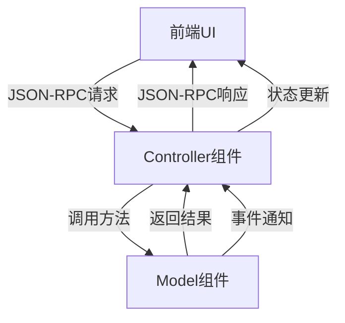
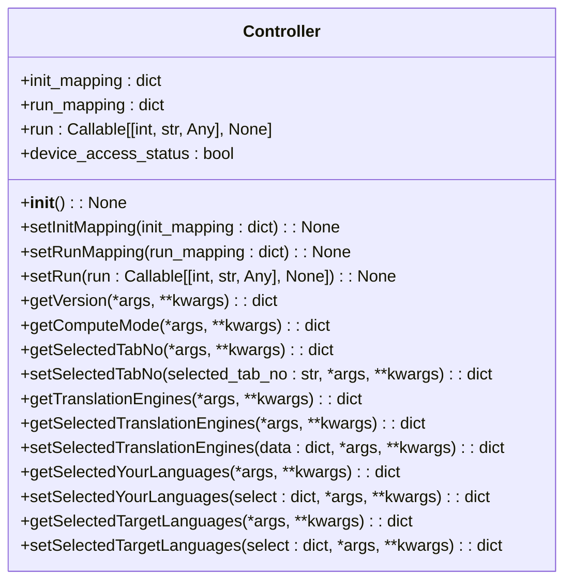
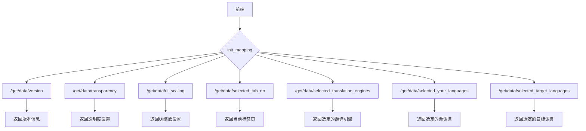
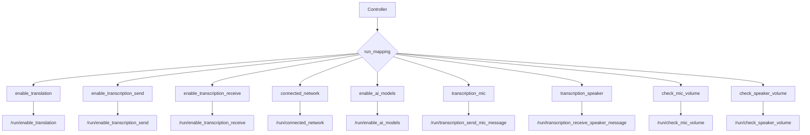
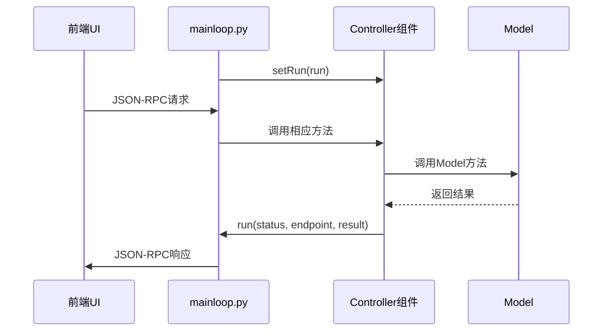
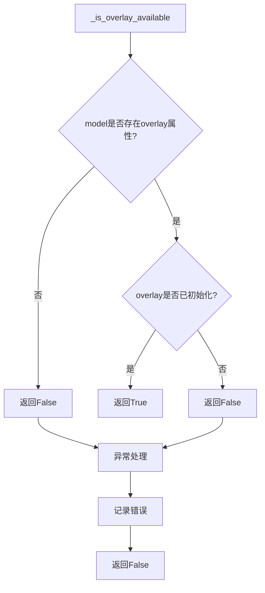
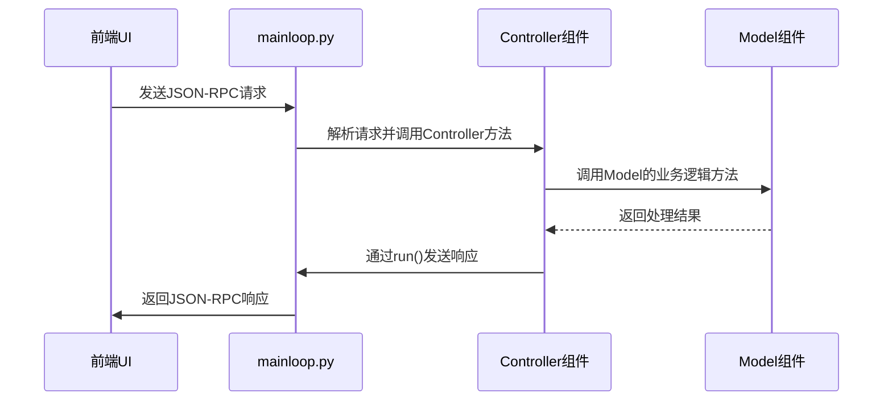
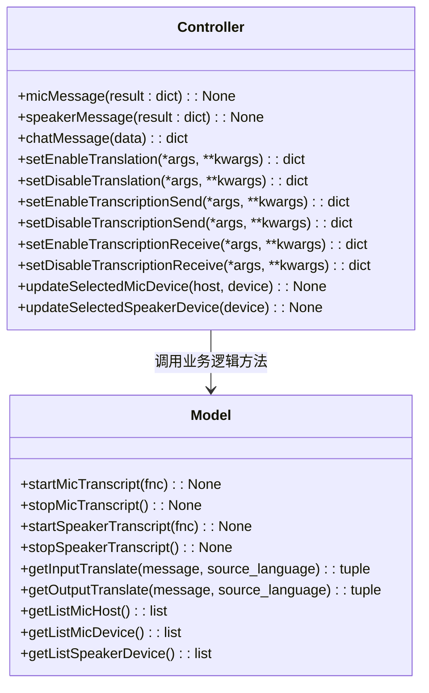

# Controller组件

<cite>
**Referenced Files in This Document**   
- [controller.py](file://src-python/controller.py)
- [mainloop.py](file://src-python/mainloop.py)
- [model.py](file://src-python/model.py)
- [config.py](file://src-python/config.py)
</cite>

## 目录
1. [简介](#简介)
2. [架构概述](#架构概述)
3. [核心功能分析](#核心功能分析)
4. [请求路由与响应分发机制](#请求路由与响应分发机制)
5. [与mainloop的通信机制](#与mainloop的通信机制)
6. [依赖检查与安全机制](#依赖检查与安全机制)
7. [JSON-RPC请求处理流程](#json-rpc请求处理流程)
8. [状态管理与业务逻辑协调](#状态管理与业务逻辑协调)

## 简介
Controller组件是VRCT项目的核心业务逻辑控制层，作为前端UI与后端Model之间的协调中心。它负责处理用户指令、管理应用状态，并协调前后端的数据交互。Controller通过`init_mapping`和`run_mapping`字典实现请求路由和响应分发，通过`setRun()`方法与`mainloop.py`建立通信，并通过`_is_overlay_available()`等方法实现安全的依赖检查。

**Section sources**
- [controller.py](file://src-python/controller.py#L11-L3133)

## 架构概述
Controller组件采用典型的MVC（Model-View-Controller）架构模式，作为业务逻辑的控制中心，协调前端UI与后端Model之间的交互。它接收来自前端的用户指令，处理业务逻辑，并调用Model执行具体操作，最后将结果返回给前端。

**Diagram sources **
- [controller.py](file://src-python/controller.py#L11-L3133)
- [model.py](file://src-python/model.py#L81-L1204)

**Section sources**
- [controller.py](file://src-python/controller.py#L11-L3133)
- [model.py](file://src-python/model.py#L81-L1204)

## 核心功能分析
Controller组件的核心功能包括状态管理、请求处理、业务逻辑协调和前后端通信。它通过一系列方法实现对应用状态的控制，如启用/禁用翻译功能、管理设备选择、控制覆盖层显示等。

### 状态管理功能
Controller提供了丰富的状态管理方法，允许前端查询和修改应用的各种配置状态。

**Diagram sources **
- [controller.py](file://src-python/controller.py#L11-L3133)

**Section sources**
- [controller.py](file://src-python/controller.py#L11-L3133)

## 请求路由与响应分发机制
Controller组件通过`init_mapping`和`run_mapping`两个字典实现请求路由和响应分发机制。`init_mapping`用于存储初始化时的配置查询端点，`run_mapping`用于存储运行时的响应端点。

### init_mapping字典
`init_mapping`字典存储了所有初始化配置的查询端点，这些端点在应用启动时被批量查询，用于获取初始配置状态。

**Diagram sources **
- [mainloop.py](file://src-python/mainloop.py#L85-L405)

**Section sources**
- [mainloop.py](file://src-python/mainloop.py#L85-L405)
- [controller.py](file://src-python/controller.py#L100-L110)

### run_mapping字典
`run_mapping`字典存储了所有运行时响应的端点映射，用于将Controller的响应发送到前端的特定路径。

**Diagram sources **
- [mainloop.py](file://src-python/mainloop.py#L13-L76)

**Section sources**
- [mainloop.py](file://src-python/mainloop.py#L13-L76)
- [controller.py](file://src-python/controller.py#L51-L187)

## 与mainloop的通信机制
Controller通过`setRun()`方法与`mainloop.py`建立通信，实现前后端的数据交互。`mainloop.py`负责接收前端的JSON-RPC请求，并将其分发给Controller处理，然后通过`run`回调函数将响应返回给前端。

### setRun方法
`setRun()`方法用于设置Controller的响应函数，该函数由`mainloop.py`提供，用于将Controller的响应发送回前端。

**Diagram sources **
- [mainloop.py](file://src-python/mainloop.py#L83)
- [controller.py](file://src-python/controller.py#L47-L48)

**Section sources**
- [mainloop.py](file://src-python/mainloop.py#L78-L83)
- [controller.py](file://src-python/controller.py#L47-L48)

## 依赖检查与安全机制
Controller组件通过`_is_overlay_available()`等方法实现安全的依赖检查，确保在调用Model组件之前，相关依赖已经正确初始化。

### _is_overlay_available方法
`_is_overlay_available()`方法安全地检查覆盖层是否可用，避免在Model未完全初始化时出现AttributeError。

**Diagram sources **
- [controller.py](file://src-python/controller.py#L29-L39)

**Section sources**
- [controller.py](file://src-python/controller.py#L29-L39)

## JSON-RPC请求处理流程
Controller组件处理来自前端的JSON-RPC请求，调用Model执行具体业务逻辑，并将结果返回给前端。整个处理流程包括请求接收、业务逻辑处理、Model调用和响应返回。

### 请求处理流程

**Diagram sources **
- [mainloop.py](file://src-python/mainloop.py#L439-L458)
- [controller.py](file://src-python/controller.py#L51-L187)

**Section sources**
- [mainloop.py](file://src-python/mainloop.py#L439-L458)
- [controller.py](file://src-python/controller.py#L51-L187)

## 状态管理与业务逻辑协调
Controller组件作为业务逻辑的协调中心，负责管理应用的各种状态，并协调前后端的交互。它通过一系列方法实现对翻译、语音识别、设备管理等功能的控制。

### 业务逻辑协调
Controller通过调用Model的方法来执行具体的业务逻辑，如语音识别、翻译、设备管理等，并将结果返回给前端。

**Diagram sources **
- [controller.py](file://src-python/controller.py#L254-L746)
- [model.py](file://src-python/model.py#L616-L764)

**Section sources**
- [controller.py](file://src-python/controller.py#L254-L746)
- [model.py](file://src-python/model.py#L616-L764)